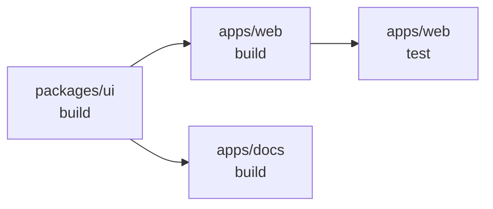

# Monorepos & Workspaces

## Context

In the early days of frontend engineering, each project lived in its own git repository. That
model — the polyrepo — gives teams full autonomy: independent deployment cycles, separate
CI pipelines, package manager lockfiles that never conflict. It works well when packages evolve
independently and changes rarely cross boundaries.

At scale, the polyrepo model breaks down. A UI design system shared by five applications is
a separate npm package. To ship a fix that touches the design system and two consuming apps,
a team must open three PRs across three repositories, coordinate three reviews, publish
a new design system version to npm, update the dependency in each consuming app, and wait
for a propagation window. The actual code change — which might be five lines — is buried
in a multi-day, multi-team coordination problem. Git submodules are the classic escape
hatch, but they are famously fragile: submodule state is not automatically synchronized,
nested submodules create deep trees of manual updates, and CI configuration duplicates
across every consumer.

The monorepo model puts all related packages — applications, libraries, shared configs —
into a single git repository. A change that spans three packages is a single commit, a
single PR, a single CI run. Internal packages reference each other directly by symlink
rather than through a registry publish cycle. Tooling, CI configuration, and lint rules
are shared at the root.

This is not a new idea. Google, Meta, and Microsoft have operated monorepos at millions-of-files
scale for over a decade. In the JavaScript ecosystem, projects like Babel, Jest, React, and
Vue adopted monorepos early. The challenge for most teams was tooling: `npm install` does
not understand multi-package workspaces, and running `npm run build` in every package
manually does not scale. Package managers added workspace support (npm 7 in 2020, pnpm and
Yarn earlier), and purpose-built task orchestrators — Turborepo and Nx — appeared to
solve the remaining gap: efficient, cached, parallelized task execution across dozens or
hundreds of packages.

## Design Thinking

**Why monorepos win for large teams: the cross-cutting change problem.**
In a polyrepo, sharing code requires either publishing to npm (slow feedback loop: publish,
wait for propagation, update consumer's `package.json`, install, test) or using git submodules
(fragile, manual, error-prone). A refactor that touches a shared utility and three consumers
requires coordinated changes across four repositories, four PRs, and four CI pipelines — with
no way to make the change atomic. If the refactor is staged (ship the library first, then
update consumers), the intermediate state where some consumers use the new API and some use
the old API must be managed explicitly. In a monorepo, the same refactor is one commit, one
PR, one CI run. The change is atomic by default.

**Why `pnpm -r run build` is not enough at scale.**
pnpm's recursive run (`pnpm -r run build`) iterates over all workspace packages and runs
their `build` script. For a small monorepo with five packages, this is entirely sufficient.
For a monorepo with fifty packages, it has two problems. First, it is sequential by default:
packages build one at a time, even when they have no dependency on each other. A CI run that
could finish in four minutes of parallel work takes twenty minutes. Second, there is no
caching: every CI run rebuilds every package from scratch, even packages whose source files
have not changed since the last run. Turborepo and Nx solve both problems by modeling tasks
as a dependency graph (DAG), running independent tasks in parallel, and hashing task inputs
to skip tasks whose outputs are already cached.

**Why Turborepo and Nx diverge in philosophy.**
Turborepo is minimal by design. It adds a task DAG and a caching layer to your existing
package manager and existing `package.json` scripts. There is one configuration file
(`turbo.json`). It does not impose a project structure, does not generate code, and does
not enforce boundaries between packages. This makes it easy to adopt incrementally — you
can add Turborepo to an existing pnpm workspace in an afternoon.

Nx is opinionated and comprehensive. It builds a detailed project graph from source analysis,
tracks every file dependency between packages, provides code generators (`nx generate`),
enforces module boundary rules via an ESLint plugin, and offers distributed task execution
(Nx Cloud) with fine-grained replay of individual task results. The additional power requires
more configuration and a steeper learning curve. Nx is the better choice when a large
organization needs governance: enforced boundaries between team-owned packages, centrally
managed generators for consistent scaffolding, and granular visibility into which tasks ran,
on which CI agents, and why.

**The polyrepo vs monorepo tradeoff.**
Monorepos require upfront tooling investment: workspace configuration, a task runner, a
coherent dependency strategy. Very large repositories (millions of files, hundreds of
packages) can stress git operations — `git status`, `git log`, and IDE indexing become
slow. Companies operating at that scale (Google, Meta) use specialized tools (Mercurial,
virtual filesystems like Eden) that most teams will never need. For most teams — up to a
few hundred packages — a pnpm workspace with Turborepo or Nx handles the scale
comfortably. The stronger argument against monorepos is team autonomy: every team shares
the same CI pipeline, the same root tooling configuration, and the same release gate.
A flaky test in one package blocks the whole CI run. Establishing clear ownership
(via `CODEOWNERS`) and task filtering (`turbo run build --filter=./apps/web`) mitigates
this, but the coordination overhead is real.

**Internal packages: source vs compiled.**
Internal packages — a shared design system, a utility library, a common types package —
can be consumed in two ways. The simpler approach: configure TypeScript `paths` in the
root `tsconfig.json` to map the package name to its source directory. Consuming packages
import directly from source; no build step is needed for the internal package. This works
well for TypeScript-only packages with no separate compile step. The more explicit approach:
the internal package has its own `build` script that produces a `dist/` directory, and
consuming packages reference `dist/`. This mirrors how the package would be used if
published externally, and Turborepo can cache the build — consuming apps do not rebuild
the library unless its source changes.

## Best Practices

**SHOULD declare `outputs` explicitly in every `turbo.json` task, including all directories the task writes to.**
If `outputs` is omitted, Turborepo marks a task as cached but does not restore any files on a cache hit. A downstream task that expects `dist/` to exist will fail. Every directory the build script writes — `"dist/**"`, `".next/**"`, `"build/**"` — must appear in `outputs` so Turborepo can restore them on a cache hit.

**MUST mark the root `package.json` and all internal-only packages with `"private": true`.**
The monorepo root is a workspace manifest, not a publishable package. Without `"private": true`, running `pnpm publish` at the root accidentally publishes the manifest. All workspace roots and packages intended only for internal consumption MUST be marked private to prevent accidental registry publication.

**SHOULD manage workspace dependencies from the repository root, not from inside individual package directories.**
Running `npm install` or `pnpm install` inside a package subdirectory creates a separate `node_modules` and lockfile in that directory, which breaks workspace symlinks and creates a conflicting, isolated dependency resolution. Always use `pnpm add <package> --filter <workspace>` from the root to install dependencies into a specific workspace.

**SHOULD start with `pnpm -r run build` and add Turborepo only when CI time becomes a concrete problem.**
For monorepos with five or fewer packages, recursive pnpm commands are sufficient. Turborepo's task DAG, caching, and parallel execution become worthwhile when sequential builds or rebuilding unchanged packages visibly slows CI. Adopting Turborepo incrementally by adding `turbo.json` to an existing workspace requires no restructuring.

**SHOULD mark tasks that have non-deterministic outputs or make network calls with `"cache": false` in `turbo.json`.**
Turborepo's cache is content-hash-based: the same inputs always produce the same cache hit. If a task fetches live data, writes timestamps, or produces random output, caching will restore stale results. Dev server tasks (`dev`) should also be marked `"cache": false` and `"persistent": true` so Turborepo runs them last and keeps them alive.

## Visual

### Turborepo Task DAG

The diagram below shows a small monorepo with three tasks across two apps and one shared
library. Arrows point from dependency to dependent — a task waits for everything its arrow
points from.



With `dependsOn: ["^build"]` configured, `turbo run build test` will:

1. Build `packages/ui` first (no upstream dependencies).
2. Build `apps/web` and `apps/docs` in parallel once `packages/ui:build` completes.
3. Run `apps/web:test` after `apps/web:build` completes.

If `packages/ui`'s source files have not changed since the last run, step 1 is a
cache hit — Turborepo restores `dist/` from cache and skips re-executing the build script.

## Example

### 1. `pnpm-workspace.yaml`

Place at the repository root. Declares which directories contain workspace packages.

```yaml
packages:
  - 'apps/*'       # Next.js apps, Remix apps, etc.
  - 'packages/*'   # Shared libraries and configs

  # Explicitly exclude directories that are not real packages.
  - '!**/test/**'
  - '!**/fixtures/**'
```

### 2. `turbo.json` — task pipeline

Turborepo reads this file at the repository root. Each key in `tasks` is a task name
that maps to `package.json` `scripts` entries.

```json
{
  "$schema": "https://turbo.build/schema.json",
  "tasks": {
    "build": {
      "dependsOn": ["^build"],
      "outputs": ["dist/**", ".next/**", "!.next/cache/**"]
    },
    "test": {
      "dependsOn": ["build"],
      "outputs": []
    },
    "lint": {
      "outputs": []
    },
    "dev": {
      "cache": false,
      "persistent": true
    }
  }
}
```

Key properties:

- `dependsOn: ["^build"]` — the `^` prefix means "run `build` in all upstream dependencies
  first." An app that depends on a library will build the library before building itself.
- `dependsOn: ["build"]` (no `^`) — the same package's `build` must complete before `test`
  starts. Used for same-package ordering.
- `outputs` — the file globs Turborepo caches. On a cache hit, these files are restored
  from cache instead of re-running the script. Empty array means no file outputs are cached
  (logs are still cached).
- `cache: false` — disables caching entirely. Used for `dev` servers and other long-running
  tasks that should never be cached.
- `persistent: true` — marks tasks that run indefinitely (dev servers). Turborepo
  runs these last and keeps them alive.

### 3. Root `package.json` with workspace scripts and turbo

```json
{
  "name": "my-monorepo",
  "private": true,
  "scripts": {
    "build": "turbo run build",
    "test": "turbo run test",
    "lint": "turbo run lint",
    "dev": "turbo run dev",
    "build:web": "turbo run build --filter=./apps/web"
  },
  "devDependencies": {
    "turbo": "^2.0.0"
  },
  "packageManager": "pnpm@9.15.0"
}
```

Running a filtered build (only `apps/web` and its dependencies):

```bash
turbo run build --filter=./apps/web
```

The `--filter` flag accepts package names, glob paths, or git-based expressions:

```bash
# All packages changed since branching from main
turbo run build --filter=...[origin/main]

# A specific package and all packages that depend on it
turbo run build --filter=...packages/ui...
```

### 4. Internal package: `packages/ui/package.json`

```json
{
  "name": "@myrepo/ui",
  "version": "0.0.1",
  "private": true,
  "main": "./dist/index.js",
  "types": "./dist/index.d.ts",
  "exports": {
    ".": {
      "import": "./dist/index.js",
      "types": "./dist/index.d.ts"
    }
  },
  "scripts": {
    "build": "tsc --project tsconfig.build.json",
    "dev": "tsc --watch"
  },
  "devDependencies": {
    "typescript": "^5.4.0"
  }
}
```

A consuming app references it with the `workspace:*` protocol:

```json
{
  "name": "@myrepo/web",
  "dependencies": {
    "@myrepo/ui": "workspace:*"
  }
}
```

`workspace:*` tells pnpm to resolve `@myrepo/ui` to the local workspace package and
create a symlink in `node_modules`. The `*` is replaced with the actual version number
when the package is published (e.g., `pnpm publish`). During development, importing from
`@myrepo/ui` resolves through the symlink directly to the `dist/` directory (or source,
if configured with TypeScript `paths`).

Yarn supports the same protocol. npm workspaces use a different syntax (`"*"` as the version
value) but the symlink behavior is equivalent.

### 5. pnpm recursive run without Turborepo

For small monorepos, a task runner may be overkill. pnpm's built-in recursive commands
are sufficient:

```bash
# Build all packages in dependency order (pnpm infers order from workspace deps)
pnpm -r run build

# Run a script only in packages that have it defined
pnpm -r run test --if-present

# Run in a specific package
pnpm run build --filter @myrepo/ui
```

Upgrade to Turborepo when CI times start to hurt — the `turbo.json` can be layered onto
an existing pnpm workspace without restructuring anything.

### 6. Nx: project graph and affected runs

Nx does not require a `nx.json` `tasks` declaration for every script — it infers the
project graph from `package.json` dependencies and source imports.

```bash
# Only run build and test for packages changed since main
nx affected -t build test

# Visualize the project graph in the browser
nx graph

# Generate a new library package
nx generate @nx/js:library packages/utils

# Run a single package
nx run @myrepo/ui:build
```

`nx affected` compares the current branch against the base branch (default: `main`),
identifies which files changed, traces which packages own those files via the project
graph, and runs tasks only for affected packages and their dependents. On a fifty-package
monorepo where a single utility changed, `nx affected` might run tasks for three packages
instead of fifty — a significant CI time reduction without needing to configure filters
manually.

## Common Mistakes

**Not declaring `outputs` in `turbo.json`.**
If `outputs` is omitted or empty, Turborepo still marks the task as cached after a
successful run — but it does not restore any files on a cache hit. A downstream task that
expects `dist/` to exist will fail. Declare every directory the task writes to: `"dist/**"`,
`".next/**"`, `"build/**"`. Turborepo will cache those files and restore them when the
task is a cache hit, so downstream tasks find the files they need.

**Using `workspace:*` in a public package that will be published.**
`workspace:*` is a development-time protocol. pnpm and Yarn replace it with the actual
version number on `pnpm publish`. If you accidentally commit a `package.json` with
`workspace:*` in a public (non-private) package without publishing through the workspace
toolchain, the published tarball will contain a literal `workspace:*` — which is not
resolvable from the npm registry. Always publish workspace packages via `pnpm publish`
or Changesets, never by manually packing.

**Not setting `"private": true` on the root `package.json`.**
The root `package.json` in a monorepo is a workspace manifest, not a publishable package.
Without `"private": true`, running `pnpm publish` at the root accidentally publishes the
root manifest. All workspace roots and any internal-only packages should be marked private.

**Running `pnpm install` or `npm install` inside a package directory.**
In a workspace, dependencies must be managed from the root (or with `--filter`). Running
`npm install` inside `packages/ui/` creates a separate `node_modules` and `package-lock.json`
inside that directory, which breaks workspace symlinks and creates a separate, conflicting
dependency resolution. Always manage workspace dependencies from the root:
`pnpm add lodash --filter @myrepo/ui`.

**Caching tasks that have side effects (network calls, random seeds, timestamps).**
Turborepo's cache is content-hash-based: the same input files always produce the same
cache hit. If a task makes a network call (fetch live data, talk to a database) or produces
output that changes on every run (a build artifact with an embedded timestamp), caching
will produce stale results. Mark such tasks with `"cache": false` in `turbo.json`.

**Treating Nx as a drop-in replacement for Turborepo.**
Turborepo is a task runner with caching. Nx is a full monorepo platform with its own
project graph, generators, and lint rules. Migrating from Turborepo to Nx is not a
configuration rename — it requires learning Nx's project detection, executor system,
and boundary enforcement. Evaluate which tool fits your team's needs before committing.
The simpler team should default to Turborepo; the team that needs enforced ownership
and enterprise-scale governance should evaluate Nx.

**Ignoring Module Federation as an alternative.**
Module Federation (Webpack 5 / Rspack) is an alternative to monorepos for code sharing:
independently deployed applications load each other's modules at runtime via remote URLs
rather than importing them at build time. This avoids the shared build entirely — each
app is built and deployed independently. The tradeoff is runtime coupling: if the remote
app is down or ships a breaking API change, the consuming app breaks at runtime rather
than at build time. Module Federation works well when teams need fully independent
deployment cycles and are willing to manage runtime version compatibility. It is the wrong
tool when the goal is atomic cross-cutting changes — that problem requires a monorepo.

## Related FEEs

- **FEE-800** — Build Tooling & Module Systems Overview: the broader pipeline that monorepo
  tooling is part of.
- **FEE-804** — Package Management: npm, pnpm & Yarn: the workspace protocol, lockfiles,
  and `--frozen-lockfile` that underpin workspace setup.
- **FEE-807** — Build Optimization: Turborepo remote caching (Vercel, S3, GitHub Actions
  cache) and cache key strategies in CI.

## References

- [Turborepo: Configuring tasks](https://turborepo.dev/docs/crafting-your-repository/configuring-tasks)
- [Turborepo: Caching](https://turborepo.dev/docs/crafting-your-repository/caching)
- [Turborepo: Remote Caching](https://turborepo.dev/docs/core-concepts/remote-caching)
- [Turborepo: turbo.json reference](https://turborepo.dev/docs/reference/configuration)
- [Nx: Mental Model](https://nx.dev/docs/concepts/mental-model)
- [Nx: Run Only Tasks Affected by a PR](https://nx.dev/docs/features/ci-features/affected)
- [Nx: Distribute Task Execution](https://nx.dev/docs/features/ci-features/distribute-task-execution)
- [pnpm: Workspaces](https://pnpm.io/workspaces)
- [pnpm: pnpm-workspace.yaml](https://pnpm.io/pnpm-workspace_yaml)
- [Why Monorepos — Nx Blog](https://nx.dev/concepts/more-concepts/why-monorepos)
