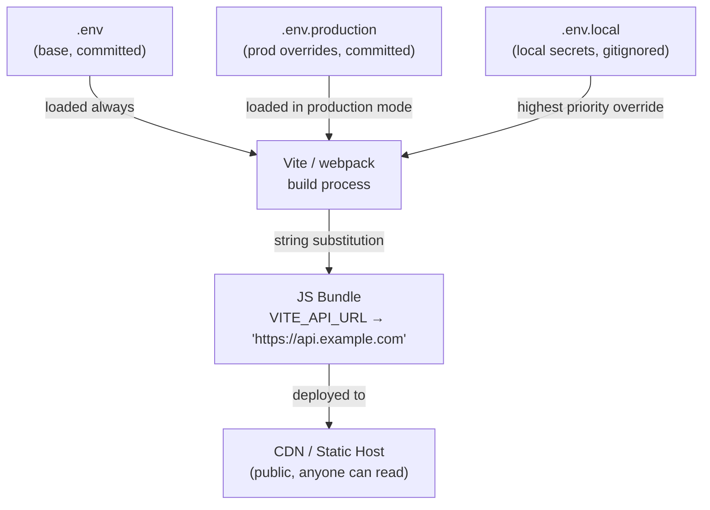
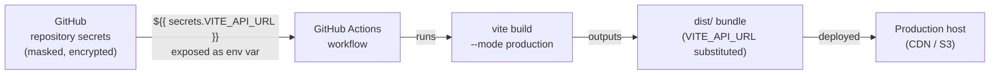

# Environment Variables & Build Configuration

## Context

In backend development, `process.env` is a live object. When your Node.js server starts, the
operating system loads environment variables into the process, and every call to
`process.env.DATABASE_URL` reads the current value at runtime. You can change environment
variables and restart the server without touching the code.

Frontend code runs in a browser. The browser has no operating system environment, no `process`
object, and no ability to query a server-side runtime at execution time. So how do environment
variables work at all?

The answer is build-time string substitution. When you write `import.meta.env.VITE_API_URL` in
a Vite project, the bundler replaces that expression with the literal string value —
`"https://api.example.com"` — before the code ever reaches a browser. The output bundle
contains no reference to environment variables; it contains hardcoded strings. This has a
critical implication: **the JS bundle is a public artifact**. Anyone who opens DevTools and
reads your bundle can see every value that was substituted in.

This distinction — build-time replacement vs. runtime environment — is the foundation of
everything else in this article.

## Design Thinking

**Why the `VITE_*` prefix exists: defense against accidental exposure.**

Without a naming guard, a developer could write `import.meta.env.DB_PASSWORD` and the
bundler would happily substitute the database password into the public JS bundle. Vite's
solution is an explicit opt-in: only variables with the `VITE_` prefix are bundled into
client code. All other variables in `.env` files are available to `vite.config.ts` and
server-side code (Vite SSR, API routes), but are stripped before the client bundle is
emitted. You have to consciously type the `VITE_` prefix to expose a variable — it is a
speed bump that forces a decision.

Next.js uses `NEXT_PUBLIC_` for the same reason and with the same mechanism: at build time,
Webpack's DefinePlugin replaces `process.env.NEXT_PUBLIC_ANALYTICS_ID` with the literal
string. Variables without the prefix are available in `getServerSideProps`, API routes, and
server components, but are never included in the client bundle.

**Why frontend env vars are frozen at build time.**

In a typical deployment, a Vite app produces a `dist/` directory of static files: HTML, CSS,
and JS. Those files are uploaded to a CDN or object storage bucket. There is no running server
to query, no process to inspect. The JS is static. This is why "change an env var and restart"
is a backend concept that does not apply. To change a frontend env var value, you must
trigger a new build and redeploy.

**The multi-environment challenge: staging vs. production.**

Most applications need at least three configurations: local development (dev server pointing
at a local API), staging (CI build pointing at a staging API), and production (CI build
pointing at the production API). The `.env` file cascade solves the local vs. shared split.
CI solves staging vs. production: the same variable name (`VITE_API_URL`) holds different
values in different CI environments, injected from repository secrets or environment-scoped
secrets.

**Why TypeScript config files won.**

Early build tools used plain JS or JSON config files (`.babelrc`, `webpack.config.js`). These
files could not be type-checked. Typos in plugin option names were silent failures discovered
only at runtime. Vite defaults to `vite.config.ts` — a TypeScript file processed by the same
toolchain — giving plugin options full IDE autocomplete and compile-time type checking. The
config file also receives the current `mode` as a parameter, enabling programmatic
configuration: different `define` values, different plugin sets, or different `build.target`
depending on whether the build is for staging or production.

## Best Practices

**MUST NOT put secrets (API keys, auth tokens, database passwords, signing keys) in any frontend environment variable.**
Frontend environment variables are substituted into the JS bundle at build time. The bundle is a public artifact — anyone with browser DevTools can read every substituted value by inspecting the source. There is no runtime mechanism to hide a value that has been inlined into client-side JavaScript. Secrets belong in server-side environment variables or CI secrets that are never forwarded to the client bundle.

**MUST use the framework-specific prefix as an explicit opt-in for every variable exposed to the client bundle.**
Vite exposes only variables with the `VITE_` prefix; all others are available to `vite.config.ts` and server-side code but stripped from the client bundle. Next.js uses `NEXT_PUBLIC_*` with the same mechanism. The prefix is a required speed bump that forces a conscious decision each time a variable is made public. SHOULD also augment `ImportMetaEnv` in a `.d.ts` file so that typos in variable names produce a TypeScript compile error.

**SHOULD commit `.env` and `.env.production` with non-sensitive defaults; MUST NOT commit `.env.local`.**
`.env.local` is gitignored by convention and exists specifically for developer-local secrets and overrides that must never enter version control. A committed `.env.local` with a real API key is one of the most common credential leaks in frontend projects. Vite's scaffolding (`pnpm create vite`) adds `.env.local` and `.env.*.local` to `.gitignore` automatically; manual project setups MUST add these entries explicitly.

**SHOULD use GitHub Actions `secrets` (not `vars`) for every sensitive value injected at CI build time.**
Repository `vars` are visible in the repository settings UI and shown in plain text in workflow log summaries. Repository `secrets` are encrypted, masked in all log output, and not visible after being set. Use `secrets` for API keys, tokens, and any value that should not be readable by anyone with repository read access. Reserve `vars` for genuinely non-sensitive configuration such as a deployment region name.

**SHOULD use runtime configuration patterns instead of build-time env vars when values need to differ per deployment without a rebuild.**
Build-time substitution freezes values at build time. Changing a value requires triggering a new build and redeployment. For feature flags, A/B configs, or per-tenant settings that change independently of code, prefer fetching configuration from an API at startup, injecting it via `window.__APP_CONFIG__` from the server, or using an edge config service such as Vercel Edge Config.

## Visual

### .env cascade → build-time replacement → public bundle



Priority order (highest to lowest): `.env.development.local` > `.env.local` >
`.env.development` > `.env` for development mode. Swap `development` for `production` or
any custom mode name.

### CI secrets injection flow



Note: GitHub Actions `secrets` values are masked in all log output with `***`. Repository
`vars` are shown in plain text in logs and the UI. Use `secrets` for every value that should
not be readable by anyone with log access.

## Example

### 1. `.env` file structure

The base file and a local override, committed and gitignored respectively:

```bash
# .env  — committed, safe defaults only
VITE_APP_NAME="My App"
VITE_API_URL="http://localhost:3000"

# .env.production  — committed, production defaults
VITE_API_URL="https://api.example.com"
VITE_ANALYTICS_KEY="GA-PLACEHOLDER"

# .env.local  — NEVER committed (.gitignore must include this)
# Local developer overrides and any value you don't want in git.
VITE_API_URL="http://localhost:4000"   # personal dev override
STRIPE_SECRET_KEY="sk_test_..."       # no VITE_ prefix: server-side only
```

An example `.gitignore` entry (Vite scaffolding adds this automatically):

```
.env.local
.env.*.local
```

### 2. Accessing env vars in a Vite app

```typescript
// src/config.ts
export const config = {
  apiUrl: import.meta.env.VITE_API_URL,
  appName: import.meta.env.VITE_APP_NAME,
  analyticsKey: import.meta.env.VITE_ANALYTICS_KEY,
  isProd: import.meta.env.PROD,       // boolean, true when MODE === 'production'
  isDev: import.meta.env.DEV,         // boolean, true when MODE === 'development'
  mode: import.meta.env.MODE,         // string: 'development' | 'production' | 'staging' | ...
} as const;
```

TypeScript type augmentation for IntelliSense on custom variables:

```typescript
// src/vite-env.d.ts  (or env.d.ts)
/// <reference types="vite/client" />

interface ImportMetaEnv {
  readonly VITE_API_URL: string;
  readonly VITE_APP_NAME: string;
  readonly VITE_ANALYTICS_KEY: string;
}

interface ImportMeta {
  readonly env: ImportMetaEnv;
}
```

Running a build targeting a custom mode:

```bash
# Development mode (default for vite dev)
vite

# Production mode (default for vite build)
vite build

# Custom 'staging' mode: loads .env.staging and .env.staging.local
vite build --mode staging
```

### 3. `vite.config.ts` with mode-based configuration

```typescript
import { defineConfig, loadEnv } from 'vite';
import vue from '@vitejs/plugin-vue';
import type { ConfigEnv } from 'vite';

export default defineConfig(({ mode }: ConfigEnv) => {
  // Load env files for the current mode.
  // process.cwd() = project root. The third argument '' means load ALL variables,
  // not just VITE_* ones — useful inside the config file itself.
  const env = loadEnv(mode, process.cwd(), '');

  return {
    plugins: [vue()],

    define: {
      // Custom global constant replacement (different from import.meta.env).
      // These are inlined at build time like DefinePlugin in webpack.
      __APP_VERSION__: JSON.stringify(process.env.npm_package_version),
      __BUILD_DATE__: JSON.stringify(new Date().toISOString()),
    },

    build: {
      // Target modern browsers in production; broader support in staging.
      target: mode === 'production' ? 'es2022' : 'es2019',
      sourcemap: mode !== 'production',
    },

    server: {
      proxy: {
        '/api': {
          target: env.VITE_API_URL,
          changeOrigin: true,
        },
      },
    },
  };
});
```

Key points:
- `loadEnv(mode, root, prefix)` — loads `.env` files for the given mode and returns a plain
  object. The empty string prefix (`''`) loads all variables, including those without `VITE_`.
  This is safe because `loadEnv` runs only in the Node.js build process, never in the browser.
- `define` — performs global string replacement, similar to webpack's `DefinePlugin`. Values
  must be serializable; wrap strings in `JSON.stringify` to avoid syntax errors.
- The config function receives `mode` directly, enabling conditional logic without importing
  from `import.meta.env` (which is a browser API not available in the config file).

### 4. GitHub Actions workflow: injecting env vars from secrets

```yaml
# .github/workflows/deploy.yml
name: Build and Deploy

on:
  push:
    branches: [main]

jobs:
  build:
    runs-on: ubuntu-latest
    environment: production   # scopes to production environment secrets

    steps:
      - uses: actions/checkout@v4

      - uses: pnpm/action-setup@v4
        with:
          version: 9

      - uses: actions/setup-node@v4
        with:
          node-version: '22'
          cache: 'pnpm'

      - run: pnpm install --frozen-lockfile

      - name: Build for production
        run: pnpm vite build --mode production
        env:
          # Pull from GitHub repository secrets (masked in all logs).
          # The variable name on the left is what the build process sees.
          VITE_API_URL: ${{ secrets.PROD_API_URL }}
          VITE_ANALYTICS_KEY: ${{ secrets.PROD_ANALYTICS_KEY }}
          # Non-prefixed vars — available in vite.config.ts but NOT in the bundle.
          SENTRY_AUTH_TOKEN: ${{ secrets.SENTRY_AUTH_TOKEN }}

      - name: Deploy dist to S3
        run: aws s3 sync dist/ s3://my-bucket --delete
        env:
          AWS_ACCESS_KEY_ID: ${{ secrets.AWS_ACCESS_KEY_ID }}
          AWS_SECRET_ACCESS_KEY: ${{ secrets.AWS_SECRET_ACCESS_KEY }}
```

The `environment: production` field scopes this job to the `production` environment in GitHub,
which can have its own secrets separate from repository-level secrets. This enables the same
workflow file to deploy to staging (`environment: staging`) or production by changing one
line — while injecting different secret values for `VITE_API_URL`.

### 5. Runtime env vars for truly dynamic configuration

When you need different values per deployment without a rebuild (feature flags, A/B test
configs, per-tenant settings), build-time substitution is the wrong tool. Three patterns:

**Pattern A: fetch from an API endpoint at startup**

```typescript
// src/bootstrap.ts — called before rendering the app
export async function loadConfig(): Promise<void> {
  const res = await fetch('/api/config');
  const data = await res.json();
  Object.assign(window.__APP_CONFIG__, data);
}
```

**Pattern B: inject into `window.__APP_CONFIG__` from the server**

The server (Node.js, Nginx, or a CDN edge function) rewrites the HTML at request time:

```html
<!-- index.html -->
<script>
  window.__APP_CONFIG__ = {
    featureFlags: { newDashboard: false },
    apiUrl: "https://api.example.com"
  };
</script>
```

**Pattern C: use an edge config service**

Vercel Edge Config and Cloudflare KV allow reading key-value pairs from CDN edge nodes with
sub-millisecond latency. Values can be updated without a redeploy:

```typescript
import { get } from '@vercel/edge-config';

export const config = {
  apiUrl: await get('apiUrl'),
  featureNewDashboard: await get('featureNewDashboard'),
};
```

Pattern C is the most operationally flexible but couples the app to a specific platform.
Pattern A is the most portable. Pattern B works well for server-rendered apps where HTML
generation already happens per-request.

## Common Mistakes

**Putting secrets in `VITE_*` variables.**
A common error is treating `VITE_API_KEY` the same as `API_KEY`. Any `VITE_*` variable
is literally embedded in the JS bundle. A user can open the browser DevTools Network tab,
find the JS file, and search for the value. Use unprefixed variables for secrets — they
are available in `vite.config.ts` and server-side code but stripped from the client bundle.

**Forgetting that `.env.local` must be in `.gitignore`.**
Vite's scaffolding (`pnpm create vite`) adds `.env.local` and `.env.*.local` to `.gitignore`
automatically. If you set up the project manually, you must add these entries yourself.
A committed `.env.local` with a developer's personal API key is a common credential leak.

**Using `vars` instead of `secrets` in GitHub Actions for sensitive values.**
GitHub repository `vars` are visible in the repository settings UI and shown in plain text
in workflow log summaries. Anyone with read access to the repository can see them.
Use `secrets` for every value that should be restricted: API keys, tokens, passwords.
Use `vars` only for genuinely non-sensitive configuration (e.g., a deployment region name).

**Expecting env var changes to apply without a rebuild.**
After updating a value in `.env.production` or a GitHub Actions secret, a new build and
deployment is required before the change takes effect. The old bundle still contains the old
hardcoded value. This surprises developers coming from backend work where an env var change
takes effect on the next process restart.

**Accessing `import.meta.env` in `vite.config.ts`.**
`import.meta.env` is a browser API injected by Vite into bundled client code. It is not
available in the config file itself (which runs in Node.js). Use `loadEnv(mode, cwd)` to
read `.env` files inside `vite.config.ts`, or read from `process.env` for variables set
in the shell or CI environment.

**Not augmenting `ImportMetaEnv` with TypeScript types.**
Without the type augmentation, `import.meta.env.VITE_API_URL` has type `any`. This means
typos in variable names (e.g., `VITE_API_UR` instead of `VITE_API_URL`) produce no
compile-time error. Add the `ImportMetaEnv` interface to a `.d.ts` file in `src/` and
type every custom variable as `readonly string`.

**Using `define` for values that contain user input or are dynamic at runtime.**
`define` performs textual substitution before minification. If a value includes special
characters or if you try to read it from a runtime source, you will get a build error or
a security issue. Only use `define` for values known at build time (version numbers, build
dates, static feature flags).

## Related FEEs

- **FEE-800** — Build Tooling & Module Systems Overview: the broader pipeline that env vars
  feed into, including how bundlers process source files.
- **FEE-801** — Bundlers (Webpack & Vite): DefinePlugin and Vite's `define` — the mechanisms
  that perform the actual string substitution at build time.
- **FEE-807** — Build Optimization: per-environment build settings (sourcemaps, tree-shaking,
  target browsers) that complement environment variable configuration.

## References

- [Vite: Env Variables and Modes](https://vite.dev/guide/env-and-mode)
- [Next.js: Environment Variables](https://nextjs.org/docs/pages/guides/environment-variables)
- [Next.js: Configuring env (App Router)](https://nextjs.org/docs/14/app/building-your-application/configuring/environment-variables)
- [GitHub Docs: Using secrets in GitHub Actions](https://docs.github.com/en/actions/how-tos/write-workflows/choose-what-workflows-do/use-secrets)
- [GitHub Resources: Securing CI/CD Pipelines with Secrets & Variables](https://resources.github.com/learn/pathways/automation/advanced/securing-ci-cd-pipelines-with-secrets-and-variables/)
- [Vercel Edge Config](https://vercel.com/docs/global-config)
