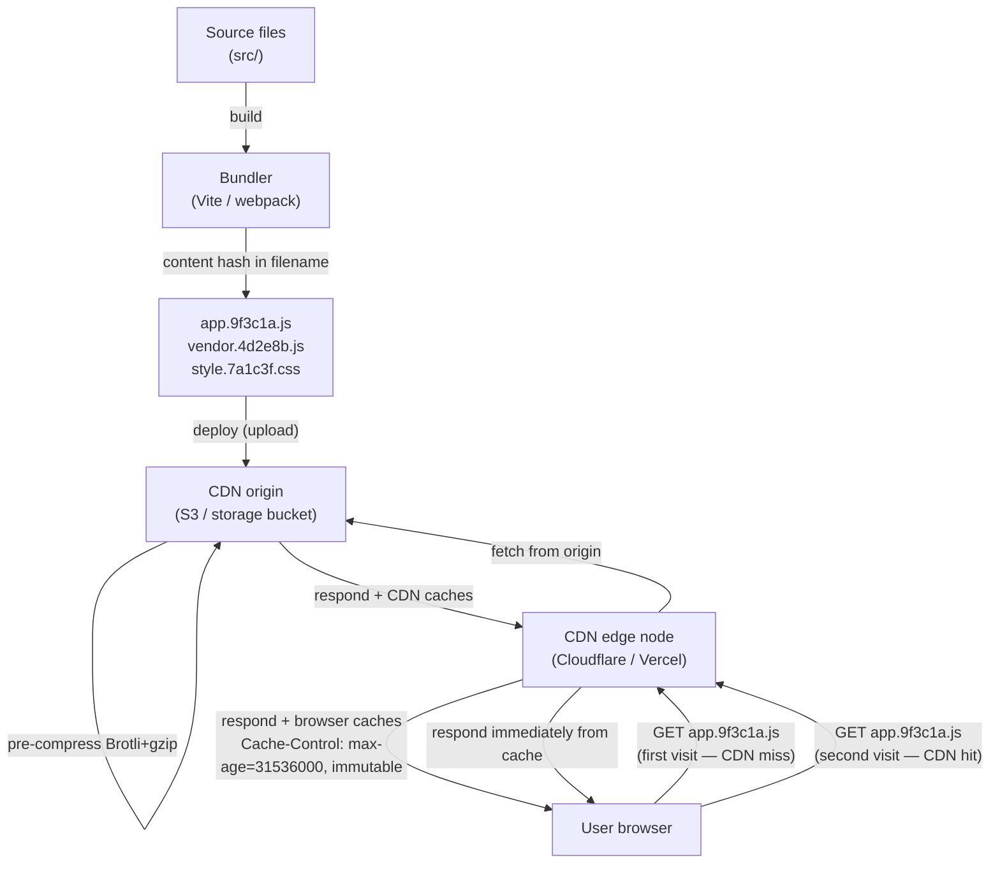

# [FEE-807] Build Optimization: Minification, Caching & Output Analysis

:::info
An unoptimized production bundle can ship several times more JavaScript than necessary, and without content hashing, every deploy forces users to re-download code that never actually changed. Four build-time techniques close that gap: minification shrinks the code itself, content hashing lets browsers cache assets permanently, tree shaking removes unused exports, and bundle analysis shows what actually ended up in the output. This article also covers build caching, transfer compression (Brotli and zstd), and critical CSS extraction. It corrects two numbers that circulate widely in bundle-optimization advice: moment.js's actual size with locales included, and Brotli's actual compression gain over gzip.
:::

## Context

A modern build pipeline does more than bundle source files. It also shrinks them, names them for permanent caching, and provides tooling to inspect the output. Without these layers, a production app can ship far more JavaScript than necessary, and every deploy forces users to re-download files that have not actually changed. Server-only code can also leak into the client bundle unnoticed.

This article covers four pillars of production build optimization: minification (shrinking assets), tree shaking (removing dead code at the module level), content hashing for long-term caching (making cached assets last indefinitely), and bundle analysis (understanding what shipped and why). It also covers build caching (avoiding repeated work in CI), transfer compression (Brotli, and increasingly zstd, alongside gzip on modern CDNs), and critical CSS extraction (eliminating render-blocking stylesheets). Rollup's scope hoisting, a related technique that merges modules into a single scope instead of wrapping each in a function closure, is covered alongside tree shaking in Example 3.

## Visual

### Content hashing + CDN caching lifecycle



**New deploy:** the bundler produces `app.7b4f2d.js` (a new hash). The CDN has never seen this URL, so it is a cache miss, and the CDN fetches from origin. The old hash URL (`app.9f3c1a.js`) remains valid in any user's browser cache, so users mid-navigation get a graceful rollover to the new version.

## Example

### 1. `vite.config.ts`: minification, chunk splitting, and content hashing

Vite's default JS minifier is Oxc (`build.minify: 'oxc'`), a Rust-based minifier built into Vite that the docs describe as roughly 30-90x faster than Terser with only 0.5-2% worse compression. CSS minification defaults to Lightning CSS (`build.cssMinify: 'lightningcss'`), also Rust-based. Older Vite releases (7 and earlier) defaulted to esbuild for both JS and CSS minification; for JS minification the `'esbuild'` value still works but is deprecated, while `cssMinify: 'esbuild'` remains a supported alternative. Terser remains available as an opt-in when that last 0.5-2% of compression is worth a much slower build.

```typescript
import { defineConfig } from 'vite'
import vue from '@vitejs/plugin-vue'

export default defineConfig({
  plugins: [vue()],

  build: {
    // Default: 'oxc' (built into Vite, Rust-based). 'esbuild' still works but is
    // deprecated. Switch to 'terser' only when the extra 0.5-2% compression is
    // worth a build that is an order of magnitude slower.
    minify: 'terser',
    terserOptions: {
      compress: {
        drop_console: true,    // removes ALL console.* calls, including error/warn
        drop_debugger: true,   // remove debugger statements
        passes: 2,             // two compression passes for smaller output
      },
      mangle: {
        toplevel: true,        // shorten top-level function/variable names
      },
    },

    // CSS minification: default is Lightning CSS (Rust-based, very fast).
    // cssnano is the long-standing PostCSS-based CSS minifier used in many
    // Webpack setups and remains common there.
    cssMinify: 'lightningcss',

    // Content hashing is Vite's default output format.
    // [hash] is derived from file content and changes only when content changes.
    rollupOptions: {
      output: {
        // JS chunks: content hash in filename
        chunkFileNames: 'assets/[name]-[hash].js',
        entryFileNames: 'assets/[name]-[hash].js',
        // Static assets (images, fonts): content hash in filename
        assetFileNames: 'assets/[name]-[hash][extname]',

        // Vendor chunk splitting: separate third-party libs from app code.
        // Goal: a small dependency update does NOT bust the vendor chunk cache.
        manualChunks(id) {
          if (id.includes('node_modules')) {
            // Group all node_modules into a single 'vendor' chunk.
            // See the caveats below before using this in a large app.
            return 'vendor'
          }
        },
      },
    },

    // Do not emit sourcemaps in production (or use 'hidden' for Sentry).
    sourcemap: false,
  },
})
```

`drop_console` removes `console.error` and `console.warn` along with `console.log`. If a production error-reporting or support workflow relies on console output, use `pure_funcs: ['console.log', 'console.debug']` instead so warnings and errors survive.

**Vendor chunk caveats:** grouping every `node_modules` package into one `vendor` chunk, as above, is a common starting point, but it is not risk-free. Vite deprecated its own `splitVendorChunkPlugin` (vitejs/vite#16274), citing accumulated edge cases (vitejs/vite#16268) — notably that the plugin could wrongly pull modules not statically imported by the entry into the vendor chunk. A catch-all `vendor` chunk built with `manualChunks` carries a similar risk: it can group modules in a way that breaks their expected initialization order, producing `Cannot access X before initialization` errors, a failure mode widely reported in Vite's issue tracker and discussions. It also means the entire vendor chunk gets a new hash whenever any one dependency updates, which undercuts the caching benefit it exists to provide. Prefer Rollup's default chunking first, and if you do split manually, split by package group (`react-vendor`, `ui-vendor`) rather than one catch-all `vendor` chunk. See Best Practices for the caching rationale behind splitting at all.

### 2. Bundle analysis with rollup-plugin-visualizer

For Webpack-based projects, `webpack-bundle-analyzer` serves the same role, launching an interactive treemap. Next.js users can use `@next/bundle-analyzer`, which wraps webpack-bundle-analyzer with Next.js-specific configuration.

```bash
pnpm add -D rollup-plugin-visualizer
```

```typescript
// vite.config.ts
import { defineConfig } from 'vite'
import { visualizer } from 'rollup-plugin-visualizer'

export default defineConfig({
  plugins: [
    // Gated behind ANALYZE so it does not run on every production build.
    // Place it last in the plugins array.
    process.env.ANALYZE === 'true' &&
      visualizer({
        filename: 'dist/stats.html', // output report path
        open: true,                  // auto-open in browser after build
        gzipSize: true,              // show gzip-compressed sizes
        brotliSize: true,            // show brotli-compressed sizes
        template: 'treemap',         // 'treemap' | 'sunburst' | 'flamegraph' | 'network'
      }),
  ].filter(Boolean),
})
```

Run analysis as a separate npm script, kept out of regular builds:

```bash
# package.json: "analyze": "ANALYZE=true vite build"
pnpm run analyze
```

What to look for in the report:

- **Unexpectedly large dependencies.** A library taking up more than 20% of your bundle
  deserves scrutiny. Is it tree-shakeable? Is there a lighter alternative?
- **Duplicated packages.** Two different versions of the same library (e.g. `lodash` and
  `lodash-es`, or two React versions in a monorepo) appear as separate blocks.
- **Unintended inclusions.** Server-only code, test utilities, or locale data (the moment.js
  problem, covered in Design Thinking) that should not be in the client bundle.
- **Unshaken imports.** A library that was expected to be tree-shaken but appears in full.
  Usually caused by CJS-only packages (see the tree shaking section below).

### 3. Tree shaking and scope hoisting (bundler perspective)

Tree shaking is dead code elimination via ESM static analysis. The bundler reads `import`
and `export` statements at build time, before any code runs, and removes exports that are never
imported. This only works with **ESM** (`import`/`export`), not CommonJS (`require`).

**Why CJS cannot be tree-shaken:**

```javascript
// CommonJS — dynamic, evaluated at runtime
const utils = require('./utils')  // bundler cannot know which exports are used
utils[someVariable]()             // computed property access defeats static analysis

// ESM — static, analyzed at build time
import { formatDate } from './utils'  // bundler knows exactly which export is used
```

The `sideEffects` field in `package.json` tells bundlers that a package's modules are
free of side effects, so unused exports can be safely removed:

```json
{
  "name": "my-library",
  "sideEffects": false
}
```

Or list specific files that do have side effects (e.g. CSS imports):

```json
{
  "sideEffects": ["*.css", "src/polyfills.js"]
}
```

**Scope hoisting** (Rollup's key innovation): instead of wrapping each module in a function
closure, as webpack historically did for isolation, Rollup merges all modules into a single
scope when possible. This eliminates the per-module function wrapper overhead, reduces the
output size, and gives JavaScript engines a larger scope to optimize within.

### 4. Cache-Control headers for hashed assets

Server or CDN configuration to accompany content-hashed filenames:

```nginx
# Nginx: assets with content hash — cache forever
location ~* \.(js|css|png|jpg|svg|woff2)$ {
    # Assume any file with a 8-char hex hash in the name is content-addressed.
    # Vite output: assets/index-9f3c1a2b.js
    expires 1y;
    add_header Cache-Control "public, max-age=31536000, immutable";
}

# HTML entry point — never cache (contains references to current hashed assets)
location ~* \.html$ {
    add_header Cache-Control "no-cache";
}
```

Firefox (on HTTPS) and Safari honor the `immutable` directive by skipping conditional requests
(`If-None-Match`) during the fresh period, even on an explicit reload. Chrome does not
implement `immutable` itself, but achieves a similar effect through its own reload-revalidation
heuristics. Either way, this is only safe when filenames are content-hashed, so a URL never
serves different content under the same name; see Design Thinking for why that guarantee holds.

### 5. Brotli pre-compression with vite-plugin-compression2

```bash
pnpm add -D vite-plugin-compression2
```

```typescript
// vite.config.ts
import { defineConfig } from 'vite'
import { compression } from 'vite-plugin-compression2'

export default defineConfig({
  plugins: [
    compression({
      algorithms: ['brotliCompress', 'gzip'], // Brotli primary, gzip fallback
      threshold: 1024,              // only compress files > 1 KB
      deleteOriginalAssets: false,  // keep the uncompressed original for fallback
    }),
  ],
})
```

The original `vite-plugin-compression` package has had no release since January 2022;
`vite-plugin-compression2` is the actively maintained successor with a similar API.

After the build, the `dist/` directory contains three variants of each asset:

```
dist/assets/index-9f3c1a2b.js       # original (fallback)
dist/assets/index-9f3c1a2b.js.br    # Brotli pre-compressed
dist/assets/index-9f3c1a2b.js.gz    # gzip pre-compressed
```

The server (Nginx, Caddy, or a self-managed CDN) selects the appropriate variant based on the
request's `Accept-Encoding` header and serves it directly, with no runtime compression cost.

**Note:** skip this plugin entirely when deploying to Vercel, Netlify, or Cloudflare Pages;
see the Brotli pre-compression rule in Best Practices for why.

### 6. Build caching with Turborepo and GitHub Actions

**Turborepo remote cache:** stores build outputs keyed by a content hash of all inputs (source
files, env vars, dependencies). If inputs haven't changed, the cached output is restored in
seconds instead of rebuilding from scratch, and the cache is shared across CI runners and team
members.

```json
// turbo.json
{
  "tasks": {
    "build": {
      "dependsOn": ["^build"],
      "outputs": ["dist/**"],
      "cache": true
    }
  }
}
```

Turborepo 2.0 (June 2024) renamed the top-level `pipeline` key to `tasks`. Older configs and
tutorials still show `pipeline`, which errors on current Turborepo installs; run
`npx @turbo/codemod migrate` to update an older repo.

**GitHub Actions cache for node_modules:**

```yaml
- uses: pnpm/action-setup@v4
  with:
    version: 9

- uses: actions/setup-node@v4
  with:
    node-version: '22'
    cache: 'pnpm'      # built-in pnpm cache in setup-node; requires pnpm/action-setup above

# Or manual cache for more control:
- uses: actions/cache@v4
  with:
    path: |
      node_modules
      ~/.pnpm-store
    key: ${{ runner.os }}-pnpm-${{ hashFiles('pnpm-lock.yaml') }}
    restore-keys: |
      ${{ runner.os }}-pnpm-
```

**Vite pre-bundling cache** (`node_modules/.vite`): Vite caches the result of pre-bundling CJS
dependencies to ESM on the first `vite dev` run, and subsequent dev-server starts skip that
step. It only affects local dev-server startup speed and has no bearing on production builds
or CI.

### 7. Critical CSS extraction (advanced)

Critical CSS is the subset of CSS rules needed to style above-the-fold content. Inlining it in
`<head>` eliminates the render-blocking stylesheet fetch, improving Largest Contentful Paint
(LCP), the Core Web Vitals metric that measures when the largest visible element finishes
rendering.

Two different tool families do this, and they work differently. `critical` (Addy Osmani's
package, wrapped by Vite/Rollup plugins such as `rollup-plugin-critical`) runs a headless
browser (Puppeteer, via Penthouse) against a real URL to determine which CSS rules apply to
the rendered above-the-fold viewport. `beasties`, a maintained fork of Google's now-archived
`critters` and the tool Angular CLI's `@angular/build` uses by default since Angular 19,
instead performs static HTML/CSS analysis with no headless browser at all: faster, but working
from the built HTML rather than a live render.

For a Vite project using the headless-browser approach:

```bash
pnpm add -D rollup-plugin-critical
```

```typescript
// vite.config.ts
import { defineConfig } from 'vite'
import critical from 'rollup-plugin-critical'

export default defineConfig({
  plugins: [
    critical({
      criticalUrl: 'https://example.com/',
      criticalBase: './dist/',
      criticalPages: [
        { uri: '', template: 'index' },
      ],
      criticalConfig: {
        inline: true,
        width: 1300,
        height: 900,
      },
    }),
  ],
})
```

The plugin runs a headless browser after the build against `criticalUrl`, identifies CSS rules
matching the elements visible in the `criticalConfig.width`/`height` viewport, inlines those
rules in `<head>`, and loads the full stylesheet asynchronously:

```html
<!-- Output in index.html after plugin runs -->
<head>
  <style>/* inlined critical CSS — no network request needed */
    body { margin: 0; font-family: sans-serif; }
    .hero { display: flex; ... }
  </style>
  <link rel="preload" href="style.7a1c3f.css" as="style" onload="this.rel='stylesheet'">
  <noscript><link rel="stylesheet" href="style.7a1c3f.css"></noscript>
</head>
```

**Tradeoff:** the headless-browser approach adds real build complexity and a Puppeteer
dependency. `beasties` trades some accuracy for skipping that dependency entirely. Either is
most valuable for public landing pages where LCP is a direct business metric, such as
conversions or SEO. For authenticated app views behind a login, the improvement is usually
marginal relative to the added build complexity.

## Best Practices

**SHOULD use content hashing for all static assets and pair it with `Cache-Control: max-age=31536000, immutable` on the CDN.**
Vite applies content hashing by default (`[hash]` in output filenames); do not override the output filename pattern to remove `[hash]`. HTML entry files MUST use `Cache-Control: no-cache` because they reference hashed assets and must always be fresh. See Design Thinking for why this makes permanent caching safe.

**SHOULD run a bundle visualizer locally, and back it with an automated size budget in CI, before merging any PR that adds a new dependency or changes import patterns.**
A dependency added without review can add tens of kilobytes to the client bundle silently. Tools such as `rollup-plugin-visualizer` (Vite) or `webpack-bundle-analyzer` (Webpack) make the addition visible; gate the visualizer itself behind an environment variable (`ANALYZE=true`) so it does not run on every production build (see Example 2). For a check that survives deadline pressure, add `size-limit` or `bundlewatch` to fail the PR when the gzipped bundle crosses a configured threshold; see Design Thinking for why the manual habit alone is not enough.

**SHOULD split vendor chunks from application code to maximize cache longevity, but avoid one catch-all vendor chunk.**
Without chunk splitting, every application code change produces a new hash for the entire bundle, invalidating cached vendor code such as React or Vue that users already have downloaded. Split by package group (`react-vendor`, `ui-vendor`) rather than grouping all of `node_modules` into a single `vendor` chunk; see Example 1 for the caveats behind that distinction.

**SHOULD prefer ESM packages and verify tree shaking is working after adding a new dependency.**
Tree shaking requires static ESM `import`/`export` statements. If a package ships only a `main` (CommonJS) entry in its `package.json`, the entire package is included in the bundle regardless of how little you import. SHOULD check the bundle visualizer after adding any date, utility, or icon library to confirm only the used portion appears in the output.

**SHOULD use Brotli pre-compression only when deploying to your own server or self-managed infrastructure; skip it when using managed CDNs.**
Vercel, Netlify, and Cloudflare Pages compress assets at the CDN layer automatically. Running a compression plugin in addition generates `.br` and `.gz` files that the CDN ignores, adding build time and output artifacts with no benefit. Compression should happen at the infrastructure layer, not in the build, on those platforms; see Design Thinking for what Brotli actually gains over gzip.

## Design Thinking

**Why content hashing is the cornerstone of CDN caching.**

Without content hashing, you face a real tradeoff. A short TTL (e.g. 5 minutes) makes every
user re-download every asset every 5 minutes, even when the code has not changed. A long TTL
(e.g. 1 year) can leave users on stale assets for a year after a deploy, because a URL that
used to point to old code now needs to point to new code without changing.

Content hashing avoids the tradeoff. `app.9f3c1a.js` is immutable by definition: if the content
changes, the hash changes, and so does the URL. The browser and the CDN both see a completely
new resource, so the TTL can be set to one year with confidence. Users with the old version
cached keep working against the old, still-valid URL until they navigate and pick up the new
hashes; new visitors get the latest bundle immediately. No CDN ever serves stale content under
a hash that used to mean something else.

The fingerprinted-filename approach also avoids the pitfalls of query-string versioning
(`style.css?v=2`). Some CDN configurations and HTTP proxies strip or ignore query strings when
computing cache keys, so a filename hash is the more reliable signal: any cache that sees a
different filename treats it as a different file.

**Bundle analysis catches silent bloat, but only if it runs automatically.**

The canonical example is `moment.js`. `import moment from 'moment'` pulls in the full locale
set: about 75 KB gzipped (momentjs.com lists `moment-with-locales.min.js` at 74.6k gzipped;
bundlephobia reports roughly 77 KB for the npm package), compared to roughly 18 KB gzipped for
the core library without locales (momentjs.com lists moment.min.js at 18.4k gzipped). A developer adding moment to format a single date can
easily miss that they just quadrupled the date-handling code they shipped. The moment.js team
has said as much themselves: the project has been in maintenance mode since 2020, will not fix
its own tree-shaking or bundle-size limitations, and its own documentation points to Day.js,
date-fns, or Luxon for new work. The same import-everything pattern applies to lodash
(importing the full package turns every method into a separate function reference) and to icon
libraries imported without tree-shaking-friendly paths.

A bundle visualizer makes this kind of bloat visible immediately, which is why it belongs on
the PR review checklist for any dependency addition. But a manual step is also the step that
gets skipped under deadline pressure. The more durable fix is an automated size budget in CI:
tools such as `size-limit` or `bundlewatch` fail the pull request outright when the gzipped
output crosses a configured threshold, so the check runs whether or not a reviewer remembers to
ask for it. The visualizer is then the diagnostic tool you reach for once a budget check trips,
to see exactly what grew.

**Brotli, zstd, and why gzip is no longer the only option.**

At its highest compression levels, Brotli compresses typical text content (HTML, CSS, JS) about
15-25% better than gzip (Calvano, 2024). The historical objection was that Brotli is slow at
those levels, and it is: level 11 is dramatically slower than gzip — Calvano's 2024 measurements
show even zstd's maximum compression level running about 4x faster than Brotli 11. That objection only applies
to on-the-fly compression, though. Modern CDNs pre-compress assets once at upload time and
serve the pre-compressed file for every subsequent request, at decompression speed comparable
to gzip. Content negotiation via `Accept-Encoding` lets a CDN keep serving gzip to any client
that does not advertise Brotli support, so there is no downside to enabling both.

Brotli is enabled by default on Vercel and Netlify. Not every CDN treats it the
same way: Cloudflare compresses automatically but picks the default algorithm by plan
(Zstandard on Free, Brotli on Pro/Business, gzip on Enterprise, subject to `Accept-Encoding`),
Amazon CloudFront requires an explicit cache policy to compress with Brotli, and
gzip remains the universal negotiated fallback everywhere Brotli is unavailable. Browsers only
advertise `Accept-Encoding: br` over HTTPS. That restriction exists because plain-HTTP
intermediary proxies that assume gzip have historically corrupted responses using encodings
they don't recognize, not because of compression-oracle attacks; those are a TLS-specific
concern unrelated to why Brotli is HTTPS-only.

zstd (Zstandard) is a third option, supported in `Accept-Encoding` by Chrome since version 123
(March 2024) and by Cloudflare. At comparable settings it compresses faster than Brotli for a
similar payload size, which makes it a better fit for dynamic, per-request responses, where
compression happens on every request rather than once at build time. Brotli at its highest
level remains the better choice for static, pre-compressed assets, where the compression cost
is paid once regardless of how slow it is.

**Moving cost from runtime to build time.**

Minification, critical CSS extraction, and Brotli pre-compression all happen once, during the
build. The build machine pays that cost a single time. Every user who loads the page afterward
gets a smaller, faster-rendering page in return, on every single visit.

## Deep Dive

**Compression Dictionary Transport: the next step beyond content hashing.**

Content-hashed filenames solve caching, but a new deploy with even a one-line change still
forces a full re-download of the changed chunk, because the hash, and therefore the URL, is
entirely new. Compression Dictionary Transport (`Content-Encoding: dcb` for Brotli, `dcz` for
zstd), shipped in Chrome 130 (October 2024), closes that gap. Cloudflare supports it in open
beta as a passthrough, forwarding the dictionary headers and `dcb`/`dcz` encodings while the
origin produces the delta-compressed responses. The server registers a previous build's
hashed bundle as a shared dictionary via a
`Use-As-Dictionary` response header, and the next deploy's response is compressed as a delta
against that dictionary instead of from scratch. A returning user with the old bundle cached
downloads only what changed between releases, not the full new file, even though the filename
and its hash are completely different from before.

## Common Mistakes

**Caching hashed assets incorrectly.**
Two mistakes commonly appear together. First, using query-string versioning (`style.css?v=2`)
instead of filename hashing: some CDN configurations and proxies strip or normalize query
strings in their cache keys, which can cause cache poisoning or stale responses, while a
fingerprinted filename (`style.7a1c3f.css`) is unambiguous to every cache layer (see Design
Thinking). Second, setting `Cache-Control: max-age=31536000` on HTML files themselves: HTML is
the entry point that references the hashed assets, so caching it for a year means users keep
requesting old asset URLs, which may no longer exist on the CDN, for a year after the next
deploy. HTML should use `Cache-Control: no-cache` or a short TTL; only assets with content
hashes in their filenames should use long-lived caching.

**Keeping the bundle visualizer in every production build.**
The visualizer plugin adds measurable build-time overhead and writes a `stats.html` file into
`dist/` on every run. Gate it behind an environment variable as shown in Example 2 so it only
runs when explicitly requested.

**Assuming tree shaking works for all npm packages.**
Tree shaking requires ESM. Many older packages, including moment.js, ship only a CJS `main`
entry, so importing even one function pulls in the entire package regardless of how little you
use; locale-heavy libraries like moment.js make that cost especially visible (see Design
Thinking for the actual size numbers). Some dual-format packages can resolve to their CJS build
depending on bundler configuration, which defeats tree shaking the same way. Check the
package's `package.json` for a `module` or `exports` field pointing to an ESM build. If only
`main` is present, the package is CJS-only and will not be tree-shaken.

**Not splitting vendor chunks in long-lived apps.**
Without `manualChunks`, every deploy re-downloads the entire bundle, including stable vendor
code like React or Vue that users already have cached. See Example 1 for how to split it
without hitting the caveats that come with a single catch-all vendor chunk.

## Related Topics

- [FEE-800: Build Tooling & Module Systems Overview](/en/Build%20Tooling%20and%20Module%20Systems/800): the build pipeline these optimizations fit into.
- [FEE-705: Code Splitting, Lazy Loading & Tree Shaking](/en/Rendering%20and%20Performance/705): tree shaking from the application perspective (dynamic imports, route-based splitting); FEE-807 covers the bundler-level mechanism.
- [FEE-704: Core Web Vitals & Performance Metrics](/en/Rendering%20and%20Performance/704): LCP is directly affected by asset caching for returning users, critical CSS extraction for first paint, and bundle size for parse and execute time.

## References

- Vite Team, "Build Options," Vite Documentation (2026). https://vite.dev/config/build-options
- btd, "rollup-plugin-visualizer," GitHub (2024). https://github.com/btd/rollup-plugin-visualizer
- MDN Contributors, "Cache-Control," MDN Web Docs (2025). https://developer.mozilla.org/en-US/docs/Web/HTTP/Reference/Headers/Cache-Control
- MDN Contributors, "HTTP Caching," MDN Web Docs (2025). https://developer.mozilla.org/en-US/docs/Web/HTTP/Guides/Caching
- Paul Calvano, "Choosing Between gzip, Brotli and zStandard Compression," paulcalvano.com (2024). https://paulcalvano.com/2024-03-19-choosing-between-gzip-brotli-and-zstandard-compression/
- DebugBear, "Brotli vs GZIP: Improve Page Speed With HTTP Compression," DebugBear Blog (2023). https://www.debugbear.com/blog/http-compression-gzip-brotli
- Rollup Team, "Tree-shaking," Rollup Documentation (2025). https://rollupjs.org/introduction/#tree-shaking
- Vercel, "Caching," Turborepo Documentation (2025). https://turborepo.dev/docs/crafting-your-repository/caching
- Moment.js Team, "Project Status," momentjs.com (2025). https://momentjs.com/docs/#/-project-status/
- Andrey Sitnik and contributors, "size-limit," GitHub (2025). https://github.com/ai/size-limit
- Jeremy Wagner, "Supercharge Compression Efficiency With Shared Dictionaries," Chrome for Developers (2024). https://developer.chrome.com/blog/shared-dictionary-compression
