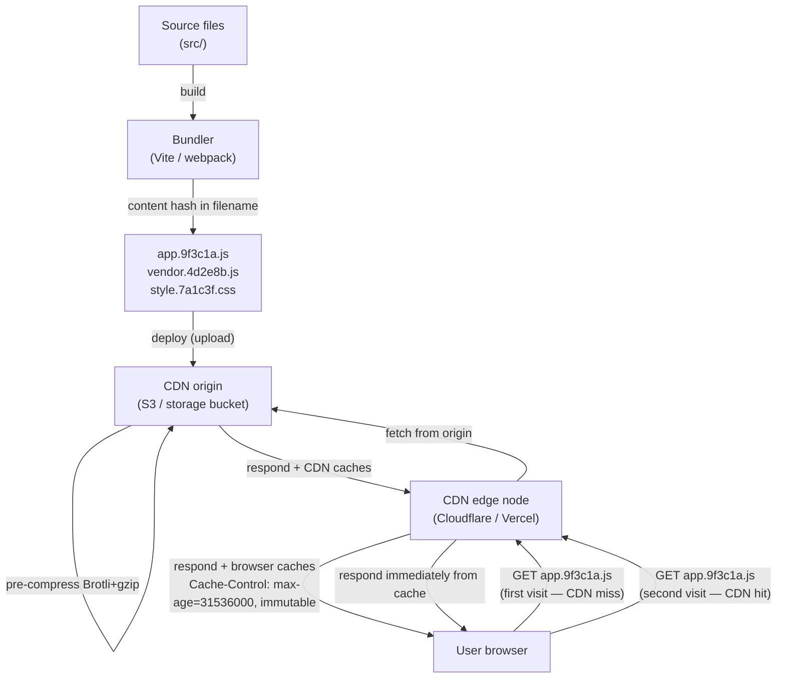

# Build Optimization: Minification, Caching & Output Analysis

## Context

A modern frontend build pipeline does more than bundle source files together — it also shrinks
them, names them so browsers can cache them forever, and provides tooling to inspect what ended
up in the bundle. Without these layers, a production app might ship 2 MB of JavaScript instead
of 200 KB, force users to re-download assets on every deploy, and silently carry server-only
code into the client bundle.

This article covers the four pillars of production build optimization: **minification** (making
assets as small as possible), **tree shaking and scope hoisting** (removing dead code at the
module level), **content hashing for long-term caching** (making cached assets last forever),
and **bundle analysis** (understanding what you shipped and why). It also covers **build
caching** (avoiding repeating work in CI), **Brotli compression** (a better replacement for
gzip on modern CDNs), and **critical CSS extraction** (eliminating render-blocking stylesheets).

## Principle

**SHOULD** use content hashing for all static assets. With content hashing, set
`Cache-Control: max-age=31536000, immutable` — browsers and CDNs cache assets for one year,
and a new deploy automatically produces new URLs, busting the cache without any manual
intervention.

**SHOULD** analyze bundle size before merging large dependency additions. A dependency added
without analysis can silently add 50 KB or more to the bundle. Run the visualizer locally
before merging PRs that add significant new dependencies.

## Design Thinking

**Why content hashing is the cornerstone of CDN caching.**

Without content hashing, you face an impossible tradeoff. Set a short TTL (e.g. 5 minutes) and
every user re-downloads every asset every 5 minutes — most of the time needlessly, because the
code hasn't changed. Set a long TTL (e.g. 1 year) and users get stale assets for a year after
a deploy — new code, same cached file.

Content hashing resolves the tradeoff entirely. `app.9f3c1a.js` is immutable by definition:
if the content changes, the hash changes, and the URL changes. The browser (and CDN) sees a
completely new resource. So you can set the TTL to one year with confidence. Old URLs remain
valid for users with the old version cached — they get a graceful rollover as they navigate and
pick up the new hashes. New users get the latest bundle on first visit. CDNs never serve stale
content.

The fingerprinted filename approach also avoids the pitfalls of query-string versioning
(`style.css?v=2`). Some CDN configurations and HTTP proxies strip or ignore query strings in
their cache keys. A filename hash bypasses this entirely — any cache that sees a different
filename treats it as a different file.

**Why bundle analysis should be a habit, not a one-time check.**

The canonical example is `moment.js`. Imported as `import moment from 'moment'`, it pulls in
all locale data — 2.4 MB unminified. A developer adding moment to format a single date might
not realize they just doubled the bundle size. The same pattern applies to lodash (every method
becomes a separate function if you import the full package), date-fns with locales, and any
icon library imported without tree-shaking-friendly path imports.

A visualizer turns this invisible problem visible in 30 seconds. It should be part of the code
review checklist for PRs that add dependencies.

**Why Brotli replaced gzip as the default on modern CDNs.**

Brotli achieves 15–26% better compression than gzip on typical text content (HTML, CSS, JS).
The historical objection was that Brotli compression is slower than gzip — at its highest
level (11), it can be 10–100x slower. But this objection only applies to on-the-fly
compression. Modern CDNs pre-compress assets at upload time, paying the compression cost once.
Users receive the pre-compressed file at gzip decompression speed (which Brotli decompression
matches). Content negotiation via the `Accept-Encoding` header lets CDNs serve gzip to older
clients automatically — there is no cost to enabling Brotli alongside gzip.

By 2024, Brotli is supported by all modern browsers and deployed by default on Cloudflare,
Vercel, and Netlify. Brotli requires HTTPS (browser vendors require it to prevent compression
oracle attacks), which every modern production site already uses.

**The build time vs. runtime tradeoff: pay once, save on every request.**

Every optimization you move from runtime to build time amortizes the cost across all users and
all requests. Minification, critical CSS extraction, and Brotli pre-compression are all paid
for once during a 30–60 second build. The runtime savings — smaller files, fewer blocking
requests, lower decompression cost — are paid back on every page load by every user. The math
is overwhelmingly in favor of doing more at build time.

## Visual

### Content hashing + CDN caching lifecycle



**New deploy:** bundler produces `app.7b4f2d.js` (new hash). CDN has never seen this URL —
cache miss — fetches from origin. Old hash URL (`app.9f3c1a.js`) remains valid in any user's
browser cache, allowing graceful rollover.

## Example

### 1. `vite.config.ts`: minification, chunk splitting, and content hashing

Vite defaults to esbuild minification for JS and Lightning CSS for CSS. Switch to Terser for
more aggressive JS minification (at the cost of a slower build).

```typescript
import { defineConfig } from 'vite'
import vue from '@vitejs/plugin-vue'

export default defineConfig({
  plugins: [vue()],

  build: {
    // Default: 'esbuild' (fastest). Switch to 'terser' for smaller output.
    // As of Vite 6, 'oxc' is also available (fastest, slightly less aggressive than terser).
    minify: 'terser',
    terserOptions: {
      compress: {
        drop_console: true,    // remove all console.* calls
        drop_debugger: true,   // remove debugger statements
        passes: 2,             // two compression passes for smaller output
      },
      mangle: {
        toplevel: true,        // shorten top-level function/variable names
      },
    },

    // CSS minification: default is Lightning CSS (Rust-based, very fast).
    // cssnano is the long-standing PostCSS-based CSS minifier used in many Webpack setups;
    // Lightning CSS (written in Rust) is faster and is now the default in Vite 6.
    // For Webpack projects, cssnano via css-minimizer-webpack-plugin remains common.
    cssMinify: 'lightningcss',

    // Content hashing is Vite's default output format.
    // [hash] is derived from file content — changes only when content changes.
    rollupOptions: {
      output: {
        // JS chunks: content hash in filename
        chunkFileNames: 'assets/[name]-[hash].js',
        entryFileNames: 'assets/[name]-[hash].js',
        // Static assets (images, fonts): content hash in filename
        assetFileNames: 'assets/[name]-[hash][extname]',

        // Vendor chunk splitting: separate third-party libs from app code.
        // Goal: a small dependency update does NOT bust the vendor chunk cache.
        manualChunks(id) {
          if (id.includes('node_modules')) {
            // Group all node_modules into a single 'vendor' chunk.
            // For large apps: split further (e.g. 'react-vendor', 'ui-vendor').
            return 'vendor'
          }
        },
      },
    },

    // Do not emit sourcemaps in production (or use 'hidden' for Sentry).
    sourcemap: false,
  },
})
```

**Vendor chunk rationale:** without splitting, changing one line of app code rebuilds the
entire bundle and busts the cache for all users — including vendor code they already have
cached. With a separate vendor chunk, the vendor hash stays stable across app-only changes,
so returning users only download the small changed app chunk.

### 2. Bundle analysis with rollup-plugin-visualizer

For Webpack-based projects, `webpack-bundle-analyzer` serves the same role, launching an interactive treemap. Next.js users can use `@next/bundle-analyzer`, which wraps webpack-bundle-analyzer with Next.js-specific configuration.

```bash
pnpm add -D rollup-plugin-visualizer
```

```typescript
// vite.config.ts
import { defineConfig } from 'vite'
import { visualizer } from 'rollup-plugin-visualizer'

export default defineConfig({
  plugins: [
    // Place the visualizer last in the plugins array.
    visualizer({
      filename: 'dist/stats.html',   // output report path
      open: true,                     // auto-open in browser after build
      gzipSize: true,                 // show gzip-compressed sizes
      brotliSize: true,               // show brotli-compressed sizes
      template: 'treemap',            // 'treemap' | 'sunburst' | 'flamegraph' | 'network'
    }),
  ],
})
```

Run analysis:

```bash
# Standard production build — opens stats.html automatically
vite build

# Or as a separate npm script (keep out of regular builds):
# "analyze": "ANALYZE=true vite build"
```

What to look for in the report:

- **Unexpectedly large dependencies** — a library taking up >20% of your bundle deserves
  scrutiny. Is it tree-shakeable? Is there a lighter alternative?
- **Duplicated packages** — two different versions of the same library (e.g. `lodash` and
  `lodash-es`, or two React versions in a monorepo) appear as separate blocks.
- **Unintended inclusions** — server-only code, test utilities, or locale data (the moment.js
  problem) that should not be in the client bundle.
- **Unshaken imports** — a library that was expected to be tree-shaken but appears in full.
  Usually caused by CJS-only packages (see tree shaking section below).

### 3. Tree shaking and scope hoisting (bundler perspective)

Tree shaking is dead code elimination via ESM static analysis. The bundler reads `import`
and `export` statements at build time (before any code runs) and removes exports that are never
imported. This only works with **ESM** (`import`/`export`) — not CommonJS (`require`).

**Why CJS cannot be tree-shaken:**

```javascript
// CommonJS — dynamic, evaluated at runtime
const utils = require('./utils')  // bundler cannot know which exports are used
utils[someVariable]()             // computed property access defeats static analysis

// ESM — static, analyzed at build time
import { formatDate } from './utils'  // bundler knows exactly which export is used
```

The `sideEffects` field in `package.json` tells bundlers that a package's modules are
free of side effects, so unused exports can be safely removed:

```json
{
  "name": "my-library",
  "sideEffects": false
}
```

Or list specific files that do have side effects (e.g. CSS imports):

```json
{
  "sideEffects": ["*.css", "src/polyfills.js"]
}
```

**Scope hoisting** (Rollup's key innovation): instead of wrapping each module in a function
closure (as webpack historically did for isolation), Rollup merges all modules into a single
scope when possible. This eliminates the per-module function wrapper overhead, reduces the
output size, and gives JavaScript engines a larger scope to optimize within.

### 4. Cache-Control headers for hashed assets

Server or CDN configuration to accompany content-hashed filenames:

```nginx
# Nginx: assets with content hash — cache forever
location ~* \.(js|css|png|jpg|svg|woff2)$ {
    # Assume any file with a 8-char hex hash in the name is content-addressed.
    # Vite output: assets/index-9f3c1a2b.js
    expires 1y;
    add_header Cache-Control "public, max-age=31536000, immutable";
}

# HTML entry point — never cache (contains references to current hashed assets)
location ~* \.html$ {
    add_header Cache-Control "no-cache";
}
```

The `immutable` directive tells browsers not to send conditional requests (`If-None-Match`)
during the fresh period — even on explicit reload. This avoids a round-trip to the server on
soft navigation. It is only safe when filenames are content-hashed (so the URL never serves
different content).

### 5. Brotli pre-compression with vite-plugin-compression

```bash
pnpm add -D vite-plugin-compression
```

```typescript
// vite.config.ts
import { defineConfig } from 'vite'
import viteCompression from 'vite-plugin-compression'

export default defineConfig({
  plugins: [
    // Brotli pre-compression (primary, best compression ratio)
    viteCompression({
      algorithm: 'brotliCompress',
      ext: '.br',
      threshold: 1024,       // only compress files > 1 KB
      deleteOriginFile: false, // keep original for fallback
    }),
    // Gzip fallback for older clients
    viteCompression({
      algorithm: 'gzip',
      ext: '.gz',
      threshold: 1024,
    }),
  ],
})
```

After the build, the `dist/` directory contains three variants of each asset:

```
dist/assets/index-9f3c1a2b.js       # original (fallback)
dist/assets/index-9f3c1a2b.js.br    # Brotli pre-compressed
dist/assets/index-9f3c1a2b.js.gz    # gzip pre-compressed
```

The server (Nginx, Caddy, or CDN) selects the appropriate variant based on the request's
`Accept-Encoding` header and serves the pre-compressed file directly — no runtime compression
CPU cost.

**Note:** If deploying to Vercel, Netlify, or Cloudflare Pages, these CDNs pre-compress
automatically at deploy time. You do not need `vite-plugin-compression` in that case.

### 6. Build caching with Turborepo and GitHub Actions

**Turborepo remote cache:** stores build outputs keyed by content hash of all inputs (source
files, env vars, dependencies). If inputs haven't changed, the cached output is restored in
seconds instead of rebuilding from scratch. Shared across CI runners and team members.

```json
// turbo.json
{
  "pipeline": {
    "build": {
      "dependsOn": ["^build"],
      "outputs": ["dist/**"],
      "cache": true
    }
  }
}
```

**GitHub Actions cache for node_modules:**

```yaml
- uses: actions/setup-node@v4
  with:
    node-version: '22'
    cache: 'pnpm'      # built-in pnpm cache in setup-node

# Or manual cache for more control:
- uses: actions/cache@v4
  with:
    path: |
      node_modules
      ~/.pnpm-store
    key: ${{ runner.os }}-pnpm-${{ hashFiles('pnpm-lock.yaml') }}
    restore-keys: |
      ${{ runner.os }}-pnpm-
```

**Vite pre-bundling cache** (`node_modules/.vite`): Vite caches the result of pre-bundling
CJS dependencies to ESM on the first `vite dev` run. Subsequent starts skip this step.
Commit the cache directory in Docker layer caching for faster container builds.

### 7. Critical CSS extraction (advanced)

Critical CSS is the subset of CSS rules needed to style above-the-fold content. Inlining it
in `<head>` eliminates the render-blocking stylesheet fetch, improving LCP. Angular CLI uses `critters` (by Google) for critical CSS extraction by default. For Vite projects, `vite-plugin-critical` wraps the same underlying logic.

```bash
pnpm add -D vite-plugin-critical
```

```typescript
// vite.config.ts
import { defineConfig } from 'vite'
import critical from 'vite-plugin-critical'

export default defineConfig({
  plugins: [
    critical({
      // Width/height of the "above the fold" viewport to simulate
      criticalWidth: 1300,
      criticalHeight: 900,
    }),
  ],
})
```

The plugin runs a headless browser after the build, identifies CSS rules matching visible
elements, inlines those rules in `<head>`, and loads the full stylesheet asynchronously:

```html
<!-- Output in index.html after plugin runs -->
<head>
  <style>/* inlined critical CSS — no network request needed */
    body { margin: 0; font-family: sans-serif; }
    .hero { display: flex; ... }
  </style>
  <link rel="preload" href="style.7a1c3f.css" as="style" onload="this.rel='stylesheet'">
  <noscript><link rel="stylesheet" href="style.7a1c3f.css"></noscript>
</head>
```

**Tradeoff:** critical CSS extraction adds significant build complexity and a headless browser
dependency. It is most valuable for public landing pages where LCP is a direct business metric
(conversions, SEO). For authenticated app views behind a login, the improvement is marginal
relative to the added build complexity.

## Common Mistakes

**Using query-string versioning instead of filename hashing.**
`style.css?v=2` is not equivalent to content hashing. Some CDN configurations and proxies
strip or normalize query strings in their cache keys, causing cache poisoning or stale
responses. Fingerprinted filenames (`style.7a1c3f.css`) are unambiguously different resources
to every cache layer. Vite does filename hashing by default — do not override the output
filename pattern to remove `[hash]`.

**Setting `Cache-Control: max-age=31536000` on HTML files.**
HTML files are the entry point that references hashed assets. If the HTML is cached for a
year, users will keep requesting old asset URLs (which may no longer exist on the CDN) for
a year after the next deploy. HTML should use `Cache-Control: no-cache` or a short TTL.
Only assets with content hashes in their filenames should use long-lived caching.

**Keeping the bundle visualizer in every production build.**
The visualizer plugin adds a measurable overhead to build time and generates a `stats.html`
file in `dist/`. Add a conditional guard so it only runs when explicitly requested:
```typescript
plugins: [
  process.env.ANALYZE === 'true' && visualizer({ open: true }),
].filter(Boolean)
```

**Importing moment.js (or any locale-heavy library) without tree-shaking.**
`import moment from 'moment'` loads all 70+ locale files — roughly 2.4 MB unminified.
moment.js uses CJS and does not support tree shaking. Use `date-fns` (ESM, tree-shakeable) or
the `Day.js` plugin system instead. Always run the bundle visualizer after adding a new
date/utility library.

**Assuming tree shaking works for all npm packages.**
Tree shaking requires ESM. Many older or dual-format packages ship CJS as the default Node.js
entrypoint. Check the package's `package.json` for a `module` or `exports` field pointing to
an ESM build. If only `main` is present, the package is CJS-only and will not be tree-shaken.

**Not splitting vendor chunks in long-lived apps.**
Without `manualChunks`, every deploy re-downloads the entire bundle — including stable vendor
code like React and Vue. Splitting vendor code into a separate chunk means a UI hotfix only
requires users to download the small app chunk, not the 200 KB React + Vue + router bundle
they already have cached.

**Enabling Brotli pre-compression on CDN-hosted sites unnecessarily.**
If you deploy to Vercel, Netlify, or Cloudflare Pages, these platforms compress at the CDN
layer automatically. Running `vite-plugin-compression` in addition generates `.br` and `.gz`
files that the CDN ignores. Only use the plugin when deploying to your own server or an S3
bucket with Nginx/Caddy in front.

## Related FEEs

- **FEE-800** — Build Tooling & Module Systems Overview: the build pipeline that these
  optimizations fit into.
- **FEE-705** — Code Splitting & Lazy Loading: tree shaking from the application perspective
  (dynamic imports, route-based splitting). FEE-807 covers the bundler-level mechanism.
- **FEE-704** — Core Web Vitals: LCP is directly impacted by asset caching (returning users),
  critical CSS extraction (first paint), and bundle size (parse and execute time).

## References

- [Vite: Build Options](https://vite.dev/config/build-options)
- [rollup-plugin-visualizer — GitHub](https://github.com/btd/rollup-plugin-visualizer)
- [MDN: Cache-Control](https://developer.mozilla.org/en-US/docs/Web/HTTP/Reference/Headers/Cache-Control)
- [MDN: HTTP Caching](https://developer.mozilla.org/en-US/docs/Web/HTTP/Guides/Caching)
- [Choosing Between gzip, Brotli and zStandard Compression — Paul Calvano](https://paulcalvano.com/2024-03-19-choosing-between-gzip-brotli-and-zstandard-compression/)
- [Brotli vs GZIP: Improve Page Speed With HTTP Compression — DebugBear](https://www.debugbear.com/blog/http-compression-gzip-brotli)
- [Rollup: Tree-shaking](https://rollupjs.org/introduction/#tree-shaking)
- [Turborepo: Caching](https://turbo.build/repo/docs/core-concepts/caching)
