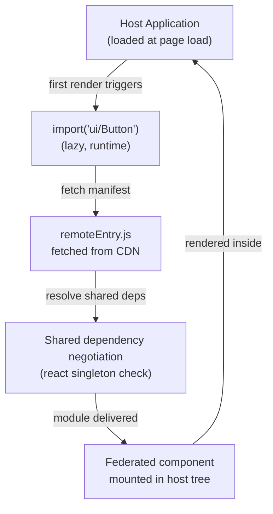

# Module Federation

Module Federation is a Webpack 5 feature that allows JavaScript bundles to expose and
consume modules from other independently deployed bundles at runtime. A host application
can load a federated module (a component, a utility, an entire feature) from a remote
URL without bundling it at build time. The remote bundle is loaded lazily when the module
is first imported, enabling runtime composition of applications that are deployed
independently.

This is the technical foundation for one approach to micro-frontend architecture: teams
can deploy their features independently, and the host application federates them into a
unified UI without a synchronous build-time dependency between teams. When team A deploys
a new version of their federated module, team B's host application loads the new version
on the next page load: no rebuild, no redeployment of the host.

The central challenge of Module Federation is shared dependency management. If the host
and remote each bundle their own copy of React, users download React twice. Module
Federation's shared dependencies feature allows the host and remote to negotiate which
shared libraries to use at runtime: if compatible versions are available from multiple
sources, only one copy is loaded. Version compatibility negotiation and singleton
enforcement for libraries like React require careful configuration.

Beyond shared dependencies, the operational complexity of Module Federation grows with the
number of participating remotes. Each remote is an independently deployable unit, which
means each remote can introduce a breaking change at any time. The host application must
tolerate the failure of any federated module without degrading the entire page. This
requirement, known as defensive consumption, is mandatory in a federated system; it is the
foundational contract that makes independent deployment safe for end users.

## Design Thinking

### Exposed vs. consumed modules

The remote declares which internal modules it makes available through the `exposes`
configuration key. A typical remote entry looks like
`exposes: { './Button': './src/components/Button' }`, mapping a public alias to a file
path relative to the project root. The host declares which remotes it knows about through
the `remotes` key: `remotes: { ui: 'ui@https://cdn.example.com/ui/remoteEntry.js' }`.
This string encodes both the module federation name (`ui`) and the URL of the remote's
manifest file (`remoteEntry.js`). In host application code, the import then reads
`import('ui/Button')`, where `ui` matches the remote alias and `Button` matches the
exposed path alias. No build-time resolution happens; at runtime, Webpack fetches the
manifest, resolves the module graph, and delivers the component into the host's module
registry.

The exposed surface area of a remote is a public API. Every path listed in `exposes`
becomes an interface that host applications depend on. Renaming or removing an exposed
path breaks consuming hosts silently at runtime: the import resolves to `undefined` or
throws an error rather than producing a build-time failure. Teams should treat the
`exposes` map with the same discipline applied to any public API: deprecate paths before
removing them, version major breaking changes, and communicate changes through a shared
changelog or contract registry. An unexposed internal module is free to change with no
external impact; an exposed module carries the full weight of a backwards-compatibility
commitment to every host that imports it.

### Shared dependencies and version negotiation

When both the host and a remote declare a package in their `shared` configuration,
Webpack negotiates which version to use at runtime by comparing semantic version ranges.
If both parties declare `react: { requiredVersion: '^18' }` and both bundles contain
React 18.2.0, only one copy is loaded: whichever initializes first provides the shared
instance, and the other defers to it. The `singleton` option tightens this guarantee:
with `singleton: true`, Webpack always uses a single instance regardless of version, and
logs a warning if the versions are incompatible rather than loading two copies. The
`strictVersion` option goes further, throwing a runtime error when the negotiated version
does not satisfy `requiredVersion`. The `eager` option bundles the shared dependency into
the initial chunk rather than lazy-loading it, which is useful when the dependency is needed
immediately but at the cost of a larger initial bundle.

Shared dependency negotiation happens at the module container level before any federated
code executes. Each participant publishes a manifest of available shared packages and
their versions. The federation runtime compares all manifests and selects the highest
version that satisfies all declared ranges. If no single version satisfies all constraints,
each unsatisfied participant falls back to bundling its own copy of the dependency, which
may be the correct behavior for optional or version-sensitive packages, but is catastrophic
for singletons like React. Debugging shared dependency negotiation failures requires
examining the `remoteEntry.js` files of all participants and comparing their `shared`
declarations. The Webpack federation runtime emits console warnings when version
negotiation falls back to bundling, which are the first signal to check during integration
testing of a new federation configuration.

### Deployment topology

Host and remotes are deployed as independent static artifacts. The host's `remotes`
configuration contains the URLs that point to each remote's `remoteEntry.js` manifest.
Two URL strategies are common. Floating URLs (paths like
`https://cdn.example.com/remotes/ui/remoteEntry.js` that always resolve to the latest
version) make updates automatic: the next page load picks up whatever artifact that
path resolves to. This is convenient for rapid iteration but makes rollback difficult.
Versioned URLs (paths like `https://cdn.example.com/remotes/ui/1.4.2/remoteEntry.js`)
make each deployment addressable by an immutable artifact. The host can pin to a
specific version and change the pin independently of the remote team's release cadence,
enabling host-controlled rollbacks when a new remote version introduces a regression.

A third topology pattern is dynamic remote registration, where the host fetches a
configuration manifest at startup that maps remote names to their current URLs. This
allows the infrastructure layer to control which version of each remote the host loads,
enabling feature-flag-driven routing or canary deployments without requiring a host
redeployment. The trade-off is a blocking network request before the federation runtime
can initialize. The startup manifest must be served with a very short TTL or treated as
uncacheable so that updates propagate quickly; serving it with a long CDN TTL defeats the
purpose of dynamic registration. For organizations that operate multiple micro-frontend
teams, this approach is often the most operationally flexible, centralizing version
coordination in a config service rather than distributing it across individual host builds.

### Observability and debugging federation failures

Diagnosing federation failures requires visibility at multiple layers. The browser console
is the first signal: the Webpack federation runtime emits warnings when shared dependency
negotiation falls back to bundling a duplicate, and network-level failures in loading
`remoteEntry.js` surface as uncaught promise rejections if no error boundary is present.
Structured logging in the error boundary's `componentDidCatch` method should capture the
remote name, the URL that was fetched, and the browser's error object, then forward this
telemetry to the application's error tracking service. Without this instrumentation, a
federation failure looks identical to any other runtime error, and the on-call engineer
must reproduce the conditions to identify whether the cause was a CDN outage, a version
negotiation failure, or a bug in the remote module itself.

Integration tests that exercise the actual federation handshake, rather than mocking the
remote module, are the most reliable way to surface version negotiation issues before
production. Running a local federation topology in CI using the same `remoteEntry.js`
generation as production catches shared dependency mismatches that unit tests with mocked
imports cannot detect.

### Module Federation 2.0 (rspack and Vite)

Webpack 5 introduced Module Federation, but the `@module-federation/enhanced` package
and the `@module-federation/vite` plugin bring compatible federation to non-Webpack
toolchains including rspack and Vite. The core concepts (`exposes`, `remotes`, `shared`)
carry over, but the plugin API differs from Webpack's built-in `ModuleFederationPlugin`.
`@module-federation/enhanced` also introduces additional capabilities not present in the
original implementation, such as typed remote manifests and pre-fetching support. Teams
evaluating federation outside of Webpack should prototype the shared dependency
negotiation behavior carefully, as subtle differences in how version ranges are resolved
can produce different runtime behavior than equivalent Webpack configurations.

The typed manifest feature in `@module-federation/enhanced` generates TypeScript types
for each remote's exposed API automatically from the `exposes` configuration. Host
applications can then import these type definitions and receive IDE autocompletion and
type errors when consuming federated modules. This closes the most significant developer
experience gap in the original Webpack 5 implementation, where `import('ui/Button')`
returns `any` and all consumption errors are runtime rather than compile-time. Teams that
adopt typed remotes should treat the generated type package as a CI artifact published
alongside the remote bundle, so that hosts can import types that always match the deployed
version of the remote.

## Best Practices

**MUST mark framework packages (`react`, `react-dom`, and other framework runtime
libraries) as `singleton: true` in the shared configuration of all participating remotes
and hosts.** React requires exactly one instance per application. Multiple React copies
in the same page produce "invalid hook call" errors that are difficult to trace because
the error message points to the call site rather than the source of duplication.
`singleton: true` enforcement at the Module Federation layer prevents this class of
errors structurally, regardless of the versions deployed by individual teams. Every
participating host and remote in the federation must include this configuration: a
single participant that omits `singleton: true` is sufficient to produce a duplicate
instance under some version negotiation outcomes. The same applies to any library that
relies on a module-level singleton: `react-router`, Redux stores, MobX roots, and
similar state-bearing libraries all carry the same risk when loaded multiple times in a
single page.

**SHOULD version remote entry URLs with a content hash or explicit version number rather
than using a floating path like `/latest/remoteEntry.js`.** Floating URLs make rollbacks
impossible: when team A deploys a breaking change to their remote and the host's error
boundary catches the failure, rolling back requires team A to redeploy. There is no
previous artifact to reference at the same URL. Versioned URLs allow the host to pin to
a known-good remote artifact while team A stabilizes their module. The operational cost
is a coordination step when the host wants to upgrade to a new remote version, but this
cost is low compared to the operational risk of an uncontrolled breaking change propagating
to all users on the next page load. CI pipelines for the host should include an explicit
step that updates the pinned remote version, creating a visible and auditable record of
which remote version each host deployment consumed.

**MUST wrap each federated module import in a React error boundary (or equivalent
framework construct) at the host level.** A federated module that fails to load (due to
network failure, version mismatch, or remote server error) will cause the `import()` call
to reject. Without an error boundary, this rejection propagates up and crashes the entire
application tree. The error boundary catches the rejection, renders a fallback UI, and
allows the user to continue using other parts of the application. Each federated module
should have its own dedicated error boundary rather than a single top-level boundary,
so that the failure of one remote does not degrade unrelated parts of the host application.
Error boundaries should report the failure to the application's error tracking system with
enough context to identify which remote failed, enabling the on-call team to distinguish
between a CDN outage, a version mismatch, and a remote-side runtime error, three failure
modes that require different responses and different teams to remediate.

## Visual



The diagram represents the happy path. On the failure path, the fetch of `remoteEntry.js`
fails or the negotiation step rejects due to a version incompatibility. In either case,
the `React.lazy()` promise rejects, which the surrounding `ErrorBoundary` catches and
renders as a fallback. The host application tree outside the boundary continues to render
normally. This is why the error boundary is required: it is the mechanism that makes
the failure path recoverable from the user's perspective.

## Example

```js
// webpack.config.js (remote team — exposes Button component)
new ModuleFederationPlugin({
  name: 'ui',
  filename: 'remoteEntry.js',
  exposes: { './Button': './src/components/Button' },
  shared: {
    react: { singleton: true, requiredVersion: '^18' },
    'react-dom': { singleton: true, requiredVersion: '^18' },
  },
});

// webpack.config.js (host — consumes from remote)
new ModuleFederationPlugin({
  remotes: { ui: 'ui@https://cdn.example.com/ui/remoteEntry.js' },
  shared: {
    react: { singleton: true, requiredVersion: '^18' },
    'react-dom': { singleton: true, requiredVersion: '^18' },
  },
});

// In host application — wrap with error boundary and React.lazy
const Button = React.lazy(() => import('ui/Button'));

function App() {
  return (
    <ErrorBoundary fallback={<span>Button unavailable</span>}>
      <React.Suspense fallback={<span>Loading...</span>}>
        <Button />
      </React.Suspense>
    </ErrorBoundary>
  );
}
```

## Common Mistakes

- Omitting `singleton: true` from `react` and `react-dom` in any participant's shared
  config: even one participant that leaves it out is sufficient to produce duplicate
  React instances, causing "invalid hook call" errors that are difficult to trace back
  to the federation configuration.
- Using floating remote entry URLs (e.g., `/latest/remoteEntry.js`) without a rollback
  strategy. A breaking change deployed by the remote team propagates immediately to all
  users, with no previous artifact reachable at the same URL for recovery.
- Forgetting to wrap federated imports in error boundaries. A rejected `import()` due
  to a network failure or version mismatch will crash the entire application if not
  contained at the component subtree level.
- Mixing `eager: true` on shared dependencies across participants inconsistently: if the
  host eagerly bundles a shared dep but a remote does not, the initialization order can
  cause the remote to receive a different instance than expected.
- Not testing version negotiation behavior in a staging environment that mirrors the
  production federation topology. Local development often runs all participants from the
  same origin, masking URL resolution issues that appear only when remotes are on separate
  CDN domains.
- Exposing internal implementation details from a remote (e.g., internal utility functions,
  raw API clients) rather than defining a stable public API surface. Internal modules
  exposed as federation endpoints become implicit public contracts, making refactoring
  difficult and breaking host applications silently when the internal structure changes.
- Assuming that two participants on the same major React version will always share the
  same instance: a remote that pins `react@18.0.0` while the host uses `react@18.3.1`
  may trigger `singleton` version mismatch warnings that are silently ignored in
  development but produce hard-to-diagnose behavior in production when `strictVersion`
  is not set.
- Not accounting for Content Security Policy (CSP) when loading remote entry files from
  third-party CDN domains. The dynamic `import()` that fetches `remoteEntry.js` is
  subject to CSP `script-src` and `connect-src` directives, and CSP violations produce
  silent failures in the federation runtime rather than actionable error messages.

## Related FEEs

- FEE-800 — Build Tooling and Module Systems Overview
- FEE-508 — Micro-Frontend Architecture
- FEE-307 — ES Modules and Module Systems
- FEE-506 — Error Boundaries and Resilience Patterns
- FEE-804 — Code Splitting and Lazy Loading

## References

- Webpack Module Federation docs — https://webpack.js.org/concepts/module-federation/
- Module Federation examples — https://github.com/module-federation/module-federation-examples
- @module-federation/vite — https://github.com/module-federation/vite
- @module-federation/enhanced — https://github.com/module-federation/core
- Zack Jackson: Practical Module Federation (book) — https://module-federation.github.io/
- web.dev: Module Federation and Micro-Frontends — https://web.dev/articles/module-federation
- Martin Fowler: Micro Frontends — https://martinfowler.com/articles/micro-frontends.html
- rspack: Module Federation — https://rspack.dev/guide/features/module-federation
