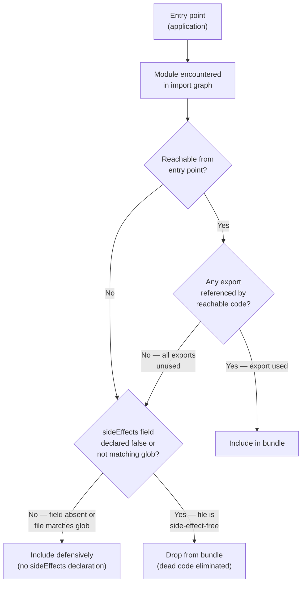

# Tree-Shaking Patterns & Side-Effect Marking

Tree-shaking is the process by which a bundler eliminates dead code — modules and exports
that are imported nowhere in the final application — from the output bundle. The term comes
from the mental model of shaking a dependency tree until the dead leaves fall off; only the
code that is actually reachable from the application's entry points survives. Bundlers such
as Rollup, esbuild, and Webpack implement tree-shaking through static analysis of ES module
import and export bindings. Because ES module syntax (`import` / `export`) is resolved at
parse time rather than runtime, the bundler can build a complete, accurate graph of which
exports are referenced and which are not — without executing any code.

The static nature of ES module syntax is what makes tree-shaking possible in the first
place. A bundler reading `import { formatDate } from './utils'` knows with certainty that
only `formatDate` is requested from that module. If `./utils` also exports `formatCurrency`
and `formatCurrency` is never imported anywhere else in the graph, the bundler can safely
omit it from the bundle. This analysis is performed transitively across the entire import
graph: a module that is imported purely for a re-export that itself goes unused is also
a candidate for elimination. In practice, the savings can be dramatic — a utility library
with fifty exported functions, of which an application uses only three, can contribute
virtually nothing to the final bundle size if both the library and the application are
authored correctly.

The complicating factor is side effects. A module with side effects is not safe to eliminate
even if none of its exports are referenced, because the side effect runs simply by virtue
of the module being evaluated. Common side effects include: registering a global event
listener, patching a prototype, importing a CSS file that adds global styles, calling
`customElements.define()`, or writing to a global registry. A polyfill module is entirely
side-effectful by design — its job is to mutate the global environment, and it exports
nothing the consumer needs to import explicitly. The bundler cannot know by static analysis
alone which modules have side effects and which do not, so without additional information
it must assume conservatively that every module might have side effects and include them
all. This conservative default entirely defeats tree-shaking for library packages.

The `sideEffects` field in `package.json` was introduced to resolve this tension. It allows
library authors to communicate to bundlers which files in the package are side-effect-free
and may be dropped if unreferenced, and which files must be included regardless of import
status. When set to `false`, the entire package is declared side-effect-free. When set to
an array of glob patterns, only those matching files are treated as side-effectful; all
other files in the package are eligible for dead-code elimination. Without this declaration,
Webpack and other bundlers fall back to the conservative default and include every file
that is transitively reachable, even when none of its exports are used. Authoring a
tree-shakeable library therefore requires both correct ES module syntax and correct
`sideEffects` metadata.

## Design Thinking

### Why static ESM syntax is required

Tree-shaking is a static analysis operation, and static analysis can only operate on
syntax that is fixed at parse time. ES module `import` and `export` declarations are
exactly this: they appear at the top level of a module, their specifiers are string
literals, and they are resolved before any code executes. The bundler reads these
declarations, constructs a directed graph where each edge is an import relationship, and
traverses the graph from the entry point to identify reachable exports. Any export node
that has no incoming edges from the entry point's transitive closure is marked unreachable
and dropped from the output.

CommonJS modules violate every one of these requirements. `require()` can appear anywhere
in a function body, inside a conditional, inside a loop. Its argument can be a computed
string: `require(process.env.NODE_ENV === 'production' ? 'lodash.min' : 'lodash')`. The
module's export surface is defined by assignments to `module.exports`, which can happen at
any point during execution. None of this is statically analyzable. Bundlers do apply
heuristics to CommonJS — Rollup's `@rollup/plugin-commonjs` and Webpack's built-in CJS
support attempt to identify named exports through pattern matching — but the results are
fragile and incomplete. A CommonJS module should be treated as a single atomic unit that
is either fully included or fully excluded; fine-grained tree-shaking within a CJS module
is not reliably achievable.

Dynamic `import()` — the expression form, `import('./module')` — falls into a middle
ground. Dynamic imports are lazy and code-split by bundlers, but when the specifier is a
computed expression (`import(`./${name}`)`) the bundler cannot determine which module is
being loaded and must include all candidates. When the specifier is a static string
literal (`import('./heavy-feature')`), the bundler can resolve it and apply tree-shaking
to the dynamically loaded module's exports, though it includes the entire module file
since the full dynamic import is treated as a single chunk entry. The practical guidance
is to use top-level static `import` bindings for code that should be tree-shaken and
dynamic `import()` for code that should be code-split but not tree-shaken within the
split point.

The interplay between ESM and bundler configuration is also worth understanding. A package
may ship both a CommonJS build and an ESM build. The `exports` field in `package.json`
allows the author to expose different entry points for different environments, using the
`"import"` and `"require"` conditions to route bundlers to the ESM build and Node.js CJS
consumers to the CJS build. If the `exports` field is absent or misconfigured, a bundler
may accidentally resolve to the CJS build and lose all tree-shaking capability for that
package, even if an ESM build exists on disk. This is a particularly insidious failure
mode because the application will still work correctly — it just includes more code than
necessary, and the excess is invisible unless the bundle is analyzed explicitly.

### The `sideEffects` field

The `"sideEffects"` field in `package.json` is the primary contract between a library
author and the bundlers that consume the library. Its semantics are straightforward: `false`
means "I guarantee that no file in this package has side effects; you may drop any file
whose exports are not referenced." An array means "these specific files have side effects
and must be included if they are transitively reachable; all other files are safe to drop."

Setting `"sideEffects": false` on a package that does have side-effectful files is a
correctness bug, not just a configuration mistake. If a consumer imports a polyfill file
from the package — `import 'my-lib/polyfills'` — and the package declares
`"sideEffects": false`, the bundler may conclude that since no exports of `polyfills.js`
are referenced by name, the entire module can be dropped. The polyfill never executes,
the global environment is not patched, and the application silently breaks in environments
that depended on the polyfill. This failure is silent and environment-dependent, making
it one of the harder categories of tree-shaking bugs to diagnose.

The array form gives authors fine-grained control. A component library might ship CSS
modules that inject global styles alongside its JavaScript. The correct declaration would
be `"sideEffects": ["*.css", "*.scss"]`, marking all stylesheet files as side-effectful
while allowing all JavaScript files to be tree-shaken. Some libraries also include a
specific `polyfills.js` entry: `"sideEffects": ["./src/polyfills.js", "*.css"]`. When
a consumer imports only `Button` from the library, neither `polyfills.js` nor any
unreferenced JavaScript module is included — but CSS files that are transitively reachable
are preserved because they match the glob pattern.

Application-level `package.json` files can also use `"sideEffects"` to help the bundler
eliminate dead code within the application itself. If an internal utilities module is
side-effect-free, declaring that at the package level allows the bundler to drop unused
internal exports just as it would for an external library. This is particularly valuable
in monorepo setups where internal packages are consumed by multiple applications — a shared
utilities package with a `"sideEffects": false` declaration contributes exactly what each
consuming application uses and nothing more.

### Pure annotations (`/*#__PURE__*/`)

Static analysis of export reachability handles modules and named export bindings. But
within a module, there is a finer granularity of dead-code elimination: individual
function calls and expressions. The bundler cannot determine by static analysis alone
whether a function call has side effects. `createRegistry()` might register a global
singleton, patch a prototype, or do nothing observable — the bundler cannot know without
executing the function. The conservative default is to assume all function calls have side
effects and include them if the containing module is included.

The `/*#__PURE__*/` annotation is the escape hatch for this limitation. Placing the
comment immediately before a function call or expression tells the bundler that the call
is pure — it has no side effects and its return value can be safely discarded if it is
not referenced. The bundler then applies the same reachability logic to the call's return
value as it would to a named export: if the result is unused, the call is dropped entirely.
The most common use case is class instantiation and decorator application. When TypeScript
compiles a class with decorators, or when Babel emits class helper calls, the emitted code
contains top-level function calls like `_decorate(...)` or `_classCallCheck(...)`. Babel
and the TypeScript compiler both insert `/*#__PURE__*/` automatically for these emitted
calls, which allows bundlers to drop decorator-instrumented classes entirely when they are
not imported.

The annotation is a promise from the code author — or the compiler — to the bundler. If
the annotation is incorrect (the annotated call does have side effects), the bundler will
silently drop it and the side effect will not run. This is the same category of correctness
risk as `"sideEffects": false`. In hand-authored code, the annotation should only be used
when the author can verify that the annotated call truly has no observable side effects.
In compiler-emitted code, the compiler toolchain is responsible for placing the annotation
correctly — which is why upgrading Babel or TypeScript can change bundle output even without
any source changes, as compiler authors refine their judgments about which emitted patterns
are safe to annotate as pure.

### Barrel files (`index.ts`) and tree-shaking

A barrel file is a module whose sole purpose is to re-export symbols from other modules:
`export { Button } from './Button'; export { Input } from './Input'; ...`. Barrels are
widely used in component libraries and utility packages because they provide a single
import point: `import { Button, Input } from 'my-lib'` instead of
`import { Button } from 'my-lib/Button'; import { Input } from 'my-lib/Input'`.

The tree-shaking hazard of barrel files is subtle. When a consumer imports
`import { Button } from 'my-lib'`, the bundler evaluates the barrel module, which means
it evaluates every re-export statement in the barrel. If any of the modules that the
barrel re-exports from has a side effect — a CSS import, a global registration, a
top-level `console.log` for debugging — the bundler must include that module to preserve
the side effect, even if the consumer never imported any symbol from it. A barrel that
re-exports from twenty modules, one of which has an accidental side effect, forces all
twenty modules into every consumer's bundle regardless of which exports they requested.

The solution depends on the context. In library code, the safest approach is to ensure
that every file re-exported from a barrel is side-effect-free, so the bundler can
confidently include only the referenced exports. For library packages this is achievable
because the author controls all the source files. In application code, barrel files often
emerge organically as a convenience pattern and their side-effect status is harder to
audit. Large applications sometimes benefit from disabling barrel-based imports entirely
for internal modules, using direct import paths instead, and configuring ESLint rules to
enforce this. The ESLint rule `no-restricted-imports` can be configured to disallow
importing from known barrel files and suggest the direct path instead.

When barrel files are necessary, the `"sideEffects"` field helps. If the package declares
`"sideEffects": false`, the bundler knows that even though the barrel module is evaluated,
none of its re-exported modules have side effects, so unreferenced modules can be dropped.
This is the intended use of `"sideEffects": false` for library packages — it is what allows
`import { Button } from 'my-lib'` to include only the `Button` implementation and none of
the other components the library exports, even when a barrel is used as the entry point.

### Analyzing what survived tree-shaking

Writing correct tree-shakeable code is necessary but not sufficient. Developers also need
to verify that the bundler is in fact eliminating the intended dead code, and that
upgrades to library dependencies or changes to the module graph have not regressed bundle
composition. Bundle analysis tools fill this role.

Rollup's `rollup-plugin-visualizer` generates a treemap visualization of the bundle's
module composition, showing which modules contributed how many bytes to each output chunk.
A utility module that should have been tree-shaken but instead appears as a large block
in the treemap is an immediate signal that something in the module graph is preventing
elimination. The visualization is particularly effective at identifying large transitive
dependencies — a module that seems small in source may pull in a large dependency graph
that all survives into the bundle.

Webpack's `webpack-bundle-analyzer` provides the same treemap visualization for Webpack
builds and supports both the stats JSON output and the built-in `--analyze` flag in
Webpack CLI. For esbuild, the `--analyze` flag and `--metafile` option produce a JSON
file that can be fed to tools like `esbuild-visualizer` or analyzed with custom scripts.
Vite exposes bundle visualization through the `rollup-plugin-visualizer` since Vite's
production build is powered by Rollup.

Effective use of these tools in a team context means running bundle analysis in CI and
comparing output against a baseline. A CI job that builds the bundle, extracts the size
of a specific module or the total bundle size, and fails the build when the size exceeds
a threshold provides automated regression detection for tree-shaking effectiveness. Tools
like `bundlesize`, `size-limit`, and Lighthouse's bundle analysis integrations can encode
these thresholds as configuration checked into source control. The goal is to make bundle
size regressions visible as pull-request failures rather than post-deployment surprises.

## Best Practices

**MUST use named exports instead of `export default { foo, bar }` for all library modules.**
A default export that is a plain object is opaque to the tree-shaker: the bundler sees a
single binding (the default export) that is an object value, and property access on that
object cannot be resolved statically. When a consumer writes `import lib from 'my-lib'`
and then calls `lib.formatDate()`, the bundler cannot determine which properties of `lib`
are used — it must include the entire object and everything it references. Named exports
such as `export function formatDate() {}` and `export function formatCurrency() {}` are
individually reachable bindings. The bundler includes exactly those that appear on the left
side of an import binding. The discipline of using named exports is the single most
impactful authoring choice for tree-shaking effectiveness, and it should be enforced by
ESLint's `import/no-default-export` rule in library packages.

**MUST NOT use CommonJS (`module.exports`, `require`) in packages intended to be
tree-shakeable.** CommonJS modules are a black box to the tree-shaker. The bundler cannot
determine a CommonJS module's export surface without executing it, because exports are
defined by runtime assignments to `module.exports` and `exports`. Even bundler plugins that
attempt to synthesize named exports from CommonJS patterns — such as Rollup's
`@rollup/plugin-commonjs` — produce incomplete results for anything more complex than a
simple `module.exports = { foo, bar }` assignment. A package that ships only a CommonJS
build forces every consumer to include the entire package regardless of how few exports
they use. When targeting both Node.js and bundlers, use the `exports` field in
`package.json` to provide a CommonJS build under the `"require"` condition and an ESM
build under the `"import"` condition, so bundlers always resolve to the tree-shakeable
ESM build while Node.js CJS consumers receive the compatible CJS build.

**MUST declare `"sideEffects"` in every package's `package.json` that is intended to be
consumed by a bundler.** Omitting the field causes bundlers to treat the package
conservatively, including all reachable modules even when their exports go unreferenced.
For a utility library with many functions, this can mean the entire library lands in every
consumer's bundle even when only one function is imported. The correct value is `false`
for fully side-effect-free packages, or an array of glob patterns for packages that include
side-effectful files such as CSS imports or polyfills. Auditing the package for actual
side effects before declaring `false` is important — setting it incorrectly silently drops
real side effects, and the breakage may only appear in specific environments where those
side effects were relied upon.

**SHOULD annotate top-level IIFE class expressions and function calls that cannot be
statically proven side-effect-free with `/*#__PURE__*/`.** When a module contains a
top-level expression like `const registry = createGlobalRegistry()`, the bundler conservatively
includes the call and its result even if `registry` is never exported or referenced.
Annotating it as `const registry = /*#__PURE__*/ createGlobalRegistry()` tells the bundler
that the call can be dropped if `registry` is not reachable. This annotation is most
valuable for class factory patterns and decorator-heavy code. TypeScript and Babel emit
this annotation automatically for class declarations and decorator helpers; manual
annotation is needed for hand-authored factory calls that the author can guarantee are
side-effect-free.

**MUST NOT annotate a call that writes to a global variable, fires a network request, or
mutates shared state with `/*#__PURE__*/`.** The bundler will silently drop such a call
entirely, and the side effect will not execute — causing breakage that may only appear in
specific environments where that side effect was relied upon.

**SHOULD verify tree-shaking effectiveness in CI by checking bundle size against a
committed baseline after each change to a library's export surface.** Adding a new export,
changing a re-export chain, or modifying which modules a barrel file re-exports can all
expand the set of code that survives tree-shaking in consumer bundles. Without automated
size tracking, these regressions are invisible until a consumer notices their bundle has
grown. A size budget enforced in CI — using `size-limit`, `bundlesize`, or a custom script
that reads from the bundler's metafile — surfaces these regressions as pull-request
failures where they can be addressed before merging. The budget should cover both the
library's own published bundle and a representative consumer fixture that imports a small
subset of the library's exports, verifying that the unused exports truly do not appear in
the consumer's output.

## Visual



## Example

```js
// package.json for a utility library
// {
//   "name": "date-utils",
//   "type": "module",
//   "exports": { ".": { "import": "./dist/index.js", "require": "./dist/index.cjs" } },
//   "sideEffects": ["*.css", "./src/polyfills.js"]
// }

// src/index.js — named exports, no default object export
export function formatDate(date, locale = 'en-US') {
  return new Intl.DateTimeFormat(locale).format(date);
}

export function formatCurrency(amount, currency = 'USD', locale = 'en-US') {
  return new Intl.NumberFormat(locale, {
    style: 'currency',
    currency,
  }).format(amount);
}

export function formatRelativeTime(date, base = new Date()) {
  const diffMs = date - base;
  const diffSec = Math.round(diffMs / 1000);
  const rtf = new Intl.RelativeTimeFormat('en', { numeric: 'auto' });
  return rtf.format(diffSec, 'second');
}

// Consumer — imports only formatDate
// import { formatDate } from 'date-utils';
// Result: formatCurrency and formatRelativeTime are excluded from the bundle.
// The *.css glob in sideEffects ensures any CSS imports survive;
// ./src/polyfills.js is preserved if reachable even with no exported refs.
```

## Common Mistakes

- Exporting everything from a barrel `index.ts` that re-exports modules with side effects
  (CSS imports, global registrations) — the bundler must include those side-effectful modules
  regardless of which named exports the consumer requested, bringing in code that appears
  unrelated to the import.
- Declaring `"sideEffects": false` when the package imports CSS files, registers custom
  elements, or patches global prototypes — the bundler silently drops the side effects,
  and the application breaks only in environments that relied on them, making the root cause
  difficult to identify.
- Using `export default { a, b, c }` (an object default export) under the assumption that
  bundlers will tree-shake individual properties — bundlers treat the entire default export
  object as a single unit and include it whenever the default is imported anywhere.
- Omitting the `"exports"` field from `package.json` when providing both CJS and ESM builds
  — without explicit condition routing, bundlers may resolve to the CJS build and lose
  tree-shaking for the entire package, even when a perfectly valid ESM build exists in the
  package directory.
- Importing from deep paths (`import { foo } from 'lib/utils/foo'`) as a workaround for
  barrel bloat without verifying that these deep paths are part of the package's documented
  public API — deep imports bypass the `exports` field and may break across major library
  versions when the internal file structure changes.
- Adding `/*#__PURE__*/` to function calls that do write to globals or perform observable
  mutations — the annotation is a guarantee to the bundler, not a suggestion, and an
  incorrect annotation silently drops code that must run.

## Related FEEs

- FEE-800 — Build Tooling and Module Systems Overview
- FEE-801 — ES Modules and CommonJS Interoperability
- FEE-804 — Code Splitting and Lazy Loading
- FEE-806 — Bundle Size Budgets and Performance Regression Prevention
- FEE-808 — Module Federation

## References

- Rollup documentation: Tree-shaking — https://rollupjs.org/introduction/#tree-shaking
- Webpack documentation: Tree shaking — https://webpack.js.org/guides/tree-shaking/
- esbuild documentation: Tree shaking — https://esbuild.github.io/api/#tree-shaking
- npm: package.json `sideEffects` field (Webpack docs) — https://webpack.js.org/guides/tree-shaking/#mark-the-file-as-side-effect-free
- Parcel: Scope hoisting and tree shaking — https://parceljs.org/features/scope-hoisting/
- size-limit: Performance budget tool — https://github.com/ai/size-limit
- rollup-plugin-visualizer — https://github.com/btd/rollup-plugin-visualizer
- web.dev: Reduce JavaScript payloads with tree shaking — https://web.dev/articles/reduce-javascript-payloads-with-tree-shaking
