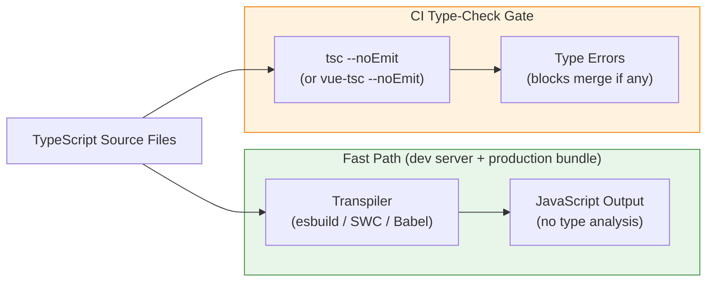

# [FEE-810] TypeScript Integration in the Build Pipeline

:::info
Modern bundlers such as esbuild, SWC, and Vite strip TypeScript's type annotations without checking them, so a file full of type errors can transpile and ship without a single warning. This article separates that fast, type-ignorant transpile path from the separate `tsc --noEmit` (or `vue-tsc --noEmit`) gate that actually verifies types, and covers the tsconfig, CI caching, and monorepo settings that keep both paths correct. It also covers the flags, `isolatedModules`/`verbatimModuleSyntax` and `erasableSyntaxOnly`, that make per-file stripping safe in the first place, and how TypeScript 7.0's native compiler and Node.js's built-in type stripping are changing the performance case for this split.
:::

## Context

TypeScript's role in the build pipeline differs from its role as a type-checker. Modern bundlers, including esbuild, Vite, SWC, and Babel with `@babel/plugin-transform-typescript`, process TypeScript by stripping type annotations from source files during transpilation. This is dramatically faster than invoking the TypeScript compiler (`tsc`) for a full compilation, because these tools skip type resolution entirely and treat type annotations as syntax to be erased rather than semantics to be verified. The resulting JavaScript is produced in milliseconds per file. Transpile-only tooling also produces no type errors: a file containing dozens of type violations passes through esbuild or SWC without a single warning, and the output JavaScript runs exactly as if the types had been correct.

This distinction has a concrete architectural consequence: the build pipeline should be designed as two independent phases rather than one unified step. The first phase is transpilation, a fast, type-ignorant conversion of TypeScript source to JavaScript that runs on every file save during development and as the production bundling step. The second phase is type-checking, a separate invocation of `tsc --noEmit` or `vue-tsc --noEmit` that verifies the entire program's type correctness without emitting any output files. Transpilation stays in the hot reload path; type-checking runs as a CI gate.

Conflating the two phases means running `tsc` with emit as the build step. `tsc`'s own JavaScript-hosted checker is markedly slower per file than a native-code transpiler such as esbuild or SWC, so the emit step becomes the pipeline's bottleneck. The exact multiplier depends on project size and hardware, and it has shifted again with TypeScript 7.0's native compiler (see Design Thinking). The more durable problem is architectural rather than a matter of speed: `tsc` is not a bundler. It does not perform tree-shaking, code splitting, or chunk hashing, so building through `tsc` alone forfeits those capabilities regardless of how fast type-checking gets.

Understanding why the split is safe requires understanding what TypeScript types actually are. Type *annotations*, the `: string`, `<T>`, `interface`, and similar syntax, are erasable: they exist for the developer and the type-checker, and the JavaScript a browser or Node.js runtime executes contains no trace of them. Stripping annotations without analyzing them is safe from the runtime's perspective, because the runtime's behavior depends only on the logic of the JavaScript code, not on whether the types were checked. A few TypeScript constructs are not pure annotations, though: enums, namespaces that hold runtime values, parameter properties, and decorators combined with `emitDecoratorMetadata` all generate real JavaScript, and a transpiler has to handle them specially, or refuse to compile them, rather than simply deleting the syntax. The type system's remaining value, catching errors before runtime, is the type-checker's job, and nothing runs that job automatically. Scheduling it is a separate, explicit step in the pipeline.

Configuring a TypeScript project for a modern build pipeline therefore requires making two things explicit: what the transpiler needs to know about the project structure, and what `tsc` needs to know to perform an accurate type check. The `tsconfig.json` file serves both roles, but for large projects it is common to maintain a base configuration that both the type-checker and bundler inherit, with a separate `tsconfig.build.json` that overrides only the options specific to the type-check pass, such as setting `noEmit: true` so the type-checker never tries to write files. This separation keeps configuration explicit and prevents the type-check path from accidentally inheriting emit options intended for library builds, or vice versa.

## Visual



## Example

```jsonc
// tsconfig.json — base configuration shared by the type-checker and IDE
{
  "compilerOptions": {
    "target": "ESNext",
    "module": "ESNext",
    "moduleResolution": "bundler",
    "strict": true,
    "verbatimModuleSyntax": true,
    "incremental": true,
    "tsBuildInfoFile": ".tsbuildinfo",
    "declaration": true,
    "declarationMap": true,
    "declarationDir": "dist/types",
    "paths": {
      "@/*": ["./src/*"]
    },
    "skipLibCheck": true
  },
  "include": ["src"]
}

// tsconfig.build.json — extends base; used only for the CI type-check pass
// {
//   "extends": "./tsconfig.json",
//   "compilerOptions": {
//     "noEmit": true,
//     "declaration": false,
//     "declarationMap": false
//   }
// }

// vite.config.ts — bundler alias must mirror tsconfig paths
// import { defineConfig } from 'vite';
// import { resolve } from 'path';
// export default defineConfig({
//   resolve: {
//     alias: { '@': resolve(__dirname, 'src') }
//   }
// });

// CI pipeline (pseudo-YAML, two independent jobs):
//
// type-check:
//   steps:
//     - restore_cache: .tsbuildinfo
//     - run: tsc -p tsconfig.build.json
//     - save_cache: .tsbuildinfo
//
// build:
//   steps:
//     - run: vite build   # transpiles only, no type-checking
```

`verbatimModuleSyntax: true` and `skipLibCheck: true` both match the defaults `create-vite`'s current React and Vue templates ship. Neither is a stylistic choice; both close gaps described in Design Thinking below.

## Best Practices

**MUST run `tsc --noEmit` (or `vue-tsc --noEmit` for Vue projects) as a required CI
check separate from the build step.** The transpiler used to produce the development
server and the production bundle does not analyze types. A build that compiles and deploys
without a corresponding type-check pass provides no type safety guarantees. The type-check
must be a required status check, meaning CI blocks the merge when it fails, not an
advisory warning a developer can dismiss. Running it as a separate CI job that can execute
in parallel with tests keeps the overall pipeline time low while preserving the correctness gate.

**MUST configure `"strict": true` in `tsconfig.json` for all projects.** This single flag
turns on a family of checks including `strictNullChecks`, `noImplicitAny`,
`strictFunctionTypes`, `strictBindCallApply`, `strictPropertyInitialization`, `noImplicitThis`,
`alwaysStrict`, and `useUnknownInCatchVariables`. Each of these flags prevents a distinct
class of runtime errors. Projects that omit `"strict": true` and rely on TypeScript's
permissive defaults receive much weaker type safety guarantees: the type system will
accept patterns that routinely produce null dereferences and implicit `any` propagation
in production code.

**SHOULD enable `"incremental": true` and cache the `.tsbuildinfo` file between CI runs.**
Incremental mode causes `tsc` to write a build state file after each type-check pass and
reuse it on subsequent runs, rechecking only files that changed or are transitively
affected. The size of the speedup depends on how much of a given pull request's diff
touches the dependency graph, but for typical changes that touch a small fraction of the
codebase, the reduction is substantial. The cache key for the `.tsbuildinfo` artifact
should include the TypeScript version and the content hash of `tsconfig.json` so that a
stale cache is discarded when either changes.

**SHOULD keep `tsconfig.json` `paths` aliases synchronized with the bundler's alias
configuration.** TypeScript's `paths` field is used only by the type-checker and the IDE;
the bundler resolves imports independently. An alias declared in `paths` but absent from
the bundler's alias configuration will type-check correctly but produce a module-not-found
error at build time. Maintaining a shared alias definition that both the TypeScript config
and the Vite or Webpack config reference eliminates this class of desync and makes the
alias mapping a single source of truth rather than two independently maintained copies.

**MUST NOT use `// @ts-ignore` or `// @ts-expect-error` suppression comments without an
explanatory comment immediately above describing the specific reason the suppression is
safe.** Suppressions silence the type-checker for the following line without correcting
the underlying type issue. When a suppression comment is added without explanation, the
reason is lost, and future readers cannot determine whether the suppression is still
appropriate or whether the type system has since been updated to handle the case correctly.
Suppressions that accumulate without context degrade the type system from a correctness
tool into a source of noise. The explanatory comment above the suppression must name the
specific reason: a third-party library with an incorrect type definition, or a specific
TypeScript compiler limitation being worked around. Naming the reason lets the suppression
be revisited once the underlying cause is resolved.

## Design Thinking

### Why single-file stripping needs `verbatimModuleSyntax` (or `isolatedModules`)

The claim in Context, that stripping types without analyzing them is safe, depends on a
specific TypeScript setting. A per-file transpiler such as esbuild or SWC, or
`ts.transpileModule` under the hood, processes one file at a time with no view of the rest
of the program. Most TypeScript syntax strips cleanly under that constraint, but a few
constructs do not. A `declare const enum` is the clearest case: referencing a const enum
member is normally replaced by its literal value at compile time, which requires the
compiler to have already resolved the enum's declaration elsewhere in the program. A
single-file transpiler has no such visibility, so it cannot inline the value; left alone,
it would emit a reference to an object that does not exist at runtime. The same blind spot
applies to telling a type-only import apart from a value import across file boundaries.

TypeScript's `isolatedModules` flag makes `tsc` itself reject the constructs a single-file
transpiler cannot handle correctly, so the error surfaces during type-checking instead of
as a silent miscompilation later. Since TypeScript 5.0, `verbatimModuleSyntax` supersedes
it: it enables everything `isolatedModules` enforces and additionally requires imports and
exports to state explicitly whether they are type-only (`import type { Foo } from
'./foo'`), removing the remaining ambiguity that per-file transpilers otherwise had to
guess at. `create-vite`'s current templates set `verbatimModuleSyntax: true` for exactly
this reason. A project that transpiles with esbuild, SWC, or Babel and sets neither flag
is relying on the transpiler happening not to encounter the small set of constructs it
cannot handle correctly; that is not a guarantee `tsc` enforces on its behalf.

### Transpile-only versus type-checked builds

The practical experience of the two-phase pipeline is easy to misread when a developer
is working locally. The development server runs, changes appear immediately in the browser,
and the terminal is silent on type errors. A silent terminal does not mean the code is
type-correct: the transpiler emitted JavaScript without running any type analysis, so it
had nothing to report. A developer can introduce a type violation on every changed line
and the dev server will continue to reload successfully, surfacing nothing in the build output.

The CI pipeline exists to close this gap. Running `tsc --noEmit` as a required check in
CI means that every pull request is verified for type correctness before it can merge,
regardless of whether the developer ran the type-checker locally. The practical consequence
for pipeline design is that `tsc` is not in the hot reload path at all. It runs either as
a parallel job alongside the test suite, or as a serial check after the build step, but
never as a prerequisite to the fast transpile. Some teams run `tsc --noEmit --watch` as a
background process in the development environment to surface type errors without blocking
the dev server, but this is a developer experience enhancement, not a pipeline requirement.

The failure mode to design against is the build that passes and deploys while containing
type errors that a user will encounter at runtime. This occurs when type-checking is
absent from CI or configured as a non-required check. If the type-check is only advisory,
a pull request that introduces a type error can still merge and deploy. The error then
surfaces as a runtime failure the first time that code path executes in production.

### Node.js's built-in type stripping

Node.js now performs a version of the transpile-only step itself, without a bundler at
all. Type stripping became the default for `.ts` files in Node 22.18.0 and Node 23.6.0,
and it ships on by default in Node 24, the current LTS line. Node replaces TypeScript
syntax with whitespace rather than deleting it, so line numbers in stack traces stay
aligned with the source, and it performs no type analysis: a `.ts` file with type errors
still runs. The same limitations that motivate `isolatedModules` and `verbatimModuleSyntax`
apply here for the same underlying reason. Enums, namespaces that hold runtime values, and
parameter properties all require generating new JavaScript rather than deleting syntax, so
Node rejects those constructs with `ERR_UNSUPPORTED_TYPESCRIPT_SYNTAX` unless the process
opts into `--experimental-transform-types`. Decorators are a separate case: they are still
a TC39 Stage 3 proposal, so Node does not transform them under any flag and provides no
polyfill, and a `.ts` file using decorators fails with a parser error regardless of
`--experimental-transform-types`. TypeScript 5.8 added a matching compiler option,
`erasableSyntaxOnly`, that makes `tsc` reject non-erasable constructs such as enums,
namespaces with runtime code, and parameter properties ahead of time, so a project that
intends to run under Node's native stripping can catch the incompatibility during
type-checking instead of at runtime. Running `.ts` files directly under Node still depends
on a separate `tsc --noEmit` pass for correctness, since Node performs no type analysis of
its own.

### TypeScript 7.0 and the native compiler

The speed argument for splitting transpilation from type-checking has rested on `tsc`
being slow relative to native-code transpilers. That baseline shifted on July 8, 2026,
when TypeScript 7.0 reached general availability with a compiler rewritten in Go, an
effort Microsoft calls Project Corsa and shipped in preview under the `tsgo` binary.
Microsoft reports full-build speedups of roughly 8x to 12x over the prior JavaScript-hosted
compiler; the VS Code codebase's own type-check dropped from 125.7 seconds to 10.6 seconds,
and Slack reported its CI type-check falling from 7.5 minutes to 1.25 minutes.
`npm install -D typescript` now installs 7.0 by default.

This does not remove the case for the two-phase pipeline described in Context: `tsc` is
still not a bundler, and CI still benefits from running the type-check in parallel with
tests rather than serially inside the build. But the size of the gap that made
`tsc --noEmit` feel too slow to run on every save is now considerably smaller, and any
specific multiplier quoted for `tsc` versus a transpile-only bundler should be
re-benchmarked against TypeScript 7.0 rather than assumed. One caveat as of this writing:
TypeScript 7.0 shipped without a stable programmatic compiler API, so tools that embed the
compiler directly, including `typescript-eslint` and the Vue, Svelte, and Astro template
checkers, still run on TypeScript 6.0 until that API lands, expected in TypeScript 7.1.

### `tsconfig.json` project references in monorepos

Large monorepos face a scaling problem with type-checking. Running `tsc` against the entire
codebase requires TypeScript to load and type-check every source file across every package,
even when only one package has changed. For codebases with hundreds of packages and tens of
thousands of source files, this produces a type-check step that runs for many minutes. The
check is accurate, but the latency defeats the purpose of running it as a fast CI gate.

TypeScript project references solve this by decomposing the type graph. Each package in
the monorepo has its own `tsconfig.json` with `"composite": true` set. The `composite`
flag requires that the package's output declaration files (`.d.ts`) are produced and
placed in a known location, so that other packages that depend on this package can consume
its types from the pre-built declarations rather than re-type-checking its source. A root
`tsconfig.json` or `tsconfig.references.json` lists all packages in the `references` array.
When `tsc --build` is invoked at the root, it checks the `.tsbuildinfo` file for each
package to determine which packages need to be re-checked based on which source files
changed, and skips packages whose sources and dependencies are unchanged.

The result is a type-check step that is proportional to the scope of the change rather
than the size of the codebase. A pull request that touches one package re-checks that
package and any packages that transitively depend on it; unchanged packages are skipped.
Adopting this pattern has a real configuration cost: each package needs its own
`tsconfig.json`, and the root `references` array must be kept in sync with the actual
package graph. The payoff varies with package shape and hardware; one documented case study on a
22-package monorepo reported cold-build times dropping from about 11 minutes to 3 minutes
after adopting project references.
Nx's guide to the feature covers the setup and its ongoing maintenance cost in more depth
(see References).

### `paths` aliasing and bundler alignment

TypeScript's `paths` field in `tsconfig.json` allows import aliases to be resolved by the
type-checker. A common pattern is mapping `@/components` to `./src/components`, so that
imports throughout the codebase can use the short alias rather than relative paths that
change with directory depth. When TypeScript sees `import { Button } from '@/components'`,
it consults the `paths` map to resolve the alias to its real location, type-checks the
import correctly, and provides IDE autocomplete as if the full path had been written.

The bundler is unaware of `paths`. TypeScript's path resolution is not communicated to
Vite, Webpack, or esbuild at build time. A project that configures `paths` in
`tsconfig.json` but does not add the equivalent alias configuration to the bundler will
type-check successfully: TypeScript resolves the alias and finds the module. It will still
fail at runtime when the bundler cannot resolve the same import. Vite exposes this through
`resolve.alias` in `vite.config.ts`; Webpack exposes it through `resolve.alias` in
`webpack.config.js`; esbuild exposes it through the `alias` option. Both the TypeScript
configuration and the bundler configuration must be kept in sync, mapping the same aliases
to the same real paths.

The synchronization requirement is a recurring source of subtle bugs. A developer adds a
new alias to `tsconfig.json`, the type-checker accepts it, and everything appears correct
locally because the IDE uses TypeScript's resolution. The bug surfaces only at build time,
or in environments that run the bundler without first running the type-checker, where the
bundler produces a module-not-found error. The safest mitigation is a single source of
truth for alias configuration: a shared object in the Vite config, also passed to a
TypeScript path-generation utility, so that both configurations stay in sync mechanically
rather than by manual discipline.

### Declaration files for library builds

When the build pipeline's output is a library rather than an application, the pipeline must
emit `.d.ts` declaration files alongside the compiled JavaScript. Declaration files describe
the types of the library's exports to consumers without requiring consumers to compile the
library's TypeScript source. A consumer that installs the library and imports from it relies
on the `.d.ts` files for IDE autocomplete, inline documentation, and type inference. Without
declaration files, the library's exports have the type `any` from the consumer's perspective,
and the type-checker cannot verify that the consumer is using the library correctly.

Two `tsconfig.json` flags control declaration file emission. The `"declaration": true` flag
tells `tsc` to produce a `.d.ts` file alongside each JavaScript output file. The
`"declarationMap": true` flag produces an additional `.d.ts.map` file that maps each
declaration back to the original TypeScript source, enabling IDE features such as Go to
Definition to jump to the source rather than the generated declaration. Both flags should
be enabled in the `tsconfig.json` used for library builds. They are distinct from the
`"noEmit": true` flag used in the type-check-only path; a library build must emit files,
so `"noEmit"` must be absent or set to `false` in the library build configuration.

The `"declarationDir"` option specifies where `tsc` writes the declaration files, and it
should be set to the same directory as the bundler's output so that the published package
includes both the JavaScript files and the corresponding declaration files in the expected
locations. Many library build pipelines use a bundler such as Rollup or Vite's library
mode for the JavaScript output and a separate `tsc` invocation for the declaration files,
since bundlers typically do not emit TypeScript declarations. The pipeline step that
generates declarations can run in parallel with the bundler step, since neither depends
on the other's output.

### Incremental type-checking and `.tsbuildinfo`

Even without project references, TypeScript provides a mechanism for accelerating the
type-check pass on subsequent runs: the `"incremental": true` compiler option. When
incremental mode is enabled, `tsc` writes a `.tsbuildinfo` file after each successful
type-check pass. This file contains a serialized representation of the type-check state:
which files were processed, what their modification times were, what type information was
derived, and which diagnostics were produced. On the next run, `tsc` reads the
`.tsbuildinfo` file, compares it against the current state of the filesystem, identifies
which files have changed or are transitively affected by changed files, and rechecks only
those files. Files that are unchanged and whose transitive dependencies are unchanged are
skipped entirely.

The benefit in CI is significant for codebases where most pull requests touch a small
fraction of the total source files: a type-check that takes minutes on a cold run can drop
sharply once the `.tsbuildinfo` file from the previous run is restored as a cache artifact,
since only changed files and their transitive dependents are rechecked. This requires the
CI pipeline to cache the `.tsbuildinfo` file between runs, storing it as a CI artifact
keyed by a cache key that reflects the content of `tsconfig.json` and the installed
versions of TypeScript and its dependencies. When the `tsconfig.json` changes or TypeScript
is upgraded, the cache key changes, the old `.tsbuildinfo` file is discarded, and a full
type-check runs to rebuild the state.

The `.tsbuildinfo` file should be committed to `.gitignore` so it does not appear in
version control, but it must be preserved between CI runs to deliver the performance
benefit. If the CI environment creates a fresh workspace for every run without restoring
the cache, the incremental option provides no benefit: every run is a cold start. Most
CI platforms provide first-class support for caching build artifacts between runs on the
same branch, and the `.tsbuildinfo` file is a straightforward artifact to cache since its
path is deterministic and its format is stable between TypeScript patch releases.

## Common Mistakes

- Running `tsc` with emit as the primary build step, relying on it for both type-checking
  and JavaScript output. `tsc`'s own compiler is markedly slower per file than a
  native-code transpiler, and unlike a bundler it does not tree-shake, code-split, or hash
  output chunks, so this forfeits capabilities the pipeline needs regardless of how fast
  type-checking becomes.
- Omitting `tsc --noEmit` from CI entirely and relying on editor warnings. Type errors are
  not caught until a developer opens the affected file, so violations committed by one
  team member can go unnoticed until they surface as runtime failures.
- Assuming `"skipLibCheck": true` is always the wrong choice and forcing `false`
  project-wide. Third-party `.d.ts` files routinely ship type errors a project cannot fix,
  which is why `create-vite`'s own templates default to `skipLibCheck: true`. The real,
  narrower tradeoff is that `true` also skips checking the project's own emitted
  declaration files; library authors who need that safety net should verify their `.d.ts`
  output through a separate step rather than disabling `skipLibCheck` for the whole project.
- Using `// @ts-ignore` to suppress a type error introduced by a dependency version bump
  instead of updating the type definitions. The error is a signal that a dependency's API
  changed, and suppressing it defers the resulting runtime breakage to production.
- Configuring TypeScript `paths` aliases in `tsconfig.json` without adding the equivalent
  alias to the bundler configuration. The code type-checks successfully but fails at build
  time or runtime when the bundler cannot resolve the import.
- Forgetting to set `"composite": true` in packages that other packages reference in a
  project-references setup. `tsc --build` refuses to type-check the referencing packages
  until every referenced package is composited correctly.
- Committing the `.tsbuildinfo` file to version control instead of caching it as a CI
  artifact. The file contains absolute paths and is not meaningful across different
  developer machines, so it belongs in `.gitignore` and should be cached only at the CI layer.

## Related Topics

- [Build Tooling & Module Systems Overview](/en/Build%20Tooling%20and%20Module%20Systems/800)
- [Bundlers: Webpack, Vite, Rollup & esbuild](/en/Build%20Tooling%20and%20Module%20Systems/801)
- [Dev Server, HMR & Development Experience](/en/Build%20Tooling%20and%20Module%20Systems/802)
- [Transpilation: Babel, TypeScript Compiler & SWC](/en/Build%20Tooling%20and%20Module%20Systems/803)
- [Tree-Shaking Patterns & Side-Effect Marking](/en/Build%20Tooling%20and%20Module%20Systems/809)

## References

- TypeScript Team, "TSConfig Reference," TypeScript Documentation (2026). https://www.typescriptlang.org/tsconfig
- TypeScript Team, "Project References," TypeScript Handbook (2026). https://www.typescriptlang.org/docs/handbook/project-references.html
- TypeScript Team, "isolatedModules," TSConfig Reference (2026). https://www.typescriptlang.org/tsconfig/isolatedModules.html
- TypeScript Team, "verbatimModuleSyntax," TSConfig Reference (2026). https://www.typescriptlang.org/tsconfig/verbatimModuleSyntax.html
- TypeScript Team, "erasableSyntaxOnly," TSConfig Reference (2026). https://www.typescriptlang.org/tsconfig/erasableSyntaxOnly.html
- TypeScript Team, "strict," TSConfig Reference (2026). https://www.typescriptlang.org/tsconfig#strict
- esbuild, "TypeScript," esbuild Documentation (2026). https://esbuild.github.io/content-types/#typescript
- Vite Team, "TypeScript," Vite Guide (2026). https://vite.dev/guide/features#typescript
- SWC, "TypeScript Support," SWC Documentation (2026). https://swc.rs/docs/configuration/compilation#jscparser
- Vue Language Tools Contributors, "vue-tsc," GitHub (2026). https://github.com/vuejs/language-tools/tree/master/packages/tsc
- Babel, "@babel/plugin-transform-typescript," Babel Documentation (2026). https://babeljs.io/docs/babel-plugin-transform-typescript
- Matt Pocock, "Understanding Isolated Modules in TypeScript," Total TypeScript (2026). https://www.totaltypescript.com/workshops/typescript-pro-essentials/configuring-typescript/understanding-isolated-modules-in-typescript
- Daniel Rosenwasser, "Announcing TypeScript 7.0," TypeScript Team Blog (2026). https://devblogs.microsoft.com/typescript/announcing-typescript-7-0/
- Visual Studio Magazine, "TypeScript 7.0 RC Moves Microsoft's Go Rewrite Into the Mainline Compiler," Visual Studio Magazine (2026). https://visualstudiomagazine.com/articles/2026/06/22/typescript-7-0-rc-moves-microsofts-go-rewrite-into-the-mainline-compiler.aspx
- Node.js Project, "Type Stripping," Node.js API Documentation (2026). https://nodejs.org/api/typescript.html
- vitejs/vite, "Provide explanation of `skipLibCheck: true` default in tsconfig.json of starter templates," GitHub Issue #7867 (2022). https://github.com/vitejs/vite/issues/7867
- Gabriel Anhaia, "TypeScript Project References: 11-Minute Builds Down to 3," DEV Community (2026). https://dev.to/gabrielanhaia/typescript-project-references-11-minute-builds-down-to-3-2kif
- Nx, "Everything You Need to Know About TypeScript Project References," Nx Blog (2026). https://nx.dev/blog/typescript-project-references
