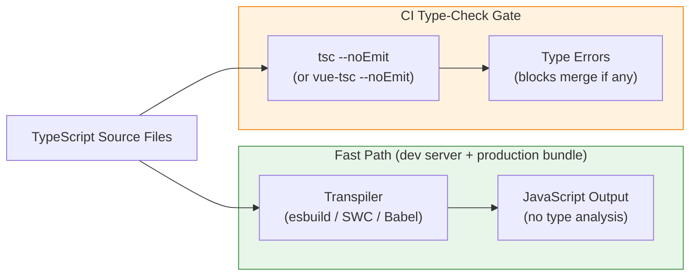

# TypeScript Integration in the Build Pipeline

TypeScript's role in the build pipeline is fundamentally different from its role as a
type-checker. Modern bundlers — esbuild, Vite, SWC, and Babel with
`@babel/plugin-transform-typescript` — process TypeScript by stripping type annotations
from source files during transpilation. This process is orders of magnitude faster than
invoking the TypeScript compiler (`tsc`) for a full compilation, because these tools
skip type resolution entirely and treat type annotations as syntax to be erased rather
than semantics to be verified. The resulting JavaScript is produced in milliseconds per
file. The tradeoff is absolute: transpile-only tooling produces no type errors. A file
containing dozens of type violations passes through esbuild or SWC without a single
warning, and the output JavaScript runs exactly as if the types had been correct.

This distinction has a concrete architectural consequence. The build pipeline must be
designed as two independent phases rather than one unified step. The first phase is
transpilation: fast, type-ignorant conversion of TypeScript source to JavaScript,
running on every file save during development and as the production bundling step.
The second phase is type-checking: a separate invocation of `tsc --noEmit` or
`vue-tsc --noEmit` that verifies the entire program's type correctness without emitting
any output files. These two phases run independently. Transpilation stays in the hot
reload path. Type-checking runs as a CI gate. Conflating them — running `tsc` with emit
as the build step — produces a pipeline that is 5–10 times slower without adding any
bundler optimization capability, because `tsc` is not a bundler and does not perform
tree-shaking, code splitting, or dead-code elimination.

Understanding why this separation exists requires understanding what TypeScript types
actually are. Type annotations are erased at runtime — they exist solely for the
developer and the type-checker. The JavaScript that a browser or Node.js runtime executes
contains no trace of them. Because types are purely editorial, stripping them without
analyzing them is semantically safe from the runtime's perspective. The runtime will
either work correctly or fail based on the logic of the JavaScript code alone. The type
system's value is in catching errors before runtime, during development. That is the
type-checker's job — and it is a job that must be scheduled explicitly, because the
transpiler has already opted out of it.

Configuring a TypeScript project for a modern build pipeline therefore requires making
two things explicit: what the transpiler needs to know about the project structure, and
what `tsc` needs to know to perform an accurate type check. The `tsconfig.json` file
serves both — but for large projects, it is common to maintain a base configuration
that both the type-checker and bundler inherit, with a separate `tsconfig.build.json`
that overrides only the options specific to the type-check pass, such as setting
`noEmit: true` so the type-checker never tries to write files. This separation keeps
configuration explicit and prevents the type-check path from accidentally inheriting
emit options intended for library builds, or vice versa.

## Principle

Engineers MUST separate transpilation from type-checking in the build pipeline.
Transpilers such as esbuild, SWC, and Babel's `@babel/plugin-transform-typescript`
strip type annotations without verifying them. The `tsc --noEmit` command — or
`vue-tsc --noEmit` for Vue projects — performs the type check without emitting any
output files. Both phases run independently: transpilation executes on every file save
in the development server and during production bundling; type-checking runs as a
required CI gate. A build that passes without a corresponding type-check run does not
imply type correctness — it implies only that the transpiler encountered no JavaScript
syntax errors.

Engineers SHOULD configure `tsconfig.json` with `"strict": true` as the baseline for
all projects. The `strict` flag is a composite that enables `strictNullChecks`,
`noImplicitAny`, `strictFunctionTypes`, `strictBindCallApply`, `strictPropertyInitialization`,
`noImplicitThis`, and `useUnknownInCatchVariables` as a single configuration choice. Each
of these flags closes a category of runtime errors that TypeScript would otherwise permit.
Loosening any individual strict flag — for example, setting `"strictNullChecks": false`
separately — requires a documented team decision, because doing so re-admits an entire
class of null-dereference errors that `strict: true` was preventing. The cost of disabling
a strict flag is not a single suppressed error but every future error in that category.

## Design Thinking

### Transpile-only versus type-checked builds

The practical experience of the two-phase pipeline is easy to misread when a developer
is working locally. The development server runs, changes appear immediately in the browser,
and the terminal is silent on type errors. This silence is not correctness — it is the
transpiler doing exactly what it was designed to do, which is to produce JavaScript as
quickly as possible with no type analysis. A developer can introduce a type violation on
every changed line and the dev server will continue to reload successfully, surfacing
nothing in the build output.

The CI pipeline exists to close this gap. Running `tsc --noEmit` as a required check in
CI means that every pull request is verified for type correctness before it can merge,
regardless of whether the developer ran the type-checker locally. The practical consequence
for pipeline design is that `tsc` is not in the hot reload path at all. It runs either as
a parallel job alongside the test suite, or as a serial check after the build step, but
never as a prerequisite to the fast transpile. Some teams run `tsc --noEmit --watch` as a
background process in the development environment to surface type errors without blocking
the dev server, but this is a developer experience enhancement, not a pipeline requirement.

The failure mode to design against is the build that passes and deploys while containing
type errors that a user will encounter at runtime. This failure mode occurs when type-checking
is absent from CI or is configured as a non-required check. It is particularly insidious
because the error is invisible until the specific code path that contains the type violation
is exercised in production. TypeScript's value is proportional to the completeness of its
enforcement: a type system that is optional at the pipeline level provides no stronger
guarantees than a runtime that happens to throw in some circumstances.

### `tsconfig.json` project references in monorepos

Large monorepos face a scaling problem with type-checking. Running `tsc` against the entire
codebase requires TypeScript to load and type-check every source file across every package,
even when only one package has changed. For codebases with hundreds of packages and tens of
thousands of source files, this produces a type-check step that runs for many minutes. The
check is accurate, but the latency defeats the purpose of running it as a fast CI gate.

TypeScript project references solve this by decomposing the type graph. Each package in
the monorepo has its own `tsconfig.json` with `"composite": true` set. The `composite`
flag requires that the package's output declaration files (`.d.ts`) are produced and
placed in a known location, so that other packages that depend on this package can consume
its types from the pre-built declarations rather than re-type-checking its source. A root
`tsconfig.json` or `tsconfig.references.json` lists all packages in the `references` array.
When `tsc --build` is invoked at the root, it checks the `.tsbuildinfo` file for each
package to determine which packages need to be re-checked based on which source files
changed, and skips packages whose sources and dependencies are unchanged.

The result is a type-check step that is proportional to the scope of the change rather
than the size of the codebase. A pull request that touches one package re-checks that
package and any packages that transitively depend on it; unchanged packages are skipped.
For teams adopting this pattern, the configuration overhead is real — each package needs
a `tsconfig.json`, and the `references` array in the root config must be kept in sync with
the actual package graph — but the reduction in CI type-check time is substantial. Teams
with very large monorepos often see type-check time drop by an order of magnitude when
project references are configured correctly.

### `paths` aliasing and bundler alignment

TypeScript's `paths` field in `tsconfig.json` allows import aliases to be resolved by the
type-checker. A common pattern is mapping `@/components` to `./src/components`, so that
imports throughout the codebase can use the short alias rather than relative paths that
change with directory depth. When TypeScript sees `import { Button } from '@/components'`,
it consults the `paths` map to resolve the alias to its real location, type-checks the
import correctly, and provides IDE autocomplete as if the full path had been written.

The bundler is unaware of `paths`. TypeScript's path resolution is not communicated to
Vite, Webpack, or esbuild at build time. A project that configures `paths` in
`tsconfig.json` but does not add the equivalent alias configuration to the bundler will
type-check successfully — TypeScript resolves the alias and finds the module — but will
fail at runtime when the bundler cannot resolve the same import. Vite exposes this through
`resolve.alias` in `vite.config.ts`; Webpack exposes it through `resolve.alias` in
`webpack.config.js`; esbuild exposes it through the `alias` option. Both the TypeScript
configuration and the bundler configuration must be kept in sync, mapping the same aliases
to the same real paths.

The synchronization requirement is a recurring source of subtle bugs. A developer adds a
new alias to `tsconfig.json`, the type-checker accepts it, and everything appears correct
locally because the IDE uses TypeScript's resolution. The bug surfaces only at build time,
or in environments that run the bundler without first running the type-checker, where the
bundler produces a module-not-found error. The safest mitigation is to use a single source
of truth for alias configuration — for example, a shared object in the Vite config that
is also passed to a TypeScript path-generation utility — so that both configurations stay
in sync mechanically rather than by manual discipline.

### Declaration files for library builds

When the build pipeline's output is a library rather than an application, the pipeline must
emit `.d.ts` declaration files alongside the compiled JavaScript. Declaration files describe
the types of the library's exports to consumers without requiring consumers to compile the
library's TypeScript source. A consumer that installs the library and imports from it relies
on the `.d.ts` files for IDE autocomplete, inline documentation, and type inference. Without
declaration files, the library's exports have the type `any` from the consumer's perspective,
and the type-checker cannot verify that the consumer is using the library correctly.

Two `tsconfig.json` flags control declaration file emission. The `"declaration": true` flag
tells `tsc` to produce a `.d.ts` file alongside each JavaScript output file. The
`"declarationMap": true` flag produces an additional `.d.ts.map` file that maps each
declaration back to the original TypeScript source, enabling IDE features such as Go to
Definition to jump to the source rather than the generated declaration. Both flags should
be enabled in the `tsconfig.json` used for library builds. They are distinct from the
`"noEmit": true` flag used in the type-check-only path; a library build must emit files,
so `"noEmit"` must be absent or set to `false` in the library build configuration.

The `"declarationDir"` option specifies where `tsc` writes the declaration files, and it
should be set to the same directory as the bundler's output so that the published package
includes both the JavaScript files and the corresponding declaration files in the expected
locations. Many library build pipelines use a bundler such as Rollup or Vite's library
mode for the JavaScript output and a separate `tsc` invocation for the declaration files,
since bundlers typically do not emit TypeScript declarations. The pipeline step that
generates declarations can run in parallel with the bundler step, since neither depends
on the other's output.

### Incremental type-checking and `.tsbuildinfo`

Even without project references, TypeScript provides a mechanism for accelerating the
type-check pass on subsequent runs: the `"incremental": true` compiler option. When
incremental mode is enabled, `tsc` writes a `.tsbuildinfo` file after each successful
type-check pass. This file contains a serialized representation of the type-check state:
which files were processed, what their modification times were, what type information was
derived, and which diagnostics were produced. On the next run, `tsc` reads the
`.tsbuildinfo` file, compares it against the current state of the filesystem, identifies
which files have changed or are transitively affected by changed files, and rechecks only
those files. Files that are unchanged and whose transitive dependencies are unchanged are
skipped entirely.

The benefit in CI is significant for codebases where most pull requests touch a small
fraction of the total source files. A type-check that takes several minutes on a cold run
may complete in under thirty seconds when the `.tsbuildinfo` file from the previous CI run
is available as a cache artifact. This requires the CI pipeline to cache the `.tsbuildinfo`
file between runs — storing it as a CI artifact keyed by a cache key that reflects the
content of `tsconfig.json` and the installed versions of TypeScript and its dependencies.
When the `tsconfig.json` changes or TypeScript is upgraded, the cache key changes, the
old `.tsbuildinfo` file is discarded, and a full type-check runs to rebuild the state.

The `.tsbuildinfo` file should be committed to `.gitignore` so it does not appear in
version control, but it must be preserved between CI runs to deliver the performance
benefit. If the CI environment creates a fresh workspace for every run without restoring
the cache, the incremental option provides no benefit — every run is a cold start. Most
CI platforms provide first-class support for caching build artifacts between runs on the
same branch, and the `.tsbuildinfo` file is a straightforward artifact to cache since its
path is deterministic and its format is stable between TypeScript patch releases.

## Best Practices

**MUST run `tsc --noEmit` (or `vue-tsc --noEmit` for Vue projects) as a required CI
check separate from the build step.** The transpiler used to produce the development
server and the production bundle does not analyze types. A build that compiles and deploys
without a corresponding type-check pass provides no type safety guarantees. The type-check
must be a required status check — a check that blocks merge when it fails — not an
advisory warning. Running it as a separate CI job that can execute in parallel with tests
keeps the overall pipeline time low while preserving the correctness gate.

**MUST configure `"strict": true` in `tsconfig.json` for all projects.** This single flag
enables `strictNullChecks`, `noImplicitAny`, `strictFunctionTypes`, `strictBindCallApply`,
`strictPropertyInitialization`, `noImplicitThis`, and `useUnknownInCatchVariables` together.
Each of these flags prevents a distinct class of runtime errors. Projects that omit
`"strict": true` and rely on TypeScript's permissive defaults receive much weaker type
safety guarantees — the type system will accept patterns that routinely produce null
dereferences and implicit `any` propagation in production code.

**SHOULD enable `"incremental": true` and cache the `.tsbuildinfo` file between CI runs.**
Incremental mode causes `tsc` to write a build state file after each type-check pass and
reuse it on subsequent runs, rechecking only files that changed or are transitively
affected. When the cache is populated, this can reduce a multi-minute type-check to under
a minute for typical pull requests that touch a small fraction of the codebase. The cache
key for the `.tsbuildinfo` artifact should include the TypeScript version and the content
hash of `tsconfig.json` so that a stale cache is discarded when either changes.

**SHOULD keep `tsconfig.json` `paths` aliases synchronized with the bundler's alias
configuration.** TypeScript's `paths` field is used only by the type-checker and the IDE;
the bundler resolves imports independently. An alias declared in `paths` but absent from
the bundler's alias configuration will type-check correctly but produce a module-not-found
error at build time. Maintaining a shared alias definition — referenced by both the
TypeScript config and the Vite or Webpack config — eliminates the possibility of this
class of desync and makes the alias mapping a single source of truth rather than two
independently maintained copies.

**MUST NOT use `// @ts-ignore` or `// @ts-expect-error` suppression comments without an
explanatory comment immediately above describing the specific reason the suppression is
safe.** Suppressions silence the type-checker for the following line without correcting
the underlying type issue. When a suppression comment is added without explanation, the
reason is lost, and future readers cannot determine whether the suppression is still
appropriate or whether the type system has since been updated to handle the case correctly.
Suppressions that accumulate without context degrade the type system from a correctness
tool into a source of noise. The explanatory comment above the suppression must name the
specific reason — for example, a third-party library that has an incorrect type definition,
or a TypeScript compiler limitation being worked around — so the suppression can be
revisited when the underlying cause is resolved.

## Visual



## Example

```jsonc
// tsconfig.json — base configuration shared by the type-checker and IDE
{
  "compilerOptions": {
    "target": "ESNext",
    "module": "ESNext",
    "moduleResolution": "bundler",
    "strict": true,
    "incremental": true,
    "tsBuildInfoFile": ".tsbuildinfo",
    "declaration": true,
    "declarationMap": true,
    "declarationDir": "dist/types",
    "paths": {
      "@/*": ["./src/*"]
    },
    "skipLibCheck": false
  },
  "include": ["src"]
}

// tsconfig.build.json — extends base; used only for the CI type-check pass
// {
//   "extends": "./tsconfig.json",
//   "compilerOptions": {
//     "noEmit": true,
//     "declaration": false,
//     "declarationMap": false
//   }
// }

// vite.config.ts — bundler alias must mirror tsconfig paths
// import { defineConfig } from 'vite';
// import { resolve } from 'path';
// export default defineConfig({
//   resolve: {
//     alias: { '@': resolve(__dirname, 'src') }
//   }
// });

// CI pipeline (pseudo-YAML, two independent jobs):
//
// type-check:
//   steps:
//     - restore_cache: .tsbuildinfo
//     - run: tsc -p tsconfig.build.json
//     - save_cache: .tsbuildinfo
//
// build:
//   steps:
//     - run: vite build   # transpiles only, no type-checking
```

## Common Mistakes

- Running `tsc` (with emit) as the primary build step and relying on it for both
  type-checking and JavaScript output — this is 5–10 times slower than a transpile-only
  bundler and forfeits all bundler optimizations (tree-shaking, code splitting, chunk
  hashing) that require the bundler to control the module graph.
- Omitting `tsc --noEmit` from CI entirely and relying on editor warnings — type errors
  are not caught until a developer opens the affected file, so violations committed by
  one team member may go unnoticed until they surface as runtime failures.
- Setting `"skipLibCheck": true` globally to silence `.d.ts` errors from third-party
  dependencies — this also silences errors in the project's own declaration files, masking
  type regressions introduced by the project's own library build.
- Using `// @ts-ignore` to suppress a type error introduced by a dependency version bump
  rather than updating the type definitions — the error was a signal that a dependency's
  API changed, and suppressing it defers the inevitable runtime breakage to production.
- Configuring TypeScript `paths` aliases in `tsconfig.json` without adding the equivalent
  alias in the bundler configuration — the code type-checks successfully but fails at build
  time or runtime when the bundler cannot resolve the import.
- Forgetting to set `"composite": true` in packages that are referenced by other packages
  in a monorepo project references setup — `tsc --build` will refuse to type-check
  referencing packages until all referenced packages are composited correctly.
- Committing the `.tsbuildinfo` file to version control instead of caching it in CI
  artifacts — the file contains absolute paths and is not meaningful across different
  developer machines; it belongs in `.gitignore`, cached only in the CI layer.

## Related FEEs

- FEE-800 — Build Tooling and Module Systems Overview
- FEE-801 — ES Modules and CommonJS Interoperability
- FEE-802 — Vite Architecture and Configuration
- FEE-803 — Webpack Configuration and Optimization
- FEE-809 — Tree-Shaking Patterns and Side-Effect Marking

## References

- TypeScript Handbook: tsconfig reference — https://www.typescriptlang.org/tsconfig
- TypeScript: Project References — https://www.typescriptlang.org/docs/handbook/project-references.html
- esbuild: TypeScript — https://esbuild.github.io/content-types/#typescript
- Vite: TypeScript — https://vitejs.dev/guide/features#typescript
- SWC: TypeScript support — https://swc.rs/docs/configuration/compilation#jscparser
- vue-tsc — https://github.com/vuejs/language-tools/tree/master/packages/tsc
- TypeScript: `strict` mode — https://www.typescriptlang.org/tsconfig#strict
- Babel: `@babel/plugin-transform-typescript` — https://babeljs.io/docs/babel-plugin-transform-typescript
