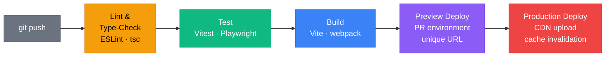
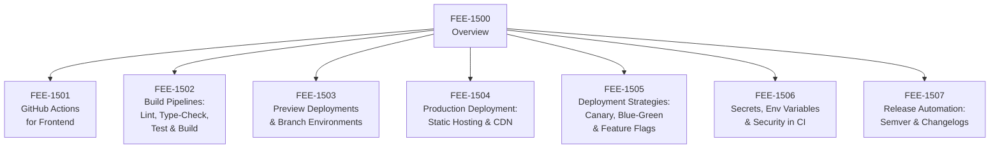

# CI/CD & Deployment Overview

:::info
This category covers the complete path from `git push` to users' browsers — automated quality gates, reproducible builds, preview environments, CDN-based production deployments, and the release engineering practices that keep that pipeline safe at scale.
:::

## Context

Every time a developer pushes code, a question follows: is this safe to ship? Before CI/CD, the answer arrived days later, after a dedicated "release day" — a manually orchestrated event involving a staging checklist, a build engineer, and a deployment window. If something broke, discovery happened in production, in front of users, hours or days after the code landed.

Continuous Integration and Continuous Delivery changed that answer from "we will find out on release day" to "we find out in minutes, before the branch merges."

**What CI/CD means for frontend.** The term originates in server-side software, where "deploying" means restarting a process on a server. Frontend deployment is structurally different: your output is a set of static files — HTML, JavaScript, CSS, and assets — that get placed on a CDN or object store. There is no server process to restart. The deployment mechanism is CDN cache invalidation combined with content-addressed filenames (hashes in the filename ensure users always load the file that corresponds to the version of the app they are being served). Understanding this distinction is essential: a frontend CI/CD pipeline does not produce a running server; it produces an artifact that gets globally distributed.

**The three stages: CI, CD, CD.** The terms are often collapsed into "CI/CD" but they describe distinct practices:

- **Continuous Integration (CI)** means every commit to every branch is automatically built and tested. The purpose is to detect integration failures — broken types, failing tests, lint errors, bundle size regressions — immediately, while the change is still small and the author still has context. CI gates the pull request: a branch cannot be merged until all checks pass.

- **Continuous Delivery (CD)** means the main branch is always in a deployable state. Every time CI passes on main, the pipeline produces a production-ready artifact. A human decision — a button click or a scheduled release — triggers the actual deployment. This is the most common model for teams that want automation without fully removing human gates from production.

- **Continuous Deployment (CD)** takes the human gate out entirely. Every commit that passes CI on main is automatically deployed to production. This requires high confidence in the test suite and deployment pipeline, but it eliminates the lag between "code is ready" and "users have the code."

Most frontend teams start with Continuous Integration and Continuous Delivery. Some teams operating high-confidence pipelines at scale run Continuous Deployment for their web properties.

**The anatomy of a CI run.** A typical frontend CI job runs four gates in sequence. First, static analysis: ESLint checks style and correctness rules, and the TypeScript compiler runs with `--noEmit` to catch type errors without producing output. These two checks are fast — often under thirty seconds — and they catch the most common categories of error: wrong types, unused variables, missing imports, and violated coding conventions. Second, the test suite runs: unit tests with Vitest, component tests with React Testing Library, and optionally end-to-end tests with Playwright. Third, the production build runs with the same tool — Vite, webpack, or another bundler — that will produce the artifact eventually deployed to production. This confirms that the build itself does not fail (TypeScript errors that only surface in the compiler during build, missing environment variables, broken asset paths). Fourth, optional post-build checks run: bundle size assertions, Lighthouse audits, accessibility checks. The pipeline reports pass or fail on all four gates, and the PR is blocked until all pass.

**Why CI/CD matters specifically.** Four problems that CI/CD solves directly:

*Catching bugs before production.* A type error introduced by a refactor, a test that starts failing after a dependency upgrade, a bundle that exceeds the size budget — these are caught in minutes by CI, not hours later by a user. The cost of fixing a bug found in CI is a fraction of fixing it after deployment: there is no rollback, no incident, no user impact.

*Reproducible builds.* "Works on my machine" is a class of failure that CI eliminates. The CI environment is defined in code (a workflow file, a Dockerfile, pinned Node.js and pnpm versions), runs on consistent hardware, and produces the same output for the same input on every run. If the build passes locally but fails in CI, the discrepancy is immediately visible and actionable.

*Team velocity.* Without CI, code review depends heavily on the reviewer manually verifying that nothing obvious is broken. With CI, the PR already carries a green status: types check, tests pass, lint is clean. Reviewers focus on design, intent, and correctness rather than mechanical verification. This makes reviews faster and more consistent, especially on teams where not every reviewer knows every subsystem.

*The "works on my machine" class of failure.* Developers work in subtly different environments — different OS versions, different global Node.js installations, different cached `node_modules` trees. CI provides a clean, controlled environment where none of those local differences apply. If CI passes and your local build fails, the problem is your local environment. If CI fails and your local build passes, there is a dependency or configuration difference that will affect other developers and production — and CI caught it before it could ship.

### What this category covers

The seven sub-articles in FEE-1501 through FEE-1507 cover the full pipeline from workflow authoring to release automation:

- **FEE-1501 — GitHub Actions for Frontend:** The workflow model — triggers, jobs, steps, runners — and the specific patterns that make GitHub Actions the default CI platform for most frontend teams: caching `node_modules` and build output, matrix builds for cross-environment testing, and reusable workflows for DRY pipeline definitions.

- **FEE-1502 — Build Pipelines: Lint, Type-Check, Test & Build:** The four quality gates that every frontend CI job should run in order — ESLint, TypeScript type checking, the test suite, and the production build — along with parallelism strategies and how to read CI failures in each layer.

- **FEE-1503 — Preview Deployments & Branch Environments:** How platforms like Vercel, Netlify, and Cloudflare Pages automatically deploy every pull request to a unique URL, giving reviewers a live rendering of the change before it merges. The mechanics of ephemeral environments and how they change the review workflow.

- **FEE-1504 — Production Deployment: Static Hosting & CDN:** How static frontend artifacts get distributed globally — object storage backends, CDN edge caching, cache-control headers, and why content-addressed filenames (hashed filenames) make aggressive cache-control safe. Comparing managed platforms (Vercel, Netlify) against self-hosted configurations (S3 + CloudFront, Cloudflare R2).

- **FEE-1505 — Deployment Strategies: Canary, Blue-Green & Feature Flags:** Techniques for shipping to a subset of users before full rollout — canary deployments (routing a percentage of traffic to a new version), blue-green environments (running two versions simultaneously and switching traffic atomically), and feature flags (shipping code that is off by default and toggled independently of deployment).

- **FEE-1506 — Secrets, Environment Variables & Security in CI:** How to manage API keys, tokens, and configuration in a CI environment without leaking them into build artifacts or logs. GitHub Actions encrypted secrets, environment-scoped variables, and the difference between variables that are safe to embed in a client bundle and those that are not.

- **FEE-1507 — Release Automation: Semantic Versioning & Changelogs:** How Conventional Commits, semantic-release, and Changesets automate the version bump, changelog generation, and npm publish workflow so that releasing a library is a CI job rather than a manual process.

## Design Thinking

### Why frontend CI/CD is structurally different from backend

Backend CI/CD pipelines produce a server artifact — a Docker image, a JAR, a binary — and deployment means getting that artifact onto a server and restarting the process. The deployment unit is a running service with state, connections, and a lifecycle.

Frontend CI/CD produces static files. Once a Vite build finishes, the output is a `dist/` directory containing HTML, hashed JavaScript chunks, CSS, and assets. Deployment means uploading that directory to an object store or CDN edge. There is no process to restart, no connections to drain, no health check endpoint to poll.

This makes frontend deployment both simpler and stranger. Simpler because there is no server to manage. Stranger because the "deployment" is not atomic — CDN edges around the world propagate the new files at different rates, and users who have already loaded the app may be running an old version of the JavaScript for the duration of their session. Managing this gracefully — through content-addressed filenames, correct cache headers, and application-level version detection — is specific to frontend and has no backend equivalent.

The CDN cache invalidation problem is the central operational challenge of frontend deployment. If you serve `main.js` without a hash in the filename and set a long `Cache-Control` header, a user who loaded the app yesterday will keep receiving the old `main.js` from the CDN cache even after you deployed a new version. Content hashing solves this: `main.a3f8d2.js` and `main.9c1e45.js` are different URLs, so the CDN has no old version to serve. The cost is that every deployment produces a new set of filenames that the HTML entrypoint must reference — which is exactly what build tools like Vite handle automatically.

### Platform choices: managed vs. self-hosted

Frontend CI/CD runs on two broad categories of infrastructure.

**Managed platforms** like GitHub Actions, Vercel, and Netlify handle the infrastructure for you. You write a workflow file; the platform provisions runners, runs your jobs, and surfaces results. Managed platforms handle caching, runner maintenance, and scaling automatically. For most teams, this is the right starting point — the operational burden is near zero and the time-to-working-pipeline is measured in hours, not days.

**Self-hosted runners** (GitHub Actions self-hosted, GitLab Runner on your own hardware, Jenkins) give you control over the execution environment — custom hardware, access to internal network resources, specific GPU configurations for performance testing. The trade-off is operational burden: you maintain the machines, manage runner registration, and handle autoscaling. Self-hosted infrastructure makes sense when your build has requirements that managed runners cannot satisfy, or when you need runners in a specific network zone to access private services during CI.

For frontend specifically, managed platforms with generous free tiers (GitHub Actions, Vercel preview deployments, Netlify) cover the vast majority of use cases. The decision to self-host is typically driven by organizational policy or compliance requirements rather than technical limitations.

### Why CI/CD pays back its setup cost faster than expected

Setting up a GitHub Actions workflow, configuring caching, wiring up a preview deployment platform, and writing the initial workflow YAML feels like overhead when a project is new and the team is small. It is common to defer this work with the reasoning that "we will add CI later when the project is more stable."

The problem with that reasoning is that the value of CI is highest precisely when the project is young and moving fast. The first time a broken build is caught before merge — a type error introduced by a well-intentioned refactor, a test that fails because a dependency changed its API, a bundle size that doubled because a new dependency was added without tree-shaking — the setup cost is already paid back. That one caught regression avoided a production incident, a rollback, and the debugging session that follows.

More concretely: a modern frontend CI pipeline for a mid-sized project can be set up in a few hours using GitHub Actions and a managed deployment platform. The ongoing maintenance cost is low — a workflow file rarely needs changes once it is stable. The payoff is permanent: every future PR gets automated quality signals, every reviewer can see a live preview of the change, and the question "is this safe to ship?" gets answered before the merge button is clicked.

The shift from manual "deployment days" to automated continuous delivery also changes team culture in a more subtle way. When deployments are rare and costly, teams batch changes to reduce deployment risk. Batching makes individual changes harder to reason about — if five features and three bug fixes land in one release and something breaks, the investigation must cover all eight changes. When deployments are frequent and automated, each change is small and independently attributable. Finding the cause of a regression means looking at one commit rather than eight, and rolling back means reverting one change rather than three days of work.

### The shift from deployment days to continuous delivery

The "deployment day" model — a scheduled event, a checklist, a dedicated release engineer — was not a design choice. It was a coping mechanism for a world where deployments were risky, manual, and irreversible. Every deployment carried coordination cost (synchronizing multiple teams to ship at the same time), operational risk (a manual step could be missed), and recovery risk (rollback required re-running the entire manual process in reverse).

CI/CD makes deployments cheap enough to do on every merge. When deployment is cheap, the per-change risk decreases: smaller changes are easier to verify, easier to roll back, and easier to attribute when something goes wrong. When rollback is a one-click pipeline re-run rather than an emergency war room, teams are more willing to deploy frequently. This virtuous cycle — automation reduces risk, which enables frequency, which reduces batch size, which reduces risk further — is why organizations that have fully adopted CI/CD typically deploy orders of magnitude more frequently than those that have not, while experiencing fewer production incidents.

For frontend teams, preview deployments are the most visible embodiment of this shift. Every PR getting its own live URL — automatically, without any manual step — means that QA, design review, and stakeholder sign-off happen before the code reaches main. By the time the PR merges, it has already been reviewed in a realistic environment by multiple people. The merge is not the beginning of verification; it is the end of it.

## Visual

### The Frontend CI/CD Pipeline

The following diagram shows the six stages of a typical frontend CI/CD pipeline. Each stage is a distinct gate: the pipeline halts and reports failure if any stage fails, preventing broken code from advancing toward production.

### Category Map

The following diagram shows how the seven sub-articles in this category relate to the pipeline stages. FEE-1501 and FEE-1502 cover the CI half of the pipeline; FEE-1503 through FEE-1507 cover the deployment half and the surrounding operational concerns.

## Related FEEs

- [FEE-1501: GitHub Actions for Frontend](1501.md) — Workflow authoring, caching, and reusable pipeline patterns
- [FEE-1502: Build Pipelines: Lint, Type-Check, Test & Build](1502.md) — The four quality gates in order: ESLint, tsc, test, build
- [FEE-1503: Preview Deployments & Branch Environments](1503.md) — Automatic PR environments on Vercel, Netlify, and Cloudflare Pages
- [FEE-1504: Production Deployment: Static Hosting & CDN](1504.md) — Static artifact distribution, cache headers, and managed vs. self-hosted platforms
- [FEE-1505: Deployment Strategies: Canary, Blue-Green & Feature Flags](1505.md) — Incremental rollout techniques for production safety
- [FEE-1506: Secrets, Environment Variables & Security in CI](1506.md) — Safe management of API keys and tokens in CI pipelines
- [FEE-1507: Release Automation: Semantic Versioning & Changelogs](1507.md) — Conventional Commits, semantic-release, and Changesets
- [FEE-800: Build Tooling Overview](../Build%20Tooling%20and%20Module%20Systems/800.md) — The build pipeline that CI runs: transpilation, bundling, and optimization
- [FEE-1100: Testing Strategies Overview](../Testing%20Strategies/1100.md) — The test suite that CI gates on: unit, component, and E2E tests
