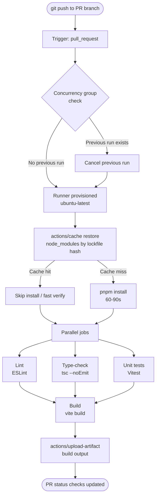

# GitHub Actions for Frontend

## Context

GitHub Actions is the dominant CI/CD platform for frontend projects in 2024. It ships as a first-party feature of GitHub itself, which means zero additional account setup, native integration with pull request checks and branch protections, and a free tier generous enough that most open-source and small-team projects never pay a cent.

Before GitHub Actions arrived in 2019, frontend teams stitched together separate services: a CI provider (Travis CI, CircleCI, Jenkins), a deployment service, and a notification layer. Each integration required its own credentials, webhook configuration, and mental model. GitHub Actions collapsed that stack into a single YAML file living at `.github/workflows/` inside the repository itself — versioned, reviewed, and deployed like any other code.

**What makes GitHub Actions dominant for frontend:**

- **YAML-native workflow definition** stored in the repository. The workflow file is code: it goes through pull request review, has history, and is rolled back with `git revert`.
- **A massive marketplace ecosystem.** Actions like `actions/checkout`, `actions/setup-node`, `actions/cache`, and third-party actions from Vercel, Netlify, and Cloudflare are published and maintained by their authors. Composing a pipeline means referencing these actions by name rather than writing shell scripts from scratch.
- **Free for public repositories.** Open-source frontend libraries — React, Vue, Svelte ecosystem tooling — run CI for free on GitHub-hosted runners with 2 CPU cores and 7 GB of RAM.
- **Tight GitHub integration.** A workflow triggered by a pull request can post status checks, add labels, leave comments, and create deployments — all through the GitHub API — without any external service configuration.

A workflow is a YAML file. Understanding its structure is the prerequisite for everything that follows.

---

## Principle

> **SHOULD** cache `node_modules` by lockfile hash — a cold install takes 60–90 seconds; a cache hit takes 5 seconds.

> **SHOULD** set `cancel-in-progress: true` on PR workflows — stale runs from superseded commits waste runner minutes and pollute the PR status check list.

---

## Design Thinking

### Why GitHub Actions won

The decisive advantage is not any single feature — it is the elimination of the integration boundary. Your repository, your CI, your deployment status, and your pull request are all first-class objects inside GitHub. A workflow can gate a merge, post a comment, create a release, and trigger a deployment without any external service needing a webhook or an API key. For frontend teams already using GitHub for code review, this integration eliminates an entire category of credential management and service coordination.

The marketplace is the second decisive factor. The frontend ecosystem publishes its toolchain through Actions: `actions/setup-node` handles Node.js installation and PATH configuration; `pnpm/action-setup` handles pnpm; `actions/cache` handles dependency and build output caching. Composing a production-grade pipeline takes an afternoon because the hard parts are already written.

### Why caching node_modules is the highest-leverage optimization

A clean `npm install` or `pnpm install` on a cold runner takes 60 to 90 seconds for a typical mid-size frontend project. That is dead time: the runner is downloading tarballs from the registry, verifying checksums, unpacking archives, and writing files. None of this work is unique to your commit.

When `actions/cache` restores a warm cache, the install step completes in 3 to 5 seconds. That is a 15× to 30× speedup on a single step, repeated on every push, every PR, every matrix job. Across a team pushing dozens of times per day, correct caching translates directly into developer feedback latency.

The key insight is the cache invalidation strategy: key the cache on the hash of the lockfile (`package-lock.json`, `pnpm-lock.yaml`, or `yarn.lock`). When no dependency changes, the lockfile does not change, the hash does not change, and the cache is reused. When a dependency is added or upgraded, the lockfile changes, the hash changes, and the cache is busted automatically. This is correct-by-construction invalidation — you cannot forget to clear the cache after an upgrade because the key computation makes it automatic.

### Why `cancel-in-progress: true` is essential

Consider a developer who pushes a commit to a PR branch, notices a mistake, and pushes a second commit thirty seconds later. Without concurrency control, both runs execute: the first run is consuming a runner for three minutes to test code that is already superseded. The second run's result is what matters.

With `cancel-in-progress: true` and a concurrency group keyed to the PR number or branch name, pushing the second commit immediately cancels the first run. The net effect is: only the most recent commit on a branch ever has an active run. This eliminates wasted runner minutes, reduces the noise in the PR's status check history, and ensures that the green check on the PR corresponds to the actual HEAD commit, not a superseded one.

There is one nuance: for workflows triggered by pushes to `main` (post-merge), cancellation is usually wrong. You want every commit to `main` to be fully tested and potentially deployed. The correct pattern is to apply `cancel-in-progress: true` only on PR-triggered runs, and omit it (or set it to `false`) for `main` branch runs. The conditional expression `cancel-in-progress: ${{ github.ref != 'refs/heads/main' }}` handles this in a single workflow file.

### Why matrix builds are useful but expensive

A matrix build runs the same job multiple times with different parameter values — typically multiple Node.js versions or operating systems. For a library that claims to support Node 18, 20, and 22, a matrix build verifies that claim on every commit. That is genuine value: a regression on Node 18 that passes on Node 22 would not be caught by a single-version CI.

The cost is linear multiplication. A 3-version Node matrix triples the runner minutes consumed per run. Add a 2-OS matrix and you have 6× the single-run cost. For an application (not a library), this cost rarely pays off: applications are deployed to a single Node version, so testing across multiple versions adds no coverage of real-world failure modes. Matrix builds are worth the cost for library authors and for cross-browser end-to-end test suites; they are typically wasteful for application repositories.

---

## Visual

The following diagram shows the lifecycle of a single CI run triggered by a pull request push:



---

## Example

### 1. Complete frontend CI workflow

This is a production-ready workflow covering install with caching, parallel lint/type-check/test jobs, and a final build step that uploads the artifact.

```yaml
# .github/workflows/ci.yml

name: CI

on:
  push:
    branches: [main]
  pull_request:
    branches: [main]
  workflow_dispatch:

concurrency:
  group: ci-${{ github.ref }}
  cancel-in-progress: ${{ github.ref != 'refs/heads/main' }}

jobs:
  install:
    name: Install dependencies
    runs-on: ubuntu-latest
    steps:
      - uses: actions/checkout@v4

      - uses: pnpm/action-setup@v4
        with:
          version: 9

      - uses: actions/setup-node@v4
        with:
          node-version: 20

      - name: Cache node_modules
        uses: actions/cache@v4
        id: cache-node-modules
        with:
          path: node_modules
          key: node-modules-${{ runner.os }}-${{ hashFiles('**/pnpm-lock.yaml') }}
          restore-keys: |
            node-modules-${{ runner.os }}-

      - name: Install
        if: steps.cache-node-modules.outputs.cache-hit != 'true'
        run: pnpm install --frozen-lockfile

  lint:
    name: Lint
    runs-on: ubuntu-latest
    needs: install
    steps:
      - uses: actions/checkout@v4
      - uses: pnpm/action-setup@v4
        with:
          version: 9
      - uses: actions/setup-node@v4
        with:
          node-version: 20
      - name: Restore node_modules cache
        uses: actions/cache@v4
        with:
          path: node_modules
          key: node-modules-${{ runner.os }}-${{ hashFiles('**/pnpm-lock.yaml') }}
      - run: pnpm lint

  type-check:
    name: Type-check
    runs-on: ubuntu-latest
    needs: install
    steps:
      - uses: actions/checkout@v4
      - uses: pnpm/action-setup@v4
        with:
          version: 9
      - uses: actions/setup-node@v4
        with:
          node-version: 20
      - name: Restore node_modules cache
        uses: actions/cache@v4
        with:
          path: node_modules
          key: node-modules-${{ runner.os }}-${{ hashFiles('**/pnpm-lock.yaml') }}
      - run: pnpm type-check

  test:
    name: Unit tests
    runs-on: ubuntu-latest
    needs: install
    steps:
      - uses: actions/checkout@v4
      - uses: pnpm/action-setup@v4
        with:
          version: 9
      - uses: actions/setup-node@v4
        with:
          node-version: 20
      - name: Restore node_modules cache
        uses: actions/cache@v4
        with:
          path: node_modules
          key: node-modules-${{ runner.os }}-${{ hashFiles('**/pnpm-lock.yaml') }}
      - run: pnpm test --run

  build:
    name: Build
    runs-on: ubuntu-latest
    needs: [lint, type-check, test]
    steps:
      - uses: actions/checkout@v4
      - uses: pnpm/action-setup@v4
        with:
          version: 9
      - uses: actions/setup-node@v4
        with:
          node-version: 20
      - name: Restore node_modules cache
        uses: actions/cache@v4
        with:
          path: node_modules
          key: node-modules-${{ runner.os }}-${{ hashFiles('**/pnpm-lock.yaml') }}
      - run: pnpm build
      - name: Upload build artifact
        uses: actions/upload-artifact@v4
        with:
          name: dist-${{ github.sha }}
          path: dist/
          retention-days: 7
```

### 2. `actions/cache` key strategy in detail

The cache key is the primary mechanism for correct cache invalidation. Constructing it properly prevents two failure modes: stale caches (wrong packages served from cache after an upgrade) and cache thrashing (cache invalidated unnecessarily, defeating the purpose).

```yaml
- name: Cache node_modules
  uses: actions/cache@v4
  id: nm-cache
  with:
    path: node_modules
    # Primary key: exact match required for a cache hit.
    # hashFiles computes SHA-256 over all matching files.
    # If pnpm-lock.yaml changes at all, the hash changes,
    # and the cache is busted automatically.
    key: node-modules-${{ runner.os }}-node20-${{ hashFiles('**/pnpm-lock.yaml') }}
    # Restore keys: fallback to a partial match.
    # A partial match means node_modules is populated but may be stale;
    # pnpm install --frozen-lockfile will detect and repair the difference.
    restore-keys: |
      node-modules-${{ runner.os }}-node20-
      node-modules-${{ runner.os }}-

- name: Install (only on cache miss)
  # cache-hit is 'true' only on an exact key match.
  # On a restore-key match, this step still runs to sync the modules.
  if: steps.nm-cache.outputs.cache-hit != 'true'
  run: pnpm install --frozen-lockfile
```

**Key composition rules:**

| Component | Purpose |
|---|---|
| `runner.os` | Prevents Linux cache from being used on macOS matrix jobs |
| `node20` | Prevents Node 20 cache from being used on Node 18 jobs |
| `hashFiles('**/pnpm-lock.yaml')` | Busts cache whenever any lockfile in the repo changes |

### 3. Concurrency group configuration

```yaml
# Cancel superseded PR runs; never cancel main branch runs.
concurrency:
  group: ci-${{ github.ref }}
  cancel-in-progress: ${{ github.ref != 'refs/heads/main' }}
```

For workflows that only run on PRs, a simpler form using the PR number is more precise:

```yaml
concurrency:
  group: pr-${{ github.event.pull_request.number }}
  cancel-in-progress: true
```

Using `github.event.pull_request.number` rather than `github.ref` ensures that two PRs from different branches targeting the same base never cancel each other. Each PR has its own concurrency queue.

### 4. Matrix build for multiple Node versions

Use matrix builds for libraries that publish to npm and must remain compatible across supported Node versions. Skip them for application repositories.

```yaml
jobs:
  test:
    name: Test (Node ${{ matrix.node-version }})
    runs-on: ubuntu-latest
    strategy:
      matrix:
        node-version: [18, 20, 22]
      # Don't cancel all matrix jobs if one fails.
      # Useful to see which versions are broken.
      fail-fast: false
    steps:
      - uses: actions/checkout@v4
      - uses: pnpm/action-setup@v4
        with:
          version: 9
      - uses: actions/setup-node@v4
        with:
          node-version: ${{ matrix.node-version }}
      - name: Cache node_modules
        uses: actions/cache@v4
        with:
          path: node_modules
          # Include node-version in key to avoid cross-version cache pollution
          key: node-modules-${{ runner.os }}-node${{ matrix.node-version }}-${{ hashFiles('**/pnpm-lock.yaml') }}
      - run: pnpm install --frozen-lockfile
      - run: pnpm test --run
```

A 3-version matrix creates 3 independent runners, each consuming full runner minutes. The parallel execution reduces wall-clock time but not total compute cost — a 3-node matrix costs 3× the single-node equivalent.

### 5. Uploading and downloading artifacts

Artifacts transfer build output between jobs in the same workflow run (without re-running the build) and make build results downloadable from the Actions UI for debugging.

```yaml
# In the build job: upload
- name: Upload dist
  uses: actions/upload-artifact@v4
  with:
    name: dist-${{ github.sha }}
    path: dist/
    retention-days: 7

# In a downstream job (e.g., deploy): download
- name: Download dist
  uses: actions/download-artifact@v4
  with:
    name: dist-${{ github.sha }}
    path: dist/
```

`retention-days` controls how long GitHub stores the artifact. 7 days is a reasonable default for PR artifacts; extend to 30 days for release artifacts that may need post-deployment debugging.

### 6. Composite action for shared setup

When the same sequence of steps (checkout, setup pnpm, setup node, restore cache) appears in every job, a composite action removes the repetition. Composite actions live in `.github/actions/` and are referenced by path.

```yaml
# .github/actions/setup-frontend/action.yml

name: Setup Frontend
description: Checkout, set up Node/pnpm, restore node_modules cache

inputs:
  node-version:
    description: Node.js version to use
    default: '20'
  pnpm-version:
    description: pnpm version to use
    default: '9'

runs:
  using: composite
  steps:
    - uses: actions/checkout@v4

    - uses: pnpm/action-setup@v4
      with:
        version: ${{ inputs.pnpm-version }}

    - uses: actions/setup-node@v4
      with:
        node-version: ${{ inputs.node-version }}

    - uses: actions/cache@v4
      id: cache
      with:
        path: node_modules
        key: node-modules-${{ runner.os }}-node${{ inputs.node-version }}-${{ hashFiles('**/pnpm-lock.yaml') }}
        restore-keys: |
          node-modules-${{ runner.os }}-node${{ inputs.node-version }}-

    - name: Install
      if: steps.cache.outputs.cache-hit != 'true'
      shell: bash
      run: pnpm install --frozen-lockfile
```

Calling it from any workflow job:

```yaml
jobs:
  lint:
    runs-on: ubuntu-latest
    steps:
      - uses: ./.github/actions/setup-frontend
        with:
          node-version: '20'
      - run: pnpm lint
```

The composite action reduces each job's boilerplate from 5 repeated steps to 1.

---

## Common Mistakes

**Not including `runner.os` in the cache key.**
A cache created on Linux will be offered as a restore-key match on a macOS runner. `node_modules` binary content (native addons, platform-specific dependencies) differs between Linux and macOS. Always include `runner.os` in the key.

**Using `node_modules` cache without `--frozen-lockfile`.**
If `pnpm install` runs without `--frozen-lockfile` (or `npm ci` for npm), a restore-key match on a slightly outdated cache silently upgrades or downgrades packages without updating the lockfile. The CI run passes but the actual installed tree does not match the committed lockfile. Always pair cache restore with a frozen install to guarantee lockfile fidelity.

**Setting `cancel-in-progress: true` on the main branch workflow.**
Cancelling a run on `main` means some commits are never fully tested. If the cancelled run was the one that would have detected a regression, the next green run may be a false positive. Reserve `cancel-in-progress` for PR workflows.

**Using matrix builds for applications.**
An application is deployed to exactly one Node version. Testing against Node 18, 20, and 22 on every PR commit triples CI cost without adding coverage of any real failure mode. Matrix builds belong in library repositories.

**Not setting `retention-days` on artifacts.**
GitHub's default artifact retention is 90 days. For PR build artifacts, that is excessive — they accumulate and consume GitHub storage quota. Set `retention-days: 7` for PR artifacts; reserve longer retention for release artifacts.

**Skipping the `workflow_dispatch` trigger.**
Without `workflow_dispatch`, there is no way to manually re-run a workflow against a branch without pushing a new commit. Add it to all CI workflows. It costs nothing and is invaluable for debugging runner environment issues.

**Hard-coding the pnpm version.**
Using `version: latest` in `pnpm/action-setup` means a major pnpm release can break your CI without any change to your code. Pin pnpm to a major or exact version (`version: 9`) to control when you upgrade.

---

## Related FEEs

- [FEE-1500: CI/CD & Deployment Overview](1500.md) — the category overview; covers what CI/CD is and why it matters for frontend
- [FEE-1502: Build Pipelines — Lint, Type-Check, Test & Build](1502.md) — deep dive into what each pipeline step does and how to configure it
- [FEE-1506: Secrets, Environment Variables & Security in CI](1506.md) — how to use `secrets.TOKEN` and environment variables safely in Actions
- [FEE-800: Build Tooling Overview](../Build%20Tooling%20and%20Module%20Systems/800.md) — Vite, webpack, and the tools that the build step invokes
- [FEE-1505: Deployment Strategies: Canary, Blue-Green & Feature Flags](1505.md) — canary progression and rollback automation via GitHub Actions triggers
- [FEE-1507: Release Automation: Semantic Versioning & Changelogs](1507.md) — the release workflow that runs on the GitHub Actions foundation

---

## References

- [Workflow syntax for GitHub Actions — GitHub Docs](https://docs.github.com/actions/using-workflows/workflow-syntax-for-github-actions)
- [Caching dependencies to speed up workflows — GitHub Docs](https://docs.github.com/en/actions/using-workflows/caching-dependencies-to-speed-up-workflows)
- [Control the concurrency of workflows and jobs — GitHub Docs](https://docs.github.com/actions/writing-workflows/choosing-what-your-workflow-does/control-the-concurrency-of-workflows-and-jobs)
- [Creating a composite action — GitHub Docs](https://docs.github.com/en/actions/tutorials/create-actions/create-a-composite-action)
- [actions/cache — GitHub Marketplace](https://github.com/actions/cache)
- [GitHub Actions Matrix Strategy — Codefresh](https://codefresh.io/learn/github-actions/github-actions-matrix/)
