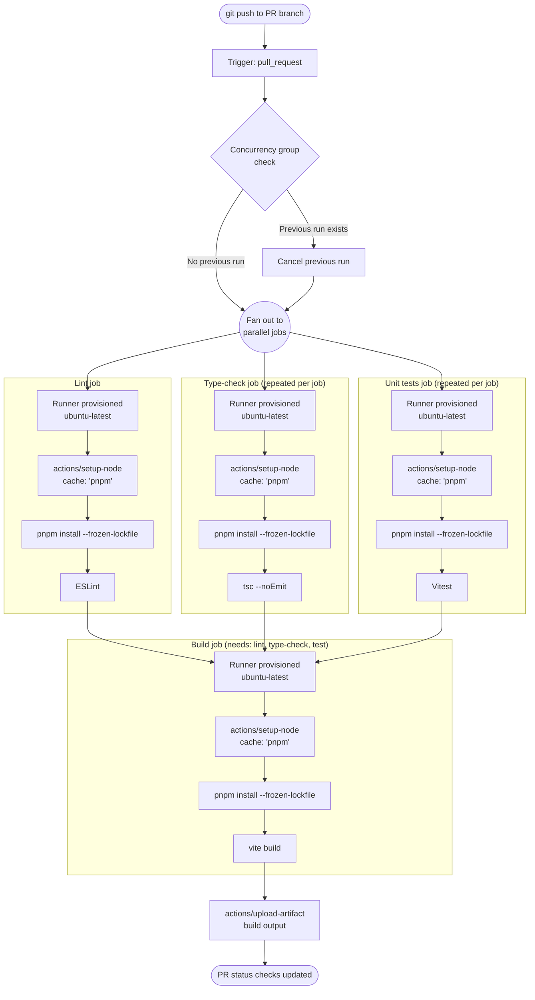

# [FEE-1501] GitHub Actions for Frontend

:::info
GitHub Actions is GitHub's first-party CI/CD platform: workflows are YAML files committed to `.github/workflows/`, triggered by repository events, and executed on GitHub-hosted or self-hosted runners. For a repository already hosted on GitHub, it removes the separate CI account and webhook wiring that a third-party CI provider requires. This article covers workflow anatomy, the caching strategy GitHub and pnpm actually recommend, concurrency control, matrix builds, and the composite-action pattern for sharing setup steps across jobs.
:::

## Context

GitHub Actions is the built-in CI/CD platform for any repository hosted on GitHub. In-repo, config-as-code CI predates it by nearly a decade: Travis CI's `.travis.yml` shipped in 2011, and CircleCI's `circle.yml` used the same idea, both years before GitHub Actions launched in 2019. GitLab CI itself launched in 2012, though its jobs were configured through a web form until GitLab CI 7.12 introduced the in-repo `.gitlab-ci.yml` file in June 2015; GitLab 8.0, released that September, then integrated CI into the core application. Jenkins, GitLab CI, and CircleCI still run large fleets of frontend builds today. Actions did not replace them; it became the default for repositories that are already on GitHub, while teams elsewhere continue to run CI on the platforms they already use.

What Actions changed for a GitHub-hosted repository is integration depth, not the YAML-in-repo idea itself. A pull request check, a deployment status, and the workflow that produced them are all backed by the same GitHub API and the same credential. Before Actions, a team on Travis CI or CircleCI configured a webhook from GitHub to the CI provider and a separate token from the provider back to GitHub to post statuses; each additional service, such as a deployment or notification integration, added its own credential pair. Because Actions runs inside GitHub, that wiring collapses into one workflow file at `.github/workflows/`, reviewed and rolled back like any other file in the repository.

**What makes GitHub Actions the default choice for GitHub-hosted frontend repos:**

- **YAML-native workflow definition** stored in the repository, subject to pull request review and `git revert`.
- **A large marketplace ecosystem.** Actions such as `actions/checkout`, `actions/setup-node`, `actions/cache`, and third-party actions from hosting and deployment providers are published and maintained by their authors, so composing a pipeline means referencing existing actions rather than writing install and deploy scripts from scratch.
- **Free compute for public repositories.** GitHub-hosted standard Linux and Windows runners give public repositories 4 vCPUs and 16 GB of RAM at no cost. Private repositories on standard runners get 2 vCPUs and 8 GB, billed per minute beyond the included quota.
- **Tight GitHub integration.** A workflow triggered by a pull request can post status checks, add labels, leave comments, and create deployments through the GitHub API, with no external service to configure.

A workflow file has a fixed shape:

| Concept | Role |
|---|---|
| `on:` | Declares the triggers: `push`, `pull_request`, `workflow_dispatch`, a schedule, and others |
| `jobs:` | One or more jobs; each runs on its own runner and, by default, runs in parallel with the others |
| `needs:` | Makes a job wait for another job to finish before it starts |
| `steps:` | An ordered list within a job; each step runs a marketplace action (`uses:`) or a shell command (`run:`) |
| `runs-on:` | The runner image a job executes on, for example `ubuntu-latest` |

The examples in this article build directly on this shape.

---

## Visual

The following diagram shows the lifecycle of a single CI run triggered by a pull request push, using the caching approach this article recommends (see Best Practices):



---

## Example

### 1. Complete frontend CI workflow (recommended caching)

`actions/setup-node` has a built-in `cache` option. It caches the package manager's global store, not `node_modules`, and it is the pattern GitHub documents for this exact problem. Each job runs its own `pnpm install --frozen-lockfile`; the install is fast when the store is warm because packages are linked from the local cache instead of downloaded, and it is correct on every job because only the store, not a pre-built `node_modules` tree, is shared across jobs.

```yaml
# .github/workflows/ci.yml

name: CI

on:
  push:
    branches: [main]
  pull_request:
    branches: [main]
  workflow_dispatch:

concurrency:
  group: ci-${{ github.ref }}
  cancel-in-progress: ${{ github.ref != 'refs/heads/main' }}

jobs:
  lint:
    name: Lint
    runs-on: ubuntu-latest
    steps:
      - uses: actions/checkout@v4
      - uses: pnpm/action-setup@v4
        with:
          version: 9
      - uses: actions/setup-node@v4
        with:
          node-version: 20
          cache: 'pnpm'
      - run: pnpm install --frozen-lockfile
      - run: pnpm lint

  type-check:
    name: Type-check
    runs-on: ubuntu-latest
    steps:
      - uses: actions/checkout@v4
      - uses: pnpm/action-setup@v4
        with:
          version: 9
      - uses: actions/setup-node@v4
        with:
          node-version: 20
          cache: 'pnpm'
      - run: pnpm install --frozen-lockfile
      - run: pnpm type-check

  test:
    name: Unit tests
    runs-on: ubuntu-latest
    steps:
      - uses: actions/checkout@v4
      - uses: pnpm/action-setup@v4
        with:
          version: 9
      - uses: actions/setup-node@v4
        with:
          node-version: 20
          cache: 'pnpm'
      - run: pnpm install --frozen-lockfile
      - run: pnpm test --run

  build:
    name: Build
    runs-on: ubuntu-latest
    needs: [lint, type-check, test]
    steps:
      - uses: actions/checkout@v4
      - uses: pnpm/action-setup@v4
        with:
          version: 9
      - uses: actions/setup-node@v4
        with:
          node-version: 20
          cache: 'pnpm'
      - run: pnpm install --frozen-lockfile
      - run: pnpm build
      - name: Upload build artifact
        uses: actions/upload-artifact@v4
        with:
          name: dist-${{ github.sha }}
          path: dist/
          retention-days: 7
```

### 2. Advanced variant: caching `node_modules` directly

`actions/cache` can also cache `node_modules` itself, keyed on the lockfile hash. A hit skips the install step entirely, which restores faster than store caching. `actions/cache`'s own guidance discourages caching `node_modules` as a default (its npm example notes that doing so "can break across Node versions and won't work with npm ci"); the same mechanical risk applies to pnpm, whose non-flat, symlinked `node_modules` layout does not reliably survive a restore into a differently-versioned Node.js runtime or a different operating system. Use this pattern only after measuring that store caching is insufficient, and always pin the Node version into the cache key.

```yaml
- name: Cache node_modules
  uses: actions/cache@v4
  id: nm-cache
  with:
    path: node_modules
    # Primary key: exact match required for a cache hit.
    # hashFiles computes a hash over all matching files.
    # If pnpm-lock.yaml changes at all, the hash changes,
    # and the cache is busted automatically.
    key: node-modules-${{ runner.os }}-node20-${{ hashFiles('**/pnpm-lock.yaml') }}
    # Restore keys: fallback to a partial match.
    # A partial match means node_modules is populated but may be stale;
    # pnpm install --frozen-lockfile will detect and repair the difference.
    restore-keys: |
      node-modules-${{ runner.os }}-node20-
      node-modules-${{ runner.os }}-

- name: Install (repairs a partial restore-key match)
  # cache-hit is 'true' only on an exact key match.
  # On a restore-key match, this step still runs to sync the modules.
  if: steps.nm-cache.outputs.cache-hit != 'true'
  run: pnpm install --frozen-lockfile
```

**Key composition rules:**

| Component | Purpose |
|---|---|
| `runner.os` | Prevents a Linux cache from being restored on a macOS matrix job |
| `node20` | Prevents a Node 20 cache from being restored on a Node 18 job |
| `hashFiles('**/pnpm-lock.yaml')` | Busts the cache whenever any matching lockfile changes |

GitHub's Actions cache has a default limit of 10 GB per repository (raisable by repository or organization admins) and evicts entries that go unused for 7 days. A matrix that produces a separate `node_modules` entry per OS and Node version can exhaust that quota faster than a single store-cache entry would, causing older entries to be evicted and the next run to fall back to a full install.

### 3. Concurrency group configuration

```yaml
# Cancel superseded PR runs; never cancel main branch runs.
concurrency:
  group: ci-${{ github.ref }}
  cancel-in-progress: ${{ github.ref != 'refs/heads/main' }}
```

For workflows that only run on PRs, grouping by PR number is a more readable alternative:

```yaml
concurrency:
  group: pr-${{ github.event.pull_request.number }}
  cancel-in-progress: true
```

On `pull_request` events, `github.ref` already resolves to the PR's merge ref (`refs/pull/<n>/merge`), which is unique per PR, so grouping by `github.ref` also prevents two PRs from cancelling each other. The PR-number form is preferable mainly for readability, and it matters more in a workflow that mixes `pull_request` with other trigger types, where `github.ref` would resolve to a branch ref instead of a PR-specific one.

### 4. Matrix build for multiple Node versions

Use matrix builds for libraries that publish to npm and must remain compatible across supported Node versions. Skip them for application repositories.

```yaml
jobs:
  test:
    name: Test (Node ${{ matrix.node-version }})
    runs-on: ubuntu-latest
    strategy:
      matrix:
        node-version: [18, 20, 22]
      # Don't cancel all matrix jobs if one fails.
      # Useful to see which versions are broken.
      fail-fast: false
    steps:
      - uses: actions/checkout@v4
      - uses: pnpm/action-setup@v4
        with:
          version: 9
      - uses: actions/setup-node@v4
        with:
          node-version: ${{ matrix.node-version }}
      - name: Cache node_modules
        uses: actions/cache@v4
        with:
          path: node_modules
          # Include node-version in key to avoid cross-version cache pollution
          key: node-modules-${{ runner.os }}-node${{ matrix.node-version }}-${{ hashFiles('**/pnpm-lock.yaml') }}
      - run: pnpm install --frozen-lockfile
      - run: pnpm test --run
```

This example uses the direct `node_modules` cache to show how the matrix variable folds into the key. `actions/setup-node`'s `cache: 'pnpm'` option combined with <code v-pre>node-version: ${{ matrix.node-version }}</code> works as a drop-in replacement and needs no custom key at all.

A 3-version matrix creates 3 independent runners, each consuming full runner minutes. The parallel execution reduces wall-clock time but not total compute cost: a 3-node matrix costs 3 times the single-node equivalent.

### 5. Uploading and downloading artifacts

Artifacts transfer build output between jobs in the same workflow run without re-running the build, and make build results downloadable from the Actions UI for debugging.

```yaml
# In the build job: upload
- name: Upload dist
  uses: actions/upload-artifact@v4
  with:
    name: dist-${{ github.sha }}
    path: dist/
    retention-days: 7

# In a downstream job (e.g., deploy): download
- name: Download dist
  uses: actions/download-artifact@v4
  with:
    name: dist-${{ github.sha }}
    path: dist/
```

`retention-days` controls how long GitHub stores the artifact. 7 days is a reasonable default for PR artifacts; extend it to 30 days for release artifacts that may need post-deployment debugging.

### 6. Composite action for shared setup

When the same sequence of steps (checkout, set up pnpm, set up Node, restore cache) appears in every job, a composite action removes the repetition. Composite actions live in `.github/actions/` and are referenced by path.

A local composite action is resolved from files in the checked-out repository, so `actions/checkout` must run in the calling job before the composite action is referenced; the composite action itself should not check out the repository.

```yaml
# .github/actions/setup-frontend/action.yml

name: Setup Frontend
description: Set up pnpm and Node.js, and cache the pnpm store

inputs:
  node-version:
    description: Node.js version to use
    default: '20'
  pnpm-version:
    description: pnpm version to use
    default: '9'

runs:
  using: composite
  steps:
    - uses: pnpm/action-setup@v4
      with:
        version: ${{ inputs.pnpm-version }}

    - uses: actions/setup-node@v4
      with:
        node-version: ${{ inputs.node-version }}
        cache: 'pnpm'

    - name: Install
      shell: bash
      run: pnpm install --frozen-lockfile
```

Calling it from a workflow job:

```yaml
jobs:
  lint:
    runs-on: ubuntu-latest
    steps:
      - uses: actions/checkout@v4
      - uses: ./.github/actions/setup-frontend
        with:
          node-version: '20'
      - run: pnpm lint
```

`actions/checkout` runs first so the composite action's `action.yml` exists on disk when `uses: ./.github/actions/setup-frontend` resolves it; without that step first, the run fails because the runner cannot find the action's `action.yml`. The composite action then reduces the job's remaining setup to a single step.

---

## Best Practices

**SHOULD use `actions/setup-node`'s built-in `cache: 'pnpm'` option as the default caching strategy.** It caches the pnpm store, requires no custom cache key, and is the pattern pnpm's own CI examples use alongside GitHub's documentation for this exact problem. Pair it with `pnpm install --frozen-lockfile` in every job so a cache miss still produces packages that match the committed lockfile exactly. Note that pnpm's own documentation stops short of promising a speedup: it states that caching the store "is not required, and it is not guaranteed that caching the store will make installation faster."

**MAY cache `node_modules` directly for a faster restore, as an advanced variant with real trade-offs.** A hit skips the install step entirely, but `actions/cache`'s guidance discourages it as a default: pnpm's symlinked layout does not reliably survive a restore across Node.js versions or operating systems. If you use it, the cache key MUST include both `runner.os` and the Node version, for example <code v-pre>node-modules-${{ runner.os }}-node20-${{ hashFiles('**/pnpm-lock.yaml') }}</code>, and every job that restores it MUST still fall back to `pnpm install --frozen-lockfile` on a partial `restore-keys` match.

**MUST set `cancel-in-progress: true` for PR workflows and MUST NOT set it on the main branch.** When a developer pushes a corrected commit, the superseded run MUST be cancelled immediately to avoid wasting runner minutes and cluttering the PR's status checks. Cancelling runs on `main`, however, means some commits are never fully tested, which defeats the purpose of post-merge CI. Use <code v-pre>cancel-in-progress: ${{ github.ref != 'refs/heads/main' }}</code> in a single workflow file to handle both cases.

**SHOULD add `workflow_dispatch` to CI workflows that may need on-demand runs.** This trigger adds the ability to start a run on any branch on demand, optionally with typed inputs, including when no push has happened on that branch yet. It does not add the ability to re-run an existing workflow: GitHub's UI already offers "Re-run all jobs" and "Re-run failed jobs" on any completed run without this trigger.

**SHOULD pin GitHub-owned actions to a major version tag; third-party actions SHOULD be pinned to a full commit SHA.** GitHub's security hardening documentation states that pinning to a full commit SHA is the only way to use an action as an immutable release, because a tag can be moved if the action's repository is compromised. This is not theoretical: in the March 2025 tj-actions/changed-files supply-chain attack (CVE-2025-30066), an attacker retargeted mutable version tags to a commit that exfiltrated CI secrets. Pin third-party actions to a commit SHA with a version comment, for example <code v-pre>uses: some-org/some-action@a1b2c3d4 # v2.4.1</code>, and keep the pin current with Dependabot's GitHub Actions update ecosystem. The examples in this article pin `pnpm/action-setup` to the major tag `@v4` for readability; a production workflow should replace that tag with a SHA pin per this practice.

**SHOULD set `retention-days` on all uploaded artifacts.** GitHub's default artifact retention is 90 days. PR build artifacts SHOULD use `retention-days: 7` to avoid accumulating storage quota. Release artifacts that may need post-deployment debugging SHOULD use a longer period such as 30 days, but always set an explicit value rather than relying on the platform default.

---

## Design Thinking

### Why GitHub Actions won for repos already on GitHub

The decisive advantage is that repository, CI, and pull request status all live behind one credential: there is no webhook or API key to configure and rotate between separate services, and one fewer credential that can leak. For frontend teams already using GitHub for code review, that removes an entire category of credential management, at the cost of tying the pipeline to GitHub's own uptime and marketplace.

The marketplace is the second factor. The frontend ecosystem publishes its toolchain through Actions: `actions/setup-node` handles Node.js installation, `pnpm/action-setup` handles pnpm, and `actions/cache` handles dependency caching. Composing a production-grade pipeline is fast because the hard parts are already written and maintained by their authors.

### Why dependency caching is the highest-leverage optimization

Cold installs routinely dominate CI wall-clock time for dependency-heavy frontend projects. A clean `pnpm install` fetches every package from the registry over the network. A warm cache serves those same packages from a local copy instead. That gap repeats on every CI run, so across a team pushing many times a day it compounds into a meaningful share of total pipeline time.

`actions/setup-node`'s `cache: 'pnpm'` option captures most of that benefit with a one-line addition to a job: a cache hit still runs `pnpm install`, but resolves packages from the local store instead of the network. Caching `node_modules` directly skips the install step and restores faster still, but only pays off once the cross-version and cache-eviction risks described in Best Practices are managed deliberately, which is why it is the advanced variant rather than the default.

### Why `cancel-in-progress: true` is essential

Consider a developer who pushes a commit to a PR branch, notices a mistake, and pushes a second commit thirty seconds later. Without concurrency control, both runs execute, and the first run keeps consuming a runner to test code that the second commit already superseded.

With `cancel-in-progress: true` and a concurrency group keyed to the PR number or branch name, pushing the second commit immediately cancels the first run, so only the most recent commit on a branch ever has an active run. That saves runner minutes and keeps the PR's status checks matched to the actual HEAD commit instead of a superseded one.

There is one nuance: for workflows triggered by pushes to `main` (post-merge), cancellation is usually wrong, because every commit to `main` should be fully tested and potentially deployed. The correct pattern applies `cancel-in-progress: true` only to PR-triggered runs and omits it, or sets it to `false`, for `main` branch runs.

### Why matrix builds are useful but expensive

A matrix build runs the same job multiple times with different parameter values, typically multiple Node.js versions or operating systems. For a library that claims to support Node 18, 20, and 22, a matrix build verifies that claim on every commit: a regression on Node 18 that passes on Node 22 would not be caught by a single-version CI.

The cost is linear multiplication. A 3-version Node matrix triples the runner minutes consumed per run; add a 2-OS matrix and the cost is 6 times the single-run baseline. For an application, this cost rarely pays off, because applications are deployed to a single Node version and testing across multiple versions adds no coverage of a real deployment failure mode. Matrix builds are worth the cost for library authors and for cross-browser end-to-end test suites; they are typically wasteful for application repositories.

---

## Common Mistakes

**Referencing a local composite action before checking out the repository.** `uses: ./.github/actions/...` is resolved from the repository's checked-out files. If it is a job's first step, the runner has no `.github/actions/` directory yet and the job fails because it cannot find the action's `action.yml`. Run `actions/checkout` before the composite-action step, and don't put `actions/checkout` inside the composite action itself.

**Caching `node_modules` across Node.js versions or operating systems.** pnpm's symlinked layout is sensitive to both. A cache key that omits `runner.os` or the Node version can restore a tree that doesn't work on the job that requested it. Prefer `actions/setup-node`'s `cache: 'pnpm'` option, which caches the store instead and avoids the problem entirely.

**Leaving third-party actions unpinned, or pinned only to a major version.** A compromised or re-tagged action runs with the workflow's permissions and any secrets it can reach. Pin third-party actions to a full commit SHA, as described in Best Practices.

**Omitting a `permissions:` block.** A repository's default `GITHUB_TOKEN` permissions are inherited from its owning organization or enterprise, not set by the repository's own creation date: GitHub's read-only default, shipped in February 2023, applies only to newly created enterprises, organizations, and personal-account repositories, so a repository created today inside a pre-2023 organization still gets a write-capable token unless that organization's default was changed. A workflow that doesn't need to push, create releases, or write packages should declare `permissions: contents: read` explicitly at the top of the file rather than rely on the repository's current default.

**Using `pull_request_target` to run untrusted PR code.** `pull_request_target` runs with the base repository's secrets and write permissions, even for a PR opened from a fork. Checking out and executing a fork's code under that trigger hands those secrets to whoever opened the PR. Use `pull_request` for anything that runs contributor-supplied code, and reserve `pull_request_target` for workflows that only comment on or label the PR.

**Reaching for a composite action when the thing being shared is a whole job (or vice versa).** A composite action packages a sequence of steps and is invoked with `uses:` inside a job's `steps:` list; the calling job still supplies its own `runs-on:` and can add steps around it. A reusable workflow (`workflow_call`) packages one or more whole jobs, including their `runs-on:` and `needs:` graph, and is invoked with `uses:` at the `jobs:` level. Share steps within a job with a composite action; share entire jobs with a reusable workflow.

**Using matrix builds for applications.** An application is deployed to exactly one Node version, so testing Node 18, 20, and 22 on every PR commit multiplies CI cost without covering a real deployment failure mode. Matrix builds belong in library repositories.

---

## Related Topics

- [CI/CD & Deployment Overview](/en/CI%20CD%20and%20Deployment/1500)
- [Build Pipelines: Lint, Type-Check, Test & Build](/en/CI%20CD%20and%20Deployment/1502)
- [Secrets, Environment Variables & Security in CI](/en/CI%20CD%20and%20Deployment/1506)
- [Build Tooling & Module Systems Overview](/en/Build%20Tooling%20and%20Module%20Systems/800)
- [Deployment Strategies: Canary, Blue-Green & Feature Flags](/en/CI%20CD%20and%20Deployment/1505)
- [Release Automation: Semantic Versioning & Changelogs](/en/CI%20CD%20and%20Deployment/1507)

---

## References

- GitHub, "Workflow syntax for GitHub Actions," GitHub Docs (2025). https://docs.github.com/actions/using-workflows/workflow-syntax-for-github-actions
- GitHub, "Caching dependencies to speed up workflows," GitHub Docs (2025). https://docs.github.com/en/actions/using-workflows/caching-dependencies-to-speed-up-workflows
- GitHub, "actions/setup-node," GitHub (2025). https://github.com/actions/setup-node
- pnpm, "Continuous Integration," pnpm Documentation (2025). https://pnpm.io/continuous-integration
- GitHub, "actions/cache," GitHub (2025). https://github.com/actions/cache
- GitHub, "Control the concurrency of workflows and jobs," GitHub Docs (2025). https://docs.github.com/actions/writing-workflows/choosing-what-your-workflow-does/control-the-concurrency-of-workflows-and-jobs
- GitHub, "Creating a composite action," GitHub Docs (2025). https://docs.github.com/en/actions/tutorials/create-actions/create-a-composite-action
- GitHub, "Security hardening for GitHub Actions," GitHub Docs (2025). https://docs.github.com/en/actions/security-for-github-actions/security-guides/security-hardening-for-github-actions
- GitHub, "GitHub-hosted runners reference," GitHub Docs (2025). https://docs.github.com/en/actions/reference/runners/github-hosted-runners
