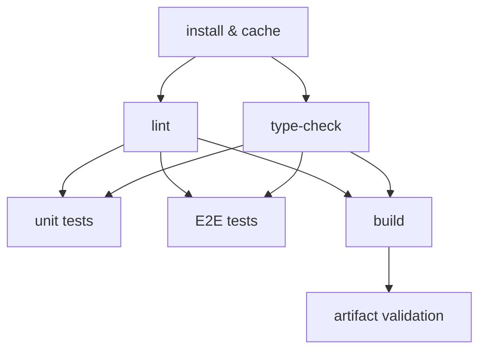

# [FEE-1502] Build Pipelines: Lint, Type-Check, Test & Build

:::info
A CI pipeline for a modern frontend project runs several kinds of checks with very different costs: a lint pass can finish in ten seconds while an end-to-end suite runs for minutes. Ordering those checks cheapest-first, and treating type-checking as a gate separate from the build, are the two decisions that determine whether a broken push fails fast or fails slow. Modern bundlers such as esbuild, SWC, and Vite strip TypeScript types without checking them, so a green build alone does not mean the code type-checks. This article works through the gate order, the pipeline DAG, and the monorepo affected-testing pattern that keeps CI fast as a codebase grows.
:::

## Context

A CI pipeline is a sequence of quality gates. Every gate that fails blocks the code from merging, but the gates are not equal in cost: some complete in ten seconds, others take minutes. Running an expensive gate before a cheap one means a developer pays the expensive gate's latency to learn about a mistake the cheap gate would have caught immediately.

The canonical quality gate sequence for a modern frontend project is:

1. **Static analysis**: ESLint and Prettier, or a Rust-based toolchain such as Biome or oxlint (10-30 seconds; oxlint has shipped a stable 1.0 release since June 2025 and typically finishes in under a second, which strengthens the case for running it first)
2. **Type checking**: `tsc --noEmit` (20-60 seconds)
3. **Unit tests**: Vitest, Jest (30-120 seconds)
4. **Integration / E2E tests**: Playwright, Cypress (2-10 minutes)
5. **Build**: Vite, webpack, Turbopack (1-5 minutes)
6. **Artifact validation**: bundle size check, output verification (5-30 seconds)

This list orders each check by its typical cost, but the ranges overlap in practice: a large project's build can run faster or slower than its E2E suite depending on the codebase. The pipeline in this article's Visual section reflects that by running the build in parallel with the test jobs rather than serializing every stage by average duration.

The ordering also reflects the nature of each check. Lint and type-check are purely static: they read source files and exit, without executing code, spinning up servers, or requiring a built artifact. Unit tests execute code but stay in-process, without network or DOM. E2E tests run a browser against a live application. The build produces the artifact that would be deployed. Each layer adds cost because it does more real-world simulation.

Modern CI platforms like GitHub Actions enable parallelization at the job level. Lint and type-check can run concurrently because they share no state. Once those two gates pass, unit tests, E2E tests, and the build can all run concurrently as well.

---

## Visual

Pipeline DAG showing parallel and sequential stages:



**Reading the DAG:**
- `install` is the single prerequisite for all subsequent jobs
- `lint` and `type-check` run in parallel, both starting immediately after install
- `unit tests`, `E2E tests`, and `build` each wait only on lint and type-check passing; once those two gates clear, all three run concurrently with each other
- `artifact validation` (bundle size check, output verification) runs after `build` produces its artifact

Gating `build` behind lint and type-check, rather than behind the test jobs, keeps the expensive test suites and the build running in parallel: a failing E2E test does not stall the build, and a slow build does not stall the tests. The trade-off is compute, not wall-clock time. If a change would have failed a test anyway, this shape spends a few minutes of build compute that a test-gated build would have skipped. Teams on metered CI minutes who would rather spend compute than wall-clock time can gate `build` behind the test jobs instead, accepting a slower pipeline on every passing run in exchange.

---

## Example

### 1. Full parallel pipeline with lint, type-check, test, and build

Each job below runs its own checkout, pnpm setup, and dependency install rather than sharing a `node_modules` artifact from a separate install job. GitHub-hosted runners do not ship pnpm, so any job that skips `pnpm/action-setup` fails its first `pnpm` call with `pnpm: command not found`. Giving every job its own setup step, backed by `actions/setup-node`'s built-in pnpm store cache, avoids that failure and means every job pins its own Node version instead of inheriting whatever a separate install job happened to use.

```yaml
# .github/workflows/ci.yml
name: CI

on:
  pull_request:
  push:
    branches: [main]

concurrency:
  group: ci-${{ github.ref }}
  cancel-in-progress: ${{ github.ref != 'refs/heads/main' }}

jobs:
  lint:
    name: Lint
    runs-on: ubuntu-latest
    steps:
      - uses: actions/checkout@v4
      - uses: pnpm/action-setup@v4
        with:
          version: 10
      - uses: actions/setup-node@v4
        with:
          node-version: 22
          cache: pnpm
      - run: pnpm install --frozen-lockfile
      - run: pnpm lint
      - run: pnpm format:check

  type-check:
    name: Type Check
    runs-on: ubuntu-latest
    steps:
      - uses: actions/checkout@v4
      - uses: pnpm/action-setup@v4
        with:
          version: 10
      - uses: actions/setup-node@v4
        with:
          node-version: 22
          cache: pnpm
      - run: pnpm install --frozen-lockfile
      - run: pnpm tsc --noEmit

  unit-test:
    name: Unit Tests
    needs: [lint, type-check]
    runs-on: ubuntu-latest
    steps:
      - uses: actions/checkout@v4
      - uses: pnpm/action-setup@v4
        with:
          version: 10
      - uses: actions/setup-node@v4
        with:
          node-version: 22
          cache: pnpm
      - run: pnpm install --frozen-lockfile
      - run: pnpm test:unit --coverage
      - uses: actions/upload-artifact@v4
        if: always()
        with:
          name: coverage-report
          path: coverage/

  e2e-test:
    name: E2E Tests
    needs: [lint, type-check]
    runs-on: ubuntu-latest
    steps:
      - uses: actions/checkout@v4
      - uses: pnpm/action-setup@v4
        with:
          version: 10
      - uses: actions/setup-node@v4
        with:
          node-version: 22
          cache: pnpm
      - run: pnpm install --frozen-lockfile
      - run: pnpm exec playwright install --with-deps chromium
      - run: pnpm build
      - run: pnpm test:e2e

  build:
    name: Build
    needs: [lint, type-check]
    runs-on: ubuntu-latest
    steps:
      - uses: actions/checkout@v4
      - uses: pnpm/action-setup@v4
        with:
          version: 10
      - uses: actions/setup-node@v4
        with:
          node-version: 22
          cache: pnpm
      - run: pnpm install --frozen-lockfile
      - run: pnpm build
      - uses: actions/upload-artifact@v4
        with:
          name: dist
          path: dist/

  size-check:
    name: Bundle Size
    needs: build
    runs-on: ubuntu-latest
    steps:
      - uses: actions/checkout@v4
      - uses: pnpm/action-setup@v4
        with:
          version: 10
      - uses: actions/setup-node@v4
        with:
          node-version: 22
          cache: pnpm
      - run: pnpm install --frozen-lockfile
      - uses: actions/download-artifact@v4
        with:
          name: dist
          path: dist/
      - run: pnpm size-limit
```

The `e2e-test` job runs `pnpm build` itself rather than depending on the `build` job, since `build` runs in parallel with the tests instead of before them (see Visual). Playwright still needs something to test against; its `webServer` option in `playwright.config.ts` starts a preview server against that fresh build:

```typescript
// playwright.config.ts
import { defineConfig } from '@playwright/test'

export default defineConfig({
  webServer: {
    command: 'pnpm vite preview --port 4173',
    port: 4173,
    reuseExistingServer: !process.env.CI,
  },
  use: {
    baseURL: 'http://localhost:4173',
  },
})
```

### 2. `tsc --noEmit` as a separate job from the build

The build job and the type-check job check different things, and neither depends on the other's output: the type-check job never touches `dist/`, and the build process never invokes `tsc`. Both jobs need only lint and type-check to pass, then run concurrently with the test jobs.

```yaml
type-check:
  name: Type Check
  runs-on: ubuntu-latest
  steps:
    - uses: actions/checkout@v4
    - uses: pnpm/action-setup@v4
      with:
        version: 10
    - uses: actions/setup-node@v4
      with:
        node-version: 22
        cache: pnpm
    - run: pnpm install --frozen-lockfile
    # Explicit type gate: the Vite build below does NOT run this
    - run: pnpm exec tsc --noEmit --project tsconfig.json

build:
  name: Build
  needs: [lint, type-check]
  runs-on: ubuntu-latest
  steps:
    - uses: actions/checkout@v4
    - uses: pnpm/action-setup@v4
      with:
        version: 10
    - uses: actions/setup-node@v4
      with:
        node-version: 22
        cache: pnpm
    - run: pnpm install --frozen-lockfile
    # esbuild/Rollup transpiles: no type checking happens here
    - run: pnpm vite build
```

The `tsconfig.json` used by the type-check job should be your strictest configuration: `strict: true`, `noUncheckedIndexedAccess: true`, and any project-specific rules. The build configuration may use a separate `tsconfig.build.json` that excludes test files; the type-check job should include them.

### 3. Coverage report upload and threshold configuration (Vitest)

Coverage thresholds configured on the test runner itself, Vitest's `coverage.thresholds` or Jest's `coverageThreshold`, are hard gates: an unmet threshold exits with a non-zero code and fails the job. Neither runner has a built-in "warn but don't fail" mode. For genuinely soft, trend-only coverage, skip in-runner thresholds and use Codecov's informational status checks instead, or run a threshold check in a separate, non-required job.

```typescript
// vitest.config.ts
import { defineConfig } from 'vitest/config'

export default defineConfig({
  test: {
    coverage: {
      provider: 'v8',
      reporter: ['text', 'lcov', 'html'],
      // These thresholds are a hard gate: CI fails the job if unmet.
      // For soft, trend-only coverage, remove this block and rely on
      // Codecov's informational status checks in codecov.yml instead.
      thresholds: {
        lines: 70,
        functions: 70,
        branches: 60,
        statements: 70,
        // 'perFile' applies the threshold per file: catches newly added
        // files that are completely untested
        perFile: false,
      },
      exclude: [
        'src/**/*.stories.ts',
        'src/**/*.config.ts',
        'src/types/**',
      ],
    },
  },
})
```

To make coverage informational instead of a hard gate, configure Codecov directly:

```yaml
# codecov.yml
coverage:
  status:
    project:
      default:
        informational: true
    patch:
      default:
        informational: true
```

Upload coverage to Codecov for trend tracking:

```yaml
unit-test:
  name: Unit Tests
  needs: [lint, type-check]
  runs-on: ubuntu-latest
  steps:
    - uses: actions/checkout@v4
    - uses: pnpm/action-setup@v4
      with:
        version: 10
    - uses: actions/setup-node@v4
      with:
        node-version: 22
        cache: pnpm
    - run: pnpm install --frozen-lockfile
    - run: pnpm vitest run --coverage
    - name: Upload coverage to Codecov
      uses: codecov/codecov-action@v5
      with:
        token: ${{ secrets.CODECOV_TOKEN }}
        files: ./coverage/lcov.info
        fail_ci_if_error: false   # Coverage upload failure should not block CI
        flags: unit
```

Setting `fail_ci_if_error: false` is intentional: Codecov upload is a reporting step, not a quality gate, so a network error at Codecov should not block a merge. `codecov-action@v5` also supports tokenless upload for forked-repo PRs and for organizations that opt out of the token requirement on public repositories; private repos still need `CODECOV_TOKEN`.

### 4. Bundle size check with `size-limit`

```json
// package.json (size-limit configuration)
{
  "size-limit": [
    {
      "name": "Main bundle",
      "path": "dist/assets/index-*.js",
      "limit": "150 kB",
      "gzip": true
    },
    {
      "name": "CSS bundle",
      "path": "dist/assets/index-*.css",
      "limit": "30 kB",
      "gzip": true
    },
    {
      "name": "Vendor chunk",
      "path": "dist/assets/vendor-*.js",
      "limit": "200 kB",
      "gzip": true
    }
  ]
}
```

In GitHub Actions, use the `size-limit/action` to get PR comments with size diffs:

```yaml
size-check:
  name: Bundle Size
  needs: build
  runs-on: ubuntu-latest
  steps:
    - uses: actions/checkout@v4
    - uses: pnpm/action-setup@v4
      with:
        version: 10
    - uses: actions/setup-node@v4
      with:
        node-version: 22
        cache: pnpm
    - run: pnpm install --frozen-lockfile
    - uses: andresz1/size-limit-action@v1
      with:
        github_token: ${{ secrets.GITHUB_TOKEN }}
        # The action builds, runs size-limit, and posts a PR comment
        # showing the size delta vs the base branch
```

The `size-limit-action` compares the current PR's bundle sizes against the base branch and posts a comment showing increases and decreases per chunk. This is more useful than a simple pass/fail: a PR that adds 5 kB to the vendor chunk is worth reviewing even if it is under the absolute limit.

### 5. Nx affected commands in CI

```yaml
# .github/workflows/ci.yml (monorepo with Nx)
name: CI (Affected)

on:
  pull_request:
  push:
    branches: [main]

jobs:
  affected:
    name: Affected Checks
    runs-on: ubuntu-latest
    steps:
      - uses: actions/checkout@v4
        with:
          # Fetch full history so Nx can compute the affected set
          fetch-depth: 0

      - uses: pnpm/action-setup@v4
        with:
          version: 10

      - uses: actions/setup-node@v4
        with:
          node-version: 22
          cache: pnpm

      - run: pnpm install --frozen-lockfile

      - name: Derive base and head SHAs for affected commands
        uses: nrwl/nx-set-shas@v5

      - name: Lint affected
        run: pnpm nx affected -t lint

      - name: Type-check affected
        run: pnpm nx affected -t type-check

      - name: Test affected
        run: pnpm nx affected -t test --coverage

      - name: Build affected
        run: pnpm nx affected -t build
```

`nrwl/nx-set-shas` sets the `NX_BASE` and `NX_HEAD` environment variables that `nx affected` reads automatically, resolving the base to the latest successful commit on the main branch. A hand-rolled base such as `HEAD~1` gets this wrong whenever a push bundles more than one commit, or the previous CI run failed: it silently skips whatever commits sit in between, and those changes never get tested.

Each Nx target (`lint`, `type-check`, `test`, `build`) must be defined in the project's `project.json` or `nx.json`. Nx respects the dependency graph when computing the affected set: if package A depends on package B, and you change package B, Nx marks both A and B as affected.

For Turborepo, the equivalent uses the native `--affected` flag, available since Turborepo 2.1:

```yaml
- name: Test affected packages
  env:
    TURBO_SCM_BASE: ${{ github.event.pull_request.base.sha }}
  run: pnpm turbo run test --affected
```

### 6. Required vs optional status checks

Branch protection rules in GitHub distinguish between **required** and **optional** status checks:

**Required checks**: the branch protection rule lists these by job name. A pull request cannot merge until all required checks pass. If a required check is not reported (the job was skipped or never ran), the merge button remains locked.

**Optional checks**: reported as status checks on the commit, visible in the PR timeline, but not blocking. A failing optional check shows an orange warning rather than a red block.

Recommended assignment for a frontend project:

| Check | Required? | Rationale |
|---|---|---|
| lint | Yes | A lint failure is always a defect |
| type-check | Yes | A type error is always a defect |
| unit-test | Yes | Failing unit tests block merge |
| build | Yes | A build failure means the artifact is broken |
| e2e-test | Yes (main flows) | Core flows must pass |
| coverage-upload | No | Reporting step; network failures should not block |
| bundle-size | No | Informational; hard limits set in `size-limit` config |
| e2e-test (full suite) | No | Slow suite; run on schedule, not on every PR |

The branch protection configuration lives in the repository settings under **Branches → Branch protection rules → Require status checks to pass before merging**. Status check names must exactly match the `name` field of the GitHub Actions job, not the workflow name.

---

## Best Practices

**SHOULD run lint and type-check before test jobs in pipelines that gate sequentially.** Static analysis completes in 10-30 seconds; unit tests take 30-120 seconds and E2E tests take 2-10 minutes. Gating the slower jobs behind lint and type-check saves the compute those jobs would otherwise spend on a push that was always going to fail a cheap check first. The trade-off: a push with both a lint error and a test failure surfaces them one push at a time instead of all at once. Teams with spare CI capacity, such as self-hosted runners or unmetered minutes, often run every gate in parallel instead, trading compute for complete feedback on the first push.

**MUST run `tsc --noEmit` as an explicit CI job separate from the build job.** Modern bundlers such as Vite, esbuild, and SWC transpile TypeScript without running the type checker, so a successful build does not imply type correctness. Teams MUST include a dedicated type-check job; omitting it means TypeScript errors accumulate silently and are never caught by CI. Vue and Svelte projects need `vue-tsc --noEmit` or `svelte-check` respectively, since plain `tsc` skips single-file components entirely.

**SHOULD use `--frozen-lockfile` (pnpm) or `npm ci` on every CI install.** Without the frozen flag, the package manager may resolve dependency ranges to different versions than what is in the lockfile, producing non-deterministic installs. CI environments SHOULD fail loudly if the lockfile is out of sync rather than silently installing different packages.

**SHOULD upload build artifacts rather than rebuilding in downstream jobs that only need to read them.** If the build job produces a `dist/` directory and a downstream job like `size-check` rebuilds from source because no artifact was uploaded, the full build time is paid again on every run. Teams SHOULD upload the build output as a GitHub Actions artifact and restore it in jobs that only consume it. Jobs that run concurrently with `build` instead of after it, such as `e2e-test` in this article's pipeline, need their own build step, since the artifact does not exist yet when they start.

**SHOULD set `fetch-depth: 0` in workflows that run affected commands.** Nx and Turborepo compute the affected set by diffing the current branch against a base commit. Without full git history, the repository is a shallow clone and the base commit may not exist, causing the affected computation to fall back to running all tests. Set `fetch-depth: 0` in any job that calls `nx affected`, `nx-set-shas`, or `turbo run --affected`.

**SHOULD collect coverage as a trend metric rather than enforcing a hard percentage threshold as a CI gate.** Hard thresholds incentivize developers to write tests that touch lines without asserting behavior rather than tests that verify correctness. Teams SHOULD collect coverage on every CI run, report diffs on pull requests, and alert on sharp drops, rather than blocking merges on a fixed percentage floor.

---

## Design Thinking

### Why fail-fast ordering matters

Consider two orderings of the same pipeline: lint first, or build first.

As a worked example: suppose lint takes 12 seconds and the build takes 3 minutes. If the build runs first, a developer with a trivial lint error, a `no-unused-vars` violation, waits the full 3 minutes to find out about a 12-second check. Reordering the pipeline so lint runs first turns that wait into 12 seconds. The gap widens with project size: build time grows with the amount of code being compiled, while lint scoped to the changed files stays roughly flat regardless of how large the rest of the repository gets.

Fail-fast ordering puts the cheapest signal first, so an expensive check never delays a cheap one.

### Why `tsc --noEmit` must be a separate step from the build

This is one of the most commonly misunderstood aspects of modern frontend CI. The confusion comes from a reasonable-sounding assumption: if the project builds successfully, the TypeScript must be correct. That assumption is false for a large share of modern frontend projects.

The root cause is the separation between type-checking and transpilation. The TypeScript compiler (`tsc`) does two distinct things: it type-checks the code, and it emits JavaScript output. These can be decoupled. The `--noEmit` flag runs type-checking without emitting any files. It is a pure type gate.

Modern build tools such as esbuild, SWC, and Vite's transform pipeline use a different strategy: they strip TypeScript type annotations without running the type checker. esbuild documents this trade-off directly: its own docs describe TypeScript support as syntax stripping, not a type system, and note that features requiring type interpretation (such as `emitDecoratorMetadata`) are unsupported as a result. This keeps builds fast, but it means type errors are invisible to the build. A project can have dozens of type errors and still produce a successful build artifact.

Next.js is a partial exception. `next build` runs TypeScript type-checking by default and fails the production build on type errors, unless `typescript.ignoreBuildErrors` is set. The transpile-only behavior described above applies to Vite, esbuild, and SWC-based pipelines, and to Next.js projects that have disabled build-time checking for speed.

The practical implication: if a CI pipeline only runs the build and omits `tsc --noEmit`, or relies on a transpile-only bundler without a separate type gate, TypeScript errors accumulate silently. The first time anyone notices is when a developer looks at their editor, or worse, when a runtime error surfaces because a type cast was wrong.

The correct CI design:

- **Build job**: runs `vite build` or a comparable bundler task. Fast, with no type checking (Next.js excepted, as above).
- **Type-check job**: runs `tsc --noEmit` for most projects; `vue-tsc --noEmit` for Vue, `svelte-check` for Svelte, since plain `tsc` skips single-file components. An explicit type gate that runs in parallel with lint.

The build and type-check jobs check different things, and neither depends on the other's output: the build produces the artifact, the type-check produces a pass/fail signal.

### Why coverage thresholds as hard gates are controversial

Code coverage is a useful metric for understanding which code paths are exercised by tests. Martin Fowler's "TestCoverage" bliki entry makes the case that it works well as a diagnostic for finding untested code and poorly as a target: once it becomes a number a team is judged on, people optimize the number instead of the tests.

The core problem is perverse incentives. When a team sets a hard coverage threshold, say 80 percent, developers who need to ship quickly will write tests that hit lines rather than tests that verify behavior. A test that calls a function and asserts nothing exercises the code path but adds no actual safety. Coverage goes up; code quality does not.

The "100% coverage" trap, which Kent C. Dodds argues against in "Write tests. Not too many. Mostly integration," is even more damaging. Some code, such as configuration objects, type guards, and trivial getters, is not worth testing in isolation. Requiring 100% coverage forces developers to write unit tests for code where the meaningful test would be an integration test or a type-check. The result is a test suite full of low-value micro-tests that slow the suite and create maintenance burden.

The better practice is to use coverage as a trend metric, not a gate:

- **Collect coverage data on every CI run**: upload it to a service like Codecov or Coveralls
- **Report coverage diffs on pull requests**: the PR comment shows whether this change increased or decreased coverage
- **Alert on sharp drops**: a PR that drops coverage by 20 percentage points warrants attention; a 0.3% drop on a large PR does not
- **Use Codecov's informational status mode instead of a runner-level hard threshold**: `informational: true` in `codecov.yml` reports coverage without blocking the merge (see Example 3)

This approach surfaces genuinely undertested changes without creating the incentive structure that produces meaningless tests.

### Why monorepos need affected-only testing

In a monorepo with 50 packages, running every test suite on every commit wastes time. If a change touches the `utils` package, CI needs to test `utils` and every package that depends on it, not the other 40 packages with no dependency relationship to the change.

Tools like Nx and Turborepo solve this with dependency graph analysis. Nx builds a dependency graph of the workspace from `package.json` dependencies and import analysis. Running `nx affected -t test` computes which packages are affected by the changed files and runs tests only for those packages.

The time saved scales with how much of the monorepo a given change actually touches: a change confined to one leaf package skips the suites for every package that does not depend on it, while a change to a widely-depended-on package still triggers most of the graph. WarpBuild's guide to GitHub Actions for monorepos frames affected-only execution as the single biggest lever available, ahead of remote caching or matrix parallelism, because running four affected packages instead of forty-five beats any amount of caching on the packages you skip entirely.

The key implementation detail is the base reference. `nx affected` computes the affected set by comparing the current commit to a base commit. In CI, the `nrwl/nx-set-shas` action is the recommended way to set that base: it resolves to the latest successful commit on the main branch (see Example 5). A hardcoded base such as `HEAD~1` breaks whenever a push bundles more than one commit or the previous CI run failed, since it silently skips whatever commits sit in between.

---

## Common Mistakes

**Running all tests in a monorepo on every commit.** Without affected-only testing, a monorepo CI run grows linearly with the number of packages. A 50-package monorepo with 2-minute average test suites would take 100 minutes if fully serialized; even with parallelism across runners, this is expensive enough that teams either shard aggressively or stop trusting CI to finish before the next push lands. Affected-only testing, via `nx affected` or Turborepo's `--affected` flag, is what keeps monorepo CI usable as the package count grows.

---

## Related Topics

- [FEE-1500 CI/CD & Deployment Overview](/en/CI CD and Deployment/1500)
- [FEE-1501 GitHub Actions for Frontend](/en/CI CD and Deployment/1501)
- [FEE-1100 Testing Strategies](/en/Testing Strategies/1100)
- [FEE-803 tsc vs SWC: Type Checking and Transpilation](/en/Build Tooling and Module Systems/803)
- [FEE-805 Monorepos with Nx and Turborepo](/en/Build Tooling and Module Systems/805)

---

## References

- GitHub Docs, "Workflow syntax for GitHub Actions," GitHub (2026). https://docs.github.com/en/actions/reference/workflows-and-actions/workflow-syntax
- TypeScript Handbook, "tsc CLI Options," Microsoft (2026). https://www.typescriptlang.org/docs/handbook/compiler-options.html
- Nx Documentation, "Affected Commands," Nx (2026). https://nx.dev/ci/features/affected
- nrwl/nx-set-shas, "README," GitHub (2026). https://github.com/nrwl/nx-set-shas
- Turborepo Docs, "Constructing CI," Vercel (2026). https://turborepo.dev/docs/crafting-your-repository/constructing-ci
- size-limit, "Performance budget tool for JavaScript," GitHub (2026). https://github.com/ai/size-limit
- Codecov Docs, "Status Checks," Codecov (2026). https://docs.codecov.com/docs/commit-status
- Vitest, "Coverage configuration reference," Vitest (2026). https://vitest.dev/config/#coverage
- Vite Docs, "Features: TypeScript," VoidZero (2026). https://vite.dev/guide/features
- esbuild, "Content Types: No Type System," (2026). https://esbuild.github.io/content-types/#no-type-system
- Martin Fowler, "TestCoverage," martinfowler.com bliki (2012). https://martinfowler.com/bliki/TestCoverage.html
- Kent C. Dodds, "Write tests. Not too many. Mostly integration," kentcdodds.com (2017). https://kentcdodds.com/blog/write-tests
- WarpBuild, "The Complete Guide to GitHub Actions for Monorepos: Turborepo, Nx, and pnpm Workspaces," WarpBuild Blog (2025). https://www.warpbuild.com/blog/github-actions-monorepo-guide
