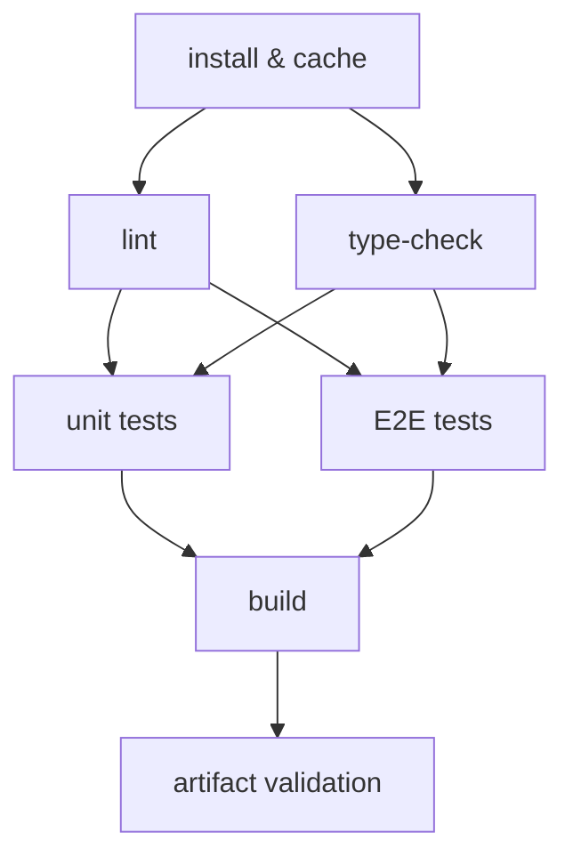

# Build Pipelines: Lint, Type-Check, Test & Build

## Context

A CI pipeline is a sequence of quality gates. Every gate that fails blocks the code from merging. But not all gates are equal in cost: some complete in 10 seconds, others take 3 minutes. If you run expensive gates before cheap ones, you pay a latency tax every time a developer makes a trivial mistake.

The canonical quality gate sequence for a modern frontend project is:

1. **Static analysis** — ESLint, Prettier (10–30 seconds)
2. **Type checking** — `tsc --noEmit` (20–60 seconds)
3. **Unit tests** — Vitest, Jest (30–120 seconds)
4. **Integration / E2E tests** — Playwright, Cypress (2–10 minutes)
5. **Build** — Vite, webpack, Turbopack (1–5 minutes)
6. **Artifact validation** — bundle size check, output verification (5–30 seconds)

This ordering is not arbitrary. It is engineered around the principle of fail-fast feedback: surface the cheapest signal first. A lint error that takes 15 seconds to detect is far better than discovering the same logical error at the build step 4 minutes into a run.

The ordering also reflects the nature of each check. Lint and type-check are purely static — they read source files and exit. They do not execute code, spin up servers, or require a built artifact. Unit tests execute code but stay in-process, without network or DOM. E2E tests run a browser against a live application. The build produces the artifact that would be deployed. Each layer adds cost because it does more real-world simulation.

Modern CI platforms like GitHub Actions enable parallelization at the job level. Lint and type-check can run concurrently because they share no state. Unit tests and E2E tests can run concurrently after installation completes. Understanding which checks are truly independent unlocks the most impactful CI speedups.

---

## Design Thinking

### Why fail-fast ordering matters: the 17x feedback ratio

Consider two orderings of the same pipeline steps. In the first, you run lint first. In the second, you run the build first.

A developer pushes a branch with a trivial lint error — a `no-unused-vars` violation. In the fail-fast ordering, the lint job completes in 12 seconds and reports the error. The developer fixes it and pushes again in under a minute.

In the reverse ordering, the build job runs for 3 minutes before the pipeline reaches the lint step. The developer waited 3 minutes to learn about a 12-second check. That is a 15× latency penalty for a simple mistake. At team scale — 20 developers, 50 pushes per day — this compounds into hours of wasted feedback cycles per week.

The 17× figure in the heading comes from a common real-world ratio: lint in 10 seconds versus build in 170 seconds. The ratio scales with project size. In a large monorepo, the build can take 8 to 15 minutes, while lint on a changed file set completes in 20 seconds. Fail-fast ordering is not a style preference; it is a latency engineering decision.

### Why `tsc --noEmit` must be a separate step from the build

This is the most commonly misunderstood aspect of modern frontend CI. The confusion arises from a reasonable assumption: if the project builds successfully, the TypeScript must be correct. That assumption is false for a large fraction of modern frontend projects.

The root cause is the separation between type-checking and transpilation. The TypeScript compiler (`tsc`) does two distinct things: it type-checks your code, and it emits JavaScript output. These can be decoupled. The `--noEmit` flag runs type-checking without emitting any files — it is a pure type gate.

Modern build tools — esbuild, SWC, Vite's transform pipeline — use a different strategy. They strip TypeScript annotations without running the type checker. This makes builds dramatically faster (10× to 50× compared to `tsc --emit`), but it means type errors are invisible to the build. A project can have dozens of type errors and still produce a successful build artifact.

The practical implication: if your CI pipeline only runs the build and omits `tsc --noEmit`, you have no type-safety gate. TypeScript errors accumulate silently. The first time you discover them is when a developer looks at their editor — or worse, when a runtime error surfaces because a type cast was wrong.

The correct CI design:

- **Build job**: runs `vite build` or `next build` — fast, no type checking
- **Type-check job**: runs `tsc --noEmit` — explicit type gate, runs in parallel with lint

These two jobs can run concurrently. Neither depends on the other's output. The build produces the artifact; the type-check produces a pass/fail signal.

### Why coverage thresholds as hard gates are controversial

Code coverage is a useful metric for understanding which code paths are exercised by tests. It is a poor gate for enforcing quality.

The core problem is perverse incentives. When a team sets a hard coverage threshold — say, 80% — developers who need to ship quickly will write tests that hit lines rather than tests that verify behavior. A test that calls a function and asserts nothing meaningfully exercises the code path but adds no actual safety. Coverage goes up; code quality does not.

The "100% coverage" trap is even more damaging. Some code — configuration objects, type guards, trivial getters — is not worth testing in isolation. Requiring 100% coverage forces developers to write unit tests for code where the meaningful test would be an integration test or a type-check. The result is a test suite full of low-value micro-tests that slow the suite and create maintenance burden.

The better practice is to use coverage as a trend metric, not a gate:

- **Collect coverage data on every CI run** — upload to a service like Codecov or Coveralls
- **Report coverage diffs on pull requests** — the PR comment shows whether this change increased or decreased coverage
- **Alert on sharp drops** — a PR that drops coverage by 20 percentage points warrants attention; a 0.3% drop on a large PR does not
- **Set soft thresholds, not hard gates** — configure Vitest or Jest to warn when coverage drops below a floor, without failing the build

This approach surfaces genuinely undertested changes without creating the incentive structure that produces meaningless tests.

### Why monorepo affected-only testing is transformative

In a monorepo with 50 packages, running every test suite on every commit is wasteful and slow. If you change the `utils` package, you need to test `utils` and every package that depends on `utils`. You do not need to test the 40 packages that have no dependency relationship to the change.

Tools like Nx and Turborepo solve this with dependency graph analysis. Nx builds a dependency graph of your workspace from `package.json` dependencies and import analysis. When you run `nx affected:test`, Nx computes which packages are affected by the changed files and runs tests only for those packages.

In a mid-size monorepo, this can reduce CI test time from 15 minutes (all tests) to 90 seconds (affected tests) for a typical single-package change. The savings compound as the monorepo grows: the more packages that are not touched, the faster the CI run.

The key implementation detail is the base reference. `nx affected` computes the affected set by comparing the current commit to a base — typically the merge base with the main branch (`--base=origin/main`). This means the affected set covers all files changed since the branch diverged, not just the last commit.

---

## Best Practices

**MUST run lint and type-check before tests in any sequential pipeline.** Static analysis completes in 10–30 seconds; unit tests take 30–120 seconds and E2E tests take 2–10 minutes. Running expensive gates first means a trivial lint error that takes 15 seconds to catch causes a developer to wait minutes for feedback. Teams MUST order gates from cheapest to most expensive so the pipeline fails as early and cheaply as possible.

**MUST run `tsc --noEmit` as an explicit CI job separate from the build job.** Modern bundlers — Vite, esbuild, SWC — transpile TypeScript without running the type checker, so a successful build does not imply type correctness. Teams MUST include a dedicated type-check job that runs `tsc --noEmit`; omitting it means TypeScript errors accumulate silently and are never caught by CI.

**SHOULD use `--frozen-lockfile` (pnpm) or `npm ci` on every CI install.** Without the frozen flag, the package manager may resolve dependency ranges to different versions than what is in the lockfile, producing non-deterministic installs. CI environments SHOULD fail loudly if the lockfile is out of sync rather than silently installing different packages.

**SHOULD upload build artifacts rather than rebuilding in downstream jobs.** If the build job produces a `dist/` directory and downstream jobs (size-limit, deployment preview) must rebuild from source because no artifact was uploaded, the full build time is paid again on every run. Teams SHOULD upload the build output as a GitHub Actions artifact and restore it in downstream jobs.

**SHOULD set `fetch-depth: 0` in workflows that run affected commands.** Nx and Turborepo compute the affected set by diffing the current branch against a base commit. Without full git history, the repository is a shallow clone and the base commit may not exist, causing the affected computation to fall back to running all tests. Set `fetch-depth: 0` in any job that calls `nx affected` or `turbo run --filter='...[origin/main]'`.

**SHOULD track coverage as a trend metric and AVOID setting hard coverage thresholds as CI gates.** Hard thresholds incentivize developers to write tests that touch lines without asserting behavior rather than tests that verify correctness. Teams SHOULD collect coverage on every CI run, report diffs on pull requests, and alert on sharp drops, rather than blocking merges on a fixed percentage floor.

---

## Visual

Pipeline DAG showing parallel and sequential stages:



**Reading the DAG:**
- `install` is the single prerequisite for all subsequent jobs
- `lint` and `type-check` run in parallel — both start immediately after install
- `unit tests` and `E2E tests` both require lint and type-check to pass before starting
- `build` runs after all tests pass
- `artifact validation` (bundle size check, output verification) is the final gate

This structure minimizes total wall-clock time while preserving fail-fast ordering. A lint failure kills the run before any test runner spins up. A type error kills the run before any browser launches.

---

## Example

### 1. Full parallel pipeline with lint, type-check, test, and build

```yaml
# .github/workflows/ci.yml
name: CI

on:
  pull_request:
  push:
    branches: [main]

concurrency:
  group: ci-${{ github.ref }}
  cancel-in-progress: ${{ github.ref != 'refs/heads/main' }}

jobs:
  install:
    name: Install
    runs-on: ubuntu-latest
    steps:
      - uses: actions/checkout@v4
      - uses: pnpm/action-setup@v3
        with:
          version: 9
      - uses: actions/setup-node@v4
        with:
          node-version: 20
          cache: pnpm
      - run: pnpm install --frozen-lockfile
      - uses: actions/cache/save@v4
        with:
          path: node_modules
          key: node-modules-${{ hashFiles('pnpm-lock.yaml') }}

  lint:
    name: Lint
    needs: install
    runs-on: ubuntu-latest
    steps:
      - uses: actions/checkout@v4
      - uses: actions/cache/restore@v4
        with:
          path: node_modules
          key: node-modules-${{ hashFiles('pnpm-lock.yaml') }}
      - run: pnpm lint
      - run: pnpm format:check

  type-check:
    name: Type Check
    needs: install
    runs-on: ubuntu-latest
    steps:
      - uses: actions/checkout@v4
      - uses: actions/cache/restore@v4
        with:
          path: node_modules
          key: node-modules-${{ hashFiles('pnpm-lock.yaml') }}
      - run: pnpm tsc --noEmit

  unit-test:
    name: Unit Tests
    needs: [lint, type-check]
    runs-on: ubuntu-latest
    steps:
      - uses: actions/checkout@v4
      - uses: actions/cache/restore@v4
        with:
          path: node_modules
          key: node-modules-${{ hashFiles('pnpm-lock.yaml') }}
      - run: pnpm test:unit --coverage
      - uses: actions/upload-artifact@v4
        if: always()
        with:
          name: coverage-report
          path: coverage/

  e2e-test:
    name: E2E Tests
    needs: [lint, type-check]
    runs-on: ubuntu-latest
    steps:
      - uses: actions/checkout@v4
      - uses: actions/cache/restore@v4
        with:
          path: node_modules
          key: node-modules-${{ hashFiles('pnpm-lock.yaml') }}
      - run: pnpm playwright install --with-deps chromium
      - run: pnpm test:e2e

  build:
    name: Build
    needs: [unit-test, e2e-test]
    runs-on: ubuntu-latest
    steps:
      - uses: actions/checkout@v4
      - uses: actions/cache/restore@v4
        with:
          path: node_modules
          key: node-modules-${{ hashFiles('pnpm-lock.yaml') }}
      - run: pnpm build
      - uses: actions/upload-artifact@v4
        with:
          name: dist
          path: dist/

  size-check:
    name: Bundle Size
    needs: build
    runs-on: ubuntu-latest
    steps:
      - uses: actions/checkout@v4
      - uses: actions/cache/restore@v4
        with:
          path: node_modules
          key: node-modules-${{ hashFiles('pnpm-lock.yaml') }}
      - uses: actions/download-artifact@v4
        with:
          name: dist
          path: dist/
      - run: pnpm size-limit
```

### 2. `tsc --noEmit` as a separate job from the build

The build and type-check jobs are independent. The build uses Vite (backed by esbuild) and never runs `tsc`. The type-check job runs `tsc --noEmit` explicitly. Both jobs run in parallel; neither waits for the other.

```yaml
type-check:
  name: Type Check
  needs: install
  runs-on: ubuntu-latest
  steps:
    - uses: actions/checkout@v4
    - uses: actions/cache/restore@v4
      with:
        path: node_modules
        key: node-modules-${{ hashFiles('pnpm-lock.yaml') }}
    # Explicit type gate — Vite build does NOT run this
    - run: pnpm exec tsc --noEmit --project tsconfig.json

build:
  name: Build
  needs: [unit-test, e2e-test]
  runs-on: ubuntu-latest
  steps:
    - uses: actions/checkout@v4
    - uses: actions/cache/restore@v4
      with:
        path: node_modules
        key: node-modules-${{ hashFiles('pnpm-lock.yaml') }}
    # esbuild/Rollup transpiles — no type checking happens here
    - run: pnpm vite build
```

The `tsconfig.json` used by the type-check job should be your strictest configuration — `strict: true`, `noUncheckedIndexedAccess: true`, and any project-specific rules. The build configuration may use a separate `tsconfig.build.json` that excludes test files; the type-check job should include them.

### 3. Coverage report upload and threshold configuration (Vitest)

```typescript
// vitest.config.ts
import { defineConfig } from 'vitest/config'

export default defineConfig({
  test: {
    coverage: {
      provider: 'v8',
      reporter: ['text', 'lcov', 'html'],
      // Track thresholds as soft guidance, not hard gates
      // Remove these if they cause perverse incentive problems
      thresholds: {
        lines: 70,
        functions: 70,
        branches: 60,
        statements: 70,
        // 'perFile' applies the threshold per file — catches newly added
        // files that are completely untested
        perFile: false,
      },
      exclude: [
        'src/**/*.stories.ts',
        'src/**/*.config.ts',
        'src/types/**',
      ],
    },
  },
})
```

Upload coverage to Codecov for trend tracking:

```yaml
unit-test:
  name: Unit Tests
  needs: [lint, type-check]
  runs-on: ubuntu-latest
  steps:
    - uses: actions/checkout@v4
    - uses: actions/cache/restore@v4
      with:
        path: node_modules
        key: node-modules-${{ hashFiles('pnpm-lock.yaml') }}
    - run: pnpm vitest run --coverage
    - name: Upload coverage to Codecov
      uses: codecov/codecov-action@v4
      with:
        token: ${{ secrets.CODECOV_TOKEN }}
        files: ./coverage/lcov.info
        fail_ci_if_error: false   # Coverage upload failure should not block CI
        flags: unit
```

Setting `fail_ci_if_error: false` is intentional: Codecov upload is a reporting step, not a quality gate. A network error at Codecov should not block a merge.

### 4. Bundle size check with `size-limit`

```json
// package.json — size-limit configuration
{
  "size-limit": [
    {
      "name": "Main bundle",
      "path": "dist/assets/index-*.js",
      "limit": "150 kB",
      "gzip": true
    },
    {
      "name": "CSS bundle",
      "path": "dist/assets/index-*.css",
      "limit": "30 kB",
      "gzip": true
    },
    {
      "name": "Vendor chunk",
      "path": "dist/assets/vendor-*.js",
      "limit": "200 kB",
      "gzip": true
    }
  ]
}
```

In GitHub Actions, use the `size-limit/action` to get PR comments with size diffs:

```yaml
size-check:
  name: Bundle Size
  needs: build
  runs-on: ubuntu-latest
  steps:
    - uses: actions/checkout@v4
    - uses: pnpm/action-setup@v3
      with:
        version: 9
    - uses: actions/setup-node@v4
      with:
        node-version: 20
        cache: pnpm
    - run: pnpm install --frozen-lockfile
    - uses: andresz1/size-limit-action@v1
      with:
        github_token: ${{ secrets.GITHUB_TOKEN }}
        # The action builds, runs size-limit, and posts a PR comment
        # showing the size delta vs the base branch
```

The `size-limit-action` compares the current PR's bundle sizes against the base branch and posts a comment showing increases and decreases per chunk. This is more useful than a simple pass/fail: a PR that adds 5 kB to the vendor chunk is worth reviewing even if it is under the absolute limit.

### 5. Nx affected commands in CI

```yaml
# .github/workflows/ci.yml — monorepo with Nx
name: CI (Affected)

on:
  pull_request:
  push:
    branches: [main]

jobs:
  affected:
    name: Affected Checks
    runs-on: ubuntu-latest
    steps:
      - uses: actions/checkout@v4
        with:
          # Fetch full history so Nx can compute the affected set
          fetch-depth: 0

      - uses: pnpm/action-setup@v3
        with:
          version: 9

      - uses: actions/setup-node@v4
        with:
          node-version: 20
          cache: pnpm

      - run: pnpm install --frozen-lockfile

      - name: Set base SHA for affected computation
        run: |
          if [ "${{ github.event_name }}" = "pull_request" ]; then
            echo "BASE_SHA=${{ github.event.pull_request.base.sha }}" >> $GITHUB_ENV
          else
            echo "BASE_SHA=HEAD~1" >> $GITHUB_ENV
          fi

      - name: Lint affected
        run: pnpm nx affected --target=lint --base=$BASE_SHA --head=HEAD

      - name: Type-check affected
        run: pnpm nx affected --target=type-check --base=$BASE_SHA --head=HEAD

      - name: Test affected
        run: pnpm nx affected --target=test --base=$BASE_SHA --head=HEAD --coverage

      - name: Build affected
        run: pnpm nx affected --target=build --base=$BASE_SHA --head=HEAD
```

Each Nx target (`lint`, `type-check`, `test`, `build`) must be defined in the project's `project.json` or `nx.json`. Nx respects the dependency graph when computing the affected set: if package A depends on package B, and you change package B, Nx marks both A and B as affected.

For Turborepo, the equivalent uses `--filter`:

```yaml
- name: Compute changed packages
  id: changed
  run: |
    echo "PACKAGES=$(pnpm turbo run build --dry-run=json --filter='...[origin/main]' | jq -r '.packages | join(",")' )" >> $GITHUB_OUTPUT

- name: Test changed packages
  run: pnpm turbo run test --filter='...[origin/main]'
```

### 6. Required vs optional status checks

Branch protection rules in GitHub distinguish between **required** and **optional** status checks:

**Required checks** — the branch protection rule lists these by job name. A pull request cannot merge until all required checks pass. If a required check is not reported (the job was skipped or never ran), the merge button remains locked.

**Optional checks** — reported as status checks on the commit, visible in the PR timeline, but not blocking. A failing optional check shows an orange warning rather than a red block.

Recommended assignment for a frontend project:

| Check | Required? | Rationale |
|---|---|---|
| lint | Yes | A lint failure is always a defect |
| type-check | Yes | A type error is always a defect |
| unit-test | Yes | Failing unit tests block merge |
| build | Yes | A build failure means the artifact is broken |
| e2e-test | Yes (main flows) | Core flows must pass |
| coverage-upload | No | Reporting step; network failures should not block |
| bundle-size | No | Informational; hard limits set in `size-limit` config |
| e2e-test (full suite) | No | Slow suite; run on schedule, not on every PR |

The branch protection configuration lives in the repository settings under **Branches → Branch protection rules → Require status checks to pass before merging**. Status check names must exactly match the `name` field of the GitHub Actions job, not the workflow name.

---

## Common Mistakes

**Running all tests in a monorepo on every commit.** Without affected-only testing, a monorepo CI run grows linearly with the number of packages. A 50-package monorepo with 2-minute average test suites would take 100 minutes if fully serialized. Even with parallelism, this is unsustainable. Nx affected or Turborepo filtering is not a premature optimization; it is a prerequisite for monorepo CI being usable.

---

## Related FEEs

- [FEE-1500 CI/CD & Deployment Overview](1500.md)
- [FEE-1501 GitHub Actions for Frontend](1501.md)
- [FEE-1100 Testing Strategies](../Testing%20Strategies/1100.md)
- [FEE-803 tsc vs SWC: Type Checking and Transpilation](../Build%20Tooling%20and%20Module%20Systems/803.md)
- [FEE-805 Monorepos with Nx and Turborepo](../Build%20Tooling%20and%20Module%20Systems/805.md)

---

## References

- [GitHub Actions — Using jobs in a workflow (needs, concurrency)](https://docs.github.com/en/actions/using-workflows/workflow-syntax-for-github-actions#jobsjob_idneeds)
- [TypeScript Handbook — tsc CLI options (--noEmit)](https://www.typescriptlang.org/docs/handbook/compiler-options.html)
- [Nx Documentation — Affected commands](https://nx.dev/ci/features/affected)
- [size-limit — Performance budget tool for JavaScript](https://github.com/ai/size-limit)
- [Codecov — Coverage trend reporting and PR comments](https://docs.codecov.com/docs/quick-start)
- [Vitest — Coverage configuration reference](https://vitest.dev/config/#coverage)
