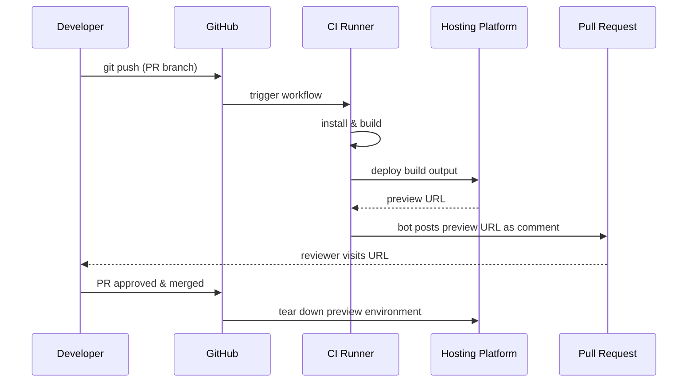

# Preview Deployments & Branch Environments

## Context

A preview deployment is a live, running version of your application built from a specific branch or pull request, accessible at a unique URL. Unlike a screenshot or a video walkthrough, a preview deployment is the exact artifact that would ship if the PR were merged — same build, same assets, same JavaScript bundle, same API integration. Anyone with the link can interact with the real application without installing anything locally.

The model is straightforward: every push to a PR branch triggers a CI build. Once the build succeeds, the built output is deployed to a temporary environment. A bot posts the URL into the PR comment thread. The reviewer clicks the link, sees the application running, and can approve or request changes based on firsthand interaction rather than inference from code diffs.

This workflow has become the standard for frontend teams using Vercel, Netlify, and Cloudflare Pages. All three platforms implement it automatically once the repository is connected — no additional CI configuration required. For teams not on those platforms, the same workflow can be replicated using GitHub Actions with custom deploy steps and a PR comment bot.

**The key properties of a preview deployment:**

- **Unique URL per branch or PR** — typically a subdomain or path derived from the branch name or PR number, such as `feature-checkout--myapp.vercel.app` or `deploy-preview-42--myapp.netlify.app`
- **Automatically created on push** — no manual trigger required; the deployment starts when a push is detected
- **Ephemeral** — the environment exists only for the lifetime of the PR; it is automatically torn down when the PR is merged or closed
- **Isolated** — each PR has its own independent deployment, not shared with other PRs or with staging

Preview deployments are distinct from staging environments. Staging is a shared, persistent environment that tracks a long-lived branch (usually `main` or `develop`). Staging reflects the current state of the integration branch. A preview deployment reflects the current state of a single PR branch, in isolation, without influence from other in-flight changes.

---

## Principle

> **SHOULD** use preview deployments for all PRs that affect UI — stakeholders, designers, and QA should be able to review the real build at a real URL, not a screenshot or a local setup instruction.

> **SHOULD NOT** hardcode API base URLs in frontend code — use environment variables so preview deployments can target the correct API endpoint without source code changes.

---

## Design Thinking

### Why preview deployments changed frontend review culture

Before preview deployments became standard, UI review on a pull request meant one of three things: the reviewer ran the branch locally, the author posted screenshots in the PR description, or the reviewer trusted the code diff to infer the visual result. All three approaches have significant failure modes.

Running locally requires the reviewer to have the project set up, the right Node version, the right environment variables, and enough context to navigate to the relevant part of the application. For a designer reviewing typography or a product manager checking a flow, this is an unreasonable prerequisite. Screenshots are static — they cannot capture hover states, transitions, responsive behavior, or interaction flows. Inferring visual results from code diffs requires the reviewer to mentally simulate the rendering engine, which is unreliable for anyone and impossible for non-engineers.

A preview deployment removes all three failure modes with a single URL. The designer opens the link. The QA engineer runs through the flow. The product manager checks the copy. The stakeholder confirms the behavior before merge. All of this happens on the exact artifact that will be deployed, not an approximation.

The cultural shift is significant: it moves sign-off from code review to product review. A PR can have clean code and broken UX. Preview deployments surface broken UX to people who can recognize it, at the exact point in the development cycle when fixing it costs the least.

### Why ephemeral environments require URL-agnostic configuration

A preview deployment has a different URL than production. It also has a different URL than staging. If your frontend code contains a hardcoded API base URL — for example, `const API_BASE = 'https://api.myapp.com'` — that URL does not automatically update when the application is deployed to a preview environment. The preview deployment calls the production API. In some cases this is acceptable; in many cases it is not, because the PR under review might change the API contract, and testing against the old production API will not catch the regression.

The correct model is URL-agnostic configuration via environment variables. The frontend reads `import.meta.env.VITE_API_URL` (for Vite) or `process.env.NEXT_PUBLIC_API_URL` (for Next.js). Vercel and Netlify both support environment variable overrides per deployment context — production, preview, and branch-specific. The preview context gets a preview API URL; production gets the production API URL. The same code is deployed to both; only the environment variable differs.

This design extends to other configuration that varies by environment: analytics tracking IDs, feature flag service endpoints, OAuth redirect URIs, CDN origins, and third-party service keys. Each of these should be an environment variable rather than a compile-time constant. The rule is simple: if the value differs between production and preview, it must be an environment variable.

Hardcoded values are not just an inconvenience — they create security and correctness risks. A hardcoded OAuth redirect URI will reject the preview domain. A hardcoded analytics ID will pollute production analytics with preview traffic. A hardcoded API URL may bypass preview-specific middleware or stub responses that the PR is designed to test.

### Why preview is different from staging

Staging is a shared environment. Every developer's merged work goes there. If two developers are testing conflicting changes, staging reflects whatever was merged last. Staging is useful for integration testing — verifying that multiple changes work together — but it is a poor venue for isolated PR review because the environment is not controlled.

A preview deployment is isolated. It contains exactly the changes from one PR branch, built against the base branch at the time of merge. No other in-flight PR contaminates the environment. When QA signs off on a preview deployment, they are signing off on the exact set of changes in that PR, not a composite of whatever happened to be on staging at review time.

The ephemeral nature is also a feature, not just a cost-saving measure. Every PR gets a fresh environment with no accumulated state from previous reviews. If a previous reviewer left application state that masked a bug, the next reviewer will not inherit that state. Ephemeral environments are clean by construction.

### Why preview deployments have a cost tradeoff

Vercel, Netlify, and Cloudflare Pages all offer preview deployments on free tiers, but with important restrictions for team and organizational accounts. Vercel's free tier covers personal accounts; team accounts require a paid plan for concurrent builds and preview deployments on private repositories. Netlify's free tier covers 300 build minutes per month — a small team with active PRs can exhaust this quickly.

The cost model shifts for teams with high PR velocity. A team merging 20 PRs per day with 5-minute build times consumes 100 build minutes per day — well above Netlify's free monthly allotment in a single day. For such teams, the choice is between paying for the managed platform or self-hosting the preview deployment workflow on GitHub Actions with your own infrastructure.

The GitHub Actions approach requires more setup: a deploy action that ships the build output to a hosting target (S3, Cloudflare R2, a custom server), a mechanism to generate and track preview URLs, and a PR comment bot to post the URL. The operational overhead is real, but for high-velocity teams, the cost savings can justify it.

---

## Visual

Preview deployment flow from push to merge:



---

## Example

### 1. Vercel preview deployments (`vercel.json`)

Vercel requires no workflow configuration for preview deployments when the repository is connected to the Vercel dashboard. Every push to a non-production branch automatically creates a preview. The `vercel.json` file controls build and routing behavior:

```json
{
  "buildCommand": "pnpm build",
  "outputDirectory": "dist",
  "installCommand": "pnpm install --frozen-lockfile",
  "framework": "vite",
  "headers": [
    {
      "source": "/assets/(.*)",
      "headers": [
        {
          "key": "Cache-Control",
          "value": "public, max-age=31536000, immutable"
        }
      ]
    }
  ],
  "rewrites": [
    {
      "source": "/(.*)",
      "destination": "/index.html"
    }
  ]
}
```

Vercel injects `VERCEL_ENV` into every deployment: `"production"` for the production deployment, `"preview"` for all preview deployments, and `"development"` for local dev via the Vercel CLI. Use this to branch behavior at runtime when needed.

Environment variables per deployment context are set in the Vercel dashboard under **Project Settings → Environment Variables**. Each variable can be scoped to Production, Preview, or Development. For example:

| Variable | Production | Preview |
|---|---|---|
| `VITE_API_URL` | `https://api.myapp.com` | `https://api-staging.myapp.com` |
| `VITE_ANALYTICS_ID` | `G-PROD-XXXX` | `G-DEV-XXXX` |
| `VITE_FEATURE_FLAGS_URL` | `https://flags.myapp.com/prod` | `https://flags.myapp.com/dev` |

### 2. Netlify deploy previews (`netlify.toml`)

Netlify's equivalent of `vercel.json` is `netlify.toml`. Deploy previews are enabled by default once the repository is connected. The `[context.deploy-preview]` block overrides settings specifically for preview deployments:

```toml
[build]
  command = "pnpm build"
  publish = "dist"

[build.environment]
  NODE_VERSION = "20"
  PNPM_VERSION = "9"

# Production context: runs on the production branch (main)
[context.production]
  command = "pnpm build"

  [context.production.environment]
    VITE_API_URL = "https://api.myapp.com"
    VITE_ANALYTICS_ID = "G-PROD-XXXX"

# Deploy preview context: runs on every pull request
[context.deploy-preview]
  command = "pnpm build"

  [context.deploy-preview.environment]
    VITE_API_URL = "https://api-staging.myapp.com"
    VITE_ANALYTICS_ID = "G-DEV-XXXX"

# Branch deploy context: runs on specific named branches
[context.staging]
  command = "pnpm build"

  [context.staging.environment]
    VITE_API_URL = "https://api-staging.myapp.com"

[[redirects]]
  from = "/*"
  to = "/index.html"
  status = 200
```

Netlify injects `CONTEXT` into each build: `"production"`, `"deploy-preview"`, `"branch-deploy"`. The `DEPLOY_URL` variable contains the unique URL for the current deploy — useful if you need to embed the preview URL in the build output (for example, in a `robots.txt` that disallows indexing of preview sites).

To prevent preview sites from being indexed by search engines, add a `robots.txt` rule specific to preview contexts:

```toml
# netlify.toml
[[headers]]
  for = "/robots.txt"
  [headers.values]
    # In preview context, CONTEXT != "production"
    # Netlify supports conditional headers via edge functions;
    # for simplicity, disallow all in preview via a static file
    # placed at public/robots.txt with content:
    # User-agent: *
    # Disallow: /
```

### 3. GitHub Actions PR comment bot (self-hosted preview deployments)

For teams not using Vercel or Netlify, this workflow builds the project, deploys it to a hosting target, and posts the preview URL as a PR comment. This example deploys to Cloudflare Pages using the Wrangler CLI:

```yaml
# .github/workflows/preview.yml
name: Preview Deployment

on:
  pull_request:
    types: [opened, synchronize, reopened]

concurrency:
  group: preview-${{ github.ref }}
  cancel-in-progress: true

jobs:
  deploy-preview:
    name: Deploy Preview
    runs-on: ubuntu-latest
    permissions:
      contents: read
      pull-requests: write   # required to post PR comments

    steps:
      - uses: actions/checkout@v4

      - uses: pnpm/action-setup@v3
        with:
          version: 9

      - uses: actions/setup-node@v4
        with:
          node-version: 20
          cache: pnpm

      - run: pnpm install --frozen-lockfile

      - name: Build
        run: pnpm build
        env:
          VITE_API_URL: ${{ vars.PREVIEW_API_URL }}
          VITE_ANALYTICS_ID: ${{ vars.DEV_ANALYTICS_ID }}

      - name: Deploy to Cloudflare Pages
        id: deploy
        uses: cloudflare/wrangler-action@v3
        with:
          apiToken: ${{ secrets.CLOUDFLARE_API_TOKEN }}
          accountId: ${{ secrets.CLOUDFLARE_ACCOUNT_ID }}
          command: pages deploy dist --project-name=myapp --branch=${{ github.head_ref }}

      - name: Post preview URL to PR
        uses: actions/github-script@v7
        with:
          script: |
            const deployUrl = '${{ steps.deploy.outputs.deployment-url }}';
            const prNumber = context.issue.number;
            const sha = context.sha.substring(0, 7);

            // Find existing preview comment to update rather than creating duplicates
            const { data: comments } = await github.rest.issues.listComments({
              owner: context.repo.owner,
              repo: context.repo.repo,
              issue_number: prNumber,
            });

            const botComment = comments.find(c =>
              c.user.type === 'Bot' && c.body.includes('Preview Deployment')
            );

            const body = [
              '## Preview Deployment',
              '',
              `**URL:** ${deployUrl}`,
              `**Commit:** ${sha}`,
              `**Status:** Ready`,
              '',
              '_This comment is updated automatically on each push._',
            ].join('\n');

            if (botComment) {
              await github.rest.issues.updateComment({
                owner: context.repo.owner,
                repo: context.repo.repo,
                comment_id: botComment.id,
                body,
              });
            } else {
              await github.rest.issues.createComment({
                owner: context.repo.owner,
                repo: context.repo.repo,
                issue_number: prNumber,
                body,
              });
            }
```

The `actions/github-script` step checks for an existing bot comment before creating a new one. On subsequent pushes to the same PR, the comment is updated in place rather than creating a new comment per push. This keeps the PR comment thread clean.

### 4. Environment variable setup for preview vs production

In a Vite project, environment variables are scoped by `.env` files. For preview deployments on managed platforms (Vercel, Netlify), set variables through the platform dashboard. For local development and self-hosted CI, use `.env` files:

```
# .env                      — loaded in all environments
VITE_APP_NAME=MyApp

# .env.production           — loaded only in `vite build` (production)
VITE_API_URL=https://api.myapp.com
VITE_ANALYTICS_ID=G-PROD-XXXX

# .env.development          — loaded only in `vite dev`
VITE_API_URL=http://localhost:3001
VITE_ANALYTICS_ID=G-DEV-XXXX
```

For preview-specific values in CI, pass them as workflow environment variables or repository variables (not secrets, since API URLs are not sensitive):

```yaml
- name: Build
  run: pnpm build
  env:
    # VITE_ prefix makes the variable available in browser code
    VITE_API_URL: ${{ vars.PREVIEW_API_URL }}
    VITE_ENV_NAME: preview
```

Access in application code:

```typescript
// src/config.ts
export const config = {
  apiUrl: import.meta.env.VITE_API_URL,
  analyticsId: import.meta.env.VITE_ANALYTICS_ID,
  isPreview: import.meta.env.VITE_ENV_NAME === 'preview',
} as const;
```

### 5. Preview-specific feature flags

Feature flags can be toggled differently in preview environments, enabling features under development to be visible to reviewers without enabling them in production.

```typescript
// src/features/flags.ts
const isPreviewEnvironment = (): boolean => {
  // Vercel injects VITE_VERCEL_ENV at build time
  if (import.meta.env.VITE_VERCEL_ENV === 'preview') return true;

  // Netlify injects VITE_CONTEXT at build time
  if (import.meta.env.VITE_CONTEXT === 'deploy-preview') return true;

  // Manual flag set in CI for self-hosted previews
  if (import.meta.env.VITE_ENV_NAME === 'preview') return true;

  return false;
};

export const featureFlags = {
  // Always enabled in preview; gated by flag service in production
  newCheckoutFlow: isPreviewEnvironment() || getRemoteFlag('new-checkout-flow'),

  // Only for internal previews — never show in production
  debugOverlay: isPreviewEnvironment(),

  // Controlled by feature flag service in all environments
  darkMode: getRemoteFlag('dark-mode'),
} as const;
```

To expose Vercel's environment to the Vite build, prefix `VERCEL_ENV` manually in the build command or use Vercel's automatic injection. Note that Vercel injects `VERCEL_ENV` but not `VITE_VERCEL_ENV` — you must map the variable in your configuration:

```toml
# vercel.json — map Vercel system variables to VITE_ prefix
# Set in Project Settings → Environment Variables:
# VITE_VERCEL_ENV = preview  (scoped to Preview context)
# VITE_VERCEL_ENV = production  (scoped to Production context)
```

For Netlify, set `VITE_CONTEXT` to `$CONTEXT` in the `netlify.toml` environment block — Netlify expands `$CONTEXT` to the current deployment context (`production`, `deploy-preview`, etc.).

---

## Common Mistakes

**Hardcoding the API base URL.** The most common configuration mistake in preview deployments. If `VITE_API_URL` is not an environment variable, every preview environment calls the same hardcoded endpoint — usually production. This means previews testing API contract changes will pass against the old contract, and reviews will not catch the regression.

**Not updating the PR comment on subsequent pushes.** A naive GitHub Actions bot creates a new comment on every push. After a PR with 10 force-pushes, the comment thread is cluttered with 10 preview URLs, only one of which is current. Always check for an existing bot comment and update it in place.

**Conflating preview with staging.** Staging is for integration; preview is for isolation. Routing all PR reviews through staging defeats the isolation property — if two PRs are being reviewed simultaneously, the staging environment reflects whichever was merged last, not either PR in isolation. Use preview deployments for PR review; use staging for integration testing.

**Forgetting to tear down preview environments.** On self-hosted setups, preview environments do not automatically clean up. If deployments accumulate without a teardown workflow, hosting costs and namespace pollution grow over time. Add a workflow triggered on `pull_request` with `types: [closed]` to delete the deployment when the PR closes:

```yaml
on:
  pull_request:
    types: [closed]

jobs:
  cleanup:
    runs-on: ubuntu-latest
    steps:
      - name: Delete preview deployment
        run: |
          # Example: delete Cloudflare Pages deployment by branch name
          curl -X DELETE \
            -H "Authorization: Bearer ${{ secrets.CLOUDFLARE_API_TOKEN }}" \
            "https://api.cloudflare.com/client/v4/accounts/${{ secrets.CLOUDFLARE_ACCOUNT_ID }}/pages/projects/myapp/deployments/${{ github.head_ref }}"
```

**Not disabling search engine indexing on preview URLs.** Preview deployments are publicly accessible by URL. Search engines will index them if you do not add a `noindex` header or `robots.txt` disallow. This pollutes search results with development builds. Add `X-Robots-Tag: noindex` as a response header for all preview deployments.

**OAuth redirect URI mismatch.** If your application uses OAuth, the OAuth provider's allowed redirect URI list must include the preview URL domain. Vercel preview URLs are deterministic by branch name — add `*.vercel.app` as an allowed redirect origin in your OAuth provider dashboard. Netlify preview URLs include the deploy ID and are not predictable by branch name; use `*.netlify.app` as a wildcard.

**Using secrets in preview environments without scoping.** Preview deployments are triggered by pull requests, including PRs from forks. GitHub does not expose secrets to workflows triggered by fork PRs by default — this is a security feature. If your preview workflow requires secrets (API tokens, service credentials), ensure you are using `pull_request_target` with appropriate precautions, or use environment-level secrets with required reviewers to gate access.

---

## Related FEEs

- [FEE-1500 CI/CD & Deployment Overview](1500.md)
- [FEE-1501 GitHub Actions for Frontend](1501.md)
- [FEE-1504 Production Deployment Strategies](1504.md)
- [FEE-806 Environment Variables and Configuration](../Build%20Tooling%20and%20Module%20Systems/806.md)

---

## References

- [Vercel — Preview Deployments](https://vercel.com/docs/deployments/preview-deployments)
- [Netlify — Deploy Previews](https://docs.netlify.com/site-deploys/deploy-previews/)
- [Cloudflare Pages — Branch deployments and preview aliases](https://developers.cloudflare.com/pages/configuration/branch-build-controls/)
- [GitHub Actions — Creating or updating a comment (actions/github-script)](https://github.com/actions/github-script)
- [Vite — Env Variables and Modes](https://vitejs.dev/guide/env-and-mode)
