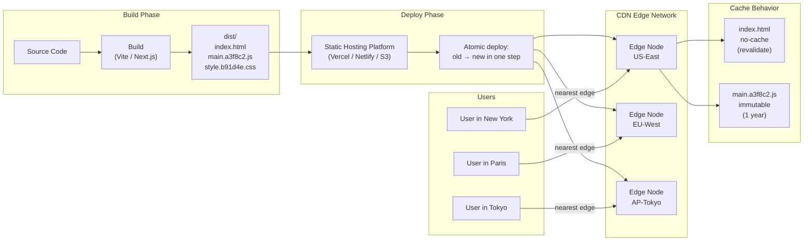

# Production Deployment: Static Hosting & CDN

## Context

Modern frontend applications are built into a set of static files — HTML, JavaScript bundles, CSS, images, fonts — that have no runtime server-side rendering requirement. Once built, these files are inert: they do not change until the next deployment. This property enables a deployment model that is fundamentally different from traditional server-based deployments.

The model works in three steps: run the build, upload the output to a CDN, serve the files globally from CDN edge nodes. There is no application server to provision, no process to keep alive, no autoscaling group to configure. The infrastructure concern collapses to a single question: how do these files get to the edge?

This architecture delivers performance characteristics that are difficult or impossible to achieve with server-based deployments. CDN edge nodes are distributed worldwide — typically hundreds of locations. A user in Tokyo hits a Tokyo edge node; a user in São Paulo hits a São Paulo edge node. The round-trip time from user to content is measured in single-digit milliseconds. There is no server cold start, no connection pool to exhaust, and no vertical scaling ceiling. A static CDN deployment can serve millions of concurrent users with the same latency profile as it serves one.

The tradeoff is that this model only works for content that does not require server-side computation per request. For most frontend applications — SPAs, statically generated sites, documentation sites, marketing pages — this is not a tradeoff at all. The build output is fully static. The API calls are made client-side against separate API servers. The hosting layer has nothing to compute.

**The deployment pipeline:**

1. Developer pushes code to the main branch
2. CI runs linting, testing, and the production build
3. The build produces a `dist/` directory of static files
4. The CI pipeline uploads the `dist/` contents to a CDN or static hosting platform
5. The CDN distributes the files to edge nodes worldwide
6. Users request the application; the nearest edge node responds

This pipeline is repeatable, auditable, and fast. Typical deployment times from merge to live are under two minutes for most projects.

**Platform landscape:**

The modern static hosting market has consolidated around a small number of platforms that implement this pipeline with zero or near-zero configuration:

- **Vercel** — originated as the deployment platform for Next.js; supports any framework with zero-config detection; edge network with strong performance; built-in preview deployments and serverless functions; generous free tier
- **Netlify** — comparable to Vercel in features; pioneered preview deployments; strong for SSG frameworks; Netlify Functions and Edge Functions available; widely used in the JAMstack ecosystem
- **Cloudflare Pages** — backed by Cloudflare's global network (one of the largest); Workers integration for edge compute; unlimited free bandwidth; growing framework support
- **AWS S3 + CloudFront** — S3 for file storage, CloudFront as the CDN layer; maximum control over every configuration parameter; requires significant AWS expertise and manual setup; preferred when the team already operates AWS infrastructure at scale
- **GitHub Pages** — free, tightly integrated with GitHub repositories; limited to public repositories on the free tier; no custom cache headers; best for open-source project documentation

---

## Principle

> **SHOULD** set `Cache-Control: no-cache` on HTML entry points (such as `index.html`) so that browsers always revalidate with the origin before serving a cached copy. This ensures users receive the latest deployment.

> **SHOULD** set `Cache-Control: max-age=31536000, immutable` on hashed static assets (JavaScript bundles, CSS files, images with content hashes in their filenames) so that browsers and CDN edge nodes cache them indefinitely without revalidation. Hashed filenames guarantee uniqueness; if the content changes, the filename changes, and the old cache entry is never requested again.

> **SHOULD** use platforms that provide atomic deployment guarantees — all files in a deployment are promoted simultaneously, so users never encounter a state where some requests are served from the old deployment and others from the new.

---

## Design Thinking

### Why the static CDN model is fast

The performance of a CDN-hosted static site comes from three compounding factors: geographic proximity, eliminated server-side latency, and infinite horizontal scale.

**Geographic proximity.** A CDN edge node is a point of presence (PoP) located as close as possible to end users. Major CDN providers — Cloudflare, Fastly, AWS CloudFront, Vercel's Edge Network — operate hundreds of PoPs worldwide. When a user requests `index.html`, the request travels to the nearest PoP rather than to a central origin server. For users far from traditional data center regions (US East Coast, EU West), this can reduce time-to-first-byte by hundreds of milliseconds.

**Eliminated server-side latency.** A traditional server-rendered application must execute code on every request: read session data, query a database, render HTML, serialize the response. Each of these steps adds latency. For a static CDN response, none of this happens. The edge node reads a file from a local cache (or fetches it from origin once and caches it for all subsequent requests) and streams it to the user. The response time is bounded by network latency, not compute latency.

**Infinite horizontal scale.** A CDN is inherently distributed. Adding more users does not increase load on any single server; it distributes load across all edge nodes. There is no autoscaling delay, no warm-up period, no thundering herd problem. A site that receives 100 requests per day and a site that receives 100 million requests per day have identical infrastructure complexity at the hosting layer.

### Why atomic deployments matter

A deployment is a transition from one set of files to another. Without atomicity guarantees, this transition is not instantaneous — it takes time to upload and propagate files. During that window, some files are from the old deployment and some are from the new. A user who loads `index.html` from the new deployment may fetch JavaScript chunks from the old deployment, because the CDN edge nodes have not yet received the new chunks. The result is a broken application — missing modules, mismatched API contracts, runtime errors.

Atomic deployments solve this by ensuring that the transition is all-or-nothing. The platform receives the new deployment as a unit, stores it completely, and then switches routing to the new deployment in a single step. Before the switch, all users see the old deployment. After the switch, all users see the new deployment. There is no partial state.

This also makes rollback trivial. Rolling back is simply switching routing back to a previous deployment unit — another atomic operation. The previous deployment files are still stored; nothing needs to be rebuilt.

Vercel, Netlify, and Cloudflare Pages all implement atomic deployments. AWS S3 does not — files are uploaded and become immediately accessible as they arrive, which requires additional strategies (such as deploying to a separate S3 prefix and switching a CloudFront origin on completion) to achieve atomicity.

### Why cache headers for HTML and assets must differ

Content hashing is the mechanism that makes long-term asset caching safe. When a bundler (Vite, webpack, Rollup) builds the application, it generates filenames that include a hash of the file content — for example, `main.a3f8c2.js`. If the content of `main.js` changes, the hash changes, and the bundler outputs `main.d91b4f.js`. The old URL (`main.a3f8c2.js`) and the new URL (`main.d91b4f.js`) are different resources. A browser that cached the old file and a browser that never saw it both fetch the new file when the new HTML references it.

Because the URL changes when the content changes, the cache can be treated as permanent: `Cache-Control: max-age=31536000, immutable`. A cached response for `main.a3f8c2.js` will never become stale, because if the file were updated, it would have a different URL.

`index.html` is different. `index.html` always has the same URL. It is the entry point. If it is cached aggressively, users with a cached `index.html` will continue loading old JavaScript and CSS bundles even after a new deployment. `Cache-Control: no-cache` does not mean "never cache" — it means "check with the origin before serving the cached copy." The browser sends a conditional request (using `ETag` or `Last-Modified`); if the server responds with 304 Not Modified, the browser uses the cached copy without re-downloading it. If the file has changed, the browser downloads the new version. The result is always-fresh HTML with minimal network overhead when nothing has changed.

The asymmetry is intentional: `index.html` is the source of truth for which asset URLs to load. If `index.html` is fresh, the asset URLs in it are also fresh. Because the asset URLs are hashed, fetching them is either a cache hit (fast) or a cache miss on a new URL (correct).

### Why managed platforms beat raw S3 for most teams

AWS S3 + CloudFront is the most configurable option, but configuration has a cost. Setting up a production-grade S3 + CloudFront deployment requires: creating and configuring an S3 bucket with appropriate public access settings, creating a CloudFront distribution, configuring origin access control, setting up a custom domain in Route 53, provisioning an ACM certificate, configuring cache behaviors per path pattern, setting up cache invalidation on deploy, and writing or adapting CI/CD pipeline steps for all of the above. Each of these steps is an opportunity for misconfiguration.

Vercel and Netlify reduce this to connecting a repository and clicking deploy. Cache headers, HTTPS, custom domains, preview deployments, and atomic deployment semantics are all provided out of the box with sensible defaults. The engineering cost is near zero.

For most teams, the marginal value of full S3/CloudFront control does not justify the operational overhead. The cases where it does: the team already operates extensive AWS infrastructure and wants to centralize, compliance requirements mandate specific data residency or audit controls, or the application has unusual CDN behavior requirements (custom Lambda@Edge logic, signed URLs, geographic restrictions) that managed platforms do not expose.

---

## Visual

The following diagram shows the complete flow from local development to a user receiving cached assets at a CDN edge node.



---

## Example

### Platform comparison table

| Platform | Atomic deploys | Custom cache headers | Free bandwidth | Setup complexity | Best for |
|---|---|---|---|---|---|
| **Vercel** | Yes | Yes (`vercel.json`) | 100 GB/mo | Near-zero | Next.js, React, any framework |
| **Netlify** | Yes | Yes (`netlify.toml`) | 100 GB/mo | Near-zero | Gatsby, Nuxt, Hugo, any framework |
| **Cloudflare Pages** | Yes | Yes (`_headers`) | Unlimited | Near-zero | High-traffic, Workers integration |
| **AWS S3 + CloudFront** | No (manual) | Yes (full control) | Pay per GB | High | AWS-native teams, compliance |
| **GitHub Pages** | Partial | No custom headers | Unlimited (public) | Low | OSS docs, simple sites |

### Vercel: cache header configuration

```json
{
  "headers": [
    {
      "source": "/index.html",
      "headers": [
        {
          "key": "Cache-Control",
          "value": "no-cache"
        }
      ]
    },
    {
      "source": "/(.*)\\.js",
      "headers": [
        {
          "key": "Cache-Control",
          "value": "public, max-age=31536000, immutable"
        }
      ]
    },
    {
      "source": "/(.*)\\.css",
      "headers": [
        {
          "key": "Cache-Control",
          "value": "public, max-age=31536000, immutable"
        }
      ]
    },
    {
      "source": "/assets/(.*)",
      "headers": [
        {
          "key": "Cache-Control",
          "value": "public, max-age=31536000, immutable"
        }
      ]
    }
  ]
}
```

The `index.html` rule uses `no-cache` (always revalidate). The JavaScript, CSS, and assets rules use `max-age=31536000, immutable` because those files are content-hashed.

### Netlify: cache header configuration

```toml
# netlify.toml

[[headers]]
  for = "/index.html"
  [headers.values]
    Cache-Control = "no-cache"

[[headers]]
  for = "/*.js"
  [headers.values]
    Cache-Control = "public, max-age=31536000, immutable"

[[headers]]
  for = "/*.css"
  [headers.values]
    Cache-Control = "public, max-age=31536000, immutable"

[[headers]]
  for = "/assets/*"
  [headers.values]
    Cache-Control = "public, max-age=31536000, immutable"
```

Netlify applies headers in order; more specific patterns take precedence. Place the `index.html` rule before broad glob patterns.

### Cloudflare Pages: `_headers` file

Place a `_headers` file in the root of your `dist/` output directory (or configure your build tool to emit it there):

```
/index.html
  Cache-Control: no-cache

/*.js
  Cache-Control: public, max-age=31536000, immutable

/*.css
  Cache-Control: public, max-age=31536000, immutable

/assets/*
  Cache-Control: public, max-age=31536000, immutable
```

Cloudflare Pages reads this file during deployment and applies the headers at the edge. No dashboard configuration required.

### AWS S3 + CloudFront: GitHub Actions deployment workflow

The following workflow deploys the `dist/` output to S3 and then invalidates the CloudFront cache for `index.html`. Hashed assets do not need invalidation because their URLs change on each build.

```yaml
# .github/workflows/deploy.yml
name: Deploy to S3 + CloudFront

on:
  push:
    branches: [main]

jobs:
  deploy:
    runs-on: ubuntu-latest
    steps:
      - uses: actions/checkout@v4

      - uses: actions/setup-node@v4
        with:
          node-version: '20'

      - name: Install dependencies
        run: npm ci

      - name: Build
        run: npm run build
        env:
          NODE_ENV: production

      - name: Configure AWS credentials
        uses: aws-actions/configure-aws-credentials@v4
        with:
          aws-access-key-id: ${{ secrets.AWS_ACCESS_KEY_ID }}
          aws-secret-access-key: ${{ secrets.AWS_SECRET_ACCESS_KEY }}
          aws-region: us-east-1

      - name: Upload hashed assets (long cache)
        run: |
          aws s3 sync dist/assets/ s3://${{ secrets.S3_BUCKET }}/assets/ \
            --cache-control "public, max-age=31536000, immutable" \
            --delete

      - name: Upload JS and CSS (long cache)
        run: |
          aws s3 sync dist/ s3://${{ secrets.S3_BUCKET }}/ \
            --exclude "index.html" \
            --exclude "assets/*" \
            --cache-control "public, max-age=31536000, immutable" \
            --delete

      - name: Upload index.html (no-cache)
        run: |
          aws s3 cp dist/index.html s3://${{ secrets.S3_BUCKET }}/index.html \
            --cache-control "no-cache" \
            --content-type "text/html"

      - name: Invalidate CloudFront cache for index.html
        run: |
          aws cloudfront create-invalidation \
            --distribution-id ${{ secrets.CLOUDFRONT_DISTRIBUTION_ID }} \
            --paths "/index.html"
```

Note: upload order matters. Upload hashed assets before `index.html` so that if a user requests `index.html` immediately after it becomes live, all referenced assets are already available.

### Rollback

**Vercel:**
```bash
# List recent deployments
vercel ls

# Promote a previous deployment to production
vercel promote <deployment-url>
```

**Netlify:**
```bash
# List deploys via Netlify CLI
netlify deploy --site <site-id> --list

# Or via dashboard: Site > Deploys > select a previous deploy > "Publish deploy"
# CLI alternative using the API:
netlify api publishDeploy --data '{"deploy_id":"<deploy-id>"}'
```

**Cloudflare Pages:**
```bash
# Via Wrangler CLI
wrangler pages deployment list --project-name <project-name>

# Roll back to a previous deployment
wrangler pages deployment rollback <deployment-id> --project-name <project-name>
```

**AWS S3 + CloudFront (manual atomic rollback strategy):**
```bash
# If you maintain versioned S3 prefixes (e.g. /deploy/v42/ and /deploy/v43/)
# Update the CloudFront origin path to point to the previous prefix
aws cloudfront update-distribution \
  --id $DISTRIBUTION_ID \
  --distribution-config file://previous-config.json

# Invalidate index.html after switching origin
aws cloudfront create-invalidation \
  --distribution-id $DISTRIBUTION_ID \
  --paths "/index.html"
```

---

## Common Mistakes

**Caching `index.html` aggressively.**
Setting `max-age=31536000` on `index.html` means users with a cached copy will not see new deployments until their cache expires — up to a year later. Always use `no-cache` for HTML entry points.

**Not using content hashing on assets.**
Without content hashes in filenames, you cannot safely use long TTLs on assets. If you set `max-age=31536000` on `main.js` (without a hash), updating `main.js` does not change the URL, and users with the old file cached will never fetch the new one. Use a bundler that enables content hashing (Vite does this by default; ensure it is not disabled).

**Uploading files in the wrong order on S3.**
If you upload `index.html` before hashed assets are in place, there is a window where users can receive the new HTML but cannot fetch the new JavaScript (because the hashed bundle does not yet exist on S3). Always upload hashed assets first, then `index.html` last.

**Assuming S3 sync is atomic.**
`aws s3 sync` uploads files incrementally as they are processed. During the sync, the bucket is in a partially-updated state. For true atomicity with S3, maintain versioned deploy directories and switch the CloudFront origin path or use a Lambda@Edge redirect, rather than syncing in place.

**Forgetting to invalidate CloudFront after deploying new `index.html`.**
CloudFront caches responses at the edge. If you upload a new `index.html` to S3 but do not invalidate the CloudFront edge caches, users will continue to receive the cached old version until the TTL expires. Invalidations for `index.html` are essential on every S3+CloudFront deployment.

**Using GitHub Pages for applications that need custom cache headers.**
GitHub Pages does not support custom `Cache-Control` headers. All files are served with GitHub's default headers. For applications where cache strategy matters — which is most production SPAs — use a platform that exposes header configuration.

**Skipping HTTPS on custom domains.**
All major platforms (Vercel, Netlify, Cloudflare Pages) provision TLS certificates automatically for custom domains. There is no reason to serve a production application over HTTP. Beyond security, modern browser APIs (service workers, payment request, geolocation) require a secure context. Ensure HTTPS is active before going live.

---

## Related FEEs

- [FEE-1500: CI/CD Pipeline Overview](1500.md) — the full pipeline from commit to production; deployment is the final stage
- [FEE-1503: Preview Deployments & Branch Environments](1503.md) — how the same platforms provide per-PR preview deployments before merging to production
- [FEE-1505: Deployment Strategies](1505.md) — blue/green, canary, and feature flag strategies for zero-downtime production releases
- [FEE-807: Build Optimization & Content Hashing](../Build%20Tooling%20and%20Module%20Systems/807.md) — how bundlers generate content-hashed filenames, which is the prerequisite for immutable asset caching

---

## References

- MDN Web Docs — [Cache-Control](https://developer.mozilla.org/en-US/docs/Web/HTTP/Headers/Cache-Control): authoritative reference for all `Cache-Control` directives including `no-cache`, `immutable`, and `max-age`
- Vercel Documentation — [Cache Control Headers](https://vercel.com/docs/edge-network/headers): how Vercel's edge network applies and respects cache headers, and how to configure them via `vercel.json`
- Netlify Documentation — [Headers](https://docs.netlify.com/routing/headers/): configuring custom response headers in `netlify.toml`, including cache header recommendations for SPAs
- Cloudflare Pages Documentation — [Custom Headers](https://developers.cloudflare.com/pages/configuration/headers/): the `_headers` file format and how Cloudflare Pages applies custom headers at the edge
- AWS Documentation — [Hosting a Static Website on Amazon S3](https://docs.aws.amazon.com/AmazonS3/latest/userguide/WebsiteHosting.html) and [CloudFront Cache Invalidation](https://docs.aws.amazon.com/AmazonCloudFront/latest/DeveloperGuide/Invalidation.html): official references for the S3+CloudFront deployment pattern
- web.dev — [Love your cache](https://web.dev/articles/love-your-cache): Google's guide to cache strategies for web applications, covering the HTML/hashed-asset split
