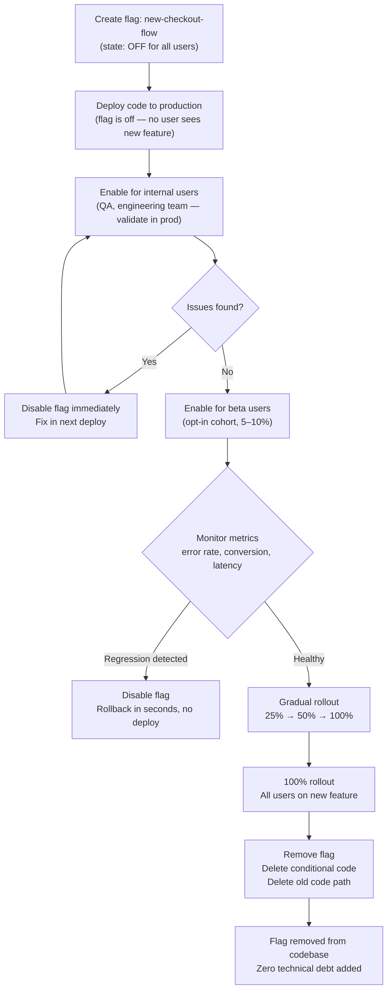

# Deployment Strategies: Canary, Blue-Green & Feature Flags

## Context

Deployment is the moment of maximum risk in the software development lifecycle. At the moment of deployment, untested-in-production code replaces proven-in-production code for every user simultaneously. If the new code has a bug — a performance regression, an API incompatibility, a browser-specific crash — every user hits it at once.

Traditional deployment strategy accepts this risk by making the deployment window as short as possible: push fast, monitor for a few minutes, roll back if something breaks. This works when the blast radius is bounded by fast detection and fast rollback. It fails when regressions are subtle, when they only appear under production load, or when rollback itself is slow or risky.

Modern deployment strategies reduce risk by reducing the blast radius at the moment of release. Instead of flipping a switch from 0% to 100%, they allow a controlled progression: new code reaches a small subset of users first, signals are observed, and the rollout expands only if those signals are healthy. If something breaks, only the small subset was affected, and the rollback affects equally few users.

Three strategies dominate modern frontend deployment:

- **Blue-green deployments** — two complete production environments run simultaneously; traffic switches from the old ("blue") to the new ("green") in a single atomic operation; rollback is switching back
- **Canary deployments** — new code is routed to a percentage of traffic (typically 1–5% initially), monitored for regressions, and the percentage is gradually increased to 100% or rolled back
- **Feature flags** — code is deployed to all users but disabled at runtime; features are enabled selectively by user segment, region, or cohort without any deployment

These strategies are not mutually exclusive. A mature deployment pipeline combines all three: use blue-green or canary for infrastructure-level traffic splitting, and use feature flags for application-level feature gating within the deployed code.

**The key mindset shift: deployed does not mean released.**

Deployment is a technical operation — moving code from a repository to a running server or CDN. Release is a business operation — making a feature visible and available to users. Traditional deployments couple these two operations. Feature flags decouple them completely: code can be deployed (in the repository, compiled into the bundle, running on the server) but not released (hidden behind a flag that is off for all users). This separation gives teams the ability to merge code continuously without exposing unfinished features, to release at business-driven timing rather than CI timing, and to disable a feature in seconds without any deployment at all.

**Where frontend fits:**

Frontend deployments are simpler than backend in one critical way: they are stateless. A frontend build artifact is a set of static files. Replacing those files replaces the application. There is no database migration, no session state, no long-running connection to drain. This means atomic swaps — the core mechanism of blue-green — are inherently easier to implement for frontend than for backend. CDN platforms like Vercel and Netlify implement blue-green by default: every deployment is an immutable artifact, and promotion to production is a single routing switch.

---

## Design Thinking

### Why blue-green is the natural model for frontend

Blue-green deployments work by maintaining two complete, identical production environments. At any given time, one environment ("blue") serves 100% of traffic. The new deployment is built and validated in the other environment ("green"). When the team is ready to release, traffic is switched from blue to green — atomically, in a single operation. If something goes wrong, switching back to blue is equally fast.

For frontend applications, this maps directly onto how CDN platforms already work. Vercel, Netlify, and Cloudflare Pages all maintain deployment artifacts indefinitely. Each push creates a new immutable artifact with a unique URL. Promoting to production is a pointer swap — the platform updates which artifact the production domain points to. This is blue-green at the platform level, without any additional configuration.

The practical implication: if your frontend is on Vercel or Netlify, you already have blue-green deployments. Rollback is `vercel promote` or clicking "Publish deploy" in the Netlify dashboard. The previous deployment artifact is still stored and healthy; nothing needs to be rebuilt.

This is fundamentally different from canary deployments, which require traffic-splitting infrastructure. CDN platforms that implement atomic deployments do not natively split traffic between two versions of a static site — they route all traffic to one version at a time. Blue-green is the default; canary requires additional work.

### Why canary requires infrastructure for frontend

Canary deployments route a percentage of traffic to the new version and the remainder to the old version simultaneously. For backend services, this is relatively straightforward: a load balancer or service mesh routes requests by weight. For frontend static files, it is more complex.

A user who loads `index.html` from the canary version must receive all subsequent resources (JavaScript, CSS) from the same version. Mixing versions breaks the application — the new JavaScript might reference assets that do not exist in the old deployment, or make API calls that assume a new backend contract. This means traffic splitting for frontend must be "sticky": once a user is assigned to the canary, all their requests for that session must go to the canary.

Implementing sticky canary for frontend requires one of:
- **Cloudflare Load Balancing** with session affinity — routes the same user to the same origin across requests
- **Nginx upstream weights** with `ip_hash` or sticky cookie — consistent routing by user identity
- **Edge middleware** (Vercel Edge Config, Cloudflare Workers) — intercepts requests at the edge and applies routing logic based on a cookie or header

The operational complexity is meaningful. For most frontend teams, feature flags are a more practical alternative for controlling exposure of new features to a subset of users, without the need for traffic-splitting infrastructure.

### Why feature flags are the most powerful risk management tool

A feature flag is a conditional in code:

```js
if (featureFlags.isEnabled('new-checkout-flow')) {
  return <NewCheckout />;
}
return <OldCheckout />;
```

This conditional is evaluated at runtime, not at deploy time. The flag's value — true or false — is fetched from an external service (LaunchDarkly, Unleash, GrowthBook, Flagsmith) or from a configuration store. Changing the flag's value from the dashboard takes effect immediately for new page loads, without any deployment.

This gives feature flags properties that no deployment strategy can match:

**Instantaneous disable.** If a bug is discovered in `new-checkout-flow`, the flag is turned off in the dashboard. Within seconds (or at most one page-load cycle), the old checkout flow is restored for all users. No deployment, no rollback, no CI run.

**Granular targeting.** Flags can be targeted by user ID, user cohort, plan tier, geographic region, device type, or any attribute in the evaluation context. This makes gradual rollout trivially configurable: enable for internal users first, then beta users, then 1% of production, then 10%, then 100% — each step configured in the dashboard without any code change.

**Separation of deployment from release.** Merge the code to main on Tuesday, deploy it Thursday, enable the flag for 10% of users on Friday after the marketing campaign launches, ramp to 100% over the following week. The technical and business timelines are fully independent.

**A/B testing integration.** Most feature flag platforms include experiment functionality: users are split into control and treatment groups, metrics are tracked, and the winning variant is selected based on data rather than intuition.

### Why flag debt is a real engineering problem

Feature flags solve the immediate risk of releasing new features. They create a longer-term problem: every flag is a branch in the code. A codebase with 50 active flags has 50 conditional branches that each represent a question: which path is correct, and when will the other path be removed?

Flags that are never cleaned up — because the feature launched successfully and everyone forgot about the flag — become permanent complexity. They block refactoring (you cannot simplify code that has two paths). They create confusion (new engineers do not know which path is active in production). They accumulate as technical debt.

The discipline is simple: set a removal date when the flag is created, and treat that date as a first-class task. Flag removal means: verify the feature is at 100% rollout, delete the flag from the platform, remove the conditional from the code, and delete the old code path.

### How rolling deploys fit in

Rolling deployments update instances progressively rather than all at once. For Kubernetes-based backends, this is the default: a `Deployment` object with a `RollingUpdate` strategy replaces pods one at a time, ensuring some percentage of healthy pods are always serving traffic.

For frontend, rolling deploys are less relevant because frontend deployments are file-based rather than instance-based. There is no pool of instances to drain and replace. The equivalent concept is the gradual percentage-based rollout in a canary deployment.

Rolling deploys become relevant for frontend when the application has a server-side rendering layer (Next.js on Vercel, Nuxt on a Node.js server) — in that case, the rendering server can be updated with a Kubernetes-style rolling strategy while the static layer (HTML shell) is updated atomically via CDN.

---

## Best Practices

**SHOULD use feature flags for high-risk features rather than deploying directly to all users.** A flag allows the feature to be disabled in seconds without any deployment, providing a safety net that rollback strategies cannot match in speed. Teams SHOULD merge high-risk changes behind a flag, validate in production with internal users, and ramp exposure gradually before reaching 100%.

**MUST set a removal date when creating a feature flag and treat it as a first-class engineering task.** A flag that outlives its purpose becomes a permanent conditional branch that blocks refactoring and confuses new engineers. Teams MUST schedule flag removal at creation time and enforce the deadline in CI with a debt-check script that fails the build when a flag's removal date has passed.

**MUST configure session affinity when implementing canary traffic splits for frontend.** A user whose request is routed to the canary version for `index.html` MUST receive all subsequent resources — JavaScript, CSS — from the same version. Mixing versions breaks the application because asset URLs and API contracts are not interchangeable between deployments. Always configure sticky sessions via a cookie or header when using Cloudflare Load Balancing, Nginx upstream weights, or edge middleware for canary routing.

**SHOULD always define a safe default value when evaluating a feature flag.** Feature flag SDKs fetch definitions from a remote service. If that service is unavailable, the SDK SHOULD fall back to a safe default rather than throwing an exception that crashes the application. Most SDKs accept the default as the second argument to the evaluation call — always supply it explicitly.

**SHOULD hydrate flag evaluation context from server to client in server-rendered applications to prevent version-mismatch flicker.** If the server renders using the flag's on state but the client re-evaluates the flag on mount and produces the off state, users see a flash of wrong content. Teams SHOULD hydrate the flag evaluation context from server to client so both renders produce the same result.

**SHOULD use the expand-contract migration pattern when blue-green deployments involve database schema changes.** Blue-green requires that the old and new application versions can both operate against the same database simultaneously. A migration that removes a column the old version reads will break rollback. Teams SHOULD add the new column (expand), deploy the new application version, then remove the old column (contract) only after the old version is fully retired.

---

## Visual

The following diagram shows the feature flag lifecycle from creation through full rollout and removal.



---

## Example

### 1. Feature flag usage in React with GrowthBook

GrowthBook is an open-source feature flag and A/B testing platform. It can be self-hosted or used via GrowthBook Cloud.

```tsx
// src/hooks/useFeatureFlag.ts
import { useFeatureIsOn } from '@growthbook/growthbook-react';

export function useFeatureFlag(flagKey: string): boolean {
  return useFeatureIsOn(flagKey);
}

// src/components/CheckoutPage.tsx
import { useFeatureFlag } from '../hooks/useFeatureFlag';
import { NewCheckout } from './NewCheckout';
import { OldCheckout } from './OldCheckout';

export function CheckoutPage() {
  const isNewCheckoutEnabled = useFeatureFlag('new-checkout-flow');

  return isNewCheckoutEnabled ? <NewCheckout /> : <OldCheckout />;
}

// src/main.tsx — GrowthBook provider setup
import { GrowthBook, GrowthBookProvider } from '@growthbook/growthbook-react';

const gb = new GrowthBook({
  apiHost: 'https://cdn.growthbook.io',
  clientKey: import.meta.env.VITE_GROWTHBOOK_CLIENT_KEY,
  enableDevMode: import.meta.env.DEV,
  trackingCallback: (experiment, result) => {
    // Send experiment exposure to your analytics tool
    analytics.track('Experiment Viewed', {
      experimentId: experiment.key,
      variationId: result.variationId,
    });
  },
});

// Load features from the GrowthBook CDN
await gb.loadFeatures();

// Set user attributes for targeting
gb.setAttributes({
  userId: currentUser.id,
  plan: currentUser.plan,            // 'free' | 'pro' | 'enterprise'
  country: currentUser.country,
  betaUser: currentUser.betaOptIn,
});

// Wrap the app
root.render(
  <GrowthBookProvider growthbook={gb}>
    <App />
  </GrowthBookProvider>
);
```

Flag configuration in GrowthBook dashboard (conceptual):
```json
{
  "key": "new-checkout-flow",
  "on": true,
  "rules": [
    {
      "condition": { "betaUser": true },
      "force": true
    },
    {
      "condition": { "plan": "enterprise" },
      "force": true
    },
    {
      "coverage": 0.10,
      "hashAttribute": "userId",
      "force": true
    }
  ]
}
```

This configuration enables the new checkout for all beta users, all enterprise plan users, and a stable 10% random sample of other users (sampled by `userId` so the same user always gets the same experience).

### 2. OpenFeature SDK — provider-agnostic feature flags

OpenFeature is an open standard for feature flag SDKs. The same application code works with any compatible provider (LaunchDarkly, Unleash, GrowthBook, Flagsmith, OpenFeature Cloud) without modification.

```ts
// src/featureFlags.ts
import {
  OpenFeature,
  InMemoryProvider,
  EvaluationContext,
} from '@openfeature/web-sdk';

// Register a provider. Swap this for any OpenFeature-compatible provider
// without changing application code.
//
// For production: use LaunchDarkly, Unleash, or Flagsmith provider.
// For tests: use InMemoryProvider with static flag values.
OpenFeature.setProvider(
  new InMemoryProvider({
    'new-checkout-flow': {
      defaultVariant: 'off',
      variants: { on: true, off: false },
      disabled: false,
    },
  })
);

// Set user context for flag evaluation
OpenFeature.setContext({
  targetingKey: currentUser.id,
  plan: currentUser.plan,
  betaUser: currentUser.betaOptIn,
} satisfies EvaluationContext);

// Usage in a component
import { useFlag } from '@openfeature/react-sdk';

export function CheckoutPage() {
  // evaluates 'new-checkout-flow' flag for current context
  const { value: isNewCheckout } = useFlag('new-checkout-flow', false);

  return isNewCheckout ? <NewCheckout /> : <OldCheckout />;
}
```

Switching to LaunchDarkly in production requires only changing the provider registration:

```ts
import { init } from 'launchdarkly-js-client-sdk';
import { LaunchDarklyClientSideProvider } from '@launchdarkly/openfeature-web-provider';

const ldClient = init(import.meta.env.VITE_LD_CLIENT_KEY, {
  kind: 'user',
  key: currentUser.id,
  plan: currentUser.plan,
  betaUser: currentUser.betaOptIn,
});
await ldClient.waitForInitialization(5); // 5-second timeout

OpenFeature.setProvider(new LaunchDarklyClientSideProvider(ldClient));
// All application code using OpenFeature hooks is unchanged.
```

### 3. Blue-green switch via Vercel CLI

On Vercel, every deployment is an immutable artifact with its own URL. Promoting a specific deployment to production is a single command.

```bash
# List recent deployments with their URLs and status
vercel ls --scope my-team

# Output:
#   deployment-abc123.vercel.app   READY   2026-04-10 14:00 (current production)
#   deployment-def456.vercel.app   READY   2026-04-10 15:30 (new version)

# Promote the new deployment to production (blue-green switch)
vercel promote deployment-def456.vercel.app --scope my-team

# To roll back: promote the previous deployment
vercel promote deployment-abc123.vercel.app --scope my-team
```

On Netlify:
```bash
# List deploys
netlify api listSiteDeploys --data '{"site_id":"YOUR_SITE_ID"}'

# Publish (promote) a specific deploy
netlify api publishDeploy --data '{"deploy_id":"DEPLOY_ID"}'
```

On Cloudflare Pages:
```bash
# List deployments
wrangler pages deployment list --project-name my-frontend

# Rollback to a specific deployment
wrangler pages deployment rollback DEPLOYMENT_ID --project-name my-frontend
```

The switch is atomic in all three cases: users either see the old version or the new version, never a mix. This is the defining property of blue-green.

### 4. Canary traffic split with Cloudflare Load Balancing

Cloudflare Load Balancing allows weighted routing between two origins. This implements canary for frontend when using a custom server or two separate Cloudflare Pages deployments exposed via different hostnames.

```bash
# Create a pool for the stable (blue) version
curl -X POST "https://api.cloudflare.com/client/v4/accounts/$ACCOUNT_ID/load_balancers/pools" \
  -H "Authorization: Bearer $CF_API_TOKEN" \
  -H "Content-Type: application/json" \
  -d '{
    "name": "frontend-blue",
    "origins": [{"name": "blue", "address": "blue.example.com", "weight": 1, "enabled": true}],
    "minimum_origins": 1
  }'

# Create a pool for the canary (green) version
curl -X POST "https://api.cloudflare.com/client/v4/accounts/$ACCOUNT_ID/load_balancers/pools" \
  -H "Authorization: Bearer $CF_API_TOKEN" \
  -H "Content-Type: application/json" \
  -d '{
    "name": "frontend-green",
    "origins": [{"name": "green", "address": "green.example.com", "weight": 1, "enabled": true}],
    "minimum_origins": 1
  }'

# Create a load balancer routing 95% to blue, 5% to green
curl -X POST "https://api.cloudflare.com/client/v4/zones/$ZONE_ID/load_balancers" \
  -H "Authorization: Bearer $CF_API_TOKEN" \
  -H "Content-Type: application/json" \
  -d '{
    "name": "app.example.com",
    "fallback_pool": "BLUE_POOL_ID",
    "default_pools": ["BLUE_POOL_ID"],
    "random_steering": {
      "pool_weights": {
        "BLUE_POOL_ID": 0.95,
        "GREEN_POOL_ID": 0.05
      },
      "default_weight": 0.95
    },
    "session_affinity": "cookie",
    "session_affinity_ttl": 1800
  }'
```

The `session_affinity: "cookie"` setting ensures that a user routed to the green (canary) version stays on green for the duration of their session — preventing the mixed-version problem described in Design Thinking.

To progress the canary, update the pool weights:
```bash
# Progress to 25% canary
# Update random_steering.pool_weights: BLUE = 0.75, GREEN = 0.25

# Full rollout: route all traffic to green, retire blue pool
# Update default_pools to ["GREEN_POOL_ID"]
```

Nginx alternative for self-hosted setups:
```nginx
upstream frontend_blue {
    server blue.internal:3000;
}

upstream frontend_green {
    server green.internal:3000;
}

# Canary split: 5% to green, 95% to blue
split_clients "$remote_addr$http_user_agent" $upstream_pool {
    5%   frontend_green;
    *    frontend_blue;
}

server {
    listen 443 ssl;
    server_name app.example.com;

    location / {
        proxy_pass http://$upstream_pool;
    }
}
```

### 5. Flag creation with removal date tracking

Every flag should be created with a removal date. This can be tracked in code comments, a project management tool, or the flag platform itself.

```ts
// src/flags/index.ts
//
// Feature flag registry
// Each entry documents: purpose, owner, creation date, and REMOVAL DATE.
// The removal date is a first-class commitment, not an afterthought.
//
// When a flag reaches 100% rollout:
//   1. Verify 100% rollout in the flag platform dashboard
//   2. Remove the flag evaluation from code
//   3. Delete the old (disabled) code path
//   4. Remove the flag from this registry and from the platform
//   5. Close the cleanup task in the project tracker
//
export const FLAG_REGISTRY = {
  'new-checkout-flow': {
    description: 'Redesigned checkout UX with single-page flow',
    owner: 'team-commerce',
    created: '2026-04-10',
    removalDate: '2026-05-31', // TODO: remove after full rollout — see JIRA-1234
  },
  'ai-search-suggestions': {
    description: 'AI-powered search autocomplete in the header',
    owner: 'team-search',
    created: '2026-03-01',
    removalDate: '2026-04-30', // TODO: remove after full rollout — see JIRA-1189
  },
} as const;

export type FlagKey = keyof typeof FLAG_REGISTRY;
```

In CI, a lint rule or custom check can warn when a flag's removal date has passed:

```ts
// scripts/check-flag-debt.ts
import { FLAG_REGISTRY } from '../src/flags/index';

const today = new Date();
const overdue: string[] = [];

for (const [key, meta] of Object.entries(FLAG_REGISTRY)) {
  if (new Date(meta.removalDate) < today) {
    overdue.push(`${key} (was due ${meta.removalDate}, owner: ${meta.owner})`);
  }
}

if (overdue.length > 0) {
  console.error('OVERDUE FEATURE FLAGS — remove or extend removal dates:');
  overdue.forEach(flag => console.error('  ' + flag));
  process.exit(1);
}

console.log('All feature flags are within their scheduled removal dates.');
```

Add this to CI to prevent flag debt from silently accumulating:
```yaml
# .github/workflows/ci.yml
- name: Check feature flag debt
  run: npx tsx scripts/check-flag-debt.ts
```

### 6. Feature flag tool comparison

| Tool | Hosting | Open source | SDK languages | Targeting | Experiments | Free tier |
|---|---|---|---|---|---|---|
| **LaunchDarkly** | SaaS | No | 30+ | Advanced (rules, segments) | Full A/B | No (paid only) |
| **Unleash** | Self-host or Cloud | Yes | 20+ | Strategies, gradual rollout | Basic | Yes (self-host) |
| **GrowthBook** | Self-host or Cloud | Yes | 15+ | Conditions, namespaces | Full A/B | Yes |
| **Flagsmith** | Self-host or Cloud | Yes | 15+ | Segments, percentage | Basic | Yes |
| **OpenFeature** | Standard SDK spec | Yes | 10+ | Provider-dependent | Provider-dependent | N/A (standard) |

OpenFeature is not a flag platform — it is a standard SDK interface. Use OpenFeature hooks and swap providers without changing application code. This prevents vendor lock-in and makes testing easier (use `InMemoryProvider` in tests with static flag values).

---


---

## Related FEEs

- [FEE-1500: CI/CD Pipeline Overview](1500.md) — the full pipeline context in which deployment strategies operate
- [FEE-1501: GitHub Actions for Frontend](1501.md) — GitHub Actions as the trigger point for canary progression and rollback automation
- [FEE-1504: Production Deployment: Static Hosting & CDN](1504.md) — how atomic CDN deployments implement blue-green by default for static sites

---

## References

- Martin Fowler — [Feature Toggles (aka Feature Flags)](https://martinfowler.com/articles/feature-toggles.html): the canonical reference on feature flag patterns, types, and lifecycle management, including the flag debt problem
- OpenFeature Specification — [openfeature.dev](https://openfeature.dev): the open standard for feature flag SDKs; provider list, SDK documentation, and specification for provider-agnostic flag evaluation
- GrowthBook Documentation — [Feature Flags](https://docs.growthbook.io/features/feature-flag-overview): open-source feature flag and A/B testing platform; covers targeting rules, gradual rollout, and experiment configuration
- Cloudflare Documentation — [Load Balancing](https://developers.cloudflare.com/load-balancing/): weighted pool routing, session affinity, and health checks for canary traffic splitting at the edge
- Unleash Documentation — [Activation Strategies](https://docs.getunleash.io/reference/activation-strategies): gradual rollout, user ID targeting, and custom strategies in the open-source Unleash flag platform
- Vercel Documentation — [Deployments](https://vercel.com/docs/deployments/overview): immutable deployment artifacts and the `vercel promote` command for blue-green production switches
