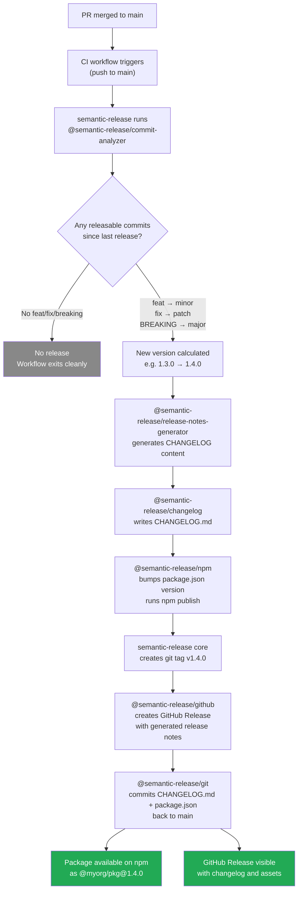

# Release Automation: Semantic Versioning & Changelogs

## Context

Publishing a new version of a library or application used to require a developer to make several manual decisions: is this a bug fix or a new feature? Does it break any existing APIs? What goes in the changelog? What version number should be used? These decisions were made inconsistently, often under time pressure, and the changelog was frequently an afterthought — written after the fact, incomplete, and unhelpful to users who needed to know what changed.

Conventional Commits changes the foundation. By encoding semantic intent into every commit message at the moment it is written, the commit history becomes machine-readable. Tooling can then analyze the commit log and deterministically compute the next version number — no human decision required. The CHANGELOG writes itself from the same data. The git tag, the GitHub Release, and the npm publish all follow automatically from the tag.

This is not merely automation for its own sake. It enforces discipline across the team: every meaningful change is classified, the classification drives the version number, and the version number communicates compatibility guarantees to consumers. Downstream teams integrating your library know exactly what a `2.0.0` means (breaking change, review migration guide) versus a `1.4.2` (patch only, safe to upgrade). The version number becomes a contract, not a guess.

Two tools dominate this space: `semantic-release` for single-package repositories and applications, and `@changesets/cli` for monorepos. This article covers both, explains when to use each, and provides production-ready workflow examples.

---

## Design Thinking

### Why Conventional Commits unlock automation

A commit message like `Updated the thing` is meaningful to a human reading it in context but is opaque to a machine. A message like `fix(auth): handle expired token in refresh flow` contains structured information: the type is `fix` (a backwards-compatible bug fix), the scope is `auth`, and the description is precise.

`semantic-release` analyzes a list of these structured messages and applies a deterministic rule set: any commit with type `feat` triggers a minor version bump; any commit with type `fix` or `perf` triggers a patch bump (Note: `refactor` triggering a patch bump is a customization in the `.releaserc.json` above — not default semantic-release behavior); any commit with a `BREAKING CHANGE:` footer or a `!` after the type triggers a major version bump. The highest applicable bump across all commits since the last release determines the new version. There is no ambiguity, no committee decision, no "should this be a 1.5 or a 2.0?" debate. The commit messages made the decision at the time of the change.

This also distributes responsibility correctly. The developer who wrote the breaking change is the one who labels it `feat!:` or adds the `BREAKING CHANGE:` footer. They have the most context. The release tooling just reads their intent.

### Why changesets beat semantic-release for monorepos

In a monorepo with packages `@myorg/button`, `@myorg/input`, and `@myorg/theme`, a single commit like `feat(button): add loading state` affects `@myorg/button` but has no impact on `@myorg/input` or `@myorg/theme`. `semantic-release` analyzes the entire commit log against a single release branch — it has no built-in concept of "which commits affect which package." This makes it a poor fit for monorepos without heavy customization.

Changesets solves this differently. When a developer makes a change, they also run `pnpm changeset` and interactively answer: "Which packages does this affect? Is it major, minor, or patch? What should appear in the CHANGELOG?" The answers are written to a small markdown file in `.changeset/`. This file is committed alongside the code change and reviewed in the pull request.

The changeset file is authoritative in a way that commit messages alone cannot be: it was written by the author with specific knowledge of which packages were affected and how. A single commit in a monorepo might touch shared utilities that cascade changes across five packages — the changeset captures this explicitly, while commit-based analysis would require complex dependency graph traversal to infer it.

When the time comes to release, `pnpm changeset version` consumes all pending changeset files, bumps each package by the maximum declared severity, and updates each package's CHANGELOG with the descriptions from the changeset files. The `.changeset/*.md` files are then deleted. A subsequent `pnpm changeset publish` publishes all packages that have a new version. The Changesets GitHub Action (`changesets/action`) keeps a PR open against `main` that shows the pending version bumps — the "Version Packages" PR. Merging this PR is the release.

### Why CHANGELOG matters

Users of your library — internal teams, open source consumers — need to evaluate every upgrade: "Is this safe to apply? What changed? Do I need to migrate anything?" Without a CHANGELOG, they read git commit histories, which are noisy and written for the developer making the change, not the consumer evaluating the upgrade. With a generated CHANGELOG, every release has a curated list of user-visible changes grouped by type, with links back to the originating commits.

Automated CHANGELOG generation makes this cost-free. The commit messages (or changeset descriptions) are already written; the tooling assembles them into a formatted document and commits the result. There is no "remember to update the changelog" step, no changelog drift, no releases shipped without documentation.

### Why publish-on-tag is better than publish-on-merge

Publishing on every merge to `main` means the publish step runs after every feature, fix, or refactor that lands. This is rarely desirable: you may want to accumulate several changes before releasing, you may be in the middle of a feature that is not yet ready for external consumption, or you may simply want a human to review the pending release before it ships.

A git tag represents explicit, deliberate release intent. With `semantic-release`, the version bump and tag happen automatically after the commit analysis — but still only once, at a controlled point in the workflow. With changesets, the tag happens when the "Version Packages" PR is merged — a human action that signals "this batch of changes is ready to release."

Publish-on-tag also creates a stable audit trail: every npm version corresponds to an exact git tag and an exact GitHub Release. The association between "what is in the npm package" and "what is in the source code" is unambiguous.

---

## Best Practices

**SHOULD use Conventional Commits format for all commit messages that affect versioned packages.** The `type(scope): description` format is the machine-readable input that enables deterministic version calculation — `feat:` triggers a minor bump, `fix:` triggers a patch bump, and `BREAKING CHANGE:` in the footer or `!` after the type triggers a major bump. Teams SHOULD enforce this format with a commit message linter (such as `commitlint` with `@commitlint/config-conventional`) as a CI step to prevent malformed commits from producing incorrect version numbers.

**SHOULD automate version bumps and CHANGELOG generation rather than editing them manually.** Manual version edits create inconsistencies, are forgotten under time pressure, and conflict with automated tooling. Teams SHOULD use `semantic-release` for single-package repositories and `@changesets/cli` for monorepos — both tools derive version decisions from commit messages or changeset files that are reviewed as part of the PR process.

**MUST NOT manually edit `package.json` version fields or CHANGELOG entries once automated release tooling is in place.** Manual edits will be overwritten by the tooling on the next run and create confusing conflicts in git history. Teams MUST treat version and changelog as generated outputs that are managed exclusively by the release tool.

**MUST publish packages from CI only, never from a developer's local machine.** Local publishes bypass CI checks, use the developer's local build environment and credentials, are not reproducible, and cannot be traced to a specific verified commit. Teams MUST revoke personal npm publish access to the package and require all publishes to go through the CI release workflow.

**MUST set `fetch-depth: 0` in release workflows.** `semantic-release` needs the full commit history since the last release tag to determine the next version. Without full history, `actions/checkout` produces a shallow clone where previous release tags are invisible, causing the tool to error or produce incorrect results. Always set `fetch-depth: 0` in any workflow that runs release tooling.

**SHOULD** prefer publish-on-tag over publish-on-merge for all versioned packages and libraries. An explicit git tag represents deliberate release intent; publishing on every merge to `main` makes every commit a potential release and removes the ability to batch changes before shipping. Publish-on-tag also creates a stable audit trail in which every npm version corresponds to an exact git tag and GitHub Release.

**SHOULD add `[skip ci]` to the release commit message generated by `@semantic-release/git`.** The release tool pushes a commit back to the default branch with updated `CHANGELOG.md` and `package.json`. Without `[skip ci]` in the commit message, the push event re-triggers the release workflow, which exits harmlessly but wastes CI minutes and can cause confusion in the workflow run list.

---

## Visual

The following diagram shows the full `semantic-release` flow from a merged pull request to a published npm package and GitHub Release.



---

## Example

### 1. Conventional Commits format reference

```bash
# Patch bump — backwards-compatible bug fix
fix(auth): handle expired token in refresh flow

# Minor bump — new backwards-compatible feature
feat(table): add column resizing support

# Minor bump with scope — scope is optional but useful
feat: support dark mode via CSS custom properties

# Major bump — breaking change signaled by '!'
feat(api)!: replace callback API with Promise-based interface

# Major bump — breaking change signaled by footer
feat(router): add nested route support

BREAKING CHANGE: The `routes` config key is renamed to `children`.
Update all route definitions that use `routes:` to use `children:`.

# No version bump — maintenance commits
chore: upgrade eslint to v9
docs: update contributing guide
ci: add dependency audit step
test: add coverage for edge cases in tokenizer
refactor(utils): extract date formatting helpers
style: apply prettier formatting to all files
```

### 2. semantic-release: configuration and workflow

Install the plugins:

```bash
pnpm add -D semantic-release \
  @semantic-release/commit-analyzer \
  @semantic-release/release-notes-generator \
  @semantic-release/changelog \
  @semantic-release/npm \
  @semantic-release/github \
  @semantic-release/git
```

Configure via `.releaserc.json` at the repository root:

```json
{
  "branches": ["main"],
  "plugins": [
    [
      "@semantic-release/commit-analyzer",
      {
        "preset": "conventionalcommits",
        "releaseRules": [
          { "type": "feat", "release": "minor" },
          { "type": "fix", "release": "patch" },
          { "type": "perf", "release": "patch" },
          { "type": "refactor", "release": "patch" },
          { "type": "docs", "release": false },
          { "type": "chore", "release": false },
          { "type": "ci", "release": false },
          { "type": "test", "release": false },
          { "breaking": true, "release": "major" }
        ]
      }
    ],
    [
      "@semantic-release/release-notes-generator",
      {
        "preset": "conventionalcommits",
        "presetConfig": {
          "types": [
            { "type": "feat", "section": "Features" },
            { "type": "fix", "section": "Bug Fixes" },
            { "type": "perf", "section": "Performance Improvements" },
            { "type": "refactor", "section": "Refactoring" }
          ]
        }
      }
    ],
    [
      "@semantic-release/changelog",
      {
        "changelogFile": "CHANGELOG.md"
      }
    ],
    "@semantic-release/npm",
    "@semantic-release/github",
    [
      "@semantic-release/git",
      {
        "assets": ["CHANGELOG.md", "package.json"],
        "message": "chore(release): ${nextRelease.version} [skip ci]\n\n${nextRelease.notes}"
      }
    ]
  ]
}
```

The corresponding GitHub Actions workflow:

```yaml
# .github/workflows/release.yml

name: Release

on:
  push:
    branches:
      - main

permissions:
  contents: write       # push the release commit and tag
  issues: write         # close issues on release (via @semantic-release/github)
  pull-requests: write  # comment on PRs included in a release
  id-token: write       # for npm provenance (optional but recommended)

jobs:
  release:
    name: Semantic release
    runs-on: ubuntu-latest
    steps:
      - uses: actions/checkout@v4
        with:
          # Fetch full history — semantic-release needs to read all commits
          # since the last release tag to determine the next version.
          fetch-depth: 0

      - uses: pnpm/action-setup@v4
        with:
          version: 9

      - uses: actions/setup-node@v4
        with:
          node-version: 20
          registry-url: 'https://registry.npmjs.org'

      - name: Install dependencies
        run: pnpm install --frozen-lockfile

      - name: Build
        run: pnpm build

      - name: Release
        run: pnpm exec semantic-release
        env:
          GITHUB_TOKEN: ${{ secrets.GITHUB_TOKEN }}
          NODE_AUTH_TOKEN: ${{ secrets.NPM_TOKEN }}
```

Key points:
- `fetch-depth: 0` is required. Without it, `actions/checkout` does a shallow clone and `semantic-release` cannot see the previous release tags needed to find the commit range to analyze.
- `GITHUB_TOKEN` is the automatically provisioned token. `NPM_TOKEN` must be added as a repository secret (generated from npmjs.com → Access Tokens → Automation type).
- The `[skip ci]` in the release commit message prevents an infinite loop: the commit pushed by `@semantic-release/git` triggers the push event, but `[skip ci]` tells GitHub Actions to skip that run.

### 3. Changesets: monorepo setup and workflow

Initialize Changesets in the monorepo root:

```bash
pnpm changeset init
```

This creates the `.changeset/` directory and a `config.json`:

```json
// .changeset/config.json
{
  "$schema": "https://unpkg.com/@changesets/config@3.0.0/schema.json",
  "changelog": "@changesets/cli/changelog",
  "commit": false,
  "fixed": [],
  "linked": [],
  "access": "public",
  "baseBranch": "main",
  "updateInternalDependencies": "patch",
  "ignore": []
}
```

When a developer makes a change that affects one or more packages, they run the interactive prompt:

```bash
pnpm changeset
```

```
? Which packages would you like to include?
  ◉ @myorg/button
  ○ @myorg/input
  ○ @myorg/theme

? Which packages should have a major bump?
  (none)

? Which packages should have a minor bump?
  ◉ @myorg/button

? Please enter a summary for this change:
  Add loading state to Button component
```

This creates a file like `.changeset/witty-eagles-fly.md`:

```markdown
---
"@myorg/button": minor
---

Add loading state to Button component. Pass `loading={true}` to display a spinner and disable interaction during async operations.
```

This file is committed alongside the code change and reviewed in the pull request. The description is written for the consumer, not the implementer.

**Changesets GitHub Action — the "Version Packages" PR bot:**

```yaml
# .github/workflows/release.yml

name: Release

on:
  push:
    branches:
      - main

permissions:
  contents: write
  pull-requests: write

jobs:
  release:
    name: Create release PR or publish
    runs-on: ubuntu-latest
    steps:
      - uses: actions/checkout@v4

      - uses: pnpm/action-setup@v4
        with:
          version: 9

      - uses: actions/setup-node@v4
        with:
          node-version: 20
          registry-url: 'https://registry.npmjs.org'

      - name: Install dependencies
        run: pnpm install --frozen-lockfile

      - name: Build
        run: pnpm build

      - name: Create release PR or publish to npm
        uses: changesets/action@v1
        with:
          # When changeset files are present: open or update the Version Packages PR
          # When Version Packages PR is merged: publish all changed packages
          publish: pnpm changeset publish
          version: pnpm changeset version
          title: "chore: version packages"
          commit: "chore: version packages"
        env:
          GITHUB_TOKEN: ${{ secrets.GITHUB_TOKEN }}
          NODE_AUTH_TOKEN: ${{ secrets.NPM_TOKEN }}
```

The `changesets/action` bot maintains a single open PR titled "chore: version packages" that accumulates all pending changesets. The PR body shows a summary of which packages will be bumped by how much and what will appear in each CHANGELOG. When this PR is merged, the versioning has already been applied by the merge itself — the PR branch already ran `changeset version` to produce the bumped `package.json` and CHANGELOG entries. The action then runs `pnpm changeset publish` only, which:

1. Publishes all packages that have a new version in `package.json` but have not yet been published to npm
2. Creates git tags for each published package (e.g., `@myorg/button@2.1.0`)
3. Creates GitHub Releases for each tag

### 4. npm publish from CI with `NODE_AUTH_TOKEN`

When using `actions/setup-node` with `registry-url`, the action creates a `.npmrc` file that reads the auth token from the `NODE_AUTH_TOKEN` environment variable. This means you do not need to manually configure `.npmrc` — just set the env var:

```yaml
- uses: actions/setup-node@v4
  with:
    node-version: 20
    registry-url: 'https://registry.npmjs.org'  # or a private registry URL

- name: Publish
  run: npm publish --access public
  env:
    NODE_AUTH_TOKEN: ${{ secrets.NPM_TOKEN }}
```

For a private registry (GitHub Packages):

```yaml
- uses: actions/setup-node@v4
  with:
    node-version: 20
    registry-url: 'https://npm.pkg.github.com'
    scope: '@myorg'

- name: Publish
  run: npm publish
  env:
    NODE_AUTH_TOKEN: ${{ secrets.GITHUB_TOKEN }}
```

### 5. GitHub Releases — automatic vs. manual

With `semantic-release`, GitHub Releases are created automatically by the `@semantic-release/github` plugin. Each release is associated with the new git tag and populated with the generated release notes.

With changesets, GitHub Releases are created by the `changesets/action` bot when it publishes. Each package gets its own GitHub Release tagged `@myorg/package@x.y.z`.

For projects not using either tool, GitHub's native release automation can generate release notes from pull request titles and labels:

```yaml
# .github/release.yml — configures automatic GitHub Release notes

changelog:
  exclude:
    labels:
      - ignore-for-release
  categories:
    - title: "Breaking Changes"
      labels:
        - breaking-change
    - title: "New Features"
      labels:
        - enhancement
    - title: "Bug Fixes"
      labels:
        - bug
    - title: "Dependency Updates"
      labels:
        - dependencies
```

### 6. Choosing between semantic-release and changesets

| Criterion | semantic-release | changesets |
|---|---|---|
| Repository type | Single package | Monorepo / multi-package |
| Version input | Commit message types | Explicit changeset files |
| Author involvement | None (automated) | Author creates changeset at PR time |
| CHANGELOG quality | Good (from commit messages) | Excellent (written for consumers) |
| Cross-package coordination | Limited | Built-in |
| Setup complexity | Moderate | Moderate |
| Best for | Apps, single libraries | Component libraries, design systems, SDKs |

---

## Common Mistakes

**Using `fix:` for features and `feat:` for anything notable.**
The commit type is the input to version calculation. `feat:` triggers a minor bump regardless of how significant the change feels. `fix:` triggers a patch bump. Using these types loosely — "I'll call it `feat:` because it's a big PR" — creates incorrect version numbers. Train the team on the semantics: `feat:` means a new capability exposed to the user; `fix:` means correcting existing behavior.

**Forgetting `BREAKING CHANGE:` in the commit footer.**
A breaking change without the `BREAKING CHANGE:` footer (or the `!` suffix) will be analyzed as a regular `feat:` or `fix:` and trigger only a minor or patch bump. The major version will not be incremented, and consumers who upgrade will encounter unexpected breakage. Before merging any PR that removes or renames a public API, verify the commit includes the breaking change marker.

**Opening the "Version Packages" PR and manually publishing.**
With changesets, the `changesets/action` bot handles the full publish cycle. Manually running `pnpm changeset publish` locally after merging the bot's PR can result in double-publishing or publishing with the wrong auth context. Let the bot do the publishing.

**Ignoring changesets in PR review.**
The changeset file committed with a PR is part of the change — it describes the user-visible impact. Reviewers should read it: is the version bump appropriate? Is the CHANGELOG description accurate and useful to a consumer? A changeset that says "minor" for a breaking change will result in a minor version bump instead of a major one.

**Publishing a monorepo with semantic-release without workspace plugins.**
`semantic-release` does not natively understand pnpm or npm workspaces. Using it in a monorepo without specialized plugins (`@semantic-release/monorepo` or per-package configuration) typically results in all packages being versioned together based on the entire commit history, defeating the purpose of independent package versioning. Use changesets for monorepos.

---

## Related FEEs

- [FEE-1500: CI/CD & Deployment Overview](1500.md) — the category overview and pipeline mental model
- [FEE-1501: GitHub Actions for Frontend](1501.md) — GitHub Actions workflow structure; the foundation on which the release workflow is built
- [FEE-804: Package Management](../Build%20Tooling%20and%20Module%20Systems/804.md) — npm/pnpm package management, lockfiles, and the npm registry
- [FEE-805: Monorepos](../Build%20Tooling%20and%20Module%20Systems/805.md) — monorepo tooling and workspace configuration; changesets integrates directly with pnpm workspaces

---

## References

- [Conventional Commits specification](https://www.conventionalcommits.org/en/v1.0.0/): the full specification for the `type(scope): description` commit message format, including the rules for major/minor/patch mapping and breaking change syntax
- [semantic-release documentation](https://semantic-release.gitbook.io/semantic-release/): official documentation covering plugin architecture, configuration, CI environment variables, and the full release lifecycle
- [Changesets documentation — changesets/changesets on GitHub](https://github.com/changesets/changesets/blob/main/docs/intro-to-using-changesets.md): the authoritative guide to the changesets workflow, changeset file format, and the Version Packages PR pattern
- [changesets/action — GitHub Marketplace](https://github.com/marketplace/actions/changesets-action): the official GitHub Action for the Changesets bot; documents the `publish`, `version`, `title`, and `commit` inputs and the workflow it manages
- [Semantic Versioning 2.0.0](https://semver.org/): the semver specification defining what constitutes major, minor, and patch version changes and the compatibility guarantees associated with each
- [Publishing Node.js packages — GitHub Docs](https://docs.github.com/en/actions/publishing-packages/publishing-nodejs-packages): official GitHub documentation for npm publish from GitHub Actions, including `NODE_AUTH_TOKEN`, `registry-url`, and GitHub Packages configuration
