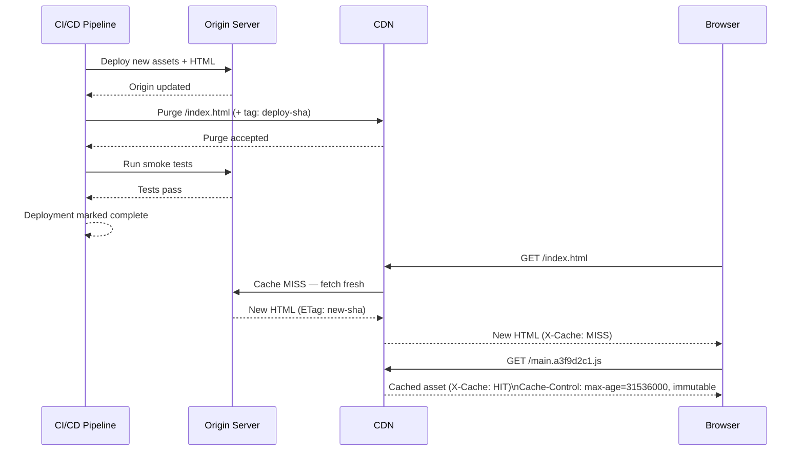

# Cache Invalidation at Scale

Cache invalidation is frequently cited as one of the two hard problems in
computer science, and frontend deployment makes the difficulty concrete.
A CDN has cached your JavaScript bundle. You deploy a fix. Users refresh,
but the CDN serves the old file from its edge nodes. Your server is updated;
the CDN is not. This is the core invalidation problem at scale: a distributed
cache must be coordinated with a central deployment event.

The solution space divides into two strategies based on where immutability
is enforced. The first treats URLs as mutable — the same path serves
different content over time, and invalidation means telling the cache to
discard what it has. The second treats URLs as immutable — content changes
produce new URLs, and the cache is naturally correct because the old URL
is never served again and the new URL is populated on first request.
Modern frontend deployments use immutable URL strategies for static assets
and a carefully limited mutable strategy for the HTML entry point.

Getting cache invalidation right has compounding consequences. Under-caching
means repeat visitors pay network costs on every visit; every static asset
fetch hits origin under high concurrency. Over-caching or failed invalidation
means users run stale JavaScript and CSS after a deployment, producing
inconsistent state between the asset version and the backend API contract.
In a continuous deployment environment where multiple versions may be
active across CDN edge nodes simultaneously, the window for mixed-version
states requires deliberate design.

This article covers content-hash asset naming, CDN purge API patterns for
the HTML entry point, the `Cache-Control: immutable` directive, HTML file
caching strategy, and stale-while-revalidate in a CI deployment context.

## Design Thinking

### Content-hash filenames and natural invalidation

Content-hash filenames — also called "cache busting" — embed a hash of
the file's content into the URL: `main.a3f9d2c1.js` rather than `main.js`.
When the file content changes, the hash changes, and the URL changes. The
old URL continues to serve the old content from the CDN — which is correct,
because any page loaded before the deployment references the old hash. The
new page, delivered after the deployment, references the new hash URL.
No explicit cache invalidation is required because the URLs are different.

All major build tools generate content-hashed filenames automatically.
Webpack's `output.filename` with `[contenthash]` tokens, Vite's default
`build.rollupOptions.output.assetFileNames` pattern, and esbuild's
`--asset-names` flag all produce content-hashed output. The hash is
computed over the file's content bytes, so identical content produces
identical hashes and the CDN serves the cached version without a round-trip
to origin. Only changed files produce new hashes and require cache
population.

Content-hash filenames make `Cache-Control: max-age=31536000, immutable`
safe and correct. The browser may cache the file for up to a year, knowing
that the URL will never serve different content. The `immutable` directive
is an optimization hint: it instructs the browser not to revalidate the
resource even when the user explicitly refreshes the page. Without
`immutable`, a hard refresh sends conditional `If-None-Match` requests
for all cached resources even when they have not expired. With `immutable`,
the browser skips revalidation entirely for files within the `max-age` window.

The `immutable` directive is supported by all modern browsers. Older
browsers ignore it and fall back to standard `max-age` behavior. There
is no risk in serving `immutable` to browsers that do not understand it —
they simply do not apply the optimization.

### The HTML entry point problem

Content-hash filenames solve the asset invalidation problem, but not the
HTML entry point problem. The HTML document — `index.html` for a
single-page application, or each server-rendered route document — is
the root of the dependency tree. It references all hashed asset URLs.
After a deployment, the new HTML document references new asset hashes.
If the CDN or browser serves an old HTML document, it will request old
asset URLs — which the CDN still has cached, because those old hashes
are immutable. The user runs the old application version.

The HTML entry point must not be cached with a long `max-age`. Two
strategies are correct: `Cache-Control: no-cache` and
`Cache-Control: max-age=0, must-revalidate`. Both ensure the browser
sends a conditional request on every navigation. If the document has not
changed (same `ETag` or `Last-Modified` value), the server responds with
`304 Not Modified` at minimal cost. If the document has changed, the
browser receives the new HTML with updated asset references.

At the CDN layer, the HTML entry point must be purged after each
deployment. CDN purge APIs — Cloudflare's API, Fastly's `PURGE` method,
AWS CloudFront's `CreateInvalidation` — accept a list of URLs or path
patterns and instruct edge nodes to discard their cached copies. The
next request to each edge node fetches a fresh copy from origin.

Deploying before purging creates a window where the new origin serves
the new HTML but CDN edges still serve the old HTML. Users who hit a
fresh edge node after the CDN purge receive the new HTML; users served
by edge nodes that haven't been purged yet receive the old HTML. This
window is typically seconds to minutes, but for applications with zero-
downtime requirements it must be measured and accounted for.

### CDN purge in the deployment pipeline

CDN purge should be the final step of a deployment pipeline, executed
after the new assets are confirmed available at origin. Purging before
origin is updated causes edge nodes to fetch the old content from origin
and re-cache it. Purging after origin is updated and smoke tests have
passed ensures the CDN begins serving verified content.

Most CI/CD platforms can call CDN purge APIs using authenticated HTTP
requests in a pipeline step. The request is a simple authenticated POST
with the list of paths to purge. For single-page applications, the path
list is typically a single entry: the root `index.html`. For multi-page
applications or server-rendered applications with many distinct routes,
the purge list may be larger — consider using a tag-based or surrogate-key
based purge if the CDN supports it, which purges all resources tagged with
a deployment identifier in a single API call.

Tag-based invalidation requires cooperation from the origin server or
the CDN configuration. The origin attaches a `Surrogate-Key` or `Cache-Tag`
header to each response, grouping related resources under a shared tag
(for example, the deployment commit SHA). A single CDN API call purges
all resources with that tag simultaneously, regardless of URL count.
This is the preferred pattern for large-scale deployments where the HTML
entry point count exceeds the practical limits of URL-based purge lists.

### stale-while-revalidate in CI context

`stale-while-revalidate` is a `Cache-Control` extension that instructs
the cache to serve a stale response immediately while fetching an updated
version in the background. The directive takes a time window:
`Cache-Control: max-age=60, stale-while-revalidate=86400` means the
response is fresh for 60 seconds, and the cache may serve the stale
response for up to 24 hours while revalidating in the background.

For the HTML entry point in a high-frequency CI/CD environment, this
directive creates a meaningful risk. A user loads the application from
a stale HTML entry point — the cache serves it immediately. The revalidation
request is sent in the background. The next navigation by the same user
may receive the updated HTML, creating a state where different browser
tabs run different application versions. For single-page applications
with client-side routing, this mid-session version change can cause
runtime errors if the old JavaScript bundle references API endpoints or
asset paths that the new deployment has changed.

`stale-while-revalidate` is appropriate for the HTML entry point only
when the application can tolerate mixed-version browser sessions — typically
read-only dashboards, documentation sites, and content-heavy pages without
complex state. For interactive applications with API version dependencies,
the HTML entry point should use `no-cache` or `max-age=0, must-revalidate`
without `stale-while-revalidate`.

For static assets with content-hash filenames, `stale-while-revalidate`
is harmless: the content is immutable per URL, so serving a stale version
of `main.a3f9d2c1.js` is always correct — it is the same bytes as the
fresh version.

### Monitoring and verifying invalidation

Invalidation correctness is difficult to observe without explicit tooling.
A deployment appears successful if the origin serves the correct content
and CI tests pass. Edge node inconsistency — different nodes serving
different versions during the purge propagation window — is not visible
in standard monitoring unless explicitly measured.

Synthetic monitoring that fires from multiple geographic locations
immediately after each deployment can detect edge inconsistency. The
monitor requests the HTML entry point from several CDN regions and
compares the `ETag` or content hash in the response. If different regions
return different `ETags`, purge propagation is incomplete. Alerting on
this condition notifies the deployment pipeline before the deployment is
marked as complete.

Response headers reveal cache behavior. `X-Cache: HIT` and `X-Cache: MISS`
headers (or equivalent CDN-specific headers such as `CF-Cache-Status` for
Cloudflare or `X-Served-By` for Fastly) indicate whether the response was
served from cache or origin. Logging these headers in RUM or synthetic
monitoring provides a continuous view of the cache hit rate by URL, making
it possible to detect URLs that are unexpectedly missing from the cache
or unexpectedly cached when they should not be.

## Best Practices

**MUST** use content-hash filenames for all static assets (JavaScript, CSS,
fonts, images) and serve them with `Cache-Control: max-age=31536000, immutable`.
Content-hash naming is the only reliable mechanism for natural cache
invalidation at CDN scale without explicit purge.

**MUST** serve the HTML entry point with `Cache-Control: no-cache` or
`max-age=0, must-revalidate` — not with `max-age=31536000` or any long
TTL. The HTML document is the only resource whose staleness directly
causes users to run the wrong application version.

**MUST** trigger CDN purge for the HTML entry point as a step in the
deployment pipeline, after origin is updated and before the deployment
is marked complete. Manual purge is not a substitute for automated
pipeline integration.

**MUST NOT** use `stale-while-revalidate` on the HTML entry point for
applications with API version dependencies or complex client-side state.
Serving stale HTML after a deployment can produce mixed-version browser
sessions that cause runtime errors.

**SHOULD** use tag-based or surrogate-key-based CDN purge for applications
with many HTML entry points (multi-page applications, server-rendered
routes). URL-based purge lists become unmanageable at scale.

**SHOULD** implement synthetic monitoring that checks cache consistency
across CDN regions immediately after each deployment to detect purge
propagation delays before they affect real users.

**MUST NOT** rely on users clearing their browser cache as a workaround
for failed invalidation. Cache management is an infrastructure responsibility;
instructing users to clear their cache indicates a missing or broken purge
step in the deployment pipeline that must be fixed structurally.

## Visual



## Example

```yaml
# .github/workflows/deploy.yml
# Production deployment workflow with CDN purge as the final step.

name: Deploy

on:
  push:
    branches: [main]

jobs:
  deploy:
    runs-on: ubuntu-latest
    steps:
      - uses: actions/checkout@v4

      - name: Install dependencies
        run: npm ci

      - name: Build
        run: npm run build
        # Build output: dist/
        # index.html — no hash, short cache TTL
        # assets/main.a3f9d2c1.js — content-hashed, immutable

      - name: Upload assets to CDN origin (S3 / GCS / etc.)
        run: |
          # Upload hashed assets first with long-lived cache headers
          aws s3 sync dist/assets s3://$BUCKET/assets \
            --cache-control "max-age=31536000, immutable" \
            --exclude "*.html"

          # Upload HTML with no-cache header
          aws s3 cp dist/index.html s3://$BUCKET/index.html \
            --cache-control "no-cache"
        env:
          AWS_ACCESS_KEY_ID: ${{ secrets.AWS_ACCESS_KEY_ID }}
          AWS_SECRET_ACCESS_KEY: ${{ secrets.AWS_SECRET_ACCESS_KEY }}

      - name: Purge HTML from CloudFront
        run: |
          aws cloudfront create-invalidation \
            --distribution-id ${{ secrets.CF_DISTRIBUTION_ID }} \
            --paths "/index.html"
        env:
          AWS_ACCESS_KEY_ID: ${{ secrets.AWS_ACCESS_KEY_ID }}
          AWS_SECRET_ACCESS_KEY: ${{ secrets.AWS_SECRET_ACCESS_KEY }}

      - name: Smoke test
        run: |
          # Verify the new deployment is live at the CDN edge
          ETAG=$(curl -sI https://app.example.com/ | grep -i etag | awk '{print $2}')
          echo "Live ETag: $ETAG"
          # Assert ETag matches the expected new version hash
```

## Common Mistakes

- Serving `index.html` with `max-age=31536000` — users receive the old
  HTML after a deployment until the CDN TTL expires, running the old
  application version with potentially incompatible API contracts
- Omitting CDN purge from the deployment pipeline — the pipeline completes
  successfully but CDN edges continue to serve the old HTML
- Purging the CDN before uploading new assets to origin — edge nodes
  refetch and re-cache the old content from origin
- Using `stale-while-revalidate` on the HTML entry point for interactive
  SPAs — creates mixed-version browser sessions mid-deployment
- Not content-hashing font and image assets — these are also versioned
  files that should be immutable at their URL
- Relying on browser devtools cache-disable during testing — devtools
  cache disable bypasses the browser cache but not the CDN; production
  cache behavior requires testing with caches enabled

## Related FEEs

- FEE-1504: Production Deployment: Static Hosting & CDN
- FEE-1505: Deployment Strategies: Canary, Blue-Green & Feature Flags
- FEE-1509: Rollback Strategies for Frontend Deployments

## References

- [MDN: Cache-Control](https://developer.mozilla.org/en-US/docs/Web/HTTP/Headers/Cache-Control)
- [web.dev: Love your cache](https://web.dev/love-your-cache/)
- [Cloudflare: Cache Purge API](https://developers.cloudflare.com/cache/how-to/purge-cache/)
- [AWS CloudFront: CreateInvalidation](https://docs.aws.amazon.com/cloudfront/latest/APIReference/API_CreateInvalidation.html)
- [RFC 5861: stale-while-revalidate](https://datatracker.ietf.org/doc/html/rfc5861)
