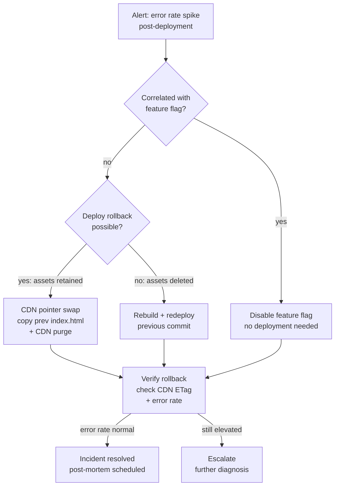

# Rollback Strategies for Frontend Deployments

Rollback is the ability to revert a production system to a previous known-good
state after a bad deployment. For backend services, rollback is typically a
container swap or database migration reversal — well-understood operations
with decades of tooling. For frontend deployments, rollback is structurally
different in ways that matter: static assets live on CDNs that distribute
immutable files globally, HTML entry points control which asset version users
load, and client-side JavaScript running in a browser tab cannot be swapped
without a page reload.

The asymmetry between deployment and rollback creates a practical trap. A
deployment takes five minutes. Teams assume rollback is also five minutes.
In practice, a rollback that requires rebuilding the old version, running the
full CI pipeline, re-uploading assets, and purging the CDN takes as long as
a forward deployment — and must happen during an incident when team focus is
divided. Rollback speed is a function of how the deployment system is
architected, not how fast engineers can react.

Frontend rollback strategy is also complicated by the boundary between what
can be reversed instantly and what cannot. A CDN pointer swap that redirects
the HTML entry point to a previous deployment is instantaneous and does not
require a rebuild. A feature-flag rollback that disables a problematic feature
can take effect in milliseconds without any deployment. A deploy rollback that
requires re-running CI takes as long as CI takes. Understanding which class
of rollback applies to each class of incident is the first decision a team
makes when an alert fires.

This article covers instant rollback via CDN pointer swap, feature-flag
rollback versus deploy rollback, automated rollback triggers based on error
rate monitoring, and rollback testing practices in staging environments.

## Principle

Every production deployment MUST be reversible without re-running the build
pipeline. The rollback mechanism MUST be defined and tested before it is
needed. Automated rollback SHOULD be triggered when error rate metrics exceed
a defined threshold within the post-deployment monitoring window. Feature
flags SHOULD be used to decouple code deployment from feature activation, so
that problematic features can be disabled without a rollback of the entire
deployment. The rollback decision SHOULD be made within five minutes of a
confirmed production incident, not after extended diagnosis.

## Design Thinking

### CDN pointer swap: instant rollback without a rebuild

The fastest frontend rollback mechanism is a CDN pointer swap: changing
which directory of pre-built, pre-uploaded assets the CDN serves as the
current deployment. This requires that the previous deployment's assets
remain uploaded and accessible at the CDN origin even after a new deployment
replaces them.

The implementation pattern is deployment-versioned asset directories. Each
deployment uploads its output to a versioned path at the CDN origin:
`/deploys/{sha}/assets/main.a3f9d2c1.js`. The HTML entry point is uploaded
to a separate, fixed path: `/current/index.html`. The HTML file contains
absolute asset references pointing to `/deploys/{sha}/assets/...`. Rolling
back is a single operation: overwrite `/current/index.html` with the previous
version's HTML file and purge it from the CDN. All edge nodes begin serving
the previous HTML, which references the previous deployment's assets — which
are still in the CDN origin at their old versioned path.

This pattern requires that deployment history is retained. Asset directories
must not be deleted immediately after a new deployment. A retention policy of
five to ten recent deployments gives a realistic rollback window; retaining
more than 20 is typically unnecessary and adds storage cost. The cleanup of
old deployment directories should be a scheduled job that runs after the
deployment has been live for a defined period and confirmed stable.

The CDN pointer swap approach does not require a new build, a new CI run, or
a new asset upload. The rollback time is the time to copy one HTML file and
issue a CDN purge API call — typically under 60 seconds. This is the
target rollback time for production incidents that require deployment reversal.

### Feature-flag rollback versus deploy rollback

Feature flags decouple feature activation from code deployment. A feature
flag allows a feature to be shipped in the codebase in a disabled state,
enabled for internal users for testing, gradually rolled out to a percentage
of users, and instantly disabled if problems are detected — all without
any code deployment.

Feature-flag rollback is faster and more targeted than deploy rollback. A
deploy rollback reverts the entire deployment, including unrelated changes
that shipped in the same commit. A feature-flag rollback disables exactly the
problematic feature, leaving all other changes from the same deployment intact.

The decision between feature-flag rollback and deploy rollback depends on
whether the problem is attributable to a specific feature or to a shared
infrastructure change. An error spike that correlates with a new feature flag
being turned on is best addressed by turning the flag off. An error spike
that affects all users regardless of feature flag state — a broken routing
configuration, a corrupted CSS bundle, an incorrect API base URL — requires
a deploy rollback.

Teams that do not use feature flags for major changes lose the ability to
do targeted rollbacks. They must choose between rolling back the entire
deployment (reverting unrelated changes, potentially reintroducing previously
fixed bugs) or leaving the broken deployment live while working on a hotfix.
Introducing feature flags for significant features as a default practice
significantly narrows the scope of deploy rollbacks in practice.

### Automated rollback triggers

Automated rollback triggers fire when post-deployment metrics cross defined
thresholds within a monitoring window. The monitoring window is the period
after a deployment during which the system is considered unstable and actively
monitored for signals. A typical window is 10 to 30 minutes, after which the
deployment is considered stable if no threshold violations occurred.

The metrics used for automated rollback triggers in frontend deployments are:
client-side error rate (unhandled JavaScript exceptions per session), HTTP
4xx/5xx error rate from the API calls the frontend makes, and Core Web Vitals
degradation. Of these, the client-side error rate is the most reliable signal
for a frontend deployment problem. A spike in unhandled exceptions immediately
after a deployment, correlated with the deployment event, is strong evidence
of a code defect introduced by the deployment.

The threshold must be calibrated to the pre-deployment baseline, not an
absolute value. A baseline error rate of 0.5% and a threshold of 2% (four
times baseline) is more meaningful than a fixed threshold of 1% that may
be below the baseline for some applications. Canary deployments — routing
a small fraction of traffic to the new version while the majority continues
on the old version — allow baseline comparison to be performed with production
traffic before full rollout, making automated rollback thresholds more precise.

Automated rollback must be paired with alerting and human visibility. An
automated rollback that runs silently creates confusion: the on-call engineer
sees an alert, begins investigating, and discovers the system is already on
the previous version. The automated rollback event must be logged and the
on-call engineer notified with the context: which deployment was rolled back,
what metric triggered it, what the metric value was, and what the rollback
action taken was.

### Rollback testing in staging

A rollback mechanism that is only tested during a production incident is
not a rollback mechanism — it is an untested theory. The rollback procedure
must be exercised in staging periodically to verify that it works as designed
and that the team knows how to execute it under pressure.

Rollback testing in staging involves deploying a new version, verifying it
is live, and then executing the rollback procedure to the previous version
and verifying that the previous version is live and functional. This exercise
should be scripted so it can be run consistently and its results compared
over time. If the rollback takes five minutes in staging, it will take at
least five minutes in production — and potentially longer due to additional
coordination overhead during an incident.

The test should verify that:
- The rollback procedure restores the correct HTML entry point to the CDN
- The CDN purge propagates within an acceptable time window
- The restored version's assets remain available at the CDN origin
- Any feature flags that were on before the bad deployment are in the
  correct state after rollback

Rollback testing should also cover the automated trigger path: verifying
that the monitoring system correctly detects a simulated error rate spike
and fires the trigger within the expected time.

## Best Practices

**MUST** retain previous deployment assets at the CDN origin for a defined
retention window (5–10 deployments). Instant CDN pointer swap rollback is
impossible if previous deployment assets have been deleted.

**MUST** define and document the rollback procedure before the first
production deployment. The procedure must be executable by any on-call
engineer, not only by the person who built the deployment pipeline.

**MUST NOT** delete previous deployment asset directories as part of the
deployment pipeline. Deletion should be a separate scheduled cleanup job
that runs after a stability window has passed. Deleting on deploy eliminates
the rollback window.

**SHOULD** use feature flags for significant new features to enable targeted
rollback without reverting unrelated changes. Deploy rollback is a blunt
instrument; feature-flag rollback is precise.

**SHOULD** configure automated rollback triggers on client-side error rate
with a threshold relative to the pre-deployment baseline, within a defined
post-deployment monitoring window.

**SHOULD** test the rollback procedure in staging at least monthly or before
major releases. An untested rollback procedure fails at the worst possible
moment.

## Visual



## Example

```typescript
// scripts/rollback.ts
// CDN pointer swap rollback for AWS S3 + CloudFront.
// Copies the HTML from a previous deployment and purges the CDN.
// Run: npx ts-node scripts/rollback.ts <previous-deploy-sha>

import {
  S3Client,
  CopyObjectCommand,
  GetObjectCommand,
} from '@aws-sdk/client-s3';
import {
  CloudFrontClient,
  CreateInvalidationCommand,
} from '@aws-sdk/client-cloudfront';

const BUCKET = process.env.DEPLOY_BUCKET!;
const DISTRIBUTION_ID = process.env.CF_DISTRIBUTION_ID!;

const s3 = new S3Client({ region: 'us-east-1' });
const cf = new CloudFrontClient({ region: 'us-east-1' });

async function rollback(previousSha: string): Promise<void> {
  console.log(`Rolling back to deployment: ${previousSha}`);

  // 1. Copy previous deployment's index.html to the /current/ prefix
  await s3.send(
    new CopyObjectCommand({
      Bucket: BUCKET,
      CopySource: `${BUCKET}/deploys/${previousSha}/index.html`,
      Key: 'current/index.html',
      CacheControl: 'no-cache',
      MetadataDirective: 'REPLACE',
    }),
  );

  console.log('HTML entry point restored from previous deployment');

  // 2. Purge the HTML from CloudFront edge nodes
  const invalidation = await cf.send(
    new CreateInvalidationCommand({
      DistributionId: DISTRIBUTION_ID,
      InvalidationBatch: {
        Paths: { Quantity: 1, Items: ['/current/index.html'] },
        CallerReference: `rollback-${previousSha}-${Date.now()}`,
      },
    }),
  );

  console.log(
    `CDN purge initiated: ${invalidation.Invalidation?.Id}`,
  );
  console.log('Rollback complete. Verify with: curl -sI https://app.example.com/');
}

const previousSha = process.argv[2];
if (!previousSha) {
  console.error('Usage: rollback.ts <previous-deploy-sha>');
  process.exit(1);
}
rollback(previousSha).catch((err) => {
  console.error('Rollback failed:', err);
  process.exit(1);
});
```

## Common Mistakes

- Deleting previous deployment asset directories during the deployment
  pipeline — eliminates the CDN pointer swap rollback option; the only
  remaining option is a full rebuild
- Testing rollback only once when the pipeline is first built and never
  again — rollback procedures drift as the pipeline evolves; untested
  procedures fail during incidents
- Using feature flags for rollback without monitoring which flags were
  active at the time of the bad deployment — rolling back to a previous
  version restores old code but not old feature flag state
- Automating rollback triggers without alerting the on-call engineer —
  silent automated rollback creates confusion during incident response
- Setting absolute error rate thresholds rather than thresholds relative
  to the deployment baseline — a 1% absolute threshold fires for
  applications whose baseline is already 0.8%, and never fires for
  applications whose baseline is already above 1%
- Conflating rollback time with deployment time — a deployment takes 10
  minutes; a CDN pointer swap rollback takes 60 seconds; communicate these
  separately to stakeholders so rollback SLAs are set correctly

## Related FEEs

- FEE-1504: Production Deployment: Static Hosting & CDN
- FEE-1505: Deployment Strategies: Canary, Blue-Green & Feature Flags
- FEE-1508: Cache Invalidation at Scale

## References

- [Cloudflare: Rollback with Pages](https://developers.cloudflare.com/pages/configuration/rollbacks/)
- [Vercel: Instant Rollback](https://vercel.com/docs/deployments/instant-rollback)
- [LaunchDarkly: Feature Flag Rollback](https://launchdarkly.com/blog/feature-flag-rollbacks/)
- [Google SRE Book: Release Engineering](https://sre.google/sre-book/release-engineering/)
- [AWS: Deployment Rollback](https://docs.aws.amazon.com/codedeploy/latest/userguide/deployments-rollback-and-redeploy.html)
