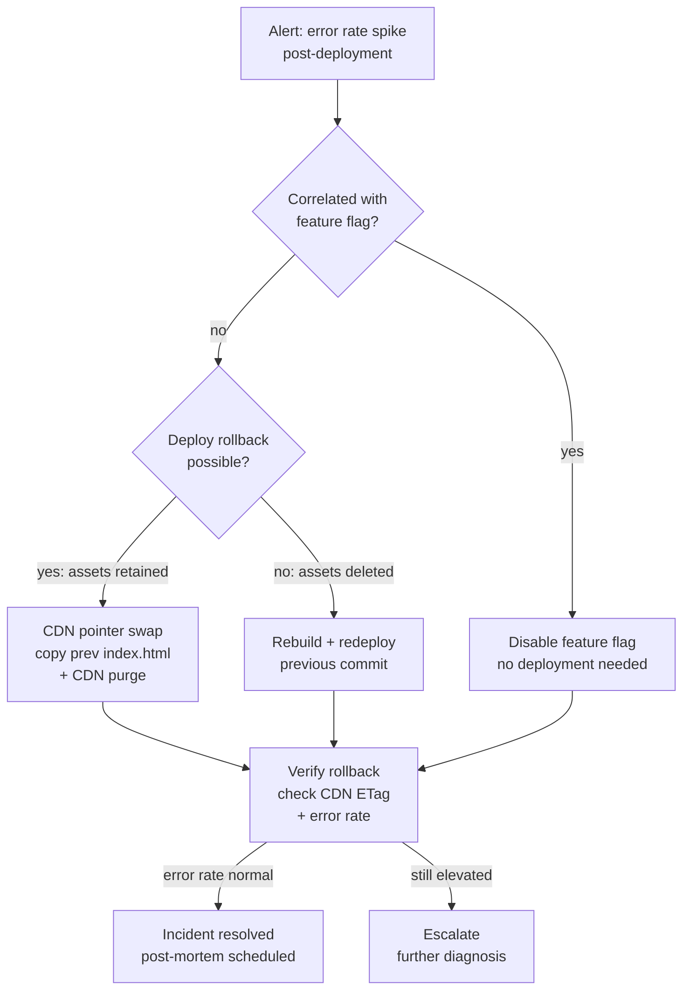

# [FEE-1509] Rollback Strategies for Frontend Deployments

:::info
Rollback is the ability to revert a production system to a previous known-good
state after a bad deployment. Frontend rollback differs structurally from
backend rollback: because static assets live on CDNs that distribute
immutable files globally, a CDN pointer swap that redirects the HTML entry
point to a previous deployment can be near-instant, provided the previous
deployment's assets are still retained at the origin. That mechanism has real
limits: it changes what new page loads receive, while already-open browser
tabs and already-installed service workers keep running whatever they
already loaded. Verifying a rollback means watching the client-observed
error rate fall, in addition to confirming the CDN has updated. This
article covers the CDN pointer-swap
pattern, feature-flag rollback versus deploy rollback, automated rollback
triggers based on error-rate monitoring, and the cases where rolling back the
frontend is not safe, such as a backend API contract that has already moved
forward.
:::

## Context

For backend services, rollback is
typically a container swap or database migration reversal: well-understood
operations with decades of tooling. For frontend deployments, rollback is
structurally different in ways that matter. Static assets live on CDNs that
distribute immutable files globally. HTML entry points control which asset
version users load. Client-side JavaScript already running in a browser tab
cannot be swapped without a page reload; the "What rollback does not reach"
section below covers what that limit means in practice.

The asymmetry between deployment and rollback creates a practical trap.
Teams often assume that because deployment is fast, rollback is equally
fast. In practice, a rollback that requires rebuilding the old version,
running the full CI pipeline, re-uploading assets, and purging the CDN
takes as long as a forward deployment, and it has to happen during an
incident, when the team's attention is already divided. Rollback speed is
decided when the deployment pipeline is designed: a pipeline that retains
old assets can roll back with a single file copy, while a pipeline that
deletes them has to re-run CI to reconstruct the previous state.

Frontend rollback strategy is also complicated by the boundary between what
can be reversed instantly and what cannot. A CDN pointer swap that redirects
the HTML entry point to a previous deployment is near-instant and does not
require a rebuild. A feature-flag rollback that disables a problematic
feature can take effect without any deployment at all. A deploy rollback
that requires re-running CI takes as long as CI takes. Understanding which
class of rollback applies to each class of incident is the first decision a
team makes when an alert fires.

The versioned-directory pattern in this article is the one to build if a
team owns its CDN and origin storage directly, for example a self-managed
S3 and CloudFront setup. Managed platforms already implement the same idea
as a built-in feature, with their own trade-offs worth knowing before
relying on them. Cloudflare Pages, Vercel, and Netlify all offer one-click
or one-command rollback to a previous deployment. On Vercel, an Instant
Rollback does not apply environment variable changes made since the target
deployment was built; the rolled-back deployment keeps whatever environment
configuration it originally had. It also turns off automatic promotion of
new pushes to production until the rollback is undone, and custom domain
aliases are only preserved if they were already attached to the deployment
being rolled back to (Vercel, "Performing an Instant Rollback on a
Deployment," Vercel docs (2026)). On Netlify, if auto-publishing from Git is
enabled, the very next push silently overwrites a manually published
rollback (Netlify, "Manage deploys," Netlify docs (2026)). Both are
instances of the same general problem: rollback reverts code, but it does
not automatically revert every piece of state connected to a deployment.

This article covers instant rollback via CDN pointer swap, what that
mechanism does not reach, feature-flag rollback versus deploy rollback,
automated rollback triggers based on error rate monitoring, when rollback
is unsafe, and rollback testing practices in staging environments.

## Visual



## Example

```typescript
// scripts/rollback.ts
// CDN pointer swap rollback for AWS S3 + CloudFront.
// Copies the HTML from a previous deployment and purges the CDN.
// Run: npx ts-node scripts/rollback.ts <previous-deploy-sha>

import { S3Client, CopyObjectCommand } from '@aws-sdk/client-s3';
import {
  CloudFrontClient,
  CreateInvalidationCommand,
} from '@aws-sdk/client-cloudfront';

const BUCKET = process.env.DEPLOY_BUCKET!;
const DISTRIBUTION_ID = process.env.CF_DISTRIBUTION_ID!;

const s3 = new S3Client({ region: 'us-east-1' });
const cf = new CloudFrontClient({ region: 'us-east-1' });

async function rollback(previousSha: string): Promise<void> {
  console.log(`Rolling back to deployment: ${previousSha}`);

  // 1. Copy previous deployment's index.html to the /current/ prefix
  await s3.send(
    new CopyObjectCommand({
      Bucket: BUCKET,
      CopySource: `${BUCKET}/deploys/${previousSha}/index.html`,
      Key: 'current/index.html',
      CacheControl: 'no-cache',
      MetadataDirective: 'REPLACE',
    }),
  );

  console.log('HTML entry point restored from previous deployment');

  // 2. Purge the HTML from CloudFront edge nodes
  const invalidation = await cf.send(
    new CreateInvalidationCommand({
      DistributionId: DISTRIBUTION_ID,
      InvalidationBatch: {
        Paths: { Quantity: 1, Items: ['/current/index.html'] },
        CallerReference: `rollback-${previousSha}-${Date.now()}`,
      },
    }),
  );

  console.log(
    `CDN purge initiated: ${invalidation.Invalidation?.Id}`,
  );
  console.log('Rollback complete. Verify with: curl -sI https://app.example.com/');
}

const previousSha = process.argv[2];
if (!previousSha) {
  console.error('Usage: rollback.ts <previous-deploy-sha>');
  process.exit(1);
}
rollback(previousSha).catch((err) => {
  console.error('Rollback failed:', err);
  process.exit(1);
});
```

## Best Practices

**MUST** retain previous deployment assets at the CDN origin for a defined
retention window, sized to the team's deploy frequency and rollback needs.
Instant CDN pointer swap rollback is impossible if previous deployment
assets have been deleted.

**MUST** define and document the rollback procedure before the first
production deployment. The procedure must be executable by any on-call
engineer, not only by the person who built the deployment pipeline.

**MUST NOT** delete previous deployment asset directories as part of the
deployment pipeline. Deletion should be a separate scheduled cleanup job
that runs after a stability window has passed. Deleting on deploy
eliminates the rollback window.

**SHOULD** use feature flags for significant new features to enable
targeted rollback without reverting unrelated changes.

**SHOULD** configure automated rollback triggers on client-side error rate
with a threshold relative to the pre-deployment baseline, within a defined
post-deployment monitoring window.

**SHOULD** test the rollback procedure in staging on a regular, defined
cadence, before major releases, and again after any significant change to
the deployment pipeline.

**MUST** ensure every production deployment is reversible without
re-running the build pipeline. The CDN pointer swap pattern, retaining
previous deployment assets and swapping the HTML entry point, satisfies
this requirement and reduces the rollback action itself to a file copy and
a CDN purge rather than a full CI run.

**SHOULD** make the rollback decision quickly once a production incident is
confirmed, rather than after extended diagnosis. When error rate spikes are
correlated with a deployment event, the fastest path to recovery is
rollback. Deeper root cause analysis belongs in the post-mortem, not the
incident response window.

## Design Thinking

### CDN pointer swap: instant rollback without a rebuild

The fastest frontend rollback mechanism is a CDN pointer swap: changing
which directory of pre-built, pre-uploaded assets the CDN serves as the
current deployment. This requires that the previous deployment's assets
remain uploaded and accessible at the CDN origin even after a new
deployment replaces them.

The implementation pattern is deployment-versioned asset directories. Each
deployment uploads its output to a versioned path at the CDN origin:
`/deploys/{sha}/assets/main.a3f9d2c1.js`. The HTML entry point is uploaded
to a separate, fixed path: `/current/index.html`. The HTML file contains
absolute asset references pointing to `/deploys/{sha}/assets/...`. Rolling
back is a single operation: overwrite `/current/index.html` with the
previous version's HTML file and purge it from the CDN. All edge nodes
begin serving the previous HTML, which references the previous
deployment's assets, still present in the CDN origin at their old
versioned path.

This pattern requires that deployment history is retained. Asset
directories must not be deleted immediately after a new deployment. Suppose
a team ships three deployments a day and wants a rollback window covering
the last two days of releases: retaining roughly the ten most recent
deployments' assets covers that window while keeping storage bounded, and
the right number for any given team scales with deploy frequency and how
far back an incident might need to reach. The cleanup of old deployment
directories should be a scheduled job that runs after the deployment has
been live for a defined period and confirmed stable, not a step in the
deployment pipeline itself.

The CDN pointer swap approach does not require a new build, a new CI run,
or a new asset upload. The rollback action itself is the time to copy one
HTML file and issue a CDN purge (invalidation) call: a matter of seconds.
Propagation to edge locations takes some time, though it begins right away:
AWS states that CloudFront forwards an invalidation request to all edge
locations within a few seconds of submission, and each edge location begins
processing it immediately (AWS, "Invalidate files," AWS
CloudFront docs (2026)). How long the slowest edge location takes to finish
is worth measuring for a given distribution rather than assuming; the
staging rollback drill described later in this article is where that
number should come from.

### What rollback does not reach

A CDN pointer swap changes what new page loads receive. It does not reach
two classes of already-running clients.

The first is open browser tabs. A user with the bad deployment already
loaded keeps executing the bad JavaScript bundle in memory until they
reload the page or navigate again; the rollback is invisible to that tab.
Applications that need to force affected clients onto the current version
implement a version-polling or push-based check: the client periodically
compares its own build identifier against the server's current one,
fetched from a small, uncached endpoint or embedded in the HTML, and
prompts a reload when the two diverge.

The second is service workers. If the application registers a service
worker, the previous deployment's worker keeps controlling and serving the
cached app shell to already-open pages until the browser's update cycle
installs a new worker and that worker activates. By default, activation
happens only after all pages controlled by the old worker have closed
(MDN, "Using Service Workers," MDN Web Docs (2025)). Calling
`skipWaiting()` lets a new worker activate immediately and take over open
pages without waiting for them to close, at the cost of potentially
swapping code out from under a user mid-session (MDN, "Using Service
Workers," MDN Web Docs (2025)).

Because of both effects, a rollback verification step that only checks CDN
edge state, such as confirming the HTML's ETag has changed, confirms that
new requests will get the old version. It does not confirm that already
affected users have stopped seeing errors. The verification step that
matters is the client-observed one: the error rate reported by the
application itself falling back toward baseline.

### Feature-flag rollback versus deploy rollback

Feature flags decouple feature activation from code deployment. A feature
flag allows a feature to be shipped in the codebase in a disabled state,
enabled for internal users for testing, gradually rolled out to a
percentage of users, and instantly disabled if problems are detected, all
without any code deployment.

Feature-flag rollback is faster and more targeted than deploy rollback. A
deploy rollback reverts the entire deployment, including unrelated changes
that shipped in the same commit. A feature-flag rollback disables exactly
the problematic feature, leaving all other changes from the same
deployment intact.

The decision between feature-flag rollback and deploy rollback depends on
whether the problem is attributable to a specific feature or to a shared
infrastructure change. An error spike that correlates with a new feature
flag being turned on is best addressed by turning the flag off. An error
spike that affects all users regardless of feature flag state, such as a
broken routing configuration, a corrupted CSS bundle, or an incorrect API
base URL, requires a deploy rollback.

Teams that do not use feature flags for major changes lose the ability to
do targeted rollbacks. They must choose between rolling back the entire
deployment (reverting unrelated changes, potentially reintroducing
previously fixed bugs) or leaving the broken deployment live while working
on a hotfix. Introducing feature flags for significant features as a
default practice significantly narrows the scope of deploy rollbacks in
practice.

Flag state after a rollback is easy to overlook. When a deploy rollback
runs, the code reverts to the previous version, but the flag definitions
in the flag service do not revert with it. A flag introduced in the
rolled-back deployment that the restored code never reads is harmless
leftover configuration. A flag the restored code still references, but
that was renamed or removed in the deployment being rolled back from, can
produce unexpected behavior. Recording flag additions, changes, and
removals in each deployment's change log makes it possible to check the
flag-state impact quickly when a rollback is under consideration.

### Automated rollback triggers

Automated rollback triggers fire when post-deployment metrics cross
defined thresholds within a monitoring window. The monitoring window is
the period after a deployment during which the system is considered
unstable and actively monitored for signals. The right length depends on
how much traffic the application gets: it needs to be long enough to
accumulate a traffic sample large enough to distinguish a real regression
from ordinary noise. A low-traffic internal tool needs a longer window
than a high-traffic consumer app to reach the same statistical confidence.
After the window closes with no threshold violations, the deployment is
considered stable.

The metrics used for automated rollback triggers in frontend deployments
are: client-side error rate (unhandled JavaScript exceptions per session),
HTTP 4xx/5xx error rate from the API calls the frontend makes, and Core Web
Vitals degradation. Of these, the client-side error rate is the most
reliable signal for a frontend deployment problem. A spike in unhandled
exceptions immediately after a deployment, correlated with the deployment
event, is strong evidence of a code defect introduced by the deployment.

The threshold must be calibrated to the pre-deployment baseline, not an
absolute value. Suppose an application's baseline client error rate is
0.5%: a relative threshold of four times baseline (2%) fires on a real
regression without tripping on ordinary noise, while a fixed 1% threshold
sits close enough to a 0.8% baseline that ordinary variation trips it.
Canary deployments, which route a small fraction of traffic to the new
version while the majority continues on the old version, allow this
baseline comparison to be performed with production traffic before a full
rollout. The Google SRE Workbook's chapter on canarying makes the same
point about comparing canary and control populations directly rather than
comparing metrics from before and after a release, since time itself
introduces variation unrelated to the code change (Google SRE Workbook,
"Canarying Releases" (2018)).

Automated rollback must be paired with alerting and human visibility. An
automated rollback that runs silently creates confusion: the on-call
engineer sees an alert, begins investigating, and discovers the system is
already on the previous version. The automated rollback event must be
logged and the on-call engineer notified with the context: which
deployment was rolled back, what metric triggered it, what the metric
value was, and what the rollback action taken was.

### When rollback is unsafe

Rollback is not always the correct response to a bad deployment. Reverting
the frontend to a previous version assumes that previous frontend can still
run correctly against the rest of the system as it exists right now, and
that assumption can fail in three ways.

The backend API contract may have already moved forward. If the new
deployment shipped alongside a backend change, such as a field rename or a
request shape change, and the backend has already rolled out, the old
frontend may send requests the current backend no longer understands.

The new frontend may have written client-persisted state the old frontend
cannot read. A deployment that changes a `localStorage` key's shape or
bumps an IndexedDB schema version leaves that state in place after a
rollback; the restored old code then encounters data it was never written
to parse.

Authentication or session state formats may have changed. If the new
frontend began storing auth tokens or session state in a new format and
users' browsers already hold it, the rolled-back frontend may not be able
to read it.

When any of these apply, rolling back the frontend does not restore a
known-good state. The correct move is a roll-forward hotfix: a small,
targeted patch built and deployed on top of the current version, rather
than a reversion to a version that no longer matches the rest of the
system. Checking backend compatibility and client-persisted state before
rolling back avoids turning a rollback into a second incident.

### Rollback testing in staging

Exercise the rollback procedure in staging on a schedule. A procedure that
has never been run outside an incident will have drifted from the pipeline
it was written for, and the team executing it under pressure will be doing
so for the first time.

Rollback testing in staging involves deploying a new version, verifying it
is live, and then executing the rollback procedure to the previous version
and verifying that the previous version is live and functional. This
exercise should be scripted so it can be run consistently and its results
compared over time. Whatever the rollback takes in staging is a floor, not
a ceiling, for how long it will take in production: incident-time
coordination overhead only adds to it, never subtracts.

The test should verify that:
- The rollback procedure restores the correct HTML entry point to the CDN
- The CDN purge propagates within an acceptable time window
- The restored version's assets remain available at the CDN origin
- Any feature flags that were on before the bad deployment are in the
  correct state after rollback

Rollback testing should also cover the automated trigger path: verifying
that the monitoring system correctly detects a simulated error rate spike
and fires the trigger within the expected time.

Rollback testing should also be re-run after any significant change to the
deployment pipeline. Swapping CI providers, changing CDN configuration, or
refactoring the upload script can break the rollback path without breaking
forward deployment, because the two share infrastructure but run in
opposite directions.

How quickly a team decides to roll back matters as much as how quickly the
mechanism executes. A clear escalation path, who can authorize a rollback,
who executes it, and who communicates externally, should be established
before an incident and documented in the incident response runbook.
Negotiating authority under incident pressure delays the rollback and
extends how long users are affected.

## Common Mistakes

- Deleting previous deployment asset directories as part of the deployment
  pipeline. This eliminates the CDN pointer swap rollback option; the only
  remaining option is a full rebuild.
- Testing rollback only once, when the pipeline is first built, and never
  again. Rollback procedures drift as the pipeline evolves, and an
  untested procedure is the one most likely to fail during an incident.
- Using feature flags for rollback without tracking which flags were
  active at the time of the bad deployment. Rolling back to a previous
  version restores old code, but it does not restore old feature-flag
  state.
- Automating rollback triggers without alerting the on-call engineer. A
  silent automated rollback creates confusion during incident response:
  the engineer investigates a live alert only to find the system already
  rolled back.
- Setting an absolute error rate threshold instead of one relative to the
  deployment baseline. Suppose an application's baseline error rate is
  0.8%: a fixed 1% threshold sits close enough to normal noise that it
  fires on ordinary variation, while for an application whose baseline
  already sits above 1%, the trigger fires continuously and stops
  distinguishing a regression from normal operation.
- Conflating rollback time with deployment time when communicating to
  stakeholders. A full CI build and asset upload is a different operation,
  and takes a different amount of time, than copying one HTML file and
  issuing a CDN purge; measure and communicate each separately so a
  rollback SLA is set against the operation it actually describes.

## Related Topics

- [Production Deployment: Static Hosting & CDN](/en/CI%20CD%20and%20Deployment/1504)
- [Deployment Strategies: Canary, Blue-Green & Feature Flags](/en/CI%20CD%20and%20Deployment/1505)
- [Cache Invalidation at Scale](/en/CI%20CD%20and%20Deployment/1508)

## References

- Cloudflare, "Rollbacks," Cloudflare Pages docs (2026). https://developers.cloudflare.com/pages/configuration/rollbacks/
- Vercel, "Performing an Instant Rollback on a Deployment," Vercel docs (2026). https://vercel.com/docs/deployments/instant-rollback
- Netlify, "Manage deploys," Netlify docs (2026). https://docs.netlify.com/site-deploys/manage-deploys/#rollbacks
- LaunchDarkly, "How to instantly roll back buggy features with LaunchDarkly's JavaScript client library," LaunchDarkly blog (2024). https://launchdarkly.com/blog/how-to-instantly-roll-back-buggy-features-with-launchdarkly-kill-switch/
- Google SRE Workbook, "Canarying Releases," Chapter 16 (2018). https://sre.google/workbook/canarying-releases/
- AWS, "Invalidate files," Amazon CloudFront Developer Guide (2026). https://docs.aws.amazon.com/AmazonCloudFront/latest/DeveloperGuide/Invalidation_Requests.html
- MDN, "Using Service Workers," MDN Web Docs (2025). https://developer.mozilla.org/en-US/docs/Web/API/Service_Worker_API/Using_Service_Workers
