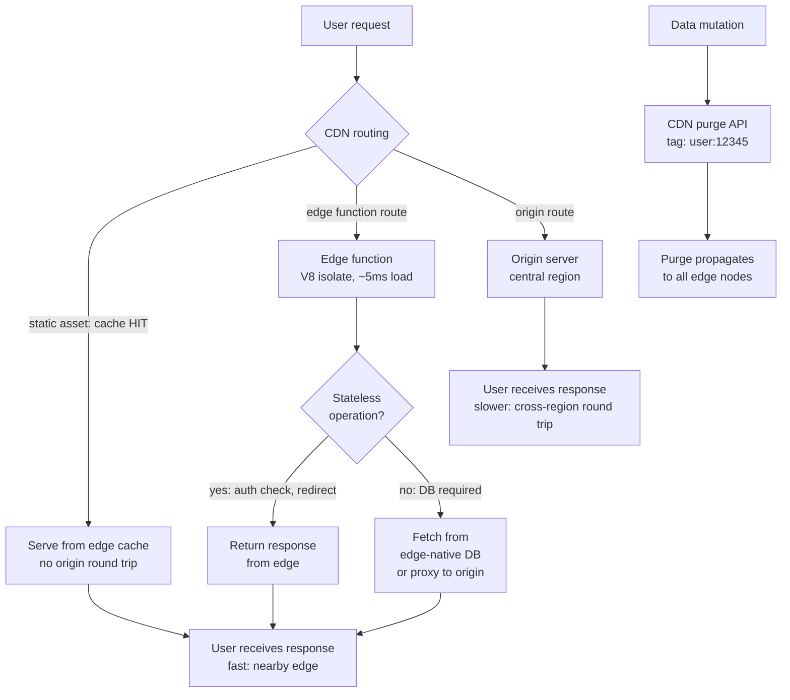

# [FEE-1510] Multi-Region & Edge Deployments

:::info
For users far from a single-region origin, every uncached request pays the full network round trip. A user on the same continent as the origin typically sees round trips on the order of tens of milliseconds; a user on the opposite side of the globe can see round trips an order of magnitude longer. A CDN erases that gap for static assets, because the same cached file lives on every edge node. The remaining latency belongs to dynamic, non-cacheable content, and edge functions are the mechanism this article examines for closing that gap.
:::

## Context

Static assets served from a CDN already have this property for cacheable content: the same immutable file lives on edge nodes worldwide, so distance to origin does not matter. The remaining latency exposure is non-cacheable content: HTML documents served with `no-cache`, API responses, and dynamic server-rendered pages. Edge functions close that gap. They run application code at CDN edge nodes instead of in a central origin, extending low-latency serving to these dynamic responses.

Edge functions introduce a deployment model that differs from a traditional server deployment in a few concrete ways. They run in a restricted JavaScript environment (a V8 isolate), not in a Node.js process with access to the local filesystem and arbitrary npm packages. They deploy to dozens or hundreds of locations simultaneously. And because they run close to the user, they also run far from the origin database: any operation that requires a round trip to a central data store pays the full cross-region latency cost at the edge.

This article covers edge function deployment patterns on Cloudflare Workers, Deno Deploy, Netlify Edge Functions, and Vercel's Routing Middleware, latency-based routing strategies, geo-partitioned data compliance requirements, and cache coherence across distributed edge nodes.

## Visual



## Example

The example below shows Vercel's Routing Middleware, the current name for what Vercel previously shipped as Edge Middleware, running two edge-appropriate checks: an authentication redirect and a GDPR geo-routing rewrite. Routing Middleware runs on Fluid Compute, defaults to the Edge runtime, and executes before the cache and before the rest of the routing decision.

Older tutorials read `request.geo?.country` directly off `NextRequest`. Next.js 15 removed both `geo` and `ip` from `NextRequest`; the replacement lives in the `@vercel/functions` package as `geolocation()` and `ipAddress()`, which read the same request headers Vercel populates at the edge. Code written against the old `request.geo` API silently returns `undefined` on any current Next.js version, so the geo-routing branch below never fires and EU traffic is never rewritten to the EU origin.

```typescript
// middleware.ts (Vercel Routing Middleware)
// Runs at the edge before routing, handling auth redirects and
// geo-based routing without an origin round trip.

import { NextRequest, NextResponse } from 'next/server';
import { geolocation } from '@vercel/functions';

export const config = {
  matcher: ['/((?!_next/static|_next/image|favicon.ico).*)'],
};

const EU_COUNTRIES = new Set([
  'AT', 'BE', 'BG', 'CY', 'CZ', 'DE', 'DK', 'EE', 'ES', 'FI',
  'FR', 'GR', 'HR', 'HU', 'IE', 'IT', 'LT', 'LU', 'LV', 'MT',
  'NL', 'PL', 'PT', 'RO', 'SE', 'SI', 'SK',
]);

export function middleware(request: NextRequest): NextResponse {
  const { pathname } = request.nextUrl;

  // Auth check: redirect unauthenticated users to login.
  // JWT validation runs at the edge; no database round trip required.
  const sessionToken = request.cookies.get('session')?.value;
  if (!sessionToken && !pathname.startsWith('/login')) {
    return NextResponse.redirect(new URL('/login', request.url));
  }

  // Geo routing: route EU users to the GDPR-compliant data region.
  // Only applies to data-access API routes.
  const { country } = geolocation(request);
  if (country && EU_COUNTRIES.has(country) && pathname.startsWith('/api/data')) {
    // Rewrite to the EU origin region. Data stays in the EEA.
    const euOrigin = new URL(request.url);
    euOrigin.hostname = 'eu-api.example.com';
    return NextResponse.rewrite(euOrigin);
  }

  return NextResponse.next();
}
```

## Best Practices

**MUST NOT** send every edge function invocation straight to a single-region database with no pooling or caching layer in front of it. A round trip from an edge node to a distant regional database adds more latency than running the logic at origin would have avoided. A pooling proxy or an edge-aware database driver narrows that gap; neither removes it.

**MUST** classify personal data flowing through edge functions against the applicable data residency regulation before deploying, and verify what the specific storage product's jurisdiction control actually covers. Cloudflare's jurisdictional restrictions apply to Durable Objects, not to Workers KV. Do not assume a residency guarantee that a product's own documentation does not state.

**SHOULD** use edge middleware for stateless, high-frequency operations: authentication header inspection, geolocation redirects, A/B test assignment based on a user cookie, and request rewriting. These benefit the most from running at the edge, regardless of which runtime the middleware executes on.

**SHOULD** configure tag-based CDN invalidation for edge-cached API responses. URL-based invalidation does not scale when many URLs must be invalidated in response to a single data mutation event.

**SHOULD** test edge function compatibility with the edge runtime before committing to edge deployment. Check that all npm dependencies used in the edge function are compatible with the V8 isolate environment by reviewing their use of Node.js-specific APIs.

**SHOULD** monitor edge function error rates and latencies by region. Edge functions in geographically distant regions may experience different error rates, different cold start frequencies, and different latencies than the primary origin region.

**MUST NOT** process or store geo-partitioned personal data in edge functions running outside the jurisdiction that governs that data. Data subject to residency requirements must be routed exclusively to edge nodes within the applicable region or proxied to a compliant origin. Processing data in a non-compliant edge location violates the applicable data residency regulation regardless of where the data originates.

## Design Thinking

### The edge runtime environment

Cloudflare Workers, Deno Deploy, and Netlify Edge Functions (which run on Deno Deploy) all execute in V8 isolates: lightweight JavaScript execution contexts with no access to the Node.js standard library, no local filesystem, and no arbitrary network access outside of the `fetch()` API. The available APIs are a subset of the Web Platform APIs (`Request`, `Response`, `URL`, `TextEncoder`, `crypto.subtle`, and `Cache`), plus platform-specific APIs for key-value stores (Cloudflare KV), durable objects, and AI inference. Vercel's Routing Middleware defaults to the same isolate-based Edge runtime, though it can also be configured to run on Node.js or Bun.

The isolate model has performance characteristics that differ from a container-based Node.js deployment. Cloudflare states that a Worker loads in about 5 milliseconds, and that this load time is normally invisible to the client because it overlaps with the two round trips of the TLS handshake: the isolate warms up while the connection negotiates. That property depends on isolates staying small. Between 2020 and 2025, Cloudflare raised Workers' startup CPU budget from 200ms to 400ms and its script size limit from 1MB to 10MB compressed, and increasingly complex Workers began taking longer to start than a handshake takes to complete. Cloudflare's 2025 fix, worker sharding, routes repeat traffic for a given Worker to servers that already have it warm; Cloudflare reports this cut the measured cold-start rate from about 0.1% to 0.01% of requests. The restriction to platform-approved APIs still applies regardless of load time: many npm packages depend on `fs`, `net`, `http`, `child_process`, or Node.js-specific buffer implementations, and none of those run in a V8 isolate.

Routing Middleware executes before the cache and before routing: it can inspect the incoming request, rewrite the URL, add headers, or return a response before the request reaches an origin. This is the canonical position for auth checks, geolocation routing, and feature flag evaluation, decisions that need to happen on every request and are latency-sensitive. Middleware on Fluid Compute can now open a database connection as well, though a connection to a database far from the invoking region still pays that region's round-trip cost. The tools built for that gap, a connection-pooling proxy such as Cloudflare Hyperdrive, or an HTTP-based serverless driver from a database designed for edge access (Neon's serverless driver, Turso's libSQL client, PlanetScale), reduce the per-request connection overhead. They do not eliminate the distance.

Cloudflare Workers can be placed at different positions in the request flow: as origin servers that handle the entire response, as middleware that proxies to an origin after transformation, or as cache handlers that serve from the Cache API before hitting origin. The position determines the latency characteristics and the cost of the operation.

### Latency-based routing

Latency-based routing directs requests to the nearest available origin region based on the user's geographic location. The CDN performs this routing automatically for static assets because all edge nodes cache the same immutable files. For dynamic requests that must reach an origin, the CDN must be configured to route to the nearest origin region.

Cloudflare's Load Balancing product routes traffic to origin pools based on health check results and geographic proximity. Origins are grouped into pools; each pool corresponds to a deployment region. Requests are routed to the closest healthy pool, measured by round-trip time to the health check endpoint. If the nearest pool is unhealthy, the next nearest pool receives the traffic. This failover behavior is automatic and does not require manual intervention.

Vercel's deployment model automatically routes edge function invocations to the nearest edge region. Functions deployed to the Edge runtime are available at all Vercel edge nodes globally; the routing to the nearest edge node happens transparently in the CDN layer. Functions running on the Node.js runtime run in a specific region chosen at deployment time. For applications that route some requests through edge functions and some to Node.js functions, the round trip from edge to a distant Node.js region adds latency for that path.

DNS-based routing (GeoDNS) is an alternative to CDN-layer routing: DNS resolves different IP addresses for the same hostname depending on the client's geographic location. GeoDNS is less precise than CDN-layer routing because DNS resolution may be cached by ISP resolvers with incorrect geographic attribution. CDN-layer routing based on Anycast addressing is more accurate and does not suffer from DNS caching artifacts.

Choosing a primary origin region requires balancing three factors: physical distance to the largest user population, network distance to the origin database, and legal data sovereignty requirements. A B2B SaaS application with predominantly European users typically selects Frankfurt or Dublin as the primary origin region. Both locations satisfy low latency and EEA data sovereignty requirements at the same time. When an application must serve multiple continental markets, the benefit of adding a second origin region depends on the proportion of traffic that must reach origin rather than being served from CDN edge cache. If the CDN static asset cache hit rate already exceeds 95%, adding a second origin region primarily improves HTML document and API call latency, and the marginal performance benefit relative to the operational complexity must be evaluated explicitly.

### Geo-partitioned data compliance

Data residency regulations restrict where personal data about individuals in a jurisdiction can be processed and stored. GDPR in the European Union, PIPL in China, and various state-level regulations in the United States are the regulations most edge deployments run into. An edge function running in a Singapore edge node that processes personal data about an EU citizen may violate GDPR if the EU requires that the data be processed only within the EEA.

The compliance approach for edge functions is data classification and routing isolation, and the exact mechanism depends on which storage product holds the data. Cloudflare's jurisdictional restrictions let a Durable Object namespace be pinned to the `eu`, `us`, or `fedramp` jurisdiction; data written through a namespace created with that jurisdiction is stored and processed only in data centers in that region. Workers KV has no equivalent per-namespace control: KV is globally replicated by design, so writing EU personal data into a KV namespace and assuming it stays in the EU is incorrect and creates real GDPR exposure. Teams with residency requirements for KV-shaped data should keep that data out of KV and instead proxy it to a compliant origin, or combine Cloudflare's Data Localization Suite features (Regional Services, which controls where HTTPS traffic is decrypted and processed, and Customer Metadata Boundary, which keeps traffic metadata within a region) with the right storage product rather than relying on either as a substitute for choosing it. Vercel does not provide an equivalent jurisdiction-restriction feature for edge function data; applications with strict residency requirements may need to route to a specific origin region rather than to an edge function.

Authentication tokens, session identifiers, and derived user attributes are typically not subject to the same residency restrictions as raw personal data, because they are pseudonymized representations. The specific legal classification varies by jurisdiction and must be reviewed by legal counsel for the specific application. Engineering teams should not make residency compliance determinations independently. The appropriate approach is to identify which data categories flow through edge functions and have legal review determine the applicable requirements.

### Cache coherence across edge nodes

CDN edge nodes maintain independent caches. A resource cached at one edge node is not automatically available at another. When a new version of a resource is deployed, the purge must propagate to all edge nodes before all users receive the updated version. During the purge propagation window, different edge nodes may serve different versions of the same resource.

For immutable resources with content-hash filenames, this is not a problem: the old URL serves the old content and the new URL serves the new content, and both are correct for the page version that references them. Mutable resources, such as the HTML entry point and API responses cached at the edge, are the case that requires active management.

Edge-side caching of API responses introduces its own coherence challenges. An API response cached at an edge node may become stale when the underlying data changes. Cache invalidation at the edge requires the same purge API mechanism as cache invalidation for HTML: the data mutation event must trigger a purge of the cached API response at all edge nodes.

Tag-based invalidation is especially valuable in multi-region edge deployments. When a user updates their profile, the API endpoints that return profile data (`/api/user/profile`, `/api/user/settings`, `/api/user/avatar`) all need to be purged. These endpoints can be tagged with `user:{userId}` at the CDN layer. When the profile is updated, a single CDN API call purges all resources tagged with `user:{userId}` across all edge nodes globally.

Cache-Control headers that set edge cache TTLs must be chosen with the data change frequency in mind. A 60-second TTL for an API response means a user may see data that is up to 60 seconds stale, which is acceptable for most content. Real-time data such as inventory levels, pricing, and availability often needs staleness measured in seconds or less, which makes edge caching inappropriate unless it is paired with aggressive purge-on-write logic.

## Failure Modes

- Running database queries from edge functions against a single-region database: requests that touch the database show latency spikes concentrated in the regions farthest from it, while requests served from cache on the same edge nodes stay fast. It shows up as a per-region split in your latency metrics, not a global slowdown.
- Deploying npm packages with Node.js-specific dependencies to edge runtimes: the deploy either fails at build time with a "module not found" error for `fs`, `http`, or a similar built-in, or, if the bundler did not catch it, the function throws a runtime error the first time the unsupported API executes.
- Assuming all edge nodes receive a cache purge simultaneously: users in different regions see different content for the same URL for a window after a purge call returns success. The purge API confirming the request was accepted is not the same as confirming propagation finished everywhere.
- Processing personal data in edge functions without reviewing data residency requirements: there is no error or log signal for this. The function runs wherever it happens to execute, and the violation surfaces later, in an audit or a regulator inquiry, not in application logs.
- Caching API responses at the edge without a purge-on-write strategy: clients see data that does not match what was just written, for up to the length of the TTL, with nothing in the logs to flag it as wrong.
- Using DNS-based GeoDNS as the primary routing mechanism: a subset of users, correlated with specific ISP resolvers rather than specific geographies, keep landing on a distant region because their resolver cached a stale geographic mapping.

## Related Topics

- [Production Deployment: Static Hosting & CDN](/en/CI%20CD%20and%20Deployment/1504)
- [Deployment Strategies: Canary, Blue-Green & Feature Flags](/en/CI%20CD%20and%20Deployment/1505)
- [Cache Invalidation at Scale](/en/CI%20CD%20and%20Deployment/1508)

## References

- [Cloudflare Workers: Documentation](https://developers.cloudflare.com/workers/)
- [Cloudflare: Eliminating Cold Starts with Cloudflare Workers](https://blog.cloudflare.com/eliminating-cold-starts-with-cloudflare-workers/)
- [Cloudflare: Eliminating Cold Starts 2: Shard and Conquer](https://blog.cloudflare.com/eliminating-cold-starts-2-shard-and-conquer/)
- [Cloudflare: Durable Objects Jurisdictional Restrictions](https://developers.cloudflare.com/durable-objects/reference/data-location/)
- [Cloudflare: Data Localization Suite](https://developers.cloudflare.com/data-localization/)
- [Cloudflare: Hyperdrive](https://developers.cloudflare.com/hyperdrive/)
- [Vercel: Routing Middleware](https://vercel.com/docs/routing-middleware)
- [Vercel: @vercel/functions API Reference (geolocation)](https://vercel.com/docs/functions/functions-api-reference/vercel-functions-package)
- [Deno Deploy](https://deno.com/deploy)
- [Netlify: Edge Functions Overview](https://docs.netlify.com/build/edge-functions/overview/)
- [Fastly: Compute Documentation](https://www.fastly.com/documentation/guides/compute)
- [web.dev: Content Delivery Networks (CDN)](https://web.dev/articles/content-delivery-networks)
- [GDPR: Data Transfer Restrictions](https://gdpr-info.eu/chapter-5/)
