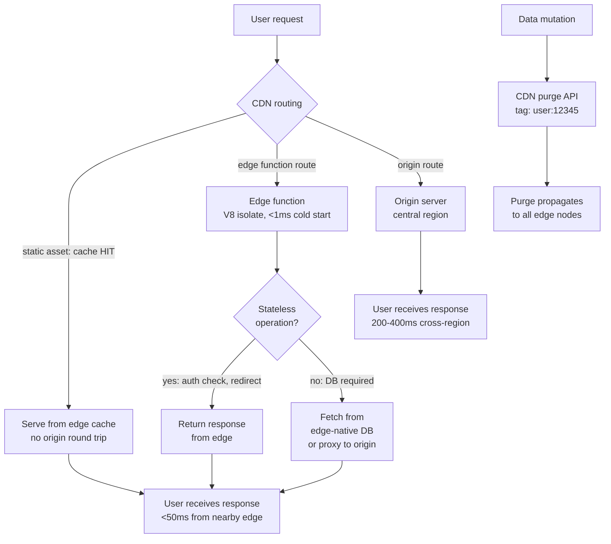

# Multi-Region & Edge Deployments

The latency between a user's browser and the server that serves the
application's resources is a fundamental determinant of performance. For
most applications deployed to a single-region origin, users in the same
city as the origin experience sub-50ms round trips. Users on the other
side of the globe experience 200ms to 400ms per round trip — a difference
that compounds across every uncached request and multiplies with HTTP/2
multiplexing inefficiencies over high-latency connections.

Multi-region and edge deployments address this by moving the serving
infrastructure physically closer to users. Static assets served from a
CDN already have this property for cacheable content. The remaining
latency exposure is for the non-cacheable content: HTML documents served
with `no-cache`, API responses, and dynamic server-rendered pages. Edge
functions — code that runs at CDN edge nodes rather than in a central
origin — extend low-latency serving to these dynamic responses.

Edge functions introduce a deployment model that is categorically different
from traditional server deployments. Edge functions run in a restricted
JavaScript environment (V8 isolates), not in a Node.js process with access
to the local filesystem and arbitrary npm packages. They are deployed to
dozens or hundreds of locations simultaneously. They run close to the user,
which means they also run far from the origin database — any operation that
requires a round trip to a central data store pays the full cross-region
latency cost at the edge.

This article covers edge function deployment patterns with Cloudflare Workers
and Vercel Edge, latency-based routing strategies, geo-partitioned data
compliance requirements, and cache coherence across distributed edge nodes.

## Design Thinking

### The edge runtime environment

Cloudflare Workers and Vercel Edge Functions both execute in V8 isolates:
lightweight JavaScript execution contexts that start in milliseconds, have
no access to the Node.js standard library, no local file system, and no
arbitrary network access outside of the `fetch()` API. The available APIs
are a subset of the Web Platform APIs — `Request`, `Response`, `URL`,
`TextEncoder`, `crypto.subtle`, and `Cache` — plus platform-specific APIs
for key-value stores (Cloudflare KV), durable objects, and AI inference.

The V8 isolate model has performance characteristics that differ from
Node.js. Cold starts in Node.js take hundreds of milliseconds; V8 isolates
start in under 1 millisecond. The absence of cold starts makes edge functions
suitable for high-frequency request handling where each request may be the
first request on a given edge node in some period. The restriction to
platform-approved APIs means that many npm packages are incompatible with
edge runtimes — packages that depend on `fs`, `net`, `http`, `child_process`,
or Node.js-specific buffer implementations will not run in an edge environment.

Vercel Edge Middleware runs before routing: it can inspect the incoming
request, rewrite the URL, add headers, or return a response before the
request reaches the origin. This is the canonical position for auth checks,
geolocation routing, and feature flag evaluation — decisions that need to
happen on every request, are low-latency-sensitive, and do not require
database access.

Cloudflare Workers can be placed at different positions in the request flow:
as origin servers (handling the entire response), as middleware (proxying
to an origin after transformation), or as cache handlers (serving from
the cache API before hitting origin). The position determines the latency
characteristics and the cost of the operation.

### Latency-based routing

Latency-based routing directs requests to the nearest available origin
region based on the user's geographic location. The CDN performs this
routing automatically for static assets because all edge nodes cache the
same immutable files. For dynamic requests that must reach an origin, the
CDN must be configured to route to the nearest origin region.

Cloudflare's Load Balancing product routes traffic to origin pools based
on health check results and geographic proximity. Origins are grouped into
pools; each pool corresponds to a deployment region. Requests are routed
to the closest healthy pool, measured by round-trip time to the health
check endpoint. If the nearest pool is unhealthy, the next nearest pool
receives the traffic. This failover behavior is automatic and does not
require manual intervention.

Vercel's deployment model automatically routes edge function invocations
to the nearest edge region. Functions deployed to Vercel Edge are available
at all Vercel edge nodes globally; the routing to the nearest edge node
happens transparently in the CDN layer. Origin functions (Node.js server
functions) run in a specific region chosen at deployment time. For
applications that route some requests through edge functions and some to
origin functions, the round trip from edge to origin adds latency for
the origin function path.

DNS-based routing (GeoDNS) is an alternative to CDN-layer routing: DNS
resolves different IP addresses for the same hostname depending on the
client's geographic location. GeoDNS is less precise than CDN-layer
routing because DNS resolution may be cached by ISP resolvers with
incorrect geographic attribution. CDN-layer routing based on Anycast
addressing is more accurate and does not suffer from DNS caching artifacts.

Choosing a primary origin region requires balancing three factors: physical distance to the largest user population, network distance to the origin database, and legal data sovereignty requirements. A B2B SaaS application with predominantly European users typically selects Frankfurt or Dublin as the primary origin region — both locations simultaneously satisfy low latency and EEA data sovereignty requirements. When an application must serve multiple continental markets, the benefit of adding a second origin region depends on the proportion of traffic that must reach origin rather than being served from CDN edge cache. If the CDN static asset cache hit rate already exceeds 95%, adding a second origin region primarily improves HTML document and API call latency, and the marginal performance benefit relative to the operational complexity must be evaluated explicitly.

### Geo-partitioned data compliance

Data residency regulations — GDPR in the European Union, PIPL in China,
various state-level regulations in the United States — restrict where
personal data about individuals in a jurisdiction can be processed and
stored. An edge function running in a Singapore edge node that processes
personal data about an EU citizen may violate GDPR if the EU requires
that the data be processed only within the EEA.

The compliance approach for edge functions is data classification and
routing isolation. Personal data that is subject to residency requirements
must be routed to edge nodes in the appropriate region. Cloudflare's
Jurisdictional Restrictions feature allows KV namespaces and Durable Objects
to be restricted to a specific jurisdiction — data written to a restricted
namespace is stored only in data centers in that jurisdiction. Vercel does
not provide equivalent jurisdiction restrictions for edge function data;
applications with strict residency requirements may need to route to
a specific origin region rather than to edge functions.

Authentication tokens, session identifiers, and derived user attributes
are typically not subject to the same residency restrictions as raw
personal data, because they are pseudonymized representations. The specific
legal classification varies by jurisdiction and must be reviewed by legal
counsel for the specific application. Engineering teams should not make
residency compliance determinations independently; the appropriate approach
is to identify which data categories flow through edge functions and have
legal review determine the applicable requirements.

### Cache coherence across edge nodes

CDN edge nodes maintain independent caches. A resource cached at one edge
node is not automatically available at another. When a new version of a
resource is deployed, the purge must propagate to all edge nodes before
all users receive the updated version. During the purge propagation window,
different edge nodes may serve different versions of the same resource.

For immutable resources with content-hash filenames, this is not a problem:
the old URL serves the old content and the new URL serves the new content.
Both are correct for the page version that references them. For mutable
resources — the HTML entry point, API responses cached at the edge — cache
coherence requires active management.

Edge-side caching of API responses introduces its own coherence challenges.
An API response cached at an edge node may become stale when the underlying
data changes. Cache invalidation at the edge requires the same purge API
mechanism as cache invalidation for HTML: the data mutation event must
trigger a purge of the cached API response at all edge nodes.

Tag-based invalidation is especially valuable in multi-region edge
deployments. When a user updates their profile, the API endpoints that return
profile data — `/api/user/profile`, `/api/user/settings`, `/api/user/avatar` —
all need to be purged. These endpoints can be tagged with `user:{userId}`
at the CDN layer. When the profile is updated, a single CDN API call purges
all resources tagged with `user:{userId}` across all edge nodes globally.

Cache-Control headers that set edge cache TTLs must be chosen with the
data change frequency in mind. A 60-second TTL for an API response means
a user may see data that is up to 60 seconds stale. For most content, this
is acceptable. For real-time data — inventory levels, pricing, availability
— the acceptable staleness may be seconds or less, making edge caching
inappropriate unless paired with aggressive purge-on-write logic.

## Best Practices

**MUST NOT** use edge functions for operations that require a round trip
to a centralized database that does not have edge-native replication. The
round-trip latency from an edge node to a single-region database adds more
latency than running the function at origin would have avoided.

**MUST** classify personal data flowing through edge functions against the
applicable data residency regulations before deploying. Do not rely on
the assumption that pseudonymized data is exempt from residency requirements
without legal review.

**SHOULD** use edge middleware for stateless, high-frequency operations:
authentication header inspection, geolocation redirects, A/B test assignment
based on a user cookie, and request rewriting. These operations have no
database dependency and benefit maximally from running at the edge.

**SHOULD** configure tag-based CDN invalidation for edge-cached API responses.
URL-based invalidation does not scale when many URLs must be invalidated
in response to a single data mutation event.

**SHOULD** test edge function compatibility with the edge runtime before
committing to edge deployment. Check that all npm dependencies used in the
edge function are compatible with the V8 isolate environment by reviewing
their use of Node.js-specific APIs.

**SHOULD** monitor edge function error rates and latencies by region. Edge
functions in geographically distant regions may experience different error
rates, different cold start frequencies, and different latencies than the
primary origin region.

**MUST NOT** process or store geo-partitioned personal data in edge functions running outside the jurisdiction that governs that data. Data subject to residency requirements must be routed exclusively to edge nodes within the applicable region or proxied to a compliant origin; processing data in a non-compliant edge location violates the applicable data residency regulation regardless of where the data originates.

## Visual



## Example

```typescript
// edge-middleware.ts (Vercel Edge Middleware)
// Runs at the edge before routing, handling auth redirects and
// geo-based routing without an origin round trip.

import { NextRequest, NextResponse } from 'next/server';

export const config = {
  matcher: ['/((?!_next/static|_next/image|favicon.ico).*)'],
};

const EU_COUNTRIES = new Set([
  'AT', 'BE', 'BG', 'CY', 'CZ', 'DE', 'DK', 'EE', 'ES', 'FI',
  'FR', 'GR', 'HR', 'HU', 'IE', 'IT', 'LT', 'LU', 'LV', 'MT',
  'NL', 'PL', 'PT', 'RO', 'SE', 'SI', 'SK',
]);

export function middleware(request: NextRequest): NextResponse {
  const { pathname } = request.nextUrl;

  // Auth check: redirect unauthenticated users to login
  // JWT validation runs at edge — no database round trip required
  const sessionToken = request.cookies.get('session')?.value;
  if (!sessionToken && !pathname.startsWith('/login')) {
    return NextResponse.redirect(new URL('/login', request.url));
  }

  // Geo routing: route EU users to GDPR-compliant data region
  // Only applies to data-access API routes
  const country = request.geo?.country;
  if (country && EU_COUNTRIES.has(country) && pathname.startsWith('/api/data')) {
    // Rewrite to EU origin region — data stays in EEA
    const euOrigin = new URL(request.url);
    euOrigin.hostname = 'eu-api.example.com';
    return NextResponse.rewrite(euOrigin);
  }

  return NextResponse.next();
}
```

## Common Mistakes

- Running database queries from edge functions against a single-region
  database — the database round trip from edge adds more latency than
  running the logic at origin
- Deploying npm packages with Node.js-specific dependencies to edge runtimes
  — packages using `fs`, `http`, or Node.js buffers fail silently or throw
  at runtime in V8 isolate environments
- Assuming all edge nodes receive a cache purge simultaneously — purge
  propagation takes seconds to minutes; design for the window during which
  different nodes serve different versions
- Processing personal data in edge functions without reviewing data residency
  requirements — EU personal data processed in a non-EEA edge node may
  violate GDPR, regardless of where the data originates
- Caching API responses at the edge without a purge-on-write strategy —
  edge-cached data becomes stale when underlying data changes without
  triggering an invalidation
- Using DNS-based GeoDNS as the primary routing mechanism — DNS TTL caching
  by ISP resolvers produces inaccurate geographic routing; CDN Anycast is
  more precise

## Related FEEs

- FEE-1504: Production Deployment: Static Hosting & CDN
- FEE-1505: Deployment Strategies: Canary, Blue-Green & Feature Flags
- FEE-1508: Cache Invalidation at Scale

## References

- [Cloudflare Workers: Documentation](https://developers.cloudflare.com/workers/)
- [Vercel: Edge Middleware](https://vercel.com/docs/functions/edge-middleware)
- [Cloudflare: Jurisdictional Restrictions](https://developers.cloudflare.com/data-localization/regional-services/)
- [Fastly: Compute@Edge Documentation](https://developer.fastly.com/learning/compute/)
- [web.dev: Content delivery networks (CDN)](https://web.dev/content-delivery-networks/)
- [GDPR: Data transfer restrictions](https://gdpr-info.eu/chapter-5/)
