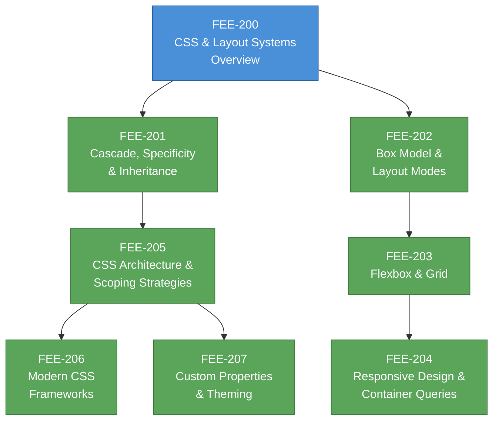

# [FEE-200] CSS & Layout Systems Overview

:::info
This category covers CSS as a declarative styling language -- from its cascade and box model foundations through modern layout systems, responsive techniques, architecture strategies, and theming with custom properties.
:::

## Context

Cascading Style Sheets is the web's sole styling language. Every visual aspect of a web page -- color, spacing, typography, layout, animation -- is ultimately expressed in CSS. Understanding CSS is not optional for frontend engineers; it is as fundamental as understanding HTML structure or JavaScript behavior.

CSS was born from a specific need. In 1994, the early Web had no mechanism for separating a document's presentation from its structure. Hakon Wium Lie, working at CERN alongside Tim Berners-Lee, proposed "Cascading HTML Style Sheets" on October 10, 1994. The key innovation was the **cascade**: a system where multiple stylesheets from different sources (browser defaults, user preferences, author styles) could each contribute rules, with a defined algorithm to resolve conflicts. This concept of negotiated presentation -- rather than absolute author control -- remains central to CSS today.

### Evolution

| Era | Year(s) | What changed |
|-----|---------|-------------|
| **CSS1** | 1996 | First W3C Recommendation. Fonts, colors, text, basic box model. |
| **CSS2** | 1998 | Positioning, z-index, media types, attribute selectors. |
| **CSS2.1** | 2004-2011 | Errata and corrections reflecting actual browser behavior. |
| **CSS3 Modules** | 2011+ | Monolithic spec abandoned. Individual modules (Selectors L3, Flexbox, Grid, etc.) advance independently. |
| **Modern CSS** | 2022+ | Cascade layers, container queries, `:has()`, nesting, subgrid, view transitions. |

A critical shift happened after CSS2.1: the W3C stopped developing CSS as a single specification. Instead, each feature area became an independent **module** with its own level number. There is no "CSS4" -- there is CSS Color Level 4, CSS Grid Level 2, CSS Nesting Level 1, and so on. The W3C CSS Snapshot (most recently 2023, with 2025 in progress) periodically collects the stable modules into a single reference document.

### Why CSS matters for frontend engineers

Frameworks abstract markup and logic, but they do not abstract CSS. Whether you write Tailwind utility classes, CSS Modules, or styled-components, you are still authoring CSS rules that the browser must interpret through the cascade, compute into the box model, and resolve into layout. When a layout breaks or a style leaks across components, debugging requires understanding the underlying language -- not the abstraction layer.

## Design Thinking

### Why CSS is a separate language

The web platform is built on a deliberate **separation of concerns**:

- **HTML** declares structure and semantics (what the content *is*)
- **CSS** declares presentation (how the content *looks*)
- **JavaScript** declares behavior (how the content *responds*)

This separation is not accidental. CSS is a **declarative** language: you describe constraints and desired outcomes, not step-by-step drawing instructions. This design enables:

1. **Multiple stylesheets from different sources.** The cascade algorithm merges browser defaults, user preferences, and author styles into a single computed result. An imperative drawing API cannot compose styles from independent sources.

2. **Media adaptation.** The same HTML can be styled differently for screen, print, small viewports, or high-contrast modes -- by swapping or layering stylesheets, not rewriting logic.

3. **Accessibility.** Users can override author styles (e.g., forced-colors mode, custom font sizes) because CSS rules are *suggestions* that participate in a priority system, not absolute commands.

4. **Performance.** The browser can optimize a declarative style system in ways that are impossible with imperative drawing. Style recalculation, layout batching, and compositor-driven animations all depend on CSS being declarative.

### Why CSS feels "hard"

CSS has a reputation for being unpredictable. This is not because CSS is poorly designed -- it is because CSS is a **constraint-based layout system**, not an imperative drawing API.

When you write `display: flex; justify-content: center`, you are not telling the browser "put this element at x=200, y=150." You are declaring constraints, and the browser's layout engine solves for positions that satisfy all constraints simultaneously -- your rules, the content's intrinsic size, the viewport dimensions, and other elements' constraints.

This means:
- **Context matters.** The same rule produces different results depending on the parent's layout mode, sibling elements, and available space.
- **Interactions are combinatorial.** Properties do not act in isolation; `width`, `padding`, `border`, `box-sizing`, `flex-shrink`, and `overflow` all interact.
- **Debugging requires understanding the system**, not just the property. You cannot reason about a single CSS rule without understanding the cascade, specificity, inheritance, the box model, and the active layout algorithm.

The articles in this category build that understanding systematically.

## Visual

**Reading order:** Start with the cascade (201) and box model (202) -- these are the foundation everything else builds on. Layout (203) and responsive design (204) follow naturally. Architecture (205) and frameworks (206) address scaling CSS in real projects. Custom properties (207) can be read at any point after the cascade.

## Related FEEs

| FEE | Relationship |
|-----|-------------|
| [FEE-100 HTML & Semantic Markup](../HTML%20and%20Semantic%20Markup/100.md) | CSS styles the structure that HTML provides. Understanding semantic HTML helps you write selectors that are meaningful and maintainable. |
| [FEE-300 JavaScript Core & Runtime](../JavaScript%20Core%20and%20Runtime/300.md) | JS manipulates styles at runtime (CSSOM, animations, dynamic theming). Understanding CSS independently prevents over-reliance on JS for styling. |
| [FEE-500 Component Architecture](../Component%20Architecture%20and%20Design%20Patterns/500.md) | Component models (Web Components, React, Vue) each have different CSS scoping strategies. Architecture decisions in FEE-205 directly feed into component design. |

## References

- [W3C CSS Snapshot 2023](https://www.w3.org/TR/css-2023/) -- Authoritative list of stable CSS modules and their status levels
- [MDN: CSS - Cascading Style Sheets](https://developer.mozilla.org/en-US/docs/Web/CSS) -- Comprehensive reference and learning resource for all CSS modules
- [W3C: A Brief History of CSS](https://www.w3.org/Style/CSS20/history.html) -- Official history of CSS from its origins at CERN through CSS3 modularization
- [Hakon Wium Lie, PhD Thesis: Cascading Style Sheets](https://www.wiumlie.no/2006/phd/) -- The original designer's academic treatment of the cascade concept and its design rationale
- [W3C: CSS Process - Levels, Snapshots, Modules](https://www.w3.org/Style/2011/CSS-process.en.html) -- Explanation of how CSS specifications are developed and versioned
