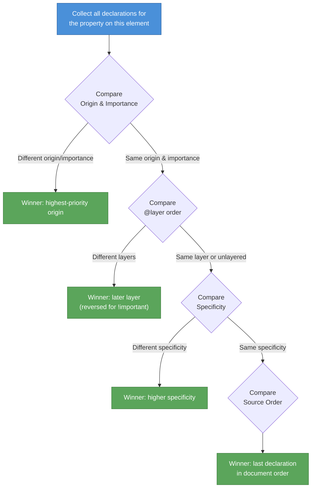

# [FEE-201] The Cascade, Specificity & Inheritance

:::info
CSS resolves competing style declarations through a layered algorithm: origin, importance, cascade layers, specificity, and source order. Understanding this algorithm is the single most important step toward predictable styling. You SHOULD use `@layer` to organize stylesheet precedence. You SHOULD prefer `:where()` for resets and base styles where zero specificity is desirable.
:::

## Context

Every HTML element can receive style declarations from many sources simultaneously: the browser's built-in stylesheet, user preferences (accessibility settings, reader mode), third-party libraries, your design-system tokens, component-scoped rules, and utility overrides. When two or more declarations target the same property on the same element, the browser must pick exactly one winner.

The **cascade** is the algorithm that makes this decision. It is not a single rule -- it is a multi-step sorting procedure defined in the W3C CSS Cascading and Inheritance Level 5 specification. Misunderstanding any step leads to the symptoms frontend engineers know well: styles that "don't apply," specificity arms races, scattered `!important` flags, and CSS that only works if loaded in a precise order.

This article explains each step of the cascade, how specificity is calculated, which properties inherit and which do not, and how modern features -- `@layer`, `:where()`, `:is()` -- give developers new tools to manage complexity.

## Design Thinking

### Why the cascade exists

The web was designed so that multiple parties contribute styles to a single document. Hakon Wium Lie's original 1994 proposal described a system of "cascading" stylesheets where no single source has absolute control. This design serves several purposes:

1. **Browser defaults must exist.** Without a user-agent stylesheet, an `<h1>` would look identical to a `<span>`. Browsers provide sensible defaults that authors build upon rather than replace from scratch.

2. **Users need override power.** Accessibility features like forced-colors mode, minimum font sizes, and high-contrast themes require that user preferences can outrank author styles in specific circumstances.

3. **Libraries and author code must coexist.** A project may import normalize.css, a component library, a design-system token layer, and application-specific styles. The cascade provides a deterministic algorithm to resolve conflicts across all of these.

4. **Progressive enhancement is possible.** Because the cascade merges styles rather than replacing them wholesale, adding a new stylesheet does not require rewriting existing ones.

### How frameworks bypass or embrace the cascade

Different CSS strategies handle cascade complexity in different ways:

| Strategy | Mechanism | Cascade relationship |
|----------|-----------|---------------------|
| **CSS Modules** | Generates unique class names at build time (e.g., `.Button_root_x7k2`) | Avoids conflicts by making selectors globally unique -- specificity is always `(0,1,0)`. |
| **Tailwind CSS** | Flat utility classes applied directly in markup | All utilities share roughly equal specificity `(0,1,0)`. Source order in the generated stylesheet determines the winner. |
| **Vue scoped styles** | Adds a `data-v-xxxx` attribute to elements and selectors | Specificity increases by one attribute selector `(0,1,0)` per scope level. |
| **Shadow DOM** | Hard style encapsulation; external styles cannot penetrate | Completely bypasses the cascade boundary. Only inherited properties cross the shadow boundary. |
| **CSS-in-JS** (styled-components, Emotion) | Generates unique class names at runtime | Similar to CSS Modules -- avoids conflicts through uniqueness rather than cascade management. |
| **`@layer`** | CSS-native cascade ordering | Embraces the cascade directly. Layer order determines precedence before specificity is even considered. |

The key insight: most framework strategies work *around* the cascade because developers historically lacked tools to work *with* it. `@layer` is the CSS-native answer to the specificity arms race -- it lets you declare explicit precedence tiers without abandoning the cascade model.

### When to use @layer

Use `@layer` whenever you need predictable precedence across style categories:

```css
/* Declare layer order upfront -- first declared = lowest precedence */
@layer reset, base, components, utilities;
```

This single line guarantees that utility styles always beat component styles, component styles always beat base styles, and base styles always beat resets -- regardless of selector specificity within each layer.

## Best Practices

**Prefer low-specificity selectors.** You SHOULD write selectors using class names with a specificity of `(0,1,0)` or lower rather than ID selectors or long descendant chains. Low-specificity selectors are easier to override when needed and prevent the specificity arms race that leads to unmaintainable stylesheets. Reserve higher-specificity selectors only for cases where isolation is genuinely required.

**Avoid `!important` except for intentional utility overrides.** You SHOULD NOT use `!important` as a quick fix for specificity problems. The only legitimate use cases are utility classes that MUST always win (e.g., `.hidden { display: none !important; }`) and accessibility overrides that need to survive all author styles. When you feel the urge to use `!important`, treat it as a signal that your layer or specificity architecture needs revision.

**Use the cascade intentionally through `@layer` ordering.** You SHOULD declare your layer stack at the top of your entry stylesheet and import all third-party CSS into named layers. Explicit layer ordering lets you express precedence as architecture rather than fighting it selector-by-selector. Unlayered author styles always beat layered ones, so any rule you write outside a layer automatically serves as a high-priority override.

**Treat inheritance as a feature, not a bug.** You SHOULD rely on text-related properties (`color`, `font-family`, `font-size`, `line-height`) flowing down the DOM tree rather than redeclaring them on every child. Setting typographic properties on a container element and letting them inherit reduces repetition and creates a single source of truth for design tokens. Use `inherit` explicitly only when you need a non-inherited property (e.g., `border`, `background`) to propagate.

## Principle

### The cascade algorithm

The cascade resolves competing declarations through a strict sequence of criteria. The browser evaluates each criterion in order; once a winner is found, later criteria are not consulted.



### Step 1: Origin and importance

CSS defines three origins. For **normal** (non-`!important`) declarations, the precedence from lowest to highest is:

1. **User-agent** -- browser default styles
2. **User** -- reader/accessibility overrides
3. **Author** -- your stylesheets

For **`!important`** declarations, this order **reverses**:

1. Author `!important` (lowest among important)
2. User `!important`
3. User-agent `!important` (highest)

This reversal is intentional: it ensures that accessibility-critical user preferences and browser protections cannot be overridden by author `!important` declarations. CSS transitions and animations also have special positions in the cascade -- transitions sit at the very top, and animations override normal declarations but lose to `!important`.

### Step 2: Cascade layers (@layer)

Within the same origin and importance level, cascade layers provide the next sorting criterion. Layers are ordered by their first appearance in the stylesheet:

```css
@layer reset, base, components, utilities;

@layer reset {
  *, *::before, *::after { box-sizing: border-box; margin: 0; }
}

@layer utilities {
  .sr-only { /* screen reader only */
    position: absolute;
    width: 1px;
    height: 1px;
    overflow: hidden;
    clip-path: inset(50%);
  }
}
```

For **normal** declarations: later layers win. Unlayered styles (not inside any `@layer`) sit above all layers and win over any layered style.

For **`!important`** declarations: the order reverses. Earlier layers win, and unlayered `!important` has the **lowest** priority among important declarations in the same origin. This reversal is symmetric with the origin reversal -- it gives "defensive" layers (like resets) the ability to protect their `!important` rules.

**Importing third-party CSS into a layer:**

```css
@import url("normalize.css") layer(reset);
@import url("design-system.css") layer(base);

@layer reset, base, components, utilities;
```

This ensures third-party styles never accidentally outrank your component or utility rules, regardless of their internal specificity.

### Step 3: Specificity

When origin, importance, and layer are all equal, the browser compares **specificity**. Specificity is a three-component weight calculated from the selector:

| Column | Counts | Examples |
|--------|--------|----------|
| **ID** (a) | Number of ID selectors | `#nav`, `#main-header` |
| **Class** (b) | Classes, attribute selectors, pseudo-classes | `.active`, `[type="text"]`, `:hover`, `:nth-child(2)` |
| **Type** (c) | Element selectors, pseudo-elements | `div`, `p`, `::before`, `::after` |

The universal selector `*`, combinators (`+`, `>`, `~`, ` `), and `:where()` contribute **nothing** to specificity.

Comparison is performed column by column, left to right:

```
(1,0,0)  >  (0,9,9)   -- one ID always beats any number of classes
(0,2,0)  >  (0,1,9)   -- two classes beat one class + any types
(0,1,1)  =  (0,1,1)   -- tie: fall through to source order
```

### Step 4: Source order

When all previous criteria produce a tie, the **last** declaration in document order wins. Stylesheets are ordered by their `<link>` or `@import` sequence, and within a single stylesheet, later rules override earlier ones.

### Inline styles

Inline styles (`style="..."` attribute) conceptually sit in their own layer above all author normal declarations. They can only be overridden by `!important` rules or by higher-origin styles.

### Specificity of pseudo-class functions

Two pseudo-class functions have special specificity behavior that is critical to understand:

**`:where()`** -- always zero specificity `(0,0,0)`:

```css
:where(#sidebar, .widget, footer) a {
  color: blue;
  /* Specificity: (0,0,1) -- only the `a` type selector counts */
}
```

**`:is()`** -- specificity of its most specific argument:

```css
:is(#sidebar, .widget, footer) a {
  color: red;
  /* Specificity: (1,0,1) -- #sidebar contributes (1,0,0) + a contributes (0,0,1) */
}
```

**`:not()` and `:has()`** also take the specificity of their most specific argument, just like `:is()`.

### Inheritance

Not every CSS property participates in the cascade for every element. When an element has no declaration (from any source) for a given property, the browser must still assign a value. It does so through **inheritance** or **initial values**:

- **Inherited properties** receive the computed value from their parent element. These are typically text-related: `color`, `font-family`, `font-size`, `line-height`, `text-align`, `visibility`, `cursor`, `list-style`, and others.

- **Non-inherited properties** receive the property's defined initial value. Box-model and layout properties typically do not inherit: `margin`, `padding`, `border`, `width`, `height`, `display`, `position`, `background`, `overflow`.

### Explicit defaulting keywords

CSS provides five keywords to manually control inheritance and defaulting:

| Keyword | Behavior |
|---------|----------|
| `inherit` | Use the parent's computed value, even for non-inherited properties. |
| `initial` | Use the property's spec-defined initial value (not the browser default). |
| `unset` | Acts as `inherit` for inherited properties, `initial` for non-inherited. |
| `revert` | Roll back to the previous origin's value (e.g., author back to user-agent). |
| `revert-layer` | Roll back to the value from the previous cascade layer. |

`revert` is particularly useful for component resets -- it restores browser defaults without you needing to know what those defaults are. `revert-layer` is the layer-aware equivalent, essential for `@layer`-based architectures.

## Visual

The following diagram shows the complete cascade precedence from lowest to highest:

```
 Lowest priority                                          Highest priority
 +------------------------------------------------------------------+
 |                                                                  |
 |  NORMAL declarations                                             |
 |  +-----------+  +---------+  +--------+  +------------+         |
 |  | UA styles |  |  User   |  | Author |  | Author     |         |
 |  | (browser) |  | styles  |  | layers |  | unlayered  |         |
 |  +-----------+  +---------+  | (first |  +------------+         |
 |                               |  ...   |  +--------+            |
 |                               | last)  |  | Inline |            |
 |                               +--------+  +--------+            |
 |                                                                  |
 |  !IMPORTANT declarations (reversed)                              |
 |  +------------+  +--------+  +---------+  +-----------+         |
 |  | Author     |  | Author |  |  User   |  | UA styles |         |
 |  | unlayered  |  | layers |  |  !imp   |  | !important|         |
 |  | !important |  | (last  |  +---------+  +-----------+         |
 |  +------------+  |  ...   |                                      |
 |                   | first) |                                      |
 |                   +--------+                                      |
 |                                                                  |
 +------------------------------------------------------------------+
```

## Example

### 1. Specificity calculation for competing selectors

```css
/* Selector A: specificity (1, 0, 1) */
#content p {
  color: blue;
}

/* Selector B: specificity (0, 2, 1) */
.main .intro p {
  color: green;
}

/* Selector C: specificity (0, 1, 3) */
section div.content p {
  color: red;
}
```

**Winner for a `<p>` matching all three:** Selector A, because the ID column (1) beats any number of classes. The comparison:

```
A: (1, 0, 1)  -- 1 ID
B: (0, 2, 1)  -- 0 IDs, 2 classes
C: (0, 1, 3)  -- 0 IDs, 1 class, 3 types

A wins. ID column is compared first.
```

### 2. @layer for ordering library vs component vs utility

```css
/* 1. Declare layer order */
@layer reset, vendor, components, utilities;

/* 2. Import third-party library into a controlled layer */
@import url("some-ui-lib.css") layer(vendor);

/* 3. Reset layer -- lowest precedence */
@layer reset {
  *,
  *::before,
  *::after {
    box-sizing: border-box;
    margin: 0;
    padding: 0;
  }
}

/* 4. Component layer */
@layer components {
  .card {
    padding: 1rem;
    border: 1px solid #ddd;
    border-radius: 8px;
    background: white;
  }

  .card__title {
    font-size: 1.25rem;
    font-weight: 600;
  }
}

/* 5. Utility layer -- highest layered precedence */
@layer utilities {
  .mt-4 { margin-top: 1rem; }
  .hidden { display: none; }
  .text-center { text-align: center; }
}
```

Even if `some-ui-lib.css` contains `#app .card { padding: 2rem; }` with high specificity `(1,1,0)`, the component layer's `.card` rule `(0,1,0)` wins because the `components` layer is declared after `vendor`. Specificity is never compared across layers.

### 3. :where() vs :is() difference

```css
/* Using :where() -- specificity (0, 0, 1) */
:where(.nav, #sidebar) a {
  color: steelblue;
  text-decoration: none;
}

/* Using :is() -- specificity (1, 0, 1) because #sidebar is the highest argument */
:is(.nav, #sidebar) a {
  color: darkred;
  text-decoration: underline;
}

/* Plain type selector -- specificity (0, 0, 1) */
a {
  color: black;
}
```

**Results:**

- For an `<a>` inside `#sidebar`: the `:is()` rule wins with `(1,0,1)`. The `:where()` rule has only `(0,0,1)` and ties with the plain `a` rule -- source order breaks the tie.
- For an `<a>` inside `.nav` but not `#sidebar`: the `:is()` rule still wins with `(1,0,1)` because `:is()` always uses the highest-specificity argument regardless of which one matched.

**Practical guidance:** Use `:where()` for base/reset styles that should be easily overridable. Use `:is()` when you want the convenience of selector grouping but need normal specificity behavior.

## Deep Dive

### Specificity scoring algorithm

Specificity is represented as a three-component tuple `(A, B, C)` where:

- **A** counts ID selectors (`#nav`, `#main-header`)
- **B** counts class selectors (`.active`), attribute selectors (`[type="text"]`), and pseudo-classes (`:hover`, `:nth-child(2)`)
- **C** counts element/type selectors (`div`, `p`) and pseudo-elements (`::before`, `::after`)

The universal selector `*`, combinators, and `:where()` contribute zero to all columns.

Comparison is strictly **left-to-right**: the A column is compared first, and if it differs, the winner is decided immediately without ever looking at B or C. This means one ID selector `(1,0,0)` beats any number of class selectors `(0,999,0)`. Only when A is equal does the browser proceed to compare B; only when B is also equal does it compare C.

```
(1, 0, 0)  vs  (0, 15, 10)  →  A differs → (1,0,0) wins
(0, 3, 0)  vs  (0,  2, 10)  →  A ties → B differs → (0,3,0) wins
(0, 2, 1)  vs  (0,  2,  1)  →  All tie → fall through to source order
```

### `!important` and the cascade tier model

`!important` does not simply "win" — it promotes a declaration into a separate **important tier** that is evaluated entirely before the normal tier. Within the important tier, the cascade algorithm runs again from scratch with origin order reversed (user-agent `!important` > user `!important` > author `!important`). For author-origin rules, unlayered `!important` has the *lowest* priority among important declarations, and earlier layers beat later layers (the reverse of normal ordering). This symmetry is intentional: it ensures that defensive rules in early layers (e.g., a browser reset) can protect their `!important` declarations from being overridden by later application layers.

### `@layer` ordering rules

Three rules govern how cascade layers resolve precedence:

1. **Unlayered styles always beat layered styles** (for normal declarations). Any author rule written outside an `@layer` block sits above all layered rules, regardless of specificity. This is why you can write low-specificity unlayered overrides that still beat high-specificity library rules placed in a vendor layer.

2. **Within layers, later-declared layers win** (for normal declarations). The first `@layer` statement in the stylesheet establishes the order; a layer declared later has higher precedence. `@layer reset, base, components, utilities` means `utilities` rules beat `components` rules beat `base` rules beat `reset` rules — specificity is irrelevant across layer boundaries.

3. **For `!important` declarations, both rules reverse.** Layered `!important` beats unlayered `!important`, and earlier layers beat later layers. This mirrors the origin reversal and enables defensive layers to guard critical rules.

## Common Mistakes

### 1. Confusing :where() and :is() specificity

**The mistake:** Assuming `:is()` has zero specificity like `:where()`, then wondering why your overrides fail:

```css
/* Developer thinks this has low specificity */
:is(#theme-dark) .heading { color: white; }

/* This override fails -- specificity is (1, 1, 0), not (0, 1, 0) */
.heading { color: black; }
```

**The fix:** Remember: `:where()` = zero specificity, `:is()` = highest argument. If you want low specificity, use `:where()` explicitly.

### 2. Assuming all properties inherit

**The mistake:** Expecting `padding`, `margin`, or `border` to cascade from parent to child:

```css
.container {
  padding: 2rem;
  color: navy;
}

.container p {
  /* color: navy is inherited -- correct */
  /* padding: 2rem is NOT inherited -- p gets its initial padding (0) */
}
```

**The fix:** Know which properties inherit (mostly text/font properties) and which do not (mostly box-model/layout properties). When you need a non-inherited property to propagate, use `inherit` explicitly:

```css
.child {
  border: inherit; /* Explicitly inherit from parent */
}
```

## Related FEEs

| FEE | Relationship |
|-----|-------------|
| [FEE-200 CSS & Layout Systems Overview](./200.md) | Parent overview. The cascade is the first topic in the CSS category because all other CSS behavior depends on understanding how styles are resolved. |
| [FEE-205 CSS Architecture & Scoping Strategies](./205.md) | Architecture strategies (BEM, ITCSS, CSS Modules, scoped styles) are all responses to cascade complexity. `@layer` provides a CSS-native alternative. |
| [FEE-207 Custom Properties & Theming](./207.md) | Custom properties inherit by default and participate in the cascade. Theming systems rely on inheritance flowing through the DOM tree. |

## References

- [W3C CSS Cascading and Inheritance Level 5](https://www.w3.org/TR/css-cascade-5/) -- The authoritative specification defining the cascade algorithm, origins, layers, specificity, and inheritance
- [MDN: Introducing the CSS Cascade](https://developer.mozilla.org/en-US/docs/Web/CSS/Cascade) -- Comprehensive guide to the cascade algorithm with interactive examples
- [MDN: Specificity](https://developer.mozilla.org/en-US/docs/Web/CSS/Specificity) -- Detailed specificity calculation rules, examples, and special cases
- [MDN: @layer](https://developer.mozilla.org/en-US/docs/Web/CSS/@layer) -- Reference for cascade layer syntax, ordering, and browser support
- [Bramus Van Damme: The Future of CSS: Cascade Layers](https://www.bram.us/2021/09/15/the-future-of-css-cascade-layers-css-at-layer/) -- In-depth exploration of cascade layers, the problems they solve, and practical adoption patterns
