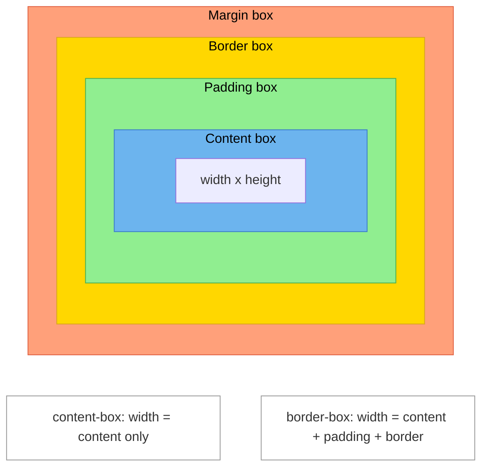

# [FEE-202] Box Model & Layout Modes

:::info
Every element on the web is a rectangular box. CSS defines how that box is sized (box model), how boxes arrange relative to each other (layout modes), how they stack in the z-axis (stacking contexts), and how the `display` property controls both outer participation and inner layout. You SHOULD use `border-box` globally via a universal reset. You SHOULD use `display: flow-root` to create a Block Formatting Context instead of relying on `overflow: hidden`.
:::

## Context

HTML elements are rendered as rectangular boxes. The CSS box model defines the four areas that make up every box -- content, padding, border, and margin -- and the `box-sizing` property determines which of these areas the `width` and `height` properties control.

But sizing is only one piece of the puzzle. Once boxes are sized, the browser must decide *where* to place them. CSS provides multiple **layout modes** (also called formatting contexts) for this purpose: normal flow (block and inline), floats, positioning (static, relative, absolute, fixed, sticky), and the modern layout algorithms flexbox and grid. Each mode has its own rules for how children are arranged.

On top of spatial positioning, CSS must also resolve *layering* -- which element paints on top of which. This is governed by **stacking contexts**, an independent hierarchy that determines z-axis ordering.

Finally, the `display` property ties everything together. Historically written as a single keyword (`block`, `inline-block`, `flex`), it actually controls two independent behaviors: the element's **outer** display type (how it participates in its parent's layout) and its **inner** display type (which layout algorithm it uses for its children). The modern two-value syntax makes this explicit.

This article covers all four topics -- the box model, layout modes, stacking contexts, and display -- as one coherent system.

## Design Thinking

### Why CSS has multiple layout modes

CSS was born in 1996 as a styling language for *documents*. The original layout model -- **normal flow** -- was designed for text: block-level elements stack vertically like paragraphs, and inline-level elements flow horizontally like words in a sentence. This model works beautifully for articles, papers, and reports.

When developers needed more complex layouts (sidebars, multi-column designs), the only tool available was **float**. `float` was designed for wrapping text around images, not for page layout -- but it was hacked into service for over a decade. The era of float-based layouts (2000-2012) produced fragile, clearfix-riddled CSS that was difficult to maintain.

**Flexbox** (CSS Flexible Box Layout, 2012) was the first layout algorithm purpose-built for application UI. It solves one-dimensional distribution: aligning items along a single axis with control over spacing, wrapping, and order. **Grid** (CSS Grid Layout, 2017) followed as a two-dimensional layout system, allowing explicit row and column tracks.

This progression -- normal flow for documents, flexbox for one-dimensional component layout, grid for two-dimensional page layout -- is not accidental. Each mode was designed for a specific class of problems. Using the right layout mode for the right problem is a core CSS skill.

### How frameworks abstract layout

Different UI frameworks expose layout differently, but all are ultimately modeling the same concepts:

| Framework | Layout abstraction | Underlying model |
|-----------|-------------------|-----------------|
| **Web (CSS)** | `display`, `position`, `flex`, `grid` | Full CSS box model with multiple layout modes |
| **React Native (Yoga)** | `flexDirection`, `justifyContent`, `alignItems` | Flexbox-only (no normal flow, no grid) |
| **Flutter** | `Column`, `Row`, `Stack`, `Constraints` | Constraint-based with explicit widget composition |
| **SwiftUI** | `VStack`, `HStack`, `ZStack` | Stack-based (vertical, horizontal, z-axis layers) |

React Native's choice to use only flexbox is telling: by removing the historical baggage of normal flow and floats, it simplifies the mental model at the cost of flexibility. Flutter and SwiftUI go further, replacing CSS's implicit formatting contexts with explicit container widgets. Understanding CSS's layout modes helps you reason about any of these systems -- they all solve the same problem (spatial arrangement of rectangular boxes) with different trade-offs.

### Why border-box should be the default

The original CSS box model (`content-box`) defines `width` and `height` as the size of the content area only. Adding `padding: 20px` and `border: 2px solid` to an element with `width: 200px` makes the total rendered width 244px (200 + 20*2 + 2*2). This surprises developers because the declared `width` does not match the visible width.

`border-box` redefines `width` and `height` to include padding and border. The same element with `box-sizing: border-box` and `width: 200px` renders at exactly 200px wide, with padding and border subtracted from the available content space. This matches how designers think about dimensions and how `width: 100%` behaves intuitively inside containers.

The W3C CSS Box Model Level 3 specification defines both models, but the web platform defaults to `content-box` for historical reasons. Every major CSS reset and framework overrides this globally.

## Best Practices

**Always apply a universal border-box reset.** Every project SHOULD add `*, *::before, *::after { box-sizing: border-box; }` as the first CSS rule. Without it, `width: 100%` combined with any padding will overflow the container, and every dimension calculation becomes a mental arithmetic exercise. All major resets (Normalize, Tailwind preflight, Bootstrap reboot) do this for exactly this reason.

**Treat margin collapse as a feature, not a bug — but know when to opt out.** Adjacent vertical margins collapsing is intentional behavior that keeps document spacing consistent. You SHOULD use it in document-like flows (article paragraphs, headings). You SHOULD use `display: flow-root` on a container when you need the parent's background to visually enclose its children's margins, or when you want to opt out of parent-child collapse. AVOID using `gap` in flex/grid as a margin-collapse workaround — use it because flex/grid is the right layout mode.

**Prefer logical properties for i18n-ready spacing.** SHOULD use `margin-inline`, `padding-block`, `border-inline-end`, and related logical properties instead of physical `margin-left`, `padding-top`, etc. Logical properties respect writing-mode and direction automatically, so the same CSS works correctly in right-to-left languages (Arabic, Hebrew) and vertical scripts (Japanese, Mongolian) without overrides.

**AVOID fixed heights on block containers.** Setting an explicit `height` or `max-height` on a container that holds variable content forces content to overflow or get clipped. SHOULD let height be determined by content and use `min-height` when a minimum size is required. Reserve fixed heights for elements with truly fixed dimensions (images, avatars, fixed-size icons).

**Use display: flow-root to create a BFC instead of overflow: hidden.** When you need a Block Formatting Context to contain floats or prevent parent-child margin collapse, you MUST prefer `display: flow-root`. AVOID `overflow: hidden` for this purpose — it clips overflowing positioned descendants (tooltips, dropdowns) and can introduce unexpected scrollbars.

## Visual

### Box model diagram



**Legend:** Blue = content, Green = padding, Gold = border, Salmon = margin.

### Stacking context hierarchy

```
Document (root stacking context, z-index: 0)
 |
 +-- .header (position: relative, z-index: 10)
 |    |
 |    +-- .dropdown (position: absolute, z-index: 999)
 |         -> z-index 999 is scoped to .header
 |         -> cannot paint above .modal (sibling context)
 |
 +-- .modal (position: fixed, z-index: 20)
      |
      +-- .modal-content (z-index: 1)
           -> scoped to .modal context
```

Even though `.dropdown` has `z-index: 999`, it cannot appear above `.modal` because `.header` (z-index: 10) and `.modal` (z-index: 20) are sibling stacking contexts. The child's z-index only competes within its parent context.

## Example

### 1. Box model with both box-sizing values

```html
<div class="box content-box-demo">content-box (default)</div>
<div class="box border-box-demo">border-box</div>

<style>
  .box {
    width: 200px;
    padding: 20px;
    border: 5px solid #333;
    margin: 10px;
    background: #6CB4EE;
  }

  .content-box-demo {
    box-sizing: content-box;
    /* Rendered width: 200 + 20*2 + 5*2 = 250px */
    /* Content area: 200px */
  }

  .border-box-demo {
    box-sizing: border-box;
    /* Rendered width: 200px (exactly as declared) */
    /* Content area: 200 - 20*2 - 5*2 = 150px */
  }
</style>
```

Both boxes have `width: 200px`, but `content-box-demo` renders at 250px total width while `border-box-demo` renders at exactly 200px. This is why `border-box` is preferred -- the declared width matches the rendered width.

### 2. BFC solving margin collapse with display: flow-root

```html
<div class="parent">
  <p class="child">First paragraph with 20px margin-bottom.</p>
  <p class="child">Second paragraph with 20px margin-top.</p>
</div>

<div class="parent bfc-parent">
  <p class="child">Inside a BFC -- margins do not collapse with parent.</p>
</div>

<style>
  .parent {
    background: #eee;
    /* Without BFC: parent's top/bottom edges collapse with child margins */
  }

  .child {
    margin: 20px 0;
  }

  .bfc-parent {
    display: flow-root;
    /* Creates a BFC: child margins are contained within the parent */
    /* The parent's background now visibly wraps around the child margins */
  }
</style>
```

Without `display: flow-root`, the child's top margin collapses through the parent -- the parent appears to have no top spacing even though the child has `margin-top: 20px`. With `display: flow-root`, the parent establishes a BFC, containing the child's margins and rendering the background behind them.

### 3. Stacking context created by transform

```html
<div class="container">
  <div class="behind">z-index: 10 (no stacking context)</div>
  <div class="transformed">
    <div class="inner">z-index: 9999 -- trapped!</div>
  </div>
  <div class="above">z-index: 20</div>
</div>

<style>
  .behind {
    position: relative;
    z-index: 10;
    background: lightcoral;
  }

  .transformed {
    transform: translateZ(0); /* Creates a stacking context! */
    /* This element has z-index: auto, equivalent to 0 in its
       parent context */
  }

  .inner {
    position: relative;
    z-index: 9999;
    background: lightgreen;
    /* z-index: 9999 is scoped to .transformed's stacking context.
       It cannot escape to compete with .behind or .above. */
  }

  .above {
    position: relative;
    z-index: 20;
    background: lightskyblue;
  }
</style>
```

`.inner` has `z-index: 9999`, but it cannot appear above `.above` (z-index: 20). The `transform` on `.transformed` creates a stacking context, trapping `.inner`'s z-index within it. `.transformed` itself has an effective z-index of `auto` (0) in the parent context, so it and all its children paint between `.behind` (10) and `.above` (20) -- actually below `.behind`.

## Deep Dive

### Margin collapse: the full rules

Margin collapse is one of CSS's most commonly misunderstood behaviors. It occurs exclusively between vertical margins (top and bottom) of block-level boxes in normal flow. It never occurs in flex containers, grid containers, or elements with `overflow` other than `visible`.

**Adjacent sibling collapse.** When two block-level siblings follow each other in normal flow with no separation, their adjacent margins collapse into a single margin equal to the larger of the two values. A `margin-bottom: 20px` followed by a `margin-top: 30px` produces 30px of space, not 50px. If both values are equal, the result is that value (not doubled). When negative margins are involved, the result is the sum of the largest positive value and the largest (most negative) value: -10px and 20px produce 10px; -30px and 20px produce -10px.

**Parent-child collapse.** The top margin of a parent collapses with the top margin of its first in-flow child if there is no border, padding, inline content, or BFC-creating property between them. The same rule applies to the parent's bottom margin and its last in-flow child's bottom margin. This is why a child's `margin-top` sometimes appears to "leak" out of the parent — it has collapsed with the parent's own (zero) top margin and pushes the parent down instead.

**Empty block collapse.** A block with no border, padding, inline content, and no `height` (or `min-height`) collapses its own top and bottom margins together into a single margin. This is the least-known case: an empty `<div>` with `margin-top: 20px` and `margin-bottom: 30px` produces only 30px of external space, not 50px.

**Conditions that prevent collapse.** Any of the following between two margins prevents them from collapsing: a border, padding, inline content (even a single space character), a BFC boundary, `overflow` other than `visible`, a flex or grid formatting context, or a table formatting context. The most surgical fix is `display: flow-root` on the parent to prevent parent-child collapse, or switching to `gap` in flex/grid for sibling spacing.

## Common Mistakes

### 1. Margin collapsing surprises

**The mistake:** Expecting adjacent vertical margins to add up. Two elements with `margin-bottom: 20px` and `margin-top: 30px` do not create 50px of space -- the margins collapse to 30px (the larger value):

```css
.card { margin-bottom: 20px; }
.footer { margin-top: 30px; }
/* Gap between them: 30px, not 50px */
```

**The fix:** Understand the three margin-collapsing scenarios: (1) adjacent siblings, (2) parent and first/last child (no padding, border, or BFC between them), (3) empty blocks. Use `display: flow-root` on a parent to prevent parent-child collapsing. Use `gap` in flex/grid layouts, which never collapses.

### 2. z-index not working without a stacking context

**The mistake:** Setting `z-index` on an element with `position: static` and wondering why it has no effect:

```css
.overlay {
  z-index: 9999; /* Does nothing -- position is static */
}
```

`z-index` only applies to positioned elements (`position` other than `static`) or flex/grid children.

**The fix:** Add positioning or use a property that creates a stacking context:

```css
.overlay {
  position: relative; /* Now z-index works */
  z-index: 9999;
}
```

Also beware of unintentional stacking contexts. Adding `transform`, `opacity < 1`, or `filter` to an ancestor creates a stacking context that traps all descendant z-indexes. This is the most common reason "z-index: 9999 does not work."

### 3. position: sticky requirements not met

**The mistake:** Setting `position: sticky` and seeing no sticky behavior:

```css
.header {
  position: sticky;
  top: 0;
  /* Not sticky? Check these common causes: */
}
```

**Common causes of broken sticky positioning:**

1. **No threshold set.** `position: sticky` requires at least one of `top`, `right`, `bottom`, or `left`.
2. **Ancestor has `overflow: hidden`, `auto`, or `scroll`.** The sticky element needs a scrolling ancestor to stick within. An intermediate `overflow: hidden` ancestor clips the sticky behavior.
3. **Parent is the same height as the sticky element.** Sticky works by keeping the element within its parent's bounds during scroll. If the parent is only as tall as the sticky element, there is no room to stick.
4. **Ancestor has `contain: paint`.** This prevents the sticky element from being composited outside its containing block.

## Related FEEs

| FEE | Relationship |
|-----|-------------|
| [FEE-200 CSS & Layout Systems Overview](./200.md) | Parent overview. This article covers the foundational box model and layout modes that all subsequent CSS articles build upon. |
| [FEE-201 The Cascade, Specificity & Inheritance](./201.md) | The cascade determines which box-model properties win when multiple rules apply. Understanding specificity is essential when debugging layout issues caused by overridden `display`, `position`, or `box-sizing` values. |
| [FEE-203 Flexbox & Grid](./203.md) | Flexbox and grid are layout modes introduced in this article. FEE-203 covers them in depth -- alignment, sizing, track definitions, and practical patterns. |

## References

- [W3C CSS Box Model Module Level 3](https://www.w3.org/TR/css-box-3/) -- The authoritative specification defining margins, padding, and the box model areas (W3C Recommendation, 2024)
- [MDN: CSS Box Model](https://developer.mozilla.org/en-US/docs/Web/CSS/Guides/Box_model) -- Comprehensive learning guide to the content, padding, border, and margin areas
- [MDN: Block Formatting Context](https://developer.mozilla.org/en-US/docs/Web/CSS/Guides/Display/Block_formatting_context) -- What creates a BFC and how it affects layout, float containment, and margin collapsing
- [MDN: Stacking Context](https://developer.mozilla.org/en-US/docs/Web/CSS/Guides/Positioned_layout/Stacking_context) -- Complete list of what creates a stacking context and how z-index ordering works
- [MDN: display](https://developer.mozilla.org/en-US/docs/Web/CSS/display) -- Full reference for the display property including the two-value outer/inner syntax
- [Rachel Andrew: Understanding CSS Layout And The Block Formatting Context (Smashing Magazine)](https://www.smashingmagazine.com/2017/12/understanding-css-layout-block-formatting-context/) -- Practical explanation of BFC, display: flow-root, and how formatting contexts shape layout
- [Rachel Andrew: Digging Into The Display Property: The Two Values Of Display (Smashing Magazine)](https://www.smashingmagazine.com/2019/04/display-two-value/) -- Deep dive into the outer/inner display type model and how the two-value syntax clarifies CSS layout
