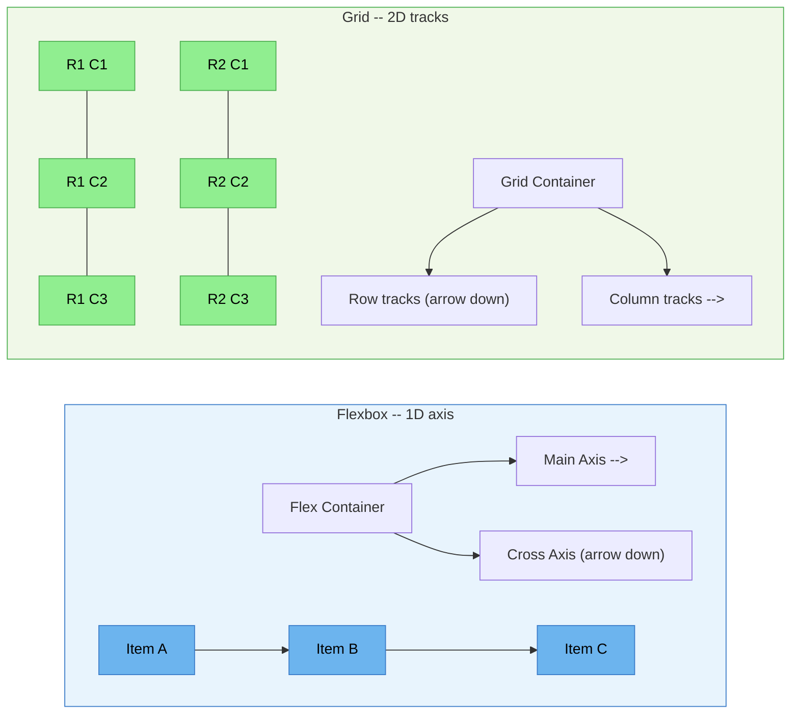

# [FEE-203] Flexbox & Grid

:::info
CSS provides two modern layout algorithms purpose-built for application UI: **Flexbox** for one-dimensional distribution along a single axis, and **Grid** for two-dimensional placement across rows and columns. You SHOULD use flexbox for component-level layouts (navbars, card rows, form controls) and grid for page-level and dashboard layouts. You SHOULD use the `gap` property instead of margin hacks for spacing in both systems. You SHOULD consider subgrid when child elements need to participate in a parent's grid tracks.
:::

## Context

Before flexbox and grid, web developers relied on floats, inline-block hacks, and table-based layouts to achieve anything beyond simple document flow. These techniques were never designed for application layout. They were workarounds, and the CSS they produced was fragile and hard to maintain.

**Flexbox** (CSS Flexible Box Layout Module, first Working Draft 2009, Candidate Recommendation 2012) was the first layout algorithm designed specifically for distributing space along a single axis. It reached broad, unprefixed browser support in the mid-2010s: Chrome shipped it unprefixed in 2013 (Chrome 29); Firefox was unprefixed from 2013 but only gained `flex-wrap` in Firefox 28 (2014), and Safari 9 dropped the prefix requirement in September 2015. Internet Explorer 10 and 11 shipped only a partial, buggy implementation that lingered in production codebases for years after. Flexbox introduced concepts like `flex-grow`, `flex-shrink`, and `flex-basis` that let items expand and contract based on available space, something floats could not do without JavaScript.

**Grid** (CSS Grid Layout Module Level 1) reached its first Candidate Recommendation on 29 September 2016 and shipped nearly simultaneously in Firefox 52, Chrome 57, and Safari 10.1 in March 2017; Edge followed in October 2017 with Edge 16. Grid provides a two-dimensional layout system with explicit row and column tracks: you define a complete layout structure on the container, then place children into named areas or specific grid lines. That is a different approach from flexbox's content-driven sizing, where the algorithm distributes space based on what each item already needs.

Both systems share the `gap` property for spacing between items and support alignment via `justify-*` and `align-*` properties; they are commonly combined in the same layout rather than treated as competitors. A typical case is a card grid where cards need to wrap onto new rows and stay equal height within each row regardless of content length. `flex-wrap: wrap` on a flex container handles the wrapping and gives every card in a row the same cross-axis height; grid's `repeat(auto-fill, minmax(...))` (covered in the Example section) solves the same wrapping problem with explicit track control instead. Floats require manual clearing to achieve either behavior, and inline-block requires careful whitespace management to avoid stray gaps between items.

## Visual

### Flexbox (1D) vs Grid (2D) comparison



**Flexbox** distributes items along one axis at a time (the main axis). The cross axis handles alignment but not independent track sizing. **Grid** defines both row and column tracks simultaneously, allowing precise two-dimensional placement.

### When to use which

| Scenario | Recommended | Why |
|----------|------------|-----|
| Navbar with logo + links + actions | Flexbox | 1D distribution with `justify-content: space-between` |
| Card row with equal-height cards | Flexbox | Items share cross-axis height, content determines width |
| Page layout: header / sidebar / main / footer | Grid | 2D placement with `grid-template-areas` |
| Dashboard with proportioned panels | Grid | Explicit track sizing with `fr` units and `minmax()` |
| Form: label + input + button in a row | Flexbox | Simple 1D alignment, input takes remaining space |
| Magazine layout with spanning elements | Grid | Items can span multiple rows/columns |
| Centering a single element | Either | Flexbox: `justify-content + align-items`. Grid: `place-items: center` |

## Example

### 1. Flexbox navbar with justify-content: space-between

```html
<nav class="navbar">
  <a class="navbar-brand" href="/">MyApp</a>
  <ul class="navbar-links">
    <li><a href="/docs">Docs</a></li>
    <li><a href="/pricing">Pricing</a></li>
    <li><a href="/blog">Blog</a></li>
  </ul>
  <div class="navbar-actions">
    <button>Sign In</button>
    <button class="primary">Get Started</button>
  </div>
</nav>

<style>
  .navbar {
    display: flex;
    justify-content: space-between; /* Logo left, links center, actions right */
    align-items: center;
    padding: 0 1rem;
    height: 60px;
    gap: 1rem; /* Spacing between the three groups */
  }

  .navbar-links {
    display: flex;
    gap: 1.5rem; /* Spacing between links */
    list-style: none;
    margin: 0;
    padding: 0;
  }

  .navbar-actions {
    display: flex;
    gap: 0.5rem; /* Spacing between buttons */
  }
</style>
```

This uses nested flex containers. The outer `.navbar` distributes three groups, and each group uses its own flex layout for internal spacing. The `gap` property handles all spacing, so no margin hacks are needed.

### 2. Grid dashboard with grid-template-areas

```html
<div class="dashboard">
  <header class="dash-header">Header</header>
  <nav class="dash-sidebar">Sidebar</nav>
  <main class="dash-main">Main Content</main>
  <aside class="dash-panel">Right Panel</aside>
  <footer class="dash-footer">Footer</footer>
</div>

<style>
  .dashboard {
    display: grid;
    grid-template-areas:
      "header  header  header"
      "sidebar main    panel"
      "footer  footer  footer";
    grid-template-columns: 240px 1fr 300px;
    grid-template-rows: 60px 1fr 40px;
    min-height: 100vh;
    gap: 1px; /* Thin gap acts as visual divider */
  }

  .dash-header  { grid-area: header; }
  .dash-sidebar { grid-area: sidebar; }
  .dash-main    { grid-area: main; }
  .dash-panel   { grid-area: panel; }
  .dash-footer  { grid-area: footer; }

  /* Responsive: stack on small screens */
  @media (max-width: 768px) {
    .dashboard {
      grid-template-areas:
        "header"
        "main"
        "sidebar"
        "panel"
        "footer";
      grid-template-columns: 1fr;
      grid-template-rows: auto;
    }
  }
</style>
```

The `grid-template-areas` property lets you define the layout visually in CSS. Changing the layout for different screen sizes is a matter of redefining the area map; no DOM changes are needed. The `fr` unit gives the main content area all remaining space after the fixed-width sidebar and panel.

### 3. Combining both: grid page layout + flexbox card components

```html
<div class="product-grid">
  <div class="product-card">
    
    <div class="card-body">
      <h3>Product Name</h3>
      <p>Short description of the product goes here.</p>
    </div>
    <div class="card-footer">
      <span class="price">$29.99</span>
      <button>Add to Cart</button>
    </div>
  </div>
  <!-- More cards... -->
</div>

<style>
  /* Grid: responsive card grid with auto-fill */
  .product-grid {
    display: grid;
    grid-template-columns: repeat(auto-fill, minmax(280px, 1fr));
    gap: 1.5rem;
    padding: 1.5rem;
  }

  /* Flexbox: card internal layout */
  .product-card {
    display: flex;
    flex-direction: column;     /* Stack image, body, footer vertically */
    border: 1px solid #e0e0e0;
    border-radius: 8px;
    overflow: hidden;
  }

  .product-card img {
    width: 100%;
    aspect-ratio: 4 / 3;
    object-fit: cover;
  }

  .card-body {
    flex: 1;                    /* Body takes remaining space */
    padding: 1rem;
  }

  .card-footer {
    display: flex;
    justify-content: space-between; /* Price left, button right */
    align-items: center;
    padding: 1rem;
    border-top: 1px solid #e0e0e0;
  }
</style>
```

This is the most common real-world pattern: **grid for the overall page/section layout** and **flexbox for the individual component layout**. The grid handles the responsive column count (auto-fill + minmax), while flexbox handles the card's internal structure, pushing the footer to the bottom regardless of content height.

## Best Practices

**Use Grid for 2D layouts, Flexbox for 1D layouts.** When your layout requires control over both rows and columns simultaneously (page shells, dashboard panels, magazine-style grids), you MUST reach for Grid. When you are distributing items along a single axis (navbars, toolbars, inline button groups), you SHOULD use Flexbox. Applying Grid to a one-dimensional problem adds maintenance overhead without benefit.

**Understand `flex` shorthand before using it.** You SHOULD NOT write `flex: 1` without knowing it expands to `flex-grow: 1; flex-shrink: 1; flex-basis: 0%`, not `flex-basis: auto`. This means items are sized from zero and distribute space equally, regardless of content width. AVOID using `flex: 1` when you intend `flex: auto`: it sizes each item from its content first, then splits the leftover space per `flex-grow`.

**Use `gap` instead of margin hacks for inter-item spacing.** You MUST use the `gap` property in flex and grid containers to create spacing between items. AVOID applying `margin` to child items to simulate gutters. Margin-based gutters produce unwanted outer margins that require negative-margin compensation on the parent, while `gap` applies spacing only between items and works identically in both Flexbox and Grid.

**Use subgrid when nested elements need cross-sibling alignment.** Card titles, descriptions, and footers that must align across a row of independent grid items are the classic case. When child elements inside multiple grid items need to align with each other, you SHOULD use `grid-template-rows: subgrid` on the child container rather than creating an independent inner grid per item, since independent grids cannot share track sizing with the parent. FEE-208 covers subgrid in depth.

**Keep DOM order reader-meaningful; treat visual reordering as cosmetic only.** `order` in flexbox and explicit placement or `grid-template-areas` in grid change what a sighted user sees, but not the order a keyboard's focus travels in or the order a screen reader announces. A layout that reorders freely on the visual axis can leave keyboard and screen-reader users jumping around unpredictably relative to what is on screen. You SHOULD write the DOM in the order those users should encounter it, and reorder visually only when the change is purely cosmetic. The CSS `reading-flow` and `reading-order` properties, which shipped in Chrome in 2025, let a container opt individual items back into a chosen reading order for accessibility tools, but browser support is not yet broad, so DOM order remains the primary lever.

## Design Thinking

### Why two systems: complement, not compete

Flexbox and grid solve different categories of layout problems:

**Flexbox is content-first.** You place items into a flex container and let the algorithm distribute space based on each item's intrinsic size and flex factors. The final layout depends on the content. This makes flexbox ideal for:

- Navigation bars where items have varying text lengths
- Card rows that need equal height but content-driven widths
- Form controls that distribute remaining space to an input field
- Toolbars and action bars with flexible spacing

**Grid is layout-first.** You define tracks (rows and columns) on the container, then place items into that structure. The layout is determined by the grid definition, not the content. This makes grid ideal for:

- Page-level layouts (header, sidebar, main, footer)
- Dashboard panels with fixed proportions
- Magazine-style layouts with spanning elements
- Any design where the grid structure is the primary constraint

The distinction is sometimes stated as "flexbox for 1D, grid for 2D," which is a useful heuristic but not the full picture. The deeper difference is **content-out** (flexbox: content determines layout) versus **layout-in** (grid: layout determines where content goes).

### Why float grid systems stopped being built

For roughly a decade and a half, from the early 2000s into the mid-2010s, web developers used float-based grid systems to build multi-column layouts. Frameworks like 960.gs, Blueprint CSS, Susy, and Bootstrap's original grid worked by floating fixed-width columns left and combining percentage widths with clearfixes.

These systems had fundamental limitations:

- **No vertical alignment control.** Floats only push elements left or right; there is no built-in way to vertically center a floated column against its siblings.
- **Clearfix hacks.** Parent elements needed `overflow: hidden` or a clearfix pseudo-element to contain floated children, or the parent would collapse to zero height.
- **Source order dependence.** Visual order was tied to DOM order, with no native way to decouple the two.
- **Equal-height columns required hacks.** Faux columns (repeating background images), `display: table-cell`, or JavaScript were the only ways to make floated columns match height.

Flexbox and grid removed the reason to start a *new* float-based grid system. A single `grid-template-columns: repeat(12, 1fr)` replaces most of what a float grid framework did, and frameworks adopted accordingly on their own timelines: Bootstrap 4, released in 2018, moved its grid to flexbox, and Bootstrap 5 kept the flexbox-based grid. That adoption was gradual, not a cutover. Float-based layouts still ship today: plenty of legacy codebases never migrated their grid systems off floats, HTML email clients still cannot reliably support flexbox or grid so email layouts commonly rely on floats or tables, and float retains its original, still-current purpose of wrapping text around an image (`float: left` on an `` inside a paragraph).

### Component library layout primitives

Modern component libraries expose flexbox and grid as higher-level abstractions:

| Library | Flexbox primitive | Grid primitive | Spacing |
|---------|------------------|---------------|---------|
| **Chakra UI** | `<Flex>`, `<Stack>`, `<HStack>`, `<VStack>` | `<Grid>`, `<SimpleGrid>` | `<Spacer>`, `spacing` prop |
| **Ant Design** | `<Flex>`, `<Space>` | `<Row>`, `<Col>` (flexbox-based) | `gutter` prop, `gap` |
| **MUI (Material UI)** | `<Stack>`, `<Box sx={flexbox}>` | `<Grid>` (flexbox-based; CSS grid available via `Box`/`sx`) | `spacing` prop |
| **Radix Themes** | `<Flex>` | `<Grid>` | `gap` prop (maps to CSS gap) |
| **Tailwind CSS** | `flex`, `flex-row`, `flex-col`, `justify-*` | `grid`, `grid-cols-*`, `grid-rows-*` | `gap-*` utilities |

None of these libraries invents its own layout engine. Each maps props onto flex and grid CSS declarations, so debugging a layout problem in any of them means opening DevTools and reading the generated `display: flex` or `display: grid` rules underneath the component.

## Deep Dive

### The `flex` shorthand: what `flex: 1` actually means

The `flex` property is a shorthand for three separate properties, `flex-grow`, `flex-shrink`, and `flex-basis`, and its keyword values expand in ways that are not intuitive:

| Shorthand | Expands to |
|-----------|------------|
| `flex: 1` | `flex-grow: 1; flex-shrink: 1; flex-basis: 0%` |
| `flex: auto` | `flex-grow: 1; flex-shrink: 1; flex-basis: auto` |
| `flex: none` | `flex-grow: 0; flex-shrink: 0; flex-basis: auto` |

The critical difference is `flex-basis: 0%` (in `flex: 1`) versus `flex-basis: auto` (in `flex: auto`). `flex-basis` sets an item's *hypothetical size*, the size the flex algorithm starts from before growing or shrinking factors are applied.

**`flex: 1` sizes items equally regardless of content.** With `flex-basis: 0%`, every item's hypothetical size is zero, so the `flex-grow: 1` factor divides the total container width equally among items. A 200-character item and a 5-character item end up the same width. Use this when you want uniform columns: equal-width nav tabs, a three-column feature grid.

**`flex: auto` sizes items proportional to content.** With `flex-basis: auto`, each item's hypothetical size is its own content size, so it first claims the space its content needs, then the *remaining* space (after all items have claimed their natural widths) is distributed according to `flex-grow`. Larger items keep more space; smaller items get less. Use this when content size should influence the final proportions: a tag cloud, a horizontally scrolled playlist where track titles vary in length.

**`flex: none` is a fixed size with no flexibility.** The item takes exactly its `width`/`height` (or intrinsic size) and neither grows nor shrinks. Use this for elements that must never change size in a flex row: an avatar thumbnail, a fixed-width icon button.

A common mistake is writing `flex: 1` intending equal distribution, but then finding that one overflowing item breaks the layout. The root cause is usually `min-width: auto` (items cannot shrink below their content's minimum width). Adding `min-width: 0` alongside `flex: 1` restores the expected behavior; see Common Mistakes below.

## Common Mistakes

### 1. Forgetting min-width: 0 on flex items (content overflow)

**The mistake:** Long text or large content overflows a flex item instead of being constrained:

```css
.sidebar { flex: 0 0 200px; }
.content { flex: 1; }

/* A <pre> or long URL inside .content overflows the flex container */
```

By default, flex items have `min-width: auto`, which prevents them from shrinking below their content's intrinsic minimum width. A long unbroken string or a `<pre>` block can push the item wider than expected.

**The fix:** Set `min-width: 0` (or `overflow: hidden`) on the flex item:

```css
.content {
  flex: 1;
  min-width: 0; /* Allow shrinking below content's intrinsic width */
}
```

This also applies to the cross axis: use `min-height: 0` when flex items overflow vertically in a `flex-direction: column` container.

### 2. auto-fill vs auto-fit confusion

**The mistake:** Using `auto-fill` and `auto-fit` interchangeably and getting unexpected empty tracks or stretched items:

```css
/* auto-fill: creates as many tracks as fit, even if empty */
grid-template-columns: repeat(auto-fill, minmax(200px, 1fr));

/* auto-fit: same as auto-fill, but collapses empty tracks to 0 */
grid-template-columns: repeat(auto-fit, minmax(200px, 1fr));
```

With 3 items in a 1200px container and `minmax(200px, 1fr)`:
- **auto-fill** creates 6 tracks (1200/200), 3 with items, 3 empty. Items do NOT stretch to fill the container.
- **auto-fit** creates 6 tracks, then collapses the 3 empty ones. Items stretch to fill all available space.

**The fix:** Use `auto-fit` when you want items to stretch to fill the row. Use `auto-fill` when you want consistent column sizes regardless of item count (useful for preserving grid alignment when items are dynamically added/removed).

## Related Topics

- [Box Model & Layout Modes](/en/CSS%20and%20Layout%20Systems/202)
- [CSS Subgrid](/en/CSS%20and%20Layout%20Systems/208)
- [Modern CSS Frameworks](/en/CSS%20and%20Layout%20Systems/206)
- [Responsive Design & Container Queries](/en/CSS%20and%20Layout%20Systems/204)
- [Stacking Contexts, Paint Order & the Top Layer](/en/CSS%20and%20Layout%20Systems/stacking-contexts-paint-order-top-layer)
- [CSS & Layout Systems Overview](/en/CSS%20and%20Layout%20Systems/200)

## References

- W3C, "CSS Flexible Box Layout Module Level 1," W3C Candidate Recommendation Draft (2025). https://www.w3.org/TR/css-flexbox-1/
- W3C, "CSS Grid Layout Module Level 1," W3C Candidate Recommendation Draft (2025). https://www.w3.org/TR/css-grid-1/
- W3C, "CSS Grid Layout Module Level 2," W3C Candidate Recommendation Draft (2025). https://www.w3.org/TR/css-grid-2/
- MDN contributors, "CSS Flexible Box Layout," MDN Web Docs (2025). https://developer.mozilla.org/en-US/docs/Web/CSS/CSS_flexible_box_layout
- MDN contributors, "CSS Grid Layout," MDN Web Docs (2025). https://developer.mozilla.org/en-US/docs/Web/CSS/CSS_grid_layout
- Chris Coyier, "A Complete Guide to Flexbox," CSS-Tricks (2013, kept updated). https://css-tricks.com/snippets/css/a-guide-to-flexbox/
- Chris House, "A Complete Guide to CSS Grid," CSS-Tricks (2016, kept updated). https://css-tricks.com/snippets/css/complete-guide-grid/
- Sara Soueidan, "Auto-Sizing Columns in CSS Grid: auto-fill vs auto-fit," CSS-Tricks (2017). https://css-tricks.com/auto-sizing-columns-css-grid-auto-fill-vs-auto-fit/
- Josh W. Comeau, "An Interactive Guide to Flexbox," joshwcomeau.com (2022). https://www.joshwcomeau.com/css/interactive-guide-to-flexbox/
- Rachel Andrew, "Grid, content re-ordering and accessibility," rachelandrew.co.uk (2019). https://rachelandrew.co.uk/archives/2019/06/04/grid-content-re-ordering-and-accessibility/
- MDN contributors, "reading-flow," MDN Web Docs (2025). https://developer.mozilla.org/en-US/docs/Web/CSS/reading-flow
- Rachel Andrew, "Grid by Example," gridbyexample.com (ongoing curated collection). https://gridbyexample.com/
- Jen Simmons, "Layout Land," YouTube (2018-2019, archived series). https://www.youtube.com/c/LayoutLand
