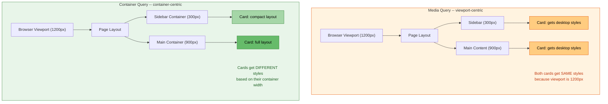

# [FEE-204] Responsive Design & Container Queries

:::info
Responsive design ensures interfaces adapt to any device, viewport, or container context. You SHOULD prefer container queries over media queries for component-level responsiveness, as they enable truly reusable components that adapt to their container rather than the viewport. You SHOULD use `clamp()` for fluid typography, eliminating rigid breakpoint-based font size changes. You SHOULD adopt logical properties (`margin-inline`, `padding-block`, `inline-size`) so layouts adapt correctly for both LTR and RTL writing modes.
:::

## Context

In May 2010, Ethan Marcotte published "Responsive Web Design" on A List Apart, coining the term and defining its three technical pillars: **fluid grids** (percentage-based layouts), **flexible images** (`max-width: 100%`), and **media queries** (`@media`). This article was a watershed moment -- it gave the industry a shared vocabulary and a practical technique for building websites that adapted to the explosion of screen sizes brought by smartphones and tablets.

Media queries became the dominant tool for responsive design. Developers defined viewport breakpoints -- typically targeting phone, tablet, and desktop widths -- and wrote CSS rules for each range. Frameworks like Bootstrap codified this into a standard set of breakpoints (576px, 768px, 992px, 1200px) that became industry conventions.

But media queries have a fundamental limitation: they query the **viewport**, not the **component's container**. A card component inside a narrow sidebar receives the same "desktop" styles as a card in a wide main content area, because both exist in the same viewport. Developers worked around this with ad-hoc class overrides (`.sidebar .card { ... }`), but this couples components to their page context -- the opposite of reusable design.

**Container queries** (`@container`), specified in the W3C CSS Containment Module Level 3 and shipped in all major browsers by February 2023, solve this problem. They allow components to query the size of their nearest containment context rather than the viewport. A card component can define its own responsive behavior -- switching from horizontal to vertical layout, adjusting font sizes, showing or hiding elements -- based solely on how much space its parent gives it. This is a paradigm shift from viewport-centric to container-centric responsive design.

Alongside container queries, modern responsive CSS includes **fluid typography** with `clamp()`, **responsive images** with `srcset` and `<picture>`, **new viewport units** (`svh`, `dvh`, `lvh`) that account for mobile browser chrome, and **logical properties** that make layouts internationalization-ready.

## Design Thinking

### Why media queries came first: the viewport-centric era

Ethan Marcotte's 2010 approach was built on a key insight: the viewport is the one constant you can query. At the time, CSS had no mechanism to ask "how wide is my parent?" -- only "how wide is the screen?" This was enough to transform web design from fixed-width (960px) to fluid, but it baked a viewport-centric mental model into the entire industry.

For over a decade, responsive design meant viewport breakpoints. The standard workflow was:

1. Define breakpoints: mobile (< 768px), tablet (768px-1024px), desktop (> 1024px)
2. Write media queries for each breakpoint
3. Override component styles at each breakpoint as needed

This worked for page-level layout but created problems at the component level. A reusable `<Card>` component might need to be compact in a sidebar but full-width in a main content area -- on the same viewport width. Media queries cannot express this, because they have no concept of the component's container.

### Container queries as paradigm shift

Container queries invert the responsive model. Instead of asking "how wide is the viewport?", a component asks "how wide is my container?" This has profound implications:

**Components become truly portable.** A card component with container query styles works correctly whether placed in a 300px sidebar, a 600px content area, or a 1200px full-width section -- without any knowledge of viewport size or page layout.

**Layout responsibility separates cleanly.** The page layout (grid/flexbox) determines how much space each section gets. Components inside those sections respond to the space they are given. Neither needs to know about the other.

**Design systems benefit most.** In a design system, components are built once and used in dozens of contexts. Container queries eliminate the need for size variants (`<Card size="sm">`, `<Card size="lg">`) -- the component adapts automatically.

### How frameworks will evolve

Current CSS framework responsive utilities are viewport-centric:

| Framework | Responsive approach | Limitation |
|-----------|-------------------|------------|
| **Tailwind CSS** | `sm:`, `md:`, `lg:` prefixes map to viewport breakpoints | All breakpoints are viewport-based |
| **Chakra UI** | Responsive prop arrays: `fontSize={["sm", "md", "lg"]}` | Array indices map to viewport breakpoints |
| **Ant Design** | `xs`, `sm`, `md`, `lg`, `xl`, `xxl` responsive breakpoints | Grid breakpoints query viewport |
| **Bootstrap** | `.col-sm-6`, `.col-md-4` column classes | Viewport-based grid system |

Container queries change this. Tailwind CSS 3.4+ added `@container` support with `@` prefixes (`@sm:`, `@md:`, `@lg:`). As adoption grows, component-level responsive utilities will increasingly be container-based, while page-level layout remains viewport-based. The distinction matters: use media queries for **page layout decisions** (sidebar visible? single or multi-column?), and container queries for **component adaptation** (card horizontal or vertical? show subtitle or not?).

### Fluid typography: eliminating breakpoint jumps

Traditional responsive typography uses media queries to change font sizes at breakpoints, creating abrupt jumps:

```css
/* Abrupt: font jumps from 16px to 20px at 768px */
h1 { font-size: 16px; }
@media (min-width: 768px) { h1 { font-size: 20px; } }
@media (min-width: 1200px) { h1 { font-size: 32px; } }
```

The `clamp()` function provides smooth scaling:

```css
/* Smooth: font scales fluidly between 1rem and 2.5rem */
h1 { font-size: clamp(1rem, 0.5rem + 2vw, 2.5rem); }
```

`clamp(MIN, PREFERRED, MAX)` sets a minimum floor, a fluid preferred value (typically using `vw` or container query units), and a maximum ceiling. The font size scales smoothly with the viewport or container width, with hard limits preventing it from becoming too small or too large.

### Logical properties and internationalization

Traditional CSS properties like `margin-left`, `padding-right`, and `width` assume a left-to-right, top-to-bottom writing mode. For applications that support RTL languages (Arabic, Hebrew) or vertical writing modes (CJK), these physical properties require overrides.

Logical properties map to the content's flow direction:

| Physical property | Logical equivalent | Meaning |
|------------------|-------------------|---------|
| `width` | `inline-size` | Size along the inline (text) axis |
| `height` | `block-size` | Size along the block (stacking) axis |
| `margin-left` / `margin-right` | `margin-inline-start` / `margin-inline-end` | Margins along inline axis |
| `margin-left` + `margin-right` | `margin-inline` | Both inline margins |
| `padding-top` + `padding-bottom` | `padding-block` | Both block paddings |

Using logical properties means your responsive layouts automatically adapt when `dir="rtl"` is set or when the writing mode changes.

## Best Practices

**Use container queries for component-level responsiveness, media queries for page layout.** Components SHOULD query their container width via `@container` rather than the viewport. Reserve `@media` for decisions that truly depend on viewport size -- switching a sidebar from hidden to visible, changing a page from single-column to multi-column. This separation keeps components portable and decoupled from their page context.

**Adopt a mobile-first approach.** You SHOULD write base styles for the smallest layout first, then progressively enhance for wider containers and viewports using `min-width` queries. Mobile-first CSS is additive: you add complexity as space grows rather than stripping it away at smaller sizes. AVOID `max-width` queries as the primary strategy, since they produce overrides that are harder to reason about and maintain.

**Use `clamp()` for fluid typography instead of breakpoint steps.** Font sizes SHOULD scale continuously with `clamp(MIN, PREFERRED, MAX)` rather than jumping at discrete breakpoints. Pair the fluid preferred value with `vw` for viewport-relative scaling or `cqi` for container-relative scaling. AVOID fixed pixel font sizes at named breakpoints for body text and headings, as they create jarring visual jumps.

**Let content determine breakpoints, not device categories.** Breakpoints SHOULD be placed where your specific content breaks -- where a line of text becomes too long, a card too cramped, or a grid too sparse -- not at arbitrary device widths like 768px or 1024px. This produces layouts that are robust to any screen size rather than optimized for today's popular devices.

**Use logical properties for internationalization-ready layouts.** You SHOULD prefer `inline-size`, `margin-inline`, `padding-block`, and `border-inline-end` over their physical equivalents (`width`, `margin-left`, `padding-top`, `border-right`). Logical properties adapt automatically when `dir="rtl"` or a vertical writing mode is applied, eliminating the need for directional overrides.

## Visual

### Media queries (viewport) vs container queries (container)



**Media queries** apply the same styles to all components at a given viewport width, regardless of the component's actual available space. **Container queries** allow each component to adapt based on its own container's dimensions.

## Example

### 1. Classic media query responsive layout

```css
/* Page-level layout: media queries are appropriate here */
.page {
  display: grid;
  grid-template-columns: 1fr;
  gap: 1rem;
  padding: 1rem;
}

@media (min-width: 48em) {
  .page {
    grid-template-columns: 240px 1fr;
  }
}

@media (min-width: 75em) {
  .page {
    grid-template-columns: 240px 1fr 300px;
  }
}

/* Card with media queries: problematic -- same viewport
   breakpoints apply regardless of where the card lives */
.card {
  display: flex;
  flex-direction: column;
  gap: 0.75rem;
}

@media (min-width: 48em) {
  .card {
    flex-direction: row; /* Horizontal on "tablet" viewport */
  }
}
```

```html
<div class="page">
  <aside class="sidebar">
    <div class="card"><!-- This card is in a 240px sidebar
         but gets horizontal layout at 48em viewport! --></div>
  </aside>
  <main>
    <div class="card"><!-- This card has plenty of space --></div>
  </main>
</div>
```

The media query approach fails because the sidebar card switches to horizontal layout at the same viewport width as the main content card, even though the sidebar only provides 240px of space.

### 2. Same layout with container queries on the card component

```css
/* Page layout still uses media queries -- that is correct */
.page {
  display: grid;
  grid-template-columns: 1fr;
  gap: 1rem;
  padding: 1rem;
}

@media (min-width: 48em) {
  .page { grid-template-columns: 240px 1fr; }
}

@media (min-width: 75em) {
  .page { grid-template-columns: 240px 1fr 300px; }
}

/* Establish containment context on the card's parent */
.sidebar,
main {
  container-type: inline-size;
}

/* Card uses container queries instead of media queries */
.card {
  display: flex;
  flex-direction: column;
  gap: 0.75rem;
}

@container (min-width: 400px) {
  .card {
    flex-direction: row; /* Only goes horizontal when container
                            actually has 400px+ of space */
  }
}

@container (min-width: 600px) {
  .card .card-title {
    font-size: 1.5rem;
  }

  .card .card-meta {
    display: flex; /* Show metadata only when there is room */
  }
}
```

```html
<div class="page">
  <aside class="sidebar">
    <!-- Container is ~240px: card stays vertical -->
    <div class="card">
      
      <div class="card-body">
        <h3 class="card-title">Article Title</h3>
        <p class="card-meta" hidden>Author &middot; 5 min read</p>
      </div>
    </div>
  </aside>
  <main>
    <!-- Container is ~700px+: card goes horizontal with metadata -->
    <div class="card">
      
      <div class="card-body">
        <h3 class="card-title">Article Title</h3>
        <p class="card-meta">Author &middot; 5 min read</p>
      </div>
    </div>
  </main>
</div>
```

Now the sidebar card stays vertical (its container is only 240px), while the main content card can go horizontal. The card component is fully portable -- it responds to its container, not the viewport.

### 3. Fluid typography with clamp()

```css
:root {
  /* Fluid type scale using clamp() */
  --font-size-sm: clamp(0.875rem, 0.8rem + 0.25vw, 1rem);
  --font-size-base: clamp(1rem, 0.9rem + 0.35vw, 1.125rem);
  --font-size-lg: clamp(1.25rem, 1rem + 0.75vw, 1.75rem);
  --font-size-xl: clamp(1.5rem, 1rem + 1.5vw, 2.5rem);
  --font-size-2xl: clamp(2rem, 1.2rem + 2.5vw, 3.5rem);
}

body {
  font-size: var(--font-size-base);
  line-height: 1.6;
}

h1 { font-size: var(--font-size-2xl); }
h2 { font-size: var(--font-size-xl); }
h3 { font-size: var(--font-size-lg); }
small { font-size: var(--font-size-sm); }

/* Container query units for component-level fluid type */
.card {
  container-type: inline-size;
}

.card-title {
  /* Font size scales with the card's container width */
  font-size: clamp(1rem, 3cqi, 1.5rem);
}
```

The `cqi` unit (container query inline) is 1% of the container's inline size, analogous to `vw` for the viewport. Combined with `clamp()`, it enables fluid typography that scales with the component's container rather than the viewport.

### 4. Responsive images

```html
<!-- srcset + sizes: browser picks optimal image -->


<!-- picture element: art direction for different contexts -->
<picture>
  <source
    media="(max-width: 600px)"
    srcset="photo-portrait.jpg"
  />
  <source
    media="(min-width: 601px)"
    srcset="photo-landscape.jpg"
  />
  
</picture>
```

```css
/* CSS image-set() for background images */
.hero {
  background-image: image-set(
    url("hero-1x.webp") 1x,
    url("hero-2x.webp") 2x,
    url("hero-3x.webp") 3x
  );
}
```

`srcset` with width descriptors (`w`) tells the browser what image sizes are available. `sizes` tells the browser how wide the image will be displayed at each breakpoint. The browser combines this information with the device pixel ratio to select the optimal file. The `<picture>` element provides art direction -- serving entirely different images based on media conditions.

### 5. New viewport units and logical properties

```css
/* New viewport units account for mobile browser chrome */
.hero-section {
  /* svh: small viewport height (excludes all browser chrome) */
  min-height: 100svh;

  /* dvh: dynamic viewport height (changes as chrome shows/hides) */
  /* lvh: large viewport height (includes space when chrome is hidden) */
}

/* Logical properties for LTR/RTL support */
.sidebar {
  inline-size: 280px;          /* width in LTR, width in RTL */
  padding-inline: 1rem;        /* left + right padding in LTR */
  padding-block: 0.5rem;       /* top + bottom padding */
  margin-inline-start: 0;      /* margin-left in LTR, margin-right in RTL */
  border-inline-end: 1px solid #e0e0e0; /* Right border in LTR, left in RTL */
}

/* Combines with container queries */
@container (min-width: 600px) {
  .content {
    padding-inline: 2rem;      /* Wider padding when container is large */
  }
}
```

## Common Mistakes

### 1. Forgetting `container-type` on the parent

**The mistake:** Writing `@container` rules that silently do nothing because no ancestor has `container-type` set:

```css
/* This does nothing -- no containment context established */
@container (min-width: 400px) {
  .card { flex-direction: row; }
}
```

Container queries require an ancestor with `container-type: inline-size` (or `size`). Without it, the query has no container to measure and the styles never apply. There is no warning in browser DevTools by default -- it simply does nothing.

**The fix:** Always establish a containment context on the component's parent:

```css
.card-wrapper {
  container-type: inline-size;
  container-name: card; /* Optional: name for targeted queries */
}

@container card (min-width: 400px) {
  .card { flex-direction: row; }
}
```

### 2. Using px breakpoints instead of em (zoom accessibility)

**The mistake:** Defining breakpoints in pixels, which do not respond to user zoom or font size preferences:

```css
@media (min-width: 768px) { /* 768px stays 768px even at 200% zoom */ }
```

When a user zooms to 200%, the viewport in CSS pixels effectively halves. A `768px` breakpoint still triggers at 768 CSS pixels, but the content is twice as large -- the layout may not have enough room. Using `em` respects the user's settings.

**The fix:** Use `em` values for media query breakpoints:

```css
/* 48em = 768px at default 16px font size, but scales with zoom */
@media (min-width: 48em) { ... }
```

At 200% zoom, `48em` effectively becomes 1536px in device terms, so the narrow layout persists until there is truly enough room.

### 3. No fallbacks for older browsers without container query support

**The mistake:** Using container queries as the only path to component styles, with no base styles for browsers that lack support:

```css
.card { /* No base horizontal layout defined */ }

@container (min-width: 400px) {
  .card { flex-direction: row; }
}
```

In browsers without container query support (pre-2023, some embedded WebViews), the `@container` block is ignored entirely. Components get only the base styles.

**The fix:** Write base styles that work as a reasonable default, then enhance with container queries:

```css
/* Base: works everywhere */
.card {
  display: flex;
  flex-direction: column;
}

/* Enhancement: media query fallback */
@media (min-width: 48em) {
  .card { flex-direction: row; }
}

/* Override: container query takes precedence when supported */
@container (min-width: 400px) {
  .card { flex-direction: row; }
}

/* Or use @supports for explicit feature detection */
@supports (container-type: inline-size) {
  .card-wrapper { container-type: inline-size; }

  @container (min-width: 400px) {
    .card { flex-direction: row; }
  }
}
```

### 4. Hardcoding breakpoint values instead of using design tokens

**The mistake:** Scattering magic numbers throughout stylesheets:

```css
@media (min-width: 768px) { .nav { ... } }
@media (min-width: 768px) { .card { ... } }
@media (min-width: 768px) { .hero { ... } }
/* What if the breakpoint needs to change? Find-and-replace across hundreds of files. */
```

**The fix:** Define breakpoints as design tokens using custom properties or preprocessor variables:

```css
/* CSS custom properties (for container queries and calc) */
:root {
  --breakpoint-sm: 36em;   /* 576px */
  --breakpoint-md: 48em;   /* 768px */
  --breakpoint-lg: 62em;   /* 992px */
  --breakpoint-xl: 75em;   /* 1200px */
}

/* Note: custom properties cannot be used directly in @media
   conditions, but custom media queries (Media Queries Level 5)
   will enable this:
   @custom-media --viewport-md (min-width: 48em);
   @media (--viewport-md) { ... }

   Until then, use Sass variables or PostCSS custom media. */
```

For container queries, you can use `cqi` units with `clamp()` and custom properties, giving you a token-driven system that adapts to container size.

## Related FEEs

| FEE | Relationship |
|-----|-------------|
| [FEE-200 CSS & Layout Systems Overview](./200.md) | Parent overview. Responsive design and container queries are key techniques in the modern CSS layout landscape described in FEE-200. |
| [FEE-203 Flexbox & Grid](./203.md) | Flexbox and grid provide the layout systems that responsive design adapts. Media queries and container queries modify grid definitions and flex directions to create responsive layouts. |
| [FEE-207 CSS Custom Properties & Theming](./207.md) | Custom properties serve as design tokens for breakpoints, spacing, and fluid type scales. Container queries combined with custom properties enable dynamic, context-aware theming. |

## References

- [Ethan Marcotte, "Responsive Web Design" (A List Apart, 2010)](https://alistapart.com/article/responsive-web-design/) -- The original article that coined the term and defined the three pillars: fluid grids, flexible images, and media queries
- [W3C CSS Containment Module Level 3](https://www.w3.org/TR/css-contain-3/) -- The specification defining container queries, `container-type`, `container-name`, and container query length units (`cqw`, `cqi`, `cqb`, etc.)
- [W3C Media Queries Level 5](https://www.w3.org/TR/mediaqueries-5/) -- The specification adding user preference media features (`prefers-color-scheme`, `prefers-reduced-motion`, `prefers-contrast`) and interaction media features
- [MDN: CSS Container Queries](https://developer.mozilla.org/en-US/docs/Web/CSS/Guides/Containment/Container_queries) -- Comprehensive guide to container queries including `@container`, `container-type`, container query units, and named containers
- [MDN: @container](https://developer.mozilla.org/en-US/docs/Web/CSS/Reference/At-rules/@container) -- Reference documentation for the `@container` at-rule syntax and container query features
- [Ahmad Shadeed, "An Interactive Guide to CSS Container Queries"](https://ishadeed.com/article/css-container-query-guide/) -- Interactive guide with visual examples covering container size queries, style queries, and practical use cases
- [MDN: Responsive Images](https://developer.mozilla.org/en-US/docs/Learn/HTML/Multimedia_and_embedding/Responsive_images) -- Guide to `srcset`, `sizes`, and the `<picture>` element for responsive image loading
- [web.dev: Container Queries](https://web.dev/learn/css/container-queries) -- Google's guide to container queries as part of the Learn CSS curriculum
- [Josh W. Comeau, "A Friendly Introduction to Container Queries"](https://www.joshwcomeau.com/css/container-queries-introduction/) -- Beginner-friendly walkthrough of container queries with interactive examples
