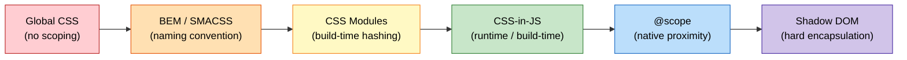

# [FEE-205] CSS Architecture & Scoping Strategies

:::info
CSS is global by default -- every rule can potentially affect every element in the document. At scale, this leads to naming collisions, unintended overrides, and fear of modifying shared stylesheets. Multiple scoping strategies have emerged over the past two decades, from naming conventions (BEM) to build-tool solutions (CSS Modules) to runtime abstractions (CSS-in-JS) to native browser features (`@scope`, Shadow DOM). The right strategy is context-dependent: team size, framework choice, performance requirements, and theming needs all influence the decision.
:::

## Context

CSS was designed in 1996 for styling documents, not applications. In a document context, global styling is a feature -- you define `h1 { color: navy }` once and every heading in the document picks it up. This was elegant for academic papers and early web pages, but it became a liability as the web shifted toward complex, component-based applications.

By the mid-2000s, large web applications faced a recurring problem: **naming collisions**. Two developers writing `.button { ... }` in separate files would unknowingly override each other's styles. The cascade, designed to resolve conflicts gracefully in documents, became a source of unpredictable behavior in applications. Teams resorted to increasingly specific selectors, `!important` declarations, and inline styles -- all of which made stylesheets harder to maintain.

The community responded with **naming conventions**. In 2009, Yandex introduced **BEM** (Block Element Modifier), a strict naming pattern (`block__element--modifier`) that eliminated collisions through discipline. Around the same time, Jonathan Snook published **SMACSS** (Scalable and Modular Architecture for CSS), and Harry Roberts developed **ITCSS** (Inverted Triangle CSS). These methodologies brought order to large codebases but relied on human discipline -- nothing stopped a developer from breaking the convention.

In 2015, Glen Maddern and Mark Dalgleish created **CSS Modules**, which moved scoping from human convention to build-tool enforcement. CSS Modules generate unique class names at build time (`.button` becomes `._button_1a2b3`), guaranteeing no collisions without requiring naming discipline. This was a pivotal shift: the toolchain, not the developer, enforced scoping.

The same year, Christopher Chedeau's influential talk "CSS in JS" at NationJS inspired a wave of libraries -- **styled-components** (2016), **Emotion** (2017) -- that co-located styles with component logic in JavaScript. These offered dynamic styling, automatic critical CSS extraction, and true encapsulation, but introduced runtime overhead.

The pendulum swung again. **Tailwind CSS** (2017) popularized utility-first CSS, eliminating custom class names entirely in favor of composable utility classes applied directly in markup. Build-time CSS-in-JS libraries like **vanilla-extract** (2021) and **Linaria** offered the developer experience of CSS-in-JS without the runtime cost.

Most recently, the platform itself is catching up. **CSS nesting** (Baseline 2024) eliminates the need for Sass/Less nesting. **`@scope`** (Baseline late 2025) provides native proximity-based scoping. **`@layer`** (Baseline 2022) gives explicit control over cascade ordering. The gap between what required tooling and what the browser provides natively is narrowing rapidly.

## Scenario

A CSS class named `.button` defined in one component's stylesheet is accidentally overriding the `.button` class in another component, producing visual regressions that are hard to trace. Both components are independently correct — the problem is CSS's global scope. Architecture strategies — BEM naming, CSS Modules, CSS-in-JS, `@layer` — each solve the scoping problem differently, and the right choice depends on the team's tooling and the project's scale.

## Design Thinking

### Why CSS has no built-in scoping

CSS was designed for the document web, where global is a feature, not a bug. A single stylesheet should be able to style an entire document consistently. The cascade -- the "C" in CSS -- is a deliberate mechanism for resolving conflicts when multiple rules target the same element. In a world of documents, this works beautifully.

The problem emerged when the web became an application platform. Applications are built from components -- self-contained units that should not leak styles to siblings or ancestors. CSS had no concept of component boundaries. Every selector operated on the full document tree. This mismatch between CSS's document model and the web's component model is the root cause of every scoping strategy that followed.

### The pendulum: from preprocessors to CSS-in-JS and back

The history of CSS scoping strategies follows a clear pendulum pattern:

**Preprocessors era (2006-2012).** Sass (2006) and Less (2009) introduced nesting, variables, and mixins. Nesting gave the illusion of scoping (`.card { .title { ... } }` looks contained), but it compiled to descendant selectors that remained global. Preprocessors solved authoring ergonomics but not the scoping problem.

**Naming convention era (2009-2015).** BEM, SMACSS, and ITCSS provided scoping through human discipline. They worked well for teams that enforced them rigorously, but offered no tooling guarantee. A single violated convention could cause cascading style bugs.

**CSS-in-JS era (2014-2020).** Libraries like styled-components and Emotion moved styles into JavaScript, generating unique class names at runtime. This solved scoping definitively but introduced runtime performance overhead, larger bundle sizes, and made server-side rendering more complex. Mark Dalgleish's "A Unified Styling Language" (2017) articulated why CSS-in-JS mattered: scoped styles, critical CSS extraction, and a unified language for styles and logic.

**Utility-first and build-time era (2017-present).** Tailwind CSS sidestepped the scoping problem entirely -- there are no custom class names to collide. Build-time CSS-in-JS (vanilla-extract, Linaria) preserved the CSS-in-JS developer experience without runtime cost.

**Native CSS era (2022-present).** `@layer` (2022), CSS nesting (2024), and `@scope` (2025) bring scoping capabilities directly to the browser. The need for tooling-based scoping is diminishing, though build-time solutions remain valuable for type safety and developer experience.

### How frameworks solve scoping

Each major framework has taken a different approach to the scoping problem:

**Vue `<style scoped>`.** Vue's single-file component compiler adds a unique data attribute (e.g., `data-v-f3f3eg9`) to every element in the component's template, then rewrites each CSS selector to include that attribute (`.title` becomes `.title[data-v-f3f3eg9]`). This is compile-time scoping via attribute selectors. It is transparent to the developer but has a specificity cost -- attribute selectors add specificity, and child component root nodes are affected by the parent's scoped styles.

**Angular ViewEncapsulation.** Angular defaults to `Emulated` encapsulation, which works similarly to Vue -- it generates unique attributes (`_ngcontent-abc-1`) and rewrites selectors. Angular also supports `ShadowDom` encapsulation, which uses real Shadow DOM for true browser-native isolation, and `None`, which disables encapsulation entirely.

**Svelte.** Svelte's compiler generates unique class hashes at build time and adds them to both elements and selectors. Unused styles are detected and removed during compilation. Svelte's approach is purely compile-time with zero runtime overhead.

**React.** React provides no built-in scoping mechanism. The ecosystem fills the gap: CSS Modules (build-time class name hashing), styled-components/Emotion (runtime CSS-in-JS), vanilla-extract (build-time CSS-in-TS), or Tailwind CSS (utility classes). This lack of opinion is both React's flexibility and its complexity -- teams must choose and enforce a strategy.

**Web Components (Shadow DOM).** Shadow DOM provides the strongest form of encapsulation: styles inside a shadow root do not leak out, and external styles do not penetrate in (with exceptions for inherited properties and CSS custom properties). This is true browser-native scoping, but it makes theming harder -- you cannot style shadow DOM internals from outside without explicit CSS custom property hooks or `::part()` selectors.

### Choosing a strategy

There is no universally correct scoping strategy. The decision depends on context:

- **Small team, single app, utility-first culture**: Tailwind CSS eliminates the scoping problem by removing custom class names entirely.
- **Design system with multiple consumers**: CSS Modules or vanilla-extract provide guaranteed scoping with type safety.
- **Legacy codebase with global CSS**: BEM as a migration path, `@layer` to order legacy vs. new styles, gradual `@scope` adoption.
- **Web Components / micro-frontends**: Shadow DOM for hard isolation boundaries between independently deployed units.
- **Performance-critical paths**: Avoid runtime CSS-in-JS; prefer build-time solutions (CSS Modules, vanilla-extract, Tailwind) or native CSS (`@scope`, nesting).

## Best Practices

**Choose a scoping strategy based on team size and framework.** Small teams with a single application SHOULD default to utility-first CSS (Tailwind) because it eliminates the naming problem entirely. Component-based teams using React, Vue, or Svelte SHOULD adopt the framework's recommended mechanism (CSS Modules for React, `<style scoped>` for Vue, Svelte's built-in scoping). Larger teams or design-system authors SHOULD prefer build-time solutions (CSS Modules, vanilla-extract) that give tooling-enforced guarantees independent of individual discipline. AVOID choosing a strategy based on novelty alone -- the best strategy is the one your whole team can apply consistently.

**Use CSS Modules as the default for component-scoped styles.** CSS Modules produce a single hashed class name per rule in the build output, giving each rule single-class specificity (0,1,0) with no attribute-selector overhead — unlike attribute-selector-based scoping (e.g. Vue's `scoped`, which adds an extra specificity column to reach (0,2,0)) — zero runtime cost, and deterministic output. SHOULD be the starting point for any React or framework-agnostic codebase. Only deviate toward runtime CSS-in-JS when dynamic theming requirements cannot be satisfied by CSS custom properties, or toward Shadow DOM when distributing components to unknown consumers.

**Use CSS Layers (`@layer`) to control cascade ordering for third-party and reset styles.** Declare your layer stack at the top of your root stylesheet and import external CSS into named layers (`@import 'normalize.css' layer(reset)`). MUST assign all third-party imports to layers that rank below your application layer so that low-specificity application selectors reliably win without `!important`. AVOID importing third-party CSS outside of any layer if your application styles are inside layers -- unlayered styles always beat layered styles regardless of source order.

**Avoid global selector side effects by scoping every new selector from day one.** Adding bare element selectors (`h2 { ... }`, `p { ... }`) or broad class names (`.title`, `.button`) to a shared stylesheet is the primary source of unintended overrides at scale. SHOULD scope such selectors inside a `@scope` block, a CSS Module, or a framework scoping mechanism before committing. AVOID relying on source-order proximity as an informal scoping mechanism -- it breaks silently when files are concatenated in a different order or when a new stylesheet is added.

**Reserve Shadow DOM for genuine hard-isolation boundaries.** Shadow DOM is the correct tool for web components distributed to unknown consumers, micro-frontend boundaries, and embeddable widgets where external CSS must not interfere. AVOID attaching shadow roots to components that live entirely inside a single application -- doing so makes global design tokens, font imports, and shared resets inaccessible inside the shadow tree without duplicating them, substantially increasing maintenance burden.

## Visual

### Scoping spectrum: from global to fully isolated



**Left to right: increasing isolation.** Global CSS has zero scoping -- every rule applies everywhere. BEM adds scoping through human discipline. CSS Modules enforce scoping through tooling. CSS-in-JS generates unique identifiers per component. `@scope` provides native proximity-based boundaries. Shadow DOM creates a hard encapsulation boundary that external styles cannot cross.

## Example

### 1. BEM naming for a card component

```css
/* Block */
.card {
  border: 1px solid #e0e0e0;
  border-radius: 8px;
  overflow: hidden;
}

/* Elements (parts of the block) */
.card__header {
  padding: 1rem;
  border-bottom: 1px solid #e0e0e0;
}

.card__title {
  font-size: 1.25rem;
  font-weight: 600;
  margin: 0;
}

.card__body {
  padding: 1rem;
}

.card__footer {
  padding: 1rem;
  border-top: 1px solid #e0e0e0;
  display: flex;
  justify-content: flex-end;
  gap: 0.5rem;
}

/* Modifiers (variations of the block) */
.card--featured {
  border-color: #1565c0;
  box-shadow: 0 2px 8px rgba(21, 101, 192, 0.15);
}

.card--compact .card__body {
  padding: 0.5rem;
}
```

```html
<article class="card card--featured">
  <div class="card__header">
    <h2 class="card__title">Featured Article</h2>
  </div>
  <div class="card__body">
    <p>Card content goes here.</p>
  </div>
  <div class="card__footer">
    <button class="btn btn--secondary">Cancel</button>
    <button class="btn btn--primary">Read More</button>
  </div>
</article>
```

BEM provides scoping through naming discipline. The `.card__title` selector is unlikely to collide with `.nav__title` because the block name is part of the class. The key rule: never nest BEM selectors deeply -- `.card__header__title__icon` is a sign you need a new block.

### 2. CSS Modules with a bundler

```css
/* Card.module.css */
.root {
  border: 1px solid #e0e0e0;
  border-radius: 8px;
  overflow: hidden;
}

.title {
  font-size: 1.25rem;
  font-weight: 600;
  composes: heading from './typography.module.css';
}

.body {
  padding: 1rem;
}

.featured {
  composes: root;
  border-color: #1565c0;
  box-shadow: 0 2px 8px rgba(21, 101, 192, 0.15);
}
```

```jsx
// Card.jsx
import styles from './Card.module.css';

function Card({ title, children, featured }) {
  return (
    <article className={featured ? styles.featured : styles.root}>
      <h2 className={styles.title}>{title}</h2>
      <div className={styles.body}>{children}</div>
    </article>
  );
}
```

At build time, the bundler transforms `.title` into something like `._title_x7k2a_1` -- a hash unique to this file. The `composes` keyword lets you share styles between modules without duplication. You write simple, readable class names (`.title`, `.body`) and the toolchain guarantees uniqueness.

### 3. Native @scope rule

```css
/* Scoping root: .card
   Scoping limit: .card-actions (styles stop before this subtree) */
@scope (.card) to (.card-actions) {
  :scope {
    border: 1px solid #e0e0e0;
    border-radius: 8px;
    overflow: hidden;
  }

  h2 {
    font-size: 1.25rem;
    font-weight: 600;
    padding: 1rem;
    margin: 0;
  }

  p {
    padding: 0 1rem 1rem;
    margin: 0;
    color: #424242;
  }
}

/* Styles inside .card-actions are NOT affected by the scope above */
@scope (.card-actions) {
  button {
    padding: 0.5rem 1rem;
    border-radius: 4px;
  }
}
```

```html
<article class="card">
  <h2>Article Title</h2>
  <p>This paragraph is styled by the first @scope rule.</p>
  <div class="card-actions">
    <!-- This h2 would NOT be styled by the first scope -->
    <button>Read More</button>
  </div>
</article>
```

The `@scope` rule provides proximity-based scoping natively in CSS. The "donut scope" pattern (`@scope (.card) to (.card-actions)`) creates a boundary where styles apply within `.card` but stop before `.card-actions`. This is a fundamentally new capability -- neither BEM nor CSS Modules can express "style this subtree but not that nested subtree." Unlike Shadow DOM, `@scope` does not create an encapsulation boundary; external styles can still reach in, but proximity scoping means the nearest scope wins.

## Deep Dive

### `@layer` ordering mechanics: what "layers win" actually means

`@layer` introduces a cascade priority tier that sits between the existing cascade origin levels. Understanding the exact rules prevents surprises when mixing layered and unlayered styles.

**Later layers beat earlier layers for normal declarations.** When you write `@layer reset, third-party, app`, the `app` layer wins over `third-party` which wins over `reset` -- regardless of specificity. A `.button { color: red }` in `app` beats a `#nav .button { color: blue }` in `third-party` even though `#nav .button` has higher specificity. Layer order, not specificity, is the primary tie-breaker within the layered cascade.

**Unlayered author styles always beat any layered author style.** This is the most important and least obvious rule. If any selector is not inside an `@layer` block, it ranks above all layered styles automatically. This means: if you put your application styles inside `@layer app` but import a third-party library without assigning it to a layer, the library's styles win even if they appear earlier in the source. The fix is to assign all external imports to layers and keep your application styles either in the highest-priority layer or outside layers entirely.

**`!important` reverses the layer order.** For `!important` declarations, an earlier layer beats a later layer. A `!important` rule in `@layer reset` beats a `!important` rule in `@layer app`. This mirrors the existing cascade behavior where `!important` reverses origin priority (user agent `!important` beats author `!important`). In practice, avoid `!important` inside layers entirely -- it makes layer ordering behavior much harder to reason about.

**Practical consequence for library authors.** Shipping a library's styles inside `@layer` is an intentional affordance for consumers: it means any application selector, no matter how low-specificity (even a bare `.button`), can override the library without `!important`. This is the design pattern recommended for CSS frameworks distributing to unknown apps -- put all defaults in a named layer, let the app's unlayered (or higher-layered) styles win effortlessly.

## Common Mistakes

### 1. Mixing scoping strategies inconsistently in one project

**The mistake:** Using BEM in the header, CSS Modules in the sidebar, Tailwind in the footer, and styled-components in the modal -- all in the same application:

```jsx
// Header: BEM
<header class="header__nav header__nav--dark">

// Sidebar: CSS Modules
<aside className={styles.sidebar}>

// Footer: Tailwind
<footer class="flex items-center justify-between p-4 bg-gray-100">

// Modal: styled-components
<StyledModal isOpen={open}>
```

Every scoping strategy has different specificity characteristics, different debugging workflows, and different mental models. Mixing them makes it impossible to predict which styles win in a conflict, and onboarding new developers becomes painful.

**The fix:** Choose one primary scoping strategy for the project. If you must use more than one (e.g., Tailwind for application code + CSS Modules for a shared component library), document the boundary clearly and use `@layer` to control precedence.

### 2. Over-scoping with Shadow DOM when CSS Modules suffice

**The mistake:** Using Shadow DOM for internal components within a single application:

```js
class InternalCard extends HTMLElement {
  constructor() {
    super();
    this.attachShadow({ mode: 'open' });
    // Now theming requires CSS custom properties for every value
    // Global design tokens cannot reach this component
    // Third-party CSS (fonts, resets) must be duplicated inside
  }
}
```

Shadow DOM is designed for hard isolation boundaries -- web components distributed to unknown consumers, micro-frontend boundaries, embeddable widgets. For components within a single application, Shadow DOM makes theming, global resets, and shared design tokens unnecessarily difficult.

**The fix:** Use CSS Modules, `@scope`, or framework-native scoping (Vue scoped, Svelte) for application-internal components. Reserve Shadow DOM for components that genuinely need to survive in unknown styling contexts.

### 3. BEM getting deeply nested

**The mistake:** Encoding the DOM hierarchy into BEM names:

```css
/* Deep nesting: the BEM name mirrors the DOM tree */
.card__header__title__icon--large { ... }
.card__body__content__paragraph--highlighted { ... }
```

This defeats BEM's purpose. Long names are hard to read, and they couple the CSS to a specific DOM structure. If you restructure the HTML, every class name must change.

**The fix:** Flatten BEM. Elements belong to the block, not to other elements:

```css
/* Flat: all elements are direct children of the block */
.card__title-icon--large { ... }
.card__highlight { ... }
```

If a section of the block is complex enough to need its own nested elements, it should be a separate block.

### 4. Runtime CSS-in-JS in performance-critical paths without measuring

**The mistake:** Using runtime CSS-in-JS (styled-components, Emotion) for components that render in performance-critical paths (lists, animations, frequent re-renders) without profiling:

```jsx
// This generates and injects CSS on every render
const AnimatedItem = styled.div`
  transform: translateY(${props => props.offset}px);
  opacity: ${props => props.visible ? 1 : 0};
`;

// Rendered 1000 times in a virtualized list
{items.map(item => (
  <AnimatedItem offset={item.offset} visible={item.visible} />
))}
```

Runtime CSS-in-JS libraries serialize styles, hash them, and inject `<style>` tags on each render. For a few components this is negligible; for hundreds of dynamic components it can cause measurable jank.

**The fix:** Profile first. If runtime overhead is measurable, switch to build-time alternatives (vanilla-extract, Linaria) or use CSS custom properties for dynamic values:

```css
/* Static CSS -- generated once at build time */
.animated-item {
  transform: translateY(var(--offset));
  opacity: var(--visible);
  transition: transform 0.2s, opacity 0.2s;
}
```

```jsx
// Dynamic values via custom properties -- no runtime CSS generation
<div
  className="animated-item"
  style={{ '--offset': `${item.offset}px`, '--visible': item.visible ? 1 : 0 }}
/>
```

## Related FEEs

| FEE | Relationship |
|-----|-------------|
| [FEE-200 CSS & Layout Systems Overview](./200.md) | Parent overview. Scoping strategies are a key architectural concern in the CSS landscape described in FEE-200. |
| [FEE-201 The Cascade, Specificity & Inheritance](./201.md) | The cascade is the reason scoping matters. Understanding specificity is essential to understanding why different scoping strategies produce different specificity profiles (BEM = single class, CSS Modules = single class, Vue scoped = class + attribute, Shadow DOM = isolated cascade). |
| [FEE-206 Modern CSS Frameworks](./206.md) | Frameworks like Tailwind, Bootstrap, and component libraries each embed a scoping philosophy. FEE-206 explores these frameworks; FEE-205 provides the architectural rationale. |
| [FEE-500 Component Architecture & Design Patterns](../Component Architecture and Design Patterns/500.md) | Component architecture determines scoping requirements. Design systems, micro-frontends, and component libraries each demand different isolation levels. |

## References

- [MDN: @scope](https://developer.mozilla.org/en-US/docs/Web/CSS/Reference/At-rules/@scope) -- Reference documentation for the `@scope` at-rule, including scoping root, scoping limit, and the donut scope pattern
- [MDN: CSS Nesting](https://developer.mozilla.org/en-US/docs/Web/CSS/Guides/Nesting) -- Guide to native CSS nesting, the `&` nesting selector, and specificity implications
- [W3C CSS Scoping Module Level 1](https://www.w3.org/TR/css-scoping-1/) -- The W3C specification defining scoping and encapsulation mechanisms for CSS, including Shadow DOM scoping
- [W3C CSS Nesting Module Level 1](https://www.w3.org/TR/css-nesting-1/) -- The specification for native CSS nesting syntax and semantics
- [CSS-Tricks: BEM 101](https://css-tricks.com/bem-101/) -- Introduction to the Block Element Modifier naming convention, its rationale, and practical examples
- [Mark Dalgleish, "A Unified Styling Language" (2017)](https://medium.com/seek-blog/a-unified-styling-language-d0c208de2660) -- Influential article arguing why CSS-in-JS matters: scoped styles, critical CSS, and a unified language for styles and logic
- [Tailwind CSS Documentation](https://tailwindcss.com/docs) -- Official documentation for the utility-first CSS framework, including the rationale for avoiding custom class names
- [Vue.js SFC CSS Features](https://vuejs.org/api/sfc-css-features.html) -- Documentation for Vue's `<style scoped>`, the data-attribute rewriting mechanism, and `<style module>`
- [vanilla-extract](https://vanilla-extract.style/) -- Zero-runtime stylesheets in TypeScript, providing type-safe, locally-scoped styles generated at build time
- [Smashing Magazine: CSS @scope -- An Alternative to Naming Conventions and Heavy Abstractions (2026)](https://www.smashingmagazine.com/2026/02/css-scope-alternative-naming-conventions/) -- Practical guide to using `@scope` as a native replacement for BEM and CSS Modules scoping
