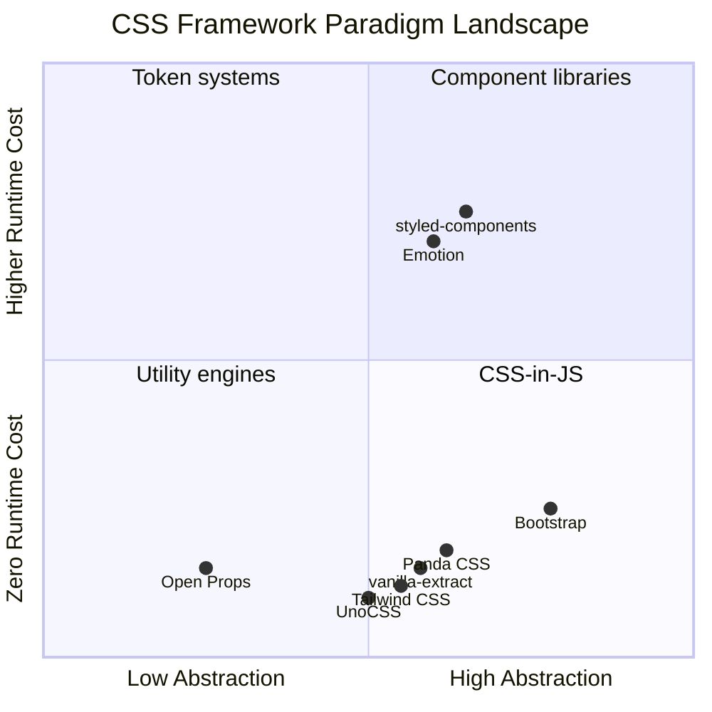

# [FEE-206] Modern CSS Frameworks

:::info
CSS frameworks abstract away low-level styling decisions so teams can ship consistent, responsive UIs faster. The landscape has fragmented into distinct paradigms -- utility-first (Tailwind CSS), component-based (Bootstrap), design-token-driven (Open Props), build-time CSS-in-JS (Panda CSS), and atomic/on-demand (UnoCSS). Each paradigm makes different tradeoffs between developer experience, performance, flexibility, and learning curve. Framework choice is context-dependent: there is no single best framework, only the best framework for a given team, project, and design system maturity.
:::

## Context

For most of the web's history, developers wrote CSS by hand. This worked for small sites but scaled poorly. As applications grew, teams encountered recurring problems: inconsistent spacing, ad-hoc color values, fragile responsive breakpoints, and duplicated utility patterns across components. Every project reinvented the same solutions -- a grid system, a spacing scale, a color palette, a responsive breakpoint map.

CSS frameworks emerged to solve these problems by encoding design decisions into reusable abstractions. **Blueprint CSS** (2007) and **960 Grid System** (2008) provided grid layouts. **Bootstrap** (2011, released by Twitter) went further, offering a complete component library with grid, typography, forms, buttons, and JavaScript interactions. Bootstrap became the most popular CSS framework in history, powering millions of websites and establishing the component-based paradigm.

But Bootstrap had limitations. Its opinionated component styles made every site look similar ("Bootstrap look"). Overriding defaults required fighting specificity. Bundle sizes were large because you shipped all components even if you used only a few. The framework's CSS grew linearly with the number of components.

In 2017, Adam Wathan released **Tailwind CSS**, introducing a different philosophy: instead of pre-built components, provide low-level utility classes that compose into any design. Tailwind's `class="flex items-center gap-4 p-6 bg-white rounded-lg shadow"` replaced custom CSS entirely for many projects. The Just-In-Time (JIT) compiler (v2.1, later default in v3) generated only the utilities actually used, producing tiny CSS bundles. Tailwind v4 (January 2025) rewrote the engine in Rust (the "Oxide" engine), making full builds over 3.5x faster, with CSS-first configuration replacing `tailwind.config.js`.

Meanwhile, the design-token movement gained momentum. **Open Props** (2022, by Adam Argyle of Google) took a radically different approach: instead of utility classes or components, it provides CSS custom properties -- design tokens for colors, spacing, typography, easing, and more. Open Props is framework-agnostic, works with vanilla CSS, and adds zero JavaScript.

**Panda CSS** (2023, by the Chakra UI team) addressed the CSS-in-JS performance problem. Runtime CSS-in-JS libraries like styled-components generate styles in the browser, adding overhead. Panda CSS extracts styles at build time, producing static CSS files with zero runtime cost while preserving the type-safe, token-driven developer experience.

**UnoCSS** (2021, by Anthony Fu) reimagined the utility CSS engine itself. Rather than being a framework with built-in utilities, UnoCSS is an engine with a preset system. It can emulate Tailwind, Windi CSS, Bootstrap utilities, or entirely custom utility sets. With no parsing or AST overhead, it is reportedly 5x faster than Tailwind JIT (v3 era) and ships at ~6KB.

The State of CSS 2024 survey reflects this fragmentation: Tailwind CSS leads at 37% active usage, Bootstrap follows at 21.6%, and a notable share of developers now use no CSS framework at all -- relying on native CSS features like Grid, custom properties, and container queries.

## Design Thinking

### Why the industry moved from hand-written CSS to frameworks

Four forces drove CSS framework adoption:

**Consistency.** Hand-written CSS produces inconsistent results across a team. One developer uses `padding: 12px`, another uses `padding: 0.75rem`, a third uses `padding: 10px`. Frameworks enforce a constrained set of values -- Tailwind's default spacing scale (`p-1` = 0.25rem, `p-2` = 0.5rem, `p-3` = 0.75rem) eliminates arbitrary values.

**Design system enforcement.** A design system defines visual constraints (color palette, type scale, spacing). Without framework support, enforcement depends on code review and documentation. Frameworks encode these constraints into their configuration -- Tailwind's `theme`, Panda CSS's `tokens`, Open Props's custom properties -- making violations visible in the code itself.

**Development velocity.** Writing responsive layouts from scratch is slow. `class="grid grid-cols-1 md:grid-cols-3 gap-6"` in Tailwind replaces a media query, a grid declaration, and a gap declaration in three seconds. Component frameworks like Bootstrap go further: `<div class="card">` provides a complete, accessible card pattern instantly.

**Responsive utilities.** Every framework provides a responsive breakpoint system. Without frameworks, developers write media queries manually, often with inconsistent breakpoint values across the codebase. Framework responsive prefixes (`md:`, `lg:` in Tailwind; `col-md-*` in Bootstrap) standardize responsive behavior.

### Paradigm tradeoffs

Each framework paradigm makes distinct tradeoffs:

**Utility-first (Tailwind CSS, UnoCSS).** Utilities compose directly in markup, enabling fast iteration without context-switching to CSS files. The tradeoff is verbose HTML -- a complex component may have dozens of utility classes on a single element. Proponents argue this is a feature: styles are explicit, co-located with structure, and never hidden in distant stylesheets. Critics argue it harms readability and makes markup harder to diff in code review. Tailwind mitigates this with `@apply` for extraction and component abstraction in the JS framework layer.

**Component-based (Bootstrap).** Pre-built components offer familiar patterns and fast prototyping. The tradeoff is opinionated design: Bootstrap's `.card`, `.btn`, `.navbar` encode specific visual decisions. Customization requires overriding Sass variables or fighting specificity. Teams with unique design systems may spend more time overriding Bootstrap than building from scratch.

**Design-token-driven (Open Props).** CSS custom properties provide raw design primitives without imposing structure. Open Props is the most flexible paradigm -- it works with any framework, any methodology, any build tool. The tradeoff is more setup: you get tokens, not components or utilities. You still write your own CSS, just with better values. This suits teams that want maximum control and have the CSS expertise to use it.

**Build-time CSS-in-JS (Panda CSS).** Type-safe tokens and recipes provide excellent developer experience with zero runtime cost. The tradeoff is build complexity and a tighter coupling to the build pipeline. Panda CSS requires a code generation step, a PostCSS or bundler plugin, and framework-specific integration. The generated CSS is static, so dynamic styling requires CSS custom properties or runtime fallbacks.

**Atomic/on-demand (UnoCSS).** The engine-first approach provides maximum flexibility -- you can replicate any utility framework through presets. The tradeoff is that UnoCSS is a meta-framework: it requires choosing and configuring presets, which can be overwhelming for teams that want opinionated defaults.

### Meta-framework integration

Modern meta-frameworks have first-class CSS framework integrations:

**Next.js + Tailwind CSS.** Tailwind is the default styling option when creating a Next.js project with `create-next-app`. The integration is first-class: PostCSS configuration is automatic, CSS purging respects the `app/` and `pages/` directories, and server components work seamlessly because Tailwind generates static CSS.

**Nuxt + UnoCSS.** UnoCSS is available as a built-in Nuxt module (`@unocss/nuxt`). Anthony Fu, UnoCSS's creator, is a core Nuxt team member, ensuring deep integration. The module provides automatic scanning of `.vue` files, attributify mode for cleaner templates, and icon support via `@unocss/preset-icons`.

**Astro.** Astro is framework-agnostic by design and supports Tailwind CSS, UnoCSS, and vanilla CSS equally well. Its island architecture means CSS is scoped per component by default, and any framework's CSS solution works within its islands.

**SvelteKit.** SvelteKit works well with Tailwind CSS (via `svelte-add`) but also benefits from Svelte's native scoped `<style>` blocks. Many SvelteKit projects use a hybrid approach: Tailwind utilities for layout and spacing, native scoped styles for component-specific visual details.

## Best Practices

**Configure Tailwind's content paths before writing a single utility class.** Tailwind's purge (v3) or `content` (v4 `@source`) configuration determines which files are scanned for class names. MUST include every file type — HTML templates, JS/TS components, `.vue`, `.svelte`, MDX — before running a production build. Omitting a path silently drops entire sets of utilities from the output, producing styles that work in development but break in production.

**Extract repeating utility combinations into components, not into `@apply` blocks.** When the same set of a dozen utility classes appears on three or more elements across the codebase, SHOULD encapsulate them in a framework component (React, Vue, Svelte) rather than using `@apply` to create a custom class. Component abstraction preserves the utility-first mental model, keeps styles co-located with behavior, and makes prop-driven variants type-checkable. Reserve `@apply` for genuinely global patterns such as prose typography or third-party HTML you cannot control.

**Match framework choice to your design system's maturity, not to popularity.** MUST audit your existing design constraints — color palette, spacing scale, type scale, motion tokens — before selecting a framework. If your design system is fully specified, Tailwind CSS or Panda CSS can encode it with precision; if tokens are still evolving, Open Props provides raw primitives that impose no structural opinion. AVOID choosing a framework first and then bending your design system to fit its defaults, as this produces arbitrary-value overrides that eliminate the consistency guarantees the framework was meant to provide.

**Extract design tokens into framework-agnostic CSS custom properties as the source of truth.** SHOULD define core tokens (`--color-brand`, `--space-4`, `--font-size-lg`) in a plain CSS layer or a shared tokens file, then reference them from whichever framework you adopt. This decouples visual decisions from build tooling, makes tokens consumable by vanilla CSS, Web Components, and any future framework migration, and keeps Figma-to-code synchronization feasible. Tailwind v4's `@theme` block, Panda CSS's `tokens` (via `semanticTokens` for dynamic theming), and Open Props all support referencing externally defined custom properties.

## Visual

### Framework paradigm quadrant



**Reading the quadrant.** The x-axis measures abstraction level: Open Props provides raw tokens (low abstraction), while Bootstrap provides complete components (high abstraction). The y-axis measures runtime cost: utility-first and build-time frameworks cluster near zero runtime cost, while runtime CSS-in-JS libraries (styled-components, Emotion) incur measurable overhead. The bottom-left quadrant (low abstraction, zero runtime) represents the lightest-touch approaches; the top-right (high abstraction, higher runtime) represents the most opinionated.

## Example

### The same card component in three paradigms

#### 1. Tailwind CSS (utility-first)

```html
<article class="max-w-sm rounded-lg border border-gray-200 bg-white shadow-sm
                overflow-hidden">
  
  <div class="p-5">
    <h2 class="mb-2 text-xl font-bold tracking-tight text-gray-900">
      Card Title
    </h2>
    <p class="mb-4 text-sm text-gray-600">
      A brief description of this card's content, demonstrating the
      utility-first approach.
    </p>
    <a
      href="#"
      class="inline-flex items-center rounded-md bg-blue-600 px-4 py-2
             text-sm font-medium text-white hover:bg-blue-700
             focus:outline-none focus:ring-2 focus:ring-blue-500
             focus:ring-offset-2"
    >
      Read more
    </a>
  </div>
</article>
```

Every visual property is explicit in the markup. No custom CSS file exists. The Tailwind compiler scans this HTML and generates only the classes used. Responsive variants add prefixes: `md:max-w-md`, `lg:grid-cols-2`.

#### 2. Bootstrap (component-based)

```html
<article class="card" style="max-width: 24rem;">
  
  <div class="card-body">
    <h2 class="card-title">Card Title</h2>
    <p class="card-text text-muted">
      A brief description of this card's content, demonstrating the
      component-based approach.
    </p>
    <a href="#" class="btn btn-primary">Read more</a>
  </div>
</article>
```

Bootstrap provides semantic class names (`.card`, `.card-body`, `.btn`). The HTML is concise and readable. Visual details (border radius, padding, shadow) are defined in Bootstrap's Sass source and controlled via Sass variables:

```scss
// Customizing Bootstrap's card via Sass variables
$card-border-radius: 0.5rem;
$card-spacer-y: 1.25rem;
$card-spacer-x: 1.25rem;
$card-cap-bg: transparent;
```

#### 3. Panda CSS (build-time CSS-in-JS with recipes)

```tsx
// card.recipe.ts
import { cva } from '../styled-system/css';

const card = cva({
  base: {
    maxWidth: 'sm',
    borderRadius: 'lg',
    border: '1px solid',
    borderColor: 'gray.200',
    bg: 'white',
    shadow: 'sm',
    overflow: 'hidden',
  },
  variants: {
    size: {
      sm: { maxWidth: 'xs' },
      md: { maxWidth: 'sm' },
      lg: { maxWidth: 'md' },
    },
  },
  defaultVariants: {
    size: 'md',
  },
});

const cardTitle = cva({
  base: {
    mb: '2',
    fontSize: 'xl',
    fontWeight: 'bold',
    letterSpacing: 'tight',
    color: 'gray.900',
  },
});

const cardButton = cva({
  base: {
    display: 'inline-flex',
    alignItems: 'center',
    borderRadius: 'md',
    bg: 'blue.600',
    px: '4',
    py: '2',
    fontSize: 'sm',
    fontWeight: 'medium',
    color: 'white',
    _hover: { bg: 'blue.700' },
    _focusVisible: {
      outline: '2px solid',
      outlineColor: 'blue.500',
      outlineOffset: '2px',
    },
  },
});
```

```tsx
// Card.tsx
import { card, cardTitle, cardButton } from './card.recipe';

function Card({ title, description, size }) {
  return (
    <article className={card({ size })}>
      
      <div className={css({ p: '5' })}>
        <h2 className={cardTitle()}>{title}</h2>
        <p className={css({ mb: '4', fontSize: 'sm', color: 'gray.600' })}>
          {description}
        </p>
        <a href="#" className={cardButton()}>Read more</a>
      </div>
    </article>
  );
}
```

Panda CSS recipes define type-safe, multi-variant styles. The `cva` function generates atomic CSS classes at build time -- no runtime style injection. TypeScript catches invalid token values (`color: 'gray.999'` would error). The `variants` object creates a clean API: `card({ size: 'lg' })` maps to the correct atomic classes.

### Comparison summary

| Aspect | Tailwind CSS | Bootstrap | Panda CSS |
|--------|-------------|-----------|-----------|
| **Where styles live** | HTML class attributes | Sass source + HTML classes | TypeScript recipe files |
| **Custom CSS written** | Rarely | Variable overrides | Token configuration |
| **Type safety** | None (string classes) | None | Full TypeScript support |
| **Bundle output** | Only used utilities | All imported components | Only used atomic styles |
| **Customization** | `tailwind.config` / CSS | Sass variables + mixins | Token + recipe definitions |
| **Learning curve** | Utility class vocabulary | Component class names | CSS-in-JS + token concepts |

## Common Mistakes

### 1. Fighting Tailwind defaults instead of customizing the config

**The mistake:** Using `!important` or complex overrides to make Tailwind match your design:

```css
/* Overriding Tailwind's colors with !important */
.btn-primary {
  background-color: #1a56db !important;
  border-radius: 2px !important;
}
```

This creates a parallel styling system that conflicts with Tailwind's utilities and breaks the utility-first model.

**The fix:** Extend or override Tailwind's theme in the configuration. In Tailwind v4, this is done in CSS:

```css
@import "tailwindcss";

@theme {
  --color-primary: #1a56db;
  --radius-btn: 2px;
}
```

Now `bg-primary` and `rounded-btn` are first-class utilities that work with all Tailwind variants (`hover:bg-primary`, `md:rounded-btn`).

### 2. Bootstrap grid for everything when CSS Grid is simpler

**The mistake:** Using Bootstrap's 12-column grid system for layouts that do not need a 12-column model:

```html
<!-- Bootstrap grid for a simple three-column layout -->
<div class="container">
  <div class="row">
    <div class="col-md-4">Column 1</div>
    <div class="col-md-4">Column 2</div>
    <div class="col-md-4">Column 3</div>
  </div>
</div>
```

This adds container, row, and column wrapper elements. The same layout in CSS Grid is simpler and requires no extra markup:

```css
.layout {
  display: grid;
  grid-template-columns: repeat(3, 1fr);
  gap: 1.5rem;
}
```

**The fix:** Use CSS Grid directly for custom layouts. Reserve Bootstrap's grid for rapid prototyping or when you genuinely need its responsive column system with offsets and ordering.

### 3. Multiple CSS frameworks in one project

**The mistake:** Adding Bootstrap for its modal component, Tailwind for utility classes, and Animate.css for animations -- all in the same project:

```html
<head>
  <link rel="stylesheet" href="bootstrap.min.css" />     <!-- 227 KB -->
  <link rel="stylesheet" href="tailwind-output.css" />    <!-- variable -->
  <link rel="stylesheet" href="animate.min.css" />        <!-- 80 KB -->
</head>
```

This causes CSS bloat, naming conflicts (both Bootstrap and Tailwind define `.container`, `.border`, `.shadow`), and unpredictable cascade behavior. Debugging becomes a specificity archaeology exercise.

**The fix:** Choose one primary framework. If you need a specific component from another library, extract only that component's CSS, or find an equivalent in your primary framework. If you must combine frameworks, use `@layer` to control cascade ordering and carefully namespace or scope each framework.

### 4. Not measuring runtime CSS-in-JS bundle impact

**The mistake:** Choosing a runtime CSS-in-JS library (styled-components, Emotion) without measuring its impact on bundle size and rendering performance:

```
Framework JS bundle (gzipped):
  React                    ~45 KB
  styled-components        ~13 KB  (~9% of total bundle)
  Application code         ~80 KB
```

For a server-rendered page, the runtime library must hydrate and re-inject styles on the client, adding to Time to Interactive. For frequently re-rendering components, style serialization adds CPU cost on every render cycle.

**The fix:** Profile with browser DevTools and Lighthouse. If the runtime overhead is unacceptable, migrate to build-time alternatives: Panda CSS, vanilla-extract, or Tailwind CSS. These generate static CSS with zero runtime JavaScript.

## Related FEEs

| FEE | Relationship |
|-----|-------------|
| [FEE-200 CSS & Layout Systems Overview](./200.md) | Parent overview. Modern CSS frameworks are a major category in the CSS landscape described in FEE-200. |
| [FEE-205 CSS Architecture & Scoping Strategies](./205.md) | Each framework embeds a scoping philosophy. Tailwind eliminates custom class names, Bootstrap uses component namespacing, Panda CSS generates atomic classes. FEE-205 provides the architectural rationale for these choices. |
| [FEE-207 CSS Custom Properties & Theming](./207.md) | Open Props is built entirely on CSS custom properties. Tailwind v4 uses custom properties for its theme. Panda CSS generates custom properties for dynamic tokens. FEE-207 covers the underlying custom property mechanics. |
| [FEE-900 Design Systems](../Design Systems/900.md) | CSS frameworks are the implementation layer of design systems. Token configuration in Tailwind, Panda CSS, and Open Props directly maps design system decisions to code. |

## References

- [Tailwind CSS Documentation -- Core Concepts: Utility-First Fundamentals](https://tailwindcss.com/docs/utility-first) -- Official documentation explaining the utility-first philosophy, responsive design, hover/focus states, and why Tailwind avoids component classes
- [Tailwind CSS v4.0 Release](https://tailwindcss.com/) -- Tailwind v4 with the Oxide engine (Rust rewrite), CSS-first configuration, native cascade layers, and registered custom properties
- [Bootstrap 5 Documentation -- Utility API](https://getbootstrap.com/docs/5.3/utilities/api/) -- Reference for Bootstrap's Sass-based utility generation system, showing how to extend or modify Bootstrap's utility classes programmatically
- [Open Props](https://open-props.style/) -- Sub-atomic design tokens as CSS custom properties: colors, spacing, typography, easing, and more, framework-agnostic and CDN-ready
- [Panda CSS Documentation](https://panda-css.com/) -- Build-time, type-safe CSS-in-JS with design tokens, recipes, and patterns, created by the Chakra UI team
- [Panda CSS -- Recipes](https://panda-css.com/docs/concepts/recipes) -- Multi-variant atomic recipes using the `cva` function, inspired by Class Variance Authority and Stitches
- [UnoCSS -- The Instant On-Demand Atomic CSS Engine](https://unocss.dev/) -- Engine-first atomic CSS with a preset system, attributify mode, pure CSS icons, and zero-parsing architecture
- [State of CSS 2024 Survey Results](https://2024.stateofcss.com/en-US) -- Industry survey showing framework usage trends, with Tailwind CSS leading at 37% and a growing share of developers using no framework
- [CSS-Tricks: Open Props and Custom Properties as a System](https://css-tricks.com/open-props-and-custom-properties-as-a-system/) -- Analysis of using CSS custom properties as a design token system, with Open Props as the primary example
- [web.dev: What Do the State of CSS and HTML Surveys Tell Us?](https://web.dev/blog/state-of-css-html-2024) -- Google's analysis of CSS survey trends, including the shift toward native CSS features and away from preprocessing
