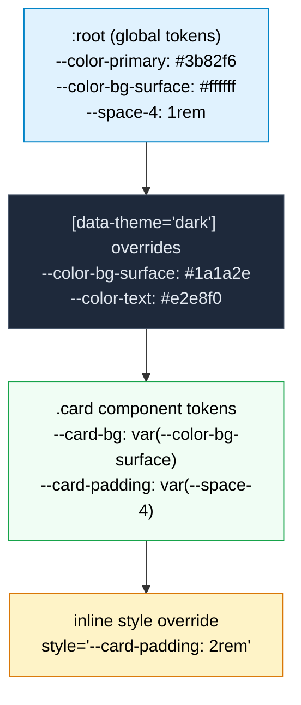

# [FEE-207] CSS Custom Properties & Theming

:::info
CSS custom properties (commonly called "CSS variables") are author-defined values declared with a `--` prefix and consumed via the `var()` function. Unlike preprocessor variables that compile away at build time, custom properties are live in the browser: they participate in the cascade, inherit through the DOM tree, respond to media queries and pseudo-classes, and can be read and written from JavaScript. Combined with the `@property` rule (CSS Properties and Values API), which adds type information, initial values, and inheritance control, custom properties form the foundation of modern theming systems. SHOULD use custom properties for design tokens. SHOULD use `@property` for animated custom properties.
:::

## Context

CSS has needed variables since its earliest days. In the late 2000s, preprocessors filled the gap. **Sass** (2006) introduced `$variables`, **Less** (2009) introduced `@variables`, and **Stylus** (2010) used unadorned identifiers. These tools transformed CSS authoring: a color palette defined once and referenced everywhere eliminated the find-and-replace workflow that had plagued stylesheets.

But preprocessor variables have a fundamental limitation: they do not exist at runtime. When Sass compiles `$primary: #3b82f6; .btn { color: $primary; }`, the output is `.btn { color: #3b82f6; }`. The variable is gone; the browser sees only the resolved value. They cannot change at runtime: when the user toggles dark mode, the compiled value is already frozen in the stylesheet.

The CSS Working Group recognized this need early. The first public working draft of **CSS Custom Properties for Cascading Variables Module Level 1** appeared in 2012. The specification reached Candidate Recommendation in 2015 and achieved broad browser support by 2017. The design was deliberately minimal: custom properties are properties (they cascade and inherit), and `var()` is a function (it substitutes values). No new language constructs were needed.

Custom properties solved the runtime problem but introduced a new limitation: they are untyped. The browser treats every custom property value as a string token list. This means custom properties cannot be smoothly transitioned or animated: the browser does not know whether `--angle` holds a `<length>`, a `<color>`, or an arbitrary string, so it cannot interpolate between two values. It falls back to a discrete flip at the 50% mark.

The **CSS Properties and Values API** (part of CSS Houdini) addressed this gap. Initially available only via the JavaScript `CSS.registerProperty()` method (Chrome 78, 2019), it became declarative with the `@property` at-rule, which reached Baseline support across all major browsers in July 2024 (per web.dev's announcement, cited in References). `@property` lets authors declare a custom property's syntax (type), initial value, and inheritance behavior, giving the browser the type information it needs to interpolate, validate, and optimize.

Together, custom properties and `@property` form the runtime theming layer of modern CSS. Design systems map tokens to custom properties, theme switches toggle property values on ancestor elements, and animations interpolate typed properties smoothly. Preprocessors were not displaced by this layer. Sass remains one of the most widely used CSS tools in developer surveys, and it is now common for production Sass codebases to emit custom properties from their builds rather than compiling every value to a static literal. The two coexist: Sass handles build-time constructs such as mixins, loops, and breakpoint math, while custom properties carry the runtime tokens that theme switches and JavaScript read and write. This article covers the mechanics, patterns, and pitfalls of that runtime layer.

## Visual

### Custom property cascade



**Reading the diagram.** Custom property values cascade from general to specific, just like regular CSS properties. Global tokens defined on `:root` are inherited by all elements. A `[data-theme="dark"]` selector overrides specific tokens for its subtree. A `.card` component defines its own tokens in terms of semantic tokens. An inline `style` attribute provides the highest-specificity override. At each level, only the changed properties are redeclared; everything else inherits from above.

## Example

### 1. Light/dark theme toggle with custom properties

```css
/* Global tokens */
:root {
  --color-bg: #ffffff;
  --color-text: #1a1a2e;
  --color-primary: #3b82f6;
  --color-surface: #f8fafc;
  --color-border: #e2e8f0;
  --shadow-sm: 0 1px 2px rgba(0, 0, 0, 0.05);
}

/* Dark theme override via attribute */
[data-theme="dark"] {
  --color-bg: #0f172a;
  --color-text: #e2e8f0;
  --color-primary: #60a5fa;
  --color-surface: #1e293b;
  --color-border: #334155;
  --shadow-sm: 0 1px 2px rgba(0, 0, 0, 0.3);
}

/* Automatic dark mode via user preference */
@media (prefers-color-scheme: dark) {
  :root:not([data-theme="light"]) {
    --color-bg: #0f172a;
    --color-text: #e2e8f0;
    --color-primary: #60a5fa;
    --color-surface: #1e293b;
    --color-border: #334155;
    --shadow-sm: 0 1px 2px rgba(0, 0, 0, 0.3);
  }
}

/* Components reference tokens; no theme-specific rules needed */
body {
  background: var(--color-bg);
  color: var(--color-text);
}

.card {
  background: var(--color-surface);
  border: 1px solid var(--color-border);
  border-radius: 0.5rem;
  padding: 1.5rem;
  box-shadow: var(--shadow-sm);
}

.btn-primary {
  background: var(--color-primary);
  color: var(--color-bg);
  border: none;
  padding: 0.5rem 1rem;
  border-radius: 0.375rem;
  cursor: pointer;
}
```

```html
<button onclick="cycleTheme()">Toggle theme</button>

<script>
  // In production, move this IIFE into <head>, before the stylesheet
  // paints, so the stored theme applies on the very first frame instead
  // of flashing the default theme and then swapping.
  (function () {
    const stored = localStorage.getItem('theme');
    if (stored === 'light' || stored === 'dark') {
      document.documentElement.setAttribute('data-theme', stored);
    }
  })();

  function cycleTheme() {
    const root = document.documentElement;
    const current = root.getAttribute('data-theme');
    // light -> dark -> auto (attribute removed, prefers-color-scheme decides)
    if (current === 'light') {
      root.setAttribute('data-theme', 'dark');
      localStorage.setItem('theme', 'dark');
    } else if (current === 'dark') {
      root.removeAttribute('data-theme');
      localStorage.removeItem('theme');
    } else {
      root.setAttribute('data-theme', 'light');
      localStorage.setItem('theme', 'light');
    }
  }
</script>
```

The `data-theme` attribute approach works with CSS attribute selectors and is semantic: the attribute describes state, not appearance. `cycleTheme()` cycles through a genuine third state; its third click removes the attribute entirely, and `:root:not([data-theme="light"])` then falls through to `prefers-color-scheme`. The inline script reads the stored choice synchronously before paint; without that step the page renders in the default theme for one frame and then flashes to the stored theme once a deferred script runs. See Argyle, "Building a theme switch component," web.dev (2022), cited in References, for the full pattern including reduced-motion handling.

### 2. @property enabling gradient angle animation

```css
@property --gradient-angle {
  syntax: "<angle>";
  initial-value: 0deg;
  inherits: false;
}

@property --color-start {
  syntax: "<color>";
  initial-value: #3b82f6;
  inherits: false;
}

@property --color-end {
  syntax: "<color>";
  initial-value: #8b5cf6;
  inherits: false;
}

.gradient-box {
  --gradient-angle: 45deg;
  --color-start: #3b82f6;
  --color-end: #8b5cf6;
  background: linear-gradient(var(--gradient-angle), var(--color-start), var(--color-end));
  transition: --gradient-angle 0.8s ease, --color-start 0.6s ease, --color-end 0.6s ease;
  width: 300px;
  height: 200px;
  border-radius: 1rem;
}

.gradient-box:hover {
  --gradient-angle: 225deg;
  --color-start: #f97316;
  --color-end: #ec4899;
}

/* Continuous rotation animation */
@keyframes spin-gradient {
  to {
    --gradient-angle: 360deg;
  }
}

.gradient-box--spinning {
  animation: spin-gradient 3s linear infinite;
}
```

Without the `@property` declarations, the gradient would snap instantly on hover because the browser cannot interpolate untyped custom properties. `--gradient-angle`, `--color-start`, and `--color-end` are all set and consumed on `.gradient-box` itself, which is why `inherits: false` is safe here (see Deep Dive for the case where it is not). With `@property`, the angle rotates smoothly and the colors blend through the color space.

### 3. JS-to-CSS communication via custom properties (mouse-tracking effect)

```css
.spotlight {
  --mouse-x: 50%;
  --mouse-y: 50%;
  position: relative;
  width: 400px;
  height: 300px;
  background: var(--color-surface, #1e293b);
  border-radius: 1rem;
  overflow: hidden;
}

.spotlight::after {
  content: "";
  position: absolute;
  inset: 0;
  background: radial-gradient(
    circle at var(--mouse-x) var(--mouse-y),
    rgba(59, 130, 246, 0.15) 0%,
    transparent 60%
  );
  pointer-events: none;
}
```

```javascript
const spotlight = document.querySelector('.spotlight');
let rafId = null;

spotlight.addEventListener('mousemove', (e) => {
  const rect = spotlight.getBoundingClientRect();
  const x = ((e.clientX - rect.left) / rect.width) * 100;
  const y = ((e.clientY - rect.top) / rect.height) * 100;

  // Cancel any pending frame so only the latest position is ever applied.
  if (rafId) cancelAnimationFrame(rafId);
  rafId = requestAnimationFrame(() => {
    spotlight.style.setProperty('--mouse-x', `${x}%`);
    spotlight.style.setProperty('--mouse-y', `${y}%`);
    rafId = null;
  });
});

// Reading custom property values
const styles = getComputedStyle(spotlight);
console.log(styles.getPropertyValue('--mouse-x')); // "50%"
```

JavaScript writes only two data values, `--mouse-x` and `--mouse-y`. The gradient math stays in CSS, so changing the visual treatment never touches the event handler. Scope JS-written properties to the innermost element that needs them, as this example does: an inherited custom property written high in the tree forces style recalculation across every descendant that might consume it, so writing `--mouse-x` directly on `.spotlight` rather than on `:root` keeps that recalculation local.

## Best Practices

**Scope global tokens to `:root`, component-specific properties to their component selector.** `:root` SHOULD hold only true design tokens (colors, spacing scale, typography) shared across the entire document. Component-internal properties such as `--card-padding` or `--modal-z-index` MUST be declared on the component's own selector. Placing everything on `:root` pollutes the global namespace and causes every descendant to inherit properties it will never use.

**Use `@property` to register animated custom properties with a concrete type.** MUST declare `syntax`, `inherits`, and `initial-value` for any custom property that participates in a CSS transition or `@keyframes` animation. Without registration the browser treats the value as an opaque string and cannot interpolate between two values: the property will snap discretely at the 50% mark instead of transitioning smoothly.

**Always provide a fallback in `var()` for properties without guaranteed inheritance.** `var(--token, fallback)` SHOULD supply a safe default whenever the property may not be defined on an ancestor. Alternatively, declare an `initial-value` via `@property`. An undefined custom property with no fallback resolves to the guaranteed-invalid value, a value the spec treats as invalid at computed-value time rather than as an empty string, which then falls back to the property's own initial value or its inherited value. That is rarely what the author intended, so an explicit fallback or `@property` registration makes the failure mode predictable instead of accidental.

**Use pseudo-private properties to protect a component's internal default from accidental overrides.** Prefix an internal fallback with an underscore convention, `--_bg`, and resolve the public token into it before use:

```css
.btn {
  --_bg: var(--btn-bg, #3b82f6);
  background: var(--_bg);
}
```

Lea Verou names this the pseudo-private properties technique (cited in References). It separates the property a component author intends consumers to set (`--btn-bg`) from the one the component's own rules consume (`--_bg`), so an unrelated `--_bg` set elsewhere in the cascade cannot clobber the component's internal computation.

**Implement dark mode with both `prefers-color-scheme` and a `data-theme` attribute.** Use `@media (prefers-color-scheme: dark)` on `:root:not([data-theme="light"])` to respect the system preference by default. SHOULD layer a `[data-theme="dark"]` selector alongside it so JavaScript can override the preference explicitly. This pattern supports three states (light, dark, and auto) without duplicating component rules. See Design Thinking below for `light-dark()`, which covers the color-only case with a single declaration per token.

## Design Thinking

### Why CSS needed runtime variables

Preprocessor variables solved the authoring problem: define once, use everywhere. But they could not solve the runtime problem. Consider dark mode:

```scss
// Sass approach: two separate rule sets
$bg-light: #ffffff;
$bg-dark: #1a1a2e;

.card { background: $bg-light; }

@media (prefers-color-scheme: dark) {
  .card { background: $bg-dark; }
}
```

This works for one property on one component. But a real design system has hundreds of tokens applied across hundreds of components. The Sass approach requires duplicating every rule that uses a theme-dependent value inside the media query. The stylesheet grows linearly with the product of token count and component count.

CSS custom properties collapse this to a single override point:

```css
:root {
  --color-bg-surface: #ffffff;
  --color-text-primary: #1a1a2e;
}

@media (prefers-color-scheme: dark) {
  :root {
    --color-bg-surface: #1a1a2e;
    --color-text-primary: #e2e8f0;
  }
}

.card { background: var(--color-bg-surface); color: var(--color-text-primary); }
```

Every component that references `--color-bg-surface` automatically updates when the media query matches. No duplication. No per-component overrides.

This same advantage applies to any runtime condition: viewport size, user preferences (reduced motion, high contrast), component state (hover, focus, disabled), locale-specific adjustments, or JavaScript-driven state changes.

### Native theme primitives: color-scheme and light-dark()

The token pattern above predates two features that now cover much of the same ground for color. `color-scheme: light dark` on `:root` tells the browser which color schemes the page supports, so browser-drawn UI (form controls, scrollbars, and the like) switches to dark styling on its own. Without it, a page with a dark custom-property theme still renders light scrollbars and white `<input>` backgrounds, a visible mismatch readers will hit with the attribute-only pattern in Example 1.

`light-dark()`, Baseline since May 2024, takes the two values a token would otherwise need and picks between them based on the active color scheme:

```css
:root {
  color-scheme: light dark;
  --color-bg: light-dark(#ffffff, #0f172a);
  --color-text: light-dark(#1a1a2e, #e2e8f0);
}
```

This collapses the paired `:root` / `[data-theme="dark"]` / `@media (prefers-color-scheme: dark)` blocks in Example 1 into a single declaration per token. `light-dark()` still cooperates with a `data-theme` override: set `color-scheme: light` or `color-scheme: dark` explicitly on `[data-theme="light"]` / `[data-theme="dark"]` to force one branch regardless of the system preference. The attribute-driven pattern in Example 1 remains the right tool when a token differs by more than color (spacing, font weight, border style) or when the toggle needs a third state that is not just "let the system decide," such as a forced high-contrast mode.

### @property as a bridge between strings and types

Without `@property`, custom properties are opaque to the browser's animation engine. Consider animating a gradient angle:

```css
/* This does NOT animate smoothly: the browser sees a string, not a number */
.element {
  --angle: 0deg;
  background: linear-gradient(var(--angle), #3b82f6, #8b5cf6);
  transition: --angle 1s;
}
.element:hover {
  --angle: 180deg;
}
```

The browser cannot interpolate between `0deg` and `180deg` because it does not know `--angle` is an angle. It treats it as a string and performs a discrete swap.

`@property` provides the missing type information:

```css
@property --angle {
  syntax: "<angle>";
  initial-value: 0deg;
  inherits: false;
}

.element {
  --angle: 0deg;
  background: linear-gradient(var(--angle), #3b82f6, #8b5cf6);
  transition: --angle 1s ease;
}
.element:hover {
  --angle: 180deg;
}
```

Now the browser knows `--angle` is an `<angle>`. It interpolates smoothly from `0deg` to `180deg`. This makes gradient-angle transitions possible in pure CSS; browsers treat gradients as images and could not previously transition them at all.

The `@property` rule accepts three descriptors:

- **`syntax`**: the CSS value type. Common types include `"<color>"`, `"<length>"`, `"<number>"`, `"<angle>"`, `"<percentage>"`, `"<length-percentage>"`, `"<integer>"`, `"<image>"`, `"<url>"`, `"<transform-function>"`, `"<custom-ident>"`, `"<time>"`, and `"<resolution>"`, combined with the `|` (either) combinator and the `+` (space-separated list) / `#` (comma-separated list) multipliers, or `"*"` for a universal type that accepts any value. See MDN's `@property` reference (cited in References) for the complete grammar.
- **`initial-value`**: the default value used when the property is not set (required unless syntax is `"*"`)
- **`inherits`**: `true` or `false`, controlling whether the property inherits from parent elements

### Framework theming via custom properties

Modern CSS frameworks have converged on custom properties as their theming layer:

**Tailwind CSS v4** made CSS-first configuration the default, replacing the primary role of `tailwind.config.js` with an `@theme` block. JS configs remain supported via the `@config` directive for teams migrating incrementally. Theme values are defined as custom properties inside `@theme`:

```css
@import "tailwindcss";
@theme {
  --color-primary: #3b82f6;
  --color-surface: #ffffff;
  --radius-lg: 0.75rem;
}
```

These properties map directly to utility classes (`bg-primary`, `text-surface`, `rounded-lg`). Overriding them at any scope changes the utility output for that subtree.

**Chakra UI v3** maps its semantic tokens to CSS custom properties at runtime. Defining `semanticTokens: { colors: { bg: { value: { base: '{colors.white}', _dark: '{colors.gray.800}' } } } }` inside `defineConfig` generates `--chakra-colors-bg` and swaps its value based on the active color mode. Chakra v2's shorter `{ default: 'white', _dark: 'gray.800' }` shape is no longer a valid token definition in v3: the migration guide requires values to be wrapped in a `value` key, and code carried over unchanged from v2 does not produce the intended token (cited in References).

**Material UI (MUI)** generates CSS custom properties from its theme object, but only when opted in. With `createTheme({ cssVariables: true })`, `theme.palette.primary.main` becomes available as `var(--mui-palette-primary-main)`. Without that flag, MUI resolves styles at the JS layer and no corresponding custom property exists, so CSS written against `--mui-palette-primary-main` silently matches nothing.

**Radix Themes** exposes a comprehensive set of CSS custom properties for colors, spacing, and radii, allowing deep customization without touching the component source.

**Open Props** takes the purest approach: it is nothing but CSS custom properties, design tokens for colors (adaptive light/dark), spacing, typography, easing, shadows, aspect ratios, and borders. At about 4 KB compressed, it provides a complete token system with zero JavaScript.

### Design token tiers

Production design systems organize tokens into tiers:

**Global tokens** are raw values with no semantic meaning: `--blue-500: #3b82f6`, `--space-4: 1rem`, `--font-size-lg: 1.125rem`. They correspond to a design system's primitive palette.

**Semantic tokens** map intent to global tokens: `--color-primary: var(--blue-500)`, `--color-bg-surface: var(--white)`, `--spacing-component-gap: var(--space-4)`. Semantic tokens change per theme: in dark mode, `--color-bg-surface` might reference `--gray-900` instead of `--white`.

**Component tokens** scope decisions to a specific component: `--card-padding: var(--spacing-component-gap)`, `--card-radius: var(--radius-lg)`, `--card-bg: var(--color-bg-surface)`. Component tokens enable per-component overrides without affecting the global system.

Production teams rarely hand-author these tiers directly into CSS. The W3C Design Tokens Community Group (DTCG) defines a JSON interchange format for tokens that is platform-neutral: colors, dimensions, and typography described once and compiled to whatever target a platform needs. Style Dictionary is a widely adopted build tool for that compilation step; pointed at a DTCG-shaped token file, it emits the `:root` custom-property blocks shown above as one of several possible outputs, alongside iOS, Android, or Sass targets generated from the same source.

This three-tier architecture maps directly to CSS custom property scoping: global tokens on `:root`, semantic overrides on theme selectors (`[data-theme="dark"]`), and component tokens on the component's own selector.

## Deep Dive

### @property gotchas

Two behaviors of `@property` trip up authors who copy the pattern from Example 2. First, `initial-value` must be computationally independent: a value like `3em` is rejected because it depends on the parent's font size, which is not knowable at registration time, while `1px` or a bare `0deg` works because it resolves the same way regardless of context (per MDN's `@property` reference, cited in References). Second, `inherits: false` is safe in Example 2 because `--gradient-angle`, `--color-start`, and `--color-end` are both set and consumed on `.gradient-box` itself. Registering a property with `inherits: false` and then setting it on a parent while consuming it on a child breaks silently: the child never sees the parent's value and falls back to `initial-value` instead, because non-inheriting registered properties do not pass down the tree at all (per the `inherits` descriptor in the CSS Properties and Values API spec, cited in References). Set `inherits: true` for any token a parent sets and a descendant consumes. A separate gotcha worth knowing: registering an animated custom property with `@property` also means its transitions run on the main thread instead of the compositor, forcing a style recalculation on every frame (Bram.us, 2023, cited in References). This cost is one more reason to register properties only where they are animated rather than registering broadly.

### Querying theme state with container style queries

Custom properties can also drive layout decisions, not just values, through container style queries. `@container style(--theme: dark)` lets a descendant match on an ancestor's custom-property value the same way a media query matches a viewport width:

```css
.panel { container-type: normal; container-name: themed; }

@container themed style(--theme: dark) {
  .panel-icon { filter: invert(1); }
}
```

This turns `--theme` from a passive token consumed by `var()` into queryable state that layout can branch on directly. Container style queries reached Baseline newly available in May 2026, completing support with Firefox 151; Chrome and Edge have supported them since version 111 (2023) and Safari since version 18 (2024). Treat the pattern as safe for progressive enhancement given the May 2026 completion date. See Una Kravets, "Modern CSS theming with light-dark(), contrast-color(), and style queries" (una.im, 2026), cited in References, for the full pattern including style-query-driven theme variants.

## Common Mistakes

### 1. Using preprocessor variables when runtime flexibility is needed

**The mistake:** Using Sass variables for values that need to change at runtime:

```scss
// These values are baked into the output; they cannot change at runtime
$primary: #3b82f6;
$font-size-base: 1rem;

.text { color: $primary; font-size: $font-size-base; }
```

If the product later needs dark mode, a user-adjustable font size, or brand customization per tenant, every Sass reference must be refactored to custom properties.

**The fix:** Use custom properties for any value that might change at runtime. Preprocessor variables are still useful for build-time constants (breakpoint values used in `@media` rules, math operands, mixin parameters), but design tokens should be custom properties from the start.

### 2. Setting custom properties too frequently without requestAnimationFrame

**The mistake:** Updating custom properties on every mouse event without batching:

```javascript
// This fires 60-100+ times per second, potentially causing layout thrashing
element.addEventListener('mousemove', (e) => {
  element.style.setProperty('--x', e.clientX + 'px');
  element.style.setProperty('--y', e.clientY + 'px');
});
```

Each `setProperty` call can trigger style recalculation. Two calls per event means two potential recalculations per frame, and `mousemove` can fire faster than the display refresh rate.

**The fix:** Batch updates inside `requestAnimationFrame` to coalesce writes into a single frame:

```javascript
let rafId = null;

element.addEventListener('mousemove', (e) => {
  if (rafId) cancelAnimationFrame(rafId);
  rafId = requestAnimationFrame(() => {
    element.style.setProperty('--x', e.clientX + 'px');
    element.style.setProperty('--y', e.clientY + 'px');
    rafId = null;
  });
});
```

This ensures at most one style update per animation frame, regardless of how fast `mousemove` fires.

## Related Topics

- [CSS & Layout Systems Overview](/en/CSS%20and%20Layout%20Systems/200)
- [The Cascade, Specificity & Inheritance](/en/CSS%20and%20Layout%20Systems/201)
- [CSS Architecture & Scoping Strategies](/en/CSS%20and%20Layout%20Systems/205)
- [Modern CSS Frameworks](/en/CSS%20and%20Layout%20Systems/206)

## References

- W3C, "CSS Custom Properties for Cascading Variables Module Level 1," W3C Editor's Draft. https://drafts.csswg.org/css-variables/
- W3C, "CSS Properties and Values API Level 1," W3C (2024). https://www.w3.org/TR/css-properties-values-api-1/
- MDN, "Using CSS custom properties (variables)," MDN Web Docs. https://developer.mozilla.org/en-US/docs/Web/CSS/Guides/Cascading_variables/Using_custom_properties
- MDN, "@property," MDN Web Docs. https://developer.mozilla.org/en-US/docs/Web/CSS/Reference/At-rules/@property
- MDN, "light-dark() CSS function," MDN Web Docs. https://developer.mozilla.org/en-US/docs/Web/CSS/Reference/Values/color_value/light-dark
- MDN, "Using container size and style queries," MDN Web Docs. https://developer.mozilla.org/en-US/docs/Web/CSS/Guides/Containment/Container_size_and_style_queries
- Google, "@property: next-gen CSS variables now with universal browser support," web.dev (2024). https://web.dev/blog/at-property-baseline
- Google, "@property: giving superpowers to CSS variables," web.dev. https://web.dev/articles/at-property
- Adam Argyle, "Building a theme switch component," web.dev (2022). https://web.dev/articles/building/a-theme-switch-component
- Una Kravets, "Modern CSS theming with light-dark(), contrast-color(), and style queries," una.im (2026). https://una.im/modern-css-theming
- Bram.us, "The gotcha with @property animating custom properties," Bram.us (2023). https://www.bram.us/2023/02/01/the-gotcha-with-animating-custom-properties/
- Lea Verou, "Custom properties with defaults: 3+1 strategies," lea.verou.me (2021). https://lea.verou.me/blog/2021/10/custom-properties-with-defaults/
- Chakra UI, "Migrating to v3," Chakra UI documentation. https://chakra-ui.com/docs/get-started/migration
- W3C Design Tokens Community Group, "Design Tokens Format Module," designtokens.org. https://www.designtokens.org/
- Style Dictionary, documentation. https://styledictionary.com/
- Open Props, project site. https://open-props.style/
- CSS-Tricks, "Open Props and Custom Properties as a System," CSS-Tricks. https://css-tricks.com/open-props-and-custom-properties-as-a-system/
