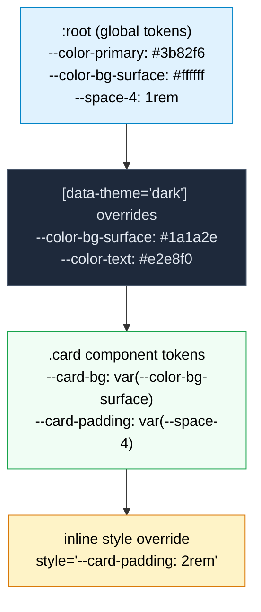

# [FEE-207] CSS Custom Properties & Theming

:::info
CSS custom properties (commonly called "CSS variables") are author-defined values declared with a `--` prefix and consumed via the `var()` function. Unlike preprocessor variables that compile away at build time, custom properties are live in the browser -- they participate in the cascade, inherit through the DOM tree, respond to media queries and pseudo-classes, and can be read and written from JavaScript. Combined with the `@property` rule (CSS Properties and Values API), which adds type information, initial values, and inheritance control, custom properties form the foundation of modern theming systems. SHOULD use custom properties for design tokens. SHOULD use `@property` for animated custom properties.
:::

## Context

CSS has needed variables since its earliest days. In the late 2000s, preprocessors filled the gap. **Sass** (2006) introduced `$variables`, **Less** (2009) introduced `@variables`, and **Stylus** (2010) used unadorned identifiers. These tools transformed CSS authoring -- a color palette defined once and referenced everywhere eliminated the find-and-replace workflow that had plagued stylesheets.

But preprocessor variables have a fundamental limitation: they do not exist at runtime. When Sass compiles `$primary: #3b82f6; .btn { color: $primary; }`, the output is `.btn { color: #3b82f6; }`. The variable is gone. The browser sees only the resolved value. This means preprocessor variables cannot respond to runtime conditions -- they cannot change when the user toggles dark mode, when a media query matches, when a component is nested inside a different context, or when JavaScript updates application state.

The CSS Working Group recognized this need early. The first public working draft of **CSS Custom Properties for Cascading Variables Module Level 1** appeared in 2012. The specification reached Candidate Recommendation in 2015 and achieved broad browser support by 2017. The design was deliberately minimal: custom properties are properties (they cascade and inherit), and `var()` is a function (it substitutes values). No new language constructs were needed.

Custom properties solved the runtime problem but introduced a new limitation: they are untyped. The browser treats every custom property value as a string token list. This means custom properties cannot be smoothly transitioned or animated -- the browser does not know whether `--angle` holds a `<length>`, a `<color>`, or an arbitrary string, so it cannot interpolate between two values. It falls back to a discrete flip at the 50% mark.

The **CSS Properties and Values API** (part of CSS Houdini) addressed this gap. Initially available only via the JavaScript `CSS.registerProperty()` method (Chrome 78, 2019), it became declarative with the `@property` at-rule, which reached Baseline support across all major browsers in July 2024. `@property` lets authors declare a custom property's syntax (type), initial value, and inheritance behavior -- giving the browser the type information it needs to interpolate, validate, and optimize.

Together, custom properties and `@property` form the runtime theming layer of modern CSS. Design systems map tokens to custom properties. Theme switches toggle property values on ancestor elements. Animations interpolate typed properties smoothly. JavaScript communicates state to CSS through property values. This article covers the mechanics, patterns, and pitfalls of this system.

## Principle

**SHOULD use custom properties for design tokens.** Design tokens -- colors, spacing, typography, shadows, radii -- are the atomic values of a design system. Encoding them as custom properties makes them available to every CSS rule in the document, changeable at any scope level, and responsive to runtime conditions like dark mode.

**SHOULD use `@property` for animated custom properties.** When a custom property participates in a transition or animation, register it with `@property` to declare its type. Without registration, the browser treats the value as a string and cannot interpolate -- the property will snap discretely instead of transitioning smoothly.

## Design Thinking

### Why CSS needed runtime variables

Preprocessor variables solved the authoring problem -- define once, use everywhere -- but they could not solve the runtime problem. Consider dark mode:

```scss
// Sass approach: two separate rule sets
$bg-light: #ffffff;
$bg-dark: #1a1a2e;

.card { background: $bg-light; }

@media (prefers-color-scheme: dark) {
  .card { background: $bg-dark; }
}
```

This works for one property on one component. But a real design system has hundreds of tokens applied across hundreds of components. The Sass approach requires duplicating every rule that uses a theme-dependent value inside the media query. The stylesheet grows linearly with the product of token count and component count.

CSS custom properties collapse this to a single override point:

```css
:root {
  --color-bg-surface: #ffffff;
  --color-text-primary: #1a1a2e;
}

@media (prefers-color-scheme: dark) {
  :root {
    --color-bg-surface: #1a1a2e;
    --color-text-primary: #e2e8f0;
  }
}

.card { background: var(--color-bg-surface); color: var(--color-text-primary); }
```

Every component that references `--color-bg-surface` automatically updates when the media query matches. No duplication. No per-component overrides.

This same advantage applies to any runtime condition: viewport size, user preferences (reduced motion, high contrast), component state (hover, focus, disabled), locale-specific adjustments, or JavaScript-driven state changes.

### @property as a bridge between strings and types

Without `@property`, custom properties are opaque to the browser's animation engine. Consider animating a gradient angle:

```css
/* This does NOT animate smoothly -- the browser sees a string, not a number */
.element {
  --angle: 0deg;
  background: linear-gradient(var(--angle), #3b82f6, #8b5cf6);
  transition: --angle 1s;
}
.element:hover {
  --angle: 180deg;
}
```

The browser cannot interpolate between `0deg` and `180deg` because it does not know `--angle` is an angle. It treats it as a string and performs a discrete swap.

`@property` provides the missing type information:

```css
@property --angle {
  syntax: "<angle>";
  initial-value: 0deg;
  inherits: false;
}

.element {
  --angle: 0deg;
  background: linear-gradient(var(--angle), #3b82f6, #8b5cf6);
  transition: --angle 1s ease;
}
.element:hover {
  --angle: 180deg;
}
```

Now the browser knows `--angle` is an `<angle>`. It interpolates smoothly from `0deg` to `180deg`. This unlocks animations that were previously impossible in pure CSS -- gradient transitions, color-space interpolations, and coordinated multi-property animations driven by a single custom property.

The `@property` rule accepts three descriptors:

- **`syntax`** -- the CSS value type: `"<color>"`, `"<length>"`, `"<number>"`, `"<angle>"`, `"<percentage>"`, `"<length-percentage>"`, `"<integer>"`, `"<image>"`, `"<url>"`, `"<transform-function>"`, `"<custom-ident>"`, or `"*"` (universal, any value)
- **`initial-value`** -- the default value used when the property is not set (required unless syntax is `"*"`)
- **`inherits`** -- `true` or `false`, controlling whether the property inherits from parent elements

### Framework theming via custom properties

Modern CSS frameworks have converged on custom properties as their theming layer:

**Tailwind CSS v4** replaced `tailwind.config.js` with CSS-first configuration. Theme values are defined as custom properties inside `@theme`:

```css
@import "tailwindcss";
@theme {
  --color-primary: #3b82f6;
  --color-surface: #ffffff;
  --radius-lg: 0.75rem;
}
```

These properties map directly to utility classes (`bg-primary`, `text-surface`, `rounded-lg`). Overriding them at any scope changes the utility output for that subtree.

**Chakra UI** maps its JavaScript semantic tokens to CSS custom properties at runtime. When you define `semanticTokens: { colors: { bg: { default: 'white', _dark: 'gray.800' } } }`, Chakra generates `--chakra-colors-bg` and swaps its value based on the active color mode.

**Material UI (MUI)** generates CSS custom properties from its theme object. `theme.palette.primary.main` becomes `var(--mui-palette-primary-main)`. This enables CSS-level overrides without JavaScript re-rendering.

**Radix Themes** exposes a comprehensive set of CSS custom properties for colors, spacing, and radii, allowing deep customization without touching the component source.

**Open Props** takes the purest approach: it is nothing but CSS custom properties -- design tokens for colors (adaptive light/dark), spacing, typography, easing, shadows, aspect ratios, and borders. At 4.4 KB compressed, it provides a complete token system with zero JavaScript.

### Design token tiers

Production design systems organize tokens into tiers:

**Global tokens** are raw values with no semantic meaning: `--blue-500: #3b82f6`, `--space-4: 1rem`, `--font-size-lg: 1.125rem`. They correspond to a design system's primitive palette.

**Semantic tokens** map intent to global tokens: `--color-primary: var(--blue-500)`, `--color-bg-surface: var(--white)`, `--spacing-component-gap: var(--space-4)`. Semantic tokens change per theme -- in dark mode, `--color-bg-surface` might reference `--gray-900` instead of `--white`.

**Component tokens** scope decisions to a specific component: `--card-padding: var(--spacing-component-gap)`, `--card-radius: var(--radius-lg)`, `--card-bg: var(--color-bg-surface)`. Component tokens enable per-component overrides without affecting the global system.

This three-tier architecture maps directly to CSS custom property scoping: global tokens on `:root`, semantic overrides on theme selectors (`[data-theme="dark"]`), and component tokens on the component's own selector.

## Visual

### Custom property cascade



**Reading the diagram.** Custom property values cascade from general to specific, just like regular CSS properties. Global tokens defined on `:root` are inherited by all elements. A `[data-theme="dark"]` selector overrides specific tokens for its subtree. A `.card` component defines its own tokens in terms of semantic tokens. An inline `style` attribute provides the highest-specificity override. At each level, only the changed properties are redeclared -- everything else inherits from above.

## Example

### 1. Light/dark theme toggle with custom properties

```css
/* Global tokens */
:root {
  --color-bg: #ffffff;
  --color-text: #1a1a2e;
  --color-primary: #3b82f6;
  --color-surface: #f8fafc;
  --color-border: #e2e8f0;
  --shadow-sm: 0 1px 2px rgba(0, 0, 0, 0.05);
}

/* Dark theme override via attribute */
[data-theme="dark"] {
  --color-bg: #0f172a;
  --color-text: #e2e8f0;
  --color-primary: #60a5fa;
  --color-surface: #1e293b;
  --color-border: #334155;
  --shadow-sm: 0 1px 2px rgba(0, 0, 0, 0.3);
}

/* Automatic dark mode via user preference */
@media (prefers-color-scheme: dark) {
  :root:not([data-theme="light"]) {
    --color-bg: #0f172a;
    --color-text: #e2e8f0;
    --color-primary: #60a5fa;
    --color-surface: #1e293b;
    --color-border: #334155;
    --shadow-sm: 0 1px 2px rgba(0, 0, 0, 0.3);
  }
}

/* Components reference tokens -- no theme-specific rules needed */
body {
  background: var(--color-bg);
  color: var(--color-text);
}

.card {
  background: var(--color-surface);
  border: 1px solid var(--color-border);
  border-radius: 0.5rem;
  padding: 1.5rem;
  box-shadow: var(--shadow-sm);
}

.btn-primary {
  background: var(--color-primary);
  color: var(--color-bg);
  border: none;
  padding: 0.5rem 1rem;
  border-radius: 0.375rem;
  cursor: pointer;
}
```

```html
<button onclick="toggleTheme()">Toggle theme</button>

<script>
function toggleTheme() {
  const root = document.documentElement;
  const current = root.getAttribute('data-theme');
  root.setAttribute('data-theme', current === 'dark' ? 'light' : 'dark');
}
</script>
```

The `data-theme` attribute approach is preferred over class toggling because it works with CSS attribute selectors, is semantic (the attribute describes state, not appearance), and allows a third "auto" state that defers to `prefers-color-scheme`. The `:root:not([data-theme="light"])` pattern ensures automatic dark mode only activates when the user has not explicitly chosen light mode.

### 2. @property enabling gradient angle animation

```css
@property --gradient-angle {
  syntax: "<angle>";
  initial-value: 0deg;
  inherits: false;
}

@property --color-start {
  syntax: "<color>";
  initial-value: #3b82f6;
  inherits: false;
}

@property --color-end {
  syntax: "<color>";
  initial-value: #8b5cf6;
  inherits: false;
}

.gradient-box {
  --gradient-angle: 45deg;
  --color-start: #3b82f6;
  --color-end: #8b5cf6;
  background: linear-gradient(var(--gradient-angle), var(--color-start), var(--color-end));
  transition: --gradient-angle 0.8s ease, --color-start 0.6s ease, --color-end 0.6s ease;
  width: 300px;
  height: 200px;
  border-radius: 1rem;
}

.gradient-box:hover {
  --gradient-angle: 225deg;
  --color-start: #f97316;
  --color-end: #ec4899;
}

/* Continuous rotation animation */
@keyframes spin-gradient {
  to {
    --gradient-angle: 360deg;
  }
}

.gradient-box--spinning {
  animation: spin-gradient 3s linear infinite;
}
```

Without the `@property` declarations, the gradient would snap instantly on hover because the browser cannot interpolate untyped custom properties. With `@property`, the angle rotates smoothly and the colors blend through the color space.

### 3. JS-to-CSS communication via custom properties (mouse-tracking effect)

```css
.spotlight {
  --mouse-x: 50%;
  --mouse-y: 50%;
  position: relative;
  width: 400px;
  height: 300px;
  background: var(--color-surface, #1e293b);
  border-radius: 1rem;
  overflow: hidden;
}

.spotlight::after {
  content: "";
  position: absolute;
  inset: 0;
  background: radial-gradient(
    circle at var(--mouse-x) var(--mouse-y),
    rgba(59, 130, 246, 0.15) 0%,
    transparent 60%
  );
  pointer-events: none;
}
```

```javascript
const spotlight = document.querySelector('.spotlight');

spotlight.addEventListener('mousemove', (e) => {
  const rect = spotlight.getBoundingClientRect();
  const x = ((e.clientX - rect.left) / rect.width) * 100;
  const y = ((e.clientY - rect.top) / rect.height) * 100;

  // Use requestAnimationFrame to batch style updates
  requestAnimationFrame(() => {
    spotlight.style.setProperty('--mouse-x', `${x}%`);
    spotlight.style.setProperty('--mouse-y', `${y}%`);
  });
});

// Reading custom property values
const styles = getComputedStyle(spotlight);
console.log(styles.getPropertyValue('--mouse-x')); // "50%"
```

Custom properties are the preferred bridge between JavaScript and CSS. Setting a custom property via `element.style.setProperty()` is more performant than modifying individual CSS properties because it allows CSS to handle the visual mapping -- JavaScript only communicates the data (`--mouse-x`, `--mouse-y`), while CSS decides what to do with it (the radial gradient position). This separation keeps rendering logic in the stylesheet and interaction logic in JavaScript.

## Common Mistakes

### 1. Putting all custom properties on :root when component-scoped would be better

**The mistake:** Declaring every custom property globally, even properties that are only relevant to a single component:

```css
/* 200+ properties on :root, most used by only one component */
:root {
  --card-padding: 1.5rem;
  --card-radius: 0.5rem;
  --card-shadow: 0 1px 3px rgba(0,0,0,0.1);
  --modal-overlay-opacity: 0.5;
  --tooltip-arrow-size: 6px;
  --sidebar-width: 280px;
  /* ... hundreds more */
}
```

This pollutes the global namespace, makes it hard to find which component uses which property, and risks accidental name collisions. Every descendant inherits every property, wasting memory in large DOMs.

**The fix:** Scope component-specific properties to their component. Reserve `:root` for true global tokens (colors, spacing scale, typography):

```css
:root {
  --color-surface: #f8fafc;
  --radius-md: 0.5rem;
  --space-6: 1.5rem;
}

.card {
  --card-padding: var(--space-6);
  --card-radius: var(--radius-md);
  background: var(--color-surface);
  padding: var(--card-padding);
  border-radius: var(--card-radius);
}
```

### 2. Using preprocessor variables when runtime flexibility is needed

**The mistake:** Using Sass variables for values that need to change at runtime:

```scss
// These values are baked into the output -- they cannot change at runtime
$primary: #3b82f6;
$font-size-base: 1rem;

.text { color: $primary; font-size: $font-size-base; }
```

If the product later needs dark mode, a user-adjustable font size, or brand customization per tenant, every Sass reference must be refactored to custom properties.

**The fix:** Use custom properties for any value that might change at runtime. Preprocessor variables are still useful for build-time constants (breakpoint values used in `@media` rules, math operands, mixin parameters), but design tokens should be custom properties from the start.

### 3. Forgetting the fallback in var() for properties without guaranteed inheritance

**The mistake:** Using `var()` without a fallback when the custom property might not be defined:

```css
/* If --accent is never defined, this computes to the initial value
   of 'color' (often black), not a sensible default */
.highlight { color: var(--accent); }
```

When `var()` references an undefined custom property with no fallback, the property becomes the **guaranteed-invalid value**. The browser then falls back to the inherited value or the property's initial value -- which may not be what the author intended.

**The fix:** Always provide a fallback for custom properties that might not be inherited:

```css
.highlight { color: var(--accent, #3b82f6); }
```

Or, use `@property` to declare an initial value:

```css
@property --accent {
  syntax: "<color>";
  initial-value: #3b82f6;
  inherits: true;
}
```

### 4. Not using @property for animated custom properties

**The mistake:** Expecting a custom property to transition smoothly without registering its type:

```css
.progress {
  --progress: 0;
  background: linear-gradient(90deg, #3b82f6 calc(var(--progress) * 1%), transparent 0);
  transition: --progress 0.5s ease;
}
.progress.complete {
  --progress: 100;
}
```

Without `@property`, the browser treats `--progress` as a string. The transition does not interpolate -- it snaps from `0` to `100` at the 50% mark.

**The fix:** Register the property with `@property`:

```css
@property --progress {
  syntax: "<number>";
  initial-value: 0;
  inherits: false;
}
```

Now the browser knows `--progress` is a `<number>` and can interpolate smoothly from `0` to `100` over the transition duration.

### 5. Setting custom properties too frequently without requestAnimationFrame

**The mistake:** Updating custom properties on every mouse event without batching:

```javascript
// This fires 60-100+ times per second, potentially causing layout thrashing
element.addEventListener('mousemove', (e) => {
  element.style.setProperty('--x', e.clientX + 'px');
  element.style.setProperty('--y', e.clientY + 'px');
});
```

Each `setProperty` call can trigger style recalculation. Two calls per event means two potential recalculations per frame, and `mousemove` can fire faster than the display refresh rate.

**The fix:** Batch updates inside `requestAnimationFrame` to coalesce writes into a single frame:

```javascript
let rafId = null;

element.addEventListener('mousemove', (e) => {
  if (rafId) cancelAnimationFrame(rafId);
  rafId = requestAnimationFrame(() => {
    element.style.setProperty('--x', e.clientX + 'px');
    element.style.setProperty('--y', e.clientY + 'px');
    rafId = null;
  });
});
```

This ensures at most one style update per animation frame, regardless of how fast `mousemove` fires.

## Related FEEs

| FEE | Relationship |
|-----|-------------|
| [FEE-200 CSS & Layout Systems Overview](./200.md) | Parent overview. CSS custom properties are a foundational primitive in the modern CSS landscape described in FEE-200. |
| [FEE-201 The Cascade, Specificity & Inheritance](./201.md) | Custom properties participate fully in the cascade and inherit by default. Understanding cascade order and specificity is essential for predicting which custom property value wins when multiple scopes define the same property. |
| [FEE-205 CSS Architecture & Scoping Strategies](./205.md) | Design token tiers (global, semantic, component) are an architectural pattern. CSS custom properties implement the token layer that scoping strategies organize. |
| [FEE-206 Modern CSS Frameworks](./206.md) | Modern frameworks use custom properties internally: Tailwind v4's `@theme`, Open Props' entire model, Chakra UI's semantic tokens, and MUI's theme provider all generate or consume CSS custom properties. |

## References

- [W3C CSS Custom Properties for Cascading Variables Module Level 1](https://drafts.csswg.org/css-variables/) -- The specification defining custom properties (`--*`) and the `var()` function, including cascading behavior, the guaranteed-invalid value, and serialization rules
- [W3C CSS Properties and Values API Level 1](https://www.w3.org/TR/css-properties-values-api-1/) -- The Houdini specification defining `@property` and `CSS.registerProperty()`, enabling typed custom properties with syntax, initial values, and inheritance control
- [MDN: Using CSS custom properties (variables)](https://developer.mozilla.org/en-US/docs/Web/CSS/Guides/Cascading_variables/Using_custom_properties) -- Comprehensive guide covering declaration, `var()` usage, fallbacks, inheritance, and JavaScript interop
- [MDN: @property](https://developer.mozilla.org/en-US/docs/Web/CSS/Reference/At-rules/@property) -- Reference for the `@property` at-rule including syntax descriptors, initial-value requirements, and browser support
- [web.dev: @property -- Next-gen CSS variables now with universal browser support](https://web.dev/blog/at-property-baseline) -- Google's article on `@property` reaching Baseline support, with animation examples and performance implications
- [web.dev: @property -- giving superpowers to CSS variables](https://web.dev/articles/at-property) -- Detailed walkthrough of `@property` capabilities including gradient animation, typed fallbacks, and practical use cases
- [Lea Verou: Custom properties with defaults -- 3+1 strategies](https://lea.verou.me/blog/2021/10/custom-properties-with-defaults/) -- Expert analysis of patterns for providing default values in custom property APIs, including the pseudo-private properties technique
- [Open Props](https://open-props.style/) -- A complete design token system built entirely with CSS custom properties, providing adaptive colors, spacing, typography, easing, and shadows at 4.4 KB compressed
- [CSS-Tricks: Open Props and Custom Properties as a System](https://css-tricks.com/open-props-and-custom-properties-as-a-system/) -- Analysis of using CSS custom properties as a systematic design token layer, with Open Props as the primary case study
