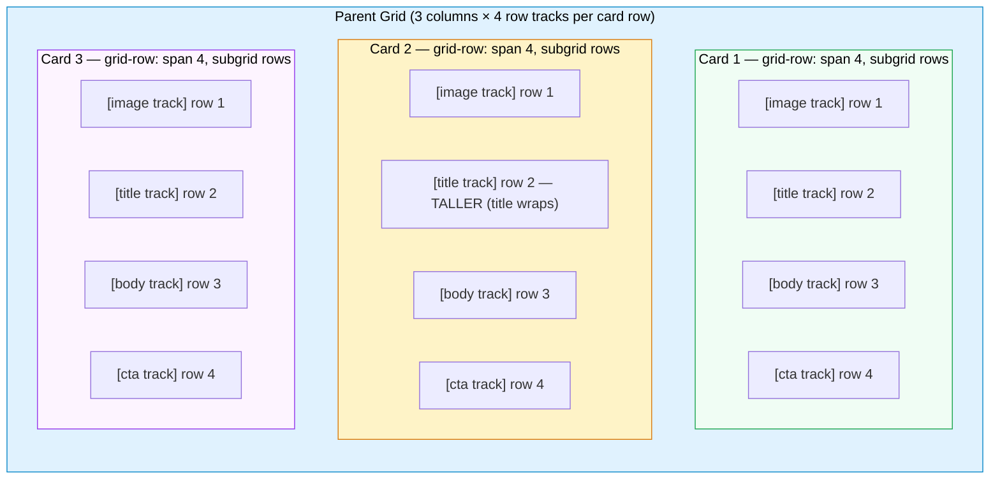

# CSS Subgrid

CSS Grid allows a grid container's direct children to participate in a
two-dimensional layout. But nested elements — children of those children —
cannot align to the outer grid's tracks by default. Before subgrid, aligning
card titles across a row of cards required JavaScript measurement or duplicated
grid definitions that drifted out of sync whenever the parent grid changed.
CSS Subgrid solves this problem at the layout engine level, eliminating an
entire category of fragile workarounds that had accumulated in frontend
practice over the years.

The `subgrid` value for `grid-template-rows` or `grid-template-columns` allows
a nested grid to inherit the track definitions of its parent. The nested element
becomes a "subgrid container" and its children participate in the parent's
grid lines as if they were direct children of that parent grid. No duplication,
no measurement, no JavaScript. The track sizes are calculated once by the
parent grid's sizing algorithm, which accounts for the tallest content across
all participating subgrid containers simultaneously — a behavior that is
fundamentally impossible to replicate cleanly without the layout engine's
direct involvement.

The primary use case is alignment across card-based layouts: product cards in a
grid where the image, title, body text, and call-to-action button must all line
up across cards in the same row even when their content differs in length or
height. Subgrid eliminates the need for fixed heights or JavaScript-measured
alignment. The parent's row tracks expand automatically to accommodate the
tallest content in each track, and all cards in the same row share those track
sizes without any additional CSS rules on the card children.

Browser support covers all major browsers since 2023 (Chrome 117, Firefox 71,
Safari 16). The feature has reached Baseline status, meaning it can be used
without polyfills in production for most applications. Use
`@supports (grid-template-rows: subgrid)` for progressive enhancement in
applications that must support older environments or embedded browser contexts
that predate subgrid support. The fallback can be a simple flexbox column
layout that is functional without cross-card alignment.

## Scenario

You are building a card layout where each card contains a header, body, and footer. In a standard grid, the internal elements of each card are independent flex or block containers, so header heights don't align across cards in the same row. Subgrid lets a card's children participate in the parent grid's row tracks, aligning internal elements across cards without JavaScript measurement or fixed heights.

## Design Thinking

### How subgrid inherits tracks

A subgrid container declares `display: grid` on itself along with
`grid-template-rows: subgrid` and/or `grid-template-columns: subgrid`. When
the browser encounters these declarations, it does not create new track
definitions on the subgrid container. Instead, the subgrid container's children
are placed directly into the parent's existing tracks as though the subgrid
container were transparent for layout purposes on the subgridded axis. The
parent grid's sizing algorithm sees all children of all participating subgrid
containers as contributing to the same shared tracks in the same sizing pass.

The subgrid container itself must still be placed as a grid item in the parent
grid. This placement determines which tracks the subgrid spans. A card that
needs to fill four row tracks — image, title, body, CTA — must declare
`grid-row: span 4` so the browser knows which parent tracks its children will
be placed into. If the span is wrong, the subgrid has fewer (or more) tracks
than its children expect, and children will overflow or collapse into unexpected
positions without any error or warning in the browser console. This silent
failure is a key hazard of subgrid that the span discipline prevents.

The relationship between span and track count is load-bearing. Before writing
any subgrid rule, count the row or column tracks the subgrid needs to expose to
its children, then set the span on the subgrid container accordingly. The span
must match the number of tracks the children will occupy. When the parent grid
defines named lines, children placed inside the subgrid can use those names for
explicit placement, which is more robust than numeric placement because named
lines survive reordering of tracks in the parent as long as the names are
preserved.

### Rows vs. columns subgrid

Either axis, or both, can be subgridded independently. Most card-layout use
cases subgrid only the row axis, because the goal is to align content sections
— image, title, body, CTA — vertically across cards occupying the same
horizontal row. Each card occupies one column in the parent grid, so the column
axis is already handled by the parent's column track sizing. Subgridding the
column axis in this scenario would distribute the card's internal children
across the parent's multiple column tracks, which is almost never the intent
when each card is meant to occupy a single column.

Using both axes simultaneously is possible and useful for certain patterns. A
two-dimensional subgrid makes the container's children addressable by both the
parent's row and column tracks. This is appropriate for complex table-like
components — a data grid, a complex form, a calendar — where cells must align
on both axes simultaneously with their neighbors. The cost is additional layout
coupling: every child placement in the subgrid depends on both the parent's row
count and column count being correctly reflected in the container's `grid-row`
and `grid-column` spans. This makes the component less portable across layouts
with different column counts.

When only one axis requires cross-item alignment, subgrid only that axis.
Subgridding an axis that does not need alignment adds conceptual overhead
without layout benefit and makes the container harder to reason about when the
parent grid later changes its track definitions, adds responsive breakpoints,
or is placed inside a different parent layout context.

### Subgrid and named grid lines

Named grid lines defined in the parent grid are accessible within the subgrid.
If the parent declares
`grid-template-rows: [card-start] auto [title-start] auto [body-start] auto [cta-start] auto [card-end]`,
a child inside the subgrid can use `grid-row: title-start / body-start` for
explicit placement by name rather than by number. This is more robust than
numeric placement because it survives reordering of tracks in the parent as
long as the names remain stable. Named lines create a semantic contract between
the parent layout component and the subgrid children that belong to it.

Named grid areas defined with `grid-template-areas` in the parent are similarly
accessible to subgrid children. When building design systems where the parent
grid is owned by a layout component and the subgrid children are authored
separately — perhaps by a different team or composed from different source
files — named lines provide the stable interface between the two concerns. Any
refactoring of the parent grid that preserves the named lines remains
backward-compatible with all subgrid child placement rules that use those names.

The parent grid can propagate names through `repeat()`. When the parent uses
`repeat()` with named lines, each repeated group gets positional prefixes.
Subgrid children can reference the second occurrence of `card-start` as
`2 card-start`, which supports variable-length or generated content layouts
without requiring changes to the card's own CSS.

### Subgrid gap behavior

When the parent grid defines `gap` (row-gap or column-gap), those gaps apply
between the parent's tracks. A subgrid container that spans multiple tracks
will have the parent's gaps appear between its children at the corresponding
track boundaries. The subgrid container can optionally define its own `gap` for
the subgridded axis, but more commonly it inherits the visual spacing from the
parent gap automatically.

This means gap management for subgrid layouts lives primarily in the parent
grid, not in the individual cards. Changing `row-gap` on the parent grid changes
the spacing between all content regions across all cards simultaneously. This
centralizes spacing control in the layout container, which is architecturally
preferable to distributing gap or margin values across individual card child
elements where they would be difficult to change consistently.

### Progressive enhancement strategy

The `@supports (grid-template-rows: subgrid)` guard wraps subgrid-specific
rules and leaves a functional fallback outside the guard. The fallback should
be a layout that works without alignment across cards. A flexbox column layout
where each card is a flex container with `flex-direction: column` is often
sufficient — cards will not align across one another, but each card remains
internally coherent with its CTA pushed to the bottom via `flex: 1` on the
body element. A fixed-height fallback is another option, though it reintroduces
the content-coupling problem that subgrid solves.

The enhancement layer inside `@supports` adds `display: grid` and
`grid-template-rows: subgrid` to the card, and adds `grid-row: span 4` (or the
appropriate span) to the card in the parent grid context. Because the fallback
and the enhancement are separate rule blocks, the fallback is never broken by
the enhancement — browsers that do not support subgrid simply ignore the
`@supports` block and render the fallback layout. This is the correct pattern
for progressive CSS enhancement: author the baseline first, then layer the
enhancement for capable browsers.

The `@supports` condition should test the specific property and value
combination being used. `@supports (grid-template-rows: subgrid)` is the
correct guard for row subgrid. Do not test `@supports (display: grid)` as a
proxy — that condition is true in all browsers that support Grid, including
older ones without subgrid support. The guard must be specific to prevent the
enhancement from running in environments where it would produce incorrect
behavior.

### Subgrid vs. CSS custom properties for alignment

Before subgrid, one technique for cross-card alignment used CSS custom
properties to communicate computed heights from JavaScript. A script would
measure the tallest title element across a row of cards using
`getBoundingClientRect()` or `ResizeObserver`, set `--card-title-height` on the
parent, and each card would apply `min-height: var(--card-title-height)` to its
title region. This works when the script runs correctly but requires JavaScript
to run after layout, introduces a flash of unaligned content before the script
executes, breaks when the grid reflows due to viewport resize, content updates,
or dynamic font loading, and requires careful cleanup when different rows have
different numbers of cards.

Subgrid is categorically simpler: no JavaScript, no measurement, no custom
properties for sizing, no event listeners, no ResizeObserver callbacks. The
layout engine handles track sizing natively as part of its normal layout pass.
The result is correct on the first paint, remains correct after any reflow, and
requires zero maintenance code. The custom property approach should be
considered a historical workaround. Subgrid MUST be preferred in environments
where it is supported. Retaining the JavaScript measurement approach alongside
subgrid adds dead code that will confuse future maintainers.

## Best Practices

**MUST use `grid-template-rows: subgrid` instead of fixed heights to align
rows of content across nested grid children.** Fixed heights are
content-coupled and break when text wraps due to narrower viewports, when
images are replaced with different aspect ratios, or when translated strings
differ in length from the original language. Subgrid alignment is structural
and responds to content changes automatically because the parent grid's row
track sizing algorithm — using `auto` or `fr` tracks — accounts for the tallest
content in each track across all participating subgrid containers simultaneously,
without any author intervention or re-measurement.

**MUST span the subgrid container across the correct number of parent tracks.**
A subgrid container that spans fewer tracks than the rows its children need
will have those children overflow the container or collapse into unexpected
positions without any visible browser warning. The container's `grid-row` span
must cover all row tracks that the subgrid children will be placed into. Count
the content sections the card needs — image, title, body, CTA — and set
`grid-row: span N` accordingly before writing any child placement rules.
Mismatched spans are the most common source of broken subgrid layouts and the
failure is always silent.

**SHOULD add `@supports (grid-template-rows: subgrid)` guards around subgrid
rules** and provide a functional fallback layout for browsers that do not
support subgrid. The fallback does not need to match the subgrid layout
precisely; a stacked or flexbox column layout is acceptable. The guard ensures
that browsers without subgrid support receive a coherent layout rather than
silently broken CSS that leaves content in unpredictable positions. The
`@supports` condition must test the `subgrid` value specifically, not just
`display: grid`.

**SHOULD subgrid only the axis that requires cross-card alignment.** When only
row alignment is needed — the common card layout case — subgrid only the row
axis with `grid-template-rows: subgrid` and leave `grid-template-columns` as a
normal grid definition on the subgrid container. Subgridding both axes when
only one is needed adds layout coupling and makes the card's internal column
structure dependent on the parent grid's column count, reducing the card's
reusability across different parent layouts and responsive breakpoints.

## Visual



Each card spans all four row tracks of the parent grid. The `subgrid` value on
each card's `grid-template-rows` causes the card's children — image, title,
body, CTA — to be placed into the shared parent tracks. When the title in
Card 2 wraps to two lines and grows taller, the parent grid's title track
expands to accommodate it. Because Cards 1 and 3 share the same title track
via subgrid, their title areas also receive that extra height, and all three
CTA elements align at the same vertical position regardless of title or body
text length.

## Example

```
/* CSS */
/* Fallback: flexbox column layout, functional without cross-card alignment */
.card-grid {
  display: grid;
  grid-template-columns: repeat(3, 1fr);
  gap: 1.5rem;
}

.card {
  display: flex;
  flex-direction: column;
  background: var(--color-surface, #f8fafc);
  border: 1px solid var(--color-border, #e2e8f0);
  border-radius: 0.5rem;
  overflow: hidden;
}

.card__body {
  flex: 1; /* pushes CTA to bottom within each card; no cross-card alignment */
}

/* Subgrid enhancement: cross-card row alignment */
@supports (grid-template-rows: subgrid) {
  .card-grid {
    /*
     * Define 4 named row tracks per card row.
     * Cards in the same visual row share these tracks.
     * auto-fill creates new groups of 4 rows for each additional card row.
     */
    grid-template-rows: repeat(
      auto-fill,
      [card-start] auto [title-start] auto
      [body-start] auto [cta-start] auto [card-end]
    );
  }

  .card {
    display: grid;               /* switch from flex to grid */
    grid-row: span 4;            /* span all 4 named row tracks */
    grid-template-rows: subgrid; /* inherit those 4 tracks from parent */
  }

  .card__image  { grid-row: 1; }                /* card-start track  */
  .card__title  { grid-row: 2; align-self: end; }  /* title-start track */
  .card__body   { grid-row: 3; flex: unset; }   /* body-start track  */
  .card__cta    { grid-row: 4; align-self: start; } /* cta-start track */
}

/* HTML */
/*
<ul class="card-grid">
  <li class="card">
    
    <h2 class="card__title">Short Title</h2>
    <p class="card__body">Brief description that fits on one line.</p>
    <a class="card__cta" href="/product-a">Buy now</a>
  </li>
  <li class="card">
    
    <h2 class="card__title">
      A Much Longer Product Title That Wraps to Two Lines
    </h2>
    <p class="card__body">
      More detailed description covering several sentences of product
      information to demonstrate height differences across cards.
    </p>
    <a class="card__cta" href="/product-b">Buy now</a>
  </li>
  <li class="card">
    
    <h2 class="card__title">Medium Length Title</h2>
    <p class="card__body">
      Another product description with different length content.
    </p>
    <a class="card__cta" href="/product-c">Buy now</a>
  </li>
</ul>
*/
```

In the fallback layout, each card stacks its children vertically and `flex: 1`
on `.card__body` pushes the CTA to the bottom within that card individually —
but the three CTAs sit at different heights because each card sizes itself
independently. In the subgrid layout, all three cards share the same four row
tracks in the parent grid. The title track expands to the height of the tallest
title across all three cards, and all three CTAs align at the same vertical
position regardless of body text length.

## Common Mistakes

### Forgetting `grid-row: span N` on the subgrid container

The most common mistake is declaring `grid-template-rows: subgrid` on a card
but omitting `grid-row: span 4` (or the appropriate span) in the parent grid
context. Without the span declaration, the card occupies only one parent row
track by default. The subgrid then has only one track to map its children into,
so all four children collapse into that single track, producing an overflowing
or invisible layout. This mistake produces no browser error or console warning.
Always set the span on the subgrid container before adding subgrid to its
children, and verify the span count matches the number of tracks the children
will occupy before moving on to child placement rules.

### Using `subgrid` on the column axis when row alignment is needed

A common confusion is writing `grid-template-columns: subgrid` when the goal
is to align image, title, body, and CTA sections vertically across cards. Column
subgrid maps the container's children to the parent's column tracks — useful
when a container's children need to span across multiple parent columns. It does
nothing to align horizontal bands of content at the same vertical position. Row
subgrid — `grid-template-rows: subgrid` — creates the shared horizontal tracks
that make content regions align across cards. Check which axis needs alignment
before writing the rule.

### Omitting the `@supports` fallback

Without an `@supports` guard, browsers that do not support subgrid parse
`grid-template-rows: subgrid` and treat the `subgrid` value as invalid, falling
back silently to the initial value of `none` for `grid-template-rows`. This
means the card has no explicit row tracks defined. The card's children end up
in implicit rows whose sizes are determined by `grid-auto-rows` (often `auto`),
producing a layout that looks nothing like the intended design and may visually
stack or hide content in unexpected ways. An `@supports` guard ensures the
fallback layout — not broken CSS — is what non-supporting browsers render.

### Using `subgrid` without `display: grid` on the container

`grid-template-rows: subgrid` is only meaningful on an element that is itself
a grid container. If the card has `display: flex`, the `grid-template-rows`
property has no effect, and no subgrid behavior occurs. The card MUST declare
`display: grid` in addition to `grid-template-rows: subgrid`. When converting
a card from a flex-column fallback to a subgrid enhancement inside `@supports`,
the block must change `display` from `flex` to `grid` and explicitly unset
flex-specific properties — such as `flex: 1` on child elements — that would
otherwise conflict with the grid placement of those same children in the
subgrid context.

## Related FEEs

| FEE | Relationship |
|-----|-------------|
| [FEE-200 CSS and Layout Systems Overview](./200.md) | Parent overview. Subgrid is part of the CSS Grid Layout module, which is one of the foundational layout systems described in FEE-200. |
| [FEE-201 CSS Grid Layout](./201.md) | Subgrid extends CSS Grid. Understanding grid tracks, `grid-template` definitions, placement, named lines, and the `span` keyword is a prerequisite for working with subgrid effectively. |
| [FEE-202 Flexbox](./202.md) | Flexbox is the natural fallback layout for subgrid card patterns. Understanding `flex-direction: column` and `flex: 1` is necessary to write the `@supports` fallback layout described in this article. |
| [FEE-209 CSS Containment & `contain`](./209.md) | CSS Containment can affect subgrid behavior. A subgrid container inside an element with `contain: layout` cannot inherit tracks from ancestors outside the containment boundary, because containment prevents layout information from propagating across the boundary. |

## References

- MDN: CSS Subgrid — https://developer.mozilla.org/en-US/docs/Web/CSS/CSS_grid_layout/Subgrid
- CSS Grid Layout Level 2 Specification — https://www.w3.org/TR/css-grid-2/
- Chrome for Developers: CSS subgrid — https://developer.chrome.com/docs/css-ui/css-subgrid
- Can I Use: CSS subgrid — https://caniuse.com/css-subgrid
