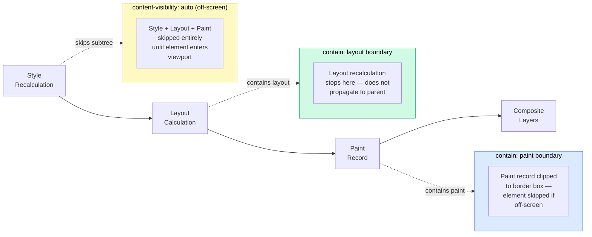

# CSS Containment & `contain`

The browser's rendering pipeline recalculates layout, style, and paint across
the entire document tree by default. When an element changes — a text node is
updated, a class is toggled — the browser may need to traverse siblings,
ancestors, and descendants to determine what else changed. CSS Containment gives
developers a way to tell the browser that a subtree is independent: changes
inside it do not affect anything outside, and changes outside do not affect what
is inside.

The `contain` property accepts four values: `layout`, `paint`, `style`, and
`size`. The `layout` value tells the browser that nothing inside the element
affects the layout of elements outside it. The `paint` value tells the browser
that the element's content does not extend visually beyond its border box. The
`style` value scopes CSS counters and quote styles. The `size` value declares
that the element's size is independent of its contents.

`content-visibility: auto` is a higher-level API that combines containment with
lazy rendering: the browser skips layout and paint for off-screen elements
entirely, rendering them only when they enter the viewport. For long documents
with many off-screen sections, this can dramatically reduce initial render time.
`contain-intrinsic-size` provides a placeholder size for off-screen elements so
the document's scroll position is not disrupted when they are rendered.

Both `contain` and `content-visibility` are progressive enhancements — browsers
that do not support them render the page normally, just without the performance
optimization. Support is near-universal in 2024.

## Scenario

A complex dashboard contains a widget that re-renders frequently. Each re-render triggers layout and paint recalculation for the entire page because the browser must verify that the widget's size changes do not affect elements outside it. CSS containment (`contain: layout paint`) tells the browser that the widget's contents cannot affect the outside layout, making recalculation local to the widget and reducing paint cost significantly.

## Design Thinking

### contain: layout

Layout containment creates a new block formatting context. No floats bleed out
of the element, no margins collapse through it, and nothing inside affects the
layout position of elements outside. The browser can stop its layout
recalculation at this element's boundary — work done inside the contained
subtree does not propagate upward to the document root or sideways to sibling
elements. For a component that updates frequently, such as a data grid that
re-renders rows on data refresh, this means the browser re-runs layout only
within the component's subtree and skips traversing the rest of the document.

Layout containment also affects how subgrid interacts with containment
boundaries. A subgrid container placed inside an element with `contain: layout`
cannot inherit grid tracks from ancestors outside the containment boundary,
because the containment prevents layout information from crossing that boundary.
This interaction is usually irrelevant in practice — self-contained components
are typically leaf nodes in the layout tree — but it is worth knowing when
composing containment with grid-based layouts.

### contain: paint

Paint containment clips rendering to the border box and establishes a stacking
context. Elements that overflow the border box are not painted, which means the
browser can skip painting the element entirely if its border box is fully
off-screen. The visual clipping is not the same as `overflow: hidden` — it does
not affect the element's geometry for layout purposes — but it does tell the
compositor that content outside the box will never be visible and can be omitted
from the paint record.

Establishing a stacking context as a side effect of `contain: paint` means the
element becomes the root for `z-index` stacking among its descendants. This is
worth considering when adding paint containment to existing components where
`z-index` behavior within the subtree might be affected. In most cases the
behavior is the same as adding `position: relative` to the element — a common
pattern already used to scope stacking contexts — so the practical impact is
usually neutral.

### contain: style

Style containment scopes CSS counters and `quotes` to the element's subtree.
It does not affect layout or paint. This value is most useful for repeated
sections that each have independent counters — a list of articles that each
count their own internal figures, for example, where the figure counter inside
one article should not continue from the previous article. Without style
containment, a CSS counter defined and incremented inside repeated components
can bleed across siblings, producing unexpected counter values.

Style containment does not scope CSS custom properties, which are inherited
normally through the document tree regardless of containment. It does not prevent
property inheritance generally — only counters and quote nesting levels are
scoped. Authors who want to scope custom property inheritance should use
`@scope` or shadow DOM instead, as style containment does not provide that
capability.

### content-visibility: auto

`content-visibility: auto` combines `contain: layout style paint` with a
skip-render behavior for off-screen elements. The browser skips style, layout,
and paint for elements that are outside the viewport. When the user scrolls
those elements into view, the browser renders them on demand. This is not
lazy-loading in the image or resource sense — no network requests are deferred —
but rather the browser skipping the work of computing layout and paint for
content that is not yet visible.

Works best for large, repeated sections such as article cards, product listings,
or chat message groups. A page with five hundred product cards benefits
substantially: on initial load, only the cards near the viewport are rendered.
As the user scrolls, the browser renders the upcoming cards incrementally. The
rendering work is spread across scroll interactions rather than front-loaded at
page load, which improves Largest Contentful Paint and Time to Interactive for
long pages. The `content-visibility: auto` approach does not require JavaScript
and has no accessibility implications — the content is present in the DOM and
accessible to screen readers even when visually off-screen.

### contain-intrinsic-size

When `content-visibility: auto` skips an element, the element's size collapses
to zero in the layout calculation because the browser has not yet measured the
element's contents. If the scrollbar height is computed from this collapsed size,
it will change dramatically when the user scrolls and elements are rendered,
causing the scrollbar thumb to jump and the scroll position to feel unstable.

`contain-intrinsic-size` specifies a placeholder size that the browser uses for
scroll calculations while the element is skipped. Set it to the approximate
rendered height of the element. The `auto <length>` syntax — for example
`contain-intrinsic-size: auto 400px` — causes the browser to memoize the last
actual measured height of the element after it has been rendered at least once.
On subsequent scroll passes, the browser uses the memoized height instead of the
fallback `400px` value, which means the placeholder becomes more accurate over
time as the user scrolls through the list. New elements that have never been
rendered still use the fallback length, so setting the fallback to a reasonable
estimate of the typical element height keeps the scroll experience stable even
before memoization has occurred.

### When NOT to use containment

Containment is not free. The browser must manage the containment boundary as a
first-class layout isolation, which itself has a small overhead. Adding
containment to every element does not universally improve performance and may
slightly degrade it on simple pages where layout recalculations are already
cheap. Containment is most effective on large, independently-updating subtrees
in long or complex documents. A static paragraph that never changes gains
nothing from `contain: layout paint`. A data table that re-renders a thousand
rows on sort gains substantially.

Profile before adding containment to existing production pages. The DevTools
Rendering panel highlights layout and paint regions so that over-broad
recalculations are visible. Add containment where profiling shows layout
recalculations crossing subtree boundaries unnecessarily — not as a blanket
micro-optimization applied uniformly to every component.

## Best Practices

**SHOULD apply `contain: layout paint` to self-contained component boundaries**
such as carousels, virtualized list items, and heavy widget containers to scope
layout recalculation to the component's subtree. The performance benefit scales
with how frequently the component updates and how large the surrounding document
is. A component that updates on every keystroke in a document with hundreds of
other elements is a strong candidate; a static banner in a simple page is not.
Profile to confirm a real benefit before applying containment broadly.

**MUST set `contain-intrinsic-size` whenever using `content-visibility: auto`.**
Without a declared intrinsic size, off-screen elements collapse to zero height
in the layout calculation, causing cumulative layout shift as content is rendered
on scroll. The scrollbar thumb moves erratically and users lose their place in
the document. Set the value to the approximate rendered height of the element;
the `auto <length>` form memoizes the last actual height automatically so the
placeholder improves in accuracy after the first render pass for each element.

**MUST NOT apply `contain: size` to elements whose dimensions depend on their
content** unless an explicit size is also declared alongside it. Size containment
tells the browser the element's size is independent of its children, which means
the browser uses zero as the default size when no explicit dimensions are given.
An element with `contain: size` and no explicit `width` and `height` collapses
to zero dimensions and its content overflows invisibly. Always pair `contain:
size` with concrete `width` and `height` declarations, and verify the element's
dimensions are correct after adding the containment value.

**SHOULD profile before adding containment to existing pages.** The DevTools
Rendering panel shows layout and paint recalculation regions visually. Add
containment where layout recalculations are demonstrably broad — crossing subtree
boundaries into unrelated parts of the document — not as a blanket optimization
applied uniformly. The overhead of the containment boundary itself is non-zero;
applying it to small static components may introduce overhead without measurable
benefit.

## Visual



The diagram shows where each containment value interrupts the rendering pipeline.
`contain: layout` stops layout recalculation at the element's boundary, preventing
internal changes from propagating to the parent layout pass. `contain: paint`
clips the paint record to the border box and allows the compositor to skip painting
the element entirely when it is off-screen. `content-visibility: auto` takes the
strongest position: when the element is off-screen, the browser skips style
recalculation, layout, and paint entirely, deferring all rendering work until the
element enters the viewport.

## Example

```
/* CSS */

/*
 * Fallback: no containment — works in all browsers.
 * Elements render normally without any performance hints.
 */
.product-card {
  background: var(--color-surface, #f8fafc);
  border: 1px solid var(--color-border, #e2e8f0);
  border-radius: 0.5rem;
  padding: 1rem;
  margin-block-end: 1.5rem;
}

/*
 * Enhancement 1: explicit contain for components that update frequently.
 * Scopes layout recalculation and paint to the card's subtree.
 * Safe to use without content-visibility; no intrinsic size needed.
 */
@supports (contain: layout paint) {
  .product-card {
    contain: layout paint;
  }
}

/*
 * Enhancement 2: content-visibility for long lists of off-screen cards.
 * MUST pair with contain-intrinsic-size to prevent layout shift.
 *
 * contain-intrinsic-size: auto 420px
 *   - 420px is the estimated rendered height of each card.
 *   - The `auto` keyword memoizes the actual height after first render;
 *     subsequent scroll passes use the measured height rather than 420px.
 *   - New cards that have never been rendered use 420px as the placeholder.
 */
@supports (content-visibility: auto) {
  .product-card--lazy {
    content-visibility: auto;
    contain-intrinsic-size: auto 420px;
  }
}

/* HTML */
/*
<ul class="product-list">

  <!-- Cards near the viewport: render normally, no lazy skip -->
  <li class="product-card">
    
    <h2>Product Alpha</h2>
    <p>Short description of the product.</p>
    <a href="/products/alpha">View product</a>
  </li>

  <!-- Cards far off-screen: use lazy skip variant -->
  <li class="product-card product-card--lazy">
    
    <h2>Product Beta</h2>
    <p>
      Longer description that would otherwise require layout work
      on initial page load even though this card is far below the fold.
    </p>
    <a href="/products/beta">View product</a>
  </li>

  <li class="product-card product-card--lazy">
    
    <h2>Product Gamma</h2>
    <p>Another off-screen card rendered only when scrolled into view.</p>
    <a href="/products/gamma">View product</a>
  </li>

</ul>
*/
```

In the example, `.product-card` gains `contain: layout paint` via the first
`@supports` block, scoping layout and paint recalculations to the individual
card. The `.product-card--lazy` variant adds `content-visibility: auto` so that
cards far below the fold are skipped entirely on initial load. The
`contain-intrinsic-size: auto 420px` declaration gives the browser a 420-pixel
placeholder height per card while each card is skipped, keeping the scrollbar
stable. Once a card scrolls into view and is rendered, the `auto` keyword causes
the browser to memoize the card's measured height for future layout passes.

## Common Mistakes

### Using `content-visibility: auto` without `contain-intrinsic-size`

When `content-visibility: auto` skips an element, the browser treats the element
as if it has zero height. A page with one hundred product cards, each skipped
on initial load, reports a total document height close to zero. The scrollbar
thumb is nearly full height. As the user scrolls and cards are rendered, the
document height grows, the scrollbar thumb shrinks and jumps, and the scroll
position shifts. Setting `contain-intrinsic-size` to an approximate card height
— and using the `auto <length>` form to memoize actual heights — prevents this
cumulative layout shift. Always add `contain-intrinsic-size` in the same rule
block as `content-visibility: auto`.

### Applying `contain: size` without explicit dimensions

`contain: size` declares that the element's size is independent of its children.
When no explicit `width` and `height` are declared, the browser resolves the
element's size to zero on both axes because it cannot derive a size from the
contained children. The element collapses, its children overflow invisibly, and
the page looks broken with no helpful browser warning. This is the most common
source of confusion with the `size` containment value. Authors who want
`contain: strict` — which includes size containment — must always also declare
explicit dimensions on the element. If the intent is to scope layout and paint
only, use `contain: layout paint` rather than `contain: size` or `contain:
strict`.

### Adding containment to every component expecting universal improvement

CSS Containment is a targeted tool, not a universal performance switch. Adding
`contain: layout paint` to every component in an application does not guarantee
improved performance and may introduce overhead on simple pages. Each containment
boundary has a management cost. Containment is beneficial when it prevents
broad, expensive layout recalculations from crossing subtree boundaries; it is
neutral or slightly negative when the contained subtree is small and static.
Profile with DevTools, identify the components where layout recalculations are
visibly over-broad, and apply containment surgically. Broad blanket application
without profiling is a premature optimization that adds complexity without
measured benefit.

## Related FEEs

| FEE | Relationship |
|-----|-------------|
| [FEE-200 CSS and Layout Systems Overview](./200.md) | Parent overview for all CSS layout topics. Containment is a cross-cutting performance mechanism that applies across layout systems described in FEE-200. |
| [FEE-208 CSS Subgrid](./208.md) | `contain: layout` interacts with subgrid: a subgrid container cannot inherit tracks from ancestors outside a layout containment boundary. Understanding this interaction is important when combining containment with grid-based layouts. |
| [FEE-700 Rendering and Performance Overview](../Rendering%20and%20Performance/700.md) | Parent overview for browser rendering performance. Containment is one of the primary CSS mechanisms for controlling rendering scope and reducing recalculation overhead described in FEE-700. |
| [FEE-709 INP Deep Dive](../Rendering%20and%20Performance/709.md) | Interaction to Next Paint is directly affected by layout and paint recalculation cost. CSS Containment reduces the scope of work triggered by user interactions that cause re-renders, which contributes to improved INP scores on pages with complex component trees. |

## References

- MDN: contain — https://developer.mozilla.org/en-US/docs/Web/CSS/contain
- MDN: content-visibility — https://developer.mozilla.org/en-US/docs/Web/CSS/content-visibility
- MDN: contain-intrinsic-size — https://developer.mozilla.org/en-US/docs/Web/CSS/contain-intrinsic-size
- web.dev: content-visibility — https://web.dev/articles/content-visibility
- CSS Containment Module Level 2 — https://www.w3.org/TR/css-contain-2/
- Chrome for Developers: CSS Containment — https://developer.chrome.com/docs/css-ui/css-containment
- Can I Use: CSS contain — https://caniuse.com/css-containment
