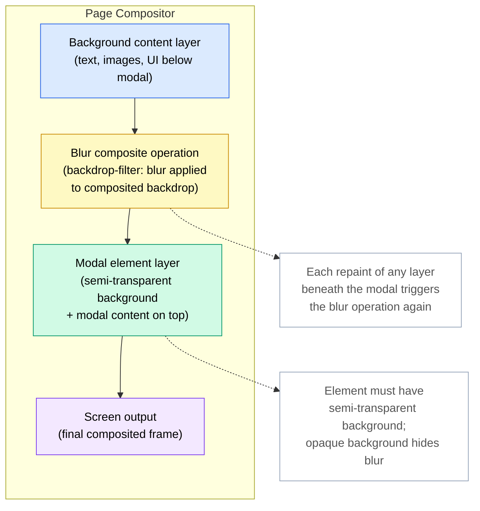

# [FEE-210] Backdrop Filter, Mix-Blend-Mode & Visual Effects

:::info
`backdrop-filter` filters the area behind an element rather than the element
itself, the mechanism behind the "frosted glass" panels common in modern UI
design. `mix-blend-mode` composites an element with whatever sits behind it in
the stacking order, borrowing blend modes like `multiply` and `screen` from
image-editing software, and `isolation: isolate` scopes that blending to a
chosen subtree. `filter` instead applies effects to an element and its own
content, including `drop-shadow()`, which follows the element's alpha channel
rather than its rectangular box the way `box-shadow` does. All three
properties promote the element to its own compositor layer, a GPU cost that
adds up quickly when several effects run at once on the same view.
:::

## Context

CSS has three visually similar but functionally distinct properties for
compositing effects: `filter`, `backdrop-filter`, and `mix-blend-mode`. Each
accepts overlapping effect names (blur, brightness, contrast) but targets a
different part of the render tree, so reaching for the wrong one produces a
silent no-op rather than an error. A common trigger is a navigation bar that
needs to look frosted glass while scrolling over page content: `opacity`
alone cannot blur what sits behind an element, and duplicating the background
into a blurred pseudo-element breaks the moment the underlying content
changes. `backdrop-filter: blur()` solves that case directly by filtering
only the region behind the element and leaving the element's own content
untouched. This article works through the direction each property affects
(element versus backdrop), how `isolation: isolate` scopes a
`mix-blend-mode` blend, and the compositor-layer cost that limits how many of
these effects a single view can afford.

## Visual



The diagram illustrates the compositor layer stack for a page with a modal
that uses `backdrop-filter: blur()`. The background content layer, all page
content below the modal, is composited first. The blur operation is then
applied to that composited result, producing the filtered backdrop image. The
modal element is rendered on top of the filtered backdrop, with its
semi-transparent background allowing the blurred content to show through. The
final composited frame is sent to the screen. Any repaint affecting the
background content layer causes the blur composite operation to re-execute,
which is why minimizing the number of elements with `backdrop-filter` reduces
overall compositing cost.

## Example

```css
/*
 * Frosted glass panel with backdrop-filter, @supports fallback,
 * and mix-blend-mode text overlay.
 *
 * Structure expected:
 *
 *   <div class="glass-panel">
 *     <p class="glass-panel__label">Panel label</p>
 *     <div class="glass-panel__content">...</div>
 *   </div>
 */

/* ─── Base styles (all browsers) ─────────────────────────────────────────── */

.glass-panel {
  /*
   * Fallback background: opaque enough to keep content readable even when
   * backdrop-filter is not supported. A translucent fill's on-screen color
   * depends on whatever renders behind it, so verify the actual contrast
   * ratio against the darkest and lightest backdrops this panel appears
   * over rather than assuming a fixed alpha value is safe.
   */
  background-color: rgba(255, 255, 255, 0.82);
  border: 1px solid rgba(255, 255, 255, 0.4);
  border-radius: 0.75rem;
  padding: 1.5rem;
  position: relative;
}

/* ─── Frosted glass enhancement (browsers that support backdrop-filter) ──── */

@supports ((backdrop-filter: blur(1px)) or (-webkit-backdrop-filter: blur(1px))) {
  .glass-panel {
    /*
     * Lower the background opacity now that the blur provides visual
     * separation. The blur effect itself creates the perception of depth;
     * high opacity is only needed as a fallback.
     */
    background-color: rgba(255, 255, 255, 0.55);

    /*
     * The blur radius should be large enough to obscure detail in the
     * content behind the panel without being so large it costs GPU time
     * for a visual change too subtle to notice; profile before increasing
     * it further.
     */
    backdrop-filter: blur(12px) saturate(1.4);

    /*
     * Safari prefix, required through Safari 17. Safari 18 (stable
     * September 2024) added the unprefixed property, but the @supports
     * guard above checks both forms so Safari 9-17 still receive this
     * declaration instead of falling through to the flat fallback.
     */
    -webkit-backdrop-filter: blur(12px) saturate(1.4);
  }
}

/* ─── mix-blend-mode text overlay ───────────────────────────────────────── */

/*
 * isolation: isolate on the panel prevents the label's blend mode from
 * leaking outside the panel and interacting with sibling or ancestor elements.
 */
.glass-panel {
  isolation: isolate;
}

.glass-panel__label {
  /*
   * multiply blends the label text with the panel background.
   * WARNING: contrast MUST be verified against all background states —
   * a light panel over dark content and over light content both need
   * to be checked. Do not ship this without contrast verification.
   */
  mix-blend-mode: multiply;
  font-weight: 700;
  letter-spacing: 0.05em;
  text-transform: uppercase;
  font-size: 0.75rem;
  color: #1e293b;
}

/* ─── Sticky header blur (second acceptable concurrent use of backdrop-filter) */

.site-header {
  position: sticky;
  top: 0;
  z-index: 100;
  background-color: rgba(15, 23, 42, 0.8);
}

@supports ((backdrop-filter: blur(1px)) or (-webkit-backdrop-filter: blur(1px))) {
  .site-header {
    background-color: rgba(15, 23, 42, 0.6);
    backdrop-filter: blur(8px);
    -webkit-backdrop-filter: blur(8px);
  }
}
```

The example shows two concurrently acceptable uses of `backdrop-filter`: a
frosted glass content panel and a sticky site header, each guarded by an
`@supports` block with a sufficiently opaque fallback background. The
`.glass-panel` receives `isolation: isolate` so that the `mix-blend-mode:
multiply` applied to `.glass-panel__label` is scoped to the panel's subtree
and does not interact with the page's background or adjacent components.

## Best Practices

**SHOULD limit `backdrop-filter` to at most two or three concurrently
rendered elements per view.** A sticky navigation bar, a modal overlay, and a
tooltip are a reasonable maximum. Applying `backdrop-filter` to every card in
a large scrolling list creates a compositor layer per card, increases GPU
memory linearly with visible cards, and commonly causes frame drops on
mid-range and low-end mobile devices. When a design calls for widespread
frosted-glass surfaces, discuss with the design team whether a simpler
alternative, a flat semi-transparent background without blur, achieves a
similar visual hierarchy at a fraction of the performance cost.

**MUST NOT use `mix-blend-mode` on text without verifying contrast ratios
against all likely background states.** Blending modes alter the visual
rendering of text in ways that pass WCAG at one scroll position and fail at
another. Static contrast checkers cannot detect this; the verification must
account for all background colors the text might blend against as content
scrolls beneath a fixed blended element. If a guaranteed contrast ratio cannot
be maintained across all background states, the blended text treatment must
not be used, or the text must be removed from the blending context and styled
separately with a guaranteed legible color.

**SHOULD wrap `backdrop-filter` usage in
`@supports ((backdrop-filter: blur(1px)) or (-webkit-backdrop-filter: blur(1px)))`
and provide a solid, opaque-enough background as the fallback.** The frosted
glass effect degrades acceptably to a semi-transparent flat panel when
neither form of `backdrop-filter` is supported. Because the fallback is
itself translucent, its effective on-screen color depends on whatever content
sits behind it, which is unknown at author time. Compute the contrast ratio
against the fallback's resolved color over the darkest and lightest backdrops
the panel is expected to appear over, not against a single assumed alpha
value, and raise the opacity until text and controls clear 4.5:1 in the worst
case.

**SHOULD use `isolation: isolate` on any parent element that contains a
`mix-blend-mode` child** to prevent the blending from leaking into sibling
components. Without `isolation`, the blended element composites against the
entire stacking context, including backgrounds defined by completely
unrelated ancestor elements. This causes the visual appearance of the blended
element to change unpredictably as sibling or ancestor content is modified.
`isolation: isolate` costs nothing in rendering terms (it does not promote a
layer) and should be treated as a required companion to any intentional use
of `mix-blend-mode`.

## Design Thinking

### backdrop-filter and compositor layers

`backdrop-filter` works by instructing the browser to composite all layers
beneath the filtered element, apply the specified filter function to that
composited result, and then render the filtered image as the visual
background of the element. The element itself (its background color, border,
and children) is then composited on top. This sequence is GPU-accelerated,
but it is not free: the browser must maintain a separate copy of the backdrop
content and run the filter kernel, which is proportional in cost to the size
of the element's bounding box.

Large elements covering most of the viewport are the most expensive case. A
full-screen modal overlay with `backdrop-filter: blur(20px)` forces the
browser to blur the entire visible area behind the modal on every repaint
that affects any layer beneath the overlay. This is manageable for a single
such overlay but becomes a significant performance concern when multiple
backdrop-filtered elements stack. The relationship between `backdrop-filter`
and stacking contexts is important: `backdrop-filter` implicitly promotes the
element to a new stacking context and compositor layer. Properties like
`will-change: transform` and `transform: translateZ(0)` have a similar
promotion effect, and layering these promotions unnecessarily multiplies GPU
memory usage. Apply them only where profiling shows a genuine benefit.

### mix-blend-mode and the isolation property

By default, `mix-blend-mode` blends with everything visually behind the
element in its current stacking context. If a blended element is positioned
over a page-level background image set on the `body`, the blending will
include that background. If it is positioned over content from a completely
different UI section, that content participates in the blend as well. This
default behavior is often not what is intended, and the result changes
dynamically as the user scrolls content underneath a blended element.

`isolation: isolate` applied to a parent element creates a new stacking
context that acts as the limit for blending: a `mix-blend-mode` child will
only blend against elements within the isolated subtree, not against
anything outside it. This is essential when a blended decorative element
should not interact with a background image or color that belongs to a
completely different component in the page hierarchy. Without `isolation:
isolate`, debugging unexpected blending interactions often requires careful
analysis of the stacking context tree, which is invisible from the DOM
structure alone; see Related Topics below for the article that covers how the
browser builds that tree.

### filter vs. backdrop-filter

`filter` and `backdrop-filter` are related in name but opposite in target.
`filter` affects the element itself and all of its content, as if the
element were drawn onto an offscreen canvas and then the filter were applied
to that canvas before compositing. `backdrop-filter` affects what is behind
the element, with the element's own content sitting on top of the filtered
backdrop unchanged.

The two can be combined deliberately: a frosted glass card can have
`backdrop-filter: blur(12px)` to blur the content behind it and
`filter: brightness(1.05)` to make the card itself slightly brighter than
its surroundings, reinforcing the elevated-surface illusion. `filter:
drop-shadow()` specifically deserves attention as a replacement for
`box-shadow` in contexts with transparent images: it follows the alpha
channel contour of the element rather than its rectangular border box,
producing accurate shadows for SVG icons, PNG logos, and clipped images.

### Performance cost and when to profile

All three properties (`backdrop-filter`, `mix-blend-mode`, and `filter`)
create compositor layers. The Chrome DevTools Layers panel shows the
complete layer tree, including which elements triggered layer promotion and
the estimated GPU memory consumed by each layer. Inspecting this panel for
pages that use visual effects reveals whether layer count is reasonable or
has grown out of control due to inadvertent promotions. The FPS meter in
DevTools, visible during scroll and animation, reveals whether the layer
compositing cost is manifesting as jank.

The `will-change` property is frequently added as a performance fix when
visual effects cause jank. This is sometimes appropriate but should not be
added blindly. `will-change: transform` or `will-change: filter` reserves
GPU memory for the element before the animation begins, preventing promotion
cost from occurring during the animation itself. However, it keeps that
memory reserved for as long as the element exists in the DOM. Adding
`will-change` to hundreds of elements, or to elements that are never
actually animated, wastes GPU memory and can paradoxically degrade
performance on memory-constrained devices. Profile with the Layers panel
first; apply `will-change` only to elements where the promotion cost during
animation is measurably causing frame drops.

### Progressive enhancement for backdrop-filter

`backdrop-filter` is Baseline-supported across current browsers: MDN lists
it as newly available since September 2024, when unprefixed support landed
across all major engines. The correct approach is still to guard it with
`@supports` and provide a fallback rule outside the block, since older
browser versions do not implement it at all. The fallback should be a
sufficiently opaque background that conveys the panel's elevation without
the blur effect. A background such as `rgba(255, 255, 255, 0.85)` provides a
visually acceptable flat alternative to the frosted glass appearance,
subject to the contrast check described in Best Practices above.

Safari has supported `backdrop-filter` behind the `-webkit-backdrop-filter`
prefix since Safari 9 (2015). Unprefixed support did not arrive until Safari
18, which reached beta in June 2024 and shipped stable in September 2024
(Useful Angle, 2024; O'Leary, 2024); every Safari version from 9 through
17.x requires the prefix. Because of that gap, the `@supports` guard should
test both forms:
`@supports ((backdrop-filter: blur(1px)) or (-webkit-backdrop-filter: blur(1px)))`.
Testing only the unprefixed form evaluates false on Safari 9-17, so the
page falls through to the flat fallback even though those versions can
render the blurred effect with the prefix. Testing both forms lets the guard
match on Safari 9-17 too, so the prefixed declaration inside the block
still reaches the browsers that need it.

## Common Mistakes

### Applying `backdrop-filter` without a semi-transparent background

`backdrop-filter` applies its effect to the area behind the element, but if
the element has a fully opaque background color, that opaque background
entirely covers the filtered backdrop. The blur or brightness effect is
applied to the layers beneath, but the result is hidden behind the element's
own background. The fix is to always use a semi-transparent background color
(`rgba` or `hsl` with an alpha value well below 1.0) so that the filtered
backdrop is visible through the element. A common mistake is setting the
background in one rule and the `backdrop-filter` in another, with a later
rule overriding the background to a fully opaque color without realizing the
filter is now invisible.

### Not guarding `backdrop-filter` with `@supports`

In browsers that do not support `backdrop-filter`, the property is silently
ignored. If the element's background is semi-transparent in expectation of
the blur providing visual separation, the unsupported browser will render a
transparent or near-transparent panel with no blur effect, which may make
text unreadable. The `@supports` guard allows a distinct fallback background,
more opaque and possibly a different color, to be applied in unsupported
browsers. Omitting the guard means the page author has no way to provide the
fallback, and the visual result in unsupported environments is
unpredictable.

### Using `mix-blend-mode` on text without WCAG contrast verification

A text element with `mix-blend-mode: multiply` or `mix-blend-mode: overlay`
may have sufficient contrast when the page is first loaded and the
background behind the text is a known color. As the user scrolls, different
content appears behind the blended text, and the effective contrast changes
continuously. An element that passes WCAG AA at the initial scroll position
can drop below the 4.5:1 threshold when the background becomes a light color
close to the text color. Automated contrast checking tools test the element
in isolation at a single point in time and cannot detect this failure mode.
Manual testing across representative background variations is required
before shipping blended text to production.

### Forgetting `isolation: isolate` on the parent of a `mix-blend-mode` element

Without `isolation: isolate` on a containing ancestor, a `mix-blend-mode`
child blends against the entire stacking context, potentially including
page-level backgrounds, background images on distant ancestor elements, and
content from completely unrelated UI components that happen to be visually
behind the blended element. The resulting appearance is often correct in
local development but breaks when the component is placed in a different
page context. Adding `isolation: isolate` to the component's root element
costs nothing and eliminates this class of context-dependent rendering bug.

## Related Topics

- [CSS & Layout Systems Overview](/en/CSS%20and%20Layout%20Systems/200): the parent overview for all CSS layout topics, including the visual effects and compositing properties covered in this article.
- [CSS Containment & contain](/en/CSS%20and%20Layout%20Systems/209): containment and compositor-layer cost are directly related to backdrop-filter and filter layer promotion.
- [Stacking Contexts, Paint Order & the Top Layer](/en/CSS%20and%20Layout%20Systems/stacking-contexts-paint-order-top-layer): `isolation: isolate` creates a new stacking context; this article covers the paint-order model that governs what a `mix-blend-mode` child composites against.
- [GPU-Accelerated Animations & will-change](/en/Rendering%20and%20Performance/710): compositor-layer management for animations overlaps with the layer creation caused by backdrop-filter and filter, and both topics use the same DevTools Layers panel.
- [Accessibility Overview](/en/Accessibility/1000): WCAG contrast requirements apply directly to mix-blend-mode used on text.

## References

- MDN Contributors, "backdrop-filter," MDN Web Docs (2025). https://developer.mozilla.org/en-US/docs/Web/CSS/Reference/Properties/backdrop-filter
- MDN Contributors, "mix-blend-mode," MDN Web Docs (2025). https://developer.mozilla.org/en-US/docs/Web/CSS/Reference/Properties/mix-blend-mode
- MDN Contributors, "filter," MDN Web Docs (2025). https://developer.mozilla.org/en-US/docs/Web/CSS/Reference/Properties/filter
- MDN Contributors, "isolation," MDN Web Docs (2025). https://developer.mozilla.org/en-US/docs/Web/CSS/Reference/Properties/isolation
- MDN Contributors, "@supports," MDN Web Docs (2025). https://developer.mozilla.org/en-US/docs/Web/CSS/@supports
- W3C, "Compositing and Blending Level 1," W3C Candidate Recommendation Draft (2024). https://www.w3.org/TR/compositing-1/
- Adam Argyle and Joe Medley, "Create OS-style backgrounds with backdrop-filter," web.dev (2019). https://web.dev/articles/backdrop-filter
- Can I Use, "backdrop-filter," caniuse.com (2026). https://caniuse.com/css-backdrop-filter
- Can I Use, "mix-blend-mode," caniuse.com (2026). https://caniuse.com/css-mixblendmode
- Useful Angle, "CSS backdrop-filter is Finally Unprefixed Across All Browsers," usefulangle.com (2024). https://usefulangle.com/post/391/css-backdrop-filter-unprefixed
- Rob O'Leary, "The backdrop-filter CSS property has been unprefixed," roboleary.net (2024). https://www.roboleary.net/blog/unprefixing-backdrop-filter/
