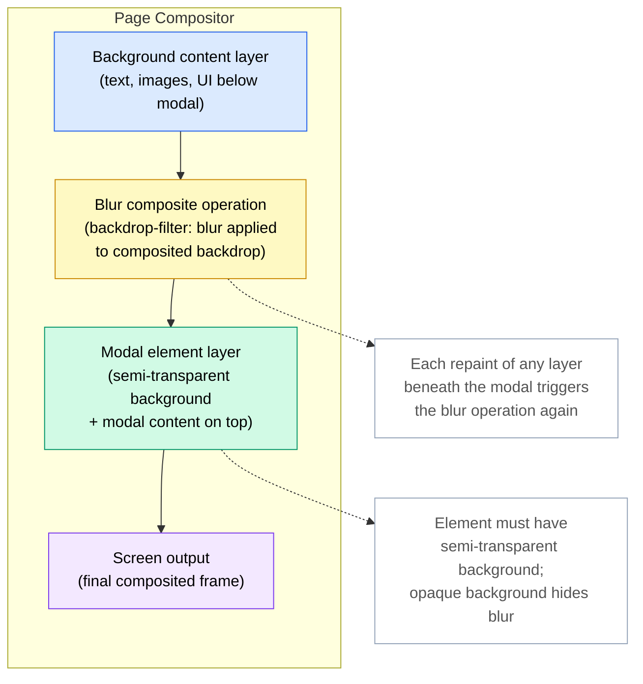

# Backdrop Filter, Mix-Blend-Mode & Visual Effects

`backdrop-filter` applies graphical effects — blur, brightness, contrast,
saturate — to the area behind an element, rather than to the element itself.
The "frosted glass" panel effect that is ubiquitous in modern UI design — a
translucent surface that blurs the content beneath — is almost always
implemented with `backdrop-filter: blur()`. It requires the element to have a
semi-transparent background; a fully opaque background obscures the backdrop
entirely, rendering the filter invisible to the user.

`mix-blend-mode` controls how an element's content blends with its background
using compositing modes analogous to those in image editing software:
`multiply`, `screen`, `overlay`, `difference`, and more. The element creates a
blending context with whatever is visually behind it in the stacking order.
`isolation: isolate` creates a new stacking context that limits which elements
participate in the blend, preventing the effect from leaking into unrelated
parts of the page.

`filter` applies visual effects to an element and all of its content: `blur()`,
`brightness()`, `contrast()`, `grayscale()`, `sepia()`, `drop-shadow()`. Unlike
`box-shadow`, `filter: drop-shadow()` respects the element's alpha channel,
casting a shadow that follows the shape of transparent PNGs and SVGs rather than
the rectangular bounding box. This distinction matters whenever images with
irregular silhouettes — icons, logos, cut-out photos — need drop shadows that
feel visually accurate.

All three properties promote elements to their own compositor layer, which
carries GPU memory and compositing cost. Applied to many elements simultaneously,
they can increase memory usage and reduce scroll performance, particularly on
mobile devices with limited GPU resources. Understanding the performance
implications of each property is as important as understanding its visual
behavior.

## Scenario

You are implementing a navigation bar that should appear frosted-glass over page content — blurring what is behind it while remaining partially transparent. This effect cannot be achieved with `opacity` alone, and simulating it with pseudo-elements and a duplicated background is fragile. `backdrop-filter: blur()` applies the blur to whatever is rendered behind the element, implementing the frosted-glass effect with a single CSS declaration.

## Design Thinking

### backdrop-filter and compositor layers

`backdrop-filter` works by instructing the browser to composite all layers
beneath the filtered element, apply the specified filter function to that
composited result, and then render the filtered image as the visual background
of the element. The element itself — its background color, border, and children
— is then composited on top. This sequence is GPU-accelerated, but it is not
free: the browser must maintain a separate copy of the backdrop content and run
the filter kernel, which is proportional in cost to the size of the element's
bounding box.

Large elements covering most of the viewport are the most expensive case. A
full-screen modal overlay with `backdrop-filter: blur(20px)` forces the browser
to blur the entire visible area behind the modal on every repaint that affects
any layer beneath the overlay. This is manageable for a single such overlay but
becomes a significant performance concern when multiple backdrop-filtered
elements stack. The relationship between `backdrop-filter` and stacking contexts
is important: `backdrop-filter` implicitly promotes the element to a new
stacking context and compositor layer. Properties like `will-change: transform`
and `transform: translateZ(0)` have a similar promotion effect, and layering
these promotions unnecessarily multiplies GPU memory usage. Apply them only
where profiling shows a genuine benefit.

### mix-blend-mode and the isolation property

By default, `mix-blend-mode` blends with everything visually behind the element
in its current stacking context. If a blended element is positioned over a
page-level background image set on the `body`, the blending will include that
background. If it is positioned over content from a completely different UI
section, that content participates in the blend as well. This default behavior
is often not what is intended, and the result changes dynamically as the user
scrolls content underneath a blended element.

`isolation: isolate` applied to a parent element creates a new stacking context
that acts as the limit for blending: a `mix-blend-mode` child will only blend
against elements within the isolated subtree, not against anything outside it.
This is essential when a blended decorative element should not interact with a
background image or color that belongs to a completely different component in the
page hierarchy. Without `isolation: isolate`, debugging unexpected blending
interactions often requires careful analysis of the stacking context tree, which
is invisible from the DOM structure alone.

### filter vs. backdrop-filter

`filter` and `backdrop-filter` are related in name but opposite in target.
`filter` affects the element itself and all of its content, as if the element
were drawn onto an offscreen canvas and then the filter were applied to that
canvas before compositing. `backdrop-filter` affects what is behind the element,
with the element's own content sitting on top of the filtered backdrop unchanged.

The two can be combined deliberately: a frosted glass card can have
`backdrop-filter: blur(12px)` to blur the content behind it and
`filter: brightness(1.05)` to make the card itself slightly brighter than its
surroundings, reinforcing the elevated-surface illusion. Understanding the
direction of each property prevents confusion when effects do not appear where
expected. `filter: drop-shadow()` specifically deserves attention as a
replacement for `box-shadow` in contexts with transparent images: it follows
the alpha channel contour of the element rather than its rectangular border
box, producing accurate shadows for SVG icons, PNG logos, and clipped images.

### Performance cost and when to profile

All three properties — `backdrop-filter`, `mix-blend-mode`, and `filter` —
create compositor layers. The Chrome DevTools Layers panel shows the complete
layer tree, including which elements triggered layer promotion and the estimated
GPU memory consumed by each layer. Inspecting this panel for pages that use
visual effects reveals whether layer count is reasonable or has grown out of
control due to inadvertent promotions. The FPS meter in DevTools, visible during
scroll and animation, reveals whether the layer compositing cost is manifesting
as jank.

The `will-change` property is frequently added as a performance fix when visual
effects cause jank. This is sometimes appropriate but should not be added
blindly. `will-change: transform` or `will-change: filter` reserves GPU memory
for the element before the animation begins, preventing promotion cost from
occurring during the animation itself. However, it keeps that memory reserved
for as long as the element exists in the DOM. Adding `will-change` to hundreds
of elements, or to elements that are never actually animated, wastes GPU memory
and can paradoxically degrade performance on memory-constrained devices. Profile
with the Layers panel first; apply `will-change` only to elements where the
promotion cost during animation is measurably causing frame drops.

### Progressive enhancement for backdrop-filter

`backdrop-filter` is not supported in all browsers, though support is broad in
2024. The correct approach is to use `@supports (backdrop-filter: blur(1px))` to
guard the effect and provide a fallback rule outside the `@supports` block.
The fallback should be a sufficiently opaque semi-transparent background that
conveys the panel's elevation without the blur effect — a background such as
`rgba(255, 255, 255, 0.85)` or a light color with significant opacity provides
a visually acceptable flat alternative to the frosted glass appearance.

Safari has supported `backdrop-filter` behind the `-webkit-backdrop-filter`
prefix since Safari 9. Modern Safari — Safari 15.4 and later — supports the
unprefixed `backdrop-filter` property. For projects that must support Safari
versions before 15.4, including the vendor-prefixed form alongside the standard
property is necessary. The `@supports` guard should test the unprefixed form; if
the browser requires the prefix, it will fall through to the fallback, which
is acceptable for older Safari versions.

## Best Practices

**SHOULD limit `backdrop-filter` to at most two or three concurrently rendered
elements per view.** A sticky navigation bar, a modal overlay, and a tooltip are
a reasonable maximum. Applying `backdrop-filter` to every card in a large
scrolling list creates a compositor layer per card, increases GPU memory linearly
with visible cards, and commonly causes frame drops on mid-range and low-end
mobile devices. When a design calls for widespread frosted-glass surfaces, discuss
with the design team whether a simpler alternative — a flat semi-transparent
background without blur — achieves a similar visual hierarchy at a fraction of
the performance cost.

**MUST NOT use `mix-blend-mode` on text without verifying contrast ratios against
all likely background states.** Blending modes alter the visual rendering of text
in ways that pass WCAG at one scroll position and fail at another. Static contrast
checkers cannot detect this; the verification must account for all background
colors the text might blend against as content scrolls beneath a fixed blended
element. If a guaranteed contrast ratio cannot be maintained across all background
states, the blended text treatment must not be used, or the text must be removed
from the blending context and styled separately with a guaranteed legible color.

**SHOULD wrap `backdrop-filter` usage in `@supports (backdrop-filter: blur(1px))`
and provide a solid semi-transparent background as the fallback.** The frosted
glass effect degrades acceptably to a semi-transparent flat panel when
`backdrop-filter` is not supported. The fallback background should have enough
opacity that text and interactive elements within the panel remain clearly readable
regardless of what content appears behind it. A background opacity below 0.7
typically results in insufficient contrast for text in the fallback state when
the backdrop is dark or complex.

**SHOULD use `isolation: isolate` on any parent element that contains a
`mix-blend-mode` child** to prevent the blending from leaking into sibling
components. Without `isolation`, the blended element composites against the
entire stacking context, including backgrounds defined by completely unrelated
ancestor elements. This causes the visual appearance of the blended element to
change unpredictably as sibling or ancestor content is modified. `isolation:
isolate` costs nothing in rendering terms — it does not promote a layer — and
should be treated as a required companion to any intentional use of
`mix-blend-mode`.

## Visual



The diagram illustrates the compositor layer stack for a page with a modal that
uses `backdrop-filter: blur()`. The background content layer — all page content
below the modal — is composited first. The blur operation is then applied to
that composited result, producing the filtered backdrop image. The modal element
is rendered on top of the filtered backdrop, with its semi-transparent background
allowing the blurred content to show through. The final composited frame is sent
to the screen. Any repaint affecting the background content layer causes the blur
composite operation to re-execute, which is why minimizing the number of elements
with `backdrop-filter` reduces overall compositing cost.

## Example

```css
/*
 * Frosted glass panel with backdrop-filter, @supports fallback,
 * and mix-blend-mode text overlay.
 *
 * Structure expected:
 *
 *   <div class="glass-panel">
 *     <p class="glass-panel__label">Panel label</p>
 *     <div class="glass-panel__content">...</div>
 *   </div>
 */

/* ─── Base styles (all browsers) ─────────────────────────────────────────── */

.glass-panel {
  /*
   * Fallback background: opaque enough to keep content readable even when
   * backdrop-filter is not supported. rgba alpha of 0.82 provides acceptable
   * contrast for light text against most mid-tone backgrounds.
   */
  background-color: rgba(255, 255, 255, 0.82);
  border: 1px solid rgba(255, 255, 255, 0.4);
  border-radius: 0.75rem;
  padding: 1.5rem;
  position: relative;
}

/* ─── Frosted glass enhancement (browsers that support backdrop-filter) ──── */

@supports (backdrop-filter: blur(1px)) {
  .glass-panel {
    /*
     * Lower the background opacity now that the blur provides visual
     * separation. The blur effect itself creates the perception of depth;
     * high opacity is only needed as a fallback.
     */
    background-color: rgba(255, 255, 255, 0.55);

    /*
     * The blur radius should be large enough to obscure detail in the
     * content behind the panel, typically 8px–20px. Values above 20px
     * have diminishing visual returns and increase GPU cost.
     */
    backdrop-filter: blur(12px) saturate(1.4);

    /*
     * Safari prefix — required for Safari versions earlier than 15.4.
     * Modern Safari supports the unprefixed property.
     */
    -webkit-backdrop-filter: blur(12px) saturate(1.4);
  }
}

/* ─── mix-blend-mode text overlay ───────────────────────────────────────── */

/*
 * isolation: isolate on the panel prevents the label's blend mode from
 * leaking outside the panel and interacting with sibling or ancestor elements.
 */
.glass-panel {
  isolation: isolate;
}

.glass-panel__label {
  /*
   * multiply blends the label text with the panel background.
   * WARNING: contrast MUST be verified against all background states —
   * a light panel over dark content and over light content both need
   * to be checked. Do not ship this without contrast verification.
   */
  mix-blend-mode: multiply;
  font-weight: 700;
  letter-spacing: 0.05em;
  text-transform: uppercase;
  font-size: 0.75rem;
  color: #1e293b;
}

/* ─── Sticky header blur (second acceptable concurrent use of backdrop-filter) */

.site-header {
  position: sticky;
  top: 0;
  z-index: 100;
  background-color: rgba(15, 23, 42, 0.8);
}

@supports (backdrop-filter: blur(1px)) {
  .site-header {
    background-color: rgba(15, 23, 42, 0.6);
    backdrop-filter: blur(8px);
    -webkit-backdrop-filter: blur(8px);
  }
}
```

The example shows two concurrently acceptable uses of `backdrop-filter`: a
frosted glass content panel and a sticky site header, each guarded by an
`@supports` block with a sufficiently opaque fallback background. The
`.glass-panel` receives `isolation: isolate` so that the `mix-blend-mode:
multiply` applied to `.glass-panel__label` is scoped to the panel's subtree
and does not interact with the page's background or adjacent components.

## Common Mistakes

### Applying `backdrop-filter` without a semi-transparent background

`backdrop-filter` applies its effect to the area behind the element, but if the
element has a fully opaque background color, that opaque background entirely
covers the filtered backdrop. The blur or brightness effect is applied to the
layers beneath, but the result is hidden behind the element's own background.
The fix is always to use a semi-transparent background color — `rgba` or
`hsl` with an alpha value well below 1.0 — so that the filtered backdrop
is visible through the element. A common mistake is setting the background in
one rule and the `backdrop-filter` in another, with a later rule overriding the
background to a fully opaque color without realizing the filter is now invisible.

### Not guarding `backdrop-filter` with `@supports`

In browsers that do not support `backdrop-filter`, the property is silently
ignored. If the element's background is semi-transparent in expectation of the
blur providing visual separation, the unsupported browser will render a
transparent or near-transparent panel with no blur effect, which may make text
unreadable. The `@supports` guard allows a distinct fallback background — more
opaque, possibly with a different color — to be applied in unsupported browsers.
Omitting the guard means the page author has no way to provide the fallback, and
the visual result in unsupported environments is unpredictable.

### Using `mix-blend-mode` on text without WCAG contrast verification

A text element with `mix-blend-mode: multiply` or `mix-blend-mode: overlay` may
have sufficient contrast when the page is first loaded and the background behind
the text is a known color. As the user scrolls, different content appears behind
the blended text, and the effective contrast changes continuously. An element
that passes WCAG AA at the initial scroll position can drop below the 4.5:1
threshold when the background becomes a light color close to the text color.
Automated contrast checking tools test the element in isolation at a single point
in time and cannot detect this failure mode. Manual testing across representative
background variations is required before shipping blended text to production.

### Forgetting `isolation: isolate` on the parent of a `mix-blend-mode` element

Without `isolation: isolate` on a containing ancestor, a `mix-blend-mode` child
blends against the entire stacking context, potentially including page-level
backgrounds, background images on distant ancestor elements, and content from
completely unrelated UI components that happen to be visually behind the blended
element. The resulting appearance is often correct in local development but
breaks when the component is placed in a different page context. Adding
`isolation: isolate` to the component's root element costs nothing and eliminates
this class of context-dependent rendering bug.

## Related FEEs

| FEE | Relationship |
|-----|-------------|
| [FEE-200 CSS and Layout Systems Overview](./200.md) | Parent overview for all CSS layout topics, including visual effects and compositing properties covered in this article. |
| [FEE-209 CSS Containment & `contain`](./209.md) | Containment and compositor layer cost are directly related to `backdrop-filter` and `filter` layer promotion. Understanding containment cost provides context for managing visual effect overhead. |
| [FEE-710 GPU-Accelerated Animations](../Rendering%20and%20Performance/710.md) | Compositor layer management for animations overlaps with layer creation caused by `backdrop-filter` and `filter`. Both topics share the same DevTools Layers panel and `will-change` guidance. |
| [FEE-1000 Accessibility Overview](../Accessibility/1000.md) | WCAG contrast requirements are directly applicable to `mix-blend-mode` on text. The accessibility implications of blending modes on text legibility are covered in depth in the Accessibility series. |

## References

- MDN: backdrop-filter — https://developer.mozilla.org/en-US/docs/Web/CSS/backdrop-filter
- MDN: mix-blend-mode — https://developer.mozilla.org/en-US/docs/Web/CSS/mix-blend-mode
- MDN: filter — https://developer.mozilla.org/en-US/docs/Web/CSS/filter
- MDN: isolation — https://developer.mozilla.org/en-US/docs/Web/CSS/isolation
- Compositing and Blending Level 1 — https://www.w3.org/TR/compositing-1/
- web.dev: backdrop-filter — https://developer.chrome.com/docs/css-ui/backdrop-filter
- Can I Use: backdrop-filter — https://caniuse.com/css-backdrop-filter
- Can I Use: mix-blend-mode — https://caniuse.com/css-mixblendmode
