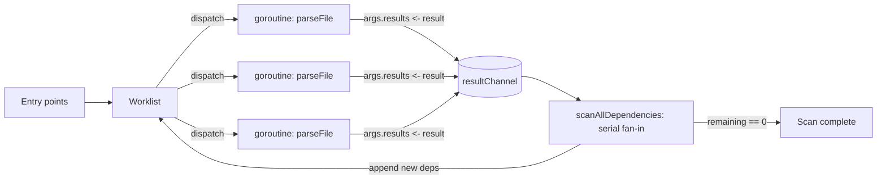

# [FEE-1802] esbuild — Parallelism Architecture

:::info
esbuild treats parallelism as an explicit design principle: almost all CPU time should be spent in fully parallelizable work. The pattern that carries that principle through the bundler is fanout via Go goroutines combined with fan-in over a single channel. The scan phase in `internal/bundler/bundler.go` and the compile phase in `internal/linker/linker.go` both organize CPU-bound work this way, with one goroutine per file or per chunk and a single consumer draining results. The transferable lesson for any CPU-bound pipeline is to keep intermediate data in memory, dispatch work as cheap concurrency units, and join through channels or wait groups so a single consumer can mutate shared state without locks.
:::

## Context

esbuild's `docs/architecture.md` names "Maximize parallelism" as a core principle: most of the time should be spent doing fully parallelizable work, observable via Go's `--trace=[file]` flag and `go tool trace`. That principle is implemented inside a two-phase pipeline (scan and compile), both residing in `internal/bundler/bundler.go`, which is the architectural unit at which parallelism is organized. Evan Wallace's published rationale on the project FAQ names parallelism and Go's shared-memory threading model as core reasons esbuild is fast, with an indirect comparison to JavaScript runtimes that have to serialize data between threads. The combination of design intent, Go's cheap goroutines, and shared memory sets up the structural pattern this article traces through the source.

## Scenario

Consider a TypeScript build configured around a chain of single-purpose CLIs: each source file passes through Babel, then `tsc`, then a minifier, with intermediate output buffered to disk between stages. Each tool re-parses the file, materializes its own AST, serializes back to a string, and the next tool starts from scratch. Parallelism, when it exists, is per-file at the OS-process level and pays a re-parse tax at every hop. esbuild's structural alternative is to keep the AST in memory across passes and fan out per-file work as goroutines that share that memory directly, with a single channel collecting results.

## Best Practices

- **MUST** treat parsing and code generation as the parallelizable phases and accept that linking is inherently serial — the FAQ states this explicitly: "Parsing and code generation are most of the work and are fully parallelizable (linking is an inherently serial task for the most part)."
- **MUST** cap any OS-level resource that goroutine fan-out can exhaust. esbuild's `internal/fs/fs.go` enforces this for file descriptors using a buffered channel as a counting semaphore around every file open, preventing fan-out from blowing past `ulimit -n`.
- **SHOULD** design the pipeline so the goal is full CPU saturation across cores, matching the `bundler.go` phase split (scan parallelizes parsing; compile parallelizes code generation; linking sits between them as the serial join).
- **MAY** rely on the language runtime's scheduler instead of a hand-rolled worker pool when the dispatch unit is cheap. esbuild dispatches one goroutine per file unconditionally and lets the Go scheduler multiplex; the only hard cap esbuild itself enforces is the FD semaphore in `internal/fs/fs.go`.

## Design Thinking

The trade-off esbuild commits to is in-memory parallelism over inter-tool serialization. The FAQ frames this directly: other bundlers do parsing, transpilation, and minification in separate passes and convert between data representations to glue libraries together (string→TS→JS→string, then string→JS→older JS→string, then string→JS→minified JS→string), which uses more memory and slows things down. esbuild interleaves these passes over a shared in-memory AST, which makes goroutine fanout pay off because shared memory is free between goroutines.

The second trade-off is unbounded fanout against bounded OS resources. There is no fixed-size worker pool in the scan phase — any discovered file dispatches a fresh goroutine. Goroutines are cheap, so the Go scheduler absorbs the count, but file descriptors are scarce. esbuild's resolution is asymmetric: let goroutines fan out freely, but gate the one resource that has a hard ceiling (FDs) with a counting semaphore. esbuild relies on Go's default `GOMAXPROCS` (which defaults to `runtime.NumCPU()`) for thread-level multiplexing; the FD semaphore is the only explicit cap esbuild itself imposes.

## Deep Dive

Per-chunk hashing in the compile phase uses a buffered channel as a one-shot future. The hash is computed eagerly on a separate goroutine; the consumer blocks on the channel only if it actually needs the hash. The channel here serves as cross-goroutine memoization: the value is sent once, then re-sent into the same buffered slot so subsequent reads see it again.

*Source: internal/linker/linker.go*

```go
func (c *linkerContext) generateIsolatedHashInParallel(chunk *chunkInfo) {
  // Compute the hash in parallel. This is a speedup when it turns out the hash
  // isn't needed (well, as long as there are threads to spare).
  channel := make(chan []byte, 1)
  chunk.waitForIsolatedHash = func() []byte {
    data := <-channel
    channel <- data
    return data
  }
  go c.generateIsolatedHash(chunk, channel)
}
```

Printing parallelizes for a structural reason rooted in the AST representation. `docs/architecture.md` states it directly: "Each file is printed independently from other files, so files can be printed in parallel. This extends to source map generation." Each AST stores byte offsets into its own source file, so there is no merged AST and no shared mutable printer state; each file's print job is a self-contained goroutine.

## Visual



The diagram captures the scan-phase loop: entry points seed the worklist, every item dispatches a goroutine running `parseFile`, all goroutines write to a single `resultChannel`, and a serial `scanAllDependencies` consumer drains the channel, mutates the shared `results` slice, and appends newly-discovered dependencies back into the worklist. The loop terminates when the remaining counter hits zero. The structural choice here is the FAQ's "everything in memory, no per-pass disk buffering" decision — passes are interleaved over a shared in-memory AST instead of being chained through string serialization between tools.

## Example

The scan phase wires fanout and fan-in through three pieces of source. First, the channel field on the scanner struct is declared with a comment that names the invariant — the `results` slice is mutated by exactly one goroutine, so no mutex is needed:

*Source: internal/bundler/bundler.go*

```go
// These are not guarded by a mutex because it's only ever modified by a single
// thread. Note that not all results in the "results" array are necessarily
// valid. Make sure to check the "ok" flag before using them.
results       []parseResult
visited       map[logger.Path]visitedFile
resultChannel chan parseResult
```

Second, every newly-discovered file dispatches a fresh goroutine with `s.resultChannel` passed in as the result sink. `parseArgs` carries many fields; only the channel handoff is load-bearing here:

*Source: internal/bundler/bundler.go*

```go
go parseFile(parseArgs{ ... results: s.resultChannel, ... })
```

Third, the fan-in is a serial loop that drains the channel until `remaining` reaches zero, mutating the shared `results` slice on a single goroutine:

*Source: internal/bundler/bundler.go*

```go
func (s *scanner) scanAllDependencies() { ... // Continue scanning until all dependencies have been discovered
for s.remaining > 0 { ... result := <-s.resultChannel
s.remaining--
```

`parseFile` itself terminates by sending its parsed result over the channel, completing the fan-in handshake:

*Source: internal/bundler/bundler.go*

```go
args.results <- result
```

This is the goroutine-per-file boundary: the function runs concurrently for every file in the bundle, and every invocation closes its lifecycle by handing its result to the single consumer.

## The Goroutine + Channel Fanout Model

The pattern esbuild uses to organize CPU-bound work has five moving parts. Call it **The Goroutine + Channel Fanout Model**.

1. **A parallel worklist.** `bundler.ScanBundle()` is implemented as a parallel worklist algorithm. The worklist starts off being the list of entry points. Each file in the list is parsed into an AST on a separate goroutine and may add more files to the worklist if it has any dependencies (ES6 `import` statements, ES6 `import()` expressions, or CommonJS `require()` expressions). Scanning continues until the worklist is empty.

2. **A channel fan-in with a single consumer.** The fan-out/fan-in primitive in the scan phase is a single Go channel of `parseResult`. Each worker goroutine sends its parsed AST over `resultChannel`, and the scanner serializes them on a single consumer goroutine. The comment in `internal/bundler/bundler.go` quoted in the Example section names the invariant: the `results` slice "is only ever modified by a single thread." That is what keeps the per-source-index store mutex-free.

3. **Goroutine-per-item dispatch with no fixed-size pool.** Each new file dispatches as a fresh goroutine running `parseFile`, with the shared `resultChannel` passed in as the result sink. There is no fixed-size worker pool; concurrency is bounded only by the Go scheduler and downstream limits like the FD semaphore. esbuild relies on Go's default `GOMAXPROCS` (which defaults to `runtime.NumCPU()`) to multiplex goroutines onto OS threads.

4. **Compile-phase chunk fanout joined on a `WaitGroup`.** The compile phase fans out again at chunk granularity: `generateChunkJS` and `generateChunkCSS` are launched as one goroutine per chunk and joined on a `sync.WaitGroup`.

   *Source: internal/linker/linker.go*

   ```go
   generateWaitGroup := sync.WaitGroup{}
   generateWaitGroup.Add(len(c.chunks))
   for chunkIndex := range c.chunks {
     switch c.chunks[chunkIndex].chunkRepr.(type) {
     case *chunkReprJS:
       go c.generateChunkJS(chunkIndex, &generateWaitGroup)
     case *chunkReprCSS:
       go c.generateChunkCSS(chunkIndex, &generateWaitGroup)
     }
   }
   ```

5. **A separate concurrency boundary for plugins.** The plugin protocol is a deliberately distinct concurrency boundary: a length-prefixed binary protocol over stdin/stdout between the JS host and the Go bundler. The `lib/shared/stdio_protocol.ts` header states it: "The JavaScript API communicates with the Go child process over stdin/stdout using this protocol. It's a very simple binary protocol that uses primitives and nested arrays and maps." On the Go side, the stdio service multiplexes plugin RPCs onto a `chan []byte`. One writer goroutine drains all outgoing packets so they cannot interleave; incoming plugin requests dispatch a fresh goroutine each. Plugins do run concurrently, across a process boundary.

   *Source: cmd/esbuild/service.go*

   ```go
   // Write packets on a single goroutine so they aren't interleaved
   go func() {
     for packet := range service.outgoingPackets {
       if _, err := os.Stdout.Write(packet); err != nil {
         os.Exit(1) // I/O error
       }
       service.keepAliveWaitGroup.Done()
     }
   }()
   ```

**What to look for elsewhere:**

- A worker pool sized to `NumCPU` or `availableParallelism` in the host language's standard library (esbuild's variant: rely on the Go scheduler instead of materializing a pool).
- Channels, queues, or futures carrying intermediate results between fanout and fan-in stages so the consumer mutates shared state on one goroutine.
- An explicit "all in memory, no disk buffering between passes" decision in the architecture documentation, often paired with an in-memory AST or IR shared across passes.
- Separation between in-process worker parallelism (cheap concurrency units, shared memory) and out-of-process plugin or extension parallelism (process boundary, serialized protocol): two different concurrency primitives chosen for two different requirements.
- A counting semaphore (channel-of-bool, mutex+counter, or `os.Sem`-style primitive) capping a scarce OS resource such as file descriptors, network sockets, or GPU memory, sitting underneath an otherwise-unbounded fan-out.

## Internal References

- [FEE-1800 Codebase Studies Overview](/en/Codebase%20Studies/codebase-studies-overview)
- [FEE-1810 three.js dispose lifecycle](/en/Codebase%20Studies/threejs-dispose-lifecycle)

## References

- evanw, "esbuild architecture documentation," esbuild repository (2025). https://github.com/evanw/esbuild/blob/v0.25.2/docs/architecture.md
- evanw, "internal/bundler/bundler.go," esbuild repository (2025). https://github.com/evanw/esbuild/blob/v0.25.2/internal/bundler/bundler.go
- evanw, "internal/linker/linker.go," esbuild repository (2025). https://github.com/evanw/esbuild/blob/v0.25.2/internal/linker/linker.go
- evanw, "lib/shared/stdio_protocol.ts," esbuild repository (2025). https://github.com/evanw/esbuild/blob/v0.25.2/lib/shared/stdio_protocol.ts
- evanw, "cmd/esbuild/service.go," esbuild repository (2025). https://github.com/evanw/esbuild/blob/v0.25.2/cmd/esbuild/service.go
- evanw, "internal/fs/fs.go," esbuild repository (2025). https://github.com/evanw/esbuild/blob/v0.25.2/internal/fs/fs.go
- evanw, "Why is esbuild fast?," esbuild FAQ (2025). https://esbuild.github.io/faq/#why-is-esbuild-fast
