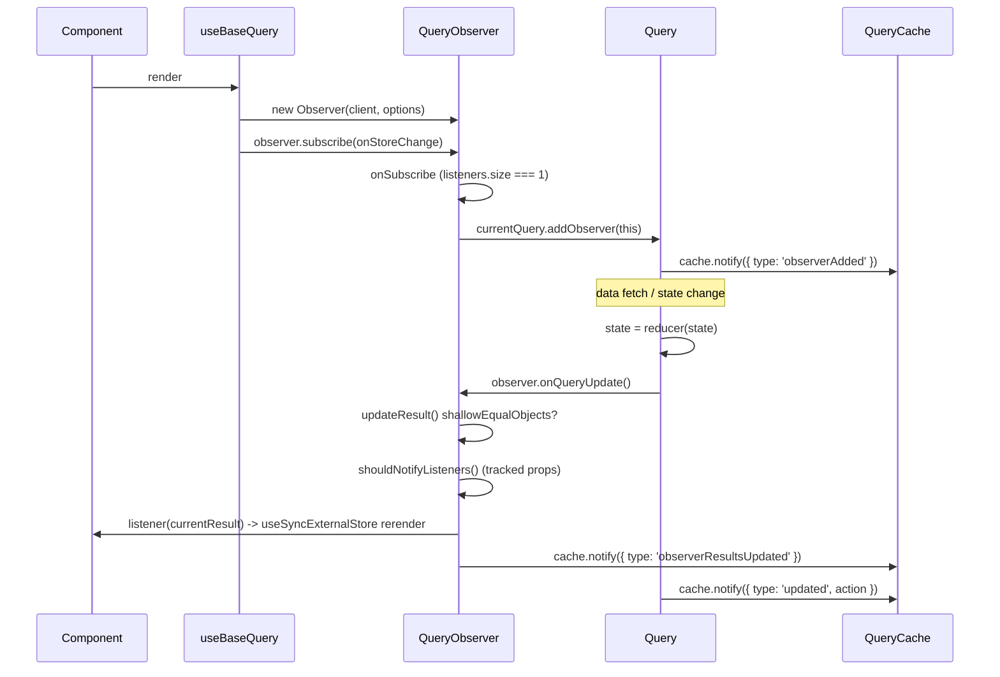

# [FEE-1803] TanStack Query — The Observer Pattern around QueryCache

:::info
TanStack Query is built on a small pub-sub primitive named `Subscribable`, a central `QueryCache` registry, and per-`useQuery` `QueryObserver` instances. Together they form a reusable shape this article calls **The Observer Pattern around QueryCache**: one cache map keyed by stable hash, one observer per subscription bound to one cache entry, and lifecycle gating that bootstraps on the first listener and tears down on the last. The maintainer Dominik Dorfmeister (TkDodo) describes the Observer's job as being "subscribed to exactly one query" and tracking which result properties a component reads so unrelated changes do not notify it. The transferable lesson: any reactive cache layer in the same family (SWR, RTK Query, Apollo's `InMemoryCache` + `ObservableQuery`, custom hooks) can be recognised and designed by these five moving parts.
:::

## Context

The base class `Subscribable<TListener extends Function>` lives in
`packages/query-core/src/subscribable.ts`. It is generic over the listener
type, holds a `Set<TListener>`, and exposes `subscribe()` plus `hasListeners()`
([Claim 1, subscribable.ts](https://github.com/TanStack/query/blob/v5.74.3/packages/query-core/src/subscribable.ts)).
Two classes extend it: `QueryCache extends Subscribable<QueryCacheListener>`
and `QueryObserver<...> extends Subscribable<QueryObserverListener<TData, TError>>`
([Claim 2, queryCache.ts](https://github.com/TanStack/query/blob/v5.74.3/packages/query-core/src/queryCache.ts),
[queryObserver.ts](https://github.com/TanStack/query/blob/v5.74.3/packages/query-core/src/queryObserver.ts)).
`QueryCache` is the central registry: it owns a `Map<string, Query>` keyed by
the stringified query hash, and `add()` mutates the map and fires an `'added'`
event ([Claim 3, queryCache.ts](https://github.com/TanStack/query/blob/v5.74.3/packages/query-core/src/queryCache.ts)).
TkDodo frames the Observer's role plainly: "An `Observer` is created when you
call `useQuery`, and it is always subscribed to exactly one query," and "The
`Observer` knows which properties of the `Query` a component is using, so it
doesn't have to notify it of unrelated changes" ([Claim 14, Inside React Query](https://tkdodo.eu/blog/inside-react-query)).

## Scenario

A React app reaches for a custom data-fetch hook. The first version returns a
fetch result. The second version caches by URL. The third version dedupes
in-flight requests across components. The fourth version adds selective
rerenders so a component reading `data` does not rerender when `isFetching`
flips. By that step the team has rebuilt the same shape TanStack Query
publishes: a global cache `Map`, a per-component subscription object that
binds options and listeners to one cache entry, and a pub-sub primitive with
lifecycle hooks at both ends. TanStack Query's source is the structural
reference implementation for that shape, and its naming carries the
recognition signals into other libraries in the same family.

## Best Practices

- **MUST** reach for `useQuery` when reading from a component, since
  `useQuery` creates a `QueryObserver` that subscribes to changes; the
  in-source JSDoc on `getQueryData` warns it "won't receive updates" inside a
  component ([Claim 10](https://github.com/TanStack/query/blob/v5.74.3/packages/query-core/src/queryClient.ts)).
- **MUST** use `QueryClient.getQueryData(queryKey)` only in callbacks or
  one-shot reads where a fresh snapshot of `state.data` is enough; it never
  creates an Observer and never schedules a subscription ([Claim 10](https://github.com/TanStack/query/blob/v5.74.3/packages/query-core/src/queryClient.ts)).
- **SHOULD** apply the same Observer shape in your own reactive caches when
  you need component-bound subscriptions and selective rerenders, because the
  Observer "knows which properties of the Query a component is using, so it
  doesn't have to notify it of unrelated changes" ([Claim 14, TkDodo](https://tkdodo.eu/blog/inside-react-query)).
- **SHOULD** keep the binding "exactly one observer to exactly one cache
  entry"; TkDodo writes that an Observer "is always subscribed to exactly one
  query," and that 1-to-1 binding is what lets the lifecycle hooks safely add
  and remove the observer from one Query's observer list ([Claim 14](https://tkdodo.eu/blog/inside-react-query)).
- **MAY** skip the Observer entirely for non-reactive reads (optimistic
  updates, callbacks, server-side snapshots); the JSDoc explicitly lists this
  as the right use of `getQueryData` ([Claim 10](https://github.com/TanStack/query/blob/v5.74.3/packages/query-core/src/queryClient.ts)).

## Design Thinking

Putting `Subscribable` at the base buys a uniform pub-sub primitive for both
the cache (one global listener bus that DevTools and global watchers attach
to) and the per-component observer (one listener bus per `useQuery` instance).
Both inherit `subscribe()` and `hasListeners()`, both call `onSubscribe()` and
`onUnsubscribe()` lifecycle hooks ([Claim 1](https://github.com/TanStack/query/blob/v5.74.3/packages/query-core/src/subscribable.ts)).
`Query` itself is deliberately kept off this hierarchy. `Query` extends
`Removable`, and its fan-out to observers is plain array iteration:
`this.observers.forEach((observer) => observer.onQueryUpdate())` inside a
`notifyManager.batch` ([Claim 6, query.ts](https://github.com/TanStack/query/blob/v5.74.3/packages/query-core/src/query.ts)).
The trade is: a `Set<TListener>` indirection on every state change versus a
straight array walk on the hot path, where every cached query mutation runs.
The lifecycle gating in `QueryObserver.onSubscribe()` is symmetric: the first
subscriber arriving (`this.listeners.size === 1`) calls `addObserver` and
either fetches or runs `updateResult`; the last unsubscriber leaving
(`!this.hasListeners()`) calls `destroy()`, which removes the observer from
its Query and lets the Query schedule itself for GC ([Claim 7](https://github.com/TanStack/query/blob/v5.74.3/packages/query-core/src/queryObserver.ts),
[Claim 8](https://github.com/TanStack/query/blob/v5.74.3/packages/query-core/src/queryObserver.ts)).
The work happens at exactly the boundary where it is needed.

## Deep Dive

The full Query → Observer → Component update chain runs inside one
`notifyManager.batch`. When a Query's state changes via `#dispatch`, the
Query walks its own observer array and notifies the cache:

*Source: packages/query-core/src/query.ts*

```ts
this.state = reducer(this.state)

notifyManager.batch(() => {
  this.observers.forEach((observer) => {
    observer.onQueryUpdate()
  })

  this.#cache.notify({ query: this, type: 'updated', action })
})
```

Each Observer's `onQueryUpdate()` re-runs the result pipeline. The Observer
narrows further before notifying its own listeners. `updateResult()`
short-circuits when the new result is shallow-equal to the previous one
([Claim 11](https://github.com/TanStack/query/blob/v5.74.3/packages/query-core/src/queryObserver.ts)),
and even when the result differs, `shouldNotifyListeners` only returns true
if a *changed* key is in the included set, where the included set is
`notifyOnChangeProps` if set, otherwise the props the consumer touched
(tracked in `#trackedProps`):

*Source: packages/query-core/src/queryObserver.ts*

```ts
const shouldNotifyListeners = (): boolean => {
  if (!prevResult) return true
  const { notifyOnChangeProps } = this.options
  ...
  if (notifyOnChangePropsValue === 'all' || (!notifyOnChangePropsValue && !this.#trackedProps.size)) {
    return true
  }
  const includedProps = new Set(notifyOnChangePropsValue ?? this.#trackedProps)
  ...
  return Object.keys(this.#currentResult).some((key) => {
    const typedKey = key as keyof QueryObserverResult
    const changed = this.#currentResult[typedKey] !== prevResult[typedKey]
    return changed && includedProps.has(typedKey)
  })
}
this.#notify({ listeners: shouldNotifyListeners() })
```

The result: a state change in one `Query` may run through every observer's
result pipeline yet rerender only the components whose tracked props
actually changed ([Claim 12](https://github.com/TanStack/query/blob/v5.74.3/packages/query-core/src/queryObserver.ts)).

## Visual



## Example

`Query.addObserver` registers the observer with one cache entry, clears the
GC timer, and emits an `'observerAdded'` cache event:

*Source: packages/query-core/src/query.ts*

```ts
addObserver(observer: QueryObserver<any, any, any, any, any>): void {
  if (!this.observers.includes(observer)) {
    this.observers.push(observer)
    // Stop the query from being garbage collected
    this.clearGcTimeout()
    this.#cache.notify({ type: 'observerAdded', query: this, observer })
  }
}
```

On the React side, `useBaseQuery` wires the Observer into the component using
three React primitives: `useState` to construct the Observer once per
component instance, `useSyncExternalStore` to subscribe and drive rerenders,
and `useEffect` to re-apply options on each render:

*Source: packages/react-query/src/useBaseQuery.ts*

```ts
const [observer] = React.useState(
  () =>
    new Observer<TQueryFnData, TError, TData, TQueryData, TQueryKey>(
      client,
      defaultedOptions,
    ),
)

React.useSyncExternalStore(
  React.useCallback(
    (onStoreChange) => {
      const unsubscribe = shouldSubscribe
        ? observer.subscribe(notifyManager.batchCalls(onStoreChange))
        : noop
      observer.updateResult()
      return unsubscribe
    },
    [observer, shouldSubscribe],
  ),

React.useEffect(() => {
  observer.setOptions(defaultedOptions)
}, [defaultedOptions, observer])
```

The `useState` initializer ensures the Observer survives rerenders. The
`useSyncExternalStore` callback returns the unsubscribe function from
`Subscribable.subscribe()`, which is what triggers `onUnsubscribe` and the
Observer's `destroy()` path on unmount ([Claim 9](https://github.com/TanStack/query/blob/v5.74.3/packages/react-query/src/useBaseQuery.ts)).

## The Observer Pattern around QueryCache

**The Observer Pattern around QueryCache** has five moving parts. Reading
TanStack Query's source as a reference implementation, each part is small
and individually replaceable.

**1. A `Subscribable<TListener>` base.** A `Set<TListener>` plus
`subscribe()` returning an unsubscribe function, plus `hasListeners()`, plus
two empty lifecycle hooks for subclasses to override
([Claim 1, subscribable.ts](https://github.com/TanStack/query/blob/v5.74.3/packages/query-core/src/subscribable.ts)).

**2. A central `QueryCache` registry.** A `Map<string, Query>` keyed by
stringified query hash, with `add()`/`remove()`/`notify()`. The `add` path
fires an `'added'` event so cache-level listeners (DevTools, global watchers)
can react ([Claim 3, queryCache.ts](https://github.com/TanStack/query/blob/v5.74.3/packages/query-core/src/queryCache.ts)).
`QueryCache.notify(event)` itself fans a single typed `QueryCacheNotifyEvent`
out to every cache subscriber inside a `notifyManager.batch`:

*Source: packages/query-core/src/queryCache.ts*

```ts
notify(event: QueryCacheNotifyEvent): void {
  notifyManager.batch(() => {
    this.listeners.forEach((listener) => {
      listener(event)
    })
  })
}
```

This is the channel DevTools and global observers listen on
([Claim 4](https://github.com/TanStack/query/blob/v5.74.3/packages/query-core/src/queryCache.ts)).

**3. Per-`useQuery` Observer bound to one Query.** Each `useQuery` call
constructs its own `QueryObserver`. The Observer holds the call's options
and its set of listeners, and is bound to exactly one `Query` via
`#currentQuery`. TkDodo summarises: "An `Observer` is created when you call
`useQuery`, and it is always subscribed to exactly one query"
([Claim 14](https://tkdodo.eu/blog/inside-react-query)).

**4. Lifecycle gating.** `onSubscribe()` does work only on the transition
from zero to one listener, and `onUnsubscribe()` tears down only when the
last listener leaves:

*Source: packages/query-core/src/queryObserver.ts*

```ts
protected onSubscribe(): void {
  if (this.listeners.size === 1) {
    this.#currentQuery.addObserver(this)

    if (shouldFetchOnMount(this.#currentQuery, this.options)) {
      this.#executeFetch()
    } else {
      this.updateResult()
    }

    this.#updateTimers()
  }
}
```

```ts
protected onUnsubscribe(): void {
  if (!this.hasListeners()) {
    this.destroy()
  }
}

destroy(): void {
  this.listeners = new Set()
  this.#clearStaleTimeout()
  this.#clearRefetchInterval()
  this.#currentQuery.removeObserver(this)
}
```

The first subscriber bootstraps (adds the observer to the Query, fetches or
updates the result, schedules timers); the last unsubscriber tears down
(clears timers, removes the observer, lets the Query schedule itself for GC)
([Claim 7](https://github.com/TanStack/query/blob/v5.74.3/packages/query-core/src/queryObserver.ts),
[Claim 8](https://github.com/TanStack/query/blob/v5.74.3/packages/query-core/src/queryObserver.ts)).

**5. A read-without-subscribing path.** `QueryClient.getQueryData(queryKey)`
reads the Map directly with no Observer, no subscription, no notification:

*Source: packages/query-core/src/queryClient.ts*

```ts
/**
 * Imperative (non-reactive) way to retrieve data for a QueryKey.
 * Should only be used in callbacks or functions where reading the latest data is necessary, e.g. for optimistic updates.
 *
 * Hint: Do not use this function inside a component, because it won't receive updates.
 * Use `useQuery` to create a `QueryObserver` that subscribes to changes.
 */
getQueryData<...>(queryKey: TTaggedQueryKey): TInferredQueryFnData | undefined {
  const options = this.defaultQueryOptions({ queryKey })
  return this.#queryCache.get(options.queryHash)?.state.data as ...
}
```

The maintainer's JSDoc explicitly warns against using it inside a component
([Claim 10](https://github.com/TanStack/query/blob/v5.74.3/packages/query-core/src/queryClient.ts)).
Two distinct verbs for two distinct intents.

**Selective notification.** Beyond the five moving parts, the Observer
narrows notifications twice on every update. First a shallow-equal
short-circuit on result: `updateResult()` early-returns when
`shallowEqualObjects(nextResult, prevResult)` is true ([Claim 11](https://github.com/TanStack/query/blob/v5.74.3/packages/query-core/src/queryObserver.ts)).
Second, property-tracking via `notifyOnChangeProps` and `#trackedProps`:
`shouldNotifyListeners` returns true only when a changed key is in the
included set ([Claim 12](https://github.com/TanStack/query/blob/v5.74.3/packages/query-core/src/queryObserver.ts)).
Finally, `#notify` calls component listeners first (driving React's
`useSyncExternalStore` rerender) and then forwards an
`'observerResultsUpdated'` event to the cache, both inside one
`notifyManager.batch`:

*Source: packages/query-core/src/queryObserver.ts*

```ts
#notify(notifyOptions: { listeners: boolean }): void {
  notifyManager.batch(() => {
    // First, trigger the listeners
    if (notifyOptions.listeners) {
      this.listeners.forEach((listener) => {
        listener(this.#currentResult)
      })
    }

    // Then the cache listeners
    this.#client.getQueryCache().notify({
      query: this.#currentQuery,
      type: 'observerResultsUpdated',
    })
  })
}
```

Two notification channels, one shared notify pass ([Claim 13](https://github.com/TanStack/query/blob/v5.74.3/packages/query-core/src/queryObserver.ts)).

**What to look for elsewhere.** The same shape recurs across reactive caches.
Concrete recognition signals:

- A `Subscribable<TListener>`-style base with `Set<TListener>` and
  `subscribe()` / `hasListeners()`.
- A registry class (`*Cache`, `Store`, `Atoms`) holding a
  `Map<string, Entry>` keyed by a stable hash.
- Per-call observer/subscription objects that own options and listener
  wiring; bind to exactly one cache entry.
- A "read without subscribing" path (`getQueryData`-equivalent:
  `client.readQuery`, `store.getState()`, `atomFamily.read`) that creates
  no observer.
- Selective notification: shallow-equal short-circuit on result, plus
  property-tracking so unrelated field changes don't rerender consumers.
- Lifecycle gating in `onSubscribe`/`onUnsubscribe` so first-subscriber
  bootstraps work and last-unsubscriber tears it down.

## Internal References

- [FEE-1800 Codebase Studies Overview](/en/Codebase%20Studies/codebase-studies-overview)
- [FEE-1802 esbuild Parallelism Architecture](/en/Codebase%20Studies/esbuild-parallelism-architecture)
- [FEE-1810 three.js Dispose Lifecycle](/en/Codebase%20Studies/threejs-dispose-lifecycle)
- [FEE-613 TanStack Query v5](/en/State%20Management/tanstack-query-v5)

## References

- TanStack, "query-core/src/subscribable.ts," TanStack/query at v5.74.3 (2025). https://github.com/TanStack/query/blob/v5.74.3/packages/query-core/src/subscribable.ts
- TanStack, "query-core/src/queryCache.ts," TanStack/query at v5.74.3 (2025). https://github.com/TanStack/query/blob/v5.74.3/packages/query-core/src/queryCache.ts
- TanStack, "query-core/src/queryObserver.ts," TanStack/query at v5.74.3 (2025). https://github.com/TanStack/query/blob/v5.74.3/packages/query-core/src/queryObserver.ts
- TanStack, "query-core/src/query.ts," TanStack/query at v5.74.3 (2025). https://github.com/TanStack/query/blob/v5.74.3/packages/query-core/src/query.ts
- TanStack, "query-core/src/queryClient.ts," TanStack/query at v5.74.3 (2025). https://github.com/TanStack/query/blob/v5.74.3/packages/query-core/src/queryClient.ts
- TanStack, "react-query/src/useBaseQuery.ts," TanStack/query at v5.74.3 (2025). https://github.com/TanStack/query/blob/v5.74.3/packages/react-query/src/useBaseQuery.ts
- Dominik Dorfmeister (TkDodo), "Inside React Query," tkdodo.eu (2022). https://tkdodo.eu/blog/inside-react-query
