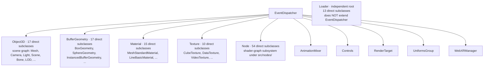

# [FEE-1801] Three.js — Architecture Tour

:::info
This tour reads three.js at tag **r172 (2025-04-15)** through five lenses: class hierarchy, module decomposition, public API surface, render loop, and resource lifecycle. Five subsystem-root classes (`Object3D`, `BufferGeometry`, `Material`, `Texture`, `Node`) all extend a single `EventDispatcher` base and fan out into parallel inheritance trees that never cross-merge below the root, with a sixth large independent tree rooted at `Loader`. The same one-line `dispose()` event-fire contract used by the original geometry/material/texture trio was carried forward into the newer `Node` shader-graph subsystem (57 subclasses at r172). The library does not own the per-frame loop. It owns one tick of it, exposed as a synchronous `render(scene, camera)`.
:::

## Context

Three.js is the WebGL/WebGPU 3D rendering library maintained by mrdoob (Ricardo Cabello) and a long-running contributor pool. The repository at tag `r172` packs **685 `.js` files** under `src/`, organized into **16 responsibility-named subdirectories** plus a small set of top-level entry/aggregator files (`Three.js`, `Three.Core.js`, `Three.WebGPU.js`, `Three.WebGPU.Nodes.js`, `Three.TSL.js`, `Three.Legacy.js`, `constants.js`, `utils.js`). Two domains, `renderers/` and `nodes/`, hold roughly 65% of the source files, reflecting that the codebase is currently shipping two parallel subsystems: the legacy WebGL backend and the newer node-graph + WebGPU stack.

The library is worth studying because it is one of the most widely-deployed JavaScript graphics codebases in production, has been maintained continuously for over a decade across two major rendering APIs (WebGL and WebGPU), and exposes a small, stable public surface assembled by re-exporting from each domain folder. The interior shows recurring shape choices: a single observable substrate (`EventDispatcher`) under several otherwise-unrelated subsystem roots; folder names that read as a 3D-graphics vocabulary; a single ESM barrel as the package entry; an imperative per-frame call site that the host application owns; and a one-line `dispose()` contract that fires an event and lets a separate listener perform GPU teardown.

The architectural angle that makes the codebase interesting is generational: the original four resource-owning classes (`BufferGeometry`, `Material`, `Texture`, `WebGLRenderTarget`) established conventions in the WebGL era, and the same conventions reappear verbatim on the `Node` base class introduced for the shader-nodes / TSL / WebGPU pipeline. Reading three.js is reading two backends of the same library that share root contracts.

## Visual



## Example

`src/Three.js`, lines 1-9 — the entire package entry file at r172:

```js
export * from './Three.Core.js';

export { WebGLRenderer } from './renderers/WebGLRenderer.js';
export { ShaderLib } from './renderers/shaders/ShaderLib.js';
export { UniformsLib } from './renderers/shaders/UniformsLib.js';
export { UniformsUtils } from './renderers/shaders/UniformsUtils.js';
export { ShaderChunk } from './renderers/shaders/ShaderChunk.js';
export { PMREMGenerator } from './extras/PMREMGenerator.js';
export { WebGLUtils } from './renderers/webgl/WebGLUtils.js';
```

Nine lines, one wildcard re-export of the core barrel, seven named re-exports of renderer-tier identifiers. Every public name reachable through the bare `'three'` specifier sits one re-export hop from this file.

## Class Hierarchy & Inheritance

**Event-Rooted Forest.** Three.js's class graph at r172 is a small set of subsystem-root classes, each extending the same `EventDispatcher` mixin, fanning out into parallel inheritance trees that never cross-merge below the root. The `extends-edges.txt` artifact for r172 lists 375 inheritance edges. Of those, ten classes are direct children of `EventDispatcher`: `AnimationMixer`, `BufferGeometry`, `Controls`, `Material`, `Node`, `Object3D`, `RenderTarget`, `Texture`, `UniformsGroup`, `WebXRManager`. Five host the largest subtrees:

- `Object3D` — 17 direct subclasses, the scene graph (`Mesh`, `Camera`, `Light`, `Scene`, `Bone`, `LOD`, …).
- `BufferGeometry` — 17 direct subclasses (`BoxGeometry`, `SphereGeometry`, `InstancedBufferGeometry`, …).
- `Material` — 15 direct subclasses (`MeshStandardMaterial`, `LineBasicMaterial`, …). `NodeMaterial` adds 15 more direct children but is itself a grandchild of `EventDispatcher` via `Material`.
- `Texture` — 10 direct subclasses (`CubeTexture`, `DataTexture`, `VideoTexture`, …).
- `Node` — 54 direct subclasses, the entire shader-graph subsystem under `src/nodes/` and the largest single hierarchy in the codebase.

A sixth large tree sits outside the EventDispatcher forest: `Loader` is its own root with 13 direct subclasses (the file-format loaders) and does not extend `EventDispatcher` at r172. The class declaration in `src/loaders/Loader.js` line 3 reads `class Loader {` with no `extends` clause, confirming Loader is structurally independent from the event substrate.

`EventDispatcher` itself is a plain class with no parent — `src/core/EventDispatcher.js` lines 5-9 declare `class EventDispatcher {` and define `addEventListener`, `removeEventListener`, `dispatchEvent`, and `hasEventListener` as the publish/subscribe primitives every root inherits. The five resource-or-graph roots inherit it directly:

- `src/core/Object3D.js` line 31: `class Object3D extends EventDispatcher {`
- `src/core/BufferGeometry.js` line 22: `class BufferGeometry extends EventDispatcher {`
- `src/materials/Material.js` line 8: `class Material extends EventDispatcher {`
- `src/textures/Texture.js` line 20: `class Texture extends EventDispatcher {`
- `src/nodes/core/Node.js` line 14: `class Node extends EventDispatcher {`

The deepest chain measured at r172 runs six edges from the leaf back to `EventDispatcher`:

```
ViewportDepthTextureNode → ViewportTextureNode → TextureNode → UniformNode → InputNode → Node → EventDispatcher
```

Every link verifies against r172 source: `src/nodes/display/ViewportDepthTextureNode.js` line 18 (`class ViewportDepthTextureNode extends ViewportTextureNode {`), `src/nodes/display/ViewportTextureNode.js` line 23 (`extends TextureNode`), `src/nodes/accessors/TextureNode.js` line 19 (`extends UniformNode`), `src/nodes/core/UniformNode.js` line 12 (`extends InputNode`), `src/nodes/core/InputNode.js` line 9 (`extends Node`).

The shape's load-bearing property: subtrees never cross-inherit. `Mesh extends Object3D` (`src/objects/Mesh.js` line 27) lives entirely inside the scene-graph subtree; nothing in the geometry, material, texture, or node subtrees ever re-roots through `Object3D`. Each subsystem keeps its own root and its own subtree, and the only shared substrate is the event pub/sub at the very top. The smaller `EventDispatcher` direct children (`AnimationMixer`, `Controls`, `RenderTarget`, `UniformsGroup`, `WebXRManager`) follow the same convention — each owns observable state, each is a root of its own small tree.

**What to look for elsewhere:** grep for a single base class that several otherwise-unrelated subsystem roots all extend (often called `EventEmitter`, `EventTarget`, `Observable`, or `Subject`), then count how many `class X extends <thatBase>` declarations sit at top level versus nested deeper. When five or more subsystem roots share one observable substrate but their subtrees never cross-inherit, you are looking at the same Event-Rooted Forest pattern.

## Module Decomposition

**Domain-Sliced Folders.** Every top-level directory under `src/` at r172 is named after a 3D-graphics responsibility — `geometries`, `materials`, `lights`, `cameras`, `scenes`, `renderers`, `textures`, `loaders`, `audio`, `animation`, `objects`, `helpers`, `extras`, `math`, `core`, `nodes` — so a folder's name tells you the kind of object that lives inside, and cross-folder coupling happens through explicit relative imports rather than a shared utility layer. The output of `ls src/` at r172 reads as a vocabulary of the problem domain plus six top-level aggregator files (`Three.js`, `Three.Core.js`, `Three.Legacy.js`, `Three.TSL.js`, `Three.WebGPU.js`, `Three.WebGPU.Nodes.js`) and two utility files (`constants.js`, `utils.js`).

File counts per top-level domain at r172 (verified with `find ... -name '*.js' | wc -l`):

| Domain | Files |
|---|---:|
| `renderers` | 251 |
| `nodes` | 196 |
| `materials` | 39 |
| `math` | 27 |
| `extras` | 24 |
| `geometries` | 22 |
| `loaders` | 19 |
| `core` | 18 |
| `animation` | 14 |
| `objects` | 14 |
| `helpers` | 13 |
| `lights` | 13 |
| `textures` | 13 |
| `cameras` | 6 |
| `audio` | 5 |
| `scenes` | 3 |

Two domains, `renderers/` and `nodes/`, hold roughly 65% of the 685-file source tree. The other 14 are small and tight — `scenes/` is 3 files, `audio/` is 5, `cameras/` is 6 — which matches the inheritance picture: small subtrees of subsystem-root classes plus their few helpers, not deep packages.

`renderers/` is itself sliced by graphics backend. Its direct subdirectories at r172 are `webgl/`, `webgl-fallback/`, `webgpu/`, `common/`, plus `shaders/` (the GLSL chunk library) and `webxr/`. Five render-target classes (`WebGLRenderer.js`, `WebGLRenderTarget.js`, `WebGLArrayRenderTarget.js`, `WebGL3DRenderTarget.js`, `WebGLCubeRenderTarget.js`) sit at the `renderers/` root. Swapping the rendering backend is a folder-level concern: the WebGL backend lives in `webgl/`, the WebGPU backend in `webgpu/`, and the backend-agnostic `Renderer` (2860 LOC) in `common/`.

The two largest single files in the source tree are both renderer cores; the third is the node-graph compiler:

| Rank | File | LOC |
|---:|---|---:|
| 1 | `src/renderers/WebGLRenderer.js` | 2955 |
| 2 | `src/renderers/common/Renderer.js` | 2860 |
| 3 | `src/nodes/core/NodeBuilder.js` | 2426 |
| 4 | `src/renderers/webgl-fallback/WebGLBackend.js` | 2211 |
| 5 | `src/renderers/webgl/WebGLTextures.js` | 2185 |
| 6 | `src/renderers/webgpu/WebGPUBackend.js` | 2026 |

Five of the top six live under `renderers/`, confirming it as the dominant functional cluster.

Cross-domain coupling is expressed as explicit `../<domain>/<File>.js` imports. `src/renderers/WebGLRenderer.js` opens by pulling math types from `../math/` and pulling each WebGL collaborator from the sibling `./webgl/` folder — `WebGLAnimation`, `WebGLAttributes`, `WebGLBackground`, `WebGLBindingStates`, `WebGLState`, `WebGLTextures`, `WebGLUniforms`, and so on. The file's import block is itself a structural map of the WebGL backend. `src/core/Object3D.js` opens by importing from `../math/` (`Quaternion`, `Vector3`, `Matrix4`, `Euler`, `Matrix3`, `generateUUID`) and from `./` (`EventDispatcher`, `Layers`); the `core/` folder reaches into `math/` via relative paths rather than through any shared barrel.

There is no central utility layer. The two `utils.js` and `constants.js` files at the `src/` root are thin: `constants.js` holds enum-like exports, `utils.js` holds a handful of helpers. Domains coordinate through their named imports; no `services/`, `controllers/`, or `lib/` folder mediates between them.

**What to look for elsewhere:** run `ls <pkg>/src` and check whether the top-level folder names read as a vocabulary of the project's problem domain (in three.js: `lights`, `cameras`, `geometries`, ...) versus technical layers (`controllers`, `services`, `utils`, `types`); pair that with `grep -rE "from '\.\./[a-z]+/" src | sort -u` to confirm cross-folder edges go through named relative imports. When both hold, the codebase is using the domain-sliced-folders pattern.

## Public API Surface

**Two-Tier Barrel-Indexed Public API.** A single ESM entry file (`src/Three.js`) re-exports renderer-coupled identifiers and then `export *`s a second core barrel (`src/Three.Core.js`), so every public name is reached in exactly one re-export hop from the package entry.

`package.json` at r172 declares the package as ESM-first and points the entry at the build artifact:

```json
"type": "module",
"main": "./build/three.cjs",
"module": "./build/three.module.js",
"exports": {
  ".": {
    "import": "./build/three.module.js",
    "require": "./build/three.cjs"
  },
  "./examples/fonts/*": "./examples/fonts/*",
  "./examples/jsm/*": "./examples/jsm/*",
  "./addons": "./examples/jsm/Addons.js",
```

The bare `'three'` specifier resolves to `./build/three.module.js`, which is the Rollup output of `src/Three.js`. The source-of-truth for the public surface is therefore the source barrel, not the build artifact.

`src/Three.js` is 9 lines: one wildcard re-export of the core barrel (`export * from './Three.Core.js';`) and seven named re-exports of renderer-tier identifiers (`WebGLRenderer`, `ShaderLib`, `UniformsLib`, `UniformsUtils`, `ShaderChunk`, `PMREMGenerator`, `WebGLUtils`). `src/Three.Core.js` adds 156 more `export { Foo } from './path/Foo.js'` (or `export * from './path/Bar.js'`) lines covering scenes, objects, textures, geometries, materials, loaders, lights, cameras, audio, animation, core (`BufferGeometry`, `Object3D`, `Raycaster`, …), math, helpers, curves, extras, constants, and the legacy shim. Transitive named exports through one re-export hop come out to **164 identifiers**.

Split summary:

| Tier | File | Direct lines | Role |
|---|---|---|---|
| Renderer-loaded | `src/Three.js` | 8 exports | WebGL renderer + shader chunk libraries |
| Core types | `src/Three.Core.js` | 156 exports | Math, scene graph, geometries, materials, loaders, etc. |

The split has a runtime consequence. Renderer-tier identifiers live in `Three.js` so that consumers who do not need the WebGL renderer — node-side tests, math-only utilities, the WebGPU front-end — can import the core barrel without dragging in WebGL shader source. Everything below renderer level, including the entire scene graph, is reachable from `Three.Core.js` alone. The dedicated WebGPU and TSL barrels (`Three.WebGPU.js`, `Three.WebGPU.Nodes.js`, `Three.TSL.js`) sit at the same level as `Three.js` and offer alternative entry points for the node-graph backend.

`src/Three.Core.js` head (abbreviated):

```js
import { REVISION } from './constants.js';

export { WebGLArrayRenderTarget } from './renderers/WebGLArrayRenderTarget.js';
export { WebGL3DRenderTarget } from './renderers/WebGL3DRenderTarget.js';
export { WebGLCubeRenderTarget } from './renderers/WebGLCubeRenderTarget.js';
export { WebGLRenderTarget } from './renderers/WebGLRenderTarget.js';
export { FogExp2 } from './scenes/FogExp2.js';
export { Fog } from './scenes/Fog.js';
export { Scene } from './scenes/Scene.js';
export { Sprite } from './objects/Sprite.js';
export { LOD } from './objects/LOD.js';
export { SkinnedMesh } from './objects/SkinnedMesh.js';
export { Skeleton } from './objects/Skeleton.js';
export { Bone } from './objects/Bone.js';
export { Mesh } from './objects/Mesh.js';
export { InstancedMesh } from './objects/InstancedMesh.js';
export { BatchedMesh } from './objects/BatchedMesh.js';
```

The barrel mixes single-name `export { Foo }` lines with `export *` lines that fan out further (`export * from './geometries/Geometries.js';`, `export * from './materials/Materials.js';`, `export * from './extras/curves/Curves.js';`, `export * from './constants.js';`, `export * from './Three.Legacy.js';`). The wildcard fan-out keeps the barrel maintainable — the geometry and material subdirectories own their own internal index file (`Geometries.js`, `Materials.js`), and the top-level barrel re-exports the index without enumerating each class.

Internal consumers depend on the barrel as if they were external. The `examples/jsm/` add-ons folder is registered as a separate package via `package.json` `exports['./examples/jsm/*']`, and the add-ons reach every type through the bare `'three'` specifier. `examples/jsm/loaders/GLTFLoader.js` lines 1-67 pull 65+ named identifiers (`AnimationClip`, `Bone`, `Box3`, `BufferAttribute`, `BufferGeometry`, …, `VectorKeyframeTrack`, `SRGBColorSpace`, `InstancedBufferAttribute`) in a single import statement, none referencing an internal path. Add-ons treat the engine the way a third-party application would.

**What to look for elsewhere:** grep the `src/` (or `lib/`) root for a single file dominated by `export { X } from './path/X.js'` and `export * from './...'` lines with no implementation logic, and cross-check that `package.json`'s `"exports"."."` (or `"module"`/`"main"`) field points at a build artifact whose source is exactly that file. A two-tier split is signalled when that entry's first line is `export * from './<Name>.Core.js'` (or `.Base`, `.Common`, `.Internal`) and the renderer or platform-specific names sit above the wildcard.

## The Render Loop

**Imperative Per-Frame Entry.** The renderer exposes a synchronous `render(scene, camera)` method that the host application calls once per frame; the library never owns the loop, only one tick of it. The lens scan for `render`/`tick`/`update`/`step`/`loop` keywords across the r172 source tree surfaced 82 function/method hits, concentrated in three giants: `WebGLRenderer.js` (2955 LOC), `common/Renderer.js` (2860 LOC), and `nodes/core/NodeBuilder.js` (2426 LOC).

The render entry point on `WebGLRenderer` is the assigned method `this.render = function ( scene, camera )` at `src/renderers/WebGLRenderer.js` line 1139. Per call, it performs an early-return on a lost GL context, walks the scene graph by calling `scene.updateMatrixWorld()` when `matrixWorldAutoUpdate` is true, updates the camera's world matrix, optionally swaps in the XR camera, builds a render list via `projectObject(...)` plus opaque/transparent sort, and then submits draw calls. The on-the-frame contract is that the application calls `render` once per frame and everything else is internal bookkeeping. Lines 1137-1156:

```js
// Rendering

this.render = function ( scene, camera ) {

    if ( camera !== undefined && camera.isCamera !== true ) {

        console.error( 'THREE.WebGLRenderer.render: camera is not an instance of THREE.Camera.' );
        return;

    }

    if ( _isContextLost === true ) return;

    // update scene graph

    if ( scene.matrixWorldAutoUpdate === true ) scene.updateMatrixWorld();

    // update camera matrices and frustum

    if ( camera.parent === null && camera.matrixWorldAutoUpdate === true ) camera.updateMatrixWorld();
```

The unified backend in `src/renderers/common/Renderer.js` exposes the same shape at line 1093 — a synchronous `render( scene, camera )` that delegates to a private `_renderScene( scene, camera )` after an init guard, and a `renderAsync` (line 932) that returns a promise during the async window before the WebGPU device has resolved. The public signature is identical across WebGL and WebGPU backends, so swapping backends does not change the per-frame call site:

```js
render( scene, camera ) {

    if ( this._initialized === false ) {

        console.warn( 'THREE.Renderer: .render() called before the backend is initialized. Try using .renderAsync() instead.' );

        return this.renderAsync( scene, camera );

    }

    this._renderScene( scene, camera );

}
```

The application-facing scheduling primitive is `renderer.setAnimationLoop( callback )` at `src/renderers/WebGLRenderer.js` line 1125. It is the only loop-shaped surface three.js itself owns, and it is a thin wrapper: the user's callback is stored, `WebGLAnimation` is instantiated and started, and the XR module is given the same callback so headset frame callbacks can take over transparently when an XR session begins. Lines 1098-1132:

```js
// Animation Loop

let onAnimationFrameCallback = null;

function onAnimationFrame( time ) {

    if ( onAnimationFrameCallback ) onAnimationFrameCallback( time );

}

function onXRSessionStart() {

    animation.stop();

}

function onXRSessionEnd() {

    animation.start();

}

const animation = new WebGLAnimation();
animation.setAnimationLoop( onAnimationFrame );

if ( typeof self !== 'undefined' ) animation.setContext( self );

this.setAnimationLoop = function ( callback ) {

    onAnimationFrameCallback = callback;
    xr.setAnimationLoop( callback );

    ( callback === null ) ? animation.stop() : animation.start();

};
```

The per-frame contract is application-driven. The official "Creating a scene" manual at `docs/manual/en/introduction/Creating-a-scene.html` lines 76-83 shows the canonical shape: the user authors `animate()`, hands it to `renderer.setAnimationLoop( animate )`, and `renderer.render( scene, camera )` is invoked from inside the user's function. The renderer never decides when to render; it only schedules a callback the application supplies and handles XR session takeover internally:

```html
<code>
function animate() {
    renderer.render( scene, camera );
}
renderer.setAnimationLoop( animate );
</code>
```

The architectural consequence: any rAF call inside the library is a thin scheduler wrapper around a user-supplied callback, no constructor starts a hidden loop, and the application can step the renderer manually for offline rendering, video export, or test fixtures by calling `render(scene, camera)` directly without ever invoking `setAnimationLoop`.

**What to look for elsewhere:** look for a public `render(...)` (or `draw(...)`, `present(...)`, `update(...)`) method on the engine object that takes the scene state as an argument and returns synchronously, with no internal `setInterval` / `requestAnimationFrame` started by the constructor. Any rAF call inside the library is a thin scheduler wrapper around a user-supplied callback, the way three.js's `setAnimationLoop` is. The opposite shape — framework-driven — is when the engine starts its own loop on `init()` or `start()`, calls user-supplied lifecycle hooks (`onUpdate`, `tick`, `step`) on every tick, and the application never invokes `render` directly. Game engines with `MonoBehaviour.Update`-style ticks, frameworks that call `engine.runRenderLoop(callback)`, and ECS schedulers that own the frame fall in that camp; raw three.js, raw OpenGL/WebGL apps, and immediate-mode UIs fall in the application-driven camp.

## The Resource Lifecycle Contract

**The Dispose Lifecycle Contract.** A resource-owning class exposes a one-line `dispose()` method whose only job is to fire a `'dispose'` event on the class's built-in `EventDispatcher`. A separate listener — typically the WebGL renderer's resource manager — owns the actual GPU teardown. The owner of the resource declares "I am being released"; the consumer that allocated GPU state for it does the freeing. `EventDispatcher` itself does not implement `dispose()`; the contract is delegated downward to subclasses that own a resource.

The lens scan surfaced 180 `dispose`/`destroy`/`release`/`close` call sites across the r172 source tree. The classic resource-owning classes (`BufferGeometry`, `Material`, `Texture`, `WebGLRenderTarget`) all use the one-line dispose-event shape, unchanged in r172. `src/core/BufferGeometry.js` lines 1105-1109:

```js
dispose() {

    this.dispatchEvent( { type: 'dispose' } );

}
```

The angle this tour adds beyond the dedicated single-pattern article is generational. The same one-line contract was carried verbatim into the newer shader-nodes subsystem when `Node` was introduced for TSL / `NodeMaterial` / WebGPU. `src/nodes/core/Node.js` lines 278-286:

```js
/**
 * Calling this method dispatches the `dispose` event. This event can be used
 * to register event listeners for clean up tasks.
 */
dispose() {

    this.dispatchEvent( { type: 'dispose' } );

}
```

Byte-identical body. There are **57 `extends Node` declarations** across `src/nodes/` at r172 (verified via `grep -rn "extends Node" src/nodes/`), every one of which inherits this dispose contract. The contract is a load-bearing convention across architectural generations of the engine, not a legacy quirk of the original WebGL renderer.

The contract is intentionally absent from non-resource bases. `src/core/EventDispatcher.js` contains zero `dispose` references at r172. `src/core/Object3D.js` — the universal scene-graph base — also contains zero `dispose` references; a `Mesh` is not by itself a GPU resource, so it does not own the contract. The `dispose()` method only appears on classes that hold something a separate listener needs to free.

**What to look for elsewhere:** a `dispose()` method whose entire body is `this.dispatchEvent({ type: 'dispose' })`, present on classes that own GPU/native resources, with no equivalent on the universal scene-graph or event-dispatcher base. A second strong signal — the one this lens highlights — is the same one-line shape reappearing verbatim on a newer subsystem's base class (here, `Node` for shader-nodes), evidence that the team treats the contract as a reusable shape across architectural generations rather than a one-off on the original geometry/material/texture trio.

For the full single-pattern treatment, see [FEE-1810 Three.js — The Dispose Lifecycle Contract](/en/Codebase%20Studies/threejs-dispose-lifecycle).

## Design Thinking

Three trade-offs the codebase explicitly made are visible in the findings:

**Multi-tree via `EventDispatcher`, not single-root inheritance.** Three.js could have rooted everything at one universal base — `Object3D`, or a hypothetical `ThreeObject` — and made every class a node in one tree. It chose instead to share only the observable substrate (`EventDispatcher`) and let each subsystem (scene graph, geometry, material, texture, shader-node) own its own root and its own subtree. The cost is that subsystems cannot share inherited methods through a common parent below the event substrate. The benefit is that the subtrees never cross-merge: a `BufferGeometry` is not a kind of `Object3D`, a `Texture` is not a kind of `Material`, and adding a new subsystem (the way `Node` was added for TSL / WebGPU) does not require finding a place for it in an existing tree — it becomes a new direct child of `EventDispatcher` and a new root.

**Imperative per-frame entry, not framework-driven loop.** Three.js could have owned the loop the way many game engines do, calling `onUpdate` / `tick` hooks on user objects every frame and starting `requestAnimationFrame` on `init()`. It chose a synchronous `render(scene, camera)` that the application calls once per frame and a thin `setAnimationLoop(callback)` wrapper that exists primarily so XR sessions can swap the rAF source for the headset's own frame callback without the application caring. The cost is that the application must drive the cadence — beginners write more boilerplate to get pixels on screen. The benefit is that offline rendering, video export, test fixtures, and custom schedulers (manual stepping, fixed-timestep simulation, server-side rendering) work without library changes, because the engine never assumes it owns the frame.

**Parallel WebGL and WebGPU backends through a shared abstract `Renderer`.** The codebase ships two rendering backends side by side — the legacy `WebGLRenderer` (2955 LOC) and the unified `Renderer` (2860 LOC) used by the WebGPU and WebGL-fallback paths — rather than rewriting the WebGL backend on top of the new abstraction. Both expose the same `render(scene, camera)` signature, both fire dispose events through the same `EventDispatcher` substrate, and the public barrel surfaces them through separate entry files (`Three.js` for WebGL, `Three.WebGPU.js` for WebGPU). The cost is duplication: two large files implement structurally similar pipelines. The benefit is that the WebGL path stays stable for the existing user base while the node-graph + WebGPU path matures, and applications can pick their backend by choosing an import path rather than by configuring a runtime flag.

## Internal References

- [FEE-1810 Three.js — The Dispose Lifecycle Contract](/en/Codebase%20Studies/threejs-dispose-lifecycle) — the single-pattern satellite that establishes the dispose-event contract on the classic four resource classes; this tour adds the generational evidence (57 `Node` subclasses inherit the same shape).
- [FEE-1800 Codebase Studies — Overview](/en/Codebase%20Studies/1800) — category index and lens methodology.
- [FEE-501 Composition Patterns](/en/architecture/501) — abstract counterpart for the multi-root composition strategy used by the Event-Rooted Forest.

## References

- mrdoob et al., "EventDispatcher.js," three.js r172 (2025). https://github.com/mrdoob/three.js/blob/r172/src/core/EventDispatcher.js#L5-L9
- mrdoob et al., "Object3D.js," three.js r172 (2025). https://github.com/mrdoob/three.js/blob/r172/src/core/Object3D.js#L31-L36
- mrdoob et al., "BufferGeometry.js," three.js r172 (2025). https://github.com/mrdoob/three.js/blob/r172/src/core/BufferGeometry.js#L22-L28
- mrdoob et al., "Material.js," three.js r172 (2025). https://github.com/mrdoob/three.js/blob/r172/src/materials/Material.js#L8
- mrdoob et al., "Texture.js," three.js r172 (2025). https://github.com/mrdoob/three.js/blob/r172/src/textures/Texture.js#L20
- mrdoob et al., "Node.js (shader-nodes root)," three.js r172 (2025). https://github.com/mrdoob/three.js/blob/r172/src/nodes/core/Node.js#L14
- mrdoob et al., "Mesh.js," three.js r172 (2025). https://github.com/mrdoob/three.js/blob/r172/src/objects/Mesh.js#L27
- mrdoob et al., "Loader.js," three.js r172 (2025). https://github.com/mrdoob/three.js/blob/r172/src/loaders/Loader.js#L3
- mrdoob et al., "ViewportDepthTextureNode.js," three.js r172 (2025). https://github.com/mrdoob/three.js/blob/r172/src/nodes/display/ViewportDepthTextureNode.js#L18
- mrdoob et al., "ViewportTextureNode.js," three.js r172 (2025). https://github.com/mrdoob/three.js/blob/r172/src/nodes/display/ViewportTextureNode.js#L23
- mrdoob et al., "TextureNode.js," three.js r172 (2025). https://github.com/mrdoob/three.js/blob/r172/src/nodes/accessors/TextureNode.js#L19
- mrdoob et al., "UniformNode.js," three.js r172 (2025). https://github.com/mrdoob/three.js/blob/r172/src/nodes/core/UniformNode.js#L12
- mrdoob et al., "InputNode.js," three.js r172 (2025). https://github.com/mrdoob/three.js/blob/r172/src/nodes/core/InputNode.js#L9
- mrdoob et al., "src/ directory listing," three.js r172 (2025). https://github.com/mrdoob/three.js/tree/r172/src
- mrdoob et al., "src/renderers/ directory listing," three.js r172 (2025). https://github.com/mrdoob/three.js/tree/r172/src/renderers
- mrdoob et al., "WebGLRenderer.js (imports)," three.js r172 (2025). https://github.com/mrdoob/three.js/blob/r172/src/renderers/WebGLRenderer.js#L1-L50
- mrdoob et al., "Object3D.js (imports)," three.js r172 (2025). https://github.com/mrdoob/three.js/blob/r172/src/core/Object3D.js#L1-L8
- mrdoob et al., "Three.js (package entry barrel)," three.js r172 (2025). https://github.com/mrdoob/three.js/blob/r172/src/Three.js#L1-L9
- mrdoob et al., "Three.Core.js (core barrel head)," three.js r172 (2025). https://github.com/mrdoob/three.js/blob/r172/src/Three.Core.js#L1-L36
- mrdoob et al., "Three.Core.js (wildcard fan-out)," three.js r172 (2025). https://github.com/mrdoob/three.js/blob/r172/src/Three.Core.js#L157-L158
- mrdoob et al., "GLTFLoader.js (barrel consumer)," three.js r172 (2025). https://github.com/mrdoob/three.js/blob/r172/examples/jsm/loaders/GLTFLoader.js#L1-L67
- mrdoob et al., "package.json (exports map)," three.js r172 (2025). https://github.com/mrdoob/three.js/blob/r172/package.json#L7-L17
- mrdoob et al., "WebGLRenderer.js (render entry)," three.js r172 (2025). https://github.com/mrdoob/three.js/blob/r172/src/renderers/WebGLRenderer.js#L1137-L1156
- mrdoob et al., "Renderer.js (unified backend render)," three.js r172 (2025). https://github.com/mrdoob/three.js/blob/r172/src/renderers/common/Renderer.js#L1081-L1105
- mrdoob et al., "WebGLRenderer.js (setAnimationLoop)," three.js r172 (2025). https://github.com/mrdoob/three.js/blob/r172/src/renderers/WebGLRenderer.js#L1098-L1132
- mrdoob et al., "Creating-a-scene.html (manual)," three.js r172 (2025). https://github.com/mrdoob/three.js/blob/r172/docs/manual/en/introduction/Creating-a-scene.html#L76-L83
- mrdoob et al., "BufferGeometry.js (dispose)," three.js r172 (2025). https://github.com/mrdoob/three.js/blob/r172/src/core/BufferGeometry.js#L1105-L1109
- mrdoob et al., "Node.js (dispose)," three.js r172 (2025). https://github.com/mrdoob/three.js/blob/r172/src/nodes/core/Node.js#L278-L286
