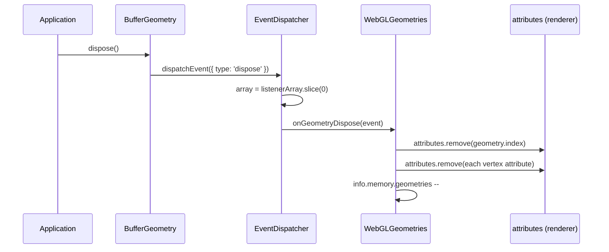

# [FEE-1810] Three.js — The Dispose Lifecycle Contract

:::info
Three.js leaves GPU-side cleanup to the application: each resource-owning class (geometry, material, texture, render target) exposes a `dispose()` that fires a single event, and renderer subsystems subscribe to that event to free the underlying WebGL handles. The universal scene-graph base `Object3D` has no `dispose()` because it owns no GPU resource — the contract is delegated downward. The transferable lesson is a pub-sub seam between "I'm done" and "free the buffer" that lets long-running interactive apps shed non-GC resources without coupling resource owners to the deallocator. This article reads the r172 source to make that contract explicit and names the pattern so it is recognisable in other codebases.
:::

## Context

Three.js does not free GPU-side resources automatically. The manual states it directly for buffer attributes: "These entities are only deleted if you call `BufferGeometry.dispose()`" ([three.js manual, "How to dispose of objects"](https://threejs.org/manual/en/how-to-dispose-of-objects.html)). The engine pushes responsibility onto the application, with per-class rules for geometries, materials, textures, and render targets.

The universal scene-graph base `Object3D` extends `EventDispatcher` and exposes hooks tied to rendering and shadows, but the file contains no `dispose` symbol at r172 ([`src/core/Object3D.js`](https://github.com/mrdoob/three.js/blob/r172/src/core/Object3D.js)). The base class owns position, rotation, parent/child links, and update callbacks; it owns no WebGL handle, so it has no teardown to run. Disposal is delegated to the subclasses that actually own a GPU resource.

That delegation is the architectural fact behind the contract this article describes. The rest of the article reads the r172 source to show how the pieces fit together, then names the pattern.

## Scenario

A WebGL gallery rotates through 3D models on a timer. Each rotation loads a new GLTF, swaps it into the scene, and removes the previous root with `scene.remove(oldRoot)`. After an hour the page tab grows from 200 MB to 1.4 GB and the GPU process eventually crashes. The author assumed `scene.remove` would also free buffers and textures; it does not. `scene.remove` only detaches the node from the scene graph, leaving every `BufferGeometry`, `Material`, and `Texture` it referenced still alive on the GPU side because nothing has called `dispose()` on them. The same shape recurs in scene-swapping editors and dashboards that reload data sources without tearing down the resources tied to the previous view.

## Best Practices

- **MUST** call `WebGLRenderTarget.dispose()` on every render target you allocate. Render targets create framebuffers and renderbuffers that no other dispose path collects: "These objects are only deallocated by executing `WebGLRenderTarget.dispose()`" ([three.js manual](https://threejs.org/manual/en/how-to-dispose-of-objects.html)).
- **MUST** treat textures as independently owned from materials. The manual is explicit: "The disposal of a material has no effect on textures. They are handled separately since a single texture can be used by multiple materials at the same time" ([three.js manual](https://threejs.org/manual/en/how-to-dispose-of-objects.html)). Disposing a material releases shader programs and uniform bindings; texture lifetime needs its own bookkeeping.
- **MUST** discard controls and the renderer after `dispose()` and construct fresh instances before reuse. The manual states: "Instances of these classes can not be used after `dispose()` has been called. You have to create new instances in this case" ([three.js manual](https://threejs.org/manual/en/how-to-dispose-of-objects.html)).
- **SHOULD** write an explicit recursive teardown when removing a subtree, because the framework does not walk the graph for you. The canonical idiom in user code is `scene.traverse(o => { o.geometry?.dispose(); /* dispose materials, with array handling */ })`. The renderer's own `dispose()` does not iterate user-owned objects (see Example), so the application owns the walk.
- **MAY** rely on `EventDispatcher` to attach your own cleanup listeners alongside the renderer's. Because dispatch snapshots the listener array (see Deep Dive), adding application-side listeners that themselves call `removeEventListener` is safe.

## Design Thinking

The contract trades an RAII-style auto-collection for an explicit pub-sub seam. The resource owner only knows it is "done"; the listener owns the actual GPU teardown. `EventDispatcher` is the primitive that carries the signal — `addEventListener`, `removeEventListener`, `dispatchEvent` ([`src/core/EventDispatcher.js`](https://github.com/mrdoob/three.js/blob/r172/src/core/EventDispatcher.js)) — and every resource class that exposes `dispose()` extends it.

The win from that decoupling: a different renderer (WebGPU, a software path, a test double) can attach a different listener to the same `'dispose'` event without changing `BufferGeometry`, `Material`, or `Texture`. The cost: the application has to remember to call `dispose()` and to walk subtrees itself, because the framework refuses to assume ownership of objects the user constructed. The article's scenario, a gallery that leaks until the GPU process dies, is the failure mode of choosing explicit teardown.

A second trade-off shows up in dispatch order. `dispatchEvent` snapshots the listener array before iterating ([`src/core/EventDispatcher.js`](https://github.com/mrdoob/three.js/blob/r172/src/core/EventDispatcher.js)), which makes "listener removes itself during dispatch" safe. That choice keeps the listener-side teardown idiom (`removeEventListener` inside the handler, then deallocate) free of iteration hazards, at the cost of allocating a slice on every dispatch.

## Deep Dive

The full chain for a geometry teardown at r172:

1. Application calls `geometry.dispose()`.
2. `BufferGeometry.dispose()` calls `this.dispatchEvent({ type: 'dispose' })` and returns ([`src/core/BufferGeometry.js`](https://github.com/mrdoob/three.js/blob/r172/src/core/BufferGeometry.js)).
3. `EventDispatcher.dispatchEvent` snapshots the listener array (`const array = listenerArray.slice( 0 );`) and invokes each listener ([`src/core/EventDispatcher.js`](https://github.com/mrdoob/three.js/blob/r172/src/core/EventDispatcher.js)).
4. The renderer-side listener `onGeometryDispose`, registered by `WebGLGeometries`, removes the index attribute, removes each vertex attribute, and decrements the geometry counter ([`src/renderers/webgl/WebGLGeometries.js`](https://github.com/mrdoob/three.js/blob/r172/src/renderers/webgl/WebGLGeometries.js)).

Textures and render targets follow the same shape, but `WebGLTextures` installs three separate `'dispose'` listeners — one for `Texture`, one for `WebGLRenderTarget`, and one for the depth texture attached to a render target ([`src/renderers/webgl/WebGLTextures.js`](https://github.com/mrdoob/three.js/blob/r172/src/renderers/webgl/WebGLTextures.js)). One module, three listener types, because a render target carries a colour texture and optionally a depth texture and each needs its own cleanup wiring.

Material teardown breaks the per-resource module pattern. There is no `WebGLMaterials.js` listener owner; instead the renderer wires it directly: `material.addEventListener( 'dispose', onMaterialDispose );` and `onMaterialDispose` calls `removeEventListener` and then `deallocateMaterial( material );` ([`src/renderers/WebGLRenderer.js`](https://github.com/mrdoob/three.js/blob/r172/src/renderers/WebGLRenderer.js)). The asymmetry is worth surfacing: when reading a codebase that uses this pattern, the listener-owning module is not always the per-resource module that shares the type's name. Searching for `addEventListener( 'dispose'` finds the wiring; searching by filename does not.

The self-removing listener idiom (`onMaterialDispose` removes itself before deallocating) is what makes the snapshot-before-iterate choice in `dispatchEvent` load-bearing. Without the slice, removing a listener from inside the dispatch loop would skip the next listener in the array.

## Visual



## Example

The geometry side of the chain is one method:

*Source: src/core/BufferGeometry.js (r172)*

```js
dispose() {

	this.dispatchEvent( { type: 'dispose' } );

}
```

`Material` and `Texture` are identical in shape. Both extend `EventDispatcher` ([`src/materials/Material.js`](https://github.com/mrdoob/three.js/blob/r172/src/materials/Material.js), [`src/textures/Texture.js`](https://github.com/mrdoob/three.js/blob/r172/src/textures/Texture.js)) and both define a one-line `dispose()` that fires `{ type: 'dispose' }`. None of the three does any GPU work directly.

The matching listener in the renderer is where the deallocation actually happens:

*Source: src/renderers/webgl/WebGLGeometries.js (r172)*

```js
function onGeometryDispose( event ) {

	const geometry = event.target;

	if ( geometry.index !== null ) {

		attributes.remove( geometry.index );

	}
```

Registration sits next to the function: `geometry.addEventListener( 'dispose', onGeometryDispose );` ([`src/renderers/webgl/WebGLGeometries.js`](https://github.com/mrdoob/three.js/blob/r172/src/renderers/webgl/WebGLGeometries.js)). The listener walks each vertex attribute, removes the wireframe attribute and binding state, and decrements the counter.

The renderer-level `dispose()` fans out to subsystems but does not touch user-owned objects:

*Source: src/renderers/WebGLRenderer.js (r172)*

```js
this.dispose = function () {

	canvas.removeEventListener( 'webglcontextlost', onContextLost, false );
	canvas.removeEventListener( 'webglcontextrestored', onContextRestore, false );
	canvas.removeEventListener( 'webglcontextcreationerror', onContextCreationError, false );

	background.dispose();
	renderLists.dispose();
```

It detaches DOM listeners and tells each subsystem to dispose itself. Geometries, materials, and textures are not iterated. The renderer fans out cleanup; it does not walk the scene graph.

That gap is what the canonical user-side idiom fills. It is application code, not framework code:

```js
// Application-level recursive teardown — not provided by Three.js
function disposeSubtree(root) {
  root.traverse((obj) => {
    obj.geometry?.dispose();
    const m = obj.material;
    if (Array.isArray(m)) {
      m.forEach((mat) => mat.dispose());
    } else {
      m?.dispose();
    }
  });
}
```

Readers writing a Three.js app are expected to own this walk themselves. There is no `Scene.disposeAll()` or recursive helper in the framework — the absence is deliberate, because the framework does not know which resources the application still wants to keep alive.

## The Dispose Lifecycle Contract

The pattern this article names is **The Dispose Lifecycle Contract**: a resource-owning class exposes a `dispose()` method whose only job is to fire a `'dispose'` event on a built-in `EventDispatcher`, and a separate renderer subsystem subscribes to that event and performs the real teardown. The universal base class (`Object3D`) deliberately omits `dispose()` because it owns no resource; the contract lives one layer down, attached to the classes that hold a GPU handle.

The contract has four moving parts:

1. **A `dispose()` method on resource-owning classes.** `BufferGeometry`, `Material`, `Texture`, `WebGLRenderTarget`. Each is a one-line `dispatchEvent` call.
2. **A separate listener that owns the actual cleanup work.** `WebGLGeometries`, `WebGLTextures`, and `WebGLRenderer` (for materials) wire `onXDispose` listeners that call `gl.deleteX` or remove cached attributes.
3. **Manual recursion in user code.** The framework does not walk the scene graph; the application writes `scene.traverse(...)` to fan out disposal across a subtree.
4. **A renderer-level `dispose()` that fans out to subsystems but does not iterate user-owned objects.** It tears down DOM listeners and asks each subsystem to dispose itself; geometries, materials, and textures are out of its scope.

Once the contract is named, it is recognisable in other codebases. A long-running app that owns non-GC resources (WebGL textures, audio buffers, web workers, ResizeObservers, IntersectionObservers, OffscreenCanvas, WebSocket connections, persistent `window`/`document` listeners) typically needs the same shape: a "done" signal from the resource owner, a subscriber that runs the actual teardown, and an application-owned walk because the library refuses to assume ownership of the tree.

**What to look for elsewhere:**

- A `dispose()` (or `destroy()`, `release()`, `close()`) method on resource-owning classes, with no equivalent on the universal base class.
- A separate listener or observer module — often named `<Subsystem>Disposer`, `<Resource>Manager`, or wired inline in a renderer/coordinator file — that owns the actual cleanup work; the listener-owning module is not always the per-resource module that shares the type's name.
- Manual recursion idioms in user code (`tree.traverse`, `forEachDescendant`, hand-rolled DFS) because the framework deliberately does not auto-walk.
- A top-level `dispose()` on the coordinator (renderer, app, root component) that fans out to subsystems but stops short of iterating user-constructed objects.
- The absence of `dispose()` on the universal base class as the architectural signal that ownership is delegated downward.

## Internal References

- [FEE-1800 Codebase Studies — Overview](/en/Codebase%20Studies/codebase-studies-overview)
- [FEE-501 Composition Patterns](/en/Component%20Architecture%20and%20Design%20Patterns/501) — abstract pattern background for pub-sub teardown signals; cross-link reciprocates Three.js's witness role.
- [FEE-506 Error Boundaries & Resilience](/en/Component%20Architecture%20and%20Design%20Patterns/506) — what happens when a teardown listener throws.

## References

- three.js authors, "How to dispose of objects," three.js manual (2025). https://threejs.org/manual/en/how-to-dispose-of-objects.html
- mrdoob et al., "Object3D.js," three.js r172 source (2025). https://github.com/mrdoob/three.js/blob/r172/src/core/Object3D.js
- mrdoob et al., "BufferGeometry.js," three.js r172 source (2025). https://github.com/mrdoob/three.js/blob/r172/src/core/BufferGeometry.js
- mrdoob et al., "Material.js," three.js r172 source (2025). https://github.com/mrdoob/three.js/blob/r172/src/materials/Material.js
- mrdoob et al., "Texture.js," three.js r172 source (2025). https://github.com/mrdoob/three.js/blob/r172/src/textures/Texture.js
- mrdoob et al., "EventDispatcher.js," three.js r172 source (2025). https://github.com/mrdoob/three.js/blob/r172/src/core/EventDispatcher.js
- mrdoob et al., "WebGLRenderer.js," three.js r172 source (2025). https://github.com/mrdoob/three.js/blob/r172/src/renderers/WebGLRenderer.js
- mrdoob et al., "WebGLGeometries.js," three.js r172 source (2025). https://github.com/mrdoob/three.js/blob/r172/src/renderers/webgl/WebGLGeometries.js
- mrdoob et al., "WebGLTextures.js," three.js r172 source (2025). https://github.com/mrdoob/three.js/blob/r172/src/renderers/webgl/WebGLTextures.js
- mrdoob et al., "three.js r172 release tag," GitHub (2025). https://github.com/mrdoob/three.js/releases/tag/r172
