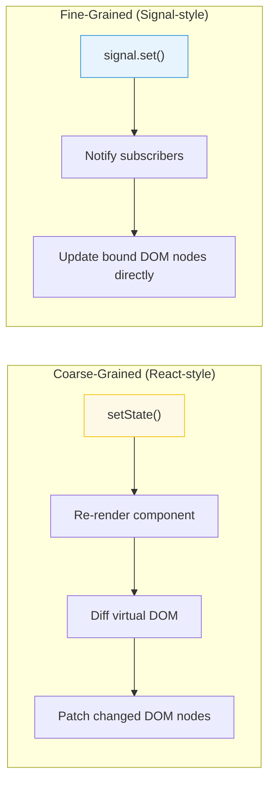

# [FEE-502] Reactive State & Signals

:::info
Reactivity is the mechanism by which UI components automatically update when their underlying data changes. Signals are a modern primitive for fine-grained reactivity that is gaining adoption across frameworks.
:::

## Context

Every frontend framework solves the same fundamental problem: when data changes, the UI must update. The approaches vary -- React re-renders entire component subtrees, Vue uses a proxy-based dependency tracking system, Svelte compiles reactivity into direct DOM updates, and Solid uses signals for fine-grained updates. Understanding the reactivity model matters because it determines performance characteristics, debugging strategies, and architectural patterns.

## Principle

Engineers MUST understand the reactivity model of their chosen framework -- specifically, what triggers an update, what scope is re-evaluated, and how to avoid unnecessary work.

Engineers SHOULD understand the spectrum from coarse-grained to fine-grained reactivity:

- **Coarse-grained** (React): State change re-renders the entire component subtree. Developer uses memoization (`useMemo`, `React.memo`) to prune unnecessary re-renders.
- **Fine-grained** (Signals, Solid, Vue): Only the specific DOM nodes that depend on the changed value update. No diffing needed.

Engineers SHOULD prefer explicit, traceable data flow. Reactivity that is invisible (e.g., deep proxy observation on nested objects) can make debugging harder. Signals make dependencies explicit.

## Best Practices

**MUST keep signal granularity at the level of independent updates.** Each signal SHOULD represent one piece of state that can change independently. A single large state object in one signal forces all subscribers to re-run whenever any field changes, even if the consuming component only reads one field. Split by change frequency and consumer scope: a `userName` signal and a `userAvatarUrl` signal update independently; a single `user` signal couples them.

**SHOULD prefer computed/derived values over duplicating state in effects.** When value B is a pure function of value A, express it as a `computed` (or equivalent: `createMemo`, Vue `computed`) rather than an effect that writes to a second signal. Computed values are memoized, re-evaluated only when their dependencies change, and never go out of sync. An effect that synchronizes state introduces an extra render cycle, can produce glitches between the write and the next read, and creates two sources of truth that must be kept consistent manually.

**SHOULD use effects sparingly — effects should respond to state, not drive it.** Effects (Preact's `effect()`, SolidJS's `createEffect`, Vue's `watchEffect`) are the correct tool for synchronizing to the outside world: persisting to `localStorage`, firing analytics events, updating the DOM directly. They are the wrong tool for deriving new values from existing signals — that is the job of computed. A codebase where effects drive most state transitions is harder to reason about because execution order and re-run cycles are implicit.

**AVOID creating signals inside effects or computed functions.** A signal created inside an effect is a new subscription point that is not part of the stable reactive graph. If the effect re-runs (because its own dependencies changed), the inner signal is re-created, losing any accumulated state and creating memory leaks from orphaned subscriptions. Define signals at the component or module scope; read and write them inside effects and computed.

## Visual



## Example

**Signal pattern (framework-agnostic):**

```js
// A signal holds a value and tracks its dependents
function createSignal(initialValue) {
  let value = initialValue;
  const subscribers = new Set();

  function get() {
    // Track: if called inside a computed/effect, register dependency
    if (currentObserver) subscribers.add(currentObserver);
    return value;
  }

  function set(newValue) {
    if (newValue === value) return; // Skip if no change
    value = newValue;
    // Notify: re-run all dependents
    for (const sub of subscribers) sub();
  }

  return [get, set];
}

const [count, setCount] = createSignal(0);
// Reading count() inside an effect auto-subscribes
// Calling setCount(1) auto-notifies subscribers
```

**Derived/computed state:**

```js
// A computed value derives from other signals
function createComputed(fn) {
  const [get, set] = createSignal(fn());

  // Re-run fn whenever its signal dependencies change
  createEffect(() => set(fn()));

  return get;
}

const [firstName, setFirstName] = createSignal('Alive');
const [lastName, setLastName] = createSignal('Kuo');
const fullName = createComputed(() => `${firstName()} ${lastName()}`);

fullName(); // "Alive Kuo"
setFirstName('John');
fullName(); // "John Kuo" -- automatically updated
```

## Deep Dive

### How signal dependency tracking works

When a computed value or effect is evaluated, the runtime sets a global "current observer" variable to the current computation. Every signal's `get()` function checks this variable: if a current observer is active, the signal adds it to its subscriber set. When the computation finishes, the runtime clears the current observer. The result is a fully automatic, synchronous dependency graph built during the first evaluation — no explicit dependency arrays, no subscription calls.

This mechanism has one important property: dependencies are **discovered dynamically**, not declared statically. If a computed reads `signalA` only when `condition` is `true`, and `condition` is `false` on the first evaluation, then `signalA` is not in the dependency set — the computed will not re-run when `signalA` changes. This is correct behavior (the computed does not depend on `signalA` in that branch) but it surprises engineers accustomed to React's `useEffect` dependency arrays, where all referenced values must be listed regardless of control flow.

The TC39 Signals proposal adds glitch-free topological evaluation on top of this model: before re-running any subscriber, the runtime performs a topological sort of the dirty graph to ensure that each computed is re-evaluated at most once per update cycle, and always before any subscriber that depends on it reads its value. This prevents the "diamond problem" where two separate paths from a root signal converge on a single computed and could otherwise cause it to read a stale intermediate value.

Practically: reading a signal value outside any reactive context (inside an event handler, inside a `setTimeout`, at module initialization time) does not register a dependency — it simply returns the current value. Only reads that occur during a tracked computation (a computed or effect execution) create subscriptions.

## Common Mistakes

**Triggering unnecessary re-renders (coarse-grained).** In React, creating new objects or arrays in render (`style` with inline objects, `items.filter(...)`) creates new references every render, defeating `React.memo`. Memoize or hoist stable references.

**Mutating state instead of replacing it.** Most reactivity systems detect changes by reference comparison. Mutating an object (`state.items.push(x)`) does not trigger an update in React or signals. Create a new reference: `setItems([...items, x])`.

**Over-subscribing to global state.** Reading a large global store in many components means every store change re-notifies all of them. Derive the minimal slice each component needs. Signals naturally solve this -- each signal is its own subscription point.

**Ignoring the reactivity model during debugging.** When the UI does not update as expected, the first question is: "Does the reactivity system know this value changed?" Check whether you triggered the correct setter, whether the reference actually changed, and whether the component is subscribed to that specific piece of state.

## Related FEEs

- [FEE-500](500.md) Component Architecture & Design Patterns Overview
- [FEE-501](501.md) Component Composition Patterns
- [FEE-600](../State%20Management/600.md) State Management Overview
- [FEE-301](../JavaScript%20Core%20and%20Runtime/301.md) Event Loop & Async Model

## References

- [TC39 Signals Proposal](https://github.com/tc39/proposal-signals)
- [Solid.js: Reactivity](https://www.solidjs.com/guides/reactivity)
- [Vue.js: Reactivity in Depth](https://vuejs.org/guide/extras/reactivity-in-depth.html)
- [Preact Signals](https://preactjs.com/guide/v10/signals/)
- [Ryan Carniato: A Hands-on Introduction to Fine-Grained Reactivity](https://dev.to/ryansolid/a-hands-on-introduction-to-fine-grained-reactivity-3ndf)
