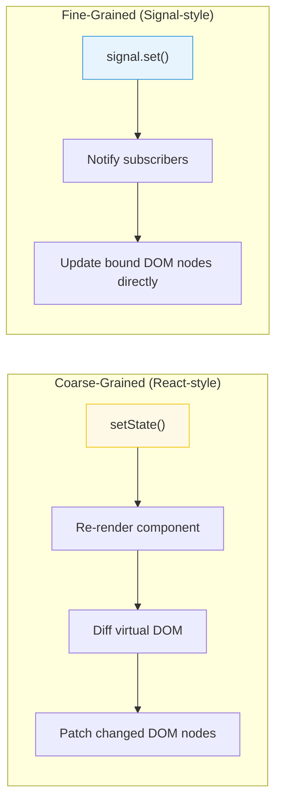

# [FEE-502] Reactive State & Signals

:::info
Reactivity is the mechanism by which UI components automatically update when their underlying data changes. Signals are a modern primitive for fine-grained reactivity that is gaining adoption across frameworks.
:::

## Context

Every frontend framework solves the same fundamental problem: when data changes, the UI must update. The approaches vary -- React re-renders entire component subtrees, Vue uses a proxy-based dependency tracking system, Svelte compiles reactivity into direct DOM updates, and Solid uses signals for fine-grained updates. Understanding the reactivity model matters because it determines performance characteristics, debugging strategies, and architectural patterns.

## Design Thinking

### Understanding what triggers a re-render

Every reactivity system has a trigger model — the specific conditions that cause a computation
or component to re-run. In React, any call to a state setter schedules a re-render of that
component and all of its descendants unless memoization intervenes. In Vue, reading a reactive
property inside a component's render function registers a dependency, and writing to that
property schedules only the components whose render functions read it. In Solid and other
signal-based systems, subscriptions are established at the signal level: only the exact
computation or DOM binding that read the signal during its last execution is re-run when the
signal changes.

The practical consequence is that the same application logic behaves differently across
frameworks, and the same performance mistake has different symptoms. In React, passing a new
object reference as a prop on every render causes the child to re-render even when the data
is identical in value — because React compares by reference. In Vue, reading a deeply nested
reactive property from a `reactive()` object registers a dependency on the full path; mutating
a sibling path still notifies the component. In Solid, reading the same signal twice inside
a computation is still a single subscription — the runtime deduplicates.

Understanding which operations create subscriptions and which operations notify subscribers is
the foundational knowledge that separates engineers who can reason about reactivity from those
who are surprised by it. Before adding memoization, profiling for unnecessary renders, or
choosing between a signal and a store, the underlying question is always: "What does this
framework consider to be a change, and which computations does it consider to depend on that
value?"

### Coarse-grained vs. fine-grained reactivity

The spectrum from coarse-grained to fine-grained reactivity describes how precisely a system
identifies which parts of the UI depend on which pieces of state.

**Coarse-grained reactivity** (React) treats the component as the unit of re-evaluation.
When state changes, the component function re-runs from top to bottom, producing a new virtual
DOM tree. The runtime compares the new tree against the previous tree (reconciliation) and
applies the diff to the real DOM. This model is conceptually simple — the component is just a
function from state to UI — but it means that every render includes work proportional to the
output of the component, not to the size of the change. Large component trees benefit from
memoization (`React.memo`, `useMemo`, `useCallback`) to prune subtrees that did not actually
change. The developer is responsible for specifying which props and computed values should be
stable.

**Fine-grained reactivity** (Solid, Preact Signals, Vue's Composition API) treats individual
reactive values as the unit of subscription. A signal read inside a DOM binding — for example,
an attribute or text node — creates a direct subscription between that DOM node and the signal.
When the signal changes, only that DOM node updates; no component re-runs, no virtual DOM
diffing, no tree traversal. The update is proportionally cheap: if one counter out of a
thousand changes, exactly one text node updates. The developer writes logic once, and the
runtime builds the dependency graph automatically during the first evaluation.

The trade-off is not that one model is better than the other for all applications. Coarse-
grained reactivity is easier to reason about for developers familiar with functional components
and is well-supported by React's ecosystem. Fine-grained reactivity provides inherently lower
update cost for highly dynamic UIs and avoids the need for manual memoization annotations. The
engineering decision is to choose the model appropriate for the application's update
characteristics and the team's existing expertise.

### Explicit vs. implicit dependency tracking

A key dimension of reactivity design is whether dependencies are declared explicitly or
discovered implicitly. React's `useEffect` and `useMemo` require explicit dependency arrays:
every value read inside the hook must be listed in the array, or the hook will operate on a
stale closure. This explicitness is a design choice — it gives the linter (`react-hooks/
exhaustive-deps`) the information needed to warn about incorrect arrays, and it makes the
dependency scope visible in the code. The trade-off is that developers must maintain these
arrays correctly; an omitted dependency is a bug that is not always obvious.

Signal-based systems discover dependencies implicitly during execution. When a computed
function runs, every signal it reads is automatically added to its dependency set. No array
is maintained. When the function runs again — because a dependency changed — it rebuilds its
dependency set from scratch, which means conditional reads are handled correctly: if a signal
is read only in one branch, it is a dependency only when that branch executes.

Explicit dependency declaration and implicit dependency tracking each have debugging
implications. With explicit arrays, a stale-closure bug is caused by a missing dependency
and is caught by the linter. With implicit tracking, a missing-update bug is caused by a read
that did not occur inside a tracked context — reading a signal inside a `setTimeout` or an
untracked event handler — and requires understanding the runtime's tracking semantics to
diagnose. Neither model eliminates bugs; each produces a different category of mistake that
requires familiarity with the model to identify quickly.

### When to choose signals vs. component state

The decision between using a signal and using component-local state (e.g., React's `useState`)
centers on two factors: the scope of consumers and the update granularity required.

Component-local state is the correct choice when the state is used only inside a single
component and its direct children. React's `useState` or Solid's `createSignal` at the
component level both satisfy this. The state is co-located with the component that owns it,
unmounts with the component, and requires no global coordination. For the vast majority of UI
state — whether a dropdown is open, what text is in a search input, which tab is selected —
component-local state is the right model and signals do not add value.

A signal at the module or global scope — outside any component — is the appropriate choice
when multiple unrelated parts of the component tree need to read and react to the same value
without prop drilling or context overhead. In Solid, a module-level signal is a valid
alternative to a global store for simple shared values. In React with the `@preact/signals-react`
integration, a global signal can be read inside any component without subscribing the entire
component to re-render — only the specific DOM binding that reads the signal updates. This
makes module-level signals a useful tool for high-frequency state like a cursor position or
a live timer that updates many times per second.

The risk of module-level signals is that they are effectively global mutable state, which
makes testing harder and can introduce unintended coupling between features. A module-level
signal that is read by many components is a shared dependency; its value at any given moment
reflects a global program state rather than a component-specific state. Teams SHOULD document
which module-level signals exist, what invariants govern their values, and which parts of the
application are permitted to write to them.

### The TC39 Signals proposal and convergence

A notable development is the TC39 Signals proposal, which aims to standardize a primitive `Signal` type as part of JavaScript itself. The proposal-level treatment — history of reactive JavaScript, the glitch-free evaluation algorithm, the cross-framework committee, and the polyfill integration recipe — lives at [FEE-10005](../Web%20Platform%20Proposals/TC39%20and%20JS%20Proposals/10005.md). For component-architecture purposes the takeaway is that fine-grained reactivity via signals is a durable cross-framework direction. Patterns covered in this article — computed values, conditional subscriptions, effect boundaries — appear in every signal-based framework, regardless of which one a team adopts.

### Traceability and reactivity opacity

Reactivity that is invisible makes debugging harder. When a Vue `reactive()` object uses deep
proxy observation on nested objects, any mutation anywhere in the object tree triggers an
update. This is powerful but opaque: a developer looking at a component that re-renders
unexpectedly must trace which property of a potentially large object changed and which
component was subscribed to it. The update mechanism is automatic and complete, but the causal
chain from mutation to re-render is not visible in the code.

Signals make the causal chain explicit. Each signal is a named, typed value; subscribing to
a signal requires reading it inside a tracked context; and the subscriber list is a direct
function of which signals each computation reads. When a component re-renders unexpectedly,
the question is: "Which signal changed?" — an answer that can be found by inspecting the
signal's value and its write call sites. This traceability reduces the debugging surface when
something goes wrong.

The practical guideline is to prefer reactivity mechanisms where the dependency graph is
legible from the code itself. Fine-grained signals with named values and explicit reads
are more traceable than opaque deep-proxy observation on large nested objects. When the
framework does not offer an alternative to deep observation, the mitigation is to keep
reactive objects shallow and split large state into multiple independently named signals or
refs rather than nesting everything into a single reactive tree.

When debugging a missing update or an unexpected re-render, the first diagnostic question is
whether the reactive system was notified of the change at all. In signal systems, this means
verifying that the mutation went through the signal setter rather than directly modifying the
underlying value. In proxy-based systems, it means verifying that the mutation occurred on
the reactive proxy object rather than on a detached reference. In both cases, the debugging
path starts with understanding the framework's specific trigger model — a prerequisite to
effective diagnosis regardless of which reactive mechanism the application uses.

## Best Practices

**MUST keep signal granularity at the level of independent updates.** Each signal SHOULD represent one piece of state that can change independently. A single large state object in one signal forces all subscribers to re-run whenever any field changes, even if the consuming component only reads one field. Split by change frequency and consumer scope: a `userName` signal and a `userAvatarUrl` signal update independently; a single `user` signal couples them.

**SHOULD prefer computed/derived values over duplicating state in effects.** When value B is a pure function of value A, express it as a `computed` (or equivalent: `createMemo`, Vue `computed`) rather than an effect that writes to a second signal. Computed values are memoized, re-evaluated only when their dependencies change, and never go out of sync. An effect that synchronizes state introduces an extra render cycle, can produce glitches between the write and the next read, and creates two sources of truth that must be kept consistent manually.

**SHOULD use effects sparingly — effects should respond to state, not drive it.** Effects (Preact's `effect()`, SolidJS's `createEffect`, Vue's `watchEffect`) are the correct tool for synchronizing to the outside world: persisting to `localStorage`, firing analytics events, updating the DOM directly. They are the wrong tool for deriving new values from existing signals — that is the job of computed. A codebase where effects drive most state transitions is harder to reason about because execution order and re-run cycles are implicit.

**SHOULD prefer explicit, traceable data flow over opaque reactivity.** When a framework provides both a deep-proxy reactive object (e.g., Vue's `reactive()` on a nested object) and individual named reactive primitives (signals, `ref()`), prefer the named primitives for state that has distinct consumers. Named primitives make the dependency graph legible — each consumer's subscriptions are visible from the code — while deep-proxy observation on large nested objects can trigger unexpected re-renders that are difficult to trace without runtime tooling.

**AVOID creating signals inside effects or computed functions.** A signal created inside an effect is a new subscription point that is not part of the stable reactive graph. If the effect re-runs (because its own dependencies changed), the inner signal is re-created, losing any accumulated state and creating memory leaks from orphaned subscriptions. Define signals at the component or module scope; read and write them inside effects and computed.

## Visual



## Example

**Signal pattern (framework-agnostic):**

```js
// A signal holds a value and tracks its dependents
function createSignal(initialValue) {
  let value = initialValue;
  const subscribers = new Set();

  function get() {
    // Track: if called inside a computed/effect, register dependency
    if (currentObserver) subscribers.add(currentObserver);
    return value;
  }

  function set(newValue) {
    if (newValue === value) return; // Skip if no change
    value = newValue;
    // Notify: re-run all dependents
    for (const sub of subscribers) sub();
  }

  return [get, set];
}

const [count, setCount] = createSignal(0);
// Reading count() inside an effect auto-subscribes
// Calling setCount(1) auto-notifies subscribers
```

**Derived/computed state:**

```js
// A computed value derives from other signals
function createComputed(fn) {
  const [get, set] = createSignal(fn());

  // Re-run fn whenever its signal dependencies change
  createEffect(() => set(fn()));

  return get;
}

const [firstName, setFirstName] = createSignal('Alive');
const [lastName, setLastName] = createSignal('Kuo');
const fullName = createComputed(() => `${firstName()} ${lastName()}`);

fullName(); // "Alive Kuo"
setFirstName('John');
fullName(); // "John Kuo" -- automatically updated
```

## Deep Dive

### How signal dependency tracking works

When a computed value or effect is evaluated, the runtime sets a global "current observer" variable to the current computation. Every signal's `get()` function checks this variable: if a current observer is active, the signal adds it to its subscriber set. When the computation finishes, the runtime clears the current observer. The result is a fully automatic, synchronous dependency graph built during the first evaluation — no explicit dependency arrays, no subscription calls.

This mechanism has one important property: dependencies are **discovered dynamically**, not declared statically. If a computed reads `signalA` only when `condition` is `true`, and `condition` is `false` on the first evaluation, then `signalA` is not in the dependency set — the computed will not re-run when `signalA` changes. This is correct behavior (the computed does not depend on `signalA` in that branch) but it surprises engineers accustomed to React's `useEffect` dependency arrays, where all referenced values must be listed regardless of control flow.

The TC39 Signals proposal adds glitch-free topological evaluation on top of this model: before re-running any subscriber, the runtime performs a topological sort of the dirty graph to ensure that each computed is re-evaluated at most once per update cycle, and always before any subscriber that depends on it reads its value. This prevents the "diamond problem" where two separate paths from a root signal converge on a single computed and could otherwise cause it to read a stale intermediate value.

Practically: reading a signal value outside any reactive context (inside an event handler, inside a `setTimeout`, at module initialization time) does not register a dependency — it simply returns the current value. Only reads that occur during a tracked computation (a computed or effect execution) create subscriptions.

## Common Mistakes

**Triggering unnecessary re-renders (coarse-grained).** In React, creating new objects or arrays in render (`style` with inline objects, `items.filter(...)`) creates new references every render, defeating `React.memo`. Memoize or hoist stable references.

**Mutating state instead of replacing it.** Most reactivity systems detect changes by reference comparison. Mutating an object (`state.items.push(x)`) does not trigger an update in React or signals. Create a new reference: `setItems([...items, x])`.

**Over-subscribing to global state.** Reading a large global store in many components means every store change re-notifies all of them. Derive the minimal slice each component needs. Signals naturally solve this -- each signal is its own subscription point.

**Ignoring the reactivity model during debugging.** When the UI does not update as expected, the first question is: "Does the reactivity system know this value changed?" Check whether you triggered the correct setter, whether the reference actually changed, and whether the component is subscribed to that specific piece of state.

## Related FEEs

- [FEE-500](500.md) Component Architecture & Design Patterns Overview
- [FEE-501](501.md) Component Composition Patterns
- [FEE-600](../State%20Management/600.md) State Management Overview
- [FEE-301](../JavaScript%20Core%20and%20Runtime/301.md) Event Loop & Async Model

## References

- [TC39 Signals Proposal](https://github.com/tc39/proposal-signals)
- [Solid.js: Reactivity](https://www.solidjs.com/guides/reactivity)
- [Vue.js: Reactivity in Depth](https://vuejs.org/guide/extras/reactivity-in-depth.html)
- [Preact Signals](https://preactjs.com/guide/v10/signals/)
- [Ryan Carniato: A Hands-on Introduction to Fine-Grained Reactivity](https://dev.to/ryansolid/a-hands-on-introduction-to-fine-grained-reactivity-3ndf)
- [TC39 Signals Proposal README](https://github.com/tc39/proposal-signals#readme) — detailed rationale for standardizing signals, including the glitch-free evaluation algorithm and framework interoperability goals
