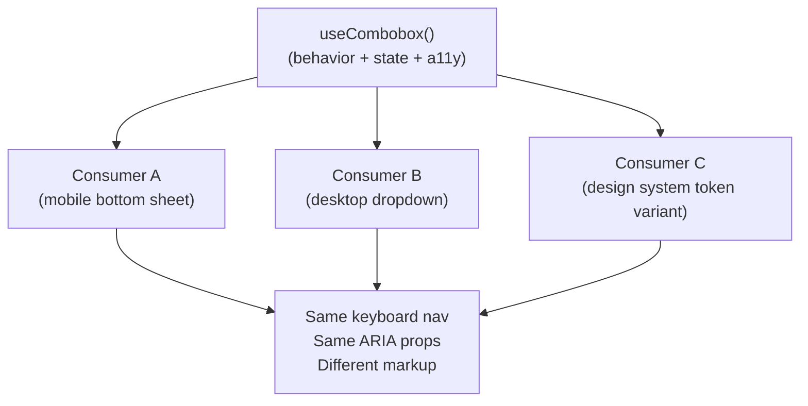

# [FEE-503] Headless Components & Renderless Patterns

:::info
A headless component provides behavior, state, and accessibility wiring without any visual output. The consumer owns every pixel. This separation makes the same interaction logic reusable across radically different visual contexts without copying a line of logic.
:::

## Introduction

UI components conflate two fundamentally different concerns: what a component _does_ and what it _looks like_. A dropdown must trap focus, manage ARIA attributes, respond to keyboard events, and handle open/close state — none of which has anything to do with whether the trigger is a button, a chip, or a text input, or whether the list floats above or anchors to a bottom sheet. When those two concerns live in the same file, every team that needs a visually distinct variant must either fork the component (duplicating all the logic and inevitably diverging on accessibility) or bolt on a cascade of props until the component becomes unworkable.

The headless pattern resolves this by splitting the component along that seam. The headless layer holds all behavior: event handlers, state transitions, keyboard navigation, ARIA attributes, and focus management. The rendering layer holds nothing but markup and styles. The two connect through a well-defined interface — a props bag returned by a hook, or a scoped slot in a renderless component. Either way, the consumer is in full control of the DOM.

This is not a new idea. The render props pattern that Kent C. Dodds popularized in 2018, the compound components that Ryan Florence used in Reach UI, and the `v-slot` scoped-slot pattern Adam Wathan described for Vue all aim at the same abstraction. What changed is that React hooks and the Vue Composition API made the hook-based form far more ergonomic than render props, and that form — returning a props bag from a function — is now the dominant idiom. The renderless component form (a component that renders only a `<slot>`) remains the Vue-native alternative when you prefer the component mental model over a function call.

## Principle

A headless component MUST NOT embed `className`, inline styles, DOM element choices, or layout-specific markup. Doing so defeats the abstraction contract: the moment the headless layer assumes it will render an `<ul>`, any consumer that needs a `<div>`-based scroll container must fight the assumption. The headless layer's only output surface is behavior and state.

Teams MUST keep all ARIA attribute production inside the headless layer. Omitting ARIA from the contract forces every consumer to re-implement keyboard navigation and screen reader semantics independently, reintroducing the bugs the headless layer was designed to centralize. Every prop factory the hook returns SHOULD carry the correct ARIA role, `aria-*` attributes, and event handlers pre-wired.

Teams SHOULD reach for the headless pattern when the same interaction logic must serve three or more visual contexts, or when building a component library where consumers control all styling. A component that appears in exactly one visual form in a single application does not need a headless layer — the abstraction cost is real and the benefit is zero.

Teams MUST NOT over-abstract. A `<Button>` that always looks the same across an entire product is not a headless candidate. Premature headless extraction creates indirection with no payoff.

## Design Thinking

The central question when evaluating the headless pattern is whether visual variation is a first-class concern. If two engineers on the same team are independently building the same combobox — one for a mobile bottom sheet, one for a desktop typeahead — the headless pattern is the obvious tool: extract the logic once, let both engineers render their own markup. If the same component will always look identical and live in one context, a well-composed regular component is simpler and preferable.

A second axis is library vs. product. When you are building a component library for external consumers or for multiple product teams, you have almost no control over visual requirements. External consumers will always have a design system that conflicts with your defaults. Building headless from the start eliminates the conflict: you ship behavior, they ship pixels. When building an internal CRUD admin panel used by one team, the styling surface is controlled, and headless adds complexity with no return.

The third axis is whether you need testability in isolation. A hook that returns a props bag is a plain function — it can be unit tested without mounting any DOM. A renderless component requires at least a stub consumer to verify behavior. This makes the hook form slightly more testable, though both are far easier to test than a full component that mixes behavior with rendering.

**Decision table:**

| Scenario | Reach for headless | Reach for regular component |
|---|---|---|
| Same behavior, 3+ visual variants | Yes | No |
| Single app, one consistent visual style | No | Yes |
| Building a design system for external consumers | Yes | No |
| Internal CRUD table in a single product | No | Yes |
| Logic complex enough to unit test in isolation | Yes | Consider |
| Simple stateless presentational UI | No | Yes |

The two modern idioms solve the same problem differently:

- **Hook-based (prop factories)** — A function returns a props bag. The consumer spreads props onto its own elements. This is the React and Vue composable idiom. Flat, functional, tree-shakeable, and easy to compose with other hooks.
- **Renderless component (slot-only)** — A component renders nothing except a `<slot>` (or `<slot v-bind="...">` in Vue). The consumer provides the entire template via slot content. This is the Vue-native idiom and maps naturally to the component mental model for teams who think in components rather than functions.

## Best Practices

**Return prop factories, not props directly.** A prop factory is a function (`getItemProps`, `getInputProps`) that the consumer calls per-element. This lets the hook inject its own event handlers and ARIA attributes while the consumer augments with its own. If the hook returns a static object, the consumer must manually merge handlers, and conflicts arise. Prop factories make merging explicit and safe.

**Wire ARIA inside the hook, not in the consumer.** The consumer's job is markup and styles. ARIA roles, `aria-expanded`, `aria-haspopup`, `aria-controls`, `aria-activedescendant`, and keyboard handlers are behavior — they belong in the headless layer. Every consumer inherits correct semantics by default, not by convention.

**Type the prop bag.** Return types on the hook are the headless API contract. Strict TypeScript types catch misuse at compile time and serve as living documentation. Prop factories should have typed parameters so consumers cannot accidentally pass the wrong item type to `getItemProps`.

**Keep hook composition flat.** A combobox hook can be built from a smaller `useDisclosure` hook (open/close) and a `useListNavigation` hook (keyboard nav). Compose at the hook level, not inside a monolithic function. This keeps each hook testable in isolation and lets consumers use sub-hooks directly when they need partial behavior.

**Expose raw state alongside prop factories.** The consumer often needs to read `isOpen` or `activeIndex` to conditionally render transitions, badges, or tooltips outside the immediate combobox DOM. Expose these as plain values alongside the prop factories.

**In Vue, prefer composables over renderless components.** The Vue documentation and community consensus favor composable functions over renderless components for new work: composables are more performant (no extra component instance), easier to unit test, and compose cleanly with the Options API or Composition API. Reserve the renderless component form for cases where the consumer team thinks in component trees and finds function calls unfamiliar.

**Do not return JSX from hooks.** A hook that returns `<li>{item.label}</li>` is no longer headless — it is a rendering helper with styling assumptions baked in. Return state and event handler functions. The consumer assembles the markup.

## Diagram



The hook sits at the center. Each consumer is a thin rendering layer — different markup, different class names, different DOM structure — but all three share identical keyboard behavior and ARIA semantics. A bug fix or ARIA improvement in `useCombobox` propagates to all three consumers automatically.

## Example

The following example shows a `useCombobox` hook returning prop factories, followed by two consumers that render visually different comboboxes using the same hook.

**The headless hook — `src/hooks/useCombobox.ts`:**

```tsx
// src/hooks/useCombobox.ts
import { useState } from 'react';

interface ComboboxItem {
  id: string;
  label: string;
}

interface UseComboboxOptions<T extends ComboboxItem> {
  items: T[];
  onSelect: (item: T) => void;
}

export function useCombobox<T extends ComboboxItem>({
  items,
  onSelect,
}: UseComboboxOptions<T>) {
  const [isOpen, setIsOpen] = useState(false);
  const [query, setQuery] = useState('');

  const filtered = items.filter((i) =>
    i.label.toLowerCase().includes(query.toLowerCase())
  );

  return {
    // Prop factory for the <input> element
    inputProps: {
      value: query,
      onChange: (e: React.ChangeEvent<HTMLInputElement>) =>
        setQuery(e.target.value),
      onFocus: () => setIsOpen(true),
      onBlur: () => setTimeout(() => setIsOpen(false), 150),
      role: 'combobox' as const,
      'aria-haspopup': 'listbox' as const,
      'aria-expanded': isOpen,
      'aria-autocomplete': 'list' as const,
    },
    // Prop factory for the <ul>/<ol> list container
    listProps: {
      role: 'listbox' as const,
      hidden: !isOpen,
    },
    // Filtered items — the consumer decides how to render each one
    items: filtered,
    // Raw state — consumers use this for conditional rendering
    isOpen,
    // Per-item prop factory
    getItemProps: (item: T) => ({
      role: 'option' as const,
      // Note: React strips `key` from spread props — consumers must apply key separately:
      // <li key={item.id} {...getItemProps(item)}>
      onClick: () => {
        onSelect(item);
        setQuery(item.label);
        setIsOpen(false);
      },
    }),
  };
}
```

The hook never imports a CSS file, references a class name, or decides which HTML element to render. Every ARIA attribute and event handler lives inside the hook. The return shape is the public API.

**Consumer A — desktop dropdown (`src/components/DesktopCombobox.tsx`):**

```tsx
// Consumer owns all rendering — the hook owns all behavior
import { useCombobox } from '../hooks/useCombobox';

export function DesktopCombobox({ items, onSelect }) {
  const {
    inputProps,
    listProps,
    items: filtered,
    getItemProps,
  } = useCombobox({ items, onSelect });

  return (
    <div className="relative">
      <input
        {...inputProps}
        className="border rounded px-3 py-2 w-full focus:outline-none focus:ring-2 focus:ring-blue-500"
        placeholder="Search..."
      />
      <ul
        {...listProps}
        className="absolute z-10 bg-white border rounded shadow-lg mt-1 w-full max-h-60 overflow-auto"
      >
        {filtered.map((item) => (
          <li
            key={item.id}
            {...getItemProps(item)}
            className="px-3 py-2 hover:bg-gray-100 cursor-pointer text-sm"
          >
            {item.label}
          </li>
        ))}
      </ul>
    </div>
  );
}
```

**Consumer B — mobile bottom sheet (`src/components/MobileCombobox.tsx`):**

```tsx
// Completely different markup, identical behavior
import { useCombobox } from '../hooks/useCombobox';

export function MobileCombobox({ items, onSelect, title }) {
  const {
    inputProps,
    listProps,
    items: filtered,
    isOpen,
    getItemProps,
  } = useCombobox({ items, onSelect });

  return (
    <div>
      <input
        {...inputProps}
        className="w-full text-lg border-b border-gray-300 py-3 px-4 focus:outline-none"
        placeholder={`Search ${title}...`}
      />
      {/* Bottom sheet — appears from bottom on mobile */}
      {isOpen && (
        <div className="fixed inset-x-0 bottom-0 bg-white rounded-t-2xl shadow-2xl max-h-[60vh] overflow-hidden">
          <div className="px-4 py-2 text-xs font-semibold text-gray-400 uppercase tracking-wide">
            {title}
          </div>
          <ul {...listProps} className="overflow-auto">
            {filtered.map((item) => (
              <li
                key={item.id}
                {...getItemProps(item)}
                className="flex items-center px-4 py-4 border-b border-gray-100 text-base active:bg-gray-50"
              >
                {item.label}
              </li>
            ))}
          </ul>
        </div>
      )}
    </div>
  );
}
```

Consumer A renders a standard floating dropdown anchored below the input. Consumer B renders a bottom sheet that covers 60% of the viewport height. Both spread the same `inputProps`, `listProps`, and `getItemProps` — so both get identical keyboard behavior, `role="combobox"`, `aria-expanded`, and `aria-haspopup` with zero duplication.

**Vue composable equivalent (`src/composables/useCombobox.ts`):**

```ts
// The Vue composable idiom — same contract, Vue Composition API
import { ref, computed } from 'vue';

interface ComboboxItem {
  id: string;
  label: string;
}

export function useCombobox<T extends ComboboxItem>(
  items: T[],
  onSelect: (item: T) => void,
) {
  const query = ref('');
  const isOpen = ref(false);

  const filtered = computed(() =>
    items.filter((i) =>
      i.label.toLowerCase().includes(query.value.toLowerCase())
    )
  );

  function open() { isOpen.value = true; }
  function close() { setTimeout(() => { isOpen.value = false; }, 150); }
  function select(item: T) {
    onSelect(item);
    query.value = item.label;
    isOpen.value = false;
  }

  return {
    query,
    isOpen,
    filtered,
    inputProps: computed(() => ({
      value: query.value,
      onInput: (e: Event) => { query.value = (e.target as HTMLInputElement).value; },
      onFocus: open,
      onBlur: close,
      role: 'combobox',
      'aria-haspopup': 'listbox',
      'aria-expanded': isOpen.value,
      'aria-autocomplete': 'list',
    })),
    listProps: computed(() => ({
      role: 'listbox',
    })),
    getItemProps: (item: T) => ({
      role: 'option',
      onClick: () => select(item),
    }),
  };
}
```

The Vue consumer calls `useCombobox()` in `setup()` and spreads the returned props onto its own template elements. The composable never touches `<template>`.

**Vue renderless component form (slot-based alternative):**

```vue
<!-- RenderlessCombobox.vue — renders only a slot, passes state via slot props -->
<script setup lang="ts">
import { ref, computed } from 'vue';

const props = defineProps<{ items: { id: string; label: string }[] }>();
const emit = defineEmits<{ select: [item: { id: string; label: string }] }>();

const query = ref('');
const isOpen = ref(false);
const filtered = computed(() =>
  props.items.filter((i) => i.label.toLowerCase().includes(query.value.toLowerCase()))
);
</script>

<template>
  <!-- Renders nothing of its own; passes all state and handlers through the slot -->
  <slot
    :query="query"
    :isOpen="isOpen"
    :filtered="filtered"
    :inputProps="{
      value: query,
      onInput: (e) => { query.value = (e.target as HTMLInputElement).value; },
      onFocus: () => { isOpen.value = true; },
      onBlur: () => setTimeout(() => { isOpen.value = false; }, 150),
      role: 'combobox',
      'aria-haspopup': 'listbox',
      'aria-expanded': isOpen,
      'aria-autocomplete': 'list',
    }"
    :getItemProps="(item) => ({
      role: 'option',
      onClick: () => { emit('select', item); query.value = item.label; isOpen.value = false; },
    })"
  />
</template>
```

The renderless component renders no markup of its own. The consumer provides all markup via the default scoped slot, receiving state and prop factories as slot props. Both approaches — composable and renderless component — solve the same problem. The Vue documentation recommends composables for most new work.

## Common Mistakes

**Returning JSX or `className` from the hook.** The hook becomes a rendering helper the moment it emits markup. Any team that wants a different visual has to modify the hook, which defeats the abstraction. Hooks return state, handlers, and ARIA attributes — never elements.

**Forgetting to handle event handler merging.** If a consumer needs to attach its own `onFocus` handler to the input, spreading `inputProps` will clobber the hook's `onFocus`. Prop factories should accept a merge parameter, or the hook's documentation should explain the merging strategy. Libraries like Downshift solve this with a `callAll` utility that chains multiple handlers.

**Binding the headless layer to a specific framework primitive.** A headless hook that imports `useState` is React-only. If the same logic might be needed in a Vue project, consider whether the core state machine (open/close, filter, selection) can be isolated from the framework reactivity layer. This is an advanced concern, but it matters for cross-framework component libraries.

## Related FEEs

- [FEE-501: Component Composition Patterns](./501.md) — headless is render delegation, a form of composition
- [FEE-507: Component API Design — Props, Slots & Polymorphic Interfaces](./507.md) — prop factory interfaces
- [FEE-902: Headless Component Libraries](../Design%20Systems%20and%20UI%20Libraries/902.md) — production implementations of this pattern (Radix UI, Headless UI, Tanstack)

## References

- [Martin Fowler: Headless Component — a pattern for composing React UIs](https://martinfowler.com/articles/headless-component.html)
- [Adam Wathan: Renderless Components in Vue.js](https://adamwathan.me/renderless-components-in-vuejs/)
- [Downshift: useCombobox](https://www.downshift-js.com/use-combobox/)
- [React Aria: useComboBox](https://react-spectrum.adobe.com/react-aria/useComboBox.html)
- [Kent C. Dodds: Inversion of Control](https://kentcdodds.com/blog/inversion-of-control)
- [Moein Mirkiani: Composables vs. Renderless Components in Vue 3](https://medium.com/@moein.mirkiani/composables-vs-renderless-components-in-vue-3-1e7386d8182)
