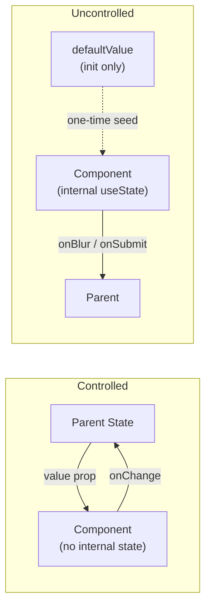

# [FEE-504] Controlled vs. Uncontrolled Components & State Ownership

:::info
A controlled component derives its visible value entirely from props and fires change events — the parent owns the truth. An uncontrolled component manages its value internally with an optional `defaultValue` for initialization. The dual-mode pattern bridges both worlds: library components that accept both `value` and `defaultValue` let consumers choose their level of control without being forced into either model.
:::

## Introduction

Every interactive UI element has a value at any point in time: the text in an input, whether a dialog is open, which tab is active, the position of a slider. The question of who owns and manages that value is not a stylistic preference — it is a structural decision that determines how data flows through the component tree, how easy the component is to test, and how much flexibility consumers have when integrating it.

React formalized the vocabulary in the context of form elements: a controlled `<input>` takes its `value` from a state variable and fires `onChange` to request an update; an uncontrolled `<input>` maintains its value in the DOM, and you query it with a `ref` when you need it. But the concept generalizes far beyond native form elements. Any component with internal state — a `Select`, a `Dialog`, a `DatePicker`, a `Toggle`, a `Accordion` — can be either controlled or uncontrolled. The same structural choice applies.

The problem that the industry ran into as component libraries matured is that locking a component into one mode or the other forces a tradeoff on every consumer. A fully controlled `Dialog` requires every caller to maintain `open` and `setOpen` even for the simplest use case. A fully uncontrolled `Dialog` cannot participate in application state that needs to synchronize the dialog's visibility with a route, a store, or a server event. The resolution — pioneered visibly by Radix UI — is the dual-mode or optional-controlled pattern: accept both a controlled prop (`open`) and an uncontrolled initialization prop (`defaultOpen`), detect which mode the consumer chose at runtime, and behave accordingly. This pattern is now the standard in professionally built component libraries.

## Principle

A controlled component MUST derive its displayed value entirely from its props on every render. It MUST NOT hold a local copy of the value in internal state. Every user interaction that would change the value MUST be communicated upward through an event callback (`onChange`, `onOpenChange`, etc.), and the parent is solely responsible for deciding whether and how to update the prop. If the parent does not update the prop, the component renders the same value again — this is the intentional behavior of controlled mode, not a bug.

An uncontrolled component MUST accept a `defaultValue` (or `defaultOpen`, `defaultChecked`, etc.) for initialization and MUST manage the value in its own internal state thereafter. The `defaultValue` MUST be read exactly once, on mount. The component MUST NOT re-read `defaultValue` on subsequent renders. Changing `defaultValue` after mount has no effect, and callers MUST NOT rely on it to reset the component.

Teams MUST NOT pass both a controlled prop and the corresponding `defaultValue` prop to the same component instance. Doing so creates indeterminate behavior: the component cannot know which source of truth to honor, and React will emit a "switching between controlled and uncontrolled" warning if the controlled prop transitions between `undefined` and a defined value. Teams building library components SHOULD implement the dual-mode pattern so consumers can opt into controlled behavior when they need it and leave state management to the component when they do not.

When implementing the dual-mode pattern, treat `value !== undefined` as the signal for controlled mode. When the component is in controlled mode, it MUST NOT update internal state in response to user interactions — the prop is the only source of truth, and every change MUST go through the callback.

## Design Thinking

The choice between controlled and uncontrolled is fundamentally a question of who needs to know about the value and when. If the answer is "only the user, on submit," uncontrolled is simpler and produces less re-render pressure — there is no state update on every keystroke, no callback chain to wire up. If the answer is "the parent, right now, in real time," controlled is the only option that guarantees synchrony.

A second dimension is reset behavior. A controlled field can be reset to any value at any time: the parent sets state to `''` and the next render reflects the change. An uncontrolled field cannot be reset by changing `defaultValue` — it was already initialized. The only escape hatches are a `key` prop change (which unmounts and remounts the component, triggering a fresh read of `defaultValue`) or a direct `ref.current.value = ''` mutation. Teams that reach for `defaultValue` without understanding this constraint frequently encounter hard-to-debug reset bugs where clearing state has no visible effect.

A third dimension is library design. When you build a component for external consumers — or even for multiple product teams in the same organization — you cannot predict which use case each consumer will have. Forcing controlled mode on a consumer who just wants a self-managing dropdown is friction. Forcing uncontrolled mode on a consumer who needs to sync the dropdown state with a URL parameter is a blocker. The dual-mode pattern eliminates both problems. Radix UI implements this consistently across all its primitives: `Dialog`, `Popover`, `Select`, `Accordion`, `Collapsible`, and many others all accept both a controlled prop and a `default*` prop. The `@radix-ui/react-use-controllable-state` hook, extracted as a standalone package, encapsulates the detection and synchronization logic in roughly 50 lines.

**Decision table — which mode fits the scenario:**

| Scenario | Controlled | Uncontrolled |
|---|---|---|
| Value must sync with external state/store | Yes | No |
| Form submission only, no live validation | No | Yes |
| Parent needs to programmatically reset the field | Yes | No |
| Integration with native `<form>` submission | No | Yes (native `name` attr) |
| Minimal re-render overhead required | No | Yes |
| Multiple fields must stay in sync with each other | Yes | No |
| Value drives conditional rendering elsewhere in the tree | Yes | No |
| Simple toggle with no external dependents | No | Yes |

The dual-mode pattern works by making the controlled prop optional. If `value` is `undefined` (not passed), the component is in uncontrolled mode and uses internal state seeded from `defaultValue`. If `value` is any defined value — including an empty string — the component is in controlled mode and reads exclusively from the prop. The flag `const isControlled = value !== undefined` is evaluated on every render. When controlled, the component skips all internal state mutations and delegates the change upward through the callback. When uncontrolled, it updates its own internal state and still fires the callback (so the parent can observe without owning).

**When controlled mode creates unnecessary complexity.** Not every component benefits from being forced into controlled mode. Consider a multi-step wizard where each step contains an independent text area for notes. If the wizard's parent owns every note field in a centralized state object, every keystroke in any text area triggers a re-render of the entire wizard tree. The simpler architecture is to leave each note field uncontrolled — the wizard collects all values on "Submit" via refs or a single `onChange` aggregation — and only lift state for fields that genuinely drive cross-step behavior (such as a shared name field displayed in the review step). Defaulting to controlled mode "just in case" is a premature optimization that adds re-render overhead and wiring cost without a concrete synchronization requirement to justify it.

**Real-world example: form libraries.** React Hook Form defaults its fields to uncontrolled mode for exactly this reason — it registers fields with refs and reads values on validation and submit, avoiding per-keystroke re-renders entirely. When you integrate a third-party component (a rich `Select`, a date picker) into React Hook Form, the library's `Controller` wrapper provides a controlled interface: it passes `value` and `onChange` to the inner component so the form can observe and validate the field. This is the dual-mode pattern in production at scale — the outer form system needs controlled behavior; the inner component supports it; consumers who use the component outside a form can skip the wiring and use `defaultValue` instead. Studying the React Hook Form `Controller` implementation is a practical way to see the seam between a controlled adapter layer and an underlying component that supports both modes.

## Best Practices

**Treat the controlled/uncontrolled distinction as a public API contract.** Once you ship a component that only supports controlled mode, switching to dual-mode is a non-breaking additive change. The reverse — removing controlled-mode support from a component that previously had it — is always breaking. Design toward dual-mode from the start if there is any realistic chance that both use cases will arise. Retrofitting a controlled-only component is easy; retrofitting an uncontrolled-only component forces consumers to add state boilerplate they should never have needed.

**For compound components, pass controlled state through Context rather than prop drilling.** A composite like `Accordion` is built from multiple sub-components (`AccordionItem`, `AccordionPanel`). The `open`/`defaultOpen` state resolved at the root needs to reach deeply nested children. The correct pattern is to run `useControllableState` once at the top-level `Accordion` and put the resulting `[isOpen, setIsOpen]` into a React Context. Child components consume the context rather than receiving props from each intermediate layer. This keeps the dual-mode detection in one place and leaves the public-facing API clean.

**Signal controlled mode with `!== undefined`, not with truthiness.** An empty string `''`, `false`, and `0` are all valid controlled values. Testing `if (value)` will incorrectly treat them as absent. Always use `value !== undefined` as the mode detection predicate. Some implementations use `Object.prototype.hasOwnProperty.call(props, 'value')` for extra precision, but `!== undefined` is idiomatic and sufficient for all common cases.

**Never shadow the controlled prop in internal state.** The most common dual-mode bug is initializing internal state with the controlled prop: `const [val, setVal] = useState(value)`. This seeds internal state once on mount. If the controlled prop changes, the internal state is stale and the component renders the wrong value. In controlled mode, read exclusively from the prop. In uncontrolled mode, read exclusively from internal state.

**Always fire the callback in both modes.** The `onChange` / `onOpenChange` callback should fire on every user interaction regardless of whether the component is controlled or uncontrolled. In controlled mode the parent must receive it to update the prop. In uncontrolled mode the parent may want to observe changes without owning them — for example, to update a form validation summary or fire analytics. An uncontrolled component that silences its callback when unmanaged is not genuinely dual-mode.

**Document `defaultValue` as initialization-only.** In JSDoc or your public API docs, explicitly state that `defaultValue` is read once on mount. Consumers who expect it to function as a reset trigger will write bugs. A clear note — "changing this prop after mount has no effect" — prevents the confusion.

**Use `key` for imperative reset of uncontrolled fields.** When a parent genuinely needs to reset an uncontrolled child to a fresh initial state, the correct mechanism is to change the `key` prop on the child. This unmounts and remounts the component, re-running the `useState(defaultValue)` initialization. This is the React-idiomatic approach to forced reset and costs exactly one mount cycle.

**Prefer `useControllableState` (or your own equivalent) over ad-hoc detection.** Rewriting the controlled/uncontrolled detection logic for every component in a library leads to inconsistencies. Extract a `useControllableState` hook once, test it thoroughly, and use it everywhere. Radix UI open-sourced theirs; many teams copy it as a starting point. The hook signature is typically `useControllableState({ prop, defaultProp, onChange })` and returns `[value, setValue]` with automatic mode detection.

**Warn in development when both `value` and `defaultValue` are supplied.** Add a `useEffect`-based development warning at the top of the component:

```tsx
if (process.env.NODE_ENV !== 'production') {
  if (value !== undefined && defaultValue !== undefined) {
    console.warn(
      '[Toggle] Received both `open` and `defaultOpen`. ' +
      'Provide one or the other. `open` will be used.'
    );
  }
}
```

React itself does this for native inputs. Library components should match that behavior.

**Native `<form>` integration belongs to uncontrolled mode.** When an uncontrolled input carries a `name` attribute, the browser includes its value in `FormData` automatically on submit. A controlled input that manages state outside the DOM does not participate in native form submission unless you add a hidden `<input type="hidden" name="..." value={...} />`. Be explicit in your component API about which mode supports native form submission.

**Keep the `isControlled` flag stable within a single render pass.** Because `isControlled` is derived from `prop !== undefined` on every render, there is a subtle risk if the controlled prop is conditionally forwarded and the condition changes mid-session. In practice, treat mode stability as a consumer responsibility — document that `value` must not transition from defined to `undefined` — and reinforce that with the development warning described above. From the library side, the only robust defense against mid-lifecycle mode switching is remounting via `key`, not adding defensive branching inside the component.

## Diagram



In controlled mode (left), the data cycle is a closed loop: parent state flows down as a prop, user interaction fires `onChange` up, the parent decides whether to update state. The component itself never stores the value. In uncontrolled mode (right), the component is the loop: internal `useState` holds the value, `defaultValue` seeds it on mount (dashed arrow — one-time only), and the parent only receives events at submission boundaries.

## Example

The following `Toggle` component implements both modes. When the `open` prop is provided (not `undefined`), the component behaves as controlled. When `open` is omitted, the component manages its own state seeded from `defaultOpen`.

```tsx
// src/components/Toggle.tsx
import { useState } from 'react';

interface ToggleProps {
  /** Controlled: caller owns open state */
  open?: boolean;
  /** Uncontrolled: initial value only — ignored after mount */
  defaultOpen?: boolean;
  onOpenChange?: (open: boolean) => void;
  children: (isOpen: boolean, toggle: () => void) => React.ReactNode;
}

export function Toggle({
  open,
  defaultOpen = false,
  onOpenChange,
  children,
}: ToggleProps) {
  const isControlled = open !== undefined;
  const [internalOpen, setInternalOpen] = useState(defaultOpen);

  // In controlled mode, read from prop; in uncontrolled mode, read from internal state
  const isOpen = isControlled ? open! : internalOpen;

  function handleToggle() {
    const next = !isOpen;
    if (!isControlled) {
      // Only update internal state when uncontrolled
      setInternalOpen(next);
    }
    // Always fire the callback — parent may observe even in uncontrolled mode
    onOpenChange?.(next);
  }

  return <>{children(isOpen, handleToggle)}</>;
}
```

The key invariant is on the `isOpen` line: in controlled mode, `open!` (the prop) is the sole source of truth. The `internalOpen` state is initialized but never read. In uncontrolled mode, `internalOpen` drives the render. The `handleToggle` function always fires `onOpenChange`, but only mutates `internalOpen` when uncontrolled. This ensures the callback is usable in both modes.

**Usage — uncontrolled (component manages its own state):**

```tsx
// No `open` prop — Toggle is uncontrolled; state lives inside
<Toggle defaultOpen={false}>
  {(isOpen, toggle) => (
    <button onClick={toggle}>{isOpen ? 'Close' : 'Open'}</button>
  )}
</Toggle>
```

This is the zero-boilerplate form. The parent provides initial state via `defaultOpen` and then forgets about it. The button just works. If the parent also needs to know when the state changes, it can attach `onOpenChange` without taking ownership:

```tsx
<Toggle defaultOpen={false} onOpenChange={(next) => analytics.track('toggle', { next })}>
  {(isOpen, toggle) => (
    <button onClick={toggle}>{isOpen ? 'Close' : 'Open'}</button>
  )}
</Toggle>
```

**Usage — controlled (parent manages state):**

```tsx
function Parent() {
  const [open, setOpen] = useState(false);

  return (
    <>
      {/* External control — button outside the Toggle drives the same state */}
      <button onClick={() => setOpen(true)}>Open from outside</button>

      <Toggle open={open} onOpenChange={setOpen}>
        {(isOpen, toggle) => (
          <button onClick={toggle}>{isOpen ? 'Close' : 'Open'}</button>
        )}
      </Toggle>

      {/* Conditional rendering driven by the same state */}
      {open && <aside>Panel content visible when open</aside>}
    </>
  );
}
```

In controlled mode, `open` and `setOpen` are passed explicitly. Now the state is shared: the external "Open from outside" button can drive the same toggle, and the `<aside>` renders in sync. The parent is in full control — it could intercept `onOpenChange` and add validation before updating state, or prevent certain transitions entirely.

**The `useControllableState` extraction pattern:**

For a component library with many dual-mode components, it pays to extract the detection logic into a shared hook:

```tsx
// src/hooks/useControllableState.ts
import { useState, useCallback, useRef } from 'react';

interface UseControllableStateOptions<T> {
  /** The controlled value — if provided, the hook is in controlled mode */
  prop?: T;
  /** The default value for uncontrolled mode — read once on mount */
  defaultProp?: T;
  /** Fired on every state change, regardless of mode */
  onChange?: (value: T) => void;
}

export function useControllableState<T>({
  prop,
  defaultProp,
  onChange,
}: UseControllableStateOptions<T>): [T | undefined, (value: T) => void] {
  const [internalValue, setInternalValue] = useState<T | undefined>(defaultProp);
  const isControlled = prop !== undefined;
  const value = isControlled ? prop : internalValue;

  // Stable reference so consumers can include setValue in dependency arrays safely
  const onChangeRef = useRef(onChange);
  onChangeRef.current = onChange;

  const setValue = useCallback(
    (next: T) => {
      if (!isControlled) {
        setInternalValue(next);
      }
      onChangeRef.current?.(next);
    },
    [isControlled],
  );

  return [value, setValue];
}
```

With this hook, the `Toggle` implementation becomes:

```tsx
// src/components/Toggle.tsx (using useControllableState)
import { useControllableState } from '../hooks/useControllableState';

export function Toggle({ open, defaultOpen = false, onOpenChange, children }: ToggleProps) {
  const [isOpen, setIsOpen] = useControllableState({
    prop: open,
    defaultProp: defaultOpen,
    onChange: onOpenChange,
  });

  function handleToggle() {
    setIsOpen(!isOpen);
  }

  return <>{children(isOpen ?? false, handleToggle)}</>;
}
```

The dual-mode logic is now in one place, tested once, and composed into any component that needs it. `Select`, `Accordion`, `DatePicker` — all reuse the same hook with different prop names.

## Common Mistakes

**Passing both `value` and `defaultValue` to the same field.** React emits "A component contains an input of type text with both a defaultValue and a value attribute" and the behavior depends on render order. The `value` prop wins on the initial render (React uses it) but `defaultValue` may have been reflected into the DOM before React's reconciliation runs, causing a flash. More dangerously, if `value` is later removed (becomes `undefined`), React switches the input from controlled to uncontrolled mid-lifecycle, producing the "switching between controlled and uncontrolled" warning and unpredictable behavior.

**Not implementing dual-mode in library components, forcing consumers into controlled.** A `Select` that requires `value` and `onChange` on every usage burdens every caller with state management they may not need. A simple usage like "pick a language for this dropdown" becomes a three-line ceremony: declare state, pass `value`, pass `setLanguage` as `onChange`. The library component bears the complexity cost once; the dual-mode pattern spreads that cost appropriately.

**Resetting an uncontrolled field by clearing `defaultValue`.** This is one of the most common beginner mistakes. `defaultValue` is read exactly once — at mount — by `useState`. Changing it in a subsequent render has no effect on the displayed value. The correct reset approaches are: (a) change the component's `key` prop to force a remount, or (b) use a `ref` to imperatively set `ref.current.value = ''` for native inputs. Passing `defaultValue={resetCounter}` in a loop will not work.

**Initializing controlled-mode state by copying the prop into `useState`.** The pattern `const [val, setVal] = useState(valueProp)` reads `valueProp` exactly once. If the parent later changes `valueProp`, `val` does not update — the component is now showing a stale value while appearing to be controlled. In controlled mode, render directly from the prop. `useState` should only hold uncontrolled internal state.

**Treating `onOpenChange` as optional in controlled mode.** In controlled mode, if `onOpenChange` is missing, user interactions fire the callback into the void, the parent never updates the prop, and the component appears frozen. Always document that controlled mode requires the callback. Consider a development warning: `if (isControlled && !onOpenChange) console.warn(...)`.

**Switching between controlled and uncontrolled mid-lifecycle by passing `undefined` as the controlled prop.** React does not support toggling between modes. Once controlled (`value` is defined), the prop must remain defined for the component's lifetime. If you need to "release control," the correct approach is to remount the component — change its `key`. Passing `value={condition ? someValue : undefined}` will trigger the warning on every mode switch and cause unpredictable behavior.

**Assuming `defaultValue` changes propagate after mount when using third-party components.** Consumer code often generates a `defaultValue` from an async data fetch and assumes the field will reflect it once the data arrives. If the fetch completes after the component mounts, the field has already initialized with `undefined` (or whatever the empty default was) and the late-arriving `defaultValue` has no effect. The correct approach is to delay rendering the component until the initial value is available — for example, by conditionally rendering based on a loading flag — or to switch to controlled mode so the value can be updated at any time.

## Related FEEs

- [FEE-502: Reactive State & Signals](./502.md) — reactivity primitives that controlled components build on
- [FEE-601: Local Component State](../State%20Management/601.md) — the internal state in uncontrolled components
- [FEE-603: Context & Prop Drilling](../State%20Management/603.md) — lifting controlled value too far up the tree

## References

- [React docs: Sharing State Between Components](https://react.dev/learn/sharing-state-between-components)
- [React docs: Preserving and Resetting State](https://react.dev/learn/preserving-and-resetting-state)
- [React docs: `<input>` — Controlled vs. uncontrolled inputs](https://react.dev/reference/react-dom/components/input)
- [Radix UI: State Management — controlled and uncontrolled patterns](https://www.radix-ui.com/primitives/docs/guides/controlled-state)
- [Vercel Academy: useControllableState (Radix implementation walkthrough)](https://vercel.com/academy/shadcn-ui/use-controllable-state)
- [Kent C. Dodds: Don't Sync State. Derive It.](https://kentcdodds.com/blog/dont-sync-state-derive-it)
