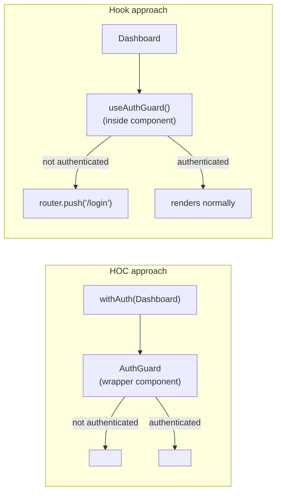

# [FEE-505] Higher-Order Components & Cross-Cutting Logic

:::info
A Higher-Order Component (HOC) is a function that accepts a component and returns a new component with additional behavior injected. In the hooks era, custom hooks cover the majority of cross-cutting concerns. Teams SHOULD prefer custom hooks for non-render concerns (analytics, auth checks, data fetching). Teams MUST use HOCs when the concern requires wrapping the rendered output — auth redirects, injecting layout elements, portal rendering. Any HOC that wraps a DOM element MUST use `React.forwardRef` to preserve ref forwarding.
:::

## Introduction

As React applications grow, certain behaviors recur across unrelated components: authentication checks before rendering a page, analytics event firing when a user views a section, theme injection, permission gates, error boundaries, feature flag toggles. These concerns cut across the component tree horizontally rather than following any parent-child relationship. The challenge is how to implement them once and apply them consistently without duplicating logic, without tangling unrelated concerns into individual components, and without making the component tree opaque to the debugging tools that developers rely on every day.

Higher-Order Components were the idiomatic answer to this problem before React 16.8. The pattern itself predates React — it is a direct application of the higher-order function concept from functional programming, adapted to the component model. A HOC is a function that takes a component as its argument and returns a new component. The returned component wraps the original, adding behavior before and after the wrapped component renders, or conditionally preventing it from rendering at all. Libraries like Redux (`connect`), React Router (`withRouter`), and MobX (`observer`) all used this pattern to inject store subscriptions, routing context, and reactive tracking into application components without the consumer having to write any plumbing.

The introduction of hooks in React 16.8 changed the calculus significantly. Custom hooks can extract and share stateful logic across any number of function components without altering the component tree. For cross-cutting concerns that do not involve the DOM structure — reading authentication state, firing analytics events, subscribing to stores — a custom hook is almost always simpler than a HOC: it requires less boilerplate, produces no extra wrapper element in the tree, and appears as a single named call in the component that owns it rather than as an anonymous wrapper in React DevTools. However, hooks cannot do everything a HOC can do. A hook cannot wrap the render output of its host component — it cannot insert a `<Navigate>` in place of the component, inject a surrounding `<Portal>`, or intercept children. For any concern that truly requires controlling or modifying what is rendered, HOCs remain the right tool.

Understanding when to reach for each pattern — and recognizing that the two are not mutually exclusive — is the practical skill this article builds. Real codebases often contain both: a `withAuth` HOC that guards entire routes at the routing layer, alongside a `useAnalytics` hook that records user interactions inside individual components. The goal is to match the tool to the structural requirement, not to pick a side in a false debate.

It is also worth understanding a common point of confusion: HOCs and hooks are not alternatives to each other at the same level of abstraction. A HOC factory function itself calls hooks inside its returned component. `withAuth` above calls `useAuth` and conditionally returns `<Navigate>`. The HOC is the boundary that controls the render output; hooks are the mechanism it uses to access cross-cutting state. This composition — hooks driving the logic, HOC shaping the render boundary — is the correct mental model for writing HOCs in the hooks era. A HOC that does not call hooks at all is probably implementing its cross-cutting concern through props drilling, context reads, or legacy lifecycle methods, which are all less ergonomic than hooks.

## Principle

A Higher-Order Component MUST be a pure function with respect to its component argument: given the same `WrappedComponent`, it MUST return a component with the same augmented behavior on every invocation. It MUST NOT mutate the `WrappedComponent`'s prototype or `defaultProps` — doing so causes unpredictable behavior when the same base component is passed to multiple HOCs or used directly alongside its wrapped form.

Any HOC that renders a DOM element or forwards a ref MUST use `React.forwardRef` to preserve ref forwarding transparency. Failing to forward `ref` silently breaks any parent that holds a ref to the component — the parent's `ref.current` points to the HOC wrapper's internal instance (or remains `null` for function components) instead of the underlying DOM node or component instance the parent expected. This failure is silent and subtle: no error is thrown, no warning is emitted, and behavior breaks only when the parent attempts to call a method or read a property on the ref.

Teams SHOULD prefer custom hooks for cross-cutting non-render concerns — analytics, auth state reads, permission checks, data prefetching, store subscriptions. Hooks require no wrapper element, produce no anonymous entries in React DevTools, and compose without the prop-tunneling tax that HOC stacking introduces. Teams MUST use HOCs when the cross-cutting concern requires wrapping or replacing the rendered output — authentication redirects that must prevent the component from rendering entirely, layout injection that must appear in a specific DOM position relative to the wrapped component, portal rendering, or class component compatibility.

HOC stacking (`withAuth(withAnalytics(withTheme(Component)))`) is a composition anti-pattern. Each layer adds a wrapper element to the React tree, multiplies the DevTools noise, and creates a prop-tunneling channel through which props injected at layer N must travel through layers N-1 down to zero. Teams MUST NOT stack more than two HOCs on a single component. When more than two cross-cutting concerns must be applied, teams SHOULD extract a single multi-concern wrapper that composes the concerns internally, or restructure the concerns as hooks that the component calls directly.

Every HOC MUST set a `displayName` on the returned component. Without a `displayName`, React DevTools displays the wrapper as `Anonymous` or `ForwardRef`, making it impossible to identify which HOC is in the tree when debugging. The convention is `withHocName(WrappedComponentName)`, falling back to `'Component'` when the wrapped component has no name.

## Design Thinking

The core architectural decision — HOC or hook — maps cleanly to one question: does the cross-cutting concern need to influence what appears in the DOM, or only what happens inside the component's logic? If the answer is the former, the HOC is the right level of abstraction. If the answer is the latter, a hook is simpler, more composable, and more transparent.

Consider authentication guarding. There are two structurally different auth requirements a codebase typically has. The first: prevent an unauthenticated user from ever seeing a protected page — not even a flash of the page's skeleton before a redirect fires. This is a render-level concern. The component must not render at all; a redirect element must appear in its place. A HOC is the natural fit: it intercepts at the render layer and returns `<Navigate>` before the wrapped component ever runs. The second: inside a component that has already rendered, check whether the user has a specific permission before firing an action. This is a logic-level concern. No wrapper is needed; a hook that returns an `isAuthorized` boolean integrates directly into the component's event handler without touching the DOM structure.

Analytics is another revealing case. If you need to fire a `view` event every time a specific component mounts, a `useEffect` in a custom hook is three lines of code and requires no wrapping. If you need to ensure that every interaction with an entire subtree — including clicks on dynamically rendered children — is tracked, a HOC that wraps the subtree and attaches a delegated event listener may be more appropriate. The concern's scope in the DOM determines the right abstraction.

The third dimension is class component compatibility. Hooks are unavailable in class components. A codebase that still has class components — whether legacy code that has not been migrated, or third-party components you do not control — requires HOCs for cross-cutting behavior injection. If your team is fully on function components, this dimension disappears.

**Decision table:**

| Scenario | HOC | Custom Hook |
|---|---|---|
| Must inject a wrapper element into the DOM | Yes | No |
| Cross-cutting render logic (portals, boundaries) | Yes | No |
| Cross-cutting non-render logic (analytics, auth check) | Either | Prefer hook |
| Function components only, hooks available | Hook preferred | Yes |
| Must intercept or transform children | Yes | No |
| Class component compatibility required | Yes | No (hooks don't work in class components) |

The table highlights that there is genuine overlap in the "either" row. For non-render concerns in function components, both tools work. The tiebreaker is composability and DevTools legibility: a hook appears by name in the component's own code, is trivially testable as a function, and adds nothing to the React element tree. The HOC adds a wrapper. All else equal, the hook is the lower-cost option.

A useful mental exercise when evaluating a proposed HOC: imagine the concern implemented as a hook instead. If the hook implementation requires the component itself to duplicate any part of the concern's render logic across every component that uses it — a redirect JSX element, an error boundary fallback, a portal mount point — the HOC wins, because the HOC centralizes that render logic in one place. If the hook implementation is self-contained and does not require the component to add any render logic, the hook wins.

Finally, HOCs are well-suited to framework integration points where component wrapping is the idiomatic API surface. React Router's `<Route>` element uses render props, but many route-level concerns (permissions, analytics, scroll restoration) are applied more cleanly as HOCs that wrap the route's component rather than as per-route configurations. Similarly, testing libraries often provide HOC-style wrappers for injecting test providers (`withStoreProvider`, `withThemeProvider`) in unit tests. In those contexts, the HOC is not a design choice you are making — it is the API shape the framework or tooling expects.

**React 19 and the ref-as-prop change.** React 19 removes the requirement for `React.forwardRef` in function components: a function component can declare `ref` as a regular prop and React will handle it correctly. This simplifies the HOC authoring story for pure React 19 codebases — instead of wrapping in `React.forwardRef`, the returned wrapper function can accept `ref` in its props destructuring directly. However, this change does not eliminate the obligation to forward `ref`; it only changes the mechanism. A HOC that ignores `ref` in React 19 is still broken for any parent that holds a ref to the wrapped component. In practice, most production HOCs will need to remain `React.forwardRef`-compatible for the React 18/19 transition period, and any HOC that wraps a class component must continue using `React.forwardRef` because class components do not accept `ref` as a prop. The net design lesson is: the ref-forwarding contract is a semantic obligation, not an API detail — the mechanism for satisfying it changes between versions, but the obligation does not.

**Real-world HOC examples from production libraries.** The HOC pattern's longevity is demonstrated by its continued use in foundational React libraries. React Redux's `connect(mapStateToProps, mapDispatchToProps)(Component)` is the canonical HOC: it subscribes to the Redux store, selects the slice of state the component needs, and injects it as props — the component never imports from the store directly. Apollo Client's `withApollo(Component)` injects the Apollo client instance as a prop, enabling class components to execute queries imperatively without a render-prop or hook. React Router's `withRouter(Component)` (pre-v6) injected `history`, `location`, and `match` props, allowing any component in the tree to access routing context without consuming `<Route>` directly. Each of these follows the same structural contract: a factory function, a wrapper that reads from context via hooks (or subscriptions), injection of derived props, and explicit `displayName` and `forwardRef` support. Studying these implementations in their source repositories is one of the most effective ways to internalize production-grade HOC conventions.

## Best Practices

**Set `displayName` unconditionally.** Every HOC factory MUST set `displayName` on the returned component before returning it. The convention is `withHocName(${WrappedComponent.displayName ?? WrappedComponent.name ?? 'Component'})`. Omitting this produces `Anonymous` or `ForwardRef` entries in React DevTools that are indistinguishable from one another when multiple HOCs are applied. A readable DevTools tree directly reduces the time to diagnose component-level bugs, especially when component trees are deep.

**Forward `ref` with `React.forwardRef`.** Any HOC that renders the wrapped component MUST wrap the returned component in `React.forwardRef`. Pass the `ref` to the wrapped component via the `ref` prop. This maintains the transparency contract: from the parent's perspective, holding a ref to `withAuth(Dashboard)` should be identical to holding a ref to `Dashboard`. Without forwarding, `ref.current` will be `null` for function components or will resolve to the HOC wrapper instance for class components — neither is what the parent expects.

Note on React 19: In React 19, function components can accept `ref` as a regular prop without `React.forwardRef`. However, HOC wrappers that need to support both React 18 and React 19 environments, or that wrap class components, still benefit from the explicit `React.forwardRef` pattern for compatibility and clarity.

**Avoid prop name collisions.** A HOC injects props into the wrapped component. If an injected prop name (e.g., `user`, `theme`, `data`) collides with a prop the consumer passes through, one silently shadows the other. Use namespaced prop names, or document injected prop names explicitly. For injected props the consumer should never see, consider using a wrapper component pattern where the injected props are consumed by the HOC's render function and not passed through at all.

**Do not mutate the wrapped component.** It is tempting to modify `WrappedComponent.prototype` or attach properties to `WrappedComponent` directly. This produces shared mutable state across all uses of the component, including uses that do not involve the HOC. Always create a new component in the HOC factory and return it. Never mutate.

**Copy static methods.** When a HOC wraps a component, the returned wrapper does not carry the original component's static methods. If `Dashboard` has a static `Dashboard.requiresAuth` flag or a `Dashboard.getLayout` function, those will be absent on `withAuth(Dashboard)` unless explicitly copied. Use the `hoist-non-react-statics` library, or manually copy the methods you need: `AuthGuard.getLayout = WrappedComponent.getLayout`.

**Hoist static methods with `hoist-non-react-statics`.** When a HOC wraps a component, the wrapper function returned by the factory does not inherit any static methods defined on the original component. This is a silent problem: `withAuth(Dashboard)` will not have `Dashboard.getLayout`, `Dashboard.defaultProps` (if set as a static), or any other static you defined. In Next.js, losing `getLayout` causes the page to render without its intended layout wrapper. In a component library, losing a static `componentType` discriminator breaks switch-on-type logic in consuming code. The `hoist-non-react-statics` package automates the copy: call `hoistNonReactStatics(Wrapper, WrappedComponent)` before returning the wrapper, and all non-React statics (everything except `displayName`, `defaultProps`, `propTypes`, `contextType`, and other reserved React keys) will be copied. If you prefer not to add a dependency, copy statics explicitly for the properties your application actually uses — but be deliberate, not accidental. A code review checklist item for every new HOC is: "what statics does the wrapped component define, and are they present on the wrapper?"

**Keep HOC factories colocated with the concern they implement.** A `withAuth` HOC belongs in `src/hoc/withAuth.tsx` or near the auth module — not scattered across feature folders. HOC factories are infrastructure. Treat them like utility functions: centralized, versioned, and exported from a single location.

**Compose HOC factories with `pipe` or `compose` utilities when stacking is unavoidable.** If two HOCs must be applied to a single component, prefer an explicit `compose` call over nested invocations. Nested invocations read inside-out (`withAuth(withAnalytics(Dashboard))`), which makes the execution order ambiguous without careful reading. A `compose(withAuth, withAnalytics)(Dashboard)` reads left-to-right (or right-to-left depending on the `compose` implementation) and makes the precedence explicit. Most utility libraries (lodash, ramda) expose a `compose` or `flowRight` helper; alternatively, a project-local two-argument `compose` is six lines of TypeScript and removes the ambiguity entirely. Even with `compose`, the two-HOC maximum from the Principle section still applies — `compose` does not reduce the number of wrapper elements in the tree, it only improves readability.

**Test the HOC in isolation.** A HOC factory is a function. It can be tested by passing a mock component and asserting on what the returned component renders under different prop and context conditions. Do not rely solely on integration tests that test the HOC and the wrapped component together. Isolating the HOC logic makes auth redirect behavior, loading state rendering, and prop forwarding independently verifiable.

**Use a consistent naming convention for HOC factories.** The `with` prefix is the universally recognized convention: `withAuth`, `withTheme`, `withAnalytics`, `withFeatureFlag`. A HOC that is not prefixed with `with` will confuse readers who expect `with*` to signal a HOC factory and `use*` to signal a hook. Mixing conventions inside a codebase — `protectedComponent`, `analyticsDecorated`, `themed` — forces readers to check every unknown function's signature to determine whether it is a HOC, a utility, or a hook. Enforce the `with` prefix in ESLint rules or code review guidelines and keep it consistent across the entire codebase.

## Mermaid Diagram



The HOC approach operates at the React element tree level — the wrapper component is a node in the tree, and the decision about what to render is made inside that node before the wrapped component is ever instantiated. The hook approach operates inside the component's own render function — the component is already in the tree, and the hook fires an imperative navigation effect. The HOC can prevent the component from rendering; the hook cannot prevent its host component from rendering, only from displaying meaningful UI or triggering navigation after the render.

## Example

### `withAuth` HOC — complete implementation

The following HOC wraps any component with authentication guarding. If the user is not authenticated, the HOC renders a redirect instead of the wrapped component. `React.forwardRef` is used so that refs held by the HOC's consumers resolve correctly to the wrapped component.

```tsx
// src/hoc/withAuth.tsx
import React from 'react';
import { Navigate } from 'react-router-dom';
import { useAuth } from '../hooks/useAuth';

export function withAuth<P extends object>(
  WrappedComponent: React.ComponentType<P>,
  redirectTo = '/login'
) {
  const AuthGuard = React.forwardRef<unknown, P>((props, ref) => {
    const { isAuthenticated, isLoading } = useAuth();

    if (isLoading) return <div aria-busy="true" aria-label="Checking auth..." />;
    if (!isAuthenticated) return <Navigate to={redirectTo} replace />;

    // TypeScript: cast needed because forwardRef generic is unknown
    const Component = WrappedComponent as React.ComponentType<P & { ref?: unknown }>;
    return <Component {...props} ref={ref} />;
  });

  // Preserve component name in React DevTools
  AuthGuard.displayName = `withAuth(${
    WrappedComponent.displayName ?? WrappedComponent.name ?? 'Component'
  })`;

  return AuthGuard;
}

// Usage
const ProtectedDashboard = withAuth(Dashboard);
const ProtectedSettings = withAuth(Settings, '/auth/login');
```

Walk through the key decisions:

- **`React.forwardRef`**: The HOC returns a `forwardRef`-wrapped component. Any parent that holds a ref to `ProtectedDashboard` will have that ref forwarded transparently to `Dashboard`. Without this, the ref would be `null` or would point to the wrapper.
- **Loading state rendered by the HOC**: The `isLoading` guard is inside the HOC rather than the wrapped component. This means `Dashboard` never needs to handle the "auth loading" case — it always receives fully resolved auth state if it renders at all.
- **`Navigate` return**: The HOC can return a completely different element tree (`<Navigate>`) in place of the wrapped component. This is structurally impossible to achieve with a hook inside `Dashboard` — the component is already rendering.
- **`displayName`**: Set explicitly. In React DevTools, the component tree will show `withAuth(Dashboard)` rather than `ForwardRef` or `Anonymous`.
- **TypeScript cast**: The `forwardRef` generic for `ref` is typed as `unknown` because the actual ref type depends on `P`. A more rigorous typing would require an additional generic parameter for the ref type. The cast is isolated and does not affect runtime behavior.

### `useAuthGuard` hook — equivalent for non-render cases

When the auth concern is "redirect the user imperatively if not authenticated, but do not prevent the component from rendering a loading state," a hook is simpler and produces no wrapper element.

```tsx
// src/hooks/useAuthGuard.ts — hook equivalent for non-render cases
import { useEffect } from 'react';
import { useNavigate } from 'react-router-dom';
import { useAuth } from './useAuth';

export function useAuthGuard(redirectTo = '/login') {
  const { isAuthenticated, isLoading } = useAuth();
  const navigate = useNavigate();

  useEffect(() => {
    if (!isLoading && !isAuthenticated) {
      navigate(redirectTo, { replace: true });
    }
  }, [isAuthenticated, isLoading, navigate, redirectTo]);

  return { isLoading };
}

// Usage — no wrapper element, no forwardRef needed
function Dashboard() {
  const { isLoading } = useAuthGuard();
  if (isLoading) return <Spinner />;
  return <DashboardContent />;
}
```

The structural difference is visible immediately: `Dashboard` appears as a single node in React DevTools. No wrapper is added. The hook fires a navigation effect after render rather than preventing render. This is appropriate when the component renders a loading spinner regardless — the extra render cycle is harmless. It is NOT appropriate when the component's render has visible side effects before the auth check resolves, or when the component's render itself is expensive and should not run for unauthenticated users.

### HOC stacking anti-pattern and the consolidation alternative

```tsx
// Anti-pattern: three HOC layers create three wrapper elements and three displayName
// entries in DevTools, plus prop-tunneling through every layer
const ProtectedDashboard = withAuth(
  withAnalytics(
    withTheme(Dashboard)
  )
);

// Preferred alternative A: single multi-concern HOC
function withPageConcerns<P extends object>(WrappedComponent: React.ComponentType<P>) {
  const PageWrapper = React.forwardRef<unknown, P>((props, ref) => {
    const { isAuthenticated, isLoading } = useAuth();
    const navigate = useNavigate();
    const theme = useTheme();

    useAnalytics({ componentName: WrappedComponent.displayName ?? WrappedComponent.name });

    useEffect(() => {
      if (!isLoading && !isAuthenticated) navigate('/login', { replace: true });
    }, [isAuthenticated, isLoading, navigate]);

    if (isLoading) return <PageSkeleton />;

    const Component = WrappedComponent as React.ComponentType<P & { ref?: unknown }>;
    return (
      <ThemeContext.Provider value={theme}>
        <Component {...props} ref={ref} />
      </ThemeContext.Provider>
    );
  });

  PageWrapper.displayName = `withPageConcerns(${
    WrappedComponent.displayName ?? WrappedComponent.name ?? 'Component'
  })`;

  return PageWrapper;
}

// Preferred alternative B: compose concerns as hooks inside the component
function Dashboard() {
  const { isLoading } = useAuthGuard();
  useAnalytics({ componentName: 'Dashboard' });
  const theme = useTheme();

  if (isLoading) return <PageSkeleton />;
  return <DashboardContent theme={theme} />;
}
```

Alternative B is usually the cleanest: the component's source code is a readable list of concerns it applies, with no wrapper nesting, no DevTools noise, and no prop-tunneling. Alternative A is appropriate when the concern truly must wrap the render output (theme context injection in this example must surround the component, which is a render-level requirement) and when consolidating to avoid stacking is still worthwhile.

## HOC Typing Patterns in TypeScript

HOC typing is one of the most frequently asked-about TypeScript topics in React codebases, because the generic plumbing required to preserve full type inference is non-trivial. Three patterns cover the majority of real-world cases.

**Pattern 1 — injected props excluded from the outer type.** The most common HOC injects one or more props and the consumer should not have to supply them. Use `Omit` on the outer component's prop type:

```tsx
type WithAuthProps = { currentUser: User };

function withAuth<P extends WithAuthProps>(WrappedComponent: React.ComponentType<P>) {
  const AuthGuard = React.forwardRef<unknown, Omit<P, keyof WithAuthProps>>(
    (props, ref) => {
      const { currentUser } = useAuth();
      const Component = WrappedComponent as React.ComponentType<P & { ref?: unknown }>;
      return <Component {...(props as P)} currentUser={currentUser} ref={ref} />;
    }
  );
  AuthGuard.displayName = `withAuth(${WrappedComponent.displayName ?? WrappedComponent.name ?? 'Component'})`;
  return AuthGuard;
}
```

The outer component accepts `Omit<P, keyof WithAuthProps>`, meaning the consumer cannot (and need not) pass `currentUser`. TypeScript enforces this at call sites.

**Pattern 2 — pass-through HOC with no injected props.** Some HOCs add behavior without injecting props (e.g., analytics firing on mount). The outer type is identical to `P`:

```tsx
function withAnalytics<P extends object>(WrappedComponent: React.ComponentType<P>) {
  const Tracked = React.forwardRef<unknown, P>((props, ref) => {
    useAnalytics({ componentName: WrappedComponent.displayName ?? WrappedComponent.name });
    const Component = WrappedComponent as React.ComponentType<P & { ref?: unknown }>;
    return <Component {...props} ref={ref} />;
  });
  Tracked.displayName = `withAnalytics(${WrappedComponent.displayName ?? WrappedComponent.name ?? 'Component'})`;
  return Tracked;
}
```

**Pattern 3 — inferring the ref type.** When the ref type matters (e.g., the consumer holds a ref to a DOM element), add a second generic parameter for the ref element type:

```tsx
function withAuth<TRef, P extends object>(WrappedComponent: React.ComponentType<P>) {
  return React.forwardRef<TRef, P>((props, ref) => {
    // ...
  });
}
const ProtectedInput = withAuth<HTMLInputElement, InputProps>(Input);
```

This is more verbose but gives the consumer a correctly typed `ref.current: HTMLInputElement | null`.

## Common Mistakes

**Prop name collisions.** A HOC that injects a `user` prop into the wrapped component will silently shadow any `user` prop the consumer tries to pass through. The consumer's prop is overwritten with no warning. This is especially insidious in large codebases where the HOC author and the component consumer are different people. The safest mitigation is to prefer non-generic prop names for HOC-injected props (`auth`, `injectedUser`, etc.), or to document injected prop names prominently and enforce no-overlap via TypeScript: use `Omit<P, 'user'>` as the external prop type so the consumer cannot accidentally pass a prop that would collide.

**Creating the HOC inside a render function or component.** Calling a HOC factory inside a component's render function creates a new component type on every render cycle. React treats each new type as an entirely different component, unmounting and remounting the wrapped component on every parent render. This completely defeats memoization and destroys local state inside the wrapped component. HOC factories MUST be called at module scope, outside any component or hook.

```tsx
// Wrong — creates a new component type on every render
function Page() {
  const ProtectedDashboard = withAuth(Dashboard); // new type every render!
  return <ProtectedDashboard />;
}

// Correct — called once at module scope
const ProtectedDashboard = withAuth(Dashboard);
function Page() {
  return <ProtectedDashboard />;
}
```

**Forgetting to copy static methods.** When `Dashboard` has a static property — `Dashboard.getLayout`, `Dashboard.fetchData`, `Dashboard.config` — those properties are absent on `withAuth(Dashboard)`. A Next.js page component that uses `getLayout` will silently lose its layout when wrapped in a HOC. Inspect which static properties the wrapped component exports and copy them explicitly, or use `hoist-non-react-statics` to copy all non-React statics automatically.

**Returning a class component from a HOC that wraps a function component.** Some older HOC implementations used a class-based wrapper internally, even when the wrapped component was a function component. This mixing prevents the wrapped component from using hooks inside the HOC body (since hooks cannot run inside a class `render` method). Modern HOCs MUST use function components (usually via `React.forwardRef`) as their internal wrapper to remain compatible with hooks called inside the HOC logic — like `useAuth`, `useNavigate`, and `useEffect` in the examples above.

**Ignoring the React reconciliation cost of deep wrapping.** Each HOC wrapper is a genuine React element in the reconciliation tree. Two or three wrappers on every route-level component is not a measurable problem at typical scales. But in a large data-dense table that renders hundreds of rows, each row being wrapped in a HOC for per-row permissions checking creates hundreds of extra reconciliation nodes on every update. In performance-sensitive rendering paths, prefer the hook form — it adds zero nodes to the element tree and has no reconciliation overhead.

## Related FEEs

- [FEE-501: Component Composition Patterns](./501.md) — HOC is a wrapping form of composition
- [FEE-503: Headless Components & Renderless Patterns](./503.md) — shared motivation: keeping cross-cutting logic out of component bodies
- [FEE-702: Virtual DOM, Reconciliation & Diffing](../Rendering%20and%20Performance/702.md) — each HOC wrapper adds a React element to the tree

## References

- [React Docs — Higher-Order Components (legacy)](https://legacy.reactjs.org/docs/higher-order-components.html) — original canonical documentation; covers motivation, conventions, and caveats including static method hoisting and ref forwarding
- [React Docs — Reusing Logic with Custom Hooks](https://react.dev/learn/reusing-logic-with-custom-hooks) — the modern alternative to HOCs for non-render cross-cutting concerns; explains when to extract a custom hook and how to test it
- [patterns.dev — HOC Pattern](https://www.patterns.dev/react/hoc-pattern) — practical walkthrough of HOC structure, composition, and when to use hooks instead
- [Kent C. Dodds — AHA Programming](https://kentcdodds.com/blog/aha-programming) — "Avoid Hasty Abstractions"; explains why premature HOC extraction (like any premature abstraction) creates more problems than it solves
- [hoist-non-react-statics](https://github.com/mridgway/hoist-non-react-statics) — utility for copying static methods from wrapped component to HOC wrapper, preventing silent loss of statics like `getLayout`
- [React `forwardRef` API reference](https://react.dev/reference/react/forwardRef) — full API and behavior documentation for `React.forwardRef`, including the React 19 changes to ref handling for function components
