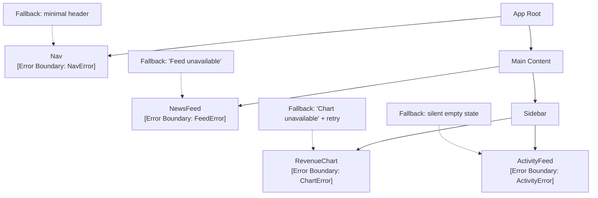

# [FEE-506] Error Boundaries & Resilience Patterns

:::info
An error boundary catches JavaScript errors thrown during rendering, in lifecycle methods, and in constructors of components in its child subtree, and renders a fallback UI instead of crashing the entire application. Teams MUST place boundaries at feature-subtree granularity — a single root-level boundary is not a resilience strategy. Teams MUST report caught errors to an observability service in `componentDidCatch`. Error boundaries do NOT catch: event handler errors, async code (`setTimeout`, Promises, `fetch`), SSR errors, or errors thrown inside the boundary itself.
:::

## Introduction

Every React application that ships to production will encounter runtime errors: a malformed API response causes a component to dereference `undefined`, a third-party library throws unexpectedly during initialization, a race condition corrupts local state before it reaches the renderer. Before React 16 introduced error boundaries, a rendering error in any part of the component tree would propagate up until it reached the root, unmounting the entire application and leaving users with a blank screen and no indication of what went wrong. The user experience was catastrophic, and the operational experience was equally poor — the error was invisible unless a user reported it, because nothing in the application had the opportunity to catch it before it propagated to the browser's uncaught error handler.

Error boundaries are the React primitive that addresses this failure mode. The concept is borrowed from isolation patterns found in distributed systems and operating system design: a fault in one subsystem should not crash the entire system. In React, an error boundary is a class component that implements either `getDerivedStateFromError` or `componentDidCatch` (or both). When an error is thrown anywhere in its child subtree during rendering or in a lifecycle method, the boundary catches it, transitions to an error state, and renders a fallback UI instead. The rest of the application continues running normally. A crashing revenue chart does not take down the navigation header, the news feed, or the user's active form.

The design challenge that error boundaries introduce is not how to write them — the API is small and the implementation is mechanical — but how to place them deliberately. A single error boundary at the application root gives you exactly the isolation of the pre-error-boundary world: one component crashes, and all the user sees is the root-level fallback. A well-designed error boundary strategy mirrors the feature decomposition of the application itself. Each independently valuable piece of UI — a chart, a feed, a sidebar widget, a navigation component — should be wrapped in its own boundary with a fallback that makes sense for that specific piece. The goal is that a user can continue using 90% of the application even when 10% fails.

The evolution of the React ecosystem around error boundaries is worth understanding. React 18 introduced a deeper integration between error boundaries and `Suspense`, the mechanism for declaratively representing asynchronous loading states. When combined with React Query's Suspense mode or React 19's `use()` hook, a `Suspense` boundary and an error boundary working together become the standard model for async data fetching: `Suspense` shows a loading state while data is in flight, and the error boundary catches the thrown rejection if the fetch fails. The `react-error-boundary` library (v4+) provides a production-ready `ErrorBoundary` component that eliminates the need to write class components manually, adds `resetErrorBoundary` support, and integrates cleanly with React Query and other Suspense-aware data libraries. Understanding the raw class component API and understanding these library abstractions are both necessary for production work — the library builds on the primitive, and knowing the primitive reveals what the library is doing and why.

## Design Thinking

The fundamental design decision in an error boundary strategy is granularity: how small should each protected subtree be? The answer depends on two axes — the criticality of the component and the independence of the component from its siblings. A component is critical if its absence makes the application effectively unusable: a navigation bar, a global layout shell, an authentication gate. A component is independent if its failure has no semantic relationship to the components adjacent to it: a revenue chart is independent of the news feed, which is independent of the activity sidebar. High criticality and high independence are not correlated — a navigation bar is both critical and independent; a multi-step form wizard is critical but internally tightly coupled; a recommendation carousel is non-critical and independent.

For high-criticality components, the boundary placement strategy prioritizes minimal fallback over isolation granularity. If the navigation bar throws, the application cannot function without it — the appropriate fallback is a stripped-down static header that lets the user navigate away or reload, not a retry button that will likely fail again in the same session. Place the boundary as close as possible to the navigation component itself, above everything else in the layout tree, so that a nav failure does not take down the main content area. The fallback is not designed for recovery — it is designed for graceful degradation to a usable state.

For non-critical, independent widgets, the boundary strategy inverts: the boundary is as tight as possible around the widget, and the fallback is designed for recovery. A chart that fails to render should show a fallback with a "Retry" button and nothing else — the rest of the dashboard continues working, the user can reload the chart independently, and if the retry succeeds, the chart re-mounts cleanly without touching anything else on the page. The error is reported to the observability service, an alert fires if the error rate crosses a threshold, and the on-call engineer has a component stack and error message to work from. None of this requires the user to reload the page.

The third design dimension is the relationship between error boundaries and Suspense. In React 18+ applications using `use()`, React Query with `suspense: true`, or SWR with `suspense` mode, a thrown Promise is the signal for Suspense to show its `fallback`, and a thrown Error (or a rejected Promise) is the signal for the nearest error boundary to activate. The standard pattern wraps both boundaries around the same subtree:

```tsx
<ErrorBoundary fallback={<FeedError />} onError={reportError}>
  <Suspense fallback={<FeedSkeleton />}>
    <NewsFeed />
  </Suspense>
</ErrorBoundary>
```

The `ErrorBoundary` wraps the `Suspense`, because a `Suspense` fallback that encounters an error should be caught by the boundary rather than propagating upward. With this nesting order, `NewsFeed` can freely use `use(feedPromise)` or a Suspense-aware data hook, and the outer layer handles both the loading state (via `Suspense`) and the error state (via `ErrorBoundary`) without any conditional rendering logic inside `NewsFeed` itself.

**Scenario decision table:**

| Scenario | Pattern |
|---|---|
| Rendering crash in any subtree | Error Boundary |
| Async data fetch failure | Suspense + Error Boundary |
| Critical path (header, nav, layout) | High-tree boundary, minimal fallback |
| Non-critical widget (chart, ad, recommendation) | Per-widget boundary, silent/retry fallback |
| Transient network error | Retry button + exponential backoff in fallback |
| Event handler error | `try/catch` inside the handler — boundaries do not apply |
| SSR render error | Server-side `try/catch`, not error boundaries |
| Error inside the boundary itself | Propagates to the nearest outer boundary |

## Best Practices

**Place boundaries at feature-subtree granularity, not at the root.** Every independently valuable piece of UI MUST have its own boundary. If your application has a dashboard with five widgets, each widget MUST have its own boundary. Map your feature decomposition diagram to your boundary placement — if a feature is worth a Jira ticket, it is worth a boundary. The root-level boundary is a safety net for truly unexpected failures in infrastructure code (routers, providers, global layout shells), not a substitute for feature-level isolation.

**Always report to an observability service in `componentDidCatch`.** A boundary that renders a fallback but does not call an observability service creates a false sense of resilience: the application appears to handle errors gracefully, but the engineering team is operationally blind to every failure that goes through that boundary. Pass `info.componentStack` to the observability service alongside the error — the component stack is what allows an engineer to identify which component threw without reproducing the error locally. Never use `console.error` as a substitute for a proper observability call in production.

**Use `getDerivedStateFromError` to drive the error UI, `componentDidCatch` to report.** These two lifecycle methods have distinct responsibilities. `getDerivedStateFromError` is a static method that derives new state from the caught error — it determines whether to show the fallback and what error information to store. `componentDidCatch` is the side-effect hook for reporting. Conflating the two (putting observability calls in `getDerivedStateFromError`, or driving error state from `componentDidCatch`) leads to subtle timing bugs. `getDerivedStateFromError` runs during the render phase and must be pure; `componentDidCatch` runs during the commit phase and is the correct place for side effects.

**Design fallbacks with recovery in mind for non-critical components.** A fallback that shows only an error message with no recovery path forces the user to reload the entire page. For non-critical widgets, provide a "Retry" button that calls `resetErrorBoundary` or the boundary's `reset` method. For transient network errors, implement exponential backoff in the fallback's retry logic: start with a 1-second delay, double on each retry, cap at 30 seconds. Logging each retry attempt to the observability service allows you to measure retry success rates and identify whether errors are transient or persistent.

**Keep fallback UI proportional to the component it replaces.** A chart widget that fails should show a fallback that occupies the same space as the chart, not a page-wide error banner. Proportional fallbacks prevent layout shift that confuses users and signals that the failure is contained. Use `role="alert"` on the fallback container so screen readers announce the error state. Do not use error imagery, skull icons, or alarming language — a neutral "Chart unavailable" with a retry button is more professional than "Something went terribly wrong!"

**Use `react-error-boundary` in new projects rather than writing class components manually.** The `react-error-boundary` v4+ library provides an `ErrorBoundary` function-component wrapper with `resetErrorBoundary`, `onError`, `fallbackRender`, and `FallbackComponent` props. It integrates with React Query's `throwOnError` option and handles the common patterns — retry, error state reset on prop change, imperative `reset` via `useErrorBoundary` — without requiring class component boilerplate. Write a class component boundary only when you need behavior that the library does not expose, or when you need to understand the primitive for debugging purposes.

**MUST implement `getDerivedStateFromError` to transition the component into its error state when a child throws.** SHOULD also implement `componentDidCatch` to report to an observability service. A boundary that renders a fallback but does not report the error is operationally blind.

**MUST NOT swallow errors silently.** `componentDidCatch` MUST call the configured observability endpoint on every caught error, including `info.componentStack`, which provides the exact render path from the root to the component that threw.

**MUST handle event handler and async errors explicitly with `try/catch`.** Error boundaries do NOT catch errors thrown in event handlers, async code (`setTimeout`, Promises), SSR, or inside the boundary itself. Expecting event handler errors to be caught by a boundary is one of the most common resilience mistakes in React codebases.

**Reset boundary state when the underlying cause is likely resolved.** An error boundary that stays in its error state permanently — even after the user navigates to a different route and back — creates a confusing experience. Use the `resetKeys` prop (in `react-error-boundary`) or implement a `componentDidUpdate` check in a custom boundary to reset error state when key props change, such as when the URL route changes or when a parent remounts the boundary with a different `key` prop. The `key` prop technique is the simplest reset mechanism: changing the `key` of an `ErrorBoundary` causes React to unmount and remount it, clearing the error state automatically.

**Do not place boundaries inside frequently re-rendering components.** An `ErrorBoundary` placed inside a component that re-renders on every keystroke will unmount and remount the boundary on each render, destroying any accumulated error state and retry progress. Boundaries belong at stable component boundaries that do not re-render frequently — layout shells, route components, feature containers — not inside dynamic list items or controlled input components.

## Mermaid Diagram



Each node in the diagram represents both the component being rendered and the boundary that protects it. Notice that the boundary for `Nav` is above `Main` in the tree — a nav failure does not affect the main content area. The boundaries for `NewsFeed`, `RevenueChart`, and `ActivityFeed` are siblings at their respective levels, meaning a failure in one does not trigger the others. The fallbacks are deliberately differentiated: `Nav` gets a static minimal header (no retry — a broken nav is usually not a transient error), `Feed` gets a message (feed data is server-side, a retry is reasonable but not shown for simplicity), `Chart` gets an explicit retry button (chart data is often a transient API issue), and `ActivityFeed` gets a silent empty state (activity data is the least critical and a blank state is acceptable).

## Example

### Reusable `ErrorBoundary` class component

The following implementation supports a static fallback node or a render-function fallback (which receives the error and a reset callback), an `onError` callback for observability reporting, and a `reset()` method for programmatic recovery. The design deliberately keeps the API surface small while covering the patterns needed in production applications.

```tsx
// src/components/ErrorBoundary.tsx
import React from 'react';

interface ErrorBoundaryState {
  hasError: boolean;
  error: Error | null;
}

type FallbackRenderer = (error: Error, reset: () => void) => React.ReactNode;

interface ErrorBoundaryProps {
  /** Static fallback node, or a function receiving the error and a reset callback */
  fallback?: React.ReactNode | FallbackRenderer;
  /** Called on every caught error — use to report to Sentry / Datadog */
  onError?: (error: Error, info: React.ErrorInfo) => void;
  children: React.ReactNode;
}

export class ErrorBoundary extends React.Component<
  ErrorBoundaryProps,
  ErrorBoundaryState
> {
  state: ErrorBoundaryState = { hasError: false, error: null };

  static getDerivedStateFromError(error: Error): ErrorBoundaryState {
    // Called during the render phase — must be a pure state derivation
    return { hasError: true, error };
  }

  componentDidCatch(error: Error, info: React.ErrorInfo) {
    // Called during the commit phase — safe to call side effects here
    // Always report to an observability service — never swallow silently
    this.props.onError?.(error, info);
  }

  reset = () => this.setState({ hasError: false, error: null });

  render() {
    const { hasError, error } = this.state;
    const { fallback, children } = this.props;

    if (!hasError || !error) return children;

    if (typeof fallback === 'function') {
      return (fallback as FallbackRenderer)(error, this.reset);
    }

    return (
      fallback ?? (
        <div role="alert" className="p-4 border border-red-300 rounded bg-red-50">
          <p className="text-sm text-red-700">Something went wrong.</p>
          <button
            onClick={this.reset}
            className="mt-2 text-sm underline text-red-600"
          >
            Try again
          </button>
        </div>
      )
    );
  }
}
```

Key design decisions in this implementation:

- **`getDerivedStateFromError` is static and pure.** It receives the error and returns the state update that causes the boundary to show its fallback. It does not call `onError` because it runs during the render phase — side effects during render are not safe.
- **`componentDidCatch` owns the side effect.** All observability reporting goes through `onError`, which is called in `componentDidCatch`. This separation means the render phase remains pure and the reporting path is always in a commit-phase lifecycle.
- **`fallback` accepts both a node and a render function.** The function form gives the fallback access to the specific error and to the `reset` callback without requiring the consumer to maintain error state themselves. A static node is sufficient for simple cases where the fallback does not need error details.
- **Default fallback is provided.** If neither `fallback` prop nor a function is passed, the boundary renders a generic error card with a retry button. This ensures the boundary never renders nothing when it activates.
- **`reset()` is an arrow function.** Arrow functions on class instances bind `this` at construction time, making `reset` safe to pass as a callback without the consumer needing to bind it.

### Per-widget boundary usage in a Dashboard

```tsx
// src/lib/observability.ts — stub; replace with Sentry.captureException etc.
export function reportError(error: Error, info: React.ErrorInfo) {
  // Sentry.withScope(scope => {
  //   scope.setExtra('componentStack', info.componentStack);
  //   Sentry.captureException(error);
  // });
  console.error('[ErrorBoundary]', error, info.componentStack);
}
```

```tsx
// src/pages/Dashboard.tsx — per-widget boundary usage
import { ErrorBoundary } from '../components/ErrorBoundary';
import { reportError } from '../lib/observability';

export function Dashboard() {
  return (
    <div className="grid grid-cols-2 gap-4">
      {/* Critical path — simple fallback, boundary placed high in the nav tree */}
      <ErrorBoundary
        onError={reportError}
        fallback={<p className="text-sm text-gray-500">Navigation unavailable.</p>}
      >
        <DashboardNav />
      </ErrorBoundary>

      {/* Non-critical widget — render-function fallback with retry */}
      <ErrorBoundary
        onError={reportError}
        fallback={(error, reset) => (
          <div role="alert" className="p-4 bg-yellow-50 rounded">
            <p className="text-sm font-medium">Chart failed to load.</p>
            <p className="text-xs text-gray-500 mt-1">{error.message}</p>
            <button
              onClick={reset}
              className="mt-2 px-3 py-1 text-sm bg-white border rounded"
            >
              Retry
            </button>
          </div>
        )}
      >
        <RevenueChart />
      </ErrorBoundary>

      {/* Non-critical feed — silent empty state */}
      <ErrorBoundary
        onError={reportError}
        fallback={<div aria-label="Activity feed unavailable" className="h-32" />}
      >
        <ActivityFeed />
      </ErrorBoundary>
    </div>
  );
}
```

### Suspense + ErrorBoundary for async data fetching (React 18+)

When using React Query with `throwOnError: true` (formerly `useErrorBoundary`), React 19's `use()` hook, or SWR with `suspense` mode, the `Suspense` and `ErrorBoundary` boundaries work together to handle the full async lifecycle declaratively:

```tsx
// src/pages/NewsFeedPage.tsx
import { Suspense } from 'react';
import { ErrorBoundary } from '../components/ErrorBoundary';
import { reportError } from '../lib/observability';

function FeedSkeleton() {
  return (
    <div className="space-y-4 animate-pulse">
      {Array.from({ length: 5 }).map((_, i) => (
        <div key={i} className="h-16 bg-gray-200 rounded" />
      ))}
    </div>
  );
}

function FeedError({ reset }: { reset: () => void }) {
  return (
    <div role="alert" className="p-6 text-center">
      <p className="text-gray-700">Feed unavailable right now.</p>
      <button onClick={reset} className="mt-3 text-sm underline text-blue-600">
        Try again
      </button>
    </div>
  );
}

export function NewsFeedPage() {
  return (
    // ErrorBoundary wraps Suspense — errors that occur during or after suspension
    // are caught by the boundary rather than propagating upward
    <ErrorBoundary
      onError={reportError}
      fallback={(_, reset) => <FeedError reset={reset} />}
    >
      <Suspense fallback={<FeedSkeleton />}>
        {/* NewsFeed uses use(feedQuery) or React Query with throwOnError */}
        <NewsFeed />
      </Suspense>
    </ErrorBoundary>
  );
}
```

The nesting order — `ErrorBoundary` outside, `Suspense` inside — is intentional. If `Suspense` were outside the `ErrorBoundary`, an error thrown during the suspended state would propagate past the `Suspense` boundary and look for the nearest `ErrorBoundary` above it, which may be too high in the tree. With the correct nesting, the error stays within the feature's isolation unit.

### Using `react-error-boundary` v4+

For teams that prefer not to write class components, `react-error-boundary` provides an equivalent API:

```tsx
import { ErrorBoundary } from 'react-error-boundary';
import { reportError } from '../lib/observability';

function ChartFallback({
  error,
  resetErrorBoundary,
}: {
  error: Error;
  resetErrorBoundary: () => void;
}) {
  return (
    <div role="alert" className="p-4 bg-yellow-50 rounded">
      <p>Chart failed: {error.message}</p>
      <button onClick={resetErrorBoundary}>Retry</button>
    </div>
  );
}

export function SidebarChart() {
  return (
    <ErrorBoundary FallbackComponent={ChartFallback} onError={reportError}>
      <RevenueChart />
    </ErrorBoundary>
  );
}
```

The `FallbackComponent` prop receives `error` and `resetErrorBoundary` automatically. The `onError` prop maps directly to `componentDidCatch`. The library also supports `resetKeys` — an array of values that, when changed, automatically reset the boundary state, removing the need to manage reset timing manually.

## Common Mistakes

**Expecting boundaries to catch event handler errors.** `button onClick` handlers, `form onSubmit` handlers, and any other event handler execute outside the React rendering pipeline. An error thrown inside an event handler bypasses all error boundaries and propagates as an uncaught JavaScript error. The fix is `try/catch` inside the handler and local error state to display feedback:

```tsx
function SubmitButton() {
  const [error, setError] = React.useState<string | null>(null);

  const handleClick = async () => {
    try {
      await submitForm();
    } catch (err) {
      setError('Submission failed. Please try again.');
      reportError(err as Error, { componentStack: '' } as React.ErrorInfo);
    }
  };

  return (
    <>
      {error && <p role="alert" className="text-red-600">{error}</p>}
      <button onClick={handleClick}>Submit</button>
    </>
  );
}
```

**Expecting boundaries to catch async errors.** A `useEffect` that calls `fetch` and throws on a rejected Promise does not trigger an error boundary. Neither does a `setTimeout` callback that throws. The boundary only intercepts errors thrown synchronously during the render or lifecycle phase. For async errors in `useEffect`, manage error state explicitly:

```tsx
function DataComponent() {
  const [data, setData] = React.useState(null);
  const [error, setError] = React.useState<Error | null>(null);

  React.useEffect(() => {
    fetchData()
      .then(setData)
      .catch(err => {
        setError(err);
        reportError(err, { componentStack: '' } as React.ErrorInfo);
      });
  }, []);

  if (error) return <p role="alert">Failed to load data.</p>;
  if (!data) return <Spinner />;
  return <DataView data={data} />;
}
```

Note that with React Query's `throwOnError: true` or the `use()` hook, the library re-throws async errors during rendering, which means the error boundary DOES catch them. This is one of the primary motivations for using Suspense-aware data libraries.

**Forgetting that the boundary does not catch its own errors.** If the error boundary component itself throws — for example, if the `onError` prop call throws, or if the fallback render function throws — the error propagates to the nearest outer error boundary. This means your component tree SHOULD have nested boundaries at multiple levels, and the innermost boundaries should have fallbacks that are simple enough not to throw themselves. A fallback that performs complex logic or calls hooks (which it cannot, as it is a class component render) will fail. Keep fallbacks simple: static JSX, a single button, a text message.

## Related FEEs

- [FEE-701: Rendering Strategies: CSR, SSR, SSG & Streaming](../Rendering%20and%20Performance/701.md)
- [FEE-1101: Unit Testing with Vitest & Jest](../Testing%20Strategies/1101.md)
- [FEE-1401: Error Tracking with Sentry](../Observability%20and%20Error%20Tracking/1401.md)

## References

- [React Docs — Error Boundaries](https://react.dev/reference/react/Component#catching-rendering-errors-with-an-error-boundary) — official documentation covering `getDerivedStateFromError`, `componentDidCatch`, and the full lifecycle of error boundary activation
- [react-error-boundary v4 (GitHub)](https://github.com/bvaughn/react-error-boundary) — production-ready `ErrorBoundary` wrapper with `resetErrorBoundary`, `resetKeys`, `FallbackComponent`, and React Query integration; the recommended library for new projects
- [React 18 "Suspense for Data Fetching" RFC](https://github.com/reactjs/rfcs/blob/main/text/0213-suspense-in-react-18.md) — the RFC specifying how `Suspense` and error boundaries interact when async operations throw, covering both the Promise-as-signal model and the error propagation contract
- [Sentry React Integration Guide](https://docs.sentry.io/platforms/javascript/guides/react/features/error-boundary/) — official Sentry guide for wrapping `componentDidCatch` with `Sentry.captureException`, including component stack extraction and scope enrichment
- [React 19 — Changes to Error Handling](https://react.dev/blog/2024/12/05/react-19#improvements-to-error-handling) — React 19 improvements including `onCaughtError`, `onUncaughtError`, and `onRecoverableError` root options that complement error boundaries with application-level error hooks
- [Kent C. Dodds — Use React Error Boundary to Handle Errors in React](https://kentcdodds.com/blog/use-react-error-boundary-to-handle-errors-in-react) — practical walkthrough of when to use error boundaries versus `try/catch`, covering the async error limitation and the `react-error-boundary` reset patterns
