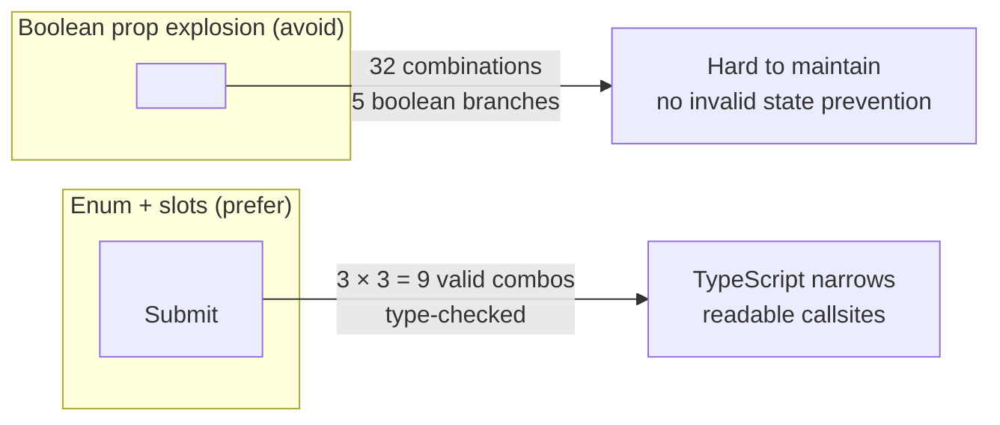

# [FEE-507] Component API Design — Props, Slots & Polymorphic Interfaces

:::info
A component's API is its contract with consumers. Teams MUST forward all unrecognized props onto the underlying native element using `{...rest}` — consuming all props internally breaks native HTML capabilities (ARIA attributes, `data-*` attributes, event handlers). Teams MUST support `ref` forwarding on any component that wraps a native DOM element. Teams SHOULD prefer `variant` / `size` enums and slot composition over boolean prop proliferation. Teams SHOULD implement the polymorphic `as`/`asChild` pattern when the root element is legitimately variable across usage contexts.
:::

## Introduction

Every component library eventually faces the same reckoning: the API that seemed clean on the first day becomes a liability on the hundredth. A `Button` that started with three props grows to fifteen. A `Card` that once accepted only `title` and `body` now has `headerLeft`, `headerRight`, `footerLeft`, `footerRight`, `isLoading`, `isCollapsible`, `isHighlighted`, `isFullBleed`. A team member adds a new prop for every new use case without stopping to ask whether the prop should exist at all, whether it belongs in the component or in the caller, or whether the existing prop surface already composes into the needed behavior. The result is a component API that nobody on the team can fully enumerate from memory, that generates a documentation page nobody reads in full, and that generates TypeScript errors that require consulting the source code to understand.

The discipline of component API design is the practice of treating the component's interface — its props, its slots, its forwarded attributes — as a first-class design artifact with the same intentionality applied to a REST API or a database schema. A well-designed component API is minimal: it exposes exactly the control that callers legitimately need and no more. It is transparent: callers can pass standard HTML attributes and receive native browser behavior without the component author having anticipated every possible use case. It is type-safe: TypeScript narrows the set of valid combinations, catching invalid usage at compile time rather than runtime. And it is stable: the shape of the API communicates something about which parts of the component's behavior are intentional design decisions versus implementation details that may change.

The React ecosystem has developed several patterns that represent current best practice for component API design: the `{...rest}` spread pattern for native prop forwarding, `forwardRef` (or React 19's implicit ref) for DOM ref access, enum props for variant and size control, slot composition for flexible content areas, and polymorphic root elements for components whose semantically correct root tag depends on context. Each of these patterns solves a specific class of API design problem. This article covers all of them in sufficient depth to understand not just the mechanics, but the reasoning — the failure mode each pattern prevents and the tradeoff it makes.

## Principle

Teams MUST forward all props not explicitly consumed by the component onto the underlying native element using rest-prop spreading (`{...rest}`). A component that consumes all incoming props internally without forwarding the remainder breaks native HTML capabilities that callers depend on: ARIA attributes like `aria-label`, `aria-describedby`, and `aria-expanded` cannot be applied without forwarding; `data-testid` and `data-cy` attributes used by automated test suites cannot be set; native event handlers like `onMouseEnter`, `onFocus`, and `onKeyDown` beyond those the component explicitly handles are silently dropped. Consuming all props is not a protective measure — it is a trap that makes the component impossible to integrate correctly with assistive technology, test automation, and native browser features.

Teams MUST support `ref` forwarding on any component that wraps a native DOM element. Callers use refs to measure layout, manage focus programmatically, integrate with third-party animation libraries, and implement compound interactions that span multiple components. A component that does not forward its ref forces callers to reach into the DOM with `document.querySelector`, which is fragile, bypasses React's ownership model, and fails in server-side rendering contexts. In React 18 and earlier, ref forwarding requires `forwardRef`. In React 19, refs are passed as regular props and the `forwardRef` wrapper is no longer required — teams working on React 19 codebases SHOULD use the simplified ref-as-prop approach, but MUST understand `forwardRef` for compatibility with existing libraries.

Teams SHOULD prefer `variant`, `size`, and `intent` enum props over boolean flag proliferation. When a component needs to express a set of mutually exclusive visual or behavioral modes, an enum prop encodes this exclusivity in the type system: `variant: 'solid' | 'outline' | 'ghost'` is valid in exactly three states; five boolean flags (`isPrimary`, `isOutline`, `isGhost`, `isDestructive`, `isSuccess`) are valid in thirty-two states, most of which are semantically meaningless or contradictory. TypeScript cannot prevent `isPrimary={true} isOutline={true}` but it can prevent `variant="both"`. Teams SHOULD prefer slot composition over prop-based content injection when the injected content is markup rather than a scalar value: a `leftIcon` prop that accepts a `ReactNode` is harder to document, test, and compose than a named slot pattern using `children` partitioning or Radix UI's `Slot` primitive.

Teams SHOULD implement the polymorphic `as` prop pattern (or the `asChild` pattern from Radix UI) when the component's root element is legitimately variable across usage contexts. A `Button` component that always renders a `<button>` cannot satisfy the use case of a button-styled link: wrapping it in an `<a>` produces invalid HTML (`<a><button>` is not permitted). The polymorphic pattern allows `<Button as="a" href="/dashboard">` to render as a semantically correct anchor element while preserving all of the component's visual logic. The `asChild` variant of this pattern — used by Radix UI and increasingly adopted across the ecosystem — inverts control even further: rather than the wrapper component choosing the element, the caller provides it as the child and the wrapper merges its props onto it. Teams MUST NOT make every component polymorphic by default; the pattern should be adopted only where the need for element flexibility is real and recurring.

## Design Thinking

The most useful mental model for component API design is the distinction between what the component owns and what the consumer owns. A component owns its visual and behavioral logic: the set of valid variants, the internal state transitions, the accessible semantics it guarantees. The consumer owns the integration context: the HTML attributes required for their specific accessibility implementation, the event handlers needed for their interaction model, the DOM ref needed for their layout calculation. The `{...rest}` pattern is the boundary between these two ownership domains. Everything the component consumes explicitly — `variant`, `size`, `loading`, `children` — is what the component owns. Everything forwarded through `{...rest}` is what the consumer owns.

The decision between a slot and a prop is the second most consequential API design choice. The general rule: use a prop when the value is a scalar (string, number, boolean, enum member) that the component can render and style on its own. Use a slot (a `ReactNode` prop, or composition through `children`) when the content is markup that the consumer needs to control. A `<Badge count={42} />` is correct as a prop: the component renders the number with its own formatting and styling. A `<Button leftIcon={<Spinner />} />` is correct as a slot: the component cannot know in advance what icon the caller will use, and forcing callers to pass the icon path as a string rather than a React element removes their ability to use their own icon component's animation, accessibility attributes, and theme integration. The line blurs when the component needs to apply styling to the slot content — which is where the `asChild` pattern becomes valuable, as it allows the component to merge its props onto the caller-provided element rather than wrapping it in an additional DOM node.

The decision between a fixed and polymorphic root element follows a clear heuristic: is there any legitimate use case where the component's correct HTML element differs from the default? For a `Card`, the answer is almost always no — cards are `<div>` elements in virtually every context. For a `Button`, the answer is often yes: a button-styled navigation item should be an `<a>` element for correct semantics and for link-specific browser behavior (middle-click to open in new tab, right-click to copy URL). For a `Heading`, the answer is definitively yes: the correct heading level depends on the document outline at the point of use, and a `Heading` component that always renders `<h2>` cannot serve a page that uses it at multiple outline levels. The polymorphic pattern adds complexity — both the implementation and the types are more involved — so it should be adopted only where the polymorphism is real, not as a premature generalization.

Boolean prop explosion deserves its own treatment because it is the most common component API failure mode in long-lived codebases. Consider a `Button` that started with `isPrimary` and `isSecondary` as the variant system. Over time a designer adds a ghost variant, adding `isGhost`. A destructive action pattern adds `isDangerous`. A loading state adds `isLoading`. A disabled override adds `isDisabled`. A full-width layout variant adds `isFullWidth`. These six booleans create sixty-four possible states. The TypeScript type for each is `boolean | undefined`, providing no information about which combinations are valid. The component's internal rendering logic becomes a series of nested conditions that must handle every combination. Test coverage must choose which of the sixty-four states to verify. And when a new engineer joins and reads a callsite with `isLoading isPrimary isFullWidth`, they cannot tell from the type alone which combinations they are permitted to use. Replace the variant booleans with `variant: 'primary' | 'secondary' | 'ghost' | 'danger'` and `size: 'sm' | 'md' | 'lg'` and `loading?: boolean` and `fullWidth?: boolean` — the latter two are genuine binary states, while the former two are genuine enumerations.

A fourth design consideration is the versioning strategy for the prop surface. Props that are added are easy to make non-breaking (add with a default value). Props that are renamed or removed require a major version bump or a deprecation period. Components that are widely used across a large codebase or published as a library should treat every new prop as a potential long-term commitment. A useful discipline is the "three use cases" rule: before adding a prop, identify at least three distinct, real callsites that would use it. If the prop is only needed by one callsite, the right answer is almost always to handle the variation in the callsite itself rather than encoding it in the component's permanent API.

**Design decision table:**

| Decision | Guideline |
|---|---|
| Extend HTML element vs. custom prop API | Spread `{...rest}` onto native element; add only what HTML lacks |
| Slot vs. prop for content | Slot when content is markup; prop when it is a scalar (string, number, boolean) |
| Fixed vs. polymorphic root element | Polymorphic when consumers legitimately need a different element (`button` → `<a>`, Next.js `<Link>`) |
| Optional variants | Enum prop (`variant`, `size`, `intent`) over boolean flags per variant |
| Ref access for DOM consumers | Always forward ref via `forwardRef` (React 18) or ref-as-prop (React 19) |
| Icon / decoration content | Named slot (`leftIcon`, `rightIcon`) accepting `ReactNode`, not string path |
| Shared behavior, flexible element | Use `asChild` to merge props onto caller-provided element |

## Best Practices

**Spread `{...rest}` onto the root native element, not onto a wrapper `<div>`.** When a component wraps a `<button>`, `{...rest}` must land on the `<button>`, not on a container `<div>`. Callers who pass `aria-label` or `onClick` expect those attributes to reach the interactive element, not its wrapper. If the component has both a wrapper element and an inner interactive element, identify which one is the semantic root — the one that callers will interact with, navigate to, and reference via ARIA relationships — and forward `{...rest}` to that element exclusively. Never spread rest onto multiple elements, as this will apply event handlers and ARIA attributes to multiple DOM nodes simultaneously.

**Strip own props from rest before forwarding.** If a component defines a custom prop named `variant`, and `variant` reaches a native DOM element, the browser logs a warning about an unrecognized attribute. TypeScript will often catch this if the component is typed correctly, but extra care is required with the polymorphic pattern, where the element type is dynamic. Use `Omit<ComponentPropsWithoutRef<E>, keyof OwnProps>` in the type definition, and destructure own props explicitly in the function signature — any prop destructured in the function signature and not re-spread is automatically removed from `rest`. Never use `delete props.variant` to filter — this mutates the incoming object.

**Always write `forwardRef` when wrapping a native element (React 18 and earlier).** The percentage of component library consumers who immediately need refs is low, but the cost of missing ref forwarding is extremely high — it requires a breaking API change to add later. Treat `forwardRef` as a non-optional default for any component whose root is a native element or a component that itself forwards refs. The function signature of the inner implementation function (`ButtonImpl` in the example below) accepts `ref` as the second argument and passes it to the root element's `ref` prop. When using the polymorphic pattern, the ref type should be `React.Ref<Element>` rather than a specific element type, because the concrete element type depends on the `as` prop which is not known statically.

**Use enum props for mutually exclusive visual modes.** Every time you are tempted to add a boolean prop that encodes a visual mode — `isOutline`, `isPrimary`, `isDanger`, `isSubtle` — ask instead: is this a member of an enumeration? If you already have `variant: 'solid'` and you want to add an outline mode, the correct change is `variant: 'solid' | 'outline'`, not a new `isOutline` prop alongside `variant`. TypeScript's discriminated unions and string literal types make this pattern zero-cost at runtime and provide autocomplete and error messages that boolean props cannot match.

**Keep the number of required props as close to zero as possible.** Every required prop is a tax on every callsite. If a prop has a sensible default — `variant = 'solid'`, `size = 'md'`, `loading = false` — make it optional with a default. Required props should be reserved for props where there is no sensible default and where the component cannot render meaningfully without them: a `label` for an icon-only button, a `href` for a link component, an `id` for a component that anchors ARIA relationships. A component with three required props has a lower adoption barrier than a component with six.

**Provide explicit TypeScript types for all prop-based slot content.** A prop typed as `ReactNode` is correct but provides no guidance about the expected shape of the node. Use inline comments in the interface to document intent: `/** A 16×16 icon component placed before the button label */`. For icon slots specifically, consider a union type that expresses the most common case: `leftIcon?: ReactNode` is general; `leftIcon?: React.ReactElement<{ size?: number; className?: string }>` is specific enough to catch misuse without being so specific that it fails on every icon library update. The right level of specificity depends on team size and how strictly the component library enforces icon usage.

**Document which HTML attributes the component intentionally overrides.** When a component always sets `role`, `type`, `aria-busy`, or any other HTML attribute internally, document this explicitly in the prop interface — either as a comment or by omitting the attribute from the forwarded type using `Omit`. If the component always sets `type="button"` on a `<button>` element (to prevent accidental form submission), callers who pass `type="submit"` will be surprised when their prop is overridden. Either allow callers to override the component's default (spread `{...rest}` after the internal attribute), or document that the prop is controlled and exclude it from the type.

**Co-locate prop defaults with the interface definition.** Default prop values should live at the function parameter destructuring site, not in a separate `defaultProps` object (which is deprecated in React and removed from function components in React 18+). Keeping defaults at the destructuring site makes them immediately visible when reading the component signature, eliminates a second source of truth for default values, and works correctly with TypeScript's type narrowing — TypeScript can see that `variant` is `'solid'` at the destructuring site and narrow subsequent uses accordingly. When a default depends on another prop (for example, the default icon size depends on the `size` prop), compute it inside the function body as a derived variable rather than in the parameter list.

**Audit the prop surface before every minor release.** Before tagging a new version, review every prop in the component interface with three questions: Is this prop used by more than one distinct callsite in the codebase? If the answer is no, consider removing it and handling the variation at the callsite. Does this prop overlap in meaning with another prop, creating two ways to express the same thing? If yes, deprecate one and document the canonical form. Does this prop accept a shape that will force a breaking change if the component's internal implementation changes? If yes, widen the type or introduce an abstraction layer before the type hardens. This audit disciplines the team against API drift and is most effective when done before a version is tagged, not after consumers have already adopted the new interface.

## Mermaid Diagram



The left path represents the result of incremental prop accretion: each individual boolean addition was rational in isolation, but the cumulative effect is an API surface where the valid and invalid combinations are indistinguishable from the type. The right path shows that the same expressive range — solid large loading button — requires two enum props and one boolean, covers nine valid size-by-variant combinations rather than thirty-two boolean combinations, and produces a TypeScript error for `variant="invalid"` rather than silently applying no variant at all.

## Example

### Polymorphic `Button` component with ref forwarding

The following implementation demonstrates the full pattern: polymorphic `as` prop with TypeScript generics, `{...rest}` forwarding, explicit own-prop stripping, `forwardRef` with the standard generic cast workaround, and accessible state management for the loading state.

```tsx
// src/components/Button.tsx
import { forwardRef, type ElementType, type ComponentPropsWithoutRef, type ReactNode } from 'react';

// Strip own props before merging with element props to avoid conflicts
type ButtonOwnProps<E extends ElementType = 'button'> = {
  as?: E;
  variant?: 'solid' | 'outline' | 'ghost';
  size?: 'sm' | 'md' | 'lg';
  loading?: boolean;
  children?: ReactNode;
};

// Polymorphic props: ButtonOwnProps merged with inferred element props (minus own keys)
export type ButtonProps<E extends ElementType = 'button'> = ButtonOwnProps<E> &
  Omit<ComponentPropsWithoutRef<E>, keyof ButtonOwnProps<E>>;

const variantClasses: Record<NonNullable<ButtonOwnProps['variant']>, string> = {
  solid: 'bg-blue-600 text-white hover:bg-blue-700',
  outline: 'border border-blue-600 text-blue-600 hover:bg-blue-50',
  ghost: 'text-blue-600 hover:bg-blue-50',
};

const sizeClasses: Record<NonNullable<ButtonOwnProps['size']>, string> = {
  sm: 'px-3 py-1 text-sm',
  md: 'px-4 py-2 text-base',
  lg: 'px-6 py-3 text-lg',
};

// forwardRef with generics requires a cast — this is the standard workaround
function ButtonImpl<E extends ElementType = 'button'>(
  { as, variant = 'solid', size = 'md', loading = false, children, ...rest }: ButtonProps<E>,
  ref: React.Ref<Element>
) {
  const Component = (as ?? 'button') as ElementType;
  return (
    <Component
      ref={ref}
      disabled={loading || (rest as { disabled?: boolean }).disabled}
      aria-busy={loading}
      className={`inline-flex items-center rounded font-medium transition-colors
        ${variantClasses[variant]} ${sizeClasses[size]}
        disabled:opacity-50 disabled:cursor-not-allowed`}
      {...rest}
    >
      {loading ? <span className="mr-2 animate-spin">⟳</span> : null}
      {children}
    </Component>
  );
}

export const Button = forwardRef(ButtonImpl) as <E extends ElementType = 'button'>(
  props: ButtonProps<E> & { ref?: React.Ref<Element> }
) => React.ReactElement;
```

Several design decisions in this implementation are worth examining closely:

- **`ButtonOwnProps` is generic over `E`.** Although the own props do not reference `E` directly, making `ButtonOwnProps` generic allows `ButtonProps` to correctly omit the own-prop keys from `ComponentPropsWithoutRef<E>`. Without the generic, TypeScript cannot narrow the merged type correctly when `E` changes.
- **`Omit<ComponentPropsWithoutRef<E>, keyof ButtonOwnProps<E>>`.** This is the key to avoiding prop collisions. Without the `Omit`, a caller could pass `as="input"` and the `type` prop could collide with `ComponentPropsWithoutRef<'input'>['type']` if the component defined its own `type` prop. The `Omit` ensures that consumer-facing own props always win over the inferred element props when there is a name conflict.
- **`disabled` and `aria-busy` are set internally before `{...rest}`.** Because `{...rest}` is spread after the explicit attributes, a caller who explicitly passes `disabled={false}` will override the component's loading-based disabled state — the last write wins. Whether this override is desired depends on the component's contract; document it explicitly if it is intentional.
- **The `forwardRef` cast.** TypeScript's `forwardRef` does not support generic function parameters in its default typing. The standard workaround is to define the implementation as a generic function (`ButtonImpl`), wrap it with `forwardRef`, and then cast the result to a generic function type that includes the `ref` prop. This cast is safe because the runtime behavior is correct; the type assertion is purely to restore the generic signature in the public API.

### Usage examples

```tsx
// Renders as <button> — default
<Button variant="solid" size="md" onClick={() => save()}>Save</Button>

// Renders as <a> — href and other anchor props are inferred by TypeScript
<Button as="a" href="/dashboard" variant="ghost">Dashboard</Button>

// Renders as Next.js Link — all Link props (href object, locale, prefetch) are inferred
<Button as={Link} href="/settings" variant="outline">Settings</Button>

// ref forwarding — ref is typed and passed through to the underlying DOM element
const ref = useRef<HTMLButtonElement>(null);
<Button ref={ref} variant="solid">Focus me</Button>

// ARIA attributes forwarded through rest — no special handling required
<Button
  aria-label="Delete item"
  aria-describedby="delete-description"
  data-testid="delete-btn"
  variant="outline"
  onClick={handleDelete}
>
  Delete
</Button>
```

### React 19: ref as a regular prop

In React 19, the `forwardRef` wrapper is no longer required. Refs are passed as regular props, which eliminates the need for the generic cast workaround:

```tsx
// React 19: ref is a regular prop — no forwardRef required
function Button<E extends ElementType = 'button'>({
  as,
  variant = 'solid',
  size = 'md',
  loading = false,
  children,
  ref,
  ...rest
}: ButtonProps<E> & { ref?: React.Ref<Element> }) {
  const Component = (as ?? 'button') as ElementType;
  return (
    <Component
      ref={ref}
      disabled={loading || (rest as { disabled?: boolean }).disabled}
      aria-busy={loading}
      className={`inline-flex items-center rounded font-medium transition-colors
        ${variantClasses[variant]} ${sizeClasses[size]}
        disabled:opacity-50 disabled:cursor-not-allowed`}
      {...rest}
    >
      {loading ? <span className="mr-2 animate-spin">⟳</span> : null}
      {children}
    </Component>
  );
}
```

This simplification is significant for polymorphic components because the generic cast workaround was one of the more opaque aspects of the pattern. Teams upgrading to React 19 SHOULD remove `forwardRef` wrappers incrementally — the old API is not deprecated immediately, so migration can be gradual.

### The `asChild` pattern (Radix UI style)

The `as` prop pattern works well when the target element is a known HTML element or a component with a compatible prop interface. The `asChild` pattern inverts the control: instead of the wrapper component choosing the element based on `as`, the caller provides the element as a child, and the wrapper merges its props and behavior onto it.

```tsx
import { Slot } from '@radix-ui/react-slot';

type ButtonProps = {
  asChild?: boolean;
  variant?: 'solid' | 'outline' | 'ghost';
  size?: 'sm' | 'md' | 'lg';
  className?: string;
  children?: React.ReactNode;
} & React.ButtonHTMLAttributes<HTMLButtonElement>;

export function Button({
  asChild = false,
  variant = 'solid',
  size = 'md',
  className,
  children,
  ...rest
}: ButtonProps) {
  const Component = asChild ? Slot : 'button';
  return (
    <Component
      className={`inline-flex items-center rounded font-medium
        ${variantClasses[variant]} ${sizeClasses[size]} ${className ?? ''}`}
      {...rest}
    >
      {children}
    </Component>
  );
}

// Usage: Button renders as Next.js Link — Link receives Button's className and event handlers
<Button asChild variant="solid">
  <Link href="/dashboard">Go to Dashboard</Link>
</Button>
```

The `asChild` approach is simpler to type (no generics required) and more composable (the caller chooses the element explicitly at the callsite rather than naming it via a prop). The tradeoff is that `asChild` requires the caller to always provide a single React element as the child — it breaks if the child is a string or a fragment. The `as` prop approach is more forgiving in that sense. Most modern component libraries (shadcn/ui, Radix Primitives) default to the `asChild` pattern for polymorphism.

## Common Mistakes

**Prop name collisions with HTML attributes.** Naming a component prop `label` creates a collision with the HTML `<label>` element when the component is used with the polymorphic `as="label"`. Naming a prop `for` clashes with the HTML `for` attribute (which React represents as `htmlFor`). Naming a prop `class` clashes with `className`. The safest rule: avoid naming component props after any HTML global attribute or any HTML element name. Prefer descriptive, component-specific names: `accessibleLabel` over `label`, `labelText` over `label`, `ariaLabel` over `aria-label` (though `aria-*` props should always be passed through rest, not given special treatment).

**Spreading `{...props}` onto non-native elements and passing invalid DOM attributes.** When a component is polymorphic and the target element is a `<div>` or any other native element, custom props like `variant="solid"` must be stripped before the spread reaches the DOM. The browser ignores unrecognized attributes on HTML elements, but React logs a warning for every unknown prop on a native element. This is not just a console noise issue: it indicates that your prop filtering logic is incomplete. The correct fix is the `Omit` pattern in the type definition combined with destructuring in the function signature — any prop that is destructured by name in the function parameters is automatically removed from `rest` and will not be forwarded.

**Boolean prop explosion.** Five boolean flags (`isLoading`, `isDisabled`, `isFullWidth`, `isRounded`, `isOutline`) create thirty-two theoretical combinations, most of which are semantically nonsensical. `isRounded={true} isOutline={false} isLoading={true} isFullWidth={false} isPrimary={true}` is valid from a type perspective but represents an unlikely and possibly unintended combination. Replace variant-level booleans with a `variant` enum and size-level booleans with a `size` enum. Reserve the boolean prop form for genuinely binary states: `loading`, `disabled`, `fullWidth` — states that are independent of variant and size and that combine orthogonally with them.

**Forgetting to forward ref on interactive components.** A `Button`, `Input`, `Select`, `TextArea`, or any other interactive component that does not forward its ref is incompatible with focus management libraries, form libraries (React Hook Form's `register` function returns a ref), accessibility tools that programmatically move focus, and any test that uses `ref` to assert on element state. This is one of the API design mistakes that requires a breaking change to fix after the fact, because adding `forwardRef` technically changes the component's function signature. Establish it as a non-optional default from the first day a component wraps a native element.

**Omitting TypeScript from the polymorphic implementation.** The polymorphic `as` prop without generics — simply typing `as?: React.ElementType` — compiles and runs correctly, but loses the prop inference that makes the pattern valuable. Without generics, `<Button as="a">` does not infer that `href` is a valid prop, and `<Button as={Link}>` does not infer that Next.js `Link`'s `prefetch` or `locale` props are available. The generic implementation with `ComponentPropsWithoutRef<E>` and `Omit` is longer and requires the `forwardRef` cast, but it is the version that provides the full developer experience. If the generic complexity is not maintainable for the team, prefer the `asChild` pattern instead — it is simpler to implement and type, at the cost of requiring the caller to provide an explicit child element.

**Using non-semantic prop names to hide implementation details.** A prop named `type` on a `Button` could mean the HTML `type` attribute (`button`, `submit`, `reset`) or it could mean the component's visual type (equivalent to `variant`). A prop named `color` on a `Text` component could mean an actual CSS color value or it could be an alias for `variant` where `'primary'` happens to be blue. Use the HTML attribute name when the prop maps directly to an HTML attribute, and use a distinct component-vocabulary name (`variant`, `intent`, `tone`) when the prop is a component-level abstraction. Mixing the two namespaces at the same prop level produces confusion that accumulates over time as the component is used by engineers who are not familiar with its history.

## Related FEEs

- [FEE-501: Component Composition Patterns](./501.md) — slots are the composition interface; this article covers the API surface that makes composition possible
- [FEE-503: Headless Components & Renderless Patterns](./503.md) — headless components expose their prop factories as the API surface; the design principles here apply directly to headless prop design
- [FEE-901: Design Tokens](../Design%20Systems%20and%20UI%20Libraries/901.md) — component API is the surface where design tokens are consumed; `variant` and `size` props map to token scales

## References

- [React Docs — Passing Props to a Component](https://react.dev/learn/passing-props-to-a-component) — the foundational React documentation covering prop forwarding, rest spreading, and the mental model of props as the component's public interface
- [Radix UI — `asChild` documentation](https://www.radix-ui.com/primitives/docs/utilities/slot) — the Radix `Slot` primitive that powers the `asChild` pattern, with explanation of when to use it over the `as` prop approach and how it merges props and refs
- [TypeScript Handbook — Generics](https://www.typescriptlang.org/docs/handbook/2/generics.html) — the TypeScript documentation for generic types, which underpins the `ComponentPropsWithoutRef<E>` + `Omit` pattern for polymorphic component prop inference
- [Brad Frost — Atomic Design, Chapter 2](https://atomicdesign.bradfrost.com/chapter-2/) — the foundational framework for thinking about components as atoms, molecules, and organisms, which informs the question of what a component API should expose versus compose
- [React 19 Release Notes — ref as a prop](https://react.dev/blog/2024/12/05/react-19#ref-as-a-prop) — the React 19 change that removes the need for `forwardRef`, with migration guidance and the rationale for the API simplification
- [Matt Pocock — Polymorphic Components in TypeScript](https://www.totaltypescript.com/react-component-props-with-as-prop) — a detailed walkthrough of the `ComponentPropsWithoutRef<E>` + `Omit` + `forwardRef` cast pattern, including the edge cases and the reasoning behind each type-level decision
- [Ariakit Blog — Component Design Principles](https://ariakit.org/guide/component-providers) — the Ariakit library's documentation on their component API design philosophy, covering the `render` prop as an alternative to `asChild` and the tradeoffs between each approach
- [shadcn/ui Source — Button component](https://github.com/shadcn-ui/ui/blob/main/apps/www/registry/default/ui/button.tsx) — a widely-referenced production implementation of the `asChild` + `variant` + `size` pattern using Radix `Slot`, `class-variance-authority`, and `forwardRef`, illustrating how the patterns in this article appear in a real shared component library
