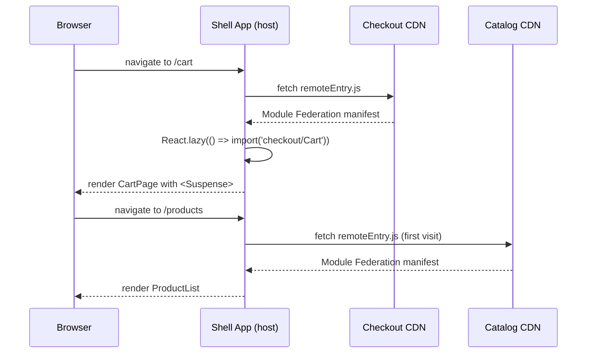

# [FEE-508] Micro-Frontend Architecture

:::info
Micro-frontends decompose a web application into independently deployable UI units aligned with team or domain boundaries. Teams MUST declare shared library singletons (`react`, `react-dom`, router) in Module Federation config — duplicate instances cause broken React context and "invalid hook call" errors. Teams MUST NOT couple micro-frontends via shared global state; inter-MFE communication SHOULD use a custom event bus or a minimal, versioned shared contract. Teams SHOULD NOT adopt micro-frontends for applications with fewer than 3 teams or fewer than 20 routes — the operational overhead will outweigh the benefits.
:::

## Introduction

The monolithic frontend served web development well for a long time. A single repository, a single build pipeline, a single deployment — the entire application shipped as one coherent artifact. For small teams working on products with a manageable scope, this model remains the right answer. But as organizations scale, the monolith accumulates costs that are invisible in a team of five and crippling in a team of fifty: a change in one team's feature triggers a full rebuild and retest of the entire application, a shared main branch becomes a coordination bottleneck as dozens of engineers compete to merge, and a framework decision made in 2019 constrains every team in 2026 regardless of whether it still represents the best tool for their particular domain.

Micro-frontends are the architectural response to this organizational scaling problem. The term, popularized by Martin Fowler and Sam Newman in the mid-2010s and given a durable technical foundation by Webpack 5's Module Federation in 2020, refers to the practice of decomposing a web application into independently owned, independently built, and independently deployed UI units — each one the frontend responsibility of a single product team. The decomposition mirrors the organizational boundary: the team that owns the checkout domain owns the checkout micro-frontend; the team that owns the product catalog owns the catalog micro-frontend. Coordination happens through contracts — the public API exposed by each remote — rather than through shared code, shared branches, or shared deployment pipelines.

The promise of micro-frontends is genuine, but so is the complexity they introduce. An architecture that treats each MFE as an independently deployable runtime unit adds network hops for module loading, creates surface area for version compatibility issues between remotes and the host shell, and requires discipline around inter-MFE communication that a monolith never demands. Understanding when micro-frontends solve real problems and when they merely add infrastructure for its own sake is as important as understanding how to implement them correctly. This article covers both dimensions: the decision framework for when micro-frontends are appropriate, the technical mechanics of each integration strategy, and the operational discipline required to avoid the most common failure modes.

## Design Thinking

The central design tension in micro-frontend architecture is the tradeoff between isolation and integration. Maximum isolation — each MFE served in a fully sandboxed iframe — eliminates every class of cross-MFE interference: no shared state, no shared DOM, no shared JavaScript runtime. But it also eliminates the things that make a web application feel coherent: shared authentication state, shared navigation, shared scroll position, a unified URL model. Minimum isolation — all MFEs imported as modules and composed in a single JavaScript runtime — enables the tightest integration and the best user experience, but reintroduces the coordination requirements that micro-frontends are supposed to eliminate. Every integration strategy is a point on this spectrum, and choosing the right point requires understanding which dimensions of isolation the product actually needs.

The decision of whether to adopt micro-frontends at all is the most consequential one, and it is organizational as much as it is technical. Micro-frontends solve a deployment coordination problem. If the teams working on a product are not blocked by deployment coordination — if they can ship their features to production independently without waiting for other teams' approval, testing, or release windows — then micro-frontends solve a problem that does not exist. The overhead they introduce (network hops, runtime version negotiation, cross-remote debugging, environment URL management) is real overhead that consumes engineering time. Before committing to a micro-frontend architecture, teams SHOULD audit their actual deployment frequency and identify the specific coordination bottlenecks that the architecture would remove. If the bottlenecks are social (process, communication) rather than architectural (shared artifacts, shared pipelines), the micro-frontend is unlikely to help.

The integration strategy choice — Module Federation, Web Components, or iframes — should be driven by the isolation requirement and the framework reality of the teams involved. Module Federation provides the best developer experience when all remotes share a common framework (React, Vue, or similar), because the shared singleton mechanism ensures that framework instances, hooks, and context are shared correctly. Web Components provide framework-agnostic isolation at the cost of higher serialization overhead (all data must cross the custom element boundary via attributes or events, not as JavaScript values) and the loss of framework-native composition patterns (React children, Vue slots). iframes provide the strictest isolation and are the correct choice when remotes run by third parties must be embedded without any trust relationship — payment widgets, advertising, embedded analytics — but they break URL, scroll, focus, and authentication integration in ways that require significant engineering effort to paper over.

**Design decision table:**

| Scenario | Micro-Frontend | Monorepo Monolith |
|---|---|---|
| 5+ independent teams on one URL | Yes | No |
| Teams need independent deploy cadence | Yes | No |
| Teams use different frameworks | Yes (iframes as last resort) | No |
| Single team, fewer than 20 routes | No | Yes |
| Performance budget critical (TTI) | Caution — extra network hops | Prefer |
| Shared design system across all parts | Via Module Federation shared | Better as versioned npm package |

The performance consideration deserves elaboration. Each remote's `remoteEntry.js` manifest must be fetched before the remote's modules can be loaded. On a cold load with an empty cache, a page that composes three remotes adds three sequential or parallel network round trips to the critical rendering path before any remote UI can render. The `React.lazy` + `Suspense` pattern mitigates this by deferring remote loading until the user navigates to a route that requires it — users who never visit the checkout route never pay the cost of fetching the checkout remote. But on routes that compose multiple remotes simultaneously, the fetch latency accumulates. Teams with a strict Time-to-Interactive budget SHOULD measure actual remote load times under their target network conditions before committing to a micro-frontend architecture.

A secondary performance consideration is the shared chunk graph. When Module Federation shares
`react` and `react-dom` as singletons, those packages are loaded once from whichever contributor
(host or remote) provides the highest compatible version. But all other modules — the component
library, utility functions, custom hooks — are either bundled independently into each remote or
explicitly shared. If a large utility is not declared as shared, every remote that imports it
pays the full bundle cost individually. Auditing the shared module configuration with the
Webpack Bundle Analyzer or equivalent is a recurring maintenance task in any Module Federation
deployment — shared module drift, where each remote accumulates its own copy of packages that
should be shared, is one of the most common causes of unexpected bundle growth in micro-frontend
architectures.

**Integration strategies ranked by coupling (low to high isolation):**

1. **Module Federation** (Webpack 5+, Vite via `@originjs/vite-plugin-federation`) — runtime composition, shared framework instances, best DX. The shell fetches each remote's `remoteEntry.js` manifest at runtime and resolves module imports from the remote's chunk graph. Framework singletons are shared via the Module Federation shared scope. The developer experience is close to working in a monorepo: remotes are imported with standard import syntax and composed with `React.lazy`.

2. **Web Components** — framework-agnostic, no shared instances, higher serialization overhead. Each MFE exposes custom elements (`<checkout-cart>`, `<catalog-product-list>`). The shell composes them as HTML elements. Framework instances are not shared — each MFE bundles its own copy of its framework. Attributes must be serializable, which rules out React elements and complex objects without JSON serialization.

3. **iframes** — full isolation, no shared state, broken UX (scroll, focus, URL, auth). Each MFE is served at its own URL and embedded as an `<iframe>`. Communication happens via `postMessage`. The iframe boundary is impenetrable from a JavaScript perspective, which provides maximum security isolation but requires engineering effort to achieve coherent UX: the parent must manually synchronize the iframe's scroll position, forward focus events, keep the address bar URL in sync with the iframe's internal navigation, and proxy authentication cookies or tokens.

## Best Practices

**Declare all shared singletons in both host and remote configs.** The Module Federation shared scope is populated by contributions from both the host shell and every remote. If the host declares `react` as `singleton: true` but a remote does not, that remote will load its own bundled copy of React regardless of what the host provides. Every `webpack.config.js` (or `vite.config.ts` with `@originjs/vite-plugin-federation`) in the federation graph MUST include the same `shared` configuration for `react`, `react-dom`, and the router. Establish this as a template in a shared `federation.config.js` file at the monorepo root and have each package extend it, so that new remotes start with the correct configuration by default.

**Set `eager: false` on all shared singletons in the shell.** The `eager: true` flag on a shared singleton causes the Module Federation runtime to include that singleton in the shell's initial chunk, which is loaded synchronously before any remote is fetched. This eliminates the async initialization step required by Module Federation (the `bootstrap.js` / dynamic `import()` wrapper) but adds the singleton's weight to the shell's initial bundle. Set `eager: false` (the default) and wrap the shell's entry point in a dynamic import to keep the shell startup lean. The `checkout` remote will resolve the shared React from the host's shared scope when it loads — the async resolution is handled by the Module Federation runtime transparently.

**Always lazy-load remotes behind `React.lazy` + `Suspense`.** Eager-loading all remotes at shell startup means every user pays the latency cost of fetching every remote's `remoteEntry.js` manifest and initial chunks on the first page load, even if they never visit the routes that use those remotes. Wrap every federated import in `React.lazy` and render it inside a `<Suspense>` boundary with a meaningful fallback. The fallback should be a skeleton that matches the layout of the remote's UI — a shimmer placeholder for the cart, a grid skeleton for the product list — rather than a generic spinner, so that the loading state does not produce a jarring layout shift when the remote resolves.

**Implement cross-MFE communication with a typed event bus, not shared state.** Shared state between remotes — a Zustand store imported via Module Federation, a Redux store instance passed through a shared module — creates the runtime coupling that independent deployability is supposed to eliminate. When the store's shape changes, every remote that reads it must be updated and redeployed simultaneously. The event bus pattern decouples producer from consumer: the checkout remote emits a `cart:updated` event with a typed payload; the shell listens for it and updates the cart badge count; neither the shell nor the catalog remote needs to know anything about how the checkout remote manages its internal cart state. Define the event payload types in a small, versioned `@acme/mfe-contracts` package that all remotes can depend on as a dev dependency — this gives you changelog discipline and TypeScript safety on the communication boundary without creating a runtime coupling.

**Pin `remoteEntry.js` URLs to environment-specific configuration, not hard-coded strings.** Hard-coding `checkout@https://checkout.acme.com/remoteEntry.js` in `webpack.config.js` ties every environment (local development, staging, production) to the production URL. Local development requires a running production checkout service. Staging cannot test against a staging checkout remote. Use environment variables (`CHECKOUT_REMOTE_URL`) injected at build time (via `DefinePlugin` or Vite's `loadEnv`) to make the remote URL configurable per environment. In local development, point all remote URLs to locally running instances or to a shared staging deployment. This also enables the "strangler fig" migration pattern, where a new remote version can be tested in staging before being promoted to production without any shell code change.

**Version your exposed modules explicitly and communicate breaking changes.** A remote that changes the props interface of its exposed `Cart` component — adding a required prop, removing a prop, changing a prop type — creates a runtime failure in any shell version that loads the updated remote without a corresponding shell update. Module Federation does not provide any mechanism for type-checking across the remote boundary at build time. Treat every change to an exposed module's public interface as a breaking change that requires coordination with shell maintainers. Consider maintaining a `CHANGELOG.md` for each remote's exposed modules, adopting semantic versioning for the `remoteEntry.js` filename (e.g., `remoteEntry@2.js`), or running integration tests that load the actual remote manifest from a staging URL and verify that the shell can compose it without errors.

**Test the federation boundary in integration, not just unit tests.** Unit tests within a remote verify the remote's internal logic but provide no signal about whether the remote composes correctly with the shell. Add integration tests that start the shell and one or more remotes and verify that cross-boundary interactions work: the shell can mount the Cart component from the checkout remote, the cart:updated event propagates correctly to the shell's badge count, the shared React singleton is resolved from the shared scope and not duplicated. These tests are best run against actual `remoteEntry.js` manifests served from a local dev server rather than against mocked versions, because the Module Federation runtime behavior cannot be fully simulated by mocking.

**MUST declare all shared framework singletons as `singleton: true` in both host and remote configs, and MUST specify `requiredVersion` alongside each singleton.** The `singleton: true` flag is a correctness requirement, not a performance optimization. Version mismatch warnings from the Module Federation runtime MUST be treated as errors in CI — deployments that introduce singleton version mismatches MUST be blocked.

**MUST NOT couple micro-frontends via direct cross-remote imports of state stores, context providers, or internal modules.** The only safe cross-remote import is of explicitly exposed, versioned, public contracts. Direct internal imports defeat independent deployability.

**SHOULD NOT adopt micro-frontends for applications with fewer than three independent teams or fewer than twenty routes.** Below this threshold, the operational overhead — separate CI pipelines, URL coordination across environments, shared dependency version management, cross-remote debugging — exceeds the benefit. A monorepo monolith with internal package boundaries provides the same code organization benefit with none of the runtime complexity.

**Establish a clear ownership model for the shell app.** The shell app — the host that loads and composes remotes — is itself a micro-frontend in the sense that it is owned by a team and deployed independently. Resist the temptation to put shared product features in the shell: navigation, authentication, the design system header and footer. These are appropriate for the shell; product features are not. When product logic accumulates in the shell, the shell becomes a deployment bottleneck again — every product team's changes that affect shared shell behavior require a shell deployment. Keep the shell's responsibility narrow: routing, authentication orchestration, remote loading, the global layout chrome, and the event bus initialization.

## Mermaid Diagram



The sequence illustrates the lazy-load pattern: the shell fetches each remote's `remoteEntry.js` manifest only on the first navigation to a route that requires that remote, not at shell startup. The manifest tells the Module Federation runtime where to find the remote's chunks and which packages it contributes to the shared scope. Subsequent navigations to `/cart` reuse the already-loaded checkout modules from the browser's module cache — the `remoteEntry.js` fetch is a one-time cost per session per remote. The `<Suspense>` boundary in the shell's routing layer renders the skeleton fallback during the manifest fetch and the initial chunk load, preventing the layout from blocking on remote resolution.

## Example

### Host and remote Module Federation configuration

The following example shows a complete host shell and checkout remote configuration using Webpack 5's Module Federation plugin, followed by the shell's lazy-loading page component and the cross-MFE event bus.

```js
// host/webpack.config.js
const { ModuleFederationPlugin } = require('webpack').container;

module.exports = {
  mode: 'production',
  plugins: [
    new ModuleFederationPlugin({
      name: 'shell',
      remotes: {
        checkout: 'checkout@https://checkout.acme.com/remoteEntry.js',
        catalog:  'catalog@https://catalog.acme.com/remoteEntry.js',
      },
      shared: {
        react: {
          singleton: true,
          requiredVersion: '^18.0.0',
          eager: false, // lazy-load — do not block shell startup
        },
        'react-dom': {
          singleton: true,
          requiredVersion: '^18.0.0',
          eager: false,
        },
        'react-router-dom': {
          singleton: true,
          requiredVersion: '^6.0.0',
        },
      },
    }),
  ],
};
```

```js
// checkout/webpack.config.js
const { ModuleFederationPlugin } = require('webpack').container;

module.exports = {
  mode: 'production',
  output: {
    publicPath: 'https://checkout.acme.com/',
  },
  plugins: [
    new ModuleFederationPlugin({
      name: 'checkout',
      filename: 'remoteEntry.js',
      exposes: {
        './Cart':    './src/Cart',
        './Summary': './src/OrderSummary',
      },
      shared: {
        react:       { singleton: true, requiredVersion: '^18.0.0' },
        'react-dom': { singleton: true, requiredVersion: '^18.0.0' },
        'react-router-dom': { singleton: true, requiredVersion: '^6.0.0' },
      },
    }),
  ],
};
```

Several configuration decisions are worth noting. The host sets `eager: false` on `react` and `react-dom` to keep the shell's initial chunk lean — the Module Federation async initialization pattern (a thin `bootstrap.js` that does a dynamic `import('./App')`) is required when `eager` is false. The remote sets `publicPath` explicitly to its CDN URL; without this, Webpack cannot correctly resolve the remote's chunk URLs from the host's origin. The `filename: 'remoteEntry.js'` on the remote is the manifest file that the host fetches when resolving `checkout@https://checkout.acme.com/remoteEntry.js`.

### Shell page component with lazy loading

```tsx
// host/src/pages/CartPage.tsx
import React, { Suspense } from 'react';
import { CartSkeleton } from '../components/CartSkeleton';

// Lazy import from the federated remote — resolved at runtime
const Cart = React.lazy(() => import('checkout/Cart'));

export function CartPage() {
  return (
    <Suspense fallback={<CartSkeleton />}>
      <Cart />
    </Suspense>
  );
}
```

The `import('checkout/Cart')` call is resolved by the Module Federation runtime, not by the standard module bundler. At build time, Webpack sees the `checkout/` prefix, looks it up in the `remotes` config, and generates the runtime code that fetches `remoteEntry.js` from `https://checkout.acme.com/`, reads the manifest to find the chunk that exposes `./Cart`, fetches that chunk, and resolves the module. The entire resolution happens asynchronously — which is why `React.lazy` is required. The `CartSkeleton` fallback renders while the remote manifest and initial chunks are in flight, giving the user visible layout structure immediately rather than a blank area.

### Cross-MFE event bus

```ts
// host/src/lib/eventBus.ts — cross-MFE communication without shared state
type EventMap = {
  'cart:updated': { itemCount: number };
  'user:logged-in': { userId: string };
};

const bus = new EventTarget();

export function emit<K extends keyof EventMap>(event: K, detail: EventMap[K]) {
  bus.dispatchEvent(new CustomEvent(event, { detail }));
}

export function on<K extends keyof EventMap>(
  event: K,
  handler: (detail: EventMap[K]) => void
) {
  const listener = (e: Event) => handler((e as CustomEvent).detail);
  bus.addEventListener(event, listener);
  return () => bus.removeEventListener(event, listener);
}
```

The event bus is implemented on a single `EventTarget` instance that lives in the shell's module scope. The shell exposes it as a Module Federation shared module (or the types are published as `@acme/mfe-contracts`) so that remotes can import `emit` and `on`. Because the `EventTarget` instance is a singleton in the shared scope, all remotes and the shell share the same bus without any global variable or window-level mutation.

Usage in the checkout remote:

```ts
// checkout/src/Cart.tsx (excerpt)
import { emit } from 'shell/eventBus'; // or from '@acme/mfe-contracts'

function addToCart(item: CartItem) {
  cartStore.add(item);
  emit('cart:updated', { itemCount: cartStore.items.length });
}
```

Usage in the shell to update the navigation badge:

```tsx
// host/src/components/NavBar.tsx (excerpt)
import { on } from './lib/eventBus';
import { useEffect, useState } from 'react';

export function NavBar() {
  const [cartCount, setCartCount] = useState(0);

  useEffect(() => {
    return on('cart:updated', ({ itemCount }) => setCartCount(itemCount));
  }, []);

  return <nav>... Cart ({cartCount}) ...</nav>;
}
```

### Vite configuration with `@originjs/vite-plugin-federation`

For Vite-based projects, the `@originjs/vite-plugin-federation` package provides a Module Federation-compatible plugin. The API mirrors Webpack's Module Federation plugin closely:

```ts
// vite.config.ts (host)
import { defineConfig } from 'vite';
import federation from '@originjs/vite-plugin-federation';

export default defineConfig({
  plugins: [
    federation({
      name: 'shell',
      remotes: {
        checkout: 'https://checkout.acme.com/assets/remoteEntry.js',
        catalog:  'https://catalog.acme.com/assets/remoteEntry.js',
      },
      shared: ['react', 'react-dom', 'react-router-dom'],
    }),
  ],
  build: {
    target: 'esnext', // required — module federation uses top-level await
    minify: false,
  },
});
```

Note that `@originjs/vite-plugin-federation` requires `build.target: 'esnext'` because the generated federation runtime uses top-level `await`. This is a meaningful constraint: it limits browser support to environments that support ESM with top-level await (Chrome 89+, Firefox 89+, Safari 15+). Teams targeting older browsers MUST use Webpack 5 for Module Federation or polyfill the top-level await via Vite's `@vitejs/plugin-legacy`. As of 2024, the Vite team is working on a native Module Federation implementation, but the `@originjs/vite-plugin-federation` plugin remains the most widely adopted Vite path for federation in production.

## Common Mistakes

**Cross-remote direct store access.** Importing `import { useCartStore } from 'checkout/store'` in the catalog remote creates a hard build-time and runtime dependency on the checkout remote's internal state management. This coupling means the catalog remote cannot be built or tested without the checkout remote being present and its store shape being stable. More critically, the checkout team cannot refactor their store implementation without coordinating with every remote that imports it. The correct pattern is for the checkout remote to communicate state changes outward via the event bus, and for consuming remotes to maintain their own local copy of any checkout state they need.

**Eager-loading all remotes on shell startup.** Setting `eager: true` on all shared dependencies, or importing remote modules at the top level of the shell's entry point without `React.lazy`, forces all remote manifests and their initial chunks to be fetched before the shell renders anything. A shell that composes five remotes will make five parallel `remoteEntry.js` fetches before the user sees any UI. On a mobile connection, each fetch adds 100–500ms of latency. Wrap every remote module in `React.lazy(() => import('checkout/Cart'))` and place the `React.lazy` call inside the route component or behind a route guard, so that the remote is only fetched when the user navigates to a route that requires it.

**Skipping the `bootstrap.js` async initialization wrapper.** When any shared dependency is configured with `eager: false` (which is the default), the Module Federation runtime requires that the shell's actual application code be loaded asynchronously. This is accomplished by making the shell's webpack entry point a thin file that does nothing except `import('./bootstrap')`, where `bootstrap.js` contains the actual `ReactDOM.render` / `createRoot` call. Skipping this wrapper and putting the render call directly in the entry point produces an error: "Shared module is not available for eager consumption." This error is confusing but has a mechanical fix — add the `bootstrap.js` indirection.

## Related FEEs

- [FEE-805: Monorepos & Workspaces](../Build%20Tooling%20and%20Module%20Systems/805.md) — monorepo is the common host for all MFE packages before federation; Turborepo and pnpm workspaces set up the package boundaries that Module Federation then exposes at runtime
- [FEE-702: Virtual DOM, Reconciliation & Diffing](../Rendering%20and%20Performance/702.md) — code splitting and lazy loading as the host-side runtime model; `React.lazy` and `Suspense` are the same primitives used for route-level code splitting in a monolith, applied here to cross-remote boundaries
- [FEE-901: Design Tokens](../Design%20Systems%20and%20UI%20Libraries/901.md) — shared design tokens as the cross-MFE visual contract; design tokens published as a versioned npm package allow each remote to consume the same visual language without sharing a runtime dependency

## References

- [Webpack Module Federation Documentation](https://webpack.js.org/concepts/module-federation/) — the authoritative reference for Module Federation configuration, shared scope resolution, and the async initialization pattern; covers `singleton`, `requiredVersion`, `eager`, and the `bootstrap.js` entry point pattern
- [Martin Fowler — Micro Frontends](https://martinfowler.com/articles/micro-frontends.html) — the original architectural overview that established the vocabulary and decision framework for micro-frontends; covers integration strategies from iframes to build-time integration and defines the organizational alignment principle
- [Luca Mezzalira — Building Micro-Frontends (O'Reilly)](https://www.oreilly.com/library/view/building-micro-frontends/9781492082989/) — the definitive book-length treatment of micro-frontend architecture; covers Module Federation, iframes, Web Components, and the organizational structures that make micro-frontends succeed or fail
- [`@originjs/vite-plugin-federation` Documentation](https://github.com/originjs/vite-plugin-federation) — the Vite plugin that implements Module Federation-compatible federation for Vite-based projects; covers the `esnext` target requirement, the differences from Webpack Module Federation, and the current status of Vite-native federation support
- [Zack Jackson — Module Federation Examples](https://github.com/module-federation/module-federation-examples) — the reference repository of Module Federation examples maintained by the Module Federation core team; covers React, Vue, Angular, and framework-agnostic federation patterns with runnable source
- [Jack Herrington — Micro-Frontend Architecture (YouTube Series)](https://www.youtube.com/playlist?list=PLNqp92_EXZBLr7p7BLjd-Cz3q5GYX-ZJI) — a widely referenced video series demonstrating Module Federation with React, covering dynamic remotes, shared state, authentication, and design system federation in practical examples
- [Michael Geers — Micro Frontends in Action (Manning)](https://www.manning.com/books/micro-frontends-in-action) — a practical book covering all integration strategies with implementation examples; particularly strong on the Web Components and server-side composition approaches that complement Module Federation
