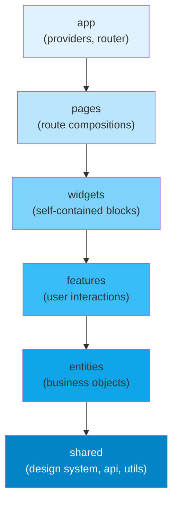

# [FEE-509] Feature-Sliced Design & Folder-Level Architecture

:::info
Feature-Sliced Design (FSD) organizes frontend code into six layers with strict unidirectional dependency rules: `app → pages → widgets → features → entities → shared`. Higher layers import from lower layers; the reverse is unconditionally forbidden. Teams MUST enforce these boundaries via a linting rule (`eslint-plugin-boundaries` or `@feature-sliced/eslint-config`) — informal convention without tooling enforcement will erode within weeks. Teams SHOULD NOT apply FSD to applications with fewer than approximately 10 routes or 3 developers; the layer ceremony exceeds the benefit at small scale.
:::

## Introduction

As frontend applications grow beyond a few dozen components, the question of how to organize code becomes genuinely consequential. A flat `components/` folder collapses under the weight of hundreds of files. A `features/` folder without clear rules on what constitutes a feature and what constitutes a shared utility produces a tangle of cross-imports that no automated tool can untangle. Teams routinely spend hours in code review debating where a new file should live, only to watch the decision reversed six months later during a refactor that no one had the bandwidth to finish. The folder structure of a frontend application is not a cosmetic concern — it is an architectural decision that shapes how quickly new engineers can orient themselves, how confidently experienced engineers can make changes, and how cleanly a codebase degrades or holds together as team membership and product scope evolve.

Feature-Sliced Design is a methodology — not a library, not a framework, not a tool — that answers the folder structure question with a set of explicit rules backed by a clear rationale. It was formally specified around 2021 and has since been adopted by a growing number of teams in the European frontend community and beyond. FSD's central insight is that frontend code naturally forms a dependency hierarchy: application bootstrapping depends on page compositions, page compositions depend on self-contained UI blocks, UI blocks depend on user interaction logic, user interaction logic depends on business objects, and business objects depend on domain-agnostic utilities. FSD names these levels — layers — and codifies the dependency direction between them as an unconditional rule rather than a guideline.

The value of that rule is testability and replaceability. When `features/add-to-cart` is forbidden from importing anything in `features/checkout`, the add-to-cart feature becomes independently testable in complete isolation. When `entities/product` is forbidden from importing anything in `features/`, the Product entity's data shapes and display components can be extracted to a shared library or replaced without understanding any feature's side effects. This is architectural thinking expressed as a folder convention: the discipline of dependency inversion, applied not to class hierarchies but to file system boundaries. Understanding FSD well means understanding not just its layer names but the specific reason each boundary exists and what class of problem it prevents.

## Principle

Teams MUST organize their `src/` directory into exactly the six FSD layers in the following order (from highest to lowest): `app`, `pages`, `widgets`, `features`, `entities`, `shared`. The dependency rule is unconditional: a module in any layer MAY import from any layer below it, and MUST NOT import from any layer above it or from a peer slice in the same layer. A `features/add-to-cart` module importing from `features/checkout` violates the rule as severely as it importing from `pages/checkout`. The layer boundary is not a soft convention that teams interpret at their discretion — it is a machine-enforceable invariant.

Teams MUST enforce layer boundaries with automated linting. `eslint-plugin-boundaries` with an explicit `boundaries/element-types` rule configuration, or `@feature-sliced/eslint-config` which wraps `eslint-plugin-boundaries` with FSD-specific defaults, MUST be added to the project's ESLint configuration and run in CI. Informal enforcement — code review comments, documentation, team agreement — will fail within weeks. As team membership changes, as deadline pressure mounts, and as the codebase grows past the point where any individual holds the full structure in memory, the rule survives only if a machine enforces it on every pull request. The linting configuration is not optional infrastructure; it is the rule's implementation.

Teams SHOULD NOT apply FSD to applications with fewer than approximately 10 routes or 3 active developers. Below this scale, the layer overhead — six top-level folders, the mental model of which layer a new abstraction belongs to, the friction of moving code between layers as understanding evolves — exceeds the organizational benefit. A well-structured `src/components/`, `src/hooks/`, `src/utils/`, and `src/pages/` organization is sufficient for small applications and does not require the full FSD layer model. Teams SHOULD evaluate their application's complexity honestly before committing to FSD; retrofitting FSD onto a codebase that does not need it produces ceremony without clarity.

Teams MUST keep `shared` domain-agnostic. The `shared` layer contains design system primitives, the configured API client, utility functions, and type helpers. It MUST NOT contain references to business domains — no `useProductStore`, no `CartItem` type, no `formatOrderTotal` formatter that is specific to an order domain. Every consumer of `shared` couples to its contents; a domain concept in `shared` becomes a transitive dependency of every layer that imports from `shared`. Domain concepts belong in `entities`.

## Design Thinking

The six layers of FSD are not arbitrary divisions — each one corresponds to a specific kind of responsibility that frontend code must address, and each boundary corresponds to a specific kind of coupling that the rule prevents.

The `shared` layer is the foundation. It contains everything that is stable, reusable, and domain-agnostic: the component library (Button, Input, Modal), the axios instance or query client configuration, and utility functions like `formatCurrency`, `debounce`, and `cn()`. The defining characteristic of `shared` code is that it has no opinion about the business domain. A Button component does not know whether it submits an order or filters a product catalog. An axios instance does not know what endpoints exist. This layer should be the most stable in the codebase; changes to `shared` have the widest blast radius because every other layer potentially depends on it.

The `entities` layer contains business objects: the data shapes, display components, and store schemas that represent domain concepts like Product, User, Order, and CartItem. An entity is a description of something the business cares about, expressed as a TypeScript interface, a display component that renders that shape, and optionally a Zustand slice or React Query key factory for managing that entity's server state. Critically, entities do not contain side effects triggered by user interaction — a `ProductCard` entity component displays a product, but the add-to-cart button's click handler is a `feature`, not part of the entity.

The `features` layer contains user interactions with side effects: the logic that happens when a user does something. Add to cart, submit a payment, filter a product list, log in, submit a review. A feature slice typically contains a UI component (the trigger or form), a model (the mutation, the store action, the thunk), and sometimes a type file. Features import from `entities` (to render the entity's display components or read entity types) and from `shared` (for UI primitives and the API client), but never from other features or from higher layers. This constraint means features are independently testable: a test for `features/add-to-cart` does not need a running `features/checkout` module.

The `widgets` layer composes features and entities into self-contained UI blocks: `ProductGrid`, `CartSidebar`, `CheckoutSummary`, `UserProfileHeader`. A widget is the unit that a designer would recognize as a discrete section of a page layout. Widgets manage their own local state and data fetching; they are the largest unit of UI reuse above the entity level. The widget boundary is the answer to the question "how do I reuse a complex, stateful UI block across multiple pages?" — the answer is to promote it to a widget.

The `pages` layer contains route-level compositions. A page component imports widgets and features, assembles them into a full page layout, and provides the route-specific configuration (page title, metadata, scroll restoration). Pages are thin; their job is composition, not logic. If a page component accumulates significant business logic, that logic should be extracted to a feature or widget. Pages are the layer where the application's information architecture (its routes) meets its component hierarchy; they should read as a clear table of contents for the application.

The `app` layer is the entry point to the application. It contains providers (React Query's `QueryClientProvider`, the router, theme providers, error boundary wrappers), the router configuration itself, and global CSS. The `app` layer is the only layer that may import from all other layers — it is the composition root.

**Decision table:**

| Scenario | FSD | Flat Feature Folders |
|---|---|---|
| Large team (5+), unclear ownership boundaries | Yes | No |
| Multiple product domains in one app | Yes | No |
| Small app (< 20 routes, 1-2 devs) | No | Yes |
| Library (not a product application) | No | Domain-driven grouping |
| Team already comfortable with domain folders | Optional | If applied consistently |

The design thinking question that teams most frequently get wrong is where to put cross-cutting concerns. Authentication state is a common example: it is needed by many features and widgets, but it is not a feature itself. The answer is `entities/session` or `entities/user` — the authenticated user is a business object (an entity), and the session state is that entity's store. Feature slices that need to check authentication import from `entities/session`, not from `features/login`. The `features/login` slice handles the interaction (the form, the mutation, the redirect), but the resulting session state lives in the entity layer where any feature can read it without importing from another feature.

Another common design question is how to handle intra-page state that is too specific to belong to an entity but is shared between a widget and a feature on the same page. The answer is usually one of three things: lift the state to the widget that composes both (widgets may hold local state); extract a small shared model to `entities`; or accept that this is a case where the FSD model is adding friction without adding clarity, which is a signal that the application may have outgrown a clean FSD structure and needs a more context-specific architectural decision. FSD is a starting framework, not a constraint that prevents pragmatic judgment.

## Best Practices

**Enforce the layer rule in CI before it is violated, not after.** The cost of adding `eslint-plugin-boundaries` to a greenfield project is thirty minutes of configuration. The cost of retrofitting it onto a codebase where layer violations have already accumulated is a refactoring project measured in days or weeks. Install the plugin at project inception, write the `boundaries/element-types` rule, and run `eslint --max-warnings 0` in the CI pipeline. Every pull request that introduces a layer violation fails the build. Teams that defer this configuration invariably accumulate violations in the first sprint that are "too expensive to fix right now" and never get fixed.

**Name slices after domain concepts, not technical roles.** A `features/add-to-cart/` slice is clearly named: it describes a user action in the product domain. A `features/button-handler/` slice is not: it describes a technical role, not a domain concept. FSD's slice names should read as a glossary of the application's domain: `entities/product`, `entities/cart-item`, `features/apply-discount-code`, `widgets/checkout-summary`. When a new engineer reads the `src/` directory, they should be able to reconstruct the product's main user flows from the slice names alone. If they cannot, the naming needs work.

**Keep the public API of each slice explicit.** Each slice SHOULD expose its public interface through an `index.ts` barrel file that explicitly re-exports only what other slices need. Internal modules — a helper used only within the slice, an intermediate component not meant for external composition — should not be re-exported from the barrel. This makes the slice's intended public surface area clear and prevents gradual coupling through deep internal imports. The barrel file is the slice's contract; changes to the barrel are breaking changes to other slices.

**Do not let widgets accumulate business logic.** The widget layer is a composition layer. A widget's job is to import feature and entity components, arrange them in a layout, manage local UI state (open/closed, selected tab, scroll position), and initiate data fetching. When a widget starts accumulating domain-specific validation logic, mutation side effects, or business rules, those concerns should be extracted to a feature slice that the widget then composes. A widget that is difficult to test in isolation — because it contains complex business logic rather than composition — is a signal that the logic needs to move down to `features`.

**Treat `shared/ui` as a design system, not a dumping ground.** The `shared/ui` folder should contain only components that are genuinely domain-agnostic: primitives (Button, Input, Checkbox), layout utilities (Stack, Grid), feedback components (Toast, Modal, Spinner), and typography elements. When a component that belongs in `shared/ui` starts receiving props that reference domain concepts — a `product` prop, an `orderId` prop, a `cartItemCount` prop — it has outgrown the `shared` layer and should be moved to `entities` or `widgets`. Keeping `shared/ui` pure is what makes it possible to extract the design system to a standalone package in the future without pulling in business domain code.

**Migrate incrementally, not all at once.** For teams adopting FSD on an existing codebase, a big-bang migration that moves every file in a single pull request is a high-risk, low-reward approach. Instead, identify one bounded domain (the product catalog, the checkout flow) and apply FSD structure to it while leaving the rest of the codebase unchanged. Establish the `eslint-plugin-boundaries` configuration with the migrated domain enforced strictly and the unmigrated portions marked as a temporary legacy exception. As new features are added to unmigrated areas, add them using FSD structure and update the ESLint configuration to enforce the new additions. The migration converges organically rather than requiring a dedicated refactoring sprint.

**Use path aliases to make import paths readable.** FSD produces import paths like `../../entities/product/model/types` when navigating between layers. These relative paths are verbose and fragile — a file moved one directory level requires updating every import. Configure TypeScript's `paths` (and the corresponding Vite or Webpack alias) to allow absolute imports: `@entities/product`, `@features/add-to-cart`, `@shared/ui`. This makes layer membership visible at a glance in any import statement and eliminates the cognitive load of counting `../` segments. The alias convention also makes `eslint-plugin-boundaries` patterns simpler to configure, since absolute imports with consistent prefixes are easier to match with glob patterns.

## Mermaid Diagram



The diagram shows the strictly unidirectional dependency chain. Each arrow represents the only permitted direction of import. There are no reverse arrows, no skip-layer arrows (a `pages` component importing directly from `shared` is permitted; the arrows represent the maximum allowed direction, not the only permitted connections), and no cross-layer arrows between peers at the same level. The gradient from light to dark blue represents increasing stability and decreasing domain-specificity as you move down the stack: `app` is the most volatile (it changes every time a new route is added), `shared` is the most stable (changes to it affect everything above).

## Example

### E-commerce application folder structure

The following tree shows a complete FSD-structured e-commerce application. Notice that each layer contains named slices, and each slice contains a small set of well-named internal folders (`ui/`, `model/`, `lib/`).

```
src/
├── app/
│   ├── providers.tsx          # React Query, Router, Theme providers
│   └── router.tsx             # createBrowserRouter config
│
├── pages/
│   ├── catalog/
│   │   └── index.tsx          # imports widgets/product-grid, features/filter-products
│   └── checkout/
│       └── index.tsx          # imports widgets/cart-summary, features/submit-order
│
├── widgets/
│   ├── product-grid/
│   │   └── index.tsx          # imports features/add-to-cart, entities/product
│   └── cart-summary/
│       └── index.tsx          # imports entities/cart-item, features/remove-from-cart
│
├── features/
│   ├── add-to-cart/
│   │   ├── ui/AddToCartButton.tsx
│   │   └── model/addToCart.ts  # store action / mutation
│   └── filter-products/
│       ├── ui/FilterPanel.tsx
│       └── model/filterStore.ts
│
├── entities/
│   ├── product/
│   │   ├── ui/ProductCard.tsx  # display only, no side effects
│   │   └── model/types.ts      # Product interface
│   └── cart-item/
│       └── model/types.ts
│
└── shared/
    ├── ui/                     # Button, Input, Modal — domain-agnostic
    ├── api/                    # axios instance, query client config
    └── lib/                    # formatCurrency, debounce, cn()
```

### Import violation and correct refactor

The most common violation beginners introduce is a lower-layer module that needs to navigate somewhere after completing an action — and reaches up to a `pages` module to get the route path.

```ts
// VIOLATION — features/add-to-cart importing from pages (higher layer)
// features/add-to-cart/model/addToCart.ts
import { checkoutRoute } from '../../pages/checkout'; // WRONG: lower layer importing from higher

async function addToCartAndRedirect(productId: string) {
  await cartApi.add(productId);
  router.navigate(checkoutRoute.path); // using a path defined in pages
}
```

The correct approach is to keep the feature's responsibility narrow (add to cart, emit an event or update state) and let the page or widget handle navigation, or to move the shared route constant to `shared/lib/routes.ts` where both the feature and the page can import it without either depending on the other.

```ts
// CORRECT REFACTOR — extract shared contract to entities or shared

// shared/lib/routes.ts — route constants belong in shared, not pages
export const ROUTES = {
  checkout: '/checkout',
  catalog:  '/catalog',
} as const;

// entities/cart-item/model/types.ts — entity type, importable by any layer
export interface CartItem { id: string; productId: string; quantity: number; }

// features/add-to-cart/model/addToCart.ts
import type { CartItem } from '@entities/cart-item/model/types'; // OK: lower layer
import { ROUTES } from '@shared/lib/routes';                      // OK: shared layer

export async function addToCart(item: CartItem) {
  await cartApi.add(item);
  // emit an event or update store — let the page decide whether to navigate
  cartStore.add(item);
}
```

```ts
// pages/catalog/index.tsx — the page handles navigation after the feature action
import { addToCart } from '@features/add-to-cart';
import { ROUTES } from '@shared/lib/routes';

function CatalogPage() {
  async function handleAddToCart(item: CartItem) {
    await addToCart(item);
    router.navigate(ROUTES.checkout); // navigation is a page concern, not a feature concern
  }
  // ...
}
```

This refactor respects the layer rule and produces a cleaner separation of concerns: the feature knows how to add an item to the cart; the page knows what should happen in the application after that action completes.

### ESLint configuration

The `eslint-plugin-boundaries` configuration below implements the complete FSD dependency rule. Every import that violates the layer order will produce an ESLint error, blocking the pull request in CI when `--max-warnings 0` is set.

```js
// .eslintrc.js — enforce layer boundaries automatically
module.exports = {
  plugins: ['boundaries'],
  extends: ['plugin:boundaries/recommended'],
  settings: {
    'boundaries/elements': [
      { type: 'app',      pattern: 'src/app/*' },
      { type: 'pages',    pattern: 'src/pages/*' },
      { type: 'widgets',  pattern: 'src/widgets/*' },
      { type: 'features', pattern: 'src/features/*' },
      { type: 'entities', pattern: 'src/entities/*' },
      { type: 'shared',   pattern: 'src/shared/*' },
    ],
  },
  rules: {
    'boundaries/element-types': ['error', {
      default: 'disallow',
      rules: [
        { from: 'app',      allow: ['pages', 'widgets', 'features', 'entities', 'shared'] },
        { from: 'pages',    allow: ['widgets', 'features', 'entities', 'shared'] },
        { from: 'widgets',  allow: ['features', 'entities', 'shared'] },
        { from: 'features', allow: ['entities', 'shared'] },
        { from: 'entities', allow: ['shared'] },
        { from: 'shared',   allow: [] },
      ],
    }],
  },
};
```

The `default: 'disallow'` setting means that any import not explicitly allowed by the `rules` array is an error. This is the correct default — it forces intentional decisions about which cross-layer imports are permitted, rather than silently allowing all imports and only flagging known violations. For projects using TypeScript path aliases, add the `boundaries/no-private` rule as well to prevent imports that reach into a slice's internal modules rather than using its public barrel:

```js
// Additional rule to enforce barrel-based public API
'boundaries/no-private': 'error',
```

### TypeScript path alias configuration

Configure path aliases in `tsconfig.json` to keep import paths readable and to align with the `boundaries/element-types` patterns:

```json
{
  "compilerOptions": {
    "baseUrl": ".",
    "paths": {
      "@app/*":      ["src/app/*"],
      "@pages/*":    ["src/pages/*"],
      "@widgets/*":  ["src/widgets/*"],
      "@features/*": ["src/features/*"],
      "@entities/*": ["src/entities/*"],
      "@shared/*":   ["src/shared/*"]
    }
  }
}
```

With Vite, add the corresponding `resolve.alias` configuration:

```ts
// vite.config.ts
import { defineConfig } from 'vite';
import path from 'path';

export default defineConfig({
  resolve: {
    alias: {
      '@app':      path.resolve(__dirname, 'src/app'),
      '@pages':    path.resolve(__dirname, 'src/pages'),
      '@widgets':  path.resolve(__dirname, 'src/widgets'),
      '@features': path.resolve(__dirname, 'src/features'),
      '@entities': path.resolve(__dirname, 'src/entities'),
      '@shared':   path.resolve(__dirname, 'src/shared'),
    },
  },
});
```

## Common Mistakes

**Putting business logic in `shared`.** The `shared` layer must be domain-agnostic. A `useProductStore` hook in `shared/lib/` means every consumer of `shared` — including `entities`, `features`, `widgets`, and `pages` — transitively couples to the product domain. When the product domain changes, the blast radius includes everything in the application. Business logic belongs in `entities` (for passive domain state and types) or `features` (for active, side-effecting logic). A reliable heuristic: if you cannot reuse the module in a completely unrelated application without business domain changes, it does not belong in `shared`.

**Direct cross-feature imports.** `features/add-to-cart` importing from `features/checkout` is a peer-layer violation. Both slices are at the same layer level; neither is permitted to depend on the other. This pattern typically arises when a feature needs access to state or types that are maintained by another feature. The correct solution is to identify the shared concept and move it down to the rendezvous layer: if `add-to-cart` needs the `CartItem` type from `checkout`, that type belongs in `entities/cart-item`, where both features can import it independently. If `add-to-cart` needs to trigger behavior in `checkout`, that trigger should go through an event or shared state in `entities` or `shared`, with the `checkout` feature subscribing to it.

**Applying FSD to a small application.** Six layers of folders for an application with 8 routes and 1–2 developers is configuration overhead masquerading as architecture. The legitimate value of FSD — independent testability of slices, enforced ownership boundaries, unambiguous placement rules for new code — requires enough scale that these benefits outweigh the overhead of maintaining layer discipline. At small scale, the layer ceremony consumes the mental bandwidth that should be spent on product quality. Use a simpler structure (feature folders, a `components/` and `hooks/` split, page-colocated files) and graduate to FSD when the application and team grow to the point where the absence of explicit boundaries is causing actual problems.

**Inconsistent slice public API discipline.** FSD's value depends on slices being black boxes with explicit public surfaces. When engineers import directly from internal slice modules (`import { productQueryKey } from '@features/add-to-cart/model/queryKeys'` instead of the barrel), they create invisible dependencies on implementation details. The next engineer to refactor the feature's internal module structure will break imports across the codebase without any visible contract violation. Enforce the `boundaries/no-private` rule in ESLint and treat the barrel file as the slice's only public interface.

**Moving too many concerns into the widget layer.** Widgets should compose, not decide. A `ProductGrid` widget that contains the pagination logic, the sort order mutation, the analytics tracking, and the empty state content copy has become a page in miniature. When a widget grows beyond layout composition and local UI state management, it is a signal that some of its responsibilities should be extracted to dedicated feature slices (pagination as `features/paginate-products`, sort order as `features/sort-products`) and the widget reduced back to its proper role as a layout compositor.

## Related FEEs

- [FEE-501: Component Composition Patterns](./501.md) — FSD organizes composed units by layer; understanding composition patterns clarifies why widgets are separate from features and how they compose entities
- [FEE-508: Micro-Frontend Architecture](./508.md) — FSD per micro-frontend is a common pairing at scale; each MFE owns its own layer hierarchy and exposes a versioned public API to the shell
- [FEE-805: Monorepos & Workspaces](../Build%20Tooling%20and%20Module%20Systems/805.md) — path aliases enforce the import convention; monorepo workspace packages can map cleanly to FSD layers or cross-layer shared packages
- [FEE-1102: Component Testing with Testing Library](../Testing%20Strategies/1102.md) — layer boundaries map directly to test isolation boundaries; a feature slice with no upward imports can be tested in complete isolation from pages and widgets

## References

- [Feature-Sliced Design Official Documentation](https://feature-sliced.design/) — the canonical specification of FSD; covers the six-layer model, the segment conventions (`ui/`, `model/`, `lib/`, `api/`, `config/`), migration guides, and the rationale for each layer boundary; the most authoritative source for layer definitions and the unidirectional dependency rule
- [`eslint-plugin-boundaries` Documentation](https://github.com/javierbrea/eslint-plugin-boundaries) — the ESLint plugin used to enforce architectural boundaries including FSD layer rules; documents the `boundaries/element-types` rule, the `default: 'disallow'` mode, and the glob pattern syntax for matching slice paths
- [Alex Kondov — Tao of React (Folder Structure Chapter)](https://alexkondov.com/tao-of-react/) — a widely cited article-length treatment of React project structure that covers the trade-offs between flat, feature-grouped, and FSD-style organizations; grounded in real project experience and explains the costs of each approach at different scales
- [Khalil Stemmler — Solid Book (Layered Architecture)](https://solidbook.io/) — the DDD and clean architecture concepts that underlie FSD's layer model; explains why unidirectional dependencies are the correct solution to the coupling problem that FSD solves at the folder level
- [FSD GitHub Discussions and Examples](https://github.com/feature-sliced/documentation/discussions) — the FSD community's open discussion forum; contains real-world questions about edge cases (where does authentication state live, how to handle cross-feature state), example repositories, and the core team's clarifications on ambiguous cases
- [FSD v2 Migration Guide](https://feature-sliced.design/docs/migration/from-v1) — documents the removal of the `processes` layer in FSD v2 and the correct six-layer model; relevant for teams encountering older FSD tutorials that reference the deprecated `processes` layer
