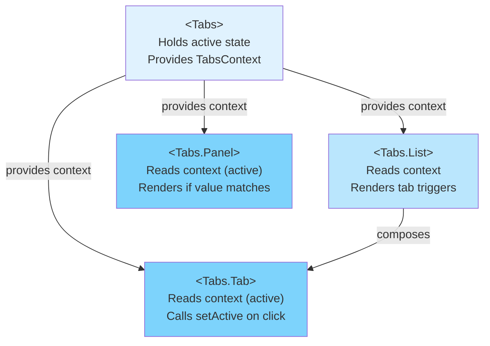

# Compound Component Pattern

The compound component pattern structures a complex UI component as a set of cooperating
sub-components that share implicit state through a context provider rather than through props
passed at every level. A `<Tabs>` component that exposes `<Tabs.List>`, `<Tabs.Tab>`, and
`<Tabs.Panel>` is a compound component: the parent `Tabs` manages which tab is active, and each
child reads or modifies that state through context — without the consumer of the `<Tabs>`
component needing to pass the active state explicitly to each sub-component. The pattern is the
answer to "how do I make a stateful component whose internal moving parts the consumer can
rearrange freely?"

The pattern is widely used in component libraries (Radix UI, Headless UI, React Aria, Reach UI)
because it produces APIs that are flexible, composable, and explicit. The consumer controls the
DOM structure and ordering of the sub-components; the parent compound component controls the
shared behavior. This separation makes components easy to customize without forking. A design
system that ships a `<Dialog>` compound component can let teams rearrange the header, body, and
footer sections in whatever order their design requires, wrap sub-components in animation wrappers
or additional layout elements, and omit sub-components entirely — all without the design system
author having to anticipate every consumer's needs.

The compound component pattern is a specific application of context — provider/consumer — where
the provider is a component and the consumers are its designated sub-components. It is distinct
from generic context providers that supply global state: a compound component context is scoped
to a specific component tree and has no meaning outside it. This scoping is an important design
constraint. A `<Tabs>` context does not leak beyond the `<Tabs>` boundary; two `<Tabs>` instances
on the same page each manage their own independent context. Understanding this scoping — and
enforcing it via the context guard pattern — is what separates a well-designed compound component
from a global state management solution that happens to live inside a component.

## Design Thinking

### Static vs. dynamic sub-components

The conventional approach for attaching sub-components to a parent is the static property
pattern: `Tabs.List = TabsList`, `Tabs.Tab = TabsTab`, `Tabs.Panel = TabsPanel`. This
co-locates the entire compound component family under a single import surface. The consumer
writes `import { Tabs } from './Tabs'` and gains access to all sub-components via `Tabs.List`,
`Tabs.Tab`, and `Tabs.Panel` without needing to import each one individually. The static property
pattern is also self-documenting in a way that separate named exports are not: inspecting the
`Tabs` export in an IDE reveals the full family of co-operating sub-components immediately,
making the pattern discoverable without reading source code or documentation. The relationship
between parent and sub-components is encoded in the module shape, so any engineer who imports
`Tabs` can see the entire surface area of the API at once.

An alternative approach is to export sub-components as separate named exports from the same
module: `export { Tabs, TabsList, TabsTab, TabsPanel }`. This is occasionally preferred in
codebases where tree-shaking granularity matters for bundle size, or where automated API
documentation tools work better with named exports than with static properties. However, separate
named exports impose a cognitive cost on the consumer: they must know which exports belong to the
same compound component family, and they must import each one by name. For component libraries
where developer experience is a first-class concern, static properties are the recommended
approach because they make the family structure explicit and reduce import boilerplate.

In TypeScript, the static property pattern requires that the parent function's type include the
sub-component properties. The idiomatic way to accomplish this is to define the function, then
assign the sub-components as properties, and let TypeScript infer the combined type:
`function Tabs(...) {...}; Tabs.List = TabsList; Tabs.Panel = TabsPanel`. The resulting inferred
type carries both the call signature and the static properties. Some teams prefer to use
`Object.assign(Tabs, { List: TabsList, Panel: TabsPanel })` to make the attachment explicit and
return the combined type in a single expression. Either approach produces the same runtime
behavior; the choice is a style preference that should be decided at the design system level and
applied consistently across all compound components.

### Flexible slot layout

Consider two API styles for a tabs component. The props-driven style accepts flat configuration:
`<Tabs tabs={[...]} panels={[...]} />`. This is compact for simple cases but rigid — the consumer
cannot insert additional elements between the tab list and the panels, cannot customize the order
of sub-components, and cannot omit a sub-component that the design does not require. If the
design calls for an action button at the end of the tab list, the consumer must either fork the
component, add a custom `renderTabListSuffix` prop, or work around the rigid structure with
absolute positioning. As the product design evolves, this rigid API accumulates more and more
escape-hatch props until it becomes as complex as the underlying DOM it abstracts.

The compound component style exposes `<Tabs>`, `<Tabs.List>`, `<Tabs.Tab>`, and `<Tabs.Panel>`
as composable pieces. The consumer assembles them:
`<Tabs><header><Tabs.List>...</Tabs.List><ActionButton /></header><Tabs.Panel>...</Tabs.Panel></Tabs>`.
Arbitrary DOM — headings, dividers, decorative elements, additional toolbars, layout wrappers —
can appear between any sub-components without requiring changes to the compound component's
implementation. This structural freedom is the primary motivation for the pattern in
design-system and component-library work, where consumers have diverse layout requirements that
the component author cannot anticipate. The compound component author defines the behavior
contract (which tab is active, how tabs are switched) and leaves the structural contract (where
tabs appear, what surrounds them) entirely to the consumer.

The tradeoff is that compound components require consumers to understand the expected structure.
A props-driven `<Tabs>` can silently assemble a correct ARIA relationship between tabs and panels
regardless of how the consumer uses it. A compound `<Tabs>` requires the consumer to place
`<Tabs.Panel>` correctly relative to `<Tabs.List>` — if the consumer renders `<Tabs.Panel>`
outside the `<Tabs>` boundary, the context guard will catch the error at runtime, but there is
no compile-time enforcement that the structural contract is satisfied. For components that will
always render in a fixed structure, a props-driven API may be simpler to maintain and test.
Teams building internal components for a single team SHOULD evaluate whether the flexibility is
actually needed before committing to the compound pattern.

### Context guard pattern

A compound component context is only meaningful within the tree of its parent. Consuming the
context outside that tree — for example, calling `useTabsContext()` in a component that renders
at the root level — produces `undefined` rather than a context object, and the resulting error
(`Cannot read properties of undefined, reading 'active'`) does not tell the developer what went
wrong. The stack trace points to the line inside the hook, not to the place where the
sub-component was rendered outside a `<Tabs>` boundary. Debugging this without the guard
requires understanding how React context default values work and recognizing that `null` context
means "no provider ancestor" — knowledge that not every consumer can be assumed to have.

The context guard pattern solves this completely: the custom hook checks whether the returned
context is defined and throws a descriptive, intentional error if it is not. The thrown error
message `'useTabsContext must be used within <Tabs>'` immediately identifies both the violated
constraint and the missing ancestor. This makes the compound component pattern safe to use in
large codebases where sub-components may be extracted into distant files and consumed
independently. The guard ensures that any misuse is caught at development time with an actionable
message rather than a confusing runtime crash.

The guard also serves a documentation function beyond error messaging. Because
`React.createContext(null)` sets the default to `null`, TypeScript infers the context type as
`TabsContextValue | null`. The custom hook's guard narrows the type to `TabsContextValue` after
the check, so consumers of the hook get a fully typed, non-nullable context value without needing
explicit type assertions. This means the guard is not only a runtime safety net — it is also the
mechanism that makes TypeScript infer the correct type for all hook consumers, eliminating the
need for `!` non-null assertions scattered throughout sub-component implementations.

### Controlled vs. uncontrolled compound components

A compound component can manage its own active state internally — this is the uncontrolled
variant, enabled by a `defaultValue` prop that seeds the initial state. The consumer provides an
initial value and then steps back; the compound component manages all subsequent state
transitions in response to user interactions. This is the right choice for the majority of use
cases: the consumer gets a fully functional component without writing any state management code.

The controlled variant delegates state management to the caller: a `value` prop sets the current
state, and an `onChange` callback notifies the caller of state change requests. The compound
component does not update its own state; it simply invokes `onChange` when a tab is clicked and
renders based on whatever `value` the caller provides. This is the right choice for advanced
scenarios: synchronizing the active tab with a URL parameter, building a wizard where the active
step is controlled by external business logic, or linking two compound components so that
changing one changes the other.

Providing both variants via the `value`/`defaultValue`/`onChange` convention — the same model
used by native HTML form inputs — maximizes reusability. Engineers SHOULD implement the
uncontrolled variant first and add the controlled variant before the component is published to a
shared library, because retrofitting controlled behavior later often requires breaking API
changes. A practical implementation pattern for supporting both modes is a "controllable state"
hook — an internal hook that accepts `value`, `defaultValue`, and `onChange`, and returns the
active state and setter in a way that respects whether the component is in controlled or
uncontrolled mode. This hook can be extracted and reused across all compound components in a
design system, so the controlled/uncontrolled logic does not need to be re-implemented for every
component that requires it.

### Accessibility and role delegation

A compound component is an ideal place to enforce ARIA role conventions that the consumer should
not have to think about. A `<Tabs.List>` sub-component knows it should render with
`role="tablist"`. A `<Tabs.Tab>` knows it needs `role="tab"`, `aria-selected`, and an `id` that
is referenced by the corresponding panel's `aria-labelledby`. A `<Tabs.Panel>` knows it needs
`role="tabpanel"` and the `aria-labelledby` attribute. If each role were the consumer's
responsibility, the compound component API would be trading prop explosion for role-attribute
explosion. By encoding ARIA requirements into the sub-components themselves, the compound
component author can deliver an accessible component without burdening the consumer with
accessibility implementation details.

The compound component pattern also enables coordinated `id` management across sub-components.
Each `<Tabs.Tab>` and its corresponding `<Tabs.Panel>` must share a unique `id`/`aria-labelledby`
relationship that cannot be expressed without shared state between the two sub-components. In a
props-driven API, the consumer would be responsible for generating and threading these `id`
values, which is error-prone and verbose. In a compound component, the parent can generate a
stable unique prefix using `React.useId()` and inject it into the context, allowing each
`<Tabs.Tab>` and `<Tabs.Panel>` to derive their `id` values deterministically from their `value`
prop and the shared prefix. This keeps the ARIA relationship correct by construction, regardless
of how many tabs the consumer adds or removes.

### Nesting and multiple context levels

Some compound components have sub-components that are themselves compound components. A
`<Select>` might expose `<Select.Group>` and `<Select.Option>`, where `<Select.Group>` is a
compound component that provides its own context to `<Select.Option>` while also consuming the
parent `<Select>` context. This creates nested context levels: the `<Select>` context carries
the selected value and the `<Select.Group>` context carries the group label for accessibility
grouping. The key design principle is that each context level should carry only the state that
the sub-components at that level need — a `<Select.Option>` reads both contexts, but reads the
selected value from the `<Select>` context and the group label from the `<Select.Group>` context.
Merging these into a single context would couple the group's implementation to the select's,
which is harder to maintain and test independently. Compound components with nesting SHOULD use
separate contexts per level rather than a single monolithic context that carries all shared state.

## Best Practices

**SHOULD use the compound component pattern for stateful UI components with multiple moving parts that users need to control individually** — tabs, accordions, select menus, dialogs, menus, and command palettes. A single component that accepts all configuration as props produces prop explosion and limits layout flexibility; the compound pattern gives consumers structural control while keeping behavioral state internal to the parent.

**MUST NOT use compound component context to share state between arbitrary components that are not in a known parent/child relationship.** Compound component context is implementation state, not application state. Engineers who need to share state across distant components SHOULD reach for a dedicated state management solution — Zustand, Jotai, React Query, or similar — rather than misusing a compound component context for that purpose.

**SHOULD expose sub-components as static properties of the parent component (`Tabs.List`,
`Tabs.Panel`) rather than as separate named exports.** Co-locating sub-components as static
properties makes the component family discoverable at import time, communicates that the
sub-components belong together, and reduces the import surface consumers must manage.
`import { Tabs } from './Tabs'` followed by `<Tabs.Panel>` is ergonomically superior to
`import { Tabs, TabsPanel, TabsList } from './Tabs'`. The static property approach also makes it
clear in JSX that `Tabs.Panel` is part of the `Tabs` family — not a standalone component that
happens to share a name prefix — and IDEs that support property autocompletion will surface the
full family when the consumer types `Tabs.`, reducing the need to consult external documentation.
For TypeScript codebases, the `Tabs` function type and the types of `Tabs.List`, `Tabs.Tab`, and
`Tabs.Panel` SHOULD all be declared in the same file, making the public API of the compound
component visible in one place.

**MUST include a context guard in the custom hook used to access compound component context.**
The guard — `if (!context) throw new Error('...')` — transforms a confusing
`undefined.someProperty` runtime error into an actionable error message that tells the developer
which parent component they missed. This is more important in compound components than in global
contexts because the constraint — the consuming component must be a descendant of the parent
compound component — is not obvious to all consumers, particularly those using only a
sub-component exported from a design system package without having read the full documentation.
The error message MUST name both the hook and the expected ancestor:
`'useTabsContext must be used within <Tabs>'` is correct; `'Context not found'` is not.
In production builds, the guard SHOULD still be included: the cost of a thrown error in
production is lower than the cost of a silent undefined-property access that produces incorrect
UI behavior.

**SHOULD provide both controlled and uncontrolled APIs for compound components that manage
interactive state.** An accordion that only accepts an external `open` prop cannot be used
without wiring up state management, even for the simplest use case where the consumer just wants
a functional accordion on a static page. An accordion with a `defaultOpen` prop can be used in
simple cases without any external state at all. The `value`/`defaultValue`/`onChange` convention
from HTML form inputs is the appropriate model: `value` and `onChange` together enable the
controlled variant; `defaultValue` alone enables the uncontrolled variant; providing neither
SHOULD result in the component starting in a sensible default state. Engineers SHOULD implement
the uncontrolled variant first — it is simpler and covers the majority of use cases — and add
the controlled variant before the component is published to a shared library, because retrofitting
controlled behavior later often requires breaking API changes that force all existing consumers to
update their code.

## Visual



## Example

```jsx
import React from 'react';

// 1. Create the context — null signals "no parent Tabs present"
const TabsContext = React.createContext(null);

// 2. Context guard hook — throws a descriptive error if used outside <Tabs>
function useTabsContext() {
  const ctx = React.useContext(TabsContext);
  if (!ctx) throw new Error('useTabsContext must be used within <Tabs>');
  return ctx;
}

// 3. Parent compound component — uncontrolled via defaultValue
function Tabs({ defaultValue, children }) {
  const [active, setActive] = React.useState(defaultValue);
  // Memoize to avoid re-rendering all consumers on every Tabs render
  const value = React.useMemo(() => ({ active, setActive }), [active]);
  return (
    <TabsContext.Provider value={value}>
      {children}
    </TabsContext.Provider>
  );
}

// 4. Sub-components attached as static properties
Tabs.List = function TabsList({ children }) {
  return <div role="tablist">{children}</div>;
};

Tabs.Tab = function Tab({ value, children }) {
  const { active, setActive } = useTabsContext();
  return (
    <button
      role="tab"
      aria-selected={active === value}
      onClick={() => setActive(value)}
    >
      {children}
    </button>
  );
};

Tabs.Panel = function Panel({ value, children }) {
  const { active } = useTabsContext();
  return active === value ? <div role="tabpanel">{children}</div> : null;
};

// 5. Consumer — full structural control, no active-state prop threading
export function SettingsPage() {
  return (
    <Tabs defaultValue="profile">
      <Tabs.List>
        <Tabs.Tab value="profile">Profile</Tabs.Tab>
        <Tabs.Tab value="security">Security</Tabs.Tab>
      </Tabs.List>
      <Tabs.Panel value="profile"><ProfileForm /></Tabs.Panel>
      <Tabs.Panel value="security"><SecurityForm /></Tabs.Panel>
    </Tabs>
  );
}
```

## Common Mistakes

- **Passing shared state as props instead of context.** Threading an `activeTab` prop through
  `Tabs.List` to each `Tabs.Tab` recreates the prop-drilling problem the pattern exists to solve.
  Sub-components MUST read shared state from context, not from props passed by the parent render.
  Any design where the parent renders child components and passes active state down as props is
  not a compound component — it is a conventional parent/child hierarchy, and the consumer loses
  the structural freedom that motivated the pattern.
- **Using a single generic context for multiple unrelated compound components.** A `UIContext`
  that holds state for tabs, modals, and accordions simultaneously conflates unrelated component
  states, increases re-render surface, and makes it impossible to enforce the guard pattern
  correctly. Each compound component family MUST have its own dedicated context.
- **Omitting the context guard and using a non-null default value instead.** Setting
  `React.createContext({ active: undefined, setActive: () => {} })` as the default silences the
  error at the cost of making misuse invisible. A sub-component rendered outside its parent will
  silently receive the default value and produce no output or incorrect output with no error. The
  guard pattern — `null` default plus a throwing hook — is the correct approach.
- **Not memoizing the context value object.** Creating the context value inline in the provider's
  `value` prop — `value={{ active, setActive }}` — creates a new object on every render of the
  parent, causing all consumers to re-render even when neither `active` nor `setActive` has
  changed. Wrap the value in `React.useMemo` to prevent unnecessary re-renders in compound
  components with many consumers.
- **Exposing internal sub-components as public exports without the static property relationship.**
  Publishing `TabsTab` and `TabsPanel` as top-level named exports alongside `Tabs` loses the
  discoverable family structure that the static property approach provides. Consumers who import
  only `TabsPanel` have no IDE-visible signal that they must also render it inside a `<Tabs>`
  ancestor — which is precisely the situation the context guard exists to catch at runtime.

## Related FEEs

- [FEE-500 — Component Architecture & Design Patterns Overview](./500.md)
- [FEE-501 — Component Composition Patterns](./501.md)
- [FEE-511 — Provider Hierarchy & Context Composition](./511.md)
- [FEE-603 — Context & Prop Drilling](../State%20Management/603.md)

## References

- [Kent C. Dodds: Compound Components Pattern](https://kentcdodds.com/blog/compound-components-with-react-hooks) —
  the canonical tutorial introducing compound components with React hooks; covers the context
  guard pattern, the static property convention, and the rationale for the pattern over
  prop-driven APIs
- [Radix UI: Primitive component examples](https://www.radix-ui.com/primitives/docs/overview/introduction) —
  a production component library built entirely on the compound component pattern; the source code
  illustrates context guard usage, controlled/uncontrolled APIs, and the `defaultValue`/`value`/
  `onChange` convention at scale
- [React docs: createContext](https://react.dev/reference/react/createContext) — the authoritative
  reference for React context including the provider/consumer model, context default values, and
  the rules for when consumers re-render; essential reading for understanding the mechanics
  underlying the compound component pattern
