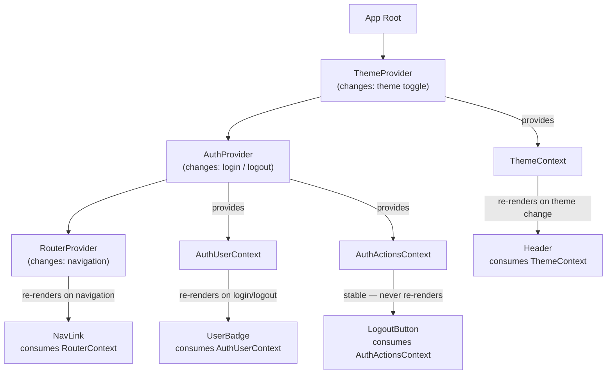

# Provider Hierarchy & Context Composition

React Context solves prop drilling by making state available to any descendant without threading
it through every intermediate component. In practice, applications use many contexts: theme, auth,
locale, feature flags, router, and numerous domain-specific contexts. The question is not whether
to use context but how to organize multiple contexts, how to prevent unnecessary re-renders from
context value changes, and how to compose contexts in a maintainable way.

Provider nesting — stacking `<ThemeProvider>`, `<AuthProvider>`, `<I18nProvider>` at the
application root — is the universal pattern. The challenge is that every context value change
re-renders every consumer in the tree. When a theme context value is a large object that is
re-created on every render, all consumers re-render on every parent render, not just when the
theme actually changes. This means a careless provider implementation can silently make the entire
application pay a re-render cost that has nothing to do with actual data changes.

The key insight for performant context usage is that context re-renders consumers when the context
value changes by reference. Memoizing the value object (`useMemo`) or splitting a large context
into focused contexts — one for the value, one for the dispatch function — controls re-render
scope. Understanding this allows teams to use context without the performance problems that make
many developers reach for external state libraries unnecessarily. Context is not inherently slow;
unoptimized context values are.

## Principle

Engineers SHOULD split context into separate providers when the context value has parts that
change at different frequencies. An auth context that includes both the `user` object (changes on
login/logout) and the `login`/`logout` functions (stable references) causes all consumers to
re-render on login/logout even if they only use the stable functions. Splitting into
`AuthUserContext` and `AuthActionsContext` allows consumers to subscribe only to the part they
use, eliminating spurious re-renders for consumers that read only the stable actions.

Engineers MUST memoize context values that are object or array literals to prevent consumers from
re-rendering on every render of the provider component. Passing `{ user, setUser }` as the
context value creates a new object on every render of the provider component. Every consumer
re-renders whenever this provider renders, regardless of whether `user` or `setUser` changed.
`useMemo(() => ({ user, setUser }), [user, setUser])` limits re-renders to when the actual values
change. These two rules — split by change frequency, memoize object values — cover the majority
of context performance problems encountered in production React applications.

## Design Thinking

### Context selector pattern

React's built-in context API notifies every consumer when the context value changes, with no
mechanism to subscribe to only a part of the value. This is by design: React's rendering model
does not track which properties of a context value a consumer reads, so it must conservatively
re-render all consumers when the reference changes. The built-in workaround is context splitting —
creating one context per logical slice so consumers subscribe only to the slice they need.

When splitting becomes impractical — for example, when a single context genuinely has dozens of
independent fields that individual consumers read in various combinations — a selector library
provides an alternative. The `use-context-selector` library from Daishi Kato wraps the standard
context API with a subscription mechanism that tracks which fields each consumer accessed and
skips re-renders when the accessed fields have not changed. Zustand and Jotai have this behavior
built in as a core feature of their subscription model, which is one reason developers who
encounter repeated context performance problems often migrate to those libraries.

The practical decision rule is: prefer splitting when the context has two to four natural
partitions that align with change frequency; reach for a selector library when splitting would
produce an unwieldy number of providers or when the subscription topology is genuinely dynamic.
Introducing a selector library has a non-trivial abstraction cost — it replaces `useContext` with
a custom hook across the codebase — so the performance benefit must be measurable before
committing.

### Composing multiple providers

Applications with many global contexts accumulate deeply nested provider trees at the application
root — `ThemeProvider` wrapping `AuthProvider`, `AuthProvider` wrapping `I18nProvider`,
`I18nProvider` wrapping `RouterProvider`, and so on. Each new global concern adds another level
of nesting, and the order of nesting matters when providers consume each other's contexts. This
is functionally correct but visually noisy and increasingly hard to scan as the number of
providers grows. The `ComposeProviders` (also called `combineProviders`) pattern flattens this
nesting into a single component that accepts an array of provider components and composes them
programmatically. The result at the call site reads as a flat, ordered list of providers rather
than a pyramid, making the full set of active global providers easy to audit at a glance and
easy to extend by appending to the list.

The trade-off is abstraction cost. A `ComposeProviders` utility that accepts provider components
as array elements must handle the case where a provider requires props beyond `children`, which
usually means wrapping each provider in a zero-argument factory function. This abstraction
requires every new team member to understand the pattern before they can add a new global
provider. For applications with five or fewer global providers, the overhead of the pattern
outweighs its readability benefit. For larger applications, the pattern earns its cost by making
the provider configuration visible in one place rather than requiring the reader to trace through
nested JSX. In both cases, the dependency ordering between providers — which provider must be
an ancestor of which — SHOULD be documented at the composition site, not assumed from memory.

### React 19 use() hook

React 19 introduced the `use()` hook, which reads context values — and Promises — inline, without
the constraint that `useContext` places on where the call can appear. Unlike `useContext`,
`use(Context)` can be called conditionally or inside loops, because the React 19 compiler tracks
`use()` calls differently from traditional hooks. A component can now conditionally read a context
only when a flag is enabled, or read a context inside a loop over a list of items.

This does not replace `useContext` in most existing patterns, because most context consumption is
unconditional. The real value of `use(Context)` is in conditional rendering scenarios — for
example, a component that wraps a legacy third-party element and optionally enhances it with
context-provided configuration only when the context is present. Previously, achieving this
required either always calling `useContext` (regardless of whether the context is present) or
restructuring the component into two pieces with the conditional call at the boundary.

Teams working in React 19 environments SHOULD understand `use(Context)` as an additive capability
for specific conditional patterns, not as a reason to refactor existing `useContext` calls. The
performance characteristics of `use(Context)` follow the same rules as `useContext`: consumers
re-render when the context value changes by reference. All memoization and context-splitting
strategies described in this article apply equally to contexts consumed via `use(Context)`.

### Provider placement strategy

Not all context providers belong at the application root. Global concerns — theme, auth, locale,
feature flags — belong at the root because they are consumed everywhere. Domain-specific and
feature-level contexts belong at the lowest component in the tree that contains all their
consumers. A `DialogContext` that manages a single dialog's open/close state should live at the
feature component level, not the application root. A compound component context (see FEE-510)
should live inside the compound component parent itself.

Placing a provider higher than necessary increases the re-render surface: every component in the
subtree below the provider is a potential consumer, even if it does not use the context. More
practically, it makes the scope of the context implicit — a reader scanning the codebase cannot
tell from the component tree which components are expected to use the context. Pushing providers
to the lowest applicable scope makes the dependency explicit in the component hierarchy and limits
the blast radius of context value changes to the feature that actually needs the state.

App-root providers and subtree providers have different lifecycle implications as well. An
app-root provider typically mounts once and lives for the entire session. A subtree provider
mounts and unmounts with its feature tree, which means its state resets on unmount unless
persisted externally. Understanding this difference prevents bugs where developers expect subtree
context state to survive navigation events that unmount and remount the feature tree. When
subtree state persistence is required, the state should be lifted to a router-level cache or
a global store, not resolved by hoisting the provider to the app root.

## Best Practices

**MUST memoize object and array context values with `useMemo` to prevent spurious re-renders of
all context consumers.** A context value that is a new object reference on every render causes
every consumer to re-render on every provider render, even when the data has not changed. This is
the single most common cause of context-induced performance issues. The rule is simple: if the
value passed to `Context.Provider` is an object literal, wrap it in `useMemo`. The dependencies
array of the `useMemo` call MUST include every primitive or reference that is part of the object,
so that the memoized value updates when any of its actual inputs change.

**SHOULD split large contexts into smaller, focused contexts that change independently.** A
monolithic `AppContext` that includes theme, user, cart, and UI state causes all consumers to
re-render when any part changes. Splitting into `ThemeContext`, `UserContext`, `CartContext`, and
`UIContext` allows each consumer to subscribe only to the slice it needs. The overhead of multiple
context providers is negligible compared to the re-render savings in a real application with many
consumers. When splitting, group by change frequency first and by logical concern second: two
pieces of state that always change together can share a context without performance penalty.

**SHOULD place context providers at the lowest component in the tree that contains all consumers,
not automatically at the application root.** A `DialogContext` that manages a single dialog's
open/close state belongs at the feature level, not the app root. Pushing providers down limits the
re-render surface and makes the context's scope explicit from the component tree structure. Before
hoisting a provider to the app root, engineers SHOULD verify that consumers genuinely span the
entire application rather than assuming global placement is the default. Reserving the app root
for truly global contexts — auth, theme, locale — keeps the root provider tree lean and makes
each global context's presence intentional.

## Visual



## Example

```jsx
import React from 'react';
import { api } from './api';

// Split into two contexts: value (changes on login/logout) and actions (stable)
const AuthUserCtx = React.createContext(null);
const AuthActionsCtx = React.createContext(null);

export function AuthProvider({ children }) {
  const [user, setUser] = React.useState(null);

  // actions object has no dependencies on user — stable for the entire session
  const actions = React.useMemo(() => ({
    login: async (creds) => {
      const u = await api.login(creds);
      setUser(u);
    },
    logout: () => {
      api.logout();
      setUser(null);
    },
  }), []); // empty deps: never re-created

  // user is a primitive-or-object value; no wrapping needed — pass directly
  return (
    <AuthUserCtx.Provider value={user}>
      <AuthActionsCtx.Provider value={actions}>
        {children}
      </AuthActionsCtx.Provider>
    </AuthUserCtx.Provider>
  );
}

// Consumers subscribe only to the part they use
export function useAuthUser() {
  const user = React.useContext(AuthUserCtx);
  return user; // null when logged out, user object when logged in
}

export function useAuthActions() {
  const actions = React.useContext(AuthActionsCtx);
  if (!actions) throw new Error('useAuthActions must be used within <AuthProvider>');
  return actions; // stable reference — calling this hook never causes re-renders
}

// LogoutButton re-renders only when actions reference changes (never, in practice)
export function LogoutButton() {
  const { logout } = useAuthActions();
  return <button onClick={logout}>Log out</button>;
}

// UserBadge re-renders on login/logout (user reference changes)
export function UserBadge() {
  const user = useAuthUser();
  if (!user) return null;
  return <span>{user.displayName}</span>;
}
```

## Common Mistakes

- **Passing an inline object literal as the context value without `useMemo`.** Writing
  `<MyContext.Provider value={{ data, setData }}>` creates a new object on every render of the
  provider component. Every consumer re-renders even when `data` and `setData` have not changed.
  Always assign `useMemo(() => ({ data, setData }), [data, setData])` to a variable and pass the
  memoized variable as the value.
- **Creating a single monolithic context for all application state.** An `AppContext` that holds
  theme, auth, cart, and UI state couples every consumer to every piece of state. Changes to any
  field trigger re-renders for all consumers. Split by change frequency and logical concern.
- **Placing all providers at the app root by default.** Feature-level and compound-component
  contexts belong at the lowest scope that contains all their consumers. App-root placement
  unnecessarily widens the re-render surface and obscures the context's intended scope.
- **Using stable action functions as a reason to skip `useMemo` on the enclosing value object.**
  Even if `login` and `logout` are individually stable references (created with `useCallback` or
  `useMemo`), grouping them into `{ login, logout }` inline still creates a new object each
  render. The object itself must be memoized.
- **Assuming `use(Context)` from React 19 eliminates re-render concerns.** `use(Context)`
  follows the same reference-equality rules as `useContext`. A context consumer using
  `use(Context)` still re-renders when the context value changes by reference. The improvement
  is call-site flexibility (conditional and loop usage), not re-render suppression.

## Related FEEs

- [FEE-500 — Component Architecture & Design Patterns Overview](./500.md)
- [FEE-510 — Compound Component Pattern](./510.md)
- [FEE-512 — Component-Level Memoization](./512.md)
- [FEE-603 — Context & Prop Drilling](../State%20Management/603.md)

## References

- [React docs: Passing Data Deeply with Context](https://react.dev/learn/passing-data-deeply-with-context) —
  the authoritative introduction to React context covering provider nesting, consumer re-render
  behavior, and the rationale for context over prop drilling; essential reading before applying
  the patterns in this article
- [React docs: Scaling Up with Reducer and Context](https://react.dev/learn/scaling-up-with-reducer-and-context) —
  covers splitting context into value and dispatch to prevent consumers of stable dispatch
  functions from re-rendering on state changes; the reducer/context pattern is the React team's
  recommended approach for complex shared state
- [use-context-selector](https://github.com/dai-shi/use-context-selector) — a library that adds
  selector-based subscriptions to React context, allowing consumers to re-render only when the
  specific field they select has changed; useful when context splitting is insufficient and a
  full state management library is not warranted
